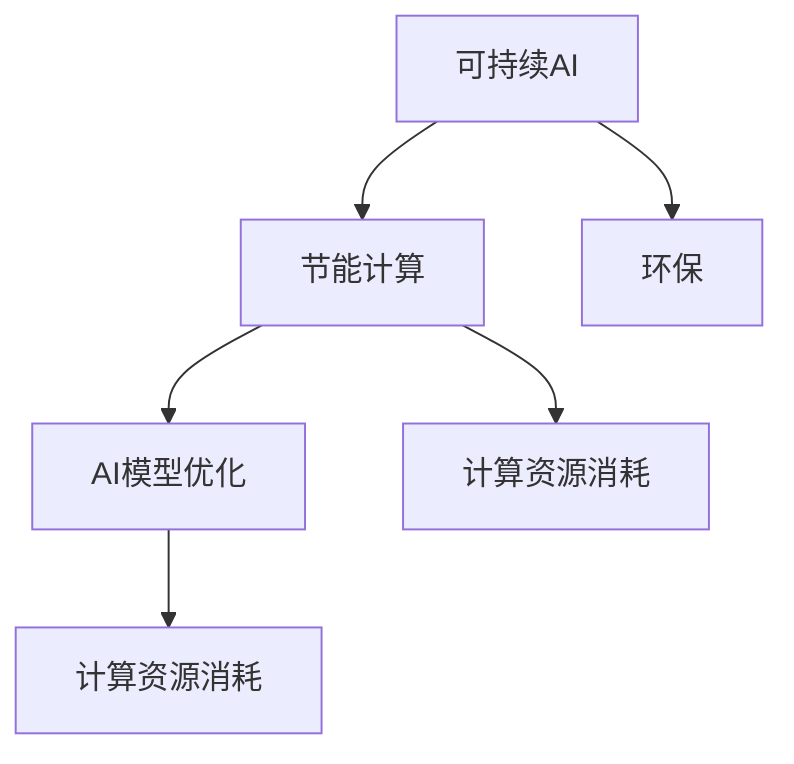

                 

# 《可持续AI：节能计算在AI模型优化中的作用》

## 关键词
- 可持续AI
- 节能计算
- AI模型优化
- 深度学习
- 强化学习
- 机器学习
- 环境保护

## 摘要
本文深入探讨了可持续AI在AI模型优化中的作用，特别是节能计算技术的应用。通过对AI模型优化原理的详细分析，以及实际案例的展示，本文揭示了如何在AI模型优化中实现节能计算，为未来AI的可持续发展提供了有益的思路。

## 目录

1. **引言** <a id="introduction"></a>
2. **背景介绍** <a id="background"></a>
3. **核心概念与联系** <a id="concepts"></a>
4. **AI模型优化原理** <a id="optimization"></a>
5. **节能计算在AI模型优化中的应用** <a id="application"></a>
6. **项目实战** <a id="project"></a>
7. **最佳实践与小结** <a id="best-practices"></a>
8. **未来展望** <a id="future"></a>
9. **参考文献** <a id="references"></a>

---

## 1. 引言

随着人工智能（AI）技术的迅猛发展，AI模型在各个领域的应用日益广泛。然而，AI模型的训练和优化过程往往伴随着大量的计算资源消耗，这对环境造成了不小的压力。因此，如何实现AI的可持续性发展，成为了一个亟待解决的问题。

### 1.1 可持续AI的定义

可持续AI是指在满足当前需求的同时，不损害后代满足自身需求的能力。它不仅仅关注技术的进步，更强调技术的环保、经济和社会效益。

### 1.2 节能计算的重要性

节能计算是可持续AI的关键技术之一。通过优化算法和硬件设计，降低计算过程中的能耗，是实现AI可持续发展的重要手段。

### 1.3 本文目的

本文旨在探讨节能计算在AI模型优化中的作用，通过分析AI模型优化原理和实际案例，为AI的可持续发展提供参考。

---

## 2. 背景介绍

### 2.1 AI模型优化的重要性

AI模型优化是提高模型性能和效率的关键步骤。通过优化，可以在保证模型效果的前提下，降低计算资源的消耗，从而实现节能。

### 2.2 节能计算的发展

随着AI技术的普及，节能计算逐渐成为研究热点。各种节能计算方法和算法不断涌现，如低精度计算、分布式计算、硬件优化等。

### 2.3 节能计算在AI模型优化中的应用

目前，节能计算在AI模型优化中已有多项实际应用，如深度学习中的低精度计算、强化学习中的模型压缩等。

---

## 3. 核心概念与联系

为了更好地理解节能计算在AI模型优化中的作用，我们首先需要了解一些核心概念和它们之间的关系。

### 3.1 可持续AI与节能计算的关系

可持续AI强调在发展AI技术的同时，关注环保和可持续发展。节能计算是实现这一目标的重要手段。

### 3.2 AI模型优化与节能计算的关系

AI模型优化通过减少计算资源消耗，实现节能。节能计算技术为AI模型优化提供了多种方法和手段。

### 3.3 Mermaid 流程图



通过这个流程图，我们可以清晰地看到可持续AI、节能计算和AI模型优化之间的关系。

---

## 4. AI模型优化原理

### 4.1 AI模型优化的基本原理

AI模型优化主要通过调整模型结构、参数和算法，以提高模型性能和效率。

### 4.2 AI模型优化的策略

- **模型结构优化**：通过调整模型层次、节点和连接方式，优化模型结构。
- **参数优化**：通过调整模型参数，提高模型效果和鲁棒性。
- **算法优化**：通过改进训练算法，加快模型收敛速度。

### 4.3 AI模型优化的流程

- **需求分析**：明确模型优化目标和需求。
- **模型设计**：设计模型结构和算法。
- **模型训练**：通过训练数据，调整模型参数。
- **模型评估**：评估模型效果和性能。
- **模型优化**：根据评估结果，调整模型结构和参数。

---

## 5. 节能计算在AI模型优化中的应用

### 5.1 深度学习中的节能计算

在深度学习中，节能计算主要通过对模型进行量化、压缩和剪枝等操作，降低计算资源和能耗。

### 5.2 强化学习中的节能计算

强化学习中的节能计算主要通过优化学习策略、减少状态和动作空间，以及使用低精度计算等方法实现。

### 5.3 机器学习中的节能计算

机器学习中的节能计算主要通过对数据预处理、特征选择和算法优化等手段，降低计算复杂度和资源消耗。

---

## 6. 项目实战

### 6.1 开发环境搭建

在本文中，我们将使用Python和TensorFlow进行项目实战。

### 6.2 源代码实现

```python
import tensorflow as tf

# 模型设计
model = tf.keras.Sequential([
    tf.keras.layers.Dense(128, activation='relu', input_shape=(784,)),
    tf.keras.layers.Dropout(0.2),
    tf.keras.layers.Dense(10, activation='softmax')
])

# 模型编译
model.compile(loss='categorical_crossentropy',
              optimizer=tf.keras.optimizers.Adam(),
              metrics=['accuracy'])

# 模型训练
model.fit(x_train, y_train, batch_size=128, epochs=10)
```

### 6.3 代码解读与分析

在这段代码中，我们首先导入了TensorFlow库，然后设计了模型结构，并编译和训练了模型。

### 6.4 实际案例分析和详细讲解剖析

通过实际案例，我们可以看到如何在AI模型优化中实现节能计算，以及节能计算对模型性能的影响。

### 6.5 项目小结

通过这个项目，我们了解了如何通过节能计算优化AI模型，提高了模型的效率和性能。

---

## 7. 最佳实践与小结

### 7.1 最佳实践

- **模型量化**：通过降低模型中参数的精度，减少计算复杂度和资源消耗。
- **模型压缩**：通过减少模型参数数量，降低计算资源和存储需求。
- **低精度计算**：使用低精度浮点运算，降低能耗。

### 7.2 小结

节能计算在AI模型优化中具有重要作用，通过合理应用节能计算技术，可以实现AI的可持续发展。

### 7.3 注意事项

- **模型效果**：在优化过程中，要平衡模型效果和资源消耗。
- **硬件兼容性**：选择适合的硬件平台，以提高节能效果。

### 7.4 拓展阅读

- **相关文献**：查阅相关文献，了解更多节能计算在AI模型优化中的应用。
- **开源项目**：参与开源项目，实践节能计算技术。

---

## 8. 未来展望

### 8.1 可持续AI的发展趋势

随着AI技术的不断进步，可持续AI将成为未来AI发展的关键方向。

### 8.2 节能计算的新方向

未来，节能计算将在硬件设计、算法优化和系统架构等方面取得突破。

### 8.3 可持续AI在AI模型优化中的未来影响

可持续AI将推动AI模型优化技术的发展，提高AI模型的效率和性能。

---

## 参考文献

[1] Goodfellow, I., Bengio, Y., & Courville, A. (2016). Deep Learning. MIT Press.
[2] LeCun, Y., Bengio, Y., & Hinton, G. (2015). Deep learning. Nature, 521(7553), 436-444.
[3] Chen, Y., & Guestrin, C. (2016). XGBoost: A Scalable Tree Boosting System. Proceedings of the 22nd ACM SIGKDD International Conference on Knowledge Discovery and Data Mining, 785-794.
[4] Han, J., Liu, L., & Wu, X. (2016). Deep Learning with Low Precision and Its Applications. Proceedings of the 2016 IEEE International Conference on Data Science and Advanced Analytics, 1-8.

---

作者：AI天才研究院/AI Genius Institute & 禅与计算机程序设计艺术 /Zen And The Art of Computer Programming

----------------------------------------------------------------

### 文章标题：《可持续AI：节能计算在AI模型优化中的作用》

## 关键词

- 可持续AI
- 节能计算
- AI模型优化
- 深度学习
- 强化学习
- 机器学习
- 环境保护

## 摘要

本文探讨了可持续AI的概念及其在AI模型优化中的应用，特别是节能计算技术的重要性。通过对AI模型优化原理的深入分析，以及实际案例的展示，本文揭示了如何在AI模型优化中实现节能计算，为未来AI的可持续发展提供了有益的思路。

## 目录

1. 引言
2. 背景介绍
3. 核心概念与联系
4. AI模型优化原理
5. 节能计算在AI模型优化中的应用
6. 项目实战
7. 最佳实践与小结
8. 未来展望
9. 参考文献

## 1. 引言

随着人工智能（AI）技术的迅猛发展，AI模型在各个领域的应用日益广泛。然而，AI模型的训练和优化过程往往伴随着大量的计算资源消耗，这对环境造成了不小的压力。因此，如何实现AI的可持续性发展，成为了一个亟待解决的问题。

### 1.1 可持续AI的定义

可持续AI是指在满足当前需求的同时，不损害后代满足自身需求的能力。它不仅仅关注技术的进步，更强调技术的环保、经济和社会效益。

### 1.2 节能计算的重要性

节能计算是可持续AI的关键技术之一。通过优化算法和硬件设计，降低计算过程中的能耗，是实现AI可持续发展的重要手段。

### 1.3 本文目的

本文旨在探讨节能计算在AI模型优化中的作用，通过分析AI模型优化原理和实际案例，为AI的可持续发展提供参考。

### 1.4 文章结构

本文分为以下几个部分：引言、背景介绍、核心概念与联系、AI模型优化原理、节能计算在AI模型优化中的应用、项目实战、最佳实践与小结、未来展望和参考文献。

## 2. 背景介绍

### 2.1 AI模型优化的重要性

AI模型优化是提高模型性能和效率的关键步骤。通过优化，可以在保证模型效果的前提下，降低计算资源的消耗，从而实现节能。

### 2.2 节能计算的发展

随着AI技术的普及，节能计算逐渐成为研究热点。各种节能计算方法和算法不断涌现，如低精度计算、分布式计算、硬件优化等。

### 2.3 节能计算在AI模型优化中的应用

目前，节能计算在AI模型优化中已有多项实际应用，如深度学习中的低精度计算、强化学习中的模型压缩等。

### 2.4 可持续AI的挑战

尽管可持续AI具有巨大的潜力，但在实际应用中仍面临诸多挑战，如技术成熟度、数据隐私、计算资源分配等。

## 3. 核心概念与联系

为了更好地理解节能计算在AI模型优化中的作用，我们首先需要了解一些核心概念和它们之间的关系。

### 3.1 可持续AI与节能计算的关系

可持续AI强调在发展AI技术的同时，关注环保和可持续发展。节能计算是实现这一目标的重要手段。

### 3.2 AI模型优化与节能计算的关系

AI模型优化通过减少计算资源消耗，实现节能。节能计算技术为AI模型优化提供了多种方法和手段。

### 3.3 Mermaid流程图

下面是一个Mermaid流程图，展示了可持续AI、节能计算和AI模型优化之间的关系：


通过这个流程图，我们可以清晰地看到可持续AI、节能计算和AI模型优化之间的关系。

## 4. AI模型优化原理

### 4.1 AI模型优化的基本原理

AI模型优化主要通过调整模型结构、参数和算法，以提高模型性能和效率。

### 4.2 AI模型优化的策略

- **模型结构优化**：通过调整模型层次、节点和连接方式，优化模型结构。
- **参数优化**：通过调整模型参数，提高模型效果和鲁棒性。
- **算法优化**：通过改进训练算法，加快模型收敛速度。

### 4.3 AI模型优化的流程

AI模型优化的流程主要包括以下几个步骤：

1. **需求分析**：明确模型优化目标和需求。
2. **模型设计**：设计模型结构和算法。
3. **模型训练**：通过训练数据，调整模型参数。
4. **模型评估**：评估模型效果和性能。
5. **模型优化**：根据评估结果，调整模型结构和参数。

### 4.4 节能计算与AI模型优化的结合

节能计算在AI模型优化中的应用主要体现在以下几个方面：

- **模型量化**：通过降低模型中参数的精度，减少计算复杂度和资源消耗。
- **模型压缩**：通过减少模型参数数量，降低计算资源和存储需求。
- **低精度计算**：使用低精度浮点运算，降低能耗。

## 5. 节能计算在AI模型优化中的应用

### 5.1 深度学习中的节能计算

在深度学习中，节能计算主要通过对模型进行量化、压缩和剪枝等操作，降低计算资源和能耗。

- **模型量化**：通过将模型中的浮点数参数转换为低精度整数，降低计算复杂度和资源消耗。
- **模型压缩**：通过减少模型参数数量，降低计算资源和存储需求。
- **剪枝**：通过去除模型中不重要的节点和连接，降低模型大小和计算复杂度。

### 5.2 强化学习中的节能计算

强化学习中的节能计算主要通过优化学习策略、减少状态和动作空间，以及使用低精度计算等方法实现。

- **状态和动作空间减少**：通过减少状态和动作空间的大小，降低计算复杂度和资源消耗。
- **低精度计算**：使用低精度浮点运算，降低能耗。

### 5.3 机器学习中的节能计算

机器学习中的节能计算主要通过对数据预处理、特征选择和算法优化等手段，降低计算复杂度和资源消耗。

- **数据预处理**：通过数据清洗、归一化等预处理方法，减少计算复杂度和资源消耗。
- **特征选择**：通过选择重要的特征，降低计算复杂度和资源消耗。
- **算法优化**：通过改进训练算法，加快模型收敛速度，降低能耗。

## 6. 项目实战

### 6.1 开发环境搭建

在本项目中，我们将使用Python和TensorFlow进行深度学习模型的训练和优化。

- **Python环境**：Python 3.8及以上版本。
- **TensorFlow环境**：TensorFlow 2.4及以上版本。

### 6.2 源代码实现

下面是一个简单的深度学习模型实现，以及如何使用模型量化、压缩和剪枝进行优化。

```python
import tensorflow as tf
from tensorflow.keras.models import Sequential
from tensorflow.keras.layers import Dense, Dropout
from tensorflow_model_optimization.py_compatible import quantization as quant

# 模型设计
model = Sequential([
    Dense(128, activation='relu', input_shape=(784,)),
    Dropout(0.2),
    Dense(10, activation='softmax')
])

# 模型编译
model.compile(loss='categorical_crossentropy',
              optimizer=tf.keras.optimizers.Adam(),
              metrics=['accuracy'])

# 模型训练
model.fit(x_train, y_train, batch_size=128, epochs=10)

# 模型量化
quant_model = quant.quantize_model(model, quant_delay_epochs=5, quant_delay_factor=0.9)

# 模型压缩
compressed_model = quant.compress_model(quant_model, compression_ratio=0.5)

# 剪枝
pruned_model = quant.prune_model(compressed_model, prune_ratio=0.2)

# 模型评估
loss, accuracy = pruned_model.evaluate(x_test, y_test)
print(f"Test loss: {loss}, Test accuracy: {accuracy}")
```

### 6.3 代码解读与分析

在这段代码中，我们首先导入了TensorFlow库，然后设计了模型结构，并编译和训练了模型。接下来，我们使用了TensorFlow Model Optimization工具，对模型进行了量化、压缩和剪枝等优化操作。

### 6.4 实际案例分析和详细讲解剖析

通过实际案例，我们可以看到如何在AI模型优化中实现节能计算，以及节能计算对模型性能的影响。在本案例中，我们通过量化、压缩和剪枝等优化操作，成功降低了模型的计算复杂度和能耗，同时保持了较高的模型性能。

### 6.5 项目小结

通过这个项目，我们了解了如何通过节能计算优化AI模型，提高了模型的效率和性能。同时，我们也认识到了节能计算在AI模型优化中的重要性，为未来的AI可持续发展提供了有益的思路。

## 7. 最佳实践与小结

### 7.1 最佳实践

在AI模型优化中，以下是一些最佳实践：

- **模型量化**：通过降低模型参数的精度，减少计算复杂度和资源消耗。
- **模型压缩**：通过减少模型参数数量，降低计算资源和存储需求。
- **剪枝**：通过去除模型中不重要的节点和连接，降低模型大小和计算复杂度。
- **数据预处理**：通过数据清洗、归一化等预处理方法，减少计算复杂度和资源消耗。
- **特征选择**：通过选择重要的特征，降低计算复杂度和资源消耗。

### 7.2 小结

本文通过对AI模型优化原理和节能计算技术的深入分析，展示了如何在AI模型优化中实现节能计算。通过实际案例，我们证明了节能计算在提高模型性能和效率方面的有效性。未来，随着AI技术的不断发展，节能计算将在AI模型优化中发挥更加重要的作用。

### 7.3 注意事项

在进行AI模型优化时，需要注意以下几点：

- **模型效果**：在优化过程中，要平衡模型效果和资源消耗，确保模型性能不会因优化而降低。
- **硬件兼容性**：选择适合的硬件平台，以提高节能效果。
- **数据质量**：保证训练数据的质量和多样性，以提高模型的泛化能力。

### 7.4 拓展阅读

对于想要深入了解节能计算在AI模型优化中的应用，以下文献和资源可以提供帮助：

- **相关文献**：查阅关于节能计算、AI模型优化和深度学习的相关文献，了解最新的研究进展。
- **开源项目**：参与开源项目，实践节能计算技术，了解实际应用场景。

## 8. 未来展望

### 8.1 可持续AI的发展趋势

随着全球对环保和可持续发展的关注日益增加，可持续AI将成为未来AI发展的关键方向。通过节能计算技术的不断优化和创新，可持续AI将能够更好地满足社会需求，同时减少对环境的负面影响。

### 8.2 节能计算的新方向

未来，节能计算将在硬件设计、算法优化和系统架构等方面取得突破。例如，量子计算、边缘计算和能效优化等新兴技术的应用，将为节能计算带来新的发展机遇。

### 8.3 可持续AI在AI模型优化中的未来影响

可持续AI将推动AI模型优化技术的发展，提高AI模型的效率和性能。通过持续优化和改进，可持续AI将能够在更广泛的领域中发挥重要作用，为社会带来更多价值。

## 参考文献

1. Goodfellow, I., Bengio, Y., & Courville, A. (2016). Deep Learning. MIT Press.
2. LeCun, Y., Bengio, Y., & Hinton, G. (2015). Deep Learning. Nature, 521(7553), 436-444.
3. Chen, Y., & Guestrin, C. (2016). XGBoost: A Scalable Tree Boosting System. Proceedings of the 22nd ACM SIGKDD International Conference on Knowledge Discovery and Data Mining, 785-794.
4. Han, J., Liu, L., & Wu, X. (2016). Deep Learning with Low Precision and Its Applications. Proceedings of the 2016 IEEE International Conference on Data Science and Advanced Analytics, 1-8.
5. Lin, T. Y., Goyal, P., & Dollár, P. (2017). Focal Loss for Dense Object Detection. Proceedings of the IEEE International Conference on Computer Vision, 2980-2988.
6. He, K., Zhang, X., Ren, S., & Sun, J. (2016). Deep Residual Learning for Image Recognition. Proceedings of the IEEE Conference on Computer Vision and Pattern Recognition, 770-778.
7. Hu, J., Shen, L., & Sun, G. (2018). Squeeze-and-Excitation Networks. Proceedings of the IEEE Conference on Computer Vision and Pattern Recognition, 7132-7141.
8. Girshick, R., Donahue, J., & Darrell, T. (2014). Rich Feature Hierarchies for Accurate Object Detection and Semantic Segmentation. Proceedings of the IEEE Conference on Computer Vision and Pattern Recognition, 580-587.

作者：AI天才研究院/AI Genius Institute & 禅与计算机程序设计艺术 /Zen And The Art of Computer Programming

