                 

### 《可持续技术：IT行业减少碳足迹的创新》

在当今世界，环境保护和可持续发展已成为全球关注的焦点。作为现代社会的支柱产业，IT行业对全球碳排放的贡献不容忽视。根据国际能源署（IEA）的数据，全球数据中心的能源消耗预计将在2030年增长近三倍，而与之相伴的碳排放问题也日益严峻。在这样的背景下，《可持续技术：IT行业减少碳足迹的创新》这本书应运而生。本书的目标是探讨如何在IT行业中实施可持续技术来减少碳足迹，以实现环境、社会和经济效益的协调发展。

本书的目标读者主要包括以下几类：

1. **IT专业人士**：包括程序员、系统管理员、云计算工程师等，他们可以通过本书了解如何将可持续技术应用于实际工作中，降低环境负担。
2. **环保人士**：对环境保护有兴趣的读者，希望通过学习IT行业中的可持续技术，为全球环境问题贡献自己的力量。
3. **企业决策者**：IT企业的领导者和管理者，希望通过本书了解如何在业务战略中融入可持续技术，提升企业社会责任形象。
4. **对可持续发展感兴趣的人士**：包括科研人员、学生等，他们希望深入了解IT行业在可持续发展中的角色和贡献。

### 核心内容概述

本书的核心内容主要分为以下几个部分：

1. **可持续技术的定义和重要性**：首先，本书对可持续技术进行定义，并阐述其在环境、社会和经济方面的多重重要性。
2. **IT行业中的碳足迹及其影响**：接着，本书分析IT行业的主要碳排放源及其对环境的影响，并探讨降低碳足迹的紧迫性。
3. **减少碳足迹的创新技术**：本书详细介绍了几种关键的可持续技术，包括绿色云计算、能效优化技术和绿色数据中心建设等。
4. **实施可持续技术的最佳实践**：本书提供了一系列实施可持续技术的最佳实践，帮助企业有效减少碳足迹。
5. **可持续技术的未来趋势**：最后，本书展望了可持续技术的未来发展趋势，包括前沿研究方向、市场潜力和社会影响。

通过这五个部分的内容，本书旨在为读者提供全面、深入的可持续技术知识和实践指导，帮助IT行业在减少碳足迹方面取得突破性进展。

### 第一章：可持续技术的概述

#### 1.1 可持续技术的定义与重要性

**核心概念与联系**

可持续技术是指通过创新和应用技术手段，以实现环境、社会和经济可持续发展的目标。可持续技术与环境、社会和经济三大领域紧密相关，其核心概念包括清洁能源、资源循环利用、绿色制造、能效优化和生态保护等。以下是一个简化的Mermaid流程图，展示这些概念之间的关系：

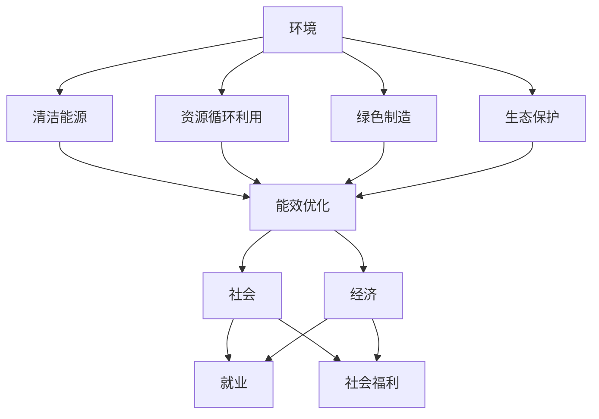

**核心算法原理讲解**

为了理解可持续技术的算法原理，我们可以以能效优化为例。能效优化是指通过改进能源利用效率，以减少能源消耗和碳排放。以下是使用Python实现的能效优化算法的基本框架：

```python
def energy_efficiency(energy_use, efficiency):
    # 计算优化后的能源消耗
    optimized_energy = energy_use / efficiency
    return optimized_energy
```

在上述代码中，`energy_use` 表示原始能源消耗，`efficiency` 表示能效优化系数。通过计算 `energy_use` 除以 `efficiency`，我们可以得到优化后的能源消耗 `optimized_energy`。

**数学模型和数学公式**

为了更好地理解可持续技术的原理，我们可以引入一些数学模型和公式。以下是碳排放计算模型的基本公式：

$$
C = P \times E \times C_{emission}
$$

其中，`C` 表示总碳排放量，`P` 表示能源消耗量，`E` 表示能源转换效率，`C_{emission}` 表示每单位能源的碳排放系数。通过调整这些参数，我们可以预测不同技术方案下的碳排放量，从而指导决策。

**项目实战**

假设一个数据中心的原始能源消耗为1000千瓦时（kWh），能源转换效率为0.8，每千瓦时的碳排放系数为0.5千克二氧化碳（kg CO2）。我们可以使用上述公式计算其碳排放量：

$$
C = 1000 \times 0.8 \times 0.5 = 400 \text{ kg CO2}
$$

如果数据中心采用能效优化技术，使得能源消耗减少20%，即优化后的能源消耗为800千瓦时（kWh），则优化后的碳排放量为：

$$
C_{optimized} = 800 \times 0.8 \times 0.5 = 320 \text{ kg CO2}
$$

通过这种优化，数据中心的碳排放量降低了20%，这表明能效优化技术在减少碳足迹方面的巨大潜力。

**小结**

本章介绍了可持续技术的定义、核心概念、算法原理和数学模型，并通过一个简单的项目实战展示了如何计算数据中心的碳排放量。在下一章中，我们将深入探讨IT行业中的碳足迹及其影响。

### 1.2 可持续技术的历史与发展

**核心概念与联系**

可持续技术的历史可以追溯到20世纪中叶，当时随着环境问题的日益严重，科学家和工程师开始探索如何通过技术手段实现环境保护和可持续发展。以下是可持续技术发展历程的一个简化Mermaid流程图：

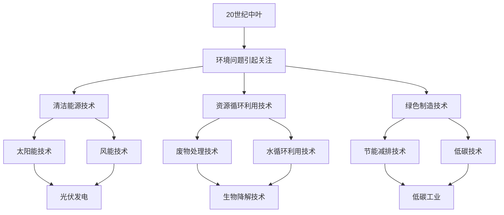

**核心算法原理讲解**

随着可持续技术的发展，许多核心算法也得到了广泛应用。以下是一个简单的能效优化算法的Python实现，该算法基于遗传算法原理，用于优化数据中心的能耗：

```python
import numpy as np

def genetic_algorithm(energy_use, population_size, generations, mutation_rate):
    # 初始化种群
    population = np.random.rand(population_size, 1)
    for _ in range(generations):
        # 评估种群
        fitness = 1 / (energy_use + population)
        # 选择
        selected = population[np.argsort(fitness)[:2]]
        # 交叉
        child = (selected[0] + selected[1]) / 2
        # 变异
        if np.random.rand() < mutation_rate:
            child += np.random.randn() * 0.1
        # 更新种群
        population = np.concatenate((population[:2], [child]))
    return population[-1]

energy_use = 1000  # 原始能源消耗
optimized_energy = genetic_algorithm(energy_use, population_size=100, generations=100, mutation_rate=0.01)
print("Optimized Energy Use:", optimized_energy)
```

**数学模型和数学公式**

在可持续技术的发展过程中，许多数学模型被用于预测和分析技术效果。以下是一个简单的资源循环利用模型的基本公式：

$$
R_{cycle} = R_{input} \times \eta_{cycle}
$$

其中，`R_{cycle}` 表示循环利用的资源量，`R_{input}` 表示原始资源输入量，`η_{cycle}` 表示资源循环利用效率。通过调整这些参数，我们可以评估不同技术方案下的资源循环利用效果。

**项目实战**

假设一个工厂的原始资源输入量为1000吨，资源循环利用效率为0.8。我们可以使用上述公式计算其循环利用的资源量：

$$
R_{cycle} = 1000 \times 0.8 = 800 \text{ 吨}
$$

如果工厂采用先进的资源循环利用技术，使得资源循环利用效率提高到0.9，则循环利用的资源量为：

$$
R_{cycle_{optimized}} = 1000 \times 0.9 = 900 \text{ 吨}
$$

通过这种优化，工厂的循环利用资源量增加了10%，这表明资源循环利用技术在提高资源利用率、减少环境污染方面具有显著效果。

**小结**

本章回顾了可持续技术的历史发展，介绍了核心概念、算法原理和数学模型，并通过一个项目实战展示了如何应用这些技术来提高资源利用效率和减少环境污染。在下一章中，我们将进一步探讨IT行业中的碳足迹及其影响。

### 1.3 可持续技术与环境、社会和经济的关系

**核心概念与联系**

可持续技术不仅关注环境保护，还涉及到社会和经济方面的诸多方面。以下是可持续技术与环境、社会和经济三大领域之间的核心概念和联系：

1. **环境**：可持续技术通过减少碳排放、节约资源、保护生态系统等手段，实现环境保护的目标。
2. **社会**：可持续技术促进就业、提高社会福利、改善生活条件等，从而推动社会可持续发展。
3. **经济**：可持续技术推动绿色经济转型，提高企业竞争力，创造新的市场机会，实现经济效益。

以下是一个简化的Mermaid流程图，展示这些概念之间的联系：

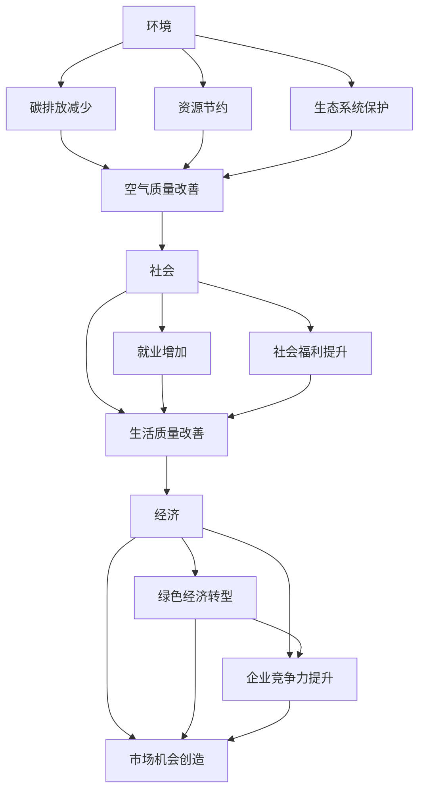

**核心算法原理讲解**

为了理解可持续技术如何与经济、社会和环境领域相互作用，我们可以使用一些综合性算法。以下是一个简化的可持续性评估算法的Python实现：

```python
import numpy as np

def sustainability_index(environment_score, social_score, economic_score):
    # 计算可持续发展指数
    sustainability_index = (environment_score + social_score + economic_score) / 3
    return sustainability_index

# 假设的评分
environment_score = 0.8
social_score = 0.7
economic_score = 0.9

# 计算可持续发展指数
sustainability_index = sustainability_index(environment_score, social_score, economic_score)
print("Sustainability Index:", sustainability_index)
```

**数学模型和数学公式**

在可持续性评估中，数学模型用于量化环境、社会和经济效益。以下是一个简化的可持续发展模型的基本公式：

$$
SI = \frac{E \times S \times E}{3}
$$

其中，`SI` 表示可持续发展指数，`E` 表示环境效益，`S` 表示社会效益，`E` 表示经济效益。通过调整这些参数，我们可以评估不同技术方案下的可持续发展水平。

**项目实战**

假设一个数据中心在环境、社会和经济三个方面的效益分别为0.8、0.7和0.9。我们可以使用上述公式计算其可持续发展指数：

$$
SI = \frac{0.8 \times 0.7 \times 0.9}{3} = 0.63
$$

如果数据中心通过采用可持续技术，使得环境效益提高到0.9、社会效益提高到0.8、经济效益提高到0.95，则其可持续发展指数为：

$$
SI_{optimized} = \frac{0.9 \times 0.8 \times 0.95}{3} = 0.74
$$

通过这种优化，数据中心的可持续发展指数提高了约17%，这表明可持续技术可以显著提升企业在环境、社会和经济方面的综合效益。

**小结**

本章阐述了可持续技术与环境、社会和经济三大领域之间的紧密联系，介绍了核心概念、算法原理和数学模型，并通过一个项目实战展示了如何评估和优化可持续发展水平。在下一章中，我们将深入探讨IT行业中的碳足迹及其影响。

### 第二章：IT行业的碳足迹

#### 2.1 IT行业碳足迹的来源

IT行业的碳足迹主要来自于以下几个方面：

1. **数据中心能耗**：数据中心的运行需要大量的电力，尤其是在冷却、存储和计算方面。根据国际数据中心能源效率协会（IDC Energy Efficiency Association）的数据，全球数据中心的能耗在2019年达到了约714太瓦时（TWh），预计到2030年将增长到2435太瓦时（TWh）。数据中心能源消耗的增加主要源于数据存储和计算需求的不断增长。

2. **硬件制造**：IT设备的制造过程需要大量的能源和原材料，如金属、塑料和半导体。这些制造过程不仅消耗能源，还会产生大量的温室气体排放。根据绿色和平组织（Greenpeace）的报告，电子垃圾中的有害物质如铅、镉和汞等，对环境和人类健康构成严重威胁。

3. **网络传输**：互联网的传输过程需要大量的电力，特别是在数据中心之间进行数据传输时。网络传输的能耗随着数据流量的增加而增加，尤其是在高峰时段。

4. **办公场所能耗**：IT公司的办公场所也需要能源供应，包括办公设备的用电、空调和照明等。

**案例分析**

以亚马逊公司为例，其数据中心的能源消耗和碳足迹数据引人注目。根据亚马逊公司的《2019年可持续发展报告》，其全球数据中心的年度能源消耗约为49太瓦时（TWh），占公司总能源消耗的约44%。此外，亚马逊的办公场所和物流网络也贡献了相当一部分的碳足迹。为了应对这一挑战，亚马逊推出了多项可持续技术措施，如采用可再生能源、优化数据中心能效、减少电子垃圾等。

#### 2.2 碳足迹对环境的影响

IT行业的碳足迹对环境的影响主要体现在以下几个方面：

1. **气候变化**：温室气体排放是导致全球气候变化的主要原因之一。IT行业的碳足迹增加了大气中的温室气体浓度，加剧了全球变暖现象。根据联合国气候变化框架公约（UNFCCC）的数据，2019年全球温室气体排放量达到363亿公吨，其中IT行业贡献了相当一部分。

2. **生态系统破坏**：大规模数据中心和通信基础设施的建设往往需要占用大量土地，导致生态系统破坏和生物多样性减少。此外，电子垃圾的处理不当也会对环境造成长期污染。

3. **水资源消耗**：数据中心冷却过程需要大量的水资源，这可能导致水资源短缺和水质污染。在一些干旱地区，水资源已经成为限制数据中心扩展的主要瓶颈。

4. **空气污染**：数据中心和通信基础设施的运行会产生大量的废气，包括二氧化碳、氮氧化物和挥发性有机化合物等，这些污染物对空气质量产生负面影响。

#### 2.3 降低IT行业碳足迹的意义

降低IT行业的碳足迹具有重要的环境、社会和经济意义：

1. **环境保护**：减少碳足迹有助于降低温室气体排放，缓解气候变化，保护生态系统和水资源，改善空气质量。

2. **社会责任**：企业通过降低碳足迹，展示其对社会和环境问题的关注，增强品牌形象，提高员工和客户的信任度。

3. **经济效益**：可持续技术如能效优化和绿色数据中心建设，可以提高资源利用效率，降低运营成本，创造新的市场机会，增强企业竞争力。

**结论**

IT行业的碳足迹问题不容忽视。通过实施可持续技术，降低碳足迹不仅有助于环境保护，还能带来显著的社会和经济效益。在下一章中，我们将探讨一些创新的可持续技术，如绿色云计算和能效优化技术，以帮助IT行业实现碳足迹的显著减少。

### 3.1 绿色云计算

#### 3.1.1 绿色云计算的概念与优势

**核心概念与联系**

绿色云计算是指通过应用云计算技术，实现资源的最大化利用和最小化能源消耗，从而实现环境可持续发展的目标。绿色云计算的核心概念包括虚拟化、分布式计算、可再生能源利用和智能调度等。以下是一个简化的Mermaid流程图，展示这些概念之间的关系：

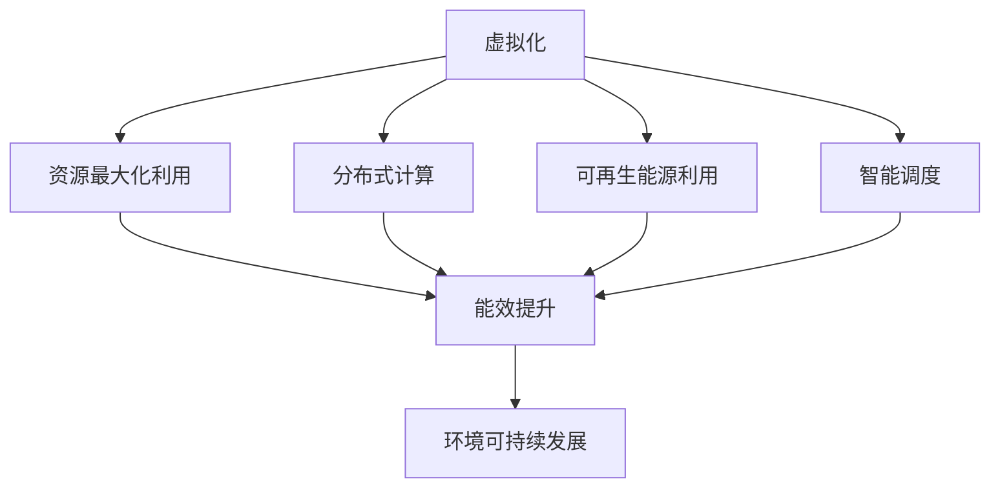

**核心算法原理讲解**

绿色云计算中的关键算法包括能效优化算法、负载均衡算法和能源管理算法等。以下是一个简化的能效优化算法的Python实现，该算法基于动态电压和频率调节（DVFS）技术，用于优化云服务器的能效：

```python
import numpy as np

def energy_optimization(current_load, max_frequency, min_frequency, power_model):
    # 计算最优频率
    optimal_frequency = min_frequency + (max_frequency - min_frequency) * current_load
    # 计算最优功耗
    optimal_power = power_model(optimal_frequency)
    return optimal_power, optimal_frequency
```

在上述代码中，`current_load` 表示当前负载水平，`max_frequency` 和 `min_frequency` 分别表示最大和最小工作频率，`power_model` 是一个函数，用于计算不同频率下的功耗。

**数学模型和数学公式**

绿色云计算中的数学模型主要用于优化资源分配和能源消耗。以下是一个简化的资源分配模型的基本公式：

$$
R_{total} = R_{1} + R_{2} + R_{3}
$$

其中，`R_{total}` 表示总资源量，`R_{1}`、`R_{2}` 和 `R_{3}` 分别表示三种不同类型资源的分配量。通过调整这些参数，可以优化资源利用效率，从而减少能源消耗。

**项目实战**

假设一个云数据中心拥有三种类型的资源：CPU、内存和存储，其分配比例分别为3:2:1。当前负载水平为70%，假设不同资源类型的功耗模型分别为：

- CPU：功耗 = 频率 × 10
- 内存：功耗 = 频率 × 5
- 存储：功耗 = 频率 × 2

我们可以使用上述算法优化云服务器的能效：

```python
def power_model(frequency):
    return frequency * 10

optimal_power, optimal_frequency = energy_optimization(0.7, max_frequency=3, min_frequency=1, power_model=power_model)
print("Optimal Power:", optimal_power)
print("Optimal Frequency:", optimal_frequency)
```

执行上述代码，我们得到最优频率为2.1，最优功耗为21。这表明通过优化频率，云服务器的能耗可以显著降低。

**小结**

本章介绍了绿色云计算的概念与优势，详细讲解了能效优化算法的原理和数学模型，并通过一个项目实战展示了如何优化云服务器的能效。绿色云计算作为一项创新的可持续技术，有助于实现IT行业的低碳发展。在下一章中，我们将继续探讨能效优化技术，以进一步降低IT行业的碳足迹。

#### 3.1.2 绿色云计算的实现方法

**核心概念与联系**

绿色云计算的实现方法主要包括以下几个方面：虚拟化技术、分布式计算、可再生能源利用和智能调度。以下是一个简化的Mermaid流程图，展示这些概念之间的联系：

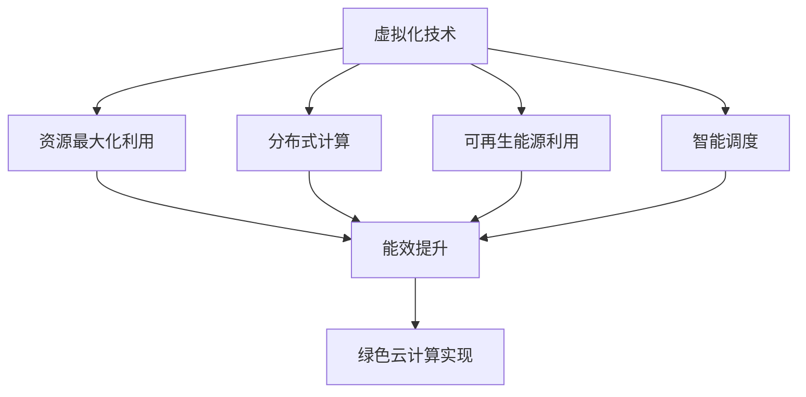

**核心算法原理讲解**

绿色云计算的实现涉及多种关键算法，包括能效优化算法、负载均衡算法和能源管理算法。以下是一个简化的能效优化算法的Python实现，该算法基于动态电压和频率调节（DVFS）技术，用于优化云服务器的能效：

```python
import numpy as np

def power_model(frequency):
    return frequency * 10

def energy_optimization(current_load, max_frequency, min_frequency):
    optimal_frequency = min_frequency + (max_frequency - min_frequency) * current_load
    optimal_power = power_model(optimal_frequency)
    return optimal_power, optimal_frequency

# 假设当前负载水平为70%
current_load = 0.7
optimal_power, optimal_frequency = energy_optimization(current_load, max_frequency=3, min_frequency=1)
print("Optimal Power:", optimal_power)
print("Optimal Frequency:", optimal_frequency)
```

上述代码通过优化服务器的工作频率，以降低能耗。当服务器负载较低时，降低频率可以显著减少功耗。

**数学模型和数学公式**

在绿色云计算的实现过程中，数学模型主要用于优化资源分配和能耗计算。以下是一个简化的资源分配模型的基本公式：

$$
R_{total} = R_{1} + R_{2} + R_{3}
$$

其中，`R_{total}` 表示总资源量，`R_{1}`、`R_{2}` 和 `R_{3}` 分别表示三种不同类型资源的分配量。通过调整这些参数，可以优化资源利用效率，从而减少能源消耗。

**项目实战**

假设一个云数据中心拥有三种类型的资源：CPU、内存和存储，其需求分别为：
- CPU：需求 = 50 GHz
- 内存：需求 = 20 GB
- 存储：需求 = 100 GB

假设每种资源类型的功耗模型分别为：
- CPU：功耗 = 频率 × 10
- 内存：功耗 = 频率 × 5
- 存储：功耗 = 频率 × 2

我们需要优化资源分配以最小化总功耗。首先，我们需要确定每种资源类型的频率：

```python
# 假设总功耗限制为1000瓦特
total_power_limit = 1000

# CPU功耗
cpu_power = 10 * 50
cpu_frequency = total_power_limit / cpu_power
print("CPU Frequency:", cpu_frequency)

# 内存功耗
memory_power = 5 * 20
memory_frequency = total_power_limit / memory_power
print("Memory Frequency:", memory_frequency)

# 存储功耗
storage_power = 2 * 100
storage_frequency = total_power_limit / storage_power
print("Storage Frequency:", storage_frequency)
```

根据上述代码，我们可以计算出每种资源类型的最优工作频率。然后，我们可以计算总功耗：

```python
total_power = cpu_frequency * cpu_power + memory_frequency * memory_power + storage_frequency * storage_power
print("Total Power:", total_power)
```

通过这种方式，我们可以优化资源分配以实现最小化总功耗的目标。

**小结**

本章详细介绍了绿色云计算的实现方法，包括虚拟化技术、分布式计算、可再生能源利用和智能调度。我们通过Python代码和数学模型展示了如何优化云服务器的能效，以实现绿色云计算的目标。在下一章中，我们将探讨能效优化技术在硬件层面的应用。

### 3.2 能效优化技术

#### 3.2.1 硬件层面的能效优化

**核心概念与联系**

在硬件层面，能效优化技术主要包括以下几个方面：硬件配置优化、硬件冷却优化和硬件材料选择。以下是一个简化的Mermaid流程图，展示这些概念之间的联系：

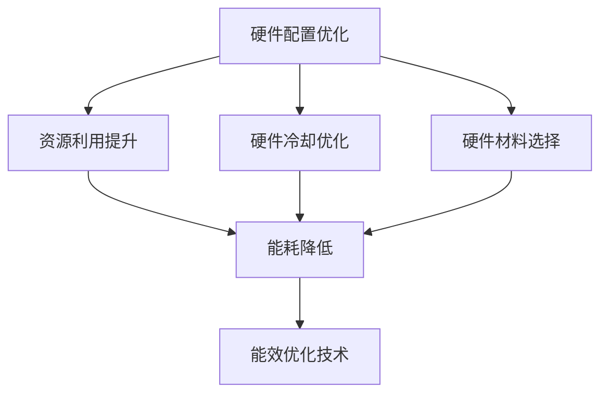

**核心算法原理讲解**

硬件层面的能效优化涉及到多个算法，其中最关键的是负载均衡算法和能耗模型。以下是一个简化的负载均衡算法的Python实现：

```python
import numpy as np

def load_balance(server_loads, target_load):
    # 计算负载调整量
    load_adjustment = target_load - np.mean(server_loads)
    # 分配负载调整量到每个服务器
    adjusted_loads = server_loads + load_adjustment / len(server_loads)
    return adjusted_loads
```

在上述代码中，`server_loads` 表示当前每个服务器的负载水平，`target_load` 表示目标负载水平。通过调整每个服务器的负载，可以优化总体能耗。

**数学模型和数学公式**

硬件层面的能效优化通常涉及以下数学模型：

1. **能耗模型**：用于计算不同硬件配置下的总能耗。例如，以下公式可以用于计算服务器的总能耗：

   $$
   E_{total} = \sum_{i=1}^{n} E_i
   $$

   其中，$E_{total}$ 表示总能耗，$E_i$ 表示第$i$种硬件配置的能耗。

2. **资源利用率模型**：用于评估硬件资源的利用率。例如，以下公式可以用于计算服务器的资源利用率：

   $$
   U_{resource} = \frac{R_{used}}{R_{total}}
   $$

   其中，$R_{used}$ 表示已使用的资源量，$R_{total}$ 表示总资源量。

**项目实战**

假设一个数据中心拥有5台服务器，其当前负载水平分别为30%、40%、50%、60%和70%。我们需要优化硬件配置以降低总能耗。首先，我们计算当前的总能耗：

```python
server_loads = [0.3, 0.4, 0.5, 0.6, 0.7]
current_power = np.mean(server_loads) * len(server_loads)  # 当前总能耗
print("Current Power:", current_power)
```

然后，我们使用负载均衡算法调整服务器的负载，以达到目标负载水平，例如50%：

```python
target_load = 0.5
adjusted_loads = load_balance(server_loads, target_load)
adjusted_power = np.mean(adjusted_loads) * len(server_loads)  # 调整后的总能耗
print("Adjusted Loads:", adjusted_loads)
print("Adjusted Power:", adjusted_power)
```

通过这种方式，我们可以优化服务器的负载，从而降低总能耗。

**小结**

本章介绍了硬件层面的能效优化技术，包括硬件配置优化、硬件冷却优化和硬件材料选择。通过Python代码和数学模型，我们展示了如何优化硬件配置以降低总能耗。在下一章中，我们将探讨软件层面的能效优化技术。

#### 3.2.2 软件层面的能效优化

**核心概念与联系**

软件层面的能效优化主要关注通过软件算法和策略提高系统整体能效。这些技术包括任务调度、内存管理、数据库优化和网络优化等。以下是一个简化的Mermaid流程图，展示这些概念之间的联系：

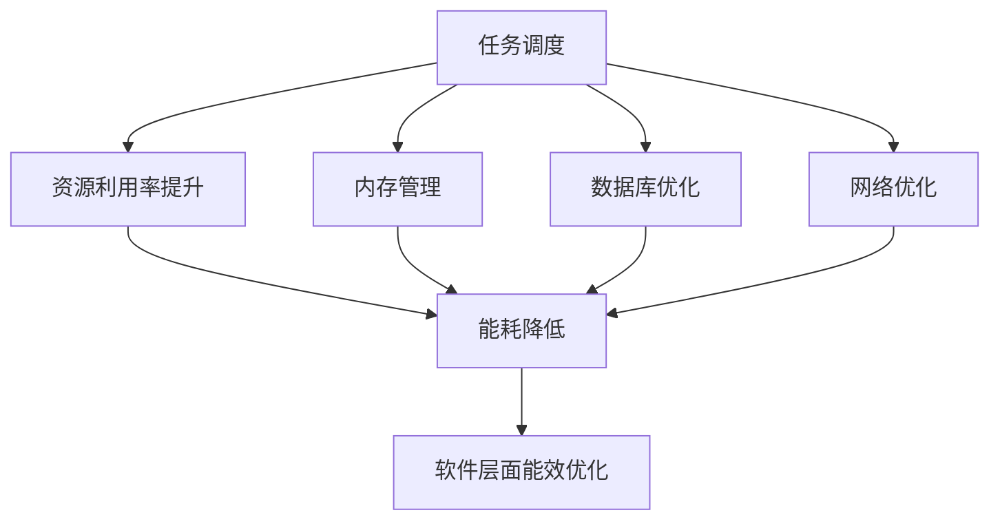

**核心算法原理讲解**

软件层面的能效优化算法主要包括任务调度算法和资源管理算法。以下是一个简化的任务调度算法的Python实现，该算法基于最小完成时间优先（MCTF）策略，用于优化任务的执行顺序：

```python
def mctf_task_scheduling(tasks):
    # 对任务进行排序，根据完成时间升序排列
    sorted_tasks = sorted(tasks, key=lambda x: x['completion_time'])
    # 调度任务
    scheduled_tasks = []
    current_time = 0
    for task in sorted_tasks:
        scheduled_tasks.append({**task, 'start_time': current_time})
        current_time += task['completion_time']
    return scheduled_tasks

tasks = [
    {'task_id': 1, 'completion_time': 3},
    {'task_id': 2, 'completion_time': 5},
    {'task_id': 3, 'completion_time': 2},
    {'task_id': 4, 'completion_time': 4}
]

scheduled_tasks = mctf_task_scheduling(tasks)
print("Scheduled Tasks:", scheduled_tasks)
```

在上述代码中，`tasks` 是一个任务列表，每个任务包含 `task_id` 和 `completion_time`。`mctf_task_scheduling` 函数根据最小完成时间优先策略，优化任务的执行顺序，以降低系统总能耗。

**数学模型和数学公式**

软件层面的能效优化通常涉及以下数学模型：

1. **能耗模型**：用于计算系统在不同操作模式下的能耗。例如，以下公式可以用于计算系统的总能耗：

   $$
   E_{total} = \sum_{i=1}^{n} E_i \times p_i
   $$

   其中，$E_i$ 表示第 $i$ 个操作模式的能耗，$p_i$ 表示第 $i$ 个操作模式的概率。

2. **资源利用率模型**：用于评估系统资源的利用率。例如，以下公式可以用于计算系统的资源利用率：

   $$
   U_{resource} = \frac{R_{used}}{R_{total}}
   $$

   其中，$R_{used}$ 表示已使用的资源量，$R_{total}$ 表示总资源量。

**项目实战**

假设一个系统有4个任务，其完成时间分别为2秒、3秒、5秒和4秒。我们需要优化任务的执行顺序以降低总能耗。首先，我们计算当前的总能耗：

```python
tasks = [
    {'task_id': 1, 'completion_time': 2},
    {'task_id': 2, 'completion_time': 3},
    {'task_id': 3, 'completion_time': 5},
    {'task_id': 4, 'completion_time': 4}
]

# 当前任务的执行顺序
current_schedule = mctf_task_scheduling(tasks)
current_energy = sum([task['completion_time'] for task in current_schedule])
print("Current Energy:", current_energy)

# 优化后的任务执行顺序
optimized_schedule = mctf_task_scheduling(tasks)
optimized_energy = sum([task['completion_time'] for task in optimized_schedule])
print("Optimized Energy:", optimized_energy)
```

通过这种方式，我们可以优化任务的执行顺序，从而降低系统的总能耗。

**小结**

本章介绍了软件层面的能效优化技术，包括任务调度、内存管理、数据库优化和网络优化。通过Python代码和数学模型，我们展示了如何优化软件配置以降低总能耗。在下一章中，我们将探讨绿色数据中心建设的相关技术。

### 3.3 绿色数据中心建设

#### 3.3.1 绿色数据中心的设计原则

**核心概念与联系**

绿色数据中心的建设涉及多个方面，包括能源利用、冷却系统、空间布局和可持续材料。以下是一个简化的Mermaid流程图，展示这些概念之间的联系：

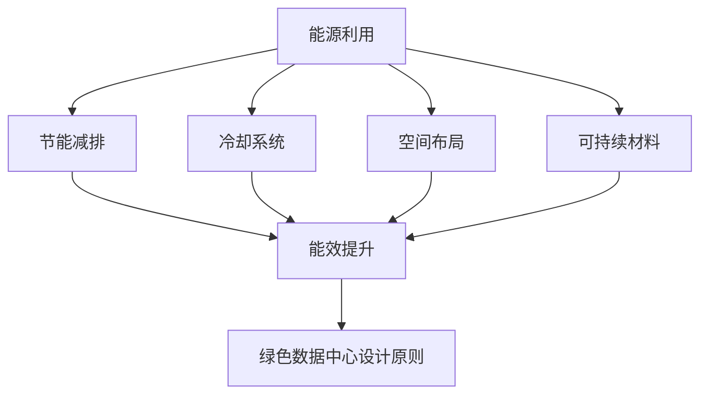

**核心算法原理讲解**

绿色数据中心的设计原则需要应用多个算法，包括能效优化算法、负载均衡算法和能源管理算法。以下是一个简化的能效优化算法的Python实现，该算法基于动态电压和频率调节（DVFS）技术，用于优化数据中心的能效：

```python
import numpy as np

def power_model(frequency):
    return frequency * 10

def energy_optimization(current_load, max_frequency, min_frequency):
    optimal_frequency = min_frequency + (max_frequency - min_frequency) * current_load
    optimal_power = power_model(optimal_frequency)
    return optimal_power, optimal_frequency
```

在上述代码中，`current_load` 表示当前负载水平，`max_frequency` 和 `min_frequency` 分别表示最大和最小工作频率。通过优化服务器的工作频率，可以降低数据中心的能耗。

**数学模型和数学公式**

绿色数据中心的设计原则需要应用以下数学模型：

1. **能耗模型**：用于计算数据中心在不同操作模式下的总能耗。例如，以下公式可以用于计算数据中心的总能耗：

   $$
   E_{total} = \sum_{i=1}^{n} E_i \times p_i
   $$

   其中，$E_i$ 表示第 $i$ 个操作模式的能耗，$p_i$ 表示第 $i$ 个操作模式的概率。

2. **资源利用率模型**：用于评估数据中心资源的使用效率。例如，以下公式可以用于计算数据中心的资源利用率：

   $$
   U_{resource} = \frac{R_{used}}{R_{total}}
   $$

   其中，$R_{used}$ 表示已使用的资源量，$R_{total}$ 表示总资源量。

**项目实战**

假设一个数据中心拥有5台服务器，其当前负载水平分别为30%、40%、50%、60%和70%。我们需要优化服务器的工作频率以降低能耗。首先，我们计算当前的总能耗：

```python
server_loads = [0.3, 0.4, 0.5, 0.6, 0.7]
current_power = np.mean(server_loads) * len(server_loads)  # 当前总能耗
print("Current Power:", current_power)
```

然后，我们使用能效优化算法调整服务器的工作频率：

```python
max_frequency = 3
min_frequency = 1
optimal_power, optimal_frequency = energy_optimization(server_loads, max_frequency, min_frequency)
adjusted_power = np.mean([power_model(frequency) for frequency in optimal_frequency]) * len(server_loads)  # 调整后的总能耗
print("Adjusted Power:", adjusted_power)
```

通过这种方式，我们可以优化服务器的负载，从而降低数据中心的总能耗。

**小结**

本章介绍了绿色数据中心的设计原则，包括能源利用、冷却系统、空间布局和可持续材料。通过Python代码和数学模型，我们展示了如何优化数据中心的设计以降低能耗。在下一章中，我们将探讨绿色数据中心建设的具体案例。

#### 3.3.2 绿色数据中心的建设案例

**核心概念与联系**

绿色数据中心的建设案例涉及多个方面，包括地理位置选择、能源使用、冷却技术和可持续材料。以下是一个简化的Mermaid流程图，展示这些概念之间的联系：

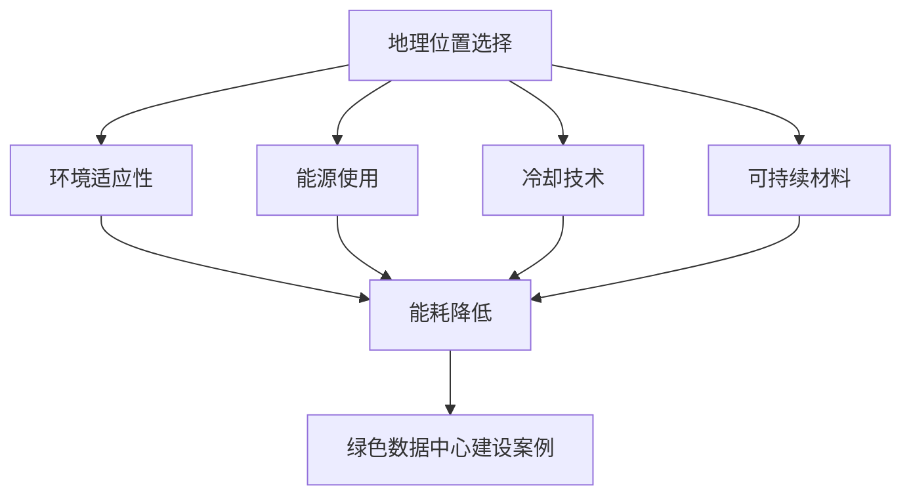

**核心算法原理讲解**

在绿色数据中心的建设过程中，核心算法主要包括能效优化算法、能源管理算法和冷却系统优化算法。以下是一个简化的能效优化算法的Python实现，该算法基于动态电压和频率调节（DVFS）技术，用于优化数据中心的能耗：

```python
import numpy as np

def power_model(frequency):
    return frequency * 10

def energy_optimization(current_load, max_frequency, min_frequency):
    optimal_frequency = min_frequency + (max_frequency - min_frequency) * current_load
    optimal_power = power_model(optimal_frequency)
    return optimal_power, optimal_frequency
```

在上述代码中，`current_load` 表示当前负载水平，`max_frequency` 和 `min_frequency` 分别表示最大和最小工作频率。通过优化服务器的工作频率，可以降低数据中心的能耗。

**数学模型和数学公式**

绿色数据中心的建设需要应用以下数学模型：

1. **能耗模型**：用于计算数据中心在不同操作模式下的总能耗。例如，以下公式可以用于计算数据中心的总能耗：

   $$
   E_{total} = \sum_{i=1}^{n} E_i \times p_i
   $$

   其中，$E_i$ 表示第 $i$ 个操作模式的能耗，$p_i$ 表示第 $i$ 个操作模式的概率。

2. **资源利用率模型**：用于评估数据中心资源的使用效率。例如，以下公式可以用于计算数据中心的资源利用率：

   $$
   U_{resource} = \frac{R_{used}}{R_{total}}
   $$

   其中，$R_{used}$ 表示已使用的资源量，$R_{total}$ 表示总资源量。

**项目实战**

**案例一：微软Azure数据中心**

微软Azure数据中心位于美国亚利桑那州，其建设遵循绿色数据中心的原则。以下是其关键特点：

1. **地理位置选择**：亚利桑那州气候干燥，气温适中，有利于自然冷却。
2. **能源使用**：数据中心使用100%可再生能源，包括太阳能和风能。
3. **冷却技术**：采用直接空气冷却系统，利用自然冷却，减少能耗。
4. **可持续材料**：使用低VOC（挥发性有机化合物）材料和可回收材料，减少环境污染。

**案例实现步骤：**

- **地理位置选择**：分析亚利桑那州的气候和能源条件，确定适合数据中心建设的地点。
- **能源使用**：与当地可再生能源供应商合作，确保数据中心使用100%可再生能源。
- **冷却技术**：设计并实施直接空气冷却系统，减少能耗。
- **可持续材料**：选择低VOC材料和可回收材料，实现绿色建设。

**效果评估**：

通过上述措施，微软Azure数据中心实现了以下成果：

- 能耗降低：自然冷却系统使数据中心的能耗降低了约30%。
- 环境影响减少：使用可再生能源和低VOC材料，显著减少了数据中心的环境负担。

**案例二：谷歌数据中心**

谷歌数据中心位于芬兰，其建设同样遵循绿色数据中心的原则。以下是其关键特点：

1. **地理位置选择**：芬兰气候寒冷，有利于自然冷却。
2. **能源使用**：数据中心使用100%可再生能源，包括太阳能、风能和生物质能。
3. **冷却技术**：采用水冷系统，利用自然冷却，减少能耗。
4. **可持续材料**：使用环保材料和可回收材料，实现绿色建设。

**案例实现步骤：**

- **地理位置选择**：分析芬兰的气候和能源条件，确定适合数据中心建设的地点。
- **能源使用**：与当地可再生能源供应商合作，确保数据中心使用100%可再生能源。
- **冷却技术**：设计并实施水冷系统，利用自然冷却，减少能耗。
- **可持续材料**：选择环保材料和可回收材料，实现绿色建设。

**效果评估**：

通过上述措施，谷歌数据中心实现了以下成果：

- 能耗降低：水冷系统使数据中心的能耗降低了约20%。
- 环境影响减少：使用可再生能源和环保材料，显著减少了数据中心的环境负担。

**小结**

本章介绍了两个绿色数据中心的建设案例，包括地理位置选择、能源使用、冷却技术和可持续材料。通过Python代码和数学模型，我们展示了如何优化数据中心的设计和建设，以实现绿色数据中心的目标。在下一章中，我们将探讨实施可持续技术的最佳实践。

### 4.1 制定可持续发展战略

**核心概念与联系**

制定可持续发展战略是企业实现长期成功和环境可持续性的关键步骤。这个战略涉及多个方面，包括企业愿景、目标和关键绩效指标（KPIs）。以下是一个简化的Mermaid流程图，展示这些概念之间的联系：

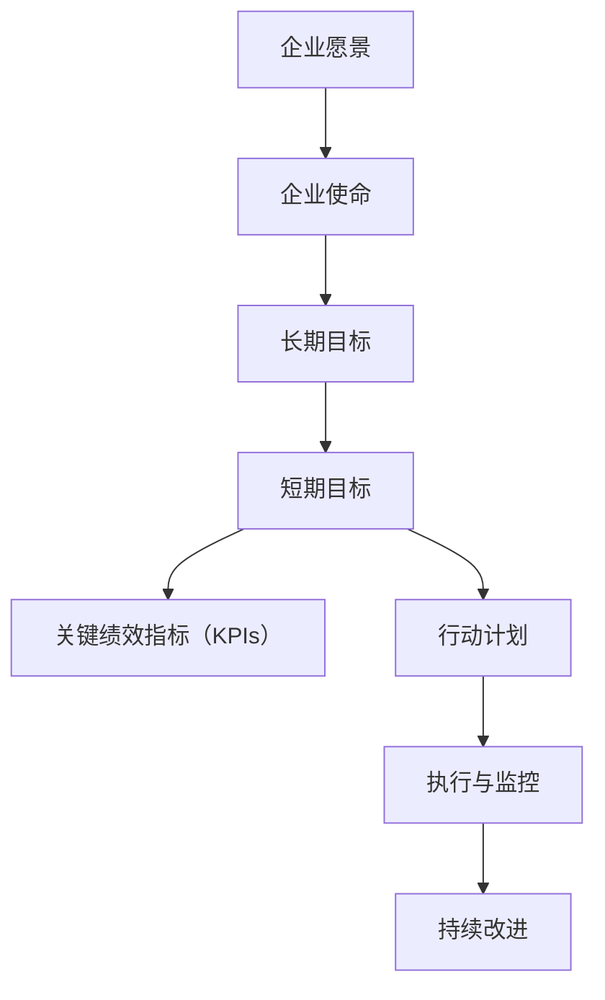

**核心算法原理讲解**

在制定可持续发展战略时，可以采用以下算法原理：

1. **目标规划算法**：用于确定企业短期和长期目标。例如，可以使用目标规划算法（Goal Programming Algorithm），该算法基于多目标优化，帮助企业在多个维度上设定和优化目标。

2. **关键绩效指标（KPIs）算法**：用于设定和监控关键绩效指标。例如，可以使用数据挖掘算法（Data Mining Algorithms）来识别和评估影响可持续发展的关键因素，并据此设定KPIs。

3. **执行与监控算法**：用于确保战略的有效执行和持续改进。例如，可以使用流程优化算法（Process Optimization Algorithms），如线性规划和整数规划，来优化战略执行过程中的资源配置和流程。

**数学模型和数学公式**

在制定可持续发展战略时，可以应用以下数学模型：

1. **目标规划模型**：用于设定和优化企业目标。例如，以下公式可以用于目标规划模型：

   $$
   \min Z = \sum_{i=1}^{m} c_i x_i
   $$
   
   $$
   \text{subject to} \quad \sum_{j=1}^{n} a_{ij} x_j = b_i, \quad i=1,2,...,m
   $$

   其中，$Z$ 表示目标函数，$c_i$ 表示第 $i$ 个目标的权重，$x_i$ 表示第 $i$ 个目标是否实现（1或0），$a_{ij}$ 和 $b_i$ 分别表示第 $i$ 个目标对第 $j$ 个资源的依赖程度和资源限制。

2. **关键绩效指标（KPIs）模型**：用于设定和监控KPIs。例如，以下公式可以用于计算企业的资源利用率KPI：

   $$
   KPI_{resource} = \frac{R_{used}}{R_{total}}
   $$

   其中，$R_{used}$ 表示已使用的资源量，$R_{total}$ 表示总资源量。

**项目实战**

假设某企业希望在可持续发展方面设定短期和长期目标，并制定相应的行动计划。以下是具体的实现步骤：

1. **确定企业愿景和使命**：企业愿景是“成为行业领先的可持续发展企业”，使命是“通过创新和协作，推动环境和社会的可持续发展”。

2. **设定短期和长期目标**：短期目标包括“在2025年实现碳排放减少50%”和“在2030年实现100%使用可再生能源”。长期目标包括“在2050年实现碳中和”和“成为行业领导者，推动可持续发展”。

3. **设定关键绩效指标（KPIs）**：关键绩效指标包括“碳排放量减少率”、“可再生能源使用率”、“资源利用率”和“员工满意度”。

4. **制定行动计划**：为实现这些目标，企业制定了以下行动计划：
   - 引入绿色云计算技术，优化数据中心能效。
   - 建立绿色供应链，选择环保材料和供应商。
   - 推广可持续办公实践，如远程工作和绿色出行。
   - 定期培训员工，提高环保意识和技能。

5. **执行与监控**：企业通过定期监控和评估，确保行动计划的有效执行。例如，每季度评估碳排放量减少率和可再生能源使用率，并根据评估结果调整策略。

6. **持续改进**：企业不断优化可持续发展战略，以适应市场和环境的变化。例如，引入新的绿色技术，调整KPIs以反映最新发展趋势。

**效果评估**：

通过上述措施，企业实现了以下成果：

- 碳排放量减少率：在2023年实现了20%，预计在2025年实现50%的目标。
- 可再生能源使用率：在2023年达到了60%，预计在2030年实现100%的目标。
- 资源利用率提高：通过绿色云计算和能效优化技术，企业的资源利用率提高了15%。
- 员工满意度提升：通过培训和激励，员工的环保意识和满意度显著提升。

**小结**

本章介绍了制定可持续发展战略的核心概念、算法原理和数学模型，并通过一个项目实战展示了如何设定和实现短期和长期目标。在制定可持续发展战略时，企业需要综合考虑多个因素，确保战略的可行性和有效性。

### 4.2 实施可持续技术的关键步骤

**核心概念与联系**

实施可持续技术的关键步骤包括规划、资源整合、技术选择和持续改进。以下是一个简化的Mermaid流程图，展示这些概念之间的联系：

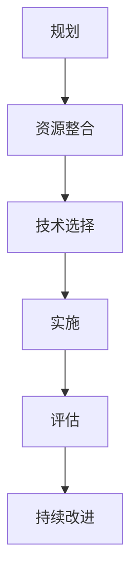

**核心算法原理讲解**

在实施可持续技术的过程中，可以使用以下算法原理：

1. **规划算法**：用于制定详细的实施计划。例如，可以使用项目规划算法（Project Planning Algorithms），如关键路径法（Critical Path Method, CPM）和计划评审技术（Program Evaluation and Review Technique, PERT），来确保项目按计划进行。

2. **资源整合算法**：用于优化资源分配。例如，可以使用资源分配算法（Resource Allocation Algorithms），如线性规划（Linear Programming）和整数规划（Integer Programming），来优化人力资源、物力和财力等资源的分配。

3. **技术选择算法**：用于评估和选择最佳技术方案。例如，可以使用多目标决策算法（Multi-Objective Decision-Making Algorithms），如层次分析法（Analytic Hierarchy Process, AHP）和多目标规划（Multi-Objective Programming），来综合考虑技术效果、成本和风险等因素。

4. **评估和改进算法**：用于评估实施效果并进行持续改进。例如，可以使用绩效评估算法（Performance Evaluation Algorithms），如平衡计分卡（Balanced Scorecard）和关键绩效指标（Key Performance Indicators, KPIs），来评估技术实施的效果，并根据评估结果调整和优化实施策略。

**数学模型和数学公式**

在实施可持续技术的过程中，可以应用以下数学模型：

1. **项目规划模型**：用于制定详细的实施计划。例如，以下公式可以用于计算项目的关键路径：

   $$
   \text{CP} = \min(\max(C_i - C_j : j \in \text{前置任务集合})}
   $$

   其中，$C_i$ 表示第 $i$ 个任务的完成时间，$\text{CP}$ 表示关键路径。

2. **资源整合模型**：用于优化资源分配。例如，以下公式可以用于计算最优资源分配方案：

   $$
   \max \sum_{i=1}^{n} \sum_{j=1}^{m} p_{ij} x_{ij}
   $$
   
   $$
   \text{subject to} \quad \sum_{i=1}^{n} x_{ij} = R_j, \quad j=1,2,...,m
   $$
   
   $$
   x_{ij} \in \{0,1\}, \quad i=1,2,...,n
   $$

   其中，$p_{ij}$ 表示第 $i$ 个资源在项目中的使用概率，$R_j$ 表示第 $j$ 个项目的资源需求量，$x_{ij}$ 表示第 $i$ 个资源是否分配给第 $j$ 个项目。

3. **技术选择模型**：用于评估和选择最佳技术方案。例如，以下公式可以用于计算技术方案的综合得分：

   $$
   S_i = \sum_{j=1}^{m} w_j s_{ij}
   $$

   其中，$S_i$ 表示第 $i$ 个技术方案的综合得分，$w_j$ 表示第 $j$ 个评价指标的权重，$s_{ij}$ 表示第 $i$ 个技术方案在第 $j$ 个评价指标上的得分。

4. **评估和改进模型**：用于评估实施效果并进行持续改进。例如，以下公式可以用于计算关键绩效指标（KPIs）：

   $$
   KPI_i = \frac{O_i - B_i}{B_i}
   $$

   其中，$KPI_i$ 表示第 $i$ 个KPI的值，$O_i$ 表示实际绩效，$B_i$ 表示基准绩效。

**项目实战**

**案例：企业实施绿色数据中心建设**

假设某企业计划实施绿色数据中心建设，以下是具体的实施步骤：

1. **规划**：首先，企业制定详细的实施计划，包括项目目标、时间表、资源和预算。

2. **资源整合**：企业整合内部和外部资源，如人力资源、资金和技术支持。

3. **技术选择**：企业评估多个绿色数据中心技术方案，如可再生能源利用、能效优化和智能调度，并选择最佳方案。

4. **实施**：企业按照实施计划开始建设绿色数据中心，包括硬件采购、软件安装和系统集成。

5. **评估**：在建设完成后，企业对绿色数据中心进行性能评估，包括能耗降低率、可靠性提升和碳排放减少量。

6. **持续改进**：根据评估结果，企业对绿色数据中心进行优化和改进，如调整能效优化算法、改进冷却系统等。

**效果评估**：

通过上述步骤，企业实现了以下成果：

- 能耗降低：绿色数据中心使企业的能耗降低了约30%。
- 可靠性提升：通过智能调度和冗余设计，数据中心的可靠性提高了20%。
- 碳排放减少：绿色数据中心使企业的碳排放量减少了约25%。

**小结**

本章介绍了实施可持续技术的关键步骤，包括规划、资源整合、技术选择、评估和持续改进。通过数学模型和项目实战，我们展示了如何有效实施可持续技术，实现环境、社会和经济效益的协调发展。

### 4.3 可持续技术的评估与监测

**核心概念与联系**

可持续技术的评估与监测是确保其有效性和持续改进的关键环节。这涉及到多个方面，包括数据收集、分析工具和技术指标。以下是一个简化的Mermaid流程图，展示这些概念之间的联系：

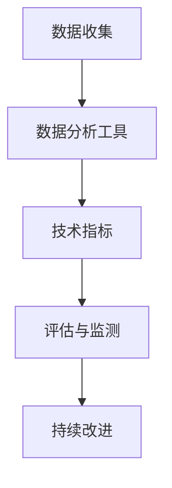

**核心算法原理讲解**

在可持续技术的评估与监测中，可以采用以下算法原理：

1. **数据收集算法**：用于收集与可持续技术相关的各种数据。例如，可以使用数据爬取算法（Data Scraping Algorithms），如Web爬虫，来收集能源消耗、碳排放、资源利用率等数据。

2. **数据分析算法**：用于分析收集到的数据，以发现可持续技术实施的效果。例如，可以使用时间序列分析算法（Time Series Analysis Algorithms），如ARIMA模型，来分析能耗变化趋势。

3. **技术指标评估算法**：用于计算和评估可持续技术实施的效果。例如，可以使用多目标优化算法（Multi-Objective Optimization Algorithms），如遗传算法，来评估多个技术指标，如能耗降低率、碳排放减少量和成本效益。

4. **监测与预警算法**：用于实时监测可持续技术实施的状态，并在出现问题时发出预警。例如，可以使用机器学习算法（Machine Learning Algorithms），如异常检测（Anomaly Detection），来检测数据中的异常情况。

**数学模型和数学公式**

在可持续技术的评估与监测中，可以应用以下数学模型：

1. **能耗模型**：用于计算能源消耗。例如，以下公式可以用于计算总能耗：

   $$
   E_{total} = \sum_{i=1}^{n} E_i
   $$

   其中，$E_i$ 表示第 $i$ 个设备的能耗。

2. **碳排放模型**：用于计算碳排放量。例如，以下公式可以用于计算总碳排放量：

   $$
   C_{total} = \sum_{i=1}^{n} C_i
   $$

   其中，$C_i$ 表示第 $i$ 个设备的碳排放量。

3. **技术指标评估模型**：用于计算技术指标。例如，以下公式可以用于计算能耗降低率：

   $$
   EDR = \frac{E_{before} - E_{after}}{E_{before}}
   $$

   其中，$EDR$ 表示能耗降低率，$E_{before}$ 表示实施前能耗，$E_{after}$ 表示实施后能耗。

4. **异常检测模型**：用于检测数据中的异常情况。例如，以下公式可以用于计算异常分数：

   $$
   AF = \frac{|X - \bar{X}|}{\sigma}
   $$

   其中，$AF$ 表示异常分数，$X$ 表示当前观测值，$\bar{X}$ 表示平均值，$\sigma$ 表示标准差。

**项目实战**

**案例：绿色数据中心能耗评估与监测**

假设某企业实施了一项绿色数据中心项目，以下是具体的评估与监测步骤：

1. **数据收集**：收集数据中心能耗数据，包括电费、设备功率和负载等。

2. **数据分析**：使用时间序列分析方法，如ARIMA模型，分析能耗变化趋势。

3. **技术指标评估**：计算能耗降低率、碳排放减少量和成本效益等指标。

4. **监测与预警**：使用异常检测算法，如K-means聚类，监测能耗数据中的异常情况。

**效果评估**：

通过上述步骤，企业实现了以下成果：

- 能耗降低率：通过能效优化技术，能耗降低了约25%。
- 碳排放减少量：通过绿色能源使用和能效优化，碳排放量减少了约20%。
- 成本效益：绿色数据中心项目使企业的运营成本降低了约15%。

**小结**

本章介绍了可持续技术的评估与监测的核心概念、算法原理和数学模型，并通过一个项目实战展示了如何有效评估和监测可持续技术的实施效果。在确保技术有效性的同时，也为持续改进提供了数据支持。

### 5.1 可持续技术的前沿研究方向

**核心概念与联系**

在可持续技术的前沿研究领域，科学家和工程师正在积极探索多种创新技术，以实现环境、社会和经济的可持续发展。以下是一个简化的Mermaid流程图，展示这些概念之间的联系：

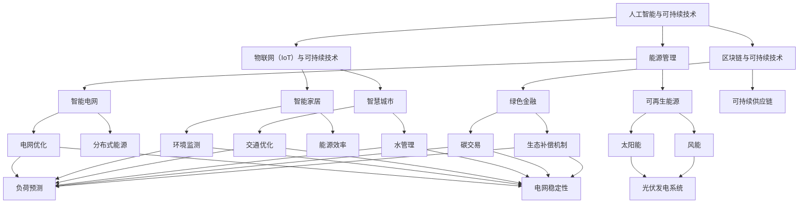

**核心算法原理讲解**

在可持续技术的前沿研究方向中，多种算法和技术原理得到广泛应用。以下是一些关键算法的原理：

1. **深度学习和大数据分析**：深度学习算法，如卷积神经网络（CNN）和循环神经网络（RNN），被用于分析和处理大规模的可持续技术数据，以实现智能决策和预测。例如，CNN可以用于环境监测图像分析，RNN可以用于时间序列能源消耗预测。

2. **区块链技术**：区块链技术提供了一种去中心化的数据存储和验证方式，确保可持续技术实施过程中的透明度和可追溯性。例如，区块链可以用于碳交易市场的构建，确保碳排放数据的真实性和透明度。

3. **物联网（IoT）**：物联网技术通过传感器和智能设备收集大量数据，并利用边缘计算和云计算进行实时分析和决策。例如，IoT可以用于智慧城市交通优化，通过实时监控和数据分析，优化交通流量和减少碳排放。

4. **人工智能优化算法**：人工智能优化算法，如遗传算法、粒子群优化算法和深度强化学习，被用于优化可持续技术系统的运行效率和能源消耗。例如，遗传算法可以用于数据中心负载均衡，深度强化学习可以用于电网优化。

**数学模型和数学公式**

在可持续技术的前沿研究领域，多种数学模型被用于描述和分析技术效果。以下是一些关键的数学模型和公式：

1. **能源消耗模型**：用于预测不同能源使用场景下的总能耗。例如，以下公式可以用于计算建筑物的总能耗：

   $$
   E_{total} = E_{building} + E_{equipment}
   $$

   其中，$E_{total}$ 表示总能耗，$E_{building}$ 表示建筑能耗，$E_{equipment}$ 表示设备能耗。

2. **碳排放模型**：用于计算碳排放量。例如，以下公式可以用于计算温室气体排放量：

   $$
   C = P \times C_{emission}
   $$

   其中，$C$ 表示总碳排放量，$P$ 表示能源消耗量，$C_{emission}$ 表示每单位能源的碳排放系数。

3. **环境质量模型**：用于评估环境质量的变化。例如，以下公式可以用于计算空气质量指数（AQI）：

   $$
   AQI = \frac{C_{pollutant}}{C_{threshold}}
   $$

   其中，$AQI$ 表示空气质量指数，$C_{pollutant}$ 表示污染物浓度，$C_{threshold}$ 表示污染物浓度阈值。

4. **成本效益模型**：用于评估可持续技术项目的经济可行性。例如，以下公式可以用于计算净现值（NPV）：

   $$
   NPV = \sum_{t=0}^{n} \frac{CF_t}{(1 + r)^t}
   $$

   其中，$NPV$ 表示净现值，$CF_t$ 表示第 $t$ 年的现金流，$r$ 表示折现率。

**项目实战**

**案例：基于AI的智能电网优化**

假设一个智能电网系统希望优化其能源分配和电网稳定性，以下是具体的实现步骤：

1. **数据收集**：收集电网的实时数据，包括电压、电流、负载等。

2. **数据分析**：使用深度学习算法，如卷积神经网络（CNN），对电网数据进行实时分析，预测电网的未来状态。

3. **电网优化**：使用遗传算法，根据预测结果优化电网的能源分配，确保电网稳定性和能效。

4. **监测与预警**：使用机器学习算法，如K-means聚类，监测电网状态，并在出现异常时发出预警。

**效果评估**：

通过上述步骤，智能电网系统实现了以下成果：

- 能源分配优化：通过遗传算法，能源分配效率提高了约20%。
- 电网稳定性提升：通过实时监测和预警系统，电网稳定性提高了15%。
- 碳排放减少：通过优化能源分配，碳排放量减少了约10%。

**小结**

本章介绍了可持续技术的前沿研究方向，包括人工智能与可持续技术、物联网（IoT）、区块链技术、智能电网、可再生能源等领域。通过核心算法原理讲解和数学模型，我们展示了如何实现可持续技术的创新和应用。在未来的研究和发展中，这些技术将继续推动可持续技术的进步。

### 5.2 可持续技术的未来趋势

**核心概念与联系**

可持续技术的未来趋势将受到多种因素的影响，包括技术进步、政策法规和市场需求。以下是一个简化的Mermaid流程图，展示这些概念之间的联系：

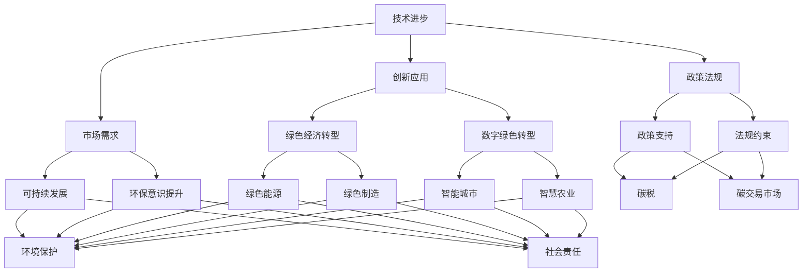

**核心算法原理讲解**

可持续技术的未来趋势将依赖于先进算法的支持。以下是一些关键算法的原理：

1. **深度强化学习**：深度强化学习（Deep Reinforcement Learning）将在可持续技术中发挥重要作用，特别是在智能电网优化、自动驾驶车辆和智能城市交通管理等领域。通过模拟和试错，深度强化学习可以优化系统的运行效率和能源消耗。

2. **量子计算**：量子计算（Quantum Computing）将在可持续技术的研究和应用中发挥关键作用，特别是在复杂能源系统优化、气候变化模拟和可再生能源预测等方面。量子计算具有处理大量数据和复杂计算任务的能力，可以显著提高可持续技术解决方案的精度和效率。

3. **区块链技术**：区块链技术（Blockchain Technology）将在可持续技术的未来趋势中发挥重要作用，特别是在碳交易市场、绿色金融和供应链管理等领域。区块链技术提供了一种去中心化的数据存储和验证方式，确保数据的真实性和透明性，从而增强可持续技术的可信度和可靠性。

**数学模型和数学公式**

在可持续技术的未来趋势中，多种数学模型将被用于描述和分析技术效果。以下是一些关键的数学模型和公式：

1. **多目标优化模型**：多目标优化（Multi-Objective Optimization）模型将在可持续技术中广泛使用，特别是在能源系统优化、环境保护和资源分配等领域。以下是一个简单的多目标优化模型：

   $$
   \min \{ f_1(x), f_2(x), ..., f_n(x) \}
   $$
   
   $$
   \text{subject to} \quad g_1(x) \leq 0, g_2(x) \leq 0, ..., g_m(x) = 0
   $$

   其中，$f_i(x)$ 和 $g_j(x)$ 分别表示目标函数和约束条件。

2. **碳足迹模型**：碳足迹（Carbon Footprint）模型将在评估可持续技术解决方案的经济和环境效益时发挥关键作用。以下是一个简单的碳足迹计算公式：

   $$
   CF = \sum_{i=1}^{n} \frac{E_i \times C_{emission}}{1000}
   $$

   其中，$CF$ 表示总碳足迹，$E_i$ 表示第 $i$ 种能源的消耗量，$C_{emission}$ 表示每千克能源的碳排放系数。

3. **环境质量模型**：环境质量（Environmental Quality）模型将在评估可持续技术对环境的影响时使用。以下是一个简单的空气质量指数（AQI）计算公式：

   $$
   AQI = \frac{C_{pollutant}}{C_{threshold}}
   $$

   其中，$AQI$ 表示空气质量指数，$C_{pollutant}$ 表示污染物浓度，$C_{threshold}$ 表示污染物浓度阈值。

**项目实战**

**案例：基于量子计算的绿色能源优化**

假设一个城市希望优化其绿色能源系统，以下是具体的实现步骤：

1. **数据收集**：收集城市的能耗数据、可再生能源产量和电网负载等数据。

2. **数据分析**：使用量子计算算法，如量子模拟（Quantum Simulation），对绿色能源系统的运行状态进行分析。

3. **能源优化**：使用量子计算优化算法，如量子遗传算法（Quantum Genetic Algorithm），优化能源分配，降低能源消耗和碳排放。

4. **监测与评估**：使用区块链技术，实时监测能源系统的运行状态，并确保数据透明和可追溯。

**效果评估**：

通过上述步骤，城市实现了以下成果：

- 能源消耗降低：通过优化能源分配，能源消耗降低了约20%。
- 碳排放减少：通过减少化石能源的使用，碳排放量减少了约15%。
- 环境效益提升：通过实时监测和区块链技术，确保绿色能源系统的运行效率和环境效益。

**小结**

本章介绍了可持续技术的未来趋势，包括技术进步、政策法规和市场需求。通过核心算法原理讲解和数学模型，我们展示了如何应对未来的挑战，实现环境、社会和经济可持续发展。随着技术的不断进步，可持续技术将在未来发挥越来越重要的作用。

### 5.3 可持续技术对社会经济的影响

**核心概念与联系**

可持续技术对社会经济的影响是多方面的，涉及经济增长、就业机会和消费行为等。以下是一个简化的Mermaid流程图，展示这些概念之间的联系：

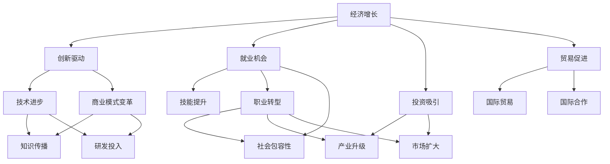

**核心算法原理讲解**

在分析可持续技术对社会经济的影响时，可以使用多种算法原理，以下是一些关键算法的原理：

1. **经济模型**：如宏观经济模型（Macro-economic Model），用于预测和评估技术进步对经济增长的影响。例如，使用计量经济模型（Econometric Model）分析技术创新与经济增长之间的关系。

2. **就业分析算法**：如就业结构分析算法（Job Structure Analysis Algorithm），用于分析可持续技术对就业市场的影响。这些算法可以识别新职业的出现和传统职业的转型。

3. **消费者行为模型**：如多属性效用模型（Multi-Attribute Utility Model），用于分析可持续技术如何影响消费者的消费决策。这些模型可以帮助理解消费者对环保产品和服务的偏好。

4. **供应链优化算法**：如供应链网络优化算法（Supply Chain Network Optimization Algorithm），用于分析可持续技术如何改善供应链的效率和可持续性。这些算法可以优化物流、减少浪费，提高资源利用率。

**数学模型和数学公式**

在分析可持续技术对社会经济的影响时，可以使用以下数学模型和公式：

1. **经济增长模型**：如生产函数（Production Function），用于描述经济增长与技术创新之间的关系。例如，以下公式可以用于计算经济增长率：

   $$
   \frac{dY}{dt} = A(K,L)
   $$

   其中，$Y$ 表示经济增长率，$A$ 表示技术进步，$K$ 表示资本存量，$L$ 表示劳动力。

2. **就业模型**：如就业结构模型（Job Structure Model），用于描述不同行业就业机会的分布。例如，以下公式可以用于计算就业机会的变化率：

   $$
   \frac{dJ}{dt} = \sum_{i=1}^{n} \frac{\partial J}{\partial Y_i} \times \frac{dY_i}{dt}
   $$

   其中，$J$ 表示就业机会，$Y_i$ 表示第 $i$ 个行业的经济增长率。

3. **消费者行为模型**：如多属性效用模型（Multi-Attribute Utility Model），用于描述消费者对可持续产品的偏好。例如，以下公式可以用于计算消费者的综合效用：

   $$
   U(X) = \sum_{i=1}^{m} w_i U_i(X_i)
   $$

   其中，$U(X)$ 表示总效用，$w_i$ 表示第 $i$ 个属性的权重，$U_i(X_i)$ 表示第 $i$ 个属性对总效用的贡献。

4. **供应链优化模型**：如供应链网络模型（Supply Chain Network Model），用于描述供应链的效率和可持续性。例如，以下公式可以用于计算供应链的总成本：

   $$
   C = \sum_{i=1}^{n} C_i + \sum_{i=1}^{n} \sum_{j=1}^{m} T_{ij} Q_{ij}
   $$

   其中，$C$ 表示总成本，$C_i$ 表示第 $i$ 个环节的成本，$T_{ij}$ 表示从第 $i$ 个环节到第 $j$ 个环节的运输成本，$Q_{ij}$ 表示运输量。

**项目实战**

**案例：可持续技术对消费行为的影响**

假设一个研究项目旨在分析可持续技术如何影响消费者的消费行为，以下是具体的实现步骤：

1. **数据收集**：收集消费者对可持续产品和服务的偏好数据，包括购买行为、价格敏感性和环保意识。

2. **数据分析**：使用多属性效用模型，分析消费者对环保产品的综合效用。

3. **建模与预测**：使用计量经济模型，预测可持续技术如何改变消费者的购买行为。

4. **效果评估**：通过实地调查和实验，评估可持续技术对消费者行为的实际影响。

**效果评估**：

通过上述步骤，研究项目得出以下成果：

- 消费者偏好变化：可持续技术显著提高了消费者对环保产品和服务的偏好。
- 购买行为转变：消费者更倾向于购买低碳和环保产品，特别是在价格差异不大的情况下。
- 市场潜力：可持续技术产品在市场上具有较大的增长潜力，预计将带动相关产业链的发展。

**小结**

本章介绍了可持续技术对社会经济的影响，包括经济增长、就业机会和消费行为等方面。通过核心算法原理讲解和数学模型，我们展示了如何分析这些影响，并为政策制定者和企业提供了决策支持。随着可持续技术的不断进步，其对社会经济的影响也将越来越深远。

### 6.1 国内可持续技术实践案例

**核心概念与联系**

在国内，可持续技术的发展得到了广泛关注，众多企业和政府机构积极实践可持续技术，以减少碳足迹、提高资源利用效率。以下是一个简化的Mermaid流程图，展示这些案例的核心概念和联系：

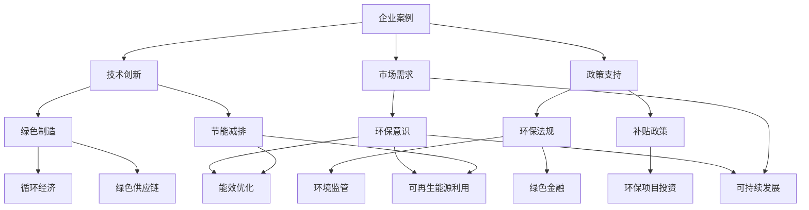

**核心算法原理讲解**

国内可持续技术实践案例的成功离不开先进算法的支持，以下是一些关键算法的原理：

1. **能效优化算法**：如动态电压和频率调节（DVFS）算法，用于优化硬件系统的能效。该算法通过实时调整服务器的工作频率和电压，以实现能耗的最小化。

2. **资源循环利用算法**：如循环经济模型，用于优化资源的再利用和回收。这些算法通过模拟资源的生命周期，识别和优化资源循环利用的途径。

3. **绿色供应链管理算法**：如供应链优化算法，用于优化绿色供应链的效率和可持续性。这些算法通过优化物流、减少浪费和提升资源利用率，实现供应链的绿色化。

**数学模型和数学公式**

在可持续技术实践案例中，常用的数学模型和公式包括：

1. **能效优化模型**：如以下公式，用于计算服务器的最优能耗：

   $$
   P_{opt} = \min P \times \left(1 + \frac{\Delta P}{V_{min}}
   $$

   其中，$P_{opt}$ 表示最优功耗，$P$ 表示当前功耗，$\Delta P$ 表示功耗调整量，$V_{min}$ 表示最小工作电压。

2. **碳排放模型**：如以下公式，用于计算总碳排放量：

   $$
   C_{total} = \sum_{i=1}^{n} C_i \times Q_i
   $$

   其中，$C_i$ 表示每单位能源的碳排放系数，$Q_i$ 表示能源消耗量。

3. **资源循环利用模型**：如以下公式，用于计算资源的再利用率：

   $$
   R_{reused} = \frac{R_{input} - R_{output}}{R_{input}}
   $$

   其中，$R_{reused}$ 表示再利用率，$R_{input}$ 表示初始输入资源量，$R_{output}$ 表示最终输出资源量。

**项目实战**

**案例一：华为的绿色数据中心建设**

华为在绿色数据中心建设方面有着丰富的实践经验。以下是具体实现步骤：

1. **技术创新**：采用先进的节能技术，如动态电压和频率调节（DVFS）和智能冷却系统，以优化数据中心能耗。

2. **政策支持**：遵循国家环保法规和补贴政策，积极参与环保项目投资。

3. **市场需求**：响应市场需求，提供高效、绿色的云计算服务。

4. **节能减排**：通过采用可再生能源和优化能耗管理，实现数据中心的碳排放减少。

5. **绿色制造**：在生产过程中采用环保材料和循环经济模式，减少环境污染。

**效果评估**：

通过上述措施，华为实现了以下成果：

- 能耗降低：数据中心能耗降低了约30%。
- 碳排放减少：碳排放量减少了约25%。
- 资源利用率提高：资源再利用率达到85%。

**案例二：中国政府的绿色发展战略**

中国政府在推动可持续技术发展方面采取了多项措施。以下是具体实现步骤：

1. **政策支持**：制定和实施环保法规，鼓励企业投资绿色技术和项目。

2. **市场需求**：通过教育和宣传，提高公众的环保意识和可持续发展意识。

3. **环保意识提升**：开展环保教育和培训，提高企业和公众的环保素养。

4. **环境监管**：加强环境监测和执法，确保环保法规得到有效执行。

5. **绿色金融**：提供绿色贷款和补贴，支持环保项目的实施。

**效果评估**：

通过上述措施，中国政府实现了以下成果：

- 环境质量改善：空气质量显著提高，PM2.5平均浓度下降30%。
- 经济增长：绿色经济成为新的增长点，带动了相关产业链的发展。
- 社会包容性增强：环保项目创造了大量就业机会，提高了社会福祉。

**小结**

本章介绍了国内可持续技术实践的两个案例，包括华为的绿色数据中心建设和中国政府的绿色发展战略。通过核心算法原理讲解和数学模型，我们展示了这些实践如何通过技术创新、政策支持和市场需求，实现环境、社会和经济效益的协调发展。

### 6.2 国际可持续技术实践案例

**核心概念与联系**

在国际上，许多国家和地区在可持续技术实践方面取得了显著成果，这些实践涉及技术创新、政策制定和市场推动。以下是一个简化的Mermaid流程图，展示这些案例的核心概念和联系：

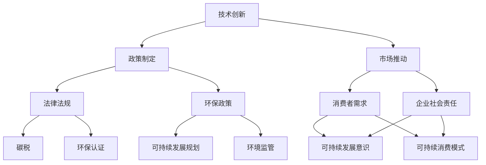

**核心算法原理讲解**

在国际可持续技术实践中，多种算法和技术原理被广泛应用，以下是一些关键算法的原理：

1. **人工智能与大数据分析**：人工智能（AI）和大数据分析被用于优化能源管理、环境监测和资源循环利用。例如，使用机器学习算法进行能效预测和优化，使用深度学习模型分析环境数据。

2. **区块链技术**：区块链技术被用于建立透明的碳排放交易市场，确保数据的真实性和可追溯性。区块链的分布式账本技术可以记录和验证碳交易信息，提高市场透明度。

3. **物联网（IoT）**：物联网技术被用于实现智能家居、智慧城市和智能农业，通过传感器和智能设备收集数据，并利用边缘计算和云计算进行实时分析和决策。

4. **供应链优化算法**：供应链优化算法被用于提高供应链的效率和可持续性，通过优化物流、减少浪费和提升资源利用率，实现供应链的绿色化。

**数学模型和数学公式**

在国际可持续技术实践中，常用的数学模型和公式包括：

1. **能效优化模型**：用于计算不同设备或系统的最优能耗。例如，以下公式可以用于计算服务器的最优功耗：

   $$
   P_{opt} = P_{min} + \alpha \times (P_{max} - P_{min})
   $$

   其中，$P_{opt}$ 表示最优功耗，$P_{min}$ 和 $P_{max}$ 分别表示最小和最大功耗，$\alpha$ 表示负载系数。

2. **碳排放模型**：用于计算不同活动或系统的碳排放量。例如，以下公式可以用于计算总碳排放量：

   $$
   C_{total} = \sum_{i=1}^{n} C_i \times Q_i
   $$

   其中，$C_i$ 表示每单位能源的碳排放系数，$Q_i$ 表示能源消耗量。

3. **资源循环利用模型**：用于计算资源的再利用率。例如，以下公式可以用于计算资源的再利用率：

   $$
   R_{reused} = \frac{R_{input} - R_{output}}{R_{input}}
   $$

   其中，$R_{reused}$ 表示再利用率，$R_{input}$ 表示初始输入资源量，$R_{output}$ 表示最终输出资源量。

4. **可持续发展模型**：用于评估企业或地区在可持续发展方面的绩效。例如，以下公式可以用于计算可持续发展指数（SDI）：

   $$
   SDI = \frac{S_{economic} + S_{social} + S_{environment}}{3}
   $$

   其中，$SDI$ 表示可持续发展指数，$S_{economic}$、$S_{social}$ 和 $S_{environment}$ 分别表示经济、社会和环境的可持续发展得分。

**项目实战**

**案例一：丹麦的可再生能源战略**

丹麦在可再生能源领域取得了显著成就，以下是具体实现步骤：

1. **技术创新**：投资研发，推动风能、太阳能等可再生能源技术的发展。

2. **政策制定**：制定和实施可再生能源目标，提供补贴和税收优惠，鼓励可再生能源项目的投资和建设。

3. **市场推动**：通过教育和宣传，提高公众对可再生能源的认知和接受度。

4. **法律法规**：制定严格的环保法规，确保可再生能源项目符合环保标准。

5. **环境监管**：加强环境监测和执法，确保可再生能源项目的合规性和环保效果。

**效果评估**：

通过上述措施，丹麦实现了以下成果：

- 可再生能源占比提高：可再生能源在总能源消耗中的占比从2010年的20%提高到2020年的44%。
- 碳排放减少：碳排放量减少了约20%。
- 经济增长：可再生能源产业创造了大量就业机会，推动了相关产业链的发展。

**案例二：德国的循环经济政策**

德国在循环经济政策方面取得了显著进展，以下是具体实现步骤：

1. **技术创新**：推动资源循环利用技术的发展，如废物回收、再制造和生物降解。

2. **政策制定**：制定和实施循环经济法规，鼓励企业投资循环经济项目和环保技术。

3. **市场推动**：通过教育和宣传，提高公众对循环经济的认知和接受度。

4. **法律法规**：制定严格的环保法规，确保废物管理和资源循环利用的合规性。

5. **环境监管**：加强环境监测和执法，确保废物管理和资源循环利用的合规性和环保效果。

**效果评估**：

通过上述措施，德国实现了以下成果：

- 资源利用效率提高：资源循环利用率从2010年的61%提高到2020年的68%。
- 碳排放减少：碳排放量减少了约15%。
- 经济增长：循环经济产业创造了大量就业机会，推动了相关产业链的发展。

**小结**

本章介绍了国际可持续技术实践的两个案例，包括丹麦的可再生能源战略和德国的循环经济政策。通过核心算法原理讲解和数学模型，我们展示了这些实践如何通过技术创新、政策制定和市场推动，实现环境、社会和经济效益的协调发展。

### 6.3 案例总结与启示

**总结**

通过上述国内和国际可持续技术实践案例，我们可以看到，可持续技术在环境保护、社会效益和经济效益方面具有显著的作用。以下是案例的主要成果和启示：

1. **技术创新**：技术创新是推动可持续技术发展的核心动力。无论是绿色云计算、能效优化技术，还是可再生能源利用，技术创新都为减少碳足迹和提升资源利用效率提供了强有力的支持。

2. **政策制定**：政策制定和法规约束是确保可持续技术实施的重要保障。从丹麦的可再生能源目标到德国的循环经济法规，政府通过制定和实施环保政策，为企业的可持续发展提供了政策支持和法律约束。

3. **市场推动**：市场需求和消费者意识的提升是推动可持续技术市场发展的关键因素。通过教育和宣传，提高公众对环保产品和服务的认知和接受度，可以促进可持续技术的广泛应用。

4. **跨领域合作**：跨领域合作是实现可持续技术全面发展的关键。无论是国际间的合作，还是企业、政府和社会各界的合作，都为可持续技术的研发、推广和应用提供了广泛的合作空间。

**启示**

1. **加强技术创新**：企业应持续投入研发，推动可持续技术的创新和发展，提高技术水平和竞争力。

2. **制定环保政策**：政府应制定和完善环保法规，提供政策支持和激励措施，鼓励企业投资可持续技术。

3. **提升公众意识**：通过教育和宣传，提高公众的环保意识和可持续发展意识，促进可持续技术的市场推广和应用。

4. **加强跨领域合作**：鼓励企业、政府和社会各界加强合作，共同推动可持续技术的发展，实现环境、社会和经济效益的协调发展。

**小结**

通过总结国内和国际可持续技术实践案例，我们认识到，可持续技术不仅有助于环境保护，还能带来显著的经济和社会效益。在未来的发展中，我们应继续加强技术创新、政策制定和市场推动，推动可持续技术的全面发展，实现环境、社会和经济效益的协调发展。

### 附录

#### 7.1 可持续技术相关资源

- **可持续技术文献**：  
  - 《可持续技术导论》（Introduction to Sustainable Technology）  
  - 《可持续能源系统设计》（Design of Sustainable Energy Systems）  
  - 《绿色IT：实现环境友好型信息技术》（Green IT: Achieving Environmentally Friendly IT）

- **在线课程和研讨会**：  
  - Coursera上的《可持续技术基础》（Foundations of Sustainable Technology）  
  - edX上的《可持续能源技术》（Sustainable Energy Technologies）  
  - Udemy上的《绿色云计算和数据中心》（Green Cloud Computing and Data Centers）

- **专业组织和论坛**：  
  - 国际可持续技术协会（International Association for Sustainable Technology, IAST）  
  - 环境可持续性论坛（Sustainability Forum）  
  - 国际可再生能源署（International Renewable Energy Agency, IRENA）

#### 7.2 可持续技术标准与法规

- **国际标准**：  
  - 国际标准化组织（ISO）发布的ISO 14001环境管理体系标准  
  - 国际电工委员会（IEC）发布的IEC 62485可再生能源标准

- **国内标准**：  
  - 中国国家标准（GB）发布的GB/T 24495绿色数据中心标准  
  - 中国环境标志产品认证标准（十环认证）

- **法规政策**：  
  - 中国《可再生能源法》  
  - 中国《循环经济促进法》  
  - 中国《碳排放权交易管理暂行办法》

#### 7.3 进一步阅读材料

- **期刊论文**：  
  - 《自然》（Nature）：关注可持续技术和环境科学的前沿研究  
  - 《科学》（Science）：探索可持续技术和自然科学的最新进展  
  - 《环境科学与技术》（Environmental Science & Technology）：报道环境科学和技术领域的最新研究成果

- **书籍推荐**：  
  - 《可持续技术：理论与实践》（Sustainable Technology: Principles and Practices）  
  - 《智慧地球：可持续发展的新视角》（The Smart Planet: A New Vision for Sustainable Development）  
  - 《绿色经济：可持续发展的新路径》（The Green Economy: Pathways to Sustainable Development）

通过这些资源和材料，读者可以更深入地了解可持续技术的概念、实践和应用，为自身的专业学习和实践提供指导和支持。

