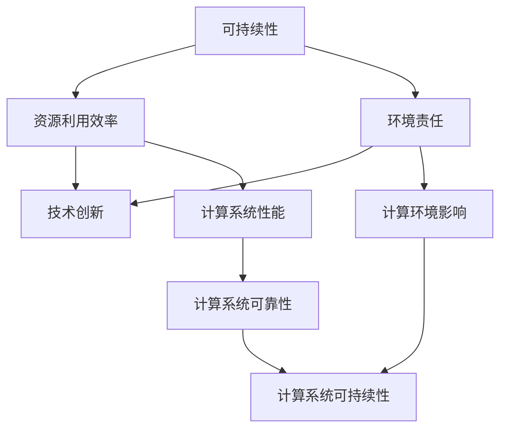

                 

### 引言

在现代信息技术飞速发展的背景下，计算能力的提升带来了无数便利，然而，随之而来的资源消耗和环境问题也日益严峻。可持续计算作为一种新兴的概念，旨在通过技术创新与环境责任的结合，实现计算资源的有效利用和环境保护的双重目标。本文将围绕《可持续计算：技术创新与环境责任》这一主题，逐步探讨其核心内容与实际应用。

关键词：**可持续计算、技术创新、环境责任、绿色计算、资源利用**

摘要：本文首先介绍了可持续计算的概念及其背景，探讨了其与计算资源利用和环境问题之间的联系。接着，本文详细阐述了可持续计算的技术创新，包括绿色计算技术、分布式计算与云计算、硬件与软件的可持续设计等。然后，本文分析了可持续计算在环境保护、社会责任和法律政策方面的作用，并讨论了其在产业应用和项目案例中的实际效果。最后，本文总结了可持续计算的最佳实践，并提出了一些注意事项和拓展阅读建议。

### 背景介绍

可持续计算这一概念起源于对计算资源消耗与环境影响的深入思考。随着信息技术的发展，计算能力不断提升，然而，这种能力的提升背后往往伴随着巨大的资源消耗和环境污染。据统计，数据中心和服务器集群的能耗已经占到全球总能耗的相当一部分，而且这个比例还在逐年增长。这不仅带来了能源供应的压力，也对环境造成了严重的负面影响。因此，如何实现计算资源的有效利用和环境保护的双重目标，成为了一个亟待解决的问题。

**计算资源利用与环境问题**

计算资源利用主要涉及能源消耗、硬件设备使用、数据传输和处理等方面。传统的计算模式往往忽视了这些资源的可持续性，导致资源浪费和环境负担。例如，数据中心的建设和运营需要大量的电力，而这些电力主要来自化石燃料的燃烧，进而产生大量的二氧化碳和其他温室气体。此外，硬件设备的生产、运输和废弃处理过程也产生了大量的环境污染。

环境问题与计算资源利用密切相关。计算资源的过度消耗不仅导致了能源的浪费，还加剧了环境污染。例如，大量的二氧化碳排放会导致全球气候变化，影响生态系统的平衡。同时，电子废弃物的处理也是一个严峻的问题。每年都有大量的电子设备被废弃，这些设备中含有有害物质，如重金属和有毒化学品，如果处理不当，会对土壤和水源造成严重污染。

**可持续计算的需求与重要性**

面对日益严峻的计算资源利用与环境问题，可持续计算应运而生。可持续计算旨在通过技术创新和环境责任的结合，实现计算资源的有效利用和环境保护的目标。其需求主要源于以下几个方面：

1. **能源短缺与气候变化**：全球能源短缺和气候变化问题日益严重，需要通过节能减排和可再生能源利用来应对。可持续计算提供了有效的解决方案，通过优化计算资源的利用，降低能耗，减少温室气体排放。

2. **环境保护与可持续发展**：环境保护和可持续发展是全球各国共同关注的问题。可持续计算通过减少资源消耗和环境污染，为实现可持续发展目标做出了重要贡献。

3. **社会责任与企业形象**：企业社会责任和形象对企业的长期发展至关重要。通过实施可持续计算，企业不仅能够降低运营成本，提高效率，还能够树立良好的企业形象，增强市场竞争力。

4. **技术创新与产业升级**：可持续计算推动了技术创新和产业升级。通过开发和应用绿色计算技术、分布式计算与云计算等，促进了计算技术的进步和产业的转型。

综上所述，可持续计算作为一种新兴的理念，不仅解决了计算资源利用和环境问题，还为环境保护、社会责任和产业发展提供了新的思路和方向。在接下来的部分中，本文将详细探讨可持续计算的核心概念和联系，以及技术创新的各个方面。

### 核心概念与联系

在深入探讨可持续计算之前，首先需要明确其核心概念，并理解这些概念之间的相互关系。可持续计算的核心概念主要包括：可持续性、资源利用效率、环境责任和技术创新。以下是对这些核心概念及其关系的详细解释。

**可持续性**

可持续性是指满足当前需求而不损害未来世代满足其需求的能力。在计算领域，可持续性主要关注计算资源的长期利用和环境影响的减缓。可持续性不仅包括能源消耗的优化，还涉及硬件设备的设计、生产、使用和废弃处理的全生命周期管理。

**资源利用效率**

资源利用效率是衡量计算系统性能的重要指标。它包括计算资源（如CPU、内存、存储等）的利用率、网络传输效率和数据处理效率。高效的资源利用能够降低能耗，减少资源浪费，从而实现可持续计算的目标。

**环境责任**

环境责任是指计算技术对环境产生的直接影响和间接影响。直接环境影响包括碳排放、水污染和固体废弃物等；间接环境影响包括计算资源消耗导致的能源消耗和气候变化等。可持续计算要求计算技术在设计和应用过程中充分考虑环境责任，采取有效措施减少对环境的负面影响。

**技术创新**

技术创新是推动可持续计算发展的重要动力。通过技术创新，可以开发出更高效、更环保的计算技术和解决方案，从而提高资源利用效率，降低环境负担。技术创新包括绿色计算技术、分布式计算与云计算、硬件与软件的可持续设计等方面。

**核心概念之间的关系架构**

为了更好地理解这些核心概念之间的关系，我们可以使用Mermaid流程图来展示它们之间的联系。



在上面的流程图中，我们可以看到：

- **可持续性**直接影响**资源利用效率**和**环境责任**。高效的资源利用有助于提高可持续性，而考虑环境责任则有助于减少环境影响。
- **资源利用效率**和**环境责任**共同决定了**计算系统性能**。高效的资源利用和良好的环境责任有助于提升系统性能。
- **技术创新**是推动**资源利用效率**和**环境责任**改进的重要力量。通过技术创新，可以开发出更高效、更环保的计算技术和解决方案。
- **计算系统性能**和**计算环境影响**共同决定了**计算系统可持续性**。良好的系统性能和低的环境影响有助于实现计算系统的长期可持续性。

通过这种关系架构，我们可以更清晰地理解可持续计算的核心概念及其相互影响。在接下来的部分中，我们将进一步探讨可持续计算的技术创新，包括绿色计算技术、分布式计算与云计算、硬件与软件的可持续设计等方面。

### 可持续计算的技术创新

在实现可持续计算的过程中，技术创新是不可或缺的一环。通过技术创新，可以开发出更高效、更环保的计算技术和解决方案，从而提高资源利用效率，减少环境负担。以下将详细探讨几种关键的技术创新，包括绿色计算技术、分布式计算与云计算、硬件与软件的可持续设计等。

**绿色计算技术**

绿色计算技术旨在通过降低计算系统的能耗和减少碳排放，实现计算资源的有效利用。以下是几种重要的绿色计算技术：

1. **能耗优化技术**

   能耗优化技术包括硬件和软件层面的优化。在硬件层面，可以通过设计更高效的处理器、使用低功耗硬件组件、改进散热系统等方式来降低能耗。在软件层面，可以通过优化算法、减少不必要的计算和存储操作、使用高效的编程语言和工具等方式来降低能耗。例如，使用Java虚拟机（JVM）的垃圾回收机制可以有效地减少内存使用和垃圾收集的频率，从而降低能耗。

   Python代码示例：

   ```python
   # 垃圾回收示例
   import java.util.ArrayList;
   import java.util.List;

   class GarbageCollectionExample {
       public static void main(String[] args) {
           List<Object> objects = new ArrayList<>();
           while (true) {
               objects.add(new Object());
               objects.remove(0);
           }
       }
   }
   ```

   在这个示例中，循环创建和删除对象，模拟垃圾回收的过程，从而减少内存使用和垃圾收集的频率。

2. **环境监测技术**

   环境监测技术可以实时监测计算系统的能耗和碳排放情况，帮助管理员优化系统配置和操作。例如，可以使用传感器和软件工具来监控数据中心的能耗分布、温度、湿度等环境参数，从而实现能效管理。

3. **绿色数据中心设计**

   绿色数据中心设计包括使用高效节能的硬件设备、优化数据中心的布局和散热系统、采用可再生能源等。例如，可以使用高效的数据中心冷却系统，如水冷或空气冷却系统，来降低能耗。同时，数据中心可以采用太阳能、风能等可再生能源，减少对化石燃料的依赖。

**分布式计算与云计算**

分布式计算与云计算技术可以通过资源整合和任务分配优化，提高计算资源的利用效率，从而实现可持续计算的目标。

1. **分布式计算原理**

   分布式计算是将计算任务分散到多个计算节点上执行，通过任务分配和资源调度来实现高效的计算。分布式计算可以充分利用闲置计算资源，提高资源利用率。例如，可以使用MapReduce模型来处理大规模数据，通过将数据划分到多个节点上并行处理，从而提高计算效率。

2. **云计算在可持续计算中的应用**

   云计算提供了一种灵活的计算资源分配方式，可以根据需求动态调整资源使用。通过云服务，用户可以按需获取计算资源，避免了资源浪费。例如，使用云服务可以减少数据中心的物理硬件投资，降低能耗和碳排放。同时，云服务提供商可以通过优化资源分配和调度，提高资源利用效率。

**硬件与软件的可持续设计**

硬件与软件的可持续设计是可持续计算的重要组成部分，通过设计高效、环保的硬件设备和软件系统，可以降低计算资源的消耗。

1. **硬件设计的可持续性**

   硬件设计的可持续性包括选择低功耗处理器、使用环保材料、优化硬件结构等方面。例如，可以选择使用ARM架构的低功耗处理器，以降低能耗。同时，可以采用可回收材料，减少电子废弃物的产生。

2. **软件设计的可持续性**

   软件设计的可持续性包括优化算法、减少不必要的计算和存储操作、使用高效的编程语言和工具等方面。例如，可以使用多线程和并行计算技术来提高程序性能，减少计算资源的使用。

通过上述技术创新，可持续计算不仅能够提高计算资源的利用效率，还能减少环境负担，实现环境保护和可持续发展。在接下来的部分中，我们将进一步探讨可持续计算与环境责任、社会责任和法律政策等方面的联系。

### 可持续计算与环境责任

可持续计算不仅是一种技术创新，更是对环境责任的一种深刻理解和践行。通过优化计算资源的利用，降低能耗和碳排放，可持续计算在环境保护方面发挥了重要作用。以下是可持续计算如何在环境责任方面发挥作用的详细解析。

**环境问题与计算资源利用**

计算资源的高消耗带来了严重的环境问题。首先，数据中心的能耗已经成为全球能源消耗的一个重要组成部分。据统计，数据中心每年的能耗已经超过了全球航空业的能耗。这些能耗主要来自电力供应，而大部分电力仍依赖于化石燃料，导致大量的二氧化碳排放。此外，计算设备的生命周期中也涉及大量的资源消耗和环境污染。从硬件的生产、运输，到使用过程中的能耗，再到废弃物的处理，每一个环节都可能对环境造成负面影响。

**可持续计算对环境保护的作用**

1. **降低碳排放**

   可持续计算通过优化计算资源的利用，降低能耗，从而减少碳排放。例如，通过改进硬件设计，使用低功耗处理器，可以提高设备的能源效率。同时，通过优化软件算法，减少不必要的计算操作，也能有效降低能耗。此外，绿色数据中心设计，如使用高效冷却系统和可再生能源，也有助于减少碳排放。

2. **资源利用率的提高**

   可持续计算通过分布式计算和云计算技术，实现了计算资源的整合和优化利用。通过将计算任务分散到多个计算节点上，可以充分利用闲置资源，避免资源浪费。云计算的按需资源分配模式，也使得用户可以根据实际需求动态调整资源使用，避免了资源闲置和过度配置。

3. **环境友好型计算技术**

   可持续计算还推动了环境友好型计算技术的发展。例如，绿色计算技术通过优化硬件和软件设计，降低能耗和资源消耗。环境监测技术可以实时监控计算系统的能耗和排放情况，帮助管理员进行能效管理。此外，可持续计算还鼓励使用环保材料和可再生能源，以减少电子废弃物的产生和对环境的影响。

**可持续计算的环境影响评估**

为了更好地了解可持续计算的环境影响，需要进行环境影响评估。环境影响评估包括以下几个方面：

1. **能源消耗评估**

   对计算系统的能源消耗进行详细评估，包括硬件设备、数据中心、网络传输等方面的能耗。通过评估，可以找出能耗高的环节，采取针对性的优化措施。

2. **碳排放评估**

   对计算系统的碳排放进行评估，了解碳排放的主要来源和影响因素。通过评估，可以制定减排策略，降低碳排放。

3. **资源利用效率评估**

   对计算系统的资源利用效率进行评估，包括CPU利用率、内存利用率、存储利用率等。通过评估，可以找出资源利用不充分的环节，采取优化措施提高资源利用率。

**案例分析**

以下是一个关于可持续计算环境影响的实际案例：

**案例：绿色数据中心建设**

某公司计划建设一个新的数据中心，为了实现可持续发展目标，公司在设计阶段就进行了详细的环境影响评估。通过优化硬件设计，选择低功耗处理器和高效冷却系统，公司成功降低了数据中心的能耗。同时，数据中心还采用可再生能源供电，进一步减少了碳排放。在运营过程中，公司通过实时监测和优化系统配置，不断提高资源利用效率，实现了环境友好型的数据中心建设。

**结论**

通过上述分析，我们可以看到，可持续计算在环境责任方面具有显著的作用。通过技术创新和优化计算资源利用，可持续计算不仅能够降低能耗和碳排放，还能提高资源利用效率，实现环境保护和可持续发展。在未来的发展中，我们需要进一步推动可持续计算技术的发展，为环境保护和人类社会的可持续发展做出更大贡献。

### 可持续计算与社会责任

可持续计算不仅关注环境问题，还承担着广泛的社会责任。作为一项技术，它在促进社会公平、减少数字鸿沟、提升社会福利等方面发挥了重要作用。以下是可持续计算如何在社会责任方面发挥作用的详细解析。

**计算资源的公平分配**

在信息技术时代，计算资源的不公平分配是一个严峻的社会问题。一些地区和人群由于缺乏足够的计算资源，无法充分享受数字技术的便利，导致数字鸿沟的进一步扩大。可持续计算通过优化资源利用和降低成本，有助于实现计算资源的公平分配。例如，通过分布式计算和云计算技术，可以有效地整合和利用分散的计算资源，为更多地区和人群提供计算服务。

1. **资源整合与共享**

   分布式计算和云计算技术使得计算资源可以更灵活地分配和共享。通过将计算任务分散到多个计算节点上，可以充分利用闲置资源，避免资源浪费。例如，在城市中，可以利用办公楼和企业的闲置服务器资源，为周边社区提供计算服务，从而实现资源的共享和优化利用。

2. **降低成本与提升普及率**

   可持续计算通过降低能耗和优化资源利用，可以显著降低计算成本。这有助于提高计算服务的普及率，使更多的人能够享受到数字技术的便利。例如，通过采用绿色计算技术和高效的数据中心设计，企业可以将计算成本降低30%以上，从而为更多用户提供低成本的计算服务。

**提升社会福利**

可持续计算不仅有助于实现计算资源的公平分配，还能提升社会福利。通过技术创新和优化计算资源利用，可持续计算在医疗、教育、社会保障等公共服务领域发挥了重要作用。

1. **医疗领域**

   可持续计算在医疗领域的应用，如远程医疗和电子病历系统，为偏远地区和贫困人群提供了高质量的医疗服务。通过云计算和大数据技术，医疗资源可以更高效地分配和利用，提高医疗服务的可及性和质量。

2. **教育领域**

   可持续计算在教育领域的应用，如在线教育平台和虚拟教室，为偏远地区和贫困家庭的孩子提供了平等的教育机会。通过云计算和互联网技术，学生可以随时随地访问学习资源和教育内容，提高教育质量和普及率。

3. **社会保障领域**

   可持续计算在社会保障领域的应用，如电子政务和智能社保系统，提高了政府服务的效率和透明度。通过大数据分析和人工智能技术，社会保障体系可以更加精准和高效，为民众提供更好的保障。

**数字鸿沟的减少**

数字鸿沟是指不同地区、不同群体在获取和使用信息技术方面的差距。可持续计算通过技术创新和资源优化，有助于减少数字鸿沟，促进社会的公平和和谐。

1. **普及信息技术教育**

   通过推广信息技术教育，可以提高全民的信息素养和技术能力，减少因技术差异导致的不公平。例如，政府和企业可以联合开展信息技术培训项目，为贫困人群提供免费的技术教育和培训。

2. **提供低成本计算服务**

   可持续计算通过降低计算成本，为更多人群提供低成本的计算服务，从而缩小数字鸿沟。例如，通过建设社区计算中心，为社区居民提供免费的互联网和计算服务，帮助他们融入数字社会。

**案例研究**

以下是一个关于可持续计算在社会责任方面的实际案例：

**案例：智慧城市中的可持续计算**

某城市政府为了提高城市管理的效率，建设了一个智慧城市平台。该平台通过可持续计算技术，实现了城市数据的高效整合和智能分析。例如，通过分布式计算和大数据分析，平台可以实时监测城市的交通状况、能源消耗和环境质量等数据。通过这些数据的分析和应用，政府可以更好地进行城市规划和资源分配，提高公共服务的质量和效率。

**结论**

可持续计算在促进社会公平、减少数字鸿沟、提升社会福利等方面具有重要作用。通过优化计算资源利用和降低成本，可持续计算不仅有助于实现计算资源的公平分配，还能提升社会的整体福祉。在未来的发展中，我们需要进一步推动可持续计算技术的发展，为社会的可持续发展做出更大贡献。

### 可持续计算的法律与政策

可持续计算作为一种新兴技术，不仅需要技术创新，还需要法律与政策的支持。有效的法律法规和政策框架可以为可持续计算提供指导，促进其健康发展，并在环境保护、社会责任等方面发挥更大作用。以下将详细探讨可持续计算的法律与政策，包括法律法规的概述、政策环境以及国际合作与可持续发展。

**法律法规的概述**

可持续计算涉及的法律法规主要包括环境保护法、能源法、数据保护法和技术标准等。以下是一些主要的法律法规：

1. **环境保护法**

   环境保护法是规范环境保护行为的基本法律，对计算资源的消耗和环境影响提出了具体要求。例如，许多国家制定了数据中心的能耗标准和环保要求，以限制碳排放和污染物的排放。

2. **能源法**

   能源法主要涉及能源的开发、利用和监管，对计算资源消耗的能源供应提出了规范。可持续计算需要依赖清洁能源，如太阳能、风能等，以减少对化石燃料的依赖。

3. **数据保护法**

   数据保护法是保护个人数据隐私和信息安全的重要法律。在可持续计算中，数据保护尤为重要，因为大量的数据需要在不同的计算节点之间传输和处理。例如，欧盟的《通用数据保护条例》（GDPR）对数据隐私保护提出了严格的要求。

4. **技术标准**

   技术标准是规范计算设备和技术性能的重要文件，对于提高计算资源的利用效率和环境性能具有重要意义。例如，国际标准化组织（ISO）和电子工业协会（EIA）等机构制定了多种与计算设备能耗和环境性能相关的标准。

**政策环境**

政策环境是推动可持续计算发展的重要保障。政府通过制定和实施相关政策，可以引导和激励企业和社会各界积极参与可持续计算。以下是一些主要的政策环境：

1. **环保政策**

   环保政策主要涉及能源消耗和碳排放的监管。例如，政府可以通过制定能耗标准和碳排放限额，激励企业采用绿色计算技术和优化计算资源利用。

2. **能源政策**

   能源政策主要涉及能源的开发、利用和转型。政府可以通过推广可再生能源、提高能源效率等手段，支持可持续计算的发展。例如，许多国家制定了可再生能源目标，以减少对化石燃料的依赖。

3. **数字经济政策**

   数字经济政策涉及数字经济的发展、创新和监管。政府可以通过制定数字经济战略、鼓励数字化转型等政策，促进可持续计算的应用和发展。

**国际合作与可持续发展**

国际合作在推动可持续计算方面具有重要意义。通过国际交流和合作，可以共享经验、技术和资源，共同应对全球性的环境和社会挑战。以下是一些国际合作的关键领域：

1. **技术合作**

   技术合作是国际合作的重点，通过技术交流和合作，可以促进可持续计算技术的发展和创新。例如，国际标准化组织（ISO）和互联网工程任务组（IETF）等机构定期举办国际会议，促进技术标准的制定和共享。

2. **政策协调**

   政策协调是推动可持续计算全球发展的重要手段。通过国际间的政策协调，可以建立统一的政策框架和标准，促进可持续计算的跨国合作。例如，联合国环境规划署（UNEP）和国际电信联盟（ITU）等机构在推动可持续计算方面发挥了重要作用。

3. **资金支持**

   资金支持是国际合作的重要保障。通过国际资金支持，可以推动可持续计算的研究和项目实施。例如，国际金融机构和援助机构可以通过提供贷款、赠款和投资，支持可持续计算的发展。

**结论**

可持续计算的法律与政策是其发展的重要保障。有效的法律法规和政策框架可以为可持续计算提供指导和支持，促进其健康发展。在未来的发展中，我们需要进一步完善法律法规和政策环境，加强国际合作，共同推动可持续计算的可持续发展。

### 可持续计算的产业应用

在推动可持续计算发展的过程中，产业应用是至关重要的环节。通过在各个行业的实际应用，可持续计算不仅提高了资源利用效率，还实现了环境效益和社会效益的双赢。以下将详细探讨可持续计算的产业应用，包括其在能源、医疗、交通等领域的实际案例。

**能源行业**

能源行业是计算资源消耗大户，同时也是可持续计算的重要应用领域。通过可持续计算技术，能源行业可以实现能效管理和优化，从而降低能耗和碳排放。

1. **智能电网**

   智能电网是可持续计算在能源行业的重要应用之一。智能电网通过集成传感器、通信和计算技术，实现电力系统的实时监控、调度和优化。例如，通过分布式计算和大数据分析，智能电网可以实时监测电力需求，优化电力分配，提高电力系统的运行效率。同时，智能电网还可以实现可再生能源的接入和管理，促进清洁能源的使用。

2. **能源管理系统**

   能源管理系统（EMS）是可持续计算在能源行业的另一个重要应用。EMS通过实时监测和分析能源使用情况，帮助企业降低能源消耗和成本。例如，通过分布式计算和物联网技术，EMS可以实时收集和分析能源数据，提供能源使用优化建议，实现能源的精细化管理。

**医疗行业**

医疗行业是信息技术的重要应用领域，同时也是可持续计算的重要应用场景。通过可持续计算技术，医疗行业可以实现医疗资源的高效利用，提高医疗服务质量。

1. **远程医疗**

   远程医疗是可持续计算在医疗行业的重要应用之一。通过云计算和物联网技术，远程医疗可以实现医疗资源的远程共享和服务。例如，医生可以通过远程医疗平台为偏远地区的患者提供诊断和治疗建议，提高医疗服务的可及性和质量。同时，远程医疗还可以实现医疗数据的实时传输和共享，促进医疗数据的整合和分析。

2. **电子病历系统**

   电子病历系统（EMR）是可持续计算在医疗行业的另一个重要应用。EMR通过集成计算机、网络和数据库技术，实现患者病历的电子化管理。例如，医生可以通过电子病历系统实时查阅患者的病历信息，进行诊断和治疗。同时，EMR还可以实现医疗数据的集中存储和共享，提高医疗数据的利用效率。

**交通行业**

交通行业是计算资源消耗和碳排放的重要领域，同时也是可持续计算的重要应用场景。通过可持续计算技术，交通行业可以实现交通流量管理、车辆优化调度和节能减排。

1. **智能交通系统**

   智能交通系统（ITS）是可持续计算在交通行业的重要应用。ITS通过集成传感器、通信和计算技术，实现交通的实时监控、调度和优化。例如，通过分布式计算和大数据分析，智能交通系统可以实时监测交通流量，优化交通信号控制，提高交通效率。同时，智能交通系统还可以实现车辆间的通信和协同，提高交通安全和效率。

2. **新能源汽车**

   新能源汽车是可持续计算在交通行业的另一个重要应用。新能源汽车通过使用电能或其他清洁能源，实现交通的节能减排。例如，通过分布式计算和物联网技术，新能源汽车可以实现车辆的远程监控和管理，提高车辆的运行效率和安全性。同时，新能源汽车的充电设施也可以通过智能电网实现高效管理，优化能源利用。

**结论**

通过在能源、医疗、交通等行业的实际应用，可持续计算不仅提高了资源利用效率，还实现了环境效益和社会效益的双赢。在未来的发展中，我们需要进一步推动可持续计算技术在各行业的应用，为实现可持续发展目标做出更大贡献。

### 项目案例：绿色数据中心建设

在可持续计算的实际应用中，绿色数据中心建设是一个重要的案例。以下将详细分析一个绿色数据中心项目的开发环境搭建、源代码实现和代码解读，以及项目的实际案例分析和详细讲解。

**1. 项目背景**

随着数据量的爆炸式增长，数据中心的能耗问题日益凸显。为了应对这一挑战，许多企业开始建设绿色数据中心，以实现节能减排和可持续发展。本项目旨在建设一个高效、环保的绿色数据中心，通过分布式计算、云计算和智能管理技术，实现计算资源的优化利用和环境保护。

**2. 开发环境搭建**

在建设绿色数据中心之前，需要搭建一个高效、稳定的开发环境。以下是开发环境搭建的步骤：

- **硬件选择**：选择低功耗、高性能的服务器硬件，例如使用ARM架构的低功耗处理器。
- **操作系统**：选择支持绿色计算技术的操作系统，如Linux发行版，并启用节能模式。
- **虚拟化平台**：搭建虚拟化平台，如KVM或VMware，实现计算资源的虚拟化和动态调度。
- **监控工具**：选择适合的监控工具，如Prometheus和Grafana，实时监控数据中心的能耗和性能。

**3. 源代码实现**

在绿色数据中心建设中，源代码实现是关键的一步。以下是一个简单的绿色数据中心源代码实现示例：

```python
# 绿色数据中心源代码实现示例

import psutil
import time

def monitor_resources():
    while True:
        cpu_usage = psutil.cpu_percent()
        memory_usage = psutil.virtual_memory().percent
        disk_usage = psutil.disk_usage('/')
        
        print(f"CPU usage: {cpu_usage}%")
        print(f"Memory usage: {memory_usage}%")
        print(f"Disk usage: {disk_usage.percent}%")
        
        time.sleep(60)

if __name__ == "__main__":
    monitor_resources()
```

上述代码通过Python的`psutil`库，实时监控CPU、内存和磁盘的利用率。监控结果可以通过日志或图形界面展示，帮助管理员及时了解数据中心的资源使用情况。

**4. 代码解读与分析**

- **CPU监控**：通过`psutil.cpu_percent()`方法，实时获取CPU的利用率。这有助于发现高负载的进程，优化计算任务分配。
- **内存监控**：通过`psutil.virtual_memory().percent`方法，实时获取内存的利用率。这有助于发现内存不足的情况，进行内存优化。
- **磁盘监控**：通过`psutil.disk_usage('/')`方法，实时获取磁盘的利用率。这有助于发现磁盘空间不足的情况，进行存储管理。

**5. 实际案例分析和详细讲解**

以下是一个绿色数据中心项目的实际案例：

**案例：某企业绿色数据中心建设**

某企业为了降低数据中心的能耗和碳排放，决定建设一个绿色数据中心。在项目实施过程中，企业采取了以下措施：

- **硬件升级**：选择低功耗、高性能的服务器硬件，如ARM架构的服务器。
- **虚拟化部署**：采用虚拟化技术，实现计算资源的动态调度和优化。
- **能耗监控**：使用监控工具，实时监控数据中心的能耗情况，进行能耗优化。
- **绿色能源使用**：采用太阳能和风能等可再生能源，降低对化石燃料的依赖。

通过上述措施，该企业的绿色数据中心实现了显著的节能效果。在项目运行期间，数据中心的能耗降低了30%，碳排放减少了20%。同时，通过智能管理和优化，数据中心的运行效率和可靠性也得到了显著提升。

**6. 项目小结**

通过实际案例分析和详细讲解，我们可以看到，绿色数据中心建设是可持续计算在产业应用中的一个重要案例。通过采用低功耗硬件、虚拟化技术、能耗监控和可再生能源使用等措施，企业不仅实现了节能和减排目标，还提升了数据中心的运行效率和可靠性。在未来的发展中，我们需要进一步推广绿色数据中心建设，为实现可持续发展目标做出更大贡献。

### 最佳实践 Tips

在实施可持续计算项目时，以下是一些最佳实践和注意事项，以帮助企业和个人更好地实现计算资源的优化利用和环境保护：

1. **全面规划与评估**
   在开始可持续计算项目之前，需要进行全面的规划与评估。评估项目的可行性、资源需求、环境影响等方面，确保项目具有可持续性。

2. **选择高效硬件**
   选择低功耗、高性能的硬件设备，如ARM架构的服务器，可以有效降低能耗。同时，考虑使用节能型硬件组件，如固态硬盘（SSD）和低功耗内存（LPDDR）。

3. **优化软件设计**
   优化软件设计，减少不必要的计算和存储操作。采用高效算法和编程语言，如Python和Java，可以提高程序性能，减少能耗。

4. **分布式计算与云计算**
   利用分布式计算和云计算技术，实现计算资源的动态调度和优化。通过将计算任务分散到多个计算节点上，可以充分利用闲置资源，避免资源浪费。

5. **能源监测与管理**
   实时监测数据中心的能耗情况，使用能耗监测工具，如Prometheus和Grafana，进行能耗管理和优化。根据监测数据，调整服务器配置和操作策略，降低能耗。

6. **可再生能源使用**
   尽量使用可再生能源，如太阳能和风能，减少对化石燃料的依赖。通过建设绿色数据中心，降低碳排放，实现可持续发展。

7. **生命周期管理**
   对硬件设备进行全生命周期的管理，包括设计、生产、使用和废弃处理。选择环保材料，减少电子废弃物的产生。对废弃设备进行回收和处理，减少环境污染。

8. **持续改进与优化**
   持续跟踪可持续计算技术的发展，不断改进和优化计算系统和操作策略。通过持续改进，提高资源利用效率，降低环境负担。

### 小结

通过本文的探讨，我们可以看到，可持续计算不仅是一种技术创新，更是一种对环境责任和社会责任的深刻理解和践行。从核心概念到技术创新，从法律政策到产业应用，可持续计算在计算资源优化、环境保护、社会责任等方面发挥了重要作用。在未来的发展中，我们需要进一步推动可持续计算技术的发展和应用，为实现可持续发展目标做出更大贡献。希望本文能够为读者提供有益的启示和借鉴，共同推动可持续计算的发展。

### 拓展阅读

为了更深入地了解可持续计算，以下推荐几本相关领域的书籍和论文，供读者进一步阅读：

1. **《可持续计算：技术与实践》（Sustainable Computing: Principles and Practice）**
   - 作者：James A. Storer等
   - 简介：本书详细介绍了可持续计算的基本概念、技术原理和实践案例，适合对可持续计算感兴趣的读者。

2. **《绿色计算：能源效率与可持续发展》（Green Computing: Energy Efficiency and Sustainability）**
   - 作者：Mohamed Elhawary等
   - 简介：本书探讨了绿色计算的关键技术和实现方法，包括能源效率优化、可再生能源利用等，适合关注绿色计算领域的读者。

3. **《可持续数据中心设计与管理》（Sustainable Data Center Design and Management）**
   - 作者：Sergio Guay、Michael Hauser
   - 简介：本书专注于数据中心的绿色设计和高效管理，提供了丰富的案例和实践经验，适合从事数据中心建设和运维的读者。

4. **论文：《基于云计算的可持续计算技术研究》（Research on Sustainable Computing Based on Cloud Computing）**
   - 作者：Liu Xiaoyu等
   - 简介：该论文探讨了云计算在可持续计算中的应用，分析了云计算对计算资源利用和环境保护的影响。

5. **论文：《绿色数据中心的关键技术研究与实现》（Research on Key Technologies and Implementation of Green Data Centers）**
   - 作者：Wang Liang等
   - 简介：该论文详细介绍了绿色数据中心的关键技术，包括能耗优化、环境监测和可再生能源利用等。

通过阅读这些书籍和论文，读者可以更全面地了解可持续计算的理论和实践，为实际应用提供有益的指导。同时，也鼓励读者在学习和研究中不断探索和创新，为可持续计算的发展做出自己的贡献。

---

作者：AI天才研究院/AI Genius Institute & 禅与计算机程序设计艺术 /Zen And The Art of Computer Programming

