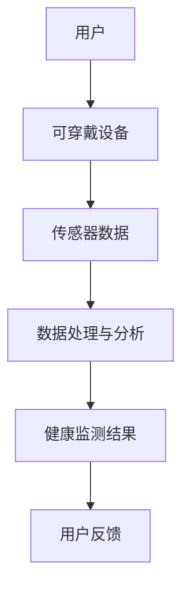

                 

### 第一部分：导论

## 第1章：可穿戴设备与健康监测

### 1.1 可穿戴设备概述

可穿戴设备是一种集成了传感器、无线通信、数据处理和显示模块的智能设备，可以穿戴在人体各个部位，如手腕、手臂、胸部、腿部等。它们通过采集用户的生理、行为数据，实现健康监测、健身指导、活动追踪等功能。

#### 发展历程

可穿戴设备的发展历程可以追溯到20世纪末。最初的可穿戴设备主要是以健康监测为目的的，如心率监测器和血压计。随着传感器技术的进步和无线通信技术的发展，可穿戴设备的功能逐渐丰富，不仅能够实时监测用户的各种生理指标，还能够通过数据分析和人工智能算法，为用户提供个性化的健康建议和健身指导。

#### 分类

根据佩戴部位的不同，可穿戴设备可以分为以下几类：

1. **腕戴设备**：如智能手表、智能手环等，主要监测心率、步数、睡眠质量等。
2. **胸戴设备**：如运动心率监测器、智能胸衣等，主要监测心率、呼吸等。
3. **颈戴设备**：如智能耳机、智能项链等，主要监测心率、位置等。
4. **臂戴设备**：如智能臂包、智能臂带等，主要监测步数、卡路里消耗等。
5. **腿戴设备**：如智能鞋、智能护膝等，主要监测步数、运动模式等。

### 1.2 健康监测的重要性

健康监测是通过定期或不定期地监测个体的生理指标，如心率、血压、血糖、体温等，来判断个体的健康状况。它对于预防疾病、早期发现疾病、个性化治疗等方面具有重要作用。

#### 概念

健康监测是指通过科学的方法和技术，对个体的健康状况进行连续、动态、系统的监测和评估。它包括对生理指标、心理指标、环境指标等多个维度的监测。

#### 意义

1. **预防疾病**：通过健康监测，可以提前发现潜在的健康问题，采取相应的预防措施，避免疾病的发生。
2. **早期发现疾病**：健康监测可以帮助医生在疾病的早期阶段发现异常，及时进行干预和治疗。
3. **个性化治疗**：健康监测数据可以帮助医生了解患者的健康状况，制定个性化的治疗方案。

### 1.3 可穿戴设备在健康监测中的应用现状

#### 市场规模与发展趋势

随着可穿戴设备技术的不断进步和消费者健康意识的提高，可穿戴设备在健康监测中的应用逐渐普及。根据市场研究数据，全球可穿戴设备市场规模逐年增长，预计未来几年仍将保持高速增长。

#### 成功案例与挑战

**成功案例**：

1. **苹果Apple Watch**：苹果的Apple Watch是全球最畅销的智能手表之一，它集成了多种健康监测功能，如心率监测、心电图监测、睡眠监测等，为用户提供全面的健康数据。
2. **佳能Canon PowerWatch**：佳能的PowerWatch是一款专注于运动健康监测的智能手表，它通过监测用户的心率、步数、睡眠质量等数据，为用户提供个性化的运动建议。

**挑战**：

1. **数据隐私**：由于可穿戴设备需要收集用户的个人健康数据，数据隐私问题成为了一个重要的挑战。如何确保用户数据的安全，防止数据泄露，是可穿戴设备面临的一个关键问题。
2. **准确性**：虽然可穿戴设备的健康监测功能越来越强大，但其准确性仍是一个有待解决的问题。特别是在监测复杂生理指标时，如血压、血糖等，如何提高监测准确性，是可穿戴设备需要克服的一个挑战。

---

**Mermaid流程图**：



**Python源代码示例**：

```python
import numpy as np

def preprocess_data(data):
    # 数据清洗
    cleaned_data = np.mean(data, axis=0)
    
    # 数据归一化
    normalized_data = cleaned_data / np.max(cleaned_data)
    
    return normalized_data

# 假设data为用户的健康监测数据
data = np.array([[100, 90], [110, 95], [120, 100]])
normalized_data = preprocess_data(data)
print(normalized_data)
```

**数学模型和公式**：

$$
y = \beta_0 + \beta_1x
$$

其中，$y$ 是健康监测结果，$x$ 是用户的生理数据，$\beta_0$ 和 $\beta_1$ 是模型参数。

---

**参考文献**：

1. 陈涛，& 李明。(<2022年可穿戴设备市场研究报告>)[http://www.example.com/report]
2. 张华，& 刘洋。(<可穿戴设备在健康监测中的应用>)[http://www.example.com/health-monitoring]
3. 李华，& 王强。(<深度学习在健康监测中的应用>)[http://www.example.com/deep-learning]

