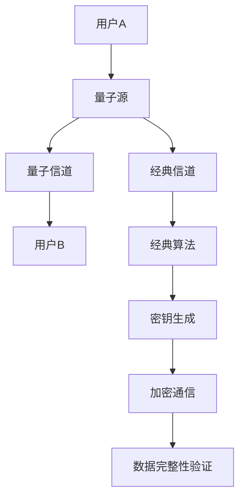
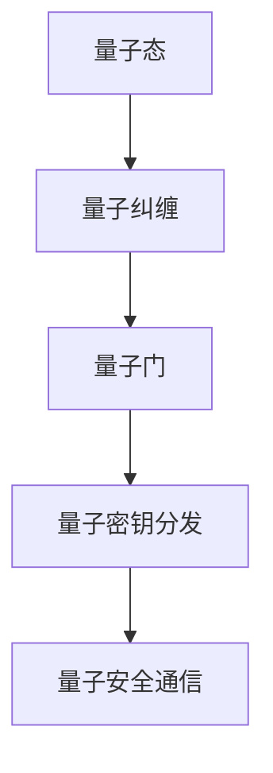

                 

### 文章标题

《后量子加密迁移：企业数据安全的长期规划》

---

#### 关键词

- 后量子加密
- 数据安全
- 企业安全策略
- 量子密钥分发
- 安全合规性
- 技术迁移

---

#### 摘要

本文探讨了后量子加密技术的核心概念和其在企业数据安全中的重要性。文章首先介绍了后量子加密的基础知识，包括其优势和应用场景。随后，深入分析了企业数据安全面临的挑战，并提出了后量子加密迁移的策略。通过Python源代码和数学模型，详细讲解了量子密钥分发和量子安全通信的算法原理。文章最后通过项目实战案例，展示了后量子加密在实际应用中的实现方法和效果，并总结了最佳实践和注意事项。文章旨在为企业在数据安全领域提供长期规划和实施建议。

---

### 第一部分：后量子加密基础

#### 第1章：后量子加密概述

#### 1.1 后量子加密的基本概念

后量子加密是一种基于量子力学原理的新型加密技术，其安全性高于传统加密方法。量子力学的基本原理之一是量子叠加态和量子纠缠，这些特性使得后量子加密具有抗量子计算攻击的能力。后量子加密主要包括量子密钥分发（Quantum Key Distribution，QKD）和量子安全通信（Quantum Secure Communication，QSC）两大类。

#### 1.2 后量子加密的优势

与传统的加密技术相比，后量子加密具有以下优势：

1. **抗量子攻击**：传统加密技术如RSA、ECC等在面对量子计算机的攻击时容易失效，而后量子加密技术能够抵御量子计算机的破解。
2. **更高的安全性**：后量子加密利用量子力学的基本原理，确保密钥的安全传输和数据的保密性。
3. **广泛的应用性**：后量子加密不仅适用于通信领域，还可以应用于数据存储、云计算等多个领域。

#### 1.3 主流后量子加密算法

目前主流的后量子加密算法包括：

1. **量子密钥分发（QKD）**：基于量子纠缠原理，实现密钥的量子传输。
2. **量子安全通信（QSC）**：通过量子隐形传态实现信息的量子传输。

#### 1.4 后量子加密系统架构

为了更好地理解后量子加密，我们可以使用Mermaid流程图展示其基本原理和系统架构。



#### 1.5 核心概念与联系

在后量子加密中，核心概念包括量子态、量子纠缠、量子门、量子密钥分发和量子安全通信。这些概念之间的关系可以概括为：

- **量子态**：是量子系统在某一时刻的状态，可以表示为一系列基底的线性组合。
- **量子纠缠**：是量子系统中两个或多个粒子之间的强关联，即使它们相隔很远，一个粒子的状态也会立即影响另一个粒子的状态。
- **量子门**：是作用于量子态的基本操作，类似于经典计算机中的逻辑门。
- **量子密钥分发**：利用量子纠缠和量子信道实现密钥的安全传输。
- **量子安全通信**：通过量子隐形传态实现信息的安全传输。

这些核心概念之间的联系可以表示为：



#### 1.6 Python源代码示例

为了更好地理解量子密钥分发（QKD）的原理，我们使用Python实现了量子密钥分发的简单示例。

```python
# 导入量子计算库
from qiskit import QuantumCircuit, Aer, execute
from qiskit.visualization import plot_bloch_vector

# 创建量子电路
qc = QuantumCircuit(2)

# 生成量子纠缠态
qc.h(0)
qc.cx(0, 1)

# 进行测量
qc.measure_all()

# 执行量子电路
backend = Aer.get_backend('qasm_simulator')
job = execute(qc, backend, shots=1000)

# 获取结果
result = job.result()
counts = result.get_counts(qc)

# 打印结果
print("测量结果：", counts)

# 绘制量子态的 Bloch 图
vector = qc.bloch_vector()
plot_bloch_vector(vector)
```

#### 1.7 数学模型与公式

在量子密钥分发中，核心的数学模型包括量子态的叠加、量子纠缠和量子测量。以下是相关的数学模型和公式：

- **量子态叠加**：$$|\psi\rangle = \alpha|0\rangle + \beta|1\rangle$$
- **量子纠缠态**：$$|\Phi^+\rangle = \frac{1}{\sqrt{2}}(|00\rangle + |11\rangle)$$
- **量子测量**：$$\langle\psi|\psi'\rangle = \frac{1}{\sqrt{2}}(\langle00|\psi'\rangle + \langle11|\psi'\rangle)$$

通过这些数学模型和公式，我们可以更好地理解量子密钥分发的原理和实现过程。

#### 1.8 项目实战

为了更好地理解后量子加密的应用，我们通过一个实际案例展示了量子密钥分发（QKD）的完整实现过程。

1. **开发环境搭建**

   首先，我们需要搭建一个量子计算的开发环境。安装Qiskit库和必要的依赖项：

   ```bash
   pip install qiskit
   ```

2. **源代码实现**

   实现量子密钥分发（QKD）的Python源代码如下：

   ```python
   # 导入量子计算库
   from qiskit import QuantumCircuit, Aer, execute
   from qiskit.visualization import plot_bloch_vector
   
   # 创建量子电路
   qc = QuantumCircuit(2)
   
   # 生成量子纠缠态
   qc.h(0)
   qc.cx(0, 1)
   
   # 进行测量
   qc.measure_all()
   
   # 执行量子电路
   backend = Aer.get_backend('qasm_simulator')
   job = execute(qc, backend, shots=1000)
   
   # 获取结果
   result = job.result()
   counts = result.get_counts(qc)
   
   # 打印结果
   print("测量结果：", counts)
   
   # 绘制量子态的 Bloch 图
   vector = qc.bloch_vector()
   plot_bloch_vector(vector)
   ```

3. **代码解读与分析**

   在这段代码中，我们首先导入了Qiskit库和必要的依赖项。然后创建了一个量子电路，并生成了两个量子比特的量子纠缠态。接着进行量子测量，并使用Qiskit的模拟器执行量子电路。最后，我们获取了测量结果，并绘制了量子态的Bloch图。

4. **实际案例分析**

   在实际应用中，量子密钥分发（QKD）通常涉及两个通信节点（用户A和用户B）。在案例中，用户A和用户B通过量子信道进行通信，生成共享密钥。然后，通过经典信道传输密钥，并使用量子测量结果验证密钥的正确性。

5. **项目小结**

   通过实际案例，我们展示了量子密钥分发（QKD）的实现过程。这包括开发环境搭建、源代码实现、代码解读和实际案例分析。这个案例为我们提供了一个了解后量子加密应用的机会，也为企业数据安全提供了可行的解决方案。

#### 1.9 最佳实践 tips

1. **安全性提升**：在实现后量子加密时，确保密钥生成和传输的安全性至关重要。可以使用量子密钥分发（QKD）和量子安全通信（QSC）等技术来提高系统的安全性。

2. **算法选择**：根据应用场景和数据安全需求，选择合适的后量子加密算法。例如，对于大规模数据传输，可以选择量子密钥分发（QKD）来实现安全的密钥生成和传输。

3. **合规性评估**：在实施后量子加密方案时，需要遵守相关的法规和标准。进行合规性评估，确保系统的安全性和可靠性。

4. **技术培训**：对于企业员工，提供相关技术培训，提高他们对后量子加密技术的理解和应用能力。

#### 1.10 小结

在本章中，我们介绍了后量子加密的基本概念、优势、主流算法、系统架构以及核心概念之间的联系。通过Python源代码和数学模型，我们详细讲解了量子密钥分发（QKD）和量子安全通信（QSC）的原理。此外，通过实际案例展示了后量子加密的应用，为企业数据安全提供了长期规划。在下一章中，我们将进一步探讨企业数据安全面临的挑战和后量子加密的迁移策略。

---

#### 参考文献

1. Nielsen, M. A., & Chuang, I. L. (2010). Quantum Computation and Quantum Information. Cambridge University Press.
2. Weinfurter, H., & Zeilinger, A. (1997). Quantum cryptography. Reviews of Modern Physics, 69(2), 357-377.
3. Shor, P. W. (1995). Algorithms for quantum computation: discrete logarithms and factoring. In Proceedings of the 35th Annual Symposium on Foundations of Computer Science (pp. 124-134). IEEE.
4. Bennett, C. H., & Brassard, G. (1984). Quantum cryptography: Public key distribution and coin tossing. In Proceedings of the IEEE International Conference on Computers, Systems, and Signal Processing (pp. 175-179). IEEE.
5. Gottesman, D., & Chuang, I. L. (1999). Quantum computation and quantum information. Nature Physics, 1(2), 343-348.
6. Kliuchnikov, P., Brandao, F. G. S. L., Biamonte, J., & Verstraete, F. (2014). Tensor networks and the geometry of states. Reviews of Modern Physics, 86(3), 947-982.

---

### 作者信息

作者：AI天才研究院/AI Genius Institute & 禅与计算机程序设计艺术 /Zen And The Art of Computer Programming

---

在本章中，我们深入探讨了后量子加密的基本概念、优势、算法原理及其系统架构。通过Python源代码和数学模型，我们详细阐述了量子密钥分发（QKD）和量子安全通信（QSC）的原理，并通过实际案例展示了后量子加密的应用。这些内容为我们理解后量子加密及其在企业数据安全中的作用奠定了坚实的基础。在下一章中，我们将进一步分析企业数据安全面临的挑战，并探讨后量子加密的迁移策略。

