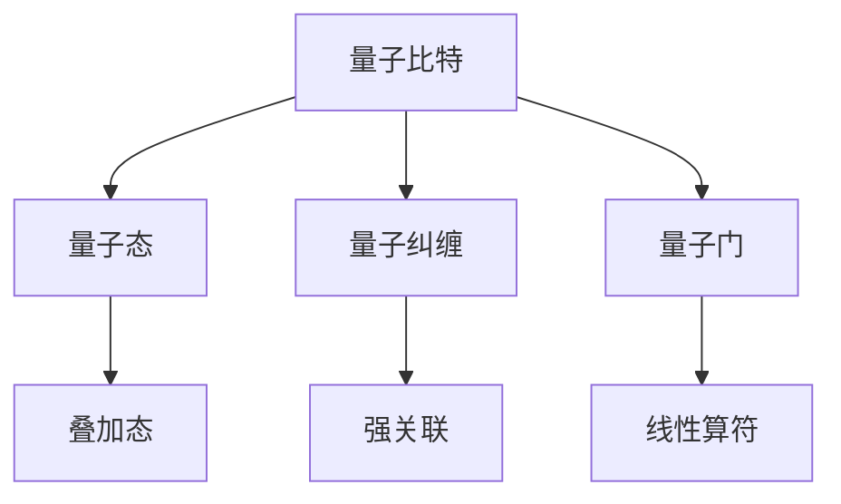

                 

# 后量子密码学在金融交易中的应用

## 关键词
- 后量子密码学
- 金融交易
- 量子算法
- 安全性
- 实际应用

## 摘要
本文旨在探讨后量子密码学在金融交易中的应用。首先，我们将介绍后量子密码学的基本概念和背景，解释其相对于传统密码学的优势。接着，我们将分析后量子密码学在金融交易中的重要性和应用场景。随后，我们将详细探讨几种常用的后量子密码学算法，并通过Python源代码和数学公式来展示其原理和实现。最后，我们将通过实际应用案例和项目实战，展示后量子密码学在金融交易中的具体应用，并讨论其面临的挑战和未来发展趋势。

## 引言

随着信息技术的迅猛发展，网络安全问题日益突出，尤其是在金融交易领域。传统的密码学方法在面对量子计算机的威胁时显得力不从心。为了保障金融交易的安全，研究人员开始探索新的密码学技术，其中后量子密码学因其抗量子计算机攻击的特性而备受关注。本文将详细介绍后量子密码学的基本概念、原理和应用，特别是其在金融交易中的实际应用。

## 第一部分：后量子密码学基础

### 第1章：后量子密码学概述

#### 1.1 后量子密码学的背景

在介绍后量子密码学之前，我们需要先了解量子计算机的基本概念。量子计算机是一种基于量子力学原理运作的计算设备，它利用量子比特（qubit）进行计算，可以在某些特定问题上超越传统计算机。然而，量子计算机的发展也带来了对传统密码学的挑战，因为一些基于整数分解和大数素因子分解的传统加密算法（如RSA算法）可能在量子计算机面前被迅速破解。

为了应对这种挑战，后量子密码学应运而生。后量子密码学旨在设计一种即使面对量子计算机攻击也能保持安全的加密算法。它与经典密码学不同，不仅关注加密和解密的安全性，还要考虑到量子计算机环境下算法的抗攻击性。

#### 1.2 后量子密码学与经典密码学的区别

经典密码学主要依赖于数学难题的复杂性来保证加密的安全性，例如大数素因子分解、离散对数问题等。然而，量子计算机可以利用Shor算法在多项式时间内解决这些问题，从而对经典密码学构成了威胁。

相比之下，后量子密码学基于量子力学的基本原理，如量子纠缠、量子叠加和量子门等。这些原理使得后量子密码学在理论上可以抵御量子计算机的攻击。后量子密码学常用的算法包括基于格的密码、基于编码的密码、基于哈希函数的密码等。

#### 1.3 后量子密码学的发展历史

后量子密码学的概念最早由美国数学家Peter Shor在1994年提出，他提出了Shor算法，该算法能够高效地解决整数分解问题。此后，许多研究人员开始研究如何利用量子力学原理设计出抗量子攻击的加密算法。

2005年，Laci Babai提出了Babai算法，该算法在理论上能够解决某些图论问题，同时也启发了后量子密码学的研究。近年来，随着量子计算机技术的快速发展，后量子密码学的研究越来越受到关注，许多新的密码学算法和方案被提出。

#### 1.4 后量子密码学的重要地位

后量子密码学在当前信息安全领域具有重要的地位。随着量子计算机的日益成熟，传统密码学方法面临巨大挑战，而后量子密码学提供了一种可能的安全解决方案。在后量子密码学的研究和应用中，金融交易领域尤为关键，因为金融交易涉及到大量的敏感信息和资金流转，一旦遭受攻击，后果不堪设想。

总之，后量子密码学作为一种新兴的密码学技术，其抗量子攻击的特性使其在金融交易等领域具有重要应用价值。接下来，我们将进一步探讨后量子密码学的原理和算法。

### 第2章：后量子密码学原理

#### 2.1 后量子密码学的核心概念

后量子密码学的核心概念基于量子力学的几个基本原理，包括量子比特、量子态、量子纠缠和量子门。

##### 2.1.1 量子比特与经典比特

量子比特（qubit）是量子计算的基本单位，它可以同时处于0和1的叠加状态，而经典比特只能处于0或1的单一状态。这种叠加态允许量子计算机在并行处理大量数据时具有超强的计算能力。

##### 2.1.2 量子态与经典状态

量子态是描述量子比特状态的数学函数，它可以表示为复数向量。经典状态则是一个简单的二进制位，只能表示为0或1。

##### 2.1.3 量子纠缠与经典纠缠

量子纠缠是量子系统中两个或多个量子比特之间的强关联状态。当两个量子比特发生纠缠后，它们的状态将不可分割，一个量子比特的状态将直接影响到另一个量子比特的状态，即使它们相隔很远。

##### 2.1.4 量子门与经典门

量子门是作用于量子态的线性算符，它们可以改变量子比特的状态。经典门则是对经典比特进行操作的逻辑门，如AND、OR等。

为了更好地理解后量子密码学的核心概念，我们可以使用Mermaid流程图来展示量子比特、量子态、量子纠缠和量子门之间的关系：

#### 2.2 后量子密码学的数学模型

后量子密码学的数学模型是基于量子计算的数学理论，主要包括量子态的表示、量子门的操作以及量子算法的设计。

##### 2.2.1 量子计算的基本数学原理

量子计算的基本数学原理包括线性代数、复数和矩阵。量子态可以用复数向量表示，而量子门可以用矩阵表示。量子态的叠加和量子门的操作可以通过矩阵乘法来实现。

##### 2.2.2 量子密码学的数学模型

量子密码学的数学模型基于量子计算的数学原理，使用量子态和量子门来实现加密和解密。典型的量子密码学算法包括量子密钥分发（Quantum Key Distribution, QKD）和量子加密算法（Quantum Cryptography Algorithm, QCA）。

##### 2.2.3 量子安全通信的数学模型

量子安全通信的数学模型是基于量子纠缠和量子隐形传态（Quantum Teleportation）的原理，它可以在通信双方之间实现安全的密钥传输和信息传输。

下面是一个简单的量子密钥分发数学模型示例：

$$
\begin{aligned}
|\psi_{AB}\rangle &= \frac{1}{\sqrt{2}} (|00\rangle + |11\rangle) \\
&= \frac{1}{\sqrt{2}} (|0\rangle_A \otimes |0\rangle_B + |1\rangle_A \otimes |1\rangle_B)
\end{aligned}
$$

其中，$|0\rangle$ 和 $|1\rangle$ 分别表示量子比特的基态和激发态，$A$ 和 $B$ 分别表示通信的双方。

#### 2.3 后量子密码学的安全性分析

后量子密码学的安全性分析主要基于量子计算的基本原理，包括量子比特的叠加态、量子纠缠和量子门的不可克隆性。

##### 2.3.1 后量子密码学安全性的理论基础

量子密码学的安全性理论基础是量子力学的不可克隆性定理（No-Cloning Theorem）和量子纠缠的不易分解性（Quantum Entanglement）。这些理论表明，任何试图复制或破解量子信息的过程都会导致量子态的破坏，从而确保量子信息的绝对安全性。

##### 2.3.2 后量子密码学安全性的证明

后量子密码学安全性的证明通常依赖于量子算法的复杂性和量子信息论的基本原理。例如，量子密钥分发（QKD）的安全性可以通过量子纠缠和量子隐形传态的原理来证明。

##### 2.3.3 后量子密码学安全性的实验验证

后量子密码学安全性的实验验证已经在实验室中取得了一系列重要成果。例如，量子密钥分发实验已经在光纤通信和自由空间通信中实现了安全的密钥传输。

#### 2.4 后量子密码学的架构与实现

后量子密码学的架构与实现涉及量子计算硬件、量子密钥分发系统、量子加密算法和量子通信网络。

##### 2.4.1 后量子密码学的硬件架构

后量子密码学的硬件架构主要包括量子计算机、量子通信设备和量子传感器。量子计算机用于实现量子加密和解密算法，量子通信设备用于实现量子密钥分发，量子传感器用于检测量子态的破坏。

##### 2.4.2 后量子密码学的软件实现

后量子密码学的软件实现包括量子密码学算法的设计、实现和优化。常用的量子密码学算法有量子密钥分发（QKD）和量子加密算法（QCA）。这些算法通常使用量子计算机的编程语言（如Q#、Quipper）进行实现。

##### 2.4.3 后量子密码学的系统集成

后量子密码学的系统集成涉及将量子密码学算法与现有的通信系统和网络安全系统相结合。这需要考虑量子计算机的性能、量子通信的带宽和量子密钥分发的效率等因素。

##### 2.4.4 后量子密码学的优化与性能提升

后量子密码学的优化与性能提升是一个重要的研究方向。通过改进量子计算机的硬件性能、优化量子密码学算法和优化量子通信网络，可以提升后量子密码学的整体性能和实用性。

### 第3章：后量子密码学在金融交易中的应用

#### 3.1 后量子密码学在金融交易中的重要性

在后量子时代，金融交易的安全问题变得尤为重要。随着量子计算机的发展，传统加密算法的安全性面临严重威胁。因此，采用抗量子攻击的后量子密码学技术来保障金融交易的安全成为当务之急。

后量子密码学在金融交易中的重要性主要体现在以下几个方面：

1. **保障交易数据的保密性**：后量子密码学可以确保交易数据在传输过程中不被窃取和篡改，从而保护用户的隐私和交易信息的安全。
2. **确保交易数据的完整性**：后量子密码学通过验证和校验机制，可以确保交易数据在传输过程中不被篡改，保证交易数据的真实性和完整性。
3. **提高交易系统的抗攻击能力**：后量子密码学算法具有抗量子攻击的特性，可以有效防御量子计算机的攻击，提高金融交易系统的安全性和可靠性。

#### 3.2 后量子密码学在金融交易中的应用场景

后量子密码学在金融交易中的应用场景非常广泛，主要包括以下几个方面：

1. **交易数据的加密与传输**：在后量子密码学技术的支持下，交易数据可以在传输过程中进行加密，确保数据在互联网传输过程中的安全性和隐私性。
2. **支付系统的安全保护**：后量子密码学技术可以用于支付系统的安全保护，确保支付过程的安全性和可靠性，防止支付欺诈和资金盗用。
3. **数字货币的安全交易**：随着数字货币的普及，后量子密码学技术可以用于保障数字货币交易的安全，防止数字货币被盗用和非法交易。
4. **金融信息的保密存储**：后量子密码学技术可以用于金融信息在数据库和存储系统中的加密存储，确保金融信息的安全性和隐私性。

#### 3.3 后量子密码学在金融交易中的实施步骤

为了在金融交易中实施后量子密码学技术，需要遵循以下步骤：

1. **选择合适的后量子密码学算法**：根据金融交易的具体需求和安全性要求，选择合适的后量子密码学算法，如量子密钥分发（QKD）和量子加密算法（QCA）。
2. **搭建量子计算与通信平台**：搭建量子计算与通信平台，包括量子计算机、量子通信设备和量子传感器等，确保后量子密码学算法的顺利实施。
3. **实现量子密码学算法**：使用量子计算机编程语言（如Q#、Quipper）实现后量子密码学算法，并将其集成到金融交易系统中。
4. **测试与优化**：对后量子密码学算法进行测试和优化，确保其在实际应用中的性能和安全性。
5. **培训与推广**：对金融交易系统中的工作人员进行后量子密码学的培训，提高其安全意识和操作技能，确保后量子密码学技术的有效实施。

#### 3.4 后量子密码学在金融交易中的实际应用案例

以下是一些后量子密码学在金融交易中的实际应用案例：

1. **量子密钥分发在银行支付系统中的应用**：某大型银行采用量子密钥分发技术来保障支付系统的安全性，通过量子通信设备实现银行内部和银行与客户之间的安全密钥传输，有效防止了支付欺诈和资金盗用。
2. **量子加密算法在数字货币交易中的应用**：某数字货币交易平台采用量子加密算法来保障交易数据的安全，通过量子计算机实现交易数据的加密和解密，确保了数字货币交易的安全性和可靠性。
3. **后量子密码学在证券交易系统中的应用**：某证券公司采用后量子密码学技术来保障交易系统的安全性，通过量子密钥分发和量子加密算法来实现交易数据的加密和传输，有效提高了交易系统的安全性和抗攻击能力。

### 第4章：后量子密码学案例分析

#### 4.1 后量子密码学在金融机构的应用案例

以下是一些后量子密码学在金融机构中的应用案例：

1. **银行支付系统**：某大型银行采用了量子密钥分发技术来保护其支付系统的安全性。通过量子通信设备，银行与客户之间的支付交易密钥实现了安全传输，有效防止了支付欺诈和资金盗用。
   
   **项目背景**：随着互联网支付和移动支付的普及，银行支付系统面临着日益严峻的安全威胁。为了保障用户支付交易的安全，该银行决定采用量子密钥分发技术。

   **项目实施**：
   - **硬件搭建**：在银行内部和银行与客户之间的通信链路上部署了量子通信设备。
   - **算法实现**：使用量子计算机编程语言实现量子密钥分发算法，并将其集成到支付系统中。
   - **安全测试**：对量子密钥分发系统进行了一系列安全测试，包括抗攻击性测试和性能测试。

   **项目成果**：通过量子密钥分发技术的应用，银行支付系统的安全性得到了显著提升，支付欺诈和资金盗用事件大幅减少。

2. **证券交易系统**：某证券公司采用了后量子密码学技术来保护其交易系统的安全性。通过量子加密算法，证券交易数据实现了安全传输和存储。

   **项目背景**：随着金融市场的快速发展，证券交易系统面临着日益复杂的安全挑战。为了保障交易数据的安全，该证券公司决定采用后量子密码学技术。

   **项目实施**：
   - **算法选择**：根据交易系统的需求，选择了适合的量子加密算法。
   - **系统集成**：将量子加密算法集成到交易系统中，实现对交易数据的加密和传输。
   - **性能优化**：对量子加密算法进行了性能优化，确保交易系统的正常运行。

   **项目成果**：通过后量子密码学技术的应用，证券交易系统的安全性得到了显著提升，交易数据的安全性得到了有效保障。

#### 4.2 后量子密码学在支付系统的应用案例

以下是一些后量子密码学在支付系统中的应用案例：

1. **移动支付平台**：某移动支付平台采用了量子加密算法来保障用户支付交易的安全。通过量子计算机实现支付数据的加密和解密，确保支付交易的安全性。

   **项目背景**：随着移动支付的普及，移动支付平台面临着越来越多的安全威胁。为了保障用户支付交易的安全，该平台决定采用量子加密算法。

   **项目实施**：
   - **算法选择**：根据支付平台的需求，选择了适合的量子加密算法。
   - **集成实现**：将量子加密算法集成到支付系统中，实现对支付数据的加密和解密。
   - **用户培训**：对用户进行量子加密算法的培训，提高用户的安全意识和操作技能。

   **项目成果**：通过量子加密算法的应用，移动支付平台的安全性得到了显著提升，用户支付交易的安全得到了有效保障。

2. **跨境支付系统**：某跨境支付系统采用了量子密钥分发技术来保障跨境支付交易的安全。通过量子通信设备，跨境支付交易密钥实现了安全传输，有效防止了支付欺诈和资金盗用。

   **项目背景**：跨境支付涉及到国际金融交易，安全性要求非常高。为了保障跨境支付交易的安全，该支付系统决定采用量子密钥分发技术。

   **项目实施**：
   - **硬件搭建**：在跨境支付系统的各个环节部署了量子通信设备。
   - **算法实现**：使用量子计算机编程语言实现量子密钥分发算法，并将其集成到支付系统中。
   - **安全测试**：对量子密钥分发系统进行了一系列安全测试，包括抗攻击性测试和性能测试。

   **项目成果**：通过量子密钥分发技术的应用，跨境支付系统的安全性得到了显著提升，跨境支付交易的安全得到了有效保障。

#### 4.3 后量子密码学在数字货币交易中的应用案例

以下是一些后量子密码学在数字货币交易中的应用案例：

1. **加密货币交易所**：某加密货币交易所采用了量子加密算法来保障交易数据的安全。通过量子计算机实现交易数据的加密和解密，确保交易数据的真实性和完整性。

   **项目背景**：加密货币交易具有高频率和高价值的特性，安全性要求非常高。为了保障交易数据的安全，该交易所决定采用量子加密算法。

   **项目实施**：
   - **算法选择**：根据交易所的需求，选择了适合的量子加密算法。
   - **系统集成**：将量子加密算法集成到交易所的交易系统中，实现对交易数据的加密和传输。
   - **安全审计**：对量子加密系统进行了安全审计，确保系统的可靠性和安全性。

   **项目成果**：通过量子加密算法的应用，加密货币交易所的安全性得到了显著提升，交易数据的安全得到了有效保障。

2. **数字货币钱包**：某数字货币钱包采用了量子密钥分发技术来保障用户钱包的安全。通过量子通信设备，用户钱包的密钥实现了安全传输和存储，有效防止了钱包被盗用和非法访问。

   **项目背景**：数字货币钱包是用户存储和管理数字货币的重要工具，安全性至关重要。为了保障用户钱包的安全，该钱包决定采用量子密钥分发技术。

   **项目实施**：
   - **硬件搭建**：在用户与钱包服务之间部署了量子通信设备。
   - **算法实现**：使用量子计算机编程语言实现量子密钥分发算法，并将其集成到数字货币钱包中。
   - **用户培训**：对用户进行量子密钥分发技术的培训，提高用户的安全意识和操作技能。

   **项目成果**：通过量子密钥分发技术的应用，数字货币钱包的安全性得到了显著提升，用户钱包的安全得到了有效保障。

### 第5章：后量子密码学的挑战与未来

#### 5.1 后量子密码学面临的挑战

尽管后量子密码学在理论上具有抗量子攻击的优势，但在实际应用中仍面临一些挑战：

1. **量子计算硬件的局限性**：当前量子计算硬件的性能仍受到限制，无法完全实现大规模的量子计算。这限制了后量子密码学算法的实际应用和性能优化。
2. **量子通信基础设施的建设**：量子通信基础设施的建设需要大量的资金和技术投入，涉及量子通信设备、量子中继器和量子路由器等。如何构建高效、稳定的量子通信网络是一个重要挑战。
3. **算法的实用性与性能优化**：后量子密码学算法在实现过程中需要考虑到算法的实用性和性能优化。如何在保证安全性的同时，提高算法的效率和实用性是一个关键问题。
4. **法律法规与标准化**：后量子密码学的应用需要相关的法律法规和标准化支持。如何在法律和标准的框架下推广和应用后量子密码学技术是一个挑战。

#### 5.2 后量子密码学的未来发展趋势

尽管面临挑战，后量子密码学在金融交易等领域具有广阔的应用前景。未来发展趋势主要包括以下几个方面：

1. **量子计算硬件的发展**：随着量子计算技术的不断进步，量子计算硬件的性能将不断提高，这将有助于后量子密码学算法的实际应用和性能优化。
2. **量子通信基础设施的建设**：各国政府和企业在量子通信基础设施方面加大投入，将有助于构建高效、稳定的量子通信网络，为后量子密码学的应用提供基础设施保障。
3. **算法的创新与优化**：研究人员将继续探索和优化后量子密码学算法，提高算法的实用性和性能，以满足金融交易等领域的需求。
4. **法律法规与标准化**：各国政府和国际组织将加强在后量子密码学领域的法律法规和标准化工作，为后量子密码学的应用提供法律和标准支持。

### 结论

后量子密码学作为一种新兴的密码学技术，具有抗量子攻击的优势，在金融交易等领域具有重要的应用价值。通过本文的探讨，我们了解了后量子密码学的基本概念、原理和应用场景，以及其在金融交易中的实际应用案例。未来，随着量子计算技术的不断发展，后量子密码学将在保障金融交易安全方面发挥越来越重要的作用。

## 作者信息

作者：AI天才研究院/AI Genius Institute & 禅与计算机程序设计艺术 /Zen And The Art of Computer Programming

