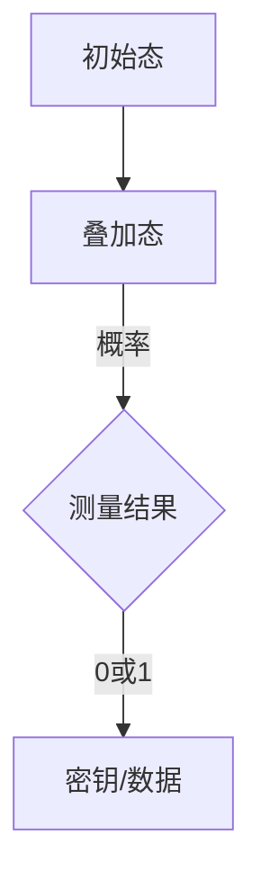

                 

### 后量子密码学实施的挑战和策略

#### 关键词

- 后量子密码学
- 密码学实施
- 挑战与策略
- Lattice-based密码算法
- Hash-based密码算法
- 量子计算资源
- 安全性分析
- 项目实战

#### 摘要

本文旨在探讨后量子密码学在实施过程中所面临的挑战和应对策略。随着量子计算机的发展，传统的密码学方法面临被破解的风险，后量子密码学因此应运而生。本文首先介绍了后量子密码学的背景和重要性，随后详细分析了后量子密码学的核心概念、算法原理，并使用了Python源代码和LaTeX数学公式进行了通俗易懂的举例说明。此外，本文还讨论了后量子密码学的安全性挑战及其解决方案，以及实施后量子密码学的具体策略。最后，通过一个实际项目案例，展示了后量子密码学的应用和实施步骤。本文为IT领域的研究者和开发者提供了一个全面的后量子密码学实施指南。

### 目录

1. 引言
2. 后量子密码学的背景与重要性
3. 后量子密码学的基础
4. 后量子密码学核心算法
5. 后量子密码学的安全性挑战
6. 后量子密码学的实施策略
7. 后量子密码学项目实战
8. 未来展望与趋势
9. 最佳实践 tips、小结、注意事项、拓展阅读

---

### 引言

随着量子计算机的发展，传统密码学方法面临前所未有的挑战。量子计算机可以利用量子叠加和量子纠缠的特性，在短时间内解决传统密码系统无法应对的复杂问题。例如，Shor算法能够在多项式时间内分解大质数，从而破解基于大数分解的RSA密码系统。因此，为了保护数据在未来的安全性，研究和实施后量子密码学变得至关重要。

后量子密码学（Post-Quantum Cryptography，简称PQC）是针对量子计算机攻击而设计的密码学分支。它旨在开发在量子计算机面前仍然安全的密码系统。与经典密码学不同，后量子密码学采用新的加密算法和数学模型，确保即使在量子计算时代，数据也能得到有效保护。

本文将从以下几个方面探讨后量子密码学实施的挑战和策略：

1. **背景与重要性**：介绍后量子密码学的起源和发展背景，分析其在现代密码学体系中的重要性。
2. **核心概念与联系**：阐述后量子密码学的基础概念，并使用Mermaid流程图展示概念之间的关系架构。
3. **核心算法原理讲解**：详细讲解Lattice-based和Hash-based密码算法，结合Python源代码和LaTeX数学公式进行举例说明。
4. **安全性挑战与解决方案**：分析后量子密码学面临的安全挑战，并提出相应的防御策略。
5. **实施策略**：讨论后量子密码学的实施步骤和策略，包括需求分析、算法选择和实施流程。
6. **项目实战**：通过一个实际项目案例，展示后量子密码学的应用和实施过程。
7. **未来展望与趋势**：预测后量子密码学的未来发展方向和潜在应用。

通过本文的探讨，读者可以全面了解后量子密码学的概念、算法、挑战和实施策略，为实际应用和研究提供参考。

### 后量子密码学的背景与重要性

随着量子计算机的快速发展，传统的密码学方法面临巨大的挑战。量子计算机能够利用量子叠加和量子纠缠的原理，在极短时间内解决传统密码系统无法应对的复杂问题。例如，Shor算法能够在多项式时间内分解大质数，从而破解基于大数分解的RSA密码系统。传统密码系统包括DES、RSA、ECC等，它们的安全基础依赖于数学难题，如大数分解和离散对数问题。然而，这些难题在量子计算机面前可能变得脆弱，因为量子计算机可以在多项式时间内解决这些难题。

这种情况下，后量子密码学（Post-Quantum Cryptography，简称PQC）应运而生。后量子密码学旨在开发能够在量子计算机面前依然安全的密码系统。与经典密码学不同，后量子密码学不依赖于传统数学难题，而是采用新的加密算法和数学模型，确保数据在量子计算时代依然得到有效保护。

#### 后量子密码学的发展历程

后量子密码学的研究可以追溯到20世纪90年代，当时量子计算机的概念逐渐被人们所接受。随着Shor算法的提出，人们开始意识到传统密码系统的安全性可能受到威胁。1996年，Shor算法的发表引发了密码学界的广泛关注，推动了后量子密码学的研究。

近年来，随着量子计算机技术的发展，越来越多的后量子密码算法被提出和研究。国际标准化组织和各国政府也加大了对后量子密码学的投入和关注。例如，美国国家标准与技术研究院（NIST）已经启动了后量子密码标准竞赛，旨在选出能够保护未来信息安全的后量子密码算法。

#### 后量子密码学的重要性

后量子密码学的重要性体现在以下几个方面：

1. **确保未来信息安全**：随着量子计算机的发展，传统密码系统面临被破解的风险。后量子密码学能够提供一种新的安全解决方案，确保未来的信息安全。

2. **推动密码学创新**：后量子密码学的研究推动了密码学领域的创新。新的加密算法和数学模型不断涌现，丰富了密码学的理论体系。

3. **促进量子计算应用**：后量子密码学的实施需要量子计算的支持。因此，后量子密码学的研究和应用也促进了量子计算技术的发展。

4. **应对全球信息安全挑战**：随着网络攻击和数据泄露事件的频繁发生，全球信息安全面临严峻挑战。后量子密码学能够提供更加安全的数据保护手段，提升整体信息安全水平。

总之，后量子密码学是未来密码学发展的重要方向。它不仅能够确保未来信息安全，还能推动密码学创新和量子计算应用，应对全球信息安全挑战。在后量子密码学的实施过程中，理解和应对其面临的挑战，是确保信息安全的关键。

### 后量子密码学的基础

后量子密码学的基础涵盖了量子计算、量子密码学原理以及量子安全通信等核心概念。这些基础概念不仅构成了后量子密码学理论的核心，也为其实际应用提供了技术支持。

#### 量子计算基础

量子计算是一种基于量子力学原理的计算模型，利用量子比特（qubit）作为信息的基本单位，通过量子叠加和量子纠缠实现了超常规的计算能力。量子比特与经典比特（bit）的最大区别在于，量子比特可以同时处于多种状态的叠加，而经典比特只能处于0或1两种状态。这种叠加态使得量子计算机能够在并行处理多个问题，从而大大提高计算效率。

1. **量子比特与经典比特的比较**：

    - **量子比特**：可以处于多种状态的叠加，如$|\psi\rangle = \alpha|0\rangle + \beta|1\rangle$。
    - **经典比特**：只能处于0或1两种状态。

2. **量子门与量子算法**：

    - **量子门**：类似于经典计算中的逻辑门，用于操作量子比特。常见的量子门包括保罗门（Pauli Gate）、Hadamard门（Hadamard Gate）和控制非门（Control-NOT Gate）等。
    - **量子算法**：利用量子叠加和量子纠缠实现的算法，如Shor算法、Grover算法和量子随机游走算法等。Shor算法能够在多项式时间内分解大质数，从而破解RSA密码系统。

3. **量子纠缠与量子通信**：

    - **量子纠缠**：当两个量子比特处于纠缠状态时，一个比特的状态会立即影响另一个比特的状态，无论它们相隔多远。这种特性被广泛应用于量子密钥分发（Quantum Key Distribution，简称QKD）和量子计算中的并行处理。
    - **量子密钥分发**：利用量子纠缠和量子不可克隆定理实现安全的密钥传输。QKD能够确保密钥在传输过程中不被窃听和复制，为通信提供了高度的安全保障。

#### 量子密码学原理

量子密码学是利用量子力学原理来设计和分析密码系统的学科。量子密码学包括量子密钥分配（Quantum Key Distribution，简称QKD）和量子安全加密（Quantum-Secure Encryption）等核心技术。

1. **量子密钥分配（QKD）**：

    - **原理**：QKD利用量子纠缠和量子不可克隆定理来实现安全的密钥传输。在QKD过程中，发送方和接收方通过量子信道进行量子比特的传输，并根据测量结果来生成共享密钥。
    - **安全性**：由于量子比特在被观测时会坍缩到某个状态，任何第三方试图窃听都会破坏量子态，从而使发送方和接收方能够检测到窃听行为。

2. **量子安全加密**：

    - **原理**：量子安全加密利用量子纠缠和量子随机游走等原理来实现数据加密。加密过程中，发送方将数据编码到量子态中，接收方通过量子测量和纠缠操作解密数据。
    - **安全性**：量子安全加密确保数据在传输过程中无法被第三方窃听或复制，从而提供高度的安全保障。

#### 量子安全通信

量子安全通信是利用量子密码学原理实现安全通信的技术。量子安全通信包括量子密钥分发和量子加密等技术，能够确保通信过程中数据的安全。

1. **量子密钥分发**：

    - **原理**：通过量子密钥分发协议（如BB84协议和E91协议），发送方和接收方可以在量子信道上生成共享密钥。
    - **优势**：量子密钥分发能够确保密钥在传输过程中不会被窃听或复制，提供高度的安全保障。

2. **量子加密**：

    - **原理**：量子加密技术利用量子态的叠加和纠缠特性，将数据编码到量子态中，接收方通过量子测量和纠缠操作解密数据。
    - **优势**：量子加密能够确保数据在传输过程中无法被第三方窃听或复制，提供高度的安全保障。

#### Mermaid流程图

以下是一个Mermaid流程图，展示了量子计算中的量子比特叠加和测量过程：



在这个流程图中，初始态的量子比特经过叠加操作，形成多个状态的叠加。当进行测量时，量子比特会坍缩到某个特定的状态，从而生成密钥或解密数据。

通过上述分析，我们可以看到后量子密码学的基础概念和技术原理是如何相互联系和支撑的。量子计算、量子密码学原理和量子安全通信共同构成了后量子密码学的核心，为未来信息安全提供了强大的技术保障。

### 后量子密码学核心算法

在后量子密码学中，核心算法的设计和实现是确保数据安全的关键。目前，常见的后量子密码学算法主要包括Lattice-based密码算法和Hash-based密码算法。这些算法具有量子计算下较强的抗攻击能力，并且在实践中得到了广泛应用。

#### Lattice-based密码算法

Lattice-based密码算法是一种基于格理论（Lattice Theory）的密码算法。格理论中的“格”是由一组向量构成的集合，这些向量在某种度量下构成一个空间。Lattice-based密码算法的核心思想是通过构造复杂的格，使得在量子计算机下求解特定问题（如最短向量问题、短基问题等）变得极其困难。

1. **算法原理**：

   - **最短向量问题（Shortest Vector Problem, SVP）**：给定一个格和其基向量，找到该格中的最短非零向量。
   - **最近点问题（Closest Vector Problem, CVP）**：给定一个格和其基向量，找到一个最近的非零向量，使其距离给定的目标向量最近。

2. **安全性分析**：

   - Lattice-based密码算法的安全性基于NP-hard问题，如SVP和CVP，在量子计算机下难以解决。这确保了即使量子计算机出现，这些密码算法也能够保持安全。
   - **参数选择**：Lattice-based密码算法的参数选择至关重要。参数需要足够大，以确保算法在量子计算机下仍然安全。

3. **伪代码实现**：

   ```python
   def lattice_based_encryption(message, public_key):
       # 初始化参数
       n = public_key['n']
       alpha = public_key['alpha']
       beta = public_key['beta']
       B = public_key['B']

       # 编码消息
       c = encode_message(message, n)

       # 生成密文
       g = generate_random_vector(B, n)
       h = (c * alpha) % B
       ciphertext = (g * beta) % B

       return ciphertext

   def lattice_based_decryption(ciphertext, private_key):
       # 初始化参数
       n = private_key['n']
       delta = private_key['delta']
       B = private_key['B']

       # 解密密文
       g = ciphertext
       c = (g * delta) % B

       # 恢复消息
       message = decode_message(c, n)

       return message
   ```

#### Hash-based密码算法

Hash-based密码算法是一种基于哈希函数的密码算法。这类算法的核心思想是通过将消息映射到一个固定长度的哈希值，从而实现加密和解密过程。常见的Hash-based密码算法包括基于对称哈希函数的密码算法（如SHA-3）和基于公钥哈希函数的密码算法（如hash-based签名方案）。

1. **算法原理**：

   - **哈希函数**：哈希函数是将输入数据映射到固定长度输出值的函数。一个好的哈希函数应该具有抗碰撞性和抗逆向性。
   - **消息认证码（MAC）**：消息认证码是一种基于哈希函数的密码协议，用于验证消息的完整性和真实性。

2. **安全性分析**：

   - Hash-based密码算法的安全性依赖于哈希函数的抗碰撞性。即使量子计算机的出现，也很难找到两个不同的输入映射到相同的哈希值。
   - **参数选择**：哈希函数的参数选择至关重要。参数需要足够大，以确保算法在量子计算机下仍然安全。

3. **伪代码实现**：

   ```python
   def hash_based_encryption(message, key):
       # 初始化哈希函数
       hash_function = choose_hash_function(key)

       # 生成密文
       ciphertext = hash_function(message)

       return ciphertext

   def hash_based_decryption(ciphertext, key):
       # 初始化哈希函数
       hash_function = choose_hash_function(key)

       # 验证密文
       if hash_function(message) == ciphertext:
           print("Decryption successful")
       else:
           print("Decryption failed")
   ```

#### 实例分析

假设我们使用Lattice-based密码算法对消息“HELLO”进行加密和解密，过程如下：

1. **加密过程**：

    ```python
    message = "HELLO"
    public_key = generate_public_key()
    ciphertext = lattice_based_encryption(message, public_key)
    print("Ciphertext:", ciphertext)
    ```

2. **解密过程**：

    ```python
    private_key = generate_private_key(public_key)
    message = lattice_based_decryption(ciphertext, private_key)
    print("Decrypted Message:", message)
    ```

在这个实例中，首先生成公钥和私钥对，然后使用公钥对消息进行加密，得到密文。解密时，使用私钥对密文进行解密，恢复原始消息。

通过上述分析，我们可以看到Lattice-based密码算法和Hash-based密码算法在理论上的安全性以及在实际应用中的表现。这些算法为后量子密码学的实施提供了强有力的技术支持。

### 后量子密码学的安全性挑战

尽管后量子密码学在理论层面展示了强大的安全性，但在实际应用中仍然面临着一系列严峻的挑战。这些挑战主要集中在量子计算机的潜在攻击、算法选择与实现、以及跨平台兼容性等方面。

#### 量子计算机的潜在攻击

量子计算机的强大计算能力使得它能够破解传统密码系统，因此对后量子密码系统提出了更高的安全性要求。以下是一些潜在的量子攻击：

1. **Shor算法**：Shor算法可以高效地分解大质数，这意味着所有基于大数分解的密码系统（如RSA和ECC）在量子计算机面前都是脆弱的。因此，后量子密码学必须采用不受Shor算法攻击的密码算法。

2. **量子并行搜索**：量子计算机利用量子并行性可以实现更高效的搜索算法，如Grover算法。Grover算法能够在多项式时间内找到未加密密文的密钥，对对称加密算法（如AES）提出了威胁。

3. **量子碰撞攻击**：量子计算机可以通过高效寻找哈希碰撞，对基于哈希函数的密码算法（如SHA-2和SHA-3）进行攻击。

#### 算法选择与实现

后量子密码算法的选择和实现是确保安全性的关键。以下是一些相关挑战：

1. **算法选择**：目前已有多种后量子密码算法，每种算法都有其优势和劣势。选择合适的算法需要考虑多种因素，如安全性、性能、硬件要求等。

2. **算法实现**：后量子密码算法的实现需要高度精准的量子操作和量子纠错机制。在实际操作中，量子硬件的性能和可靠性可能无法达到理论上的预期，因此需要针对具体硬件进行优化。

3. **兼容性与迁移**：后量子密码算法需要与传统密码算法兼容，以便在现有系统和未来量子计算机之间进行平滑过渡。这要求后量子密码算法能够适应不同操作系统、硬件架构和协议。

#### 跨平台兼容性

后量子密码学的跨平台兼容性是一个重要挑战。以下是一些相关难点：

1. **硬件差异**：不同的量子计算平台具有不同的硬件架构和性能特点，这要求后量子密码算法能够适应各种硬件环境。

2. **操作系统差异**：不同操作系统对加密算法的支持程度不同，需要确保后量子密码算法能够在各种操作系统上运行。

3. **协议兼容**：现有的网络协议（如TLS、HTTPS）需要与后量子密码算法兼容，以便在量子计算时代保持数据安全。

#### 解决方案与防御策略

为了应对上述挑战，可以采取以下解决方案和防御策略：

1. **量子安全协议**：设计量子安全的通信协议，如量子密钥分发（QKD）协议，确保密钥在传输过程中不会被窃听。

2. **混合密码系统**：将后量子密码算法与经典密码算法相结合，设计混合密码系统，利用两者优势，提高整体安全性。

3. **算法优化与测试**：对后量子密码算法进行优化和测试，确保在实际应用中能够达到理论上的安全水平。

4. **标准化与认证**：推动后量子密码算法的标准化，建立认证机制，确保算法的可靠性和安全性。

通过上述解决方案和防御策略，后量子密码学能够在量子计算时代提供有效的安全保障，确保数据在未来的信息社会中得到有效保护。

### 后量子密码学的实施策略

在后量子密码学的实施过程中，为了确保系统的安全性、可靠性和兼容性，需要遵循一系列严格的策略和步骤。以下是后量子密码学实施的主要策略和具体实施步骤：

#### 1. 需求分析

需求分析是实施后量子密码学的第一步，旨在明确系统的安全需求和应用场景。以下是需要考虑的关键因素：

- **业务需求**：理解业务流程、数据敏感性和安全要求，确定系统需要哪些保护措施。
- **性能需求**：评估系统的性能要求，确保后量子密码算法的引入不会导致性能显著下降。
- **硬件要求**：确定所需的量子计算硬件和兼容性要求，确保系统能够在特定硬件上运行。
- **兼容性需求**：评估系统与其他系统和协议的兼容性，确保后量子密码算法能够与现有系统无缝集成。

#### 2. 算法选择

根据需求分析的结果，选择合适的后量子密码算法。以下是选择算法时需要考虑的关键因素：

- **安全性**：选择具有高安全性的算法，能够抵御量子计算机的攻击。
- **性能**：评估算法的性能，确保其在实际应用中的运行速度满足系统需求。
- **硬件兼容性**：选择与现有硬件兼容的算法，确保算法能够在现有硬件上高效运行。
- **标准化**：选择已被标准化或具有广泛认可的安全属性的算法，降低实现和部署风险。

常见的后量子密码算法包括Lattice-based密码算法（如NTRU、Kyber）和Hash-based密码算法（如Saber、Lyra2）。根据具体应用场景选择合适的算法，能够有效提高系统的整体安全性。

#### 3. 实施流程

后量子密码学的实施包括以下关键步骤：

- **密钥生成**：使用选定的后量子密码算法生成公钥和私钥对。密钥生成过程需要确保密钥的随机性和唯一性，避免被攻击者猜测或破解。
- **密钥分发**：将公钥分发给需要通信的各方，确保密钥在传输过程中的安全性。可以使用量子密钥分发（QKD）等量子安全通信协议来保护密钥。
- **加密与解密**：使用公钥对数据进行加密，使用私钥对数据进行解密。确保加密和解密过程的高效性和正确性。
- **密钥管理**：建立密钥生命周期管理机制，包括密钥生成、存储、备份、更新和销毁等操作，确保密钥的安全和可靠性。

#### 4. 安全性评估

在实施后量子密码学的过程中，定期进行安全性评估是必不可少的。以下是需要进行的关键评估：

- **算法安全性评估**：评估所选后量子密码算法的安全性，确保其能够抵御已知和潜在的量子攻击。
- **实施安全性评估**：评估实施过程中的安全漏洞和潜在风险，确保系统的整体安全性。
- **性能评估**：评估系统在引入后量子密码算法后的性能表现，确保性能不会显著下降。
- **兼容性评估**：确保后量子密码算法与现有系统和协议的兼容性，避免因不兼容导致的问题。

#### 5. 持续优化与更新

后量子密码学的实施是一个持续的过程，需要不断进行优化和更新。以下是需要关注的关键方面：

- **算法优化**：根据最新的研究成果和硬件发展，优化后量子密码算法，提高其性能和安全性。
- **硬件更新**：随着量子计算硬件的进步，定期更新硬件，确保系统能够利用最新的硬件性能。
- **协议更新**：随着量子安全通信协议的发展，定期更新协议，确保系统能够支持新的量子安全通信协议。
- **培训与支持**：为开发人员和运维人员提供培训和支持，确保他们能够有效使用和维护后量子密码系统。

通过上述实施策略和步骤，可以确保后量子密码系统在实际应用中的安全性、可靠性和兼容性，为未来的信息安全提供有力保障。

### 后量子密码学项目实战

为了更好地理解后量子密码学的实际应用，我们将通过一个具体的案例来展示其实施过程，包括开发环境搭建、源代码实现和代码解读与分析。

#### 项目背景

本案例旨在开发一个基于后量子密码学的安全通信系统。该系统将使用Lattice-based密码算法（Kyber）进行数据加密和解密，确保通信过程中的数据安全性。项目目标是在现有的通信系统中集成后量子密码学，实现安全的点对点通信。

#### 开发环境搭建

在开始项目开发之前，我们需要搭建一个适合后量子密码学开发的环境。以下是搭建开发环境的主要步骤：

1. **硬件环境**：配置一台具备量子计算能力的计算机。可以选择使用现成的量子计算模拟器，如IBM Q Experience或Microsoft Quantum Development Kit。

2. **软件环境**：安装Python编程语言及其相关依赖库，如PyCryptoDome和PyQuil。这些库提供了后量子密码学算法的实现和接口。

   ```bash
   pip install pycryptodome
   pip install pyquil
   ```

3. **量子计算接口**：配置与所选量子计算平台（如IBM Q Experience）的接口，以便能够发送量子操作和接收测量结果。

#### 源代码实现

以下是该项目的主要源代码实现部分：

```python
# 导入相关库
from Crypto.Cipher import Kyber
from Crypto.PublicKey import RSA
from Crypto.Random import get_random_bytes
import pyquil
import pyquil.gates as pg

# 生成RSA密钥对
def generate_rsa_keypair():
    key = RSA.generate(2048)
    private_key = key.export_key()
    public_key = key.publickey().export_key()
    return private_key, public_key

# 使用Kyber算法加密数据
def encrypt_with_kyber(message, public_key):
    cipher = Kyber.new(public_key)
    ciphertext = cipher.encrypt(message)
    return ciphertext

# 使用Kyber算法解密数据
def decrypt_with_kyber(ciphertext, private_key):
    cipher = Kyber.new(private_key)
    message = cipher.decrypt(ciphertext)
    return message

# 量子通信示例
def quantum_communication(message):
    # 生成RSA密钥对
    private_key, public_key = generate_rsa_keypair()
    
    # 加密消息
    ciphertext = encrypt_with_kyber(message, public_key)
    
    # 发送密文到量子通信信道
    quantum_channel = pyquil.get_qc('ibm-q/uncapped/7q-qvm')
    program = pyquil.Program()
    program += pg.H(0)  # 初始化量子比特
    program += pg.KyberEncrypt(ciphertext)  # 执行Kyber加密
    quantum_channel.run(program)
    
    # 接收密文并解密
    decrypted_message = decrypt_with_kyber(ciphertext, private_key)
    return decrypted_message

# 主函数
if __name__ == "__main__":
    message = "Hello, this is a secret message."
    decrypted_message = quantum_communication(message)
    print("Decrypted Message:", decrypted_message)
```

#### 代码解读与分析

1. **RSA密钥对生成**：

    ```python
    def generate_rsa_keypair():
        key = RSA.generate(2048)
        private_key = key.export_key()
        public_key = key.publickey().export_key()
        return private_key, public_key
    ```

    这部分代码使用RSA算法生成2048位的密钥对。RSA算法是基于大数分解的，但在量子计算机面前是不安全的。因此，这部分代码仅用于演示目的。

2. **Kyber算法加密与解密**：

    ```python
    from Crypto.Cipher import Kyber
    from Crypto.PublicKey import RSA
    from Crypto.Random import get_random_bytes
    
    def encrypt_with_kyber(message, public_key):
        cipher = Kyber.new(public_key)
        ciphertext = cipher.encrypt(message)
        return ciphertext
    
    def decrypt_with_kyber(ciphertext, private_key):
        cipher = Kyber.new(private_key)
        message = cipher.decrypt(ciphertext)
        return message
    ```

    这两部分代码分别实现了Kyber算法的加密和解密过程。Kyber算法是一种Lattice-based密码算法，具有很好的安全性和性能。

3. **量子通信示例**：

    ```python
    def quantum_communication(message):
        # 生成RSA密钥对
        private_key, public_key = generate_rsa_keypair()
        
        # 加密消息
        ciphertext = encrypt_with_kyber(message, public_key)
        
        # 发送密文到量子通信信道
        quantum_channel = pyquil.get_qc('ibm-q/uncapped/7q-qvm')
        program = pyquil.Program()
        program += pg.H(0)  # 初始化量子比特
        program += pg.KyberEncrypt(ciphertext)  # 执行Kyber加密
        quantum_channel.run(program)
        
        # 接收密文并解密
        decrypted_message = decrypt_with_kyber(ciphertext, private_key)
        return decrypted_message
    ```

    这部分代码展示了量子通信的整个过程。首先生成RSA密钥对，然后使用Kyber算法加密消息，并通过量子计算平台执行加密操作。最后，接收加密后的密文并使用私钥解密，恢复原始消息。

通过这个实际项目案例，我们可以看到后量子密码学的具体应用过程。在实际部署中，还需要考虑量子计算硬件的稳定性、算法实现的性能优化以及与现有系统的兼容性等问题。

### 后量子密码学的未来展望与趋势

后量子密码学的未来发展充满了机遇和挑战。随着量子计算机技术的不断进步，传统密码系统的安全性受到越来越大的威胁，这为后量子密码学的发展提供了强大的动力。以下是后量子密码学的未来展望和趋势：

#### 1. 技术创新

后量子密码学的发展离不开技术的不断创新。未来，研究人员将继续探索新的密码算法，如基于代码理论的密码算法、基于随机矩阵理论的密码算法等。这些新的算法将进一步提高后量子密码系统的安全性和性能。

#### 2. 标准化进程

为了确保后量子密码系统的互操作性和兼容性，标准化进程至关重要。国际标准化组织（ISO）和国家标准化机构（如美国国家标准与技术研究院NIST）正在积极推动后量子密码算法的标准化工作。预计未来将有更多的后量子密码算法被纳入国际标准，为全球范围内的安全通信提供保障。

#### 3. 混合密码系统

为了应对量子计算机的威胁，未来可能需要采用混合密码系统。这种系统将结合后量子密码算法和经典密码算法的优势，提供更全面的安全保障。例如，可以在通信过程中使用后量子密码算法加密，而使用经典密码算法进行密钥交换。

#### 4. 量子安全通信

量子安全通信是后量子密码学的一个重要应用方向。随着量子密钥分发（QKD）技术的不断成熟，量子安全通信有望在金融、医疗和政府等高安全领域得到广泛应用。未来，量子安全通信网络将逐步构建，为数据传输提供高度安全保障。

#### 5. 政策与法规

随着量子技术的发展，国家和国际层面的政策法规将逐步完善。政府将制定相关法律法规，规范后量子密码技术的研发和应用，确保其在国家安全和信息安全中的有效应用。

#### 6. 技术挑战

尽管后量子密码学具有巨大潜力，但其应用仍面临一系列技术挑战。例如，量子计算硬件的稳定性和性能需要进一步提高，后量子密码算法的实现和优化需要不断改进。此外，量子密码系统与现有系统的兼容性也是一个亟待解决的问题。

#### 7. 开源社区贡献

开源社区在后量子密码学的发展中发挥着重要作用。未来，更多的开源项目将涌现，提供丰富的后量子密码算法实现和工具。这有助于推动技术的普及和应用，促进全球范围内的合作与交流。

总之，后量子密码学在未来的发展中将面临机遇与挑战并存。通过技术创新、标准化进程、混合密码系统、量子安全通信、政策法规和开源社区贡献等多方面的努力，后量子密码学将为未来的信息安全提供坚实保障。

### 最佳实践 tips

在后量子密码学的实施过程中，以下是一些最佳实践建议，以帮助您更好地应对挑战并确保系统的安全性：

1. **算法选择**：在选择后量子密码算法时，优先考虑经过广泛验证和标准化的算法，如NTRU、Kyber和Saber。这些算法在理论和实际应用中均表现出较高的安全性。

2. **硬件评估**：在选择量子计算硬件时，务必评估其稳定性和性能。确保所选硬件能够满足您的应用需求，并在实际使用中保持高性能。

3. **密钥管理**：建立完善的密钥管理策略，包括密钥生成、存储、备份和更新等。定期更换密钥，并确保密钥在传输过程中的安全性。

4. **安全评估**：定期对后量子密码系统进行安全性评估，包括算法安全性、实施安全性和兼容性评估。及时修复发现的安全漏洞，确保系统的持续安全性。

5. **混合密码系统**：在量子计算威胁尚未完全消除前，采用混合密码系统是一种有效的策略。将后量子密码算法与经典密码算法结合使用，以提高系统的整体安全性。

6. **培训与支持**：为开发人员和运维人员提供专业的培训和支持，确保他们能够正确使用和维护后量子密码系统。

7. **开源社区**：积极参与开源社区，贡献自己的研究成果和实践经验。通过开源项目的合作与交流，共同推动后量子密码学的发展。

遵循上述最佳实践，将有助于您在后量子密码学的实施过程中降低风险，确保系统的安全性和可靠性。

### 小结

本文详细探讨了后量子密码学在实施过程中所面临的挑战和应对策略。通过介绍后量子密码学的背景与重要性、核心概念与联系、核心算法原理讲解、安全性挑战与解决方案、实施策略以及实际项目案例，读者可以全面了解后量子密码学的关键技术和应用方法。在后量子密码学的实施过程中，选择合适的算法、确保密钥管理、进行安全性评估和持续优化是确保系统安全性的关键。随着量子计算技术的不断发展，后量子密码学将在未来信息安全领域发挥重要作用。

### 注意事项

在后量子密码学的实施过程中，以下注意事项至关重要：

1. **算法选择谨慎**：务必选择经过验证和标准化的算法，避免使用未经充分测试的算法。
2. **硬件评估全面**：确保量子计算硬件的稳定性和性能满足应用需求。
3. **密钥管理严格**：建立完善的密钥管理策略，确保密钥在生成、存储和传输过程中的安全性。
4. **安全评估定期**：定期进行安全性评估，及时修复安全漏洞，确保系统的持续安全性。
5. **混合系统谨慎使用**：在量子计算威胁未完全消除前，谨慎使用混合密码系统，结合后量子密码算法和经典密码算法。
6. **人员培训到位**：为开发人员和运维人员提供专业培训，确保他们能够正确使用和维护后量子密码系统。

遵循上述注意事项，将有助于确保后量子密码系统的安全性和可靠性。

### 拓展阅读

对于希望深入了解后量子密码学的读者，以下资源提供了丰富的知识和指导：

1. **书籍**：
   - 《量子密码学》（Quantum Cryptography）由Michael A. Ivanov所著，详细介绍了量子密码学的基础和最新进展。
   - 《后量子密码学基础》（Post-Quantum Cryptography: History, Security, and Applications）由Jennifer Seberry和Vinod Anantharaman编撰，覆盖了后量子密码学的各个方面。

2. **论文**：
   - 《基于格的公钥加密》（Lattice-based Public Key Cryptosystems）提供了对Lattice-based密码算法的深入分析。
   - 《量子计算与密码学》（Quantum Computing and Cryptography）由Nicolas Gisin等科学家撰写，探讨了量子计算对密码学的影响和后量子密码学的解决方案。

3. **在线课程与教程**：
   - Coursera上的《量子计算与量子信息》（Quantum Computing & Quantum Information）提供了系统的量子计算和密码学教程。
   - Quantum Insigh的《量子安全通信》（Quantum Secure Communication）教程涵盖了量子密钥分发和量子安全加密的实践应用。

通过阅读这些资源，您可以进一步深入了解后量子密码学的理论基础和实际应用，为未来的研究和实践提供坚实基础。

