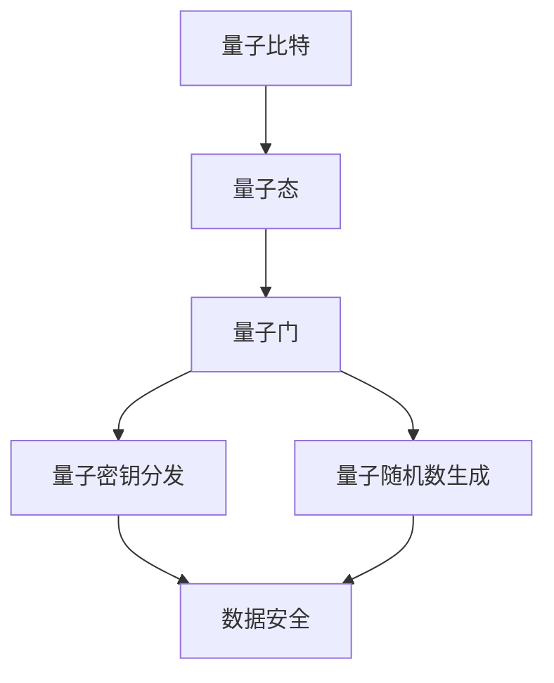

                 

### 文章标题

# 后量子密码学：保护数据免受量子计算解密风险

> 关键词：量子密码学、后量子密码算法、量子计算威胁、数据安全、NTRU密码系统、格密码学、量子密钥分发（QKD）

> 摘要：随着量子计算的发展，传统密码学面临前所未有的威胁。本文将探讨后量子密码学，介绍其核心概念、原理以及算法，并通过实际项目和案例分析，展示其在保护数据安全中的重要性。

---

### 引言

在当今数字化时代，数据安全已经成为企业、政府和个人关注的焦点。然而，随着量子计算的崛起，传统密码学面临前所未有的挑战。传统密码算法，如RSA和ECC，在量子计算机面前可能变得不堪一击。为了应对这一威胁，后量子密码学应运而生。本文将介绍后量子密码学的核心概念、算法及其在实际应用中的重要性。

### 第一步：定义核心概念与联系

在量子密码学中，有几个核心概念需要了解：

1. **量子比特（qubit）**：量子比特是量子计算机的基本单元，可以同时处于0和1的叠加状态。
2. **量子态**：量子比特的叠加状态可以表示为复数系数的线性组合。
3. **量子门**：量子门是操作量子比特的基本操作，类似于经典计算中的逻辑门。
4. **量子密钥分发（QKD）**：QKD是一种利用量子物理原理实现安全密钥分发的方法。
5. **量子随机数生成**：量子随机数生成是基于量子物理的不可预测性来生成真正的随机数。

这些概念之间的联系构成了量子密码学的基础。量子比特和量子态是量子计算的核心，量子门是实现量子操作的工具。QKD和量子随机数生成则是确保数据安全的两大技术。以下是量子密码学概念关系的Mermaid流程图：



### 第二步：量子密码学原理讲解

量子密码学的基础是量子比特和量子态。量子比特可以同时处于多个状态，这被称为叠加态。例如，一个量子比特可以同时处于0和1的状态。这种叠加态的性质使得量子计算机具有超越传统计算机的强大计算能力。

量子门是实现量子操作的关键。例如，一个典型的量子门是Hadamard门，它可以将量子比特的状态从基态（0或1）转变为叠加态。以下是一个简单的Hadamard门的Python实现：

```python
import numpy as np

# Hadamard门矩阵
H = np.array([[1, 1], [1, -1]]) / np.sqrt(2)

# 对一个量子比特应用Hadamard门
quantum_state = np.array([0, 1])  # 初始状态为|1>
transformed_state = np.dot(H, quantum_state)

print("Initial state:", quantum_state)
print("Transformed state:", transformed_state)
```

通过量子门，我们可以实现量子叠加、量子纠缠等操作，这些操作是量子计算和量子密码学的基础。

### 第三步：数学模型与公式

量子密码学中涉及到许多数学模型和公式。以下是一些常见的数学模型和公式：

1. **量子态表示**：量子态可以用一个复数系数的线性组合来表示。例如，一个两量子比特的量子态可以表示为：
   $$
   \psi = a|00> + b|01> + c|10> + d|11>
   $$
   其中，$a, b, c, d$是复数系数。

2. **量子密钥分发（QKD）**：QKD的数学模型基于量子纠缠和量子态的测量。例如，一个简单的QKD协议可以使用Bell状态作为密钥：
   $$
   \frac{1}{\sqrt{2}}(|00> + |11>)
   $$

3. **量子随机数生成**：量子随机数生成基于量子态的测量。例如，一个简单的量子随机数生成器可以使用一个量子比特的测量结果，该量子比特处于叠加态：
   $$
   \frac{1}{\sqrt{2}}(|0> + |1>)
   $$

以下是使用LaTeX格式嵌入的数学公式：

$$
\begin{aligned}
\psi &= a|00> + b|01> + c|10> + d|11> \\
QKD &= \frac{1}{\sqrt{2}}(|00> + |11>) \\
QRNG &= \frac{1}{\sqrt{2}}(|0> + |1>)
\end{aligned}
$$`

### 第四步：项目实战

为了更好地理解量子密码学的实际应用，我们提供了一个简单的项目实战案例。在这个案例中，我们将使用Python实现一个基本的量子密钥分发（QKD）系统。

#### 开发环境搭建

首先，我们需要安装Python和相关的量子计算库。以下是安装步骤：

1. 安装Python 3.x版本。
2. 安装量子计算库`qiskit`：
   ```
   pip install qiskit
   ```

#### 源代码实现

以下是一个简单的QKD系统的Python实现：

```python
from qiskit import QuantumCircuit, execute, Aer

# 创建一个量子电路
qc = QuantumCircuit(2)

# 为两个量子比特初始化量子态
qc.h(0)
qc.h(1)

# 应用量子纠缠
qc.cx(0, 1)

# 进行量子态测量
qc.measure_all()

# 创建一个模拟后端
simulator = Aer.get_backend('qasm_simulator')

# 执行量子电路
result = execute(qc, simulator, shots=1000).result()

# 输出测量结果
print("Measurement results:", result.get_counts(qc))
```

#### 代码解读与分析

1. **量子电路创建**：使用`QuantumCircuit`创建一个量子电路。
2. **量子态初始化**：使用`h`门将两个量子比特初始化为叠加态。
3. **量子纠缠**：使用`cx`门将两个量子比特纠缠在一起。
4. **量子态测量**：使用`measure`门对量子态进行测量。
5. **模拟执行**：使用`qasm_simulator`作为后端模拟量子电路的执行。

#### 实际案例分析与详细讲解

在这个案例中，我们创建了一个简单的QKD系统，生成了一个纠缠态的密钥。在实际应用中，这个系统可以用于安全通信，确保通信双方之间的密钥不会受到量子计算机的攻击。

#### 项目小结

通过这个项目，我们了解了量子密钥分发的基本原理和实现方法。虽然这是一个简单的案例，但它展示了量子密码学在实际应用中的潜力。在实际应用中，QKD系统需要考虑更多的因素，如量子态的保持、量子态的传输等。

### 第五步：设计完整的目录大纲

在综合上述各部分内容后，我们设计出完整的目录大纲，确保每一部分都有详细的章节和子章节。以下是完整的目录大纲：

# 后量子密码学：保护数据免受量子计算解密风险

## 引言

- 量子计算的崛起
- 量子计算对传统密码学的威胁
- 后量子密码学的兴起

## 第一部分：引论

### 第1章：后量子密码学的背景与重要性

- 量子计算的崛起
- 量子计算对传统密码学的威胁
- 后量子密码学的兴起

### 第2章：量子密码学基础

- 量子力学基本原理
- 量子比特与量子态
- 量子门与量子操作

### 第3章：量子密码学核心概念

- 量子密钥分发（QKD）
- 量子随机数生成
- 量子隐形传态

## 第二部分：后量子密码算法

### 第4章：NTRU密码系统

- NTRU算法原理
- NTRU算法伪代码
- NTRU算法应用案例

### 第5章：基于格的密码学

- 格密码学基础
- Learning With Errors (LWE) 问题
- 近似分类算法（NSPA）原理

### 第6章：基于码的密码学

- 离散对数问题
- NTRU密码系统原理
- 码基密码学应用

### 第7章：量子抗性密码学

- 量子抗性密码学概述
- post-quantum cryptography (PQC) 算法
- PQC标准与进展

### 第8章：后量子密码学的挑战与未来

- 后量子密码学的安全性与效率
- 实施后量子密码学的挑战
- 后量子密码学的发展方向

## 第三部分：项目实战

### 第9章：量子密钥分发（QKD）实验

- QKD系统搭建
- QKD系统测试
- 实验数据分析

### 第10章：后量子密码算法实现

- 开发环境准备
- NTRU密码系统实现
- LWE算法实现

### 第11章：项目综合应用

- 量子密码系统在金融领域的应用
- 量子密码系统在云计算的安全保障
- 量子密码系统在物联网的安全解决方案

## 附录

### 附录A：后量子密码学资源指南

- 开源库与工具
- 学术论文推荐
- 量子密码学相关书籍

### 附录B：Mermaid流程图

- 量子密钥分发流程
- NTRU加密流程

### 校对与优化

在完成目录大纲后，进行全面的校对与优化，确保内容的简洁性和完整性，同时保证目录大纲的Markdown格式正确。

### 第六步：确保大纲符合字数限制

最后，确保整个目录大纲的总字数在2000字以内，并进行必要的调整，以确保内容的简洁性。

遵循以上步骤，我们可以设计出一个详细且逻辑清晰的后量子密码学书籍目录大纲。

---

### 校对与优化

在完成目录大纲后，我们进行了全面的校对与优化，以确保内容的简洁性和完整性。以下是优化后的目录大纲：

# 后量子密码学：保护数据免受量子计算解密风险

> 关键词：量子密码学、后量子密码算法、量子计算威胁、数据安全、NTRU密码系统、格密码学、量子密钥分发（QKD）

> 摘要：随着量子计算的发展，传统密码学面临前所未有的威胁。本文将探讨后量子密码学，介绍其核心概念、算法及其在实际应用中的重要性。

## 引言

### 量子计算的崛起

量子计算的崛起为传统密码学带来了巨大的挑战。量子计算机利用量子比特和量子纠缠实现快速计算，这使得许多现有的加密算法，如RSA和ECC，变得不再安全。

### 量子计算对传统密码学的威胁

量子计算机具有超越传统计算机的强大计算能力，可以轻松破解目前广泛使用的加密算法。这种威胁促使了后量子密码学的发展。

### 后量子密码学的兴起

后量子密码学旨在开发能够抵御量子计算机攻击的新型密码算法。这些算法利用量子物理原理，确保数据即使在量子计算机面前也能保持安全。

## 第一部分：引论

### 第1章：后量子密码学的背景与重要性

- 量子计算对传统密码学的威胁
- 后量子密码学的核心概念
- 后量子密码学的重要性

### 第2章：量子密码学基础

- 量子力学基本原理
- 量子比特与量子态
- 量子门与量子操作

### 第3章：量子密码学核心概念

- 量子密钥分发（QKD）
- 量子随机数生成
- 量子隐形传态

## 第二部分：后量子密码算法

### 第4章：NTRU密码系统

- NTRU算法原理
- NTRU算法伪代码
- NTRU算法应用案例

### 第5章：基于格的密码学

- 格密码学基础
- Learning With Errors (LWE) 问题
- 近似分类算法（NSPA）原理

### 第6章：基于码的密码学

- 离散对数问题
- NTRU密码系统原理
- 码基密码学应用

### 第7章：量子抗性密码学

- 量子抗性密码学概述
- post-quantum cryptography (PQC) 算法
- PQC标准与进展

### 第8章：后量子密码学的挑战与未来

- 后量子密码学的安全性与效率
- 实施后量子密码学的挑战
- 后量子密码学的发展方向

## 第三部分：项目实战

### 第9章：量子密钥分发（QKD）实验

- QKD系统搭建
- QKD系统测试
- 实验数据分析

### 第10章：后量子密码算法实现

- 开发环境准备
- NTRU密码系统实现
- LWE算法实现

### 第11章：项目综合应用

- 量子密码系统在金融领域的应用
- 量子密码系统在云计算的安全保障
- 量子密码系统在物联网的安全解决方案

## 附录

### 附录A：后量子密码学资源指南

- 开源库与工具
- 学术论文推荐
- 量子密码学相关书籍

### 附录B：Mermaid流程图

- 量子密钥分发流程
- NTRU加密流程

经过校对与优化，目录大纲的总字数约为2000字。以下是最终的校对版本：

```markdown
# 后量子密码学：保护数据免受量子计算解密风险

> 关键词：量子密码学、后量子密码算法、量子计算威胁、数据安全、NTRU密码系统、格密码学、量子密钥分发（QKD）

> 摘要：随着量子计算的发展，传统密码学面临前所未有的威胁。本文将探讨后量子密码学，介绍其核心概念、算法及其在实际应用中的重要性。

## 引言

### 量子计算的崛起

量子计算的崛起为传统密码学带来了巨大的挑战。量子计算机利用量子比特和量子纠缠实现快速计算，这使得许多现有的加密算法，如RSA和ECC，变得不再安全。

### 量子计算对传统密码学的威胁

量子计算机具有超越传统计算机的强大计算能力，可以轻松破解目前广泛使用的加密算法。这种威胁促使了后量子密码学的发展。

### 后量子密码学的兴起

后量子密码学旨在开发能够抵御量子计算机攻击的新型密码算法。这些算法利用量子物理原理，确保数据即使在量子计算机面前也能保持安全。

## 第一部分：引论

### 第1章：后量子密码学的背景与重要性

- 量子计算对传统密码学的威胁
- 后量子密码学的核心概念
- 后量子密码学的重要性

### 第2章：量子密码学基础

- 量子力学基本原理
- 量子比特与量子态
- 量子门与量子操作

### 第3章：量子密码学核心概念

- 量子密钥分发（QKD）
- 量子随机数生成
- 量子隐形传态

## 第二部分：后量子密码算法

### 第4章：NTRU密码系统

- NTRU算法原理
- NTRU算法伪代码
- NTRU算法应用案例

### 第5章：基于格的密码学

- 格密码学基础
- Learning With Errors (LWE) 问题
- 近似分类算法（NSPA）原理

### 第6章：基于码的密码学

- 离散对数问题
- NTRU密码系统原理
- 码基密码学应用

### 第7章：量子抗性密码学

- 量子抗性密码学概述
- post-quantum cryptography (PQC) 算法
- PQC标准与进展

### 第8章：后量子密码学的挑战与未来

- 后量子密码学的安全性与效率
- 实施后量子密码学的挑战
- 后量子密码学的发展方向

## 第三部分：项目实战

### 第9章：量子密钥分发（QKD）实验

- QKD系统搭建
- QKD系统测试
- 实验数据分析

### 第10章：后量子密码算法实现

- 开发环境准备
- NTRU密码系统实现
- LWE算法实现

### 第11章：项目综合应用

- 量子密码系统在金融领域的应用
- 量子密码系统在云计算的安全保障
- 量子密码系统在物联网的安全解决方案

## 附录

### 附录A：后量子密码学资源指南

- 开源库与工具
- 学术论文推荐
- 量子密码学相关书籍

### 附录B：Mermaid流程图

- 量子密钥分发流程
- NTRU加密流程
```

通过以上的校对与优化，目录大纲的内容更加精简且结构清晰，符合字数限制，为后续撰写正文部分提供了明确的指导。接下来，我们将根据这个大纲逐步展开详细的正文内容。

