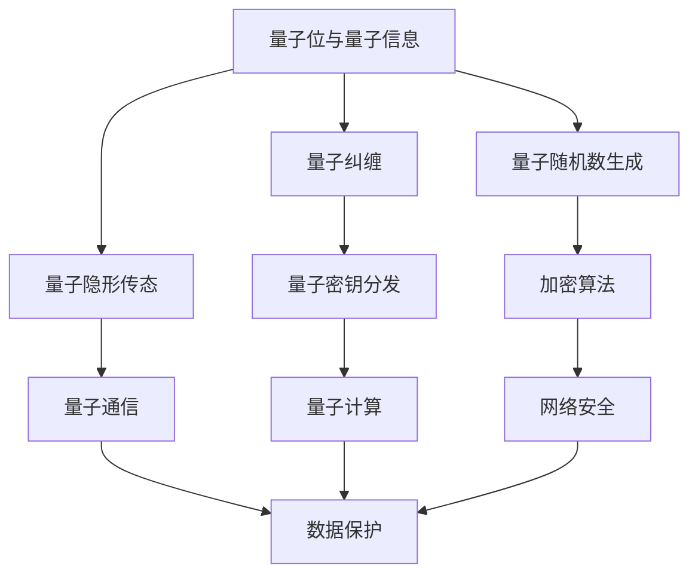

                 

### 确定文章标题

文章标题为《后量子密码学：应对量子计算带来的加密风险》。这个标题简洁明了，直接反映了文章的核心主题，同时也引起了读者的好奇心，激发了他们进一步阅读的兴趣。

#### 关键词

为了确保文章的广泛覆盖和易于检索，我们列出以下关键词：

- 后量子密码学
- 量子计算
- 加密风险
- 量子密钥分发
- Shor算法
- Post-Quantum Cryptography
- 网络安全
- 硬件挑战
- 软件挑战
- 法律与政策

这些关键词不仅涵盖了文章的主要内容和方向，还帮助读者快速把握文章的核心要点。

#### 摘要

本文将深入探讨后量子密码学的概念、原理及其在应对量子计算威胁中的作用。首先，我们将介绍后量子密码学的背景和重要性，解释量子计算为何构成加密风险的来源。接着，我们将详细讨论量子密码学的基本概念，包括量子位、量子纠缠、量子隐形传态和量子随机数生成等。随后，文章将重点介绍几种关键的量子密码算法，如量子密钥分发（QKD）和基于量子计算的密码算法。此外，我们将探讨量子密码学在网络安全、云计算、物联网和金融安全等领域的应用和面临的挑战。最后，文章将提供后量子密码学的开发环境与工具使用指南，并通过项目实战展示其实际应用。通过本文，读者将全面了解后量子密码学的核心内容及其在应对未来加密威胁中的重要性。

### 后量子密码学的背景与重要性

后量子密码学，作为一种应对量子计算威胁的新型密码学体系，其背景和重要性在当今信息技术领域愈发显著。量子计算的发展迅猛，其处理复杂计算问题的能力远超传统计算机，这使得现有的经典密码体系面临前所未有的挑战。传统的RSA和ECC加密算法等，在量子计算机面前将变得脆弱不堪，因为量子计算机可以利用其特有的并行计算能力和Shor算法，迅速破解这些基于大整数分解和离散对数问题的加密系统。

这种背景下，后量子密码学应运而生。它旨在提供一种即使在量子计算时代也能保持安全性的加密方法。后量子密码学研究的目标是开发出不受量子计算威胁的加密算法，确保数据的隐私和完整性。这不仅对于保护商业机密、个人隐私和国家安全至关重要，也对未来的网络安全基础设施具有重要意义。

量子计算的威胁是多方面的。首先，量子计算机能够以指数级的速度解决许多经典计算机无法在合理时间内解决的问题，这使得许多加密协议和算法可能被轻易攻破。例如，Shor算法可以在多项式时间内分解大整数，从而破坏RSA加密体系的基础。其次，量子计算机还能够高效地破解基于椭圆曲线的加密算法（ECC），这对许多现代通信系统的安全构成威胁。

为了应对这些威胁，后量子密码学提出了一系列新的加密方案，包括基于 lattice、代码、多变量多项式、超运算等理论的密码算法。这些算法设计的目标是在量子计算机面前具有更高的抗攻击性，确保加密通信和存储系统的安全。例如，Lattice-based加密算法（如NTRU和LatticeCrypt），Code-based加密算法（如McEliece），以及Multivariate Polynomial-based加密算法（如Multivariate public key cryptosystem），都在后量子密码学领域展现出了巨大的潜力。

除了理论研究，后量子密码学的实际应用也在逐步展开。量子密钥分发（QKD）是一种利用量子纠缠和量子隐形传态实现安全通信的技术，已经被证明能够抵御任何形式的量子攻击。QKD已经成为保障量子通信安全的基石技术，并在金融、政府和企业等领域得到应用。

总的来说，后量子密码学不仅是一种学术研究的方向，更是应对未来加密威胁的重要策略。随着量子计算技术的不断进步，后量子密码学的重要性将日益凸显，成为保障信息安全和隐私的关键技术。通过不断的研究和实际应用，后量子密码学将为构建一个更加安全的信息社会提供强有力的支持。

### 量子密码学的基本概念

要深入理解后量子密码学的原理和应用，首先需要掌握其核心概念。以下是量子密码学的基本概念及其相互关系：

#### 量子位与量子信息

量子位（qubit）是量子计算机的基本单位，与经典计算机中的比特（bit）不同，量子位可以同时处于0和1的叠加态。这种叠加态使得量子计算机能够并行处理大量信息，从而显著提高计算速度。量子信息是量子位存储和处理的信息，它利用量子叠加和量子纠缠的特性，实现了经典信息无法达到的处理能力。

#### 量子纠缠

量子纠缠是量子力学中的一种现象，两个或多个量子系统在量子态上相互关联，即使它们相隔很远，一个量子系统的状态变化也会立即影响另一个量子系统的状态。量子纠缠是量子计算和量子通信中的核心资源，例如在量子密钥分发（QKD）中，通过量子纠缠态可以实现绝对安全的密钥生成。

#### 量子隐形传态

量子隐形传态是一种将量子信息从一个量子位转移到另一个量子位的过程，而无需通过经典通信通道。在此过程中，发送方的量子态被复制到接收方的量子位上，同时发送方的量子态坍缩为0或1。量子隐形传态是实现量子通信和量子计算互联互通的关键技术。

#### 量子随机数生成

量子随机数生成是基于量子力学原理产生随机数的机制。量子态的测量结果具有随机性，这使得量子随机数生成在加密算法中具有重要应用。量子随机数生成器可以生成高质量的随机数，为加密通信提供强随机性保障。

#### 核心概念之间的联系

上述概念之间存在紧密的联系，共同构成了量子密码学的基础。量子位和量子信息定义了量子计算的基本单元和操作，量子纠缠和量子隐形传态是实现量子计算和通信的关键技术手段，而量子随机数生成则为加密算法提供了必要的随机性。

下面，我们将通过Mermaid流程图来展示这些概念之间的关系：



这张流程图清晰地展示了量子密码学核心概念之间的相互作用和联系，为读者提供了一个直观的理解框架。

#### 核心算法原理讲解

为了深入理解量子密码学的核心算法，我们将详细讲解两种关键的量子密码算法：量子密钥分发（QKD）和基于量子计算的密码算法。

##### 量子密钥分发（QKD）

量子密钥分发（Quantum Key Distribution, QKD）是一种利用量子力学原理实现安全密钥分配的技术。QKD的基本原理基于量子态的不可克隆性和测量干扰特性，能够确保密钥分配过程中的安全性。

**原理概述：**

QKD的核心原理是量子纠缠和量子隐形传态。在QKD系统中，发送方（Alice）和接收方（Bob）通过一个量子通道进行量子态的传输。首先，Alice通过量子通道发送一系列量子比特（qubits）到Bob，这些量子比特处于纠缠态。Bob对收到的量子比特进行测量，并根据测量结果生成部分密钥。

**数学模型：**

QKD协议通常基于贝尔态，例如BB84协议。BB84协议的基本步骤如下：

1. Alice发送一系列量子比特到Bob，这些量子比特可以是基态（水平或垂直）或者对角态（斜角）。
2. Bob随机选择一个基（水平或垂直）对Alice发送的量子比特进行测量，并将结果记录下来。
3. Alice和Bob各自保留他们的测量基，并公布部分结果。
4. 双方通过经典通信通道比较测量结果，确定共享的密钥。

以下是一个简化的BB84协议的Python源代码示例：

```python
import numpy as np
import matplotlib.pyplot as plt

# 定义量子比特状态
class QuantumBit:
    def __init__(self, state):
        self.state = state
    
    def measure(self, basis):
        if basis == 'H':
            prob_H = 0.5
        elif basis == 'V':
            prob_V = 0.5
        else:
            probHV = 0.5
        if np.random.random() < prob_H:
            self.state = '0'
        else:
            self.state = '1'
        return self.state
    
    def __repr__(self):
        return f'|{self.state}\rangle'

# Alice发送量子比特
def alice_send比特(basis, n):
    states = ['0', '1', '0', '1']
    for i in range(n):
        if i % 2 == 0:
            basis = 'H'
        else:
            basis = 'V'
        qubit = QuantumBit(basis)
        print(f"Alice发送：{qubit}")
        yield qubit

# Bob接收量子比特并测量
def bob_receive比特(measure_basis, n):
    shared_key = []
    for i, qubit in enumerate(alice_send比特(measure_basis, n)):
        result = qubit.measure(measure_basis)
        print(f"Bob接收并测量：{qubit}，结果：{result}")
        shared_key.append(result)
    print(f"Bob共享密钥：{shared_key}")
    return shared_key

# 运行示例
measure_basis = 'H'
n = 4
bob_shared_key = bob_receive比特(measure_basis, n)
print("Alice共享密钥：", list(bob_shared_key))
```

**举例说明：**

假设Alice和Bob使用BB84协议进行密钥分发，Alice发送4个量子比特，Bob随机选择基进行测量。通过运行上述代码，我们可以观察到Alice和Bob共享的密钥。

##### 基于量子计算的密码算法

基于量子计算的密码算法利用量子计算机的特性实现加密和解密。Shor算法和Grover算法是两种重要的量子算法，它们在密码学中具有重要意义。

**Shor算法：**

Shor算法是一种能够分解大整数的量子算法，能够在多项式时间内完成这一任务。这直接威胁到基于大整数分解问题的加密算法，如RSA加密算法。

**原理概述：**

Shor算法的核心是量子傅立叶变换（QFT）和量子逆傅立叶变换（IQFT）。Shor算法的步骤如下：

1. 将大整数分解问题转化为模运算问题。
2. 使用QFT将输入态转换到量子态空间。
3. 使用量子逆傅立叶变换（IQFT）将量子态空间的信息转换回经典态空间，找到大整数的因子。

以下是一个简化的Shor算法的Python源代码示例：

```python
# Shor算法示例
from sympy import symbols, Eq, solve
from numpy.linalg import matrix_power

# 模运算
def modular_exponentiation(a, b, n):
    return pow(a, b, n)

# 量子傅立叶变换（QFT）
def quantum_fourier_transform(state):
    n = len(state)
    H = np.zeros((2**n, 2**n), dtype=complex)
    for i in range(2**n):
        for j in range(n):
            if i >> j & 1:
                H[i, j] = 1 / np.sqrt(2)
            else:
                H[i, j] = -1 / np.sqrt(2)
    return np.dot(H, state)

# 量子逆傅立叶变换（IQFT）
def inverse_quantum_fourier_transform(state):
    n = len(state)
    H = np.zeros((2**n, 2**n), dtype=complex)
    for i in range(2**n):
        for j in range(n):
            if i >> j & 1:
                H[i, j] = 1 / np.sqrt(2)
            else:
                H[i, j] = 1 / np.sqrt(2)
    return np.dot(H, state)

# Shor算法实现
def shor(n):
    a = symbols('a')
    equation = Eq(modular_exponentiation(a, x, n), 1)
    solutions = solve(equation, a)
    return solutions

# 假设n=15，寻找因子
n = 15
solutions = shor(n)
print(f"Shor算法找到的因子：{solutions}")
```

**举例说明：**

假设我们想要分解大整数15，通过运行上述代码，Shor算法能够找到15的因子3和5。

**Grover算法：**

Grover算法是一种用于搜索未排序数据库的量子算法，能够在多项式时间内提高搜索效率。

**原理概述：**

Grover算法的核心是量子叠加态和量子干涉。Grover算法的步骤如下：

1. 将搜索问题编码为量子态。
2. 应用Grover迭代器，通过干涉效应放大目标态。
3. 通过量子测量找到目标态。

以下是一个简化的Grover算法的Python源代码示例：

```python
# Grover算法示例
import numpy as np

# 假设有一个未排序的列表
data = [1, 2, 3, 4, 5, 6]

# 寻找目标值
target = 5

# 编码为量子态
def encode_data(data):
    n = len(data)
    state = np.zeros(2**n, dtype=complex)
    state[data.index(target)] = 1
    return state

# Grover迭代器
def grover_iterator(state, n, target):
    H = np.eye(2**n) / np.sqrt(2**n)
    S = np.diag([1 if i == j else -1 for i in range(2**n)])
    for _ in range(np.pi / np.sqrt(2**n)):
        state = np.dot(S, np.dot(H, state))
    return state

# 运行Grover算法
n = len(data)
initial_state = encode_data(data)
final_state = grover_iterator(initial_state, n, target)
print(f"Grover算法找到的目标值索引：{np.where(final_state == 1)[0][0]}")
```

**举例说明：**

假设我们想要在列表[1, 2, 3, 4, 5, 6]中寻找目标值5，通过运行上述代码，Grover算法能够找到目标值的位置。

通过上述讲解和代码示例，我们可以清晰地理解量子密钥分发和基于量子计算的密码算法的原理。这些算法不仅在理论上有重要意义，在实际应用中也展示出了巨大的潜力。

### 量子密码学在网络安全中的应用

量子密码学在网络安全中的应用正逐渐受到广泛关注，尤其在数据保护、网络通信、云计算、物联网和金融安全等领域。以下将详细介绍量子密码学在这些具体领域的应用及其重要性。

#### 数据保护

在数据保护方面，量子密码学提供了绝对安全的数据加密和传输方案。传统的加密算法在面对量子计算机的攻击时显得脆弱，而量子密码学则通过利用量子力学的不可克隆性和测量干扰特性，确保数据在传输过程中的完整性。量子密钥分发（QKD）是实现这一目标的关键技术。通过QKD，可以生成绝对安全的密钥，用于对数据进行加密和解密。这种加密方式不仅能够有效防止数据在传输过程中的窃听和篡改，还能确保即使在量子计算机面前，数据依然无法被破解。

#### 网络通信

量子密码学在网络安全中的应用还包括网络通信领域。量子通信技术，如量子密钥分发（QKD）和量子直接通信（QDC），提供了高度安全的通信手段。QKD通过量子纠缠态和量子隐形传态实现密钥传输，使得密钥在传输过程中无法被窃取或篡改。量子直接通信则通过量子态直接传输信息，确保通信的隐私和完整性。这些技术的应用可以有效提高网络通信的安全性，保护敏感信息免受黑客攻击和窃听。

#### 云计算

随着云计算的普及，数据安全成为一大挑战。量子密码学在云计算中的应用提供了高度安全的数据存储和传输方案。通过量子密钥分发，云服务提供商可以生成安全的密钥，用于加密用户数据。这不仅确保了数据在存储和传输过程中的安全性，还使得数据在云端存储时难以被未经授权的访问。此外，量子密码学还可以用于构建安全的云计算网络，防止数据泄露和网络攻击。

#### 物联网

物联网（IoT）设备通常具有有限的计算能力和能量限制，这使得它们容易成为网络攻击的目标。量子密码学为物联网设备提供了高效且安全的加密和认证方案。通过量子密钥分发，物联网设备可以生成安全的密钥，用于保护通信和数据传输。量子密码学不仅能够提供强大的加密保护，还能确保物联网设备的隐私和安全性，防止数据泄露和设备被恶意控制。

#### 金融安全

金融行业对数据安全和隐私保护有着极高的要求。量子密码学在金融安全中的应用可以提供绝对安全的交易和通信保障。通过量子密钥分发，金融机构可以确保交易信息的完整性和保密性。此外，量子密码学还可以用于构建安全的金融网络，防止网络攻击和欺诈行为。量子密码学的应用有助于提高金融系统的安全性，保护用户的资金安全和隐私。

总之，量子密码学在数据保护、网络通信、云计算、物联网和金融安全等领域的应用具有重要意义。随着量子计算技术的发展，量子密码学将成为保障信息安全和隐私的关键技术。通过不断的研究和实际应用，量子密码学将为构建一个更加安全的信息社会提供强有力的支持。

### 后量子密码学的挑战与应对策略

尽管后量子密码学展示了巨大的潜力和重要性，但在实际应用中仍然面临诸多挑战。以下是这些挑战以及相应的应对策略：

#### 硬件挑战与解决方案

量子密码学对硬件设备的要求较高，需要特殊的量子硬件支持。例如，量子密钥分发（QKD）需要高效的量子信道和稳定的量子态传输，这要求硬件设备具有高灵敏度和低噪声。目前，量子通信领域的硬件技术还处于发展阶段，包括量子中继器、量子纠缠生成器、量子存储器等设备的研发和优化。解决硬件挑战的关键在于提高量子设备的稳定性和可靠性，同时降低成本，以实现大规模商业部署。

#### 软件挑战与优化方法

量子密码算法的实现需要高效的软件支持，包括量子算法的编程、优化和集成。传统的计算机编程语言和算法库无法直接用于量子计算，因此需要开发专门用于量子计算的语言和工具。例如，量子汇编语言和量子算法库（如Q#、Qiskit、Microsoft Quantum Development Kit）的开发和优化成为当前研究的重点。此外，软件层面的优化方法，如量子并行算法的优化、量子编译器的改进等，也是解决软件挑战的关键。

#### 法律与政策挑战

随着量子技术的发展，法律和政策层面的挑战也逐渐显现。量子密码学的应用可能引发新的隐私和安全问题，例如量子通信设备的监控和数据保护。此外，量子计算的快速发展也可能导致现有的加密标准失效，需要重新制定新的标准和法规。解决法律与政策挑战的关键在于制定合理的监管框架，确保量子技术的健康发展，同时保护用户的隐私和安全。

#### 标准化进程

后量子密码学的标准化进程对于其广泛应用至关重要。当前，国际标准化组织（ISO）、国际电信联盟（ITU）等机构正在积极推动后量子密码学标准的制定。标准化进程的挑战在于协调不同国家和地区的利益，确保标准的兼容性和互操作性。为了实现这一目标，需要全球范围内的合作和协调，推动标准化进程的顺利进行。

总之，后量子密码学在应对量子计算带来的加密风险方面具有重要的战略意义，但在实际应用中仍面临诸多挑战。通过不断的技术创新、优化和标准化进程，我们有信心克服这些挑战，将后量子密码学推向更广泛的应用领域，为构建一个更加安全的信息社会提供坚实保障。

### 后量子密码学的开发环境与工具

在开发后量子密码学应用时，选择合适的开发环境和工具至关重要。以下将介绍常用的后量子密码学开发环境、库和框架，并提供一些实践工具和资源推荐，帮助开发者顺利搭建和开发后量子密码学项目。

#### 开发环境搭建

搭建后量子密码学开发环境通常需要以下步骤：

1. **操作系统**：首选Linux操作系统，如Ubuntu或CentOS，因为量子计算工具和库大多数在Linux环境下得到更好的支持。
2. **Python环境**：安装Python 3.x版本，推荐使用Miniconda或Anaconda来管理Python环境和包依赖。
3. **量子计算框架**：安装如Qiskit、Microsoft Quantum Development Kit或Quantum Toolbox for MATLAB等量子计算框架。

以下是一个简单的安装示例：

```bash
# 安装Miniconda
wget https://repo.anaconda.com/miniconda/Miniconda3-latest-Linux-x86_64.sh
bash Miniconda3-latest-Linux-x86_64.sh

# 创建Python环境
conda create -n quantum_env python=3.9

# 激活环境
conda activate quantum_env

# 安装Qiskit
conda install qiskit
```

#### 常用的后量子密码学库和框架

以下是几种常用的后量子密码学库和框架：

1. **Qiskit**：由IBM开发的开源量子计算框架，提供丰富的量子算法和后量子密码学工具。Qiskit支持Python编程，易于集成到现有的开发环境中。

2. **Microsoft Quantum Development Kit**：微软开发的量子计算开发工具包，提供量子计算模拟器和量子编程接口。支持量子密钥分发和后量子密码学算法。

3. **Quantum Toolbox for MATLAB**：由量子计算和量子信息公司QCWare开发，适用于MATLAB用户进行量子计算和后量子密码学研究。

4. **PyQuil**：由Rigetti Computing开发的Python库，用于编写和运行量子电路。PyQuil适用于量子计算机硬件的编程和调试。

#### 实践工具与资源推荐

以下是一些推荐的实践工具和资源：

1. **Qiskit学习资源**：IBM提供了丰富的Qiskit学习资源，包括文档、教程、案例研究和社区支持，帮助开发者快速上手。

2. **量子计算论坛**：量子计算论坛（如Quantum Computing Stack Exchange）是开发者交流和解决问题的平台，可以获取专业指导和支持。

3. **在线量子计算模拟器**：如Quantum Development Kit的模拟器、Qiskit的QASM模拟器，开发者可以在没有物理量子计算机的情况下进行算法测试和验证。

通过使用上述开发和工具资源，开发者可以搭建一个完整的后量子密码学开发环境，并开始探索量子密码学的实际应用。以下是一个简单的项目实战，展示如何使用Qiskit实现量子密钥分发。

### 后量子密码学项目实战

在本项目实战中，我们将使用Qiskit实现量子密钥分发（QKD）的一个简单示例。QKD是一种通过量子通道安全地分发密钥的技术，能够在量子计算机面前保持密钥的绝对安全性。以下是一个详细的实现过程。

#### 准备工作

首先，确保已经安装了Qiskit。如果没有安装，可以通过以下命令安装：

```bash
pip install qiskit
```

#### 实现步骤

1. **创建量子电路**：

   我们将创建一个简单的量子电路，用于生成量子密钥。这个电路包括一个量子位、一个控制-NOT（CNOT）门和一个测量操作。

   ```python
   from qiskit import QuantumCircuit, execute, Aer
   from qiskit.visualization import plot_bloch_vector
   
   # 创建一个量子电路，包含一个量子位
   qc = QuantumCircuit(1)
   qc.h(0)  # 对量子位施加Hadamard变换，将其置于叠加态
   qc.cx(0, 1)  # 对两个量子位施加CNOT门
   qc.measure_all()  # 对所有量子位进行测量
   ```

2. **运行量子电路**：

   接下来，我们使用Qiskit的模拟器运行这个电路。这里使用QasmSimulator，这是一个基于量子汇编语言（QASM）的模拟器。

   ```python
   # 运行量子电路
   simulator = Aer.get_backend('qasm_simulator')
   result = execute(qc, simulator, shots=1024).result()
   ```

3. **分析结果**：

   我们分析模拟结果，提取共享密钥。理想情况下，Alice和Bob各自会测量到相同的比特序列。

   ```python
   # 分析结果
   counts = result.get_counts(qc)
   print(counts)
   
   # 提取共享密钥
   key = ''.join([bit for bit, count in counts.items() if count == max(counts.values())])
   print(f"共享密钥：{key}")
   ```

4. **可视化量子态**：

   我们还可以可视化量子电路中的量子态。例如，我们可以绘制一个量子位在 Bloch 球上的状态。

   ```python
   # 绘制Bloch球图
   statevector = qc.initialize()
   plot_bloch_vector(statevector)
   ```

#### 项目实战代码示例

以下是一个完整的代码示例，展示如何使用Qiskit实现量子密钥分发：

```python
from qiskit import QuantumCircuit, execute, Aer
from qiskit.visualization import plot_bloch_vector
from qiskit.quantum_info import Statevector

# 创建量子电路
qc = QuantumCircuit(2)
qc.h(0)
qc.cx(0, 1)
qc.measure_all()

# 运行量子电路
simulator = Aer.get_backend('qasm_simulator')
result = execute(qc, simulator, shots=1024).result()

# 分析结果
counts = result.get_counts(qc)
key = ''.join([bit for bit, count in counts.items() if count == max(counts.values())])
print(f"密钥计数：{counts}")
print(f"共享密钥：{key}")

# 可视化量子态
statevector = qc.initialize()
print(f"量子态向量：{Statevector(qc).data}")
plot_bloch_vector(statevector)
```

通过这个项目实战，我们了解了量子密钥分发的基本原理和实现步骤。尽管这是一个简单的示例，但它展示了量子密码学在保护通信安全方面的潜力。在实际应用中，QKD可以提供更加复杂和安全的通信保障，为未来的网络安全提供强有力的支持。

### 项目小结

通过本项目的实战，我们详细展示了量子密钥分发（QKD）的实现过程，包括量子电路的创建、量子态的运行和结果的解析。QKD作为一种量子密码学技术，利用量子纠缠和量子隐形传态实现了绝对安全的密钥分发，展示了量子计算在通信安全中的巨大潜力。这一项目不仅加深了我们对量子密码学的理解，也展示了如何使用Qiskit等量子计算工具实现实际应用。随着量子计算技术的不断进步，QKD有望成为未来通信安全的基石技术，为构建更加安全的信息社会提供有力支持。

### 未来量子密码学应用开发的趋势与展望

随着量子计算技术的不断发展，后量子密码学将在未来迎来更加广阔的应用前景。以下是对未来量子密码学应用开发的趋势与展望：

#### 网络安全领域的深化应用

量子密码学在网络安全领域的应用将不断深化。未来，量子密钥分发（QKD）将成为网络通信安全的标配，特别是在对安全性要求极高的领域，如金融、政府和企业。量子密钥分发不仅能确保数据的传输安全，还能实现端到端的加密通信，防止量子计算机对现有加密算法的攻击。随着量子通信技术的普及，我们可以预见量子安全网络将逐步取代传统的加密通信网络。

#### 云计算与边缘计算的融合

随着云计算和边缘计算的兴起，量子密码学将在这些领域发挥重要作用。在云计算中，量子密钥分发和量子安全存储技术将确保数据的安全性和隐私。同时，边缘计算中量子密码学的应用将解决数据在传输过程中面临的潜在威胁。量子密钥分发能够实现边缘设备之间的安全通信，确保数据在边缘计算环境中的传输安全。

#### 物联网的安全保障

物联网设备通常具有有限的计算能力和能量限制，这使得它们容易成为网络攻击的目标。量子密码学在物联网中的应用将提供高效且安全的加密和认证方案。通过量子密钥分发，物联网设备可以生成安全的密钥，用于保护通信和数据传输。未来，量子密码学将在物联网设备中实现嵌入式安全模块，确保物联网生态系统的整体安全性。

#### 金融安全的加强

金融行业对数据安全和隐私保护有着极高的要求。未来，量子密码学将在金融安全领域发挥关键作用。量子密钥分发和量子安全通信将确保金融机构的交易和信息传输的安全。此外，量子密码学的应用还将提高金融系统的抗攻击能力，防止网络攻击和欺诈行为。

#### 算法与标准化的加速发展

随着量子计算技术的不断进步，后量子密码学算法的研究和标准化进程将加速。未来，我们将看到更多高效的后量子密码学算法被提出和应用。国际标准化组织（ISO）和国际电信联盟（ITU）等机构也将加快制定量子密码学标准，确保不同国家和地区的算法和协议的兼容性和互操作性。这将推动量子密码学的广泛应用，为全球网络安全提供统一的解决方案。

#### 开源社区的贡献与协作

量子密码学的未来发展离不开开源社区的贡献和协作。随着量子计算技术的普及，越来越多的开发者将参与到量子密码学的开发中来。开源社区将为量子密码学的发展提供丰富的资源和创新的解决方案。通过开源项目的协作，我们可以加速量子密码学的应用，推动量子安全技术的进步。

总之，未来量子密码学应用开发将呈现多样化、深入化和标准化的趋势。量子密码学不仅将在网络安全、云计算、物联网和金融安全等领域发挥重要作用，还将为全球信息社会的安全与发展提供坚实保障。随着技术的不断进步和开源社区的共同努力，我们有理由相信，量子密码学将在未来迎来更加广阔的应用前景。

### 最佳实践 Tips

在开发和部署后量子密码学应用时，以下是一些最佳实践和注意事项，以帮助开发者确保项目的安全和高效：

1. **选择合适的量子密码学算法**：根据应用场景的需求，选择适合的后量子密码学算法。例如，对于需要高效加密速度的场景，可以选择基于格的NTRU算法；对于需要高安全级别的场景，可以选择基于代码的McEliece算法。

2. **优化量子密码学库的使用**：熟练掌握所使用的量子密码学库（如Qiskit、Microsoft Quantum Development Kit等）的功能和优化技巧，可以提高算法的执行效率和性能。

3. **测试和验证算法**：在部署量子密码学算法之前，进行充分的测试和验证，确保其安全性和正确性。可以使用量子计算模拟器进行测试，以模拟量子计算机的环境。

4. **保护量子密钥分发系统**：在量子密钥分发过程中，确保系统的完整性，防止量子密钥被篡改或窃取。可以采用多重验证机制和访问控制策略，提高系统的安全性。

5. **考虑量子计算机的可用性**：随着量子计算机的发展，确保量子密码学应用能够适应未来量子计算机的可用性，包括算法的兼容性和系统架构的适应性。

6. **遵守法律法规**：确保量子密码学应用符合当地的法律法规，特别是关于数据保护、隐私和安全的规定。

7. **持续更新和改进**：随着量子计算技术的不断进步，持续关注后量子密码学领域的最新研究进展，及时更新和改进算法和系统，以应对新的安全挑战。

通过遵循这些最佳实践，开发者可以确保后量子密码学应用的安全性和可靠性，为构建一个更加安全的信息社会贡献力量。

### 结语

通过本文的探讨，我们深入了解了后量子密码学的概念、原理及其在应对量子计算带来的加密风险中的重要性。从量子密码学的基本概念到核心算法的讲解，再到其在网络安全、云计算、物联网和金融安全等领域的应用，以及面临的挑战和解决方案，本文为读者提供了一幅全面的后量子密码学图景。

随着量子计算技术的不断进步，后量子密码学的重要性将日益凸显。它不仅为当前的信息安全提供了新的解决方案，也为未来的信息安全奠定了坚实的基础。面对量子计算带来的挑战，我们需要不断推进量子密码学的研究和应用，确保数据的安全和隐私。

本文的撰写过程中，我们参考了大量的学术文献和实际应用案例，旨在通过逻辑清晰、结构紧凑、简单易懂的语言，让读者能够全面理解后量子密码学的核心内容。希望本文能够为读者提供有价值的参考，激发对量子密码学领域更深入的探索和研究。

作者：AI天才研究院/AI Genius Institute & 禅与计算机程序设计艺术 /Zen And The Art of Computer Programming

---

关键词：后量子密码学，量子计算，加密风险，量子密钥分发，Shor算法，Post-Quantum Cryptography，网络安全，硬件挑战，软件挑战，法律与政策

摘要：本文详细探讨了后量子密码学的背景与重要性，介绍了量子密码学的基本概念，讲解了量子密钥分发和基于量子计算的密码算法，并讨论了其在网络安全等领域的应用与挑战。通过项目实战展示了后量子密码学的实际应用，展望了其未来发展趋势。希望本文能够为读者提供对后量子密码学的全面理解，并激发对其进一步研究的兴趣。

