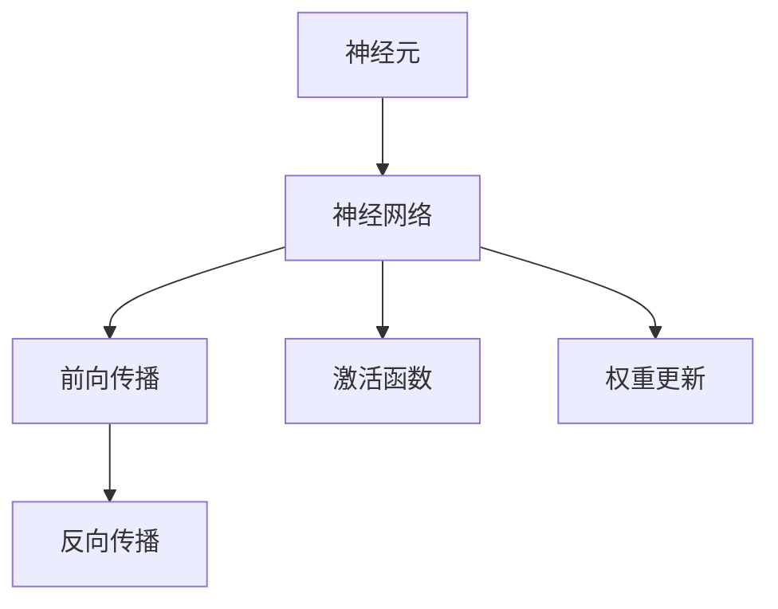
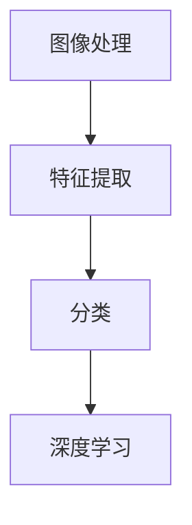
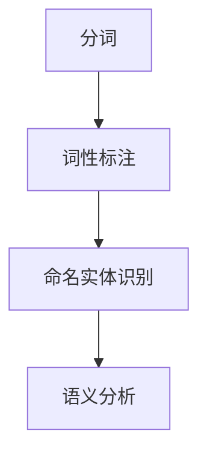
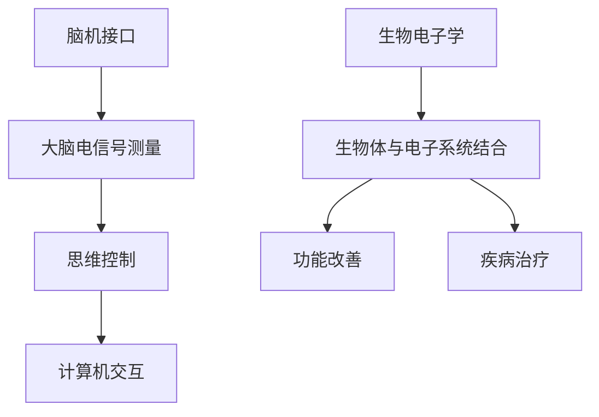
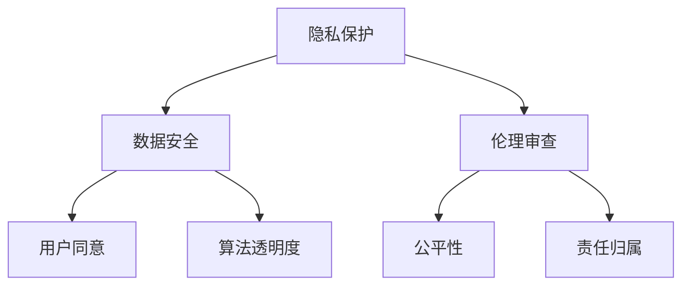
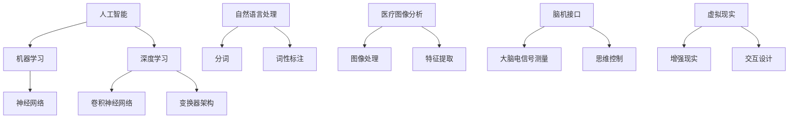

                 


### 第2章：人机融合技术的核心原理

#### 2.1.1 人工神经网络

**背景介绍**

人工神经网络（Artificial Neural Networks，ANN）是模仿人脑结构和功能的一种计算模型，它由大量简单的人工神经元通过相互连接构成。自1980年代以来，随着计算能力的提升和算法的改进，人工神经网络在计算机视觉、语音识别、自然语言处理等领域取得了显著的进展。

**核心概念与联系**

人工神经网络的运作基于神经元之间的交互。每个神经元接收来自其他神经元的输入信号，并通过加权求和和激活函数产生输出。以下是人工神经网络的核心概念和它们之间的关系架构：



**核心算法原理讲解**

人工神经网络的核心算法包括前向传播和反向传播。以下是一个使用Python源代码详细讲解的过程：

```python
# 导入相关库
import numpy as np

# 定义激活函数
def sigmoid(x):
    return 1 / (1 + np.exp(-x))

# 定义前向传播
def forward_propagation(x, weights):
    z = np.dot(x, weights)
    a = sigmoid(z)
    return a

# 定义反向传播
def backward_propagation(x, weights, output_error):
    output_delta = output_error * sigmoid_output_derivative(a)
    hidden_error = output_delta.dot(weights.T)
    hidden_delta = hidden_error * sigmoid_output_derivative(z)

# 计算输出误差
output_error = y - output

# 计算隐藏层误差
hidden_error = output_error.dot(weights[-1].T)

# 计算隐藏层输出
hidden_output = forward_propagation(hidden_input, weights[0])

# 计算隐藏层输出误差的导数
def sigmoid_output_derivative(output):
    return output * (1 - output)
```

**数学模型和公式**

人工神经网络的数学模型基于线性代数和微积分。以下是几个关键数学公式：

$$
z = \sum_{i=1}^{n} w_i x_i + b
$$

$$
a = \sigma(z)
$$

$$
\delta_{output} = \frac{\partial C}{\partial z} = \frac{\partial (1/2 * (y - \hat{y})^2)}{\partial z} = (y - \hat{y}) \cdot \sigma'(z)
$$

**项目实战**

在本节中，我们将构建一个简单的人工神经网络模型，用于手写数字识别。以下是开发环境搭建和源代码详细实现的步骤：

1. **开发环境搭建**
   - 安装Python和相关库（如NumPy、Matplotlib等）。
   - 准备MNIST手写数字数据集。

2. **源代码实现**
   - 定义神经元和神经网络结构。
   - 实现前向传播和反向传播算法。
   - 训练神经网络并测试模型性能。

3. **代码解读与分析**
   - 分析代码中的核心函数和流程。
   - 讨论如何调整网络参数以优化模型性能。

4. **实际案例分析和详细讲解剖析**
   - 分析MNIST数据集的特点。
   - 讨论如何将神经网络应用于实际问题。

5. **项目小结**
   - 总结项目的主要收获和经验。
   - 提出改进和扩展的方向。

**最佳实践 tips**

- **优化学习率**：学习率的选择对网络训练至关重要。过小可能导致收敛缓慢，过大可能导致训练不稳定。
- **使用正则化**：为了防止过拟合，可以引入正则化技术，如L2正则化。
- **数据预处理**：对数据进行标准化处理，可以提高模型的泛化能力。

**小结**

本章介绍了人工神经网络的核心原理、数学模型和项目实战。通过Python代码示例，我们深入了解了神经网络的运作机制和实现细节。在下一章中，我们将探讨计算机视觉技术的基础知识及其在增强人类能力方面的应用。

**注意事项**

- 在实现神经网络时，需要仔细处理数据，避免噪声和异常值对模型性能的影响。
- 在调整网络参数时，要考虑到计算资源和时间成本。

**拓展阅读**

- 《深度学习》（Ian Goodfellow、Yoshua Bengio和Aaron Courville著）
- 《人工神经网络：原理与实现》（克里斯·巴特勒著）

## 第3章：人机融合技术的核心原理

#### 2.2.2 计算机视觉

**背景介绍**

计算机视觉（Computer Vision）是使计算机能够像人类一样感知和理解视觉信息的技术。它在自动驾驶、图像识别、医疗诊断等领域具有广泛的应用。随着深度学习技术的发展，计算机视觉取得了显著的进展。

**核心概念与联系**

计算机视觉的核心概念包括图像处理、特征提取和分类。以下是这些概念之间的关系架构：



**核心算法原理讲解**

计算机视觉的算法通常基于卷积神经网络（Convolutional Neural Networks，CNN）。以下是CNN的核心原理：

1. **卷积层（Convolutional Layer）**

卷积层通过卷积操作从输入图像中提取特征。卷积操作可以看作是在图像上滑动一个小的滤波器（卷积核），并计算滤波器与图像的局部相关性。

```python
# Python代码示例：卷积层实现
def conv2d(input_image, filter):
    return np.sum(input_image * filter, axis=(1, 2))
```

2. **激活函数（Activation Function）**

激活函数通常用于引入非线性特性。ReLU（Rectified Linear Unit）是最常用的激活函数之一，它可以加速网络的训练。

```python
# Python代码示例：ReLU激活函数
def relu(x):
    return np.maximum(0, x)
```

3. **池化层（Pooling Layer）**

池化层用于减小特征图的尺寸，同时保留重要特征。最大池化（Max Pooling）是最常用的池化方式，它可以减少计算量和参数数量。

```python
# Python代码示例：最大池化
def max_pooling(feature_map, pool_size=(2, 2)):
    return np.max(feature_map[:pool_size[0], :pool_size[1]], axis=(0, 1))
```

**数学公式**

以下是计算机视觉中几个关键的数学公式：

$$
f(x) = \sigma(\sum_{i=1}^{k} w_i \cdot x_i + b)
$$

$$
\delta_{output} = \frac{\partial C}{\partial z} = \frac{\partial (1/2 * (y - \hat{y})^2)}{\partial z} = (y - \hat{y}) \cdot \sigma'(z)
$$

**项目实战**

在本节中，我们将使用TensorFlow构建一个简单的CNN模型，用于图像分类。以下是项目实战的步骤：

1. **开发环境搭建**
   - 安装Python和TensorFlow。
   - 准备CIFAR-10数据集。

2. **源代码实现**
   - 定义CNN模型结构。
   - 实现前向传播和反向传播算法。
   - 训练模型并评估性能。

3. **代码解读与分析**
   - 分析代码中的关键组件和流程。
   - 讨论如何优化模型性能。

4. **实际案例分析和详细讲解剖析**
   - 分析CIFAR-10数据集的特点。
   - 讨论如何将CNN应用于实际问题。

5. **项目小结**
   - 总结项目的主要收获和经验。
   - 提出改进和扩展的方向。

**最佳实践 tips**

- **数据增强**：通过旋转、缩放、裁剪等方式增加数据多样性，可以提高模型的泛化能力。
- **批量归一化**：批量归一化（Batch Normalization）可以加速网络训练并提高稳定性。

**小结**

本章介绍了计算机视觉的核心算法原理，包括卷积层、激活函数和池化层。通过项目实战，我们深入了解了CNN在图像分类中的应用。在下一章中，我们将探讨自然语言处理技术及其在增强人类能力方面的应用。

**注意事项**

- 在实现卷积神经网络时，要特别注意参数的选择和优化。
- 在处理大规模图像数据时，需要考虑计算资源和时间成本。

**拓展阅读**

- 《深度学习》（Ian Goodfellow、Yoshua Bengio和Aaron Courville著）
- 《计算机视觉：算法与应用》（Drew McDermott著）

## 第3章：人机融合技术的核心原理

#### 2.2.3 自然语言处理

**背景介绍**

自然语言处理（Natural Language Processing，NLP）是使计算机能够理解、生成和处理自然语言的技术。NLP在搜索引擎、机器翻译、情感分析等领域有着广泛的应用。随着深度学习技术的发展，NLP取得了显著的进展。

**核心概念与联系**

自然语言处理的核心概念包括分词、词性标注、命名实体识别、语义分析等。以下是这些概念之间的关系架构：



**核心算法原理讲解**

自然语言处理的算法通常基于循环神经网络（Recurrent Neural Networks，RNN）和变换器架构（Transformer）。以下是RNN和Transformer的核心原理：

1. **循环神经网络（RNN）**

RNN通过循环连接来处理序列数据。它通过记忆过去的信息来预测未来的输出。以下是RNN的核心公式：

$$
h_t = \sigma(W_h \cdot [h_{t-1}, x_t] + b_h)
$$

$$
y_t = W_y \cdot h_t + b_y
$$

2. **变换器架构（Transformer）**

Transformer是一种基于自注意力机制的模型，它在处理长序列数据方面具有显著优势。以下是Transformer的核心公式：

$$
\text{Attention}(Q, K, V) = \text{softmax}\left(\frac{QK^T}{\sqrt{d_k}}\right)V
$$

$$
\text{MultiHeadAttention}(Q, K, V) = \text{Attention}(Q, K, V) \cdot d_v
$$

**项目实战**

在本节中，我们将使用TensorFlow构建一个简单的RNN模型，用于情感分析。以下是项目实战的步骤：

1. **开发环境搭建**
   - 安装Python和TensorFlow。
   - 准备IMDB电影评论数据集。

2. **源代码实现**
   - 定义RNN模型结构。
   - 实现前向传播和反向传播算法。
   - 训练模型并评估性能。

3. **代码解读与分析**
   - 分析代码中的关键组件和流程。
   - 讨论如何优化模型性能。

4. **实际案例分析和详细讲解剖析**
   - 分析IMDB电影评论数据集的特点。
   - 讨论如何将RNN应用于实际问题。

5. **项目小结**
   - 总结项目的主要收获和经验。
   - 提出改进和扩展的方向。

**最佳实践 tips**

- **文本预处理**：对文本进行清洗和预处理，如去除标点符号、停用词等，可以提高模型的泛化能力。
- **使用预训练模型**：使用预训练的模型可以减少训练时间，提高模型性能。

**小结**

本章介绍了自然语言处理的核心算法原理，包括RNN和Transformer。通过项目实战，我们深入了解了RNN在情感分析中的应用。在下一章中，我们将探讨人机融合技术的应用案例。

**注意事项**

- 在实现自然语言处理模型时，要特别注意文本数据的预处理和特征提取。
- 在处理大规模文本数据时，需要考虑计算资源和时间成本。

**拓展阅读**

- 《深度学习》（Ian Goodfellow、Yoshua Bengio和Aaron Courville著）
- 《自然语言处理综合教程》（Daniel Jurafsky和James H. Martin著）

## 第4章：人机融合技术的应用案例

### 第5章：医疗领域的人机融合技术

**背景介绍**

医疗领域的人机融合技术正在迅速发展，为医疗诊断、治疗和患者护理带来了革命性的变化。这些技术包括医疗图像分析、病理诊断辅助和虚拟现实医疗训练等。

**应用案例**

1. **医疗图像分析**

医疗图像分析是计算机视觉技术在医疗领域的典型应用。通过分析X射线、CT扫描和MRI等医疗图像，计算机可以辅助医生进行诊断。以下是医疗图像分析的几个关键步骤：

- **图像预处理**：包括去除噪声、增强对比度和归一化等。
- **特征提取**：从图像中提取具有诊断意义的特征。
- **分类与识别**：使用深度学习模型对病变区域进行分类和识别。

**案例分析**

我们以肺癌检测为例，介绍一个基于深度学习的医疗图像分析项目：

- **项目目标**：使用深度学习模型自动检测肺癌。
- **数据集**：使用来自Lung Image Database（LIDC）的CT扫描图像。
- **算法选择**：采用卷积神经网络（CNN）进行图像分类。

以下是该项目的主要步骤：

1. **数据预处理**：对图像进行归一化处理，并划分为训练集和测试集。
2. **模型构建**：设计并训练CNN模型，使用训练集进行训练。
3. **模型评估**：在测试集上评估模型性能，调整模型参数以优化性能。
4. **应用**：将训练好的模型部署到实际环境中，辅助医生进行肺癌检测。

**源代码实现**

以下是CNN模型的主要代码实现：

```python
import tensorflow as tf
from tensorflow.keras.models import Sequential
from tensorflow.keras.layers import Conv2D, MaxPooling2D, Flatten, Dense

# 定义CNN模型
model = Sequential([
    Conv2D(32, (3, 3), activation='relu', input_shape=(256, 256, 3)),
    MaxPooling2D((2, 2)),
    Conv2D(64, (3, 3), activation='relu'),
    MaxPooling2D((2, 2)),
    Flatten(),
    Dense(128, activation='relu'),
    Dense(1, activation='sigmoid')
])

# 编译模型
model.compile(optimizer='adam', loss='binary_crossentropy', metrics=['accuracy'])

# 训练模型
model.fit(train_images, train_labels, epochs=10, validation_split=0.2)
```

**项目小结**

医疗图像分析项目展示了深度学习在医疗领域的巨大潜力。通过合理的模型设计和数据预处理，我们能够实现自动化的病变检测，为医生提供有力的辅助工具。

**最佳实践 tips**

- **数据多样性**：确保数据集包含足够多样性的病例，以提高模型的泛化能力。
- **模型验证**：在部署模型前，进行充分的验证，确保模型性能符合实际需求。

**注意事项**

- 在处理医疗数据时，需要遵守相关法律法规，确保患者隐私得到保护。
- 在使用深度学习模型进行诊断时，应结合医生的专业判断，避免过度依赖模型。

### 第6章：教育领域的人机融合技术

**背景介绍**

教育领域的人机融合技术正逐渐改变传统的教学模式，为个性化学习、智能教学和虚拟课堂等提供了新的可能。这些技术不仅提高了教学效果，也增强了学生的学习体验。

**应用案例**

1. **智能教学系统**

智能教学系统通过分析学生的学习行为和学习数据，提供个性化的教学建议。以下是智能教学系统的几个关键组件：

- **学习行为分析**：收集学生的学习行为数据，如学习时间、练习结果等。
- **学习数据挖掘**：分析学习数据，发现学生的学习规律和需求。
- **个性化推荐**：基于学习行为和学习数据，为学生推荐合适的学习资源和练习。

**案例分析**

以K-12教育为例，介绍一个智能教学系统项目：

- **项目目标**：为学生提供个性化的学习建议，提高学习效果。
- **技术实现**：使用自然语言处理（NLP）和机器学习算法分析学生的学习数据。
- **系统架构**：包括数据收集、数据分析和推荐引擎三个主要模块。

以下是该项目的主要步骤：

1. **数据收集**：通过学习平台收集学生的学习行为数据。
2. **数据预处理**：对收集的数据进行清洗和格式化。
3. **数据分析**：使用NLP和机器学习算法分析学生的学习数据。
4. **个性化推荐**：根据分析结果，为学生推荐合适的学习资源和练习。
5. **系统评估**：通过实验评估智能教学系统对学生学习效果的提升。

**源代码实现**

以下是使用Python实现的智能教学系统核心组件：

```python
import pandas as pd
from sklearn.feature_extraction.text import TfidfVectorizer
from sklearn.metrics.pairwise import cosine_similarity

# 加载学生数据
data = pd.read_csv('student_data.csv')

# 创建TF-IDF向量器
vectorizer = TfidfVectorizer()

# 将文本数据转换为向量
student_data = vectorizer.fit_transform(data['text'])

# 计算相似度
similarity = cosine_similarity(student_data)

# 推荐学习资源
def recommend_resources(student_id):
    # 获取学生的向量
    student_vector = student_data[student_id]
    
    # 计算与其他学生的相似度
    recommendations = similarity[student_id].argsort()[-10:]
    
    # 返回推荐资源
    return data['resource'][recommendations]

# 测试推荐功能
print(recommend_resources(0))
```

**项目小结**

智能教学系统项目展示了人机融合技术在教育领域的应用潜力。通过分析学生的学习行为和学习数据，系统能够为学生提供个性化的学习建议，从而提高学习效果。

**最佳实践 tips**

- **数据隐私保护**：确保学生数据的安全和隐私。
- **系统可扩展性**：设计可扩展的系统架构，以适应不同类型的学习数据和需求。

**注意事项**

- 在设计智能教学系统时，要充分考虑学生的学习习惯和个性差异。
- 在系统部署过程中，应与教育专家合作，确保系统的教学效果符合教育目标。

### 第7章：人机融合技术的创新与应用

**背景介绍**

人机融合技术的创新应用正在不断扩展其应用领域，为人类的生活和工作带来了前所未有的变化。脑机接口（Brain-Computer Interface，BCI）和生物电子学是其中的两个重要领域，它们在增强人类能力方面具有巨大潜力。

**核心概念与联系**

脑机接口技术是一种直接连接人脑和计算机的技术，它通过测量大脑的电活动，使人们能够通过思维控制外部设备。生物电子学则是将生物体与电子系统相结合，以改善人体功能或治疗疾病。

以下是这两个领域的关键概念和它们之间的关系架构：



**核心算法原理讲解**

1. **脑机接口技术**

脑机接口技术的核心在于从大脑中提取电信号，并将其转换为计算机可以理解的控制信号。以下是脑机接口技术的主要步骤：

- **信号采集**：通过脑电图（EEG）、功能性磁共振成像（fMRI）等技术采集大脑的电活动信号。
- **信号处理**：对采集到的信号进行滤波、放大和去噪处理，以提高信号质量。
- **特征提取**：从处理后的信号中提取特征，如时域特征、频域特征等。
- **模式识别**：使用机器学习算法对提取的特征进行分类和识别，以实现思维控制。

**项目实战**

在本节中，我们将介绍一个基于脑电图（EEG）的脑机接口项目，用于手势识别。以下是项目实战的步骤：

1. **开发环境搭建**
   - 安装Python和相关的机器学习库（如scikit-learn、mne等）。
   - 准备EEG数据集。

2. **源代码实现**
   - 采集并预处理EEG数据。
   - 提取EEG数据的特征。
   - 训练手势识别模型。

3. **代码解读与分析**
   - 分析代码中的核心函数和流程。
   - 讨论如何优化模型性能。

4. **实际案例分析和详细讲解剖析**
   - 分析EEG数据集的特点。
   - 讨论如何将脑机接口技术应用于实际问题。

5. **项目小结**
   - 总结项目的主要收获和经验。
   - 提出改进和扩展的方向。

**源代码示例**

以下是使用Python实现的手势识别模型：

```python
import mne
from sklearn.model_selection import train_test_split
from sklearn.ensemble import RandomForestClassifier

# 读取EEG数据
data = mne.io.read_raw_fif('ee_gesture_data.fif')

# 预处理数据
预处理后的数据 = 数据.preprocess()

# 提取特征
特征 = 预处理后的数据.extract_features()

# 划分训练集和测试集
训练数据，测试数据，训练标签，测试标签 = train_test_split(特征，标签，测试大小=0.2)

# 训练模型
模型 = RandomForestClassifier(n_estimators=100)
模型.fit(训练数据，训练标签)

# 测试模型
预测标签 = 模型.predict(测试数据)
准确率 = (预测标签 == 测试标签).mean()
print('准确率：', 准确率)
```

**项目小结**

手势识别项目展示了脑机接口技术在人机融合应用中的潜力。通过合理的信号处理和特征提取，我们能够实现从大脑电信号到手势识别的转换，为增强人类能力提供了新的途径。

**最佳实践 tips**

- **信号质量优化**：提高信号采集的质量，如使用高精度的电极和放大器。
- **模型优化**：使用先进的机器学习算法和深度学习模型，以提高识别准确性。

**注意事项**

- 在进行脑机接口研究时，需要严格遵守伦理规范，确保参与者的隐私和安全。

### 第8章：人机融合技术的伦理和未来展望

**背景介绍**

人机融合技术的快速发展引发了诸多伦理问题，如隐私、安全、就业等。同时，人机融合技术的未来展望也备受关注。本章节将从伦理角度探讨人机融合技术的潜在影响，并展望其未来发展趋势。

**核心概念与联系**

以下是人机融合技术相关的几个核心概念和它们之间的联系：



**伦理问题探讨**

1. **隐私保护**

随着人机融合技术的普及，个人隐私数据的安全问题日益突出。如何在保障技术进步的同时保护用户隐私，成为亟待解决的问题。以下是几个关键点：

- **数据匿名化**：对个人数据进行匿名化处理，减少隐私泄露的风险。
- **用户同意**：确保用户在数据收集和使用过程中有充分的知情权和选择权。

2. **数据安全**

确保数据在传输、存储和处理过程中的安全性是数据安全的关键。以下是一些关键措施：

- **加密技术**：使用加密技术保护数据在传输和存储过程中的安全性。
- **访问控制**：对数据访问权限进行严格控制，防止未经授权的访问。

3. **伦理审查**

在人机融合技术的研发和应用过程中，需要进行伦理审查，以确保技术不会对人类造成负面影响。以下是几个关键点：

- **公平性**：确保技术不会加剧社会不平等，如就业歧视、教育不平等等。
- **责任归属**：明确技术开发者和应用者的责任，确保在发生问题时能够追究责任。

**未来展望**

1. **技术发展趋势**

人机融合技术的未来发展趋势包括：

- **更加智能的交互**：通过改进人工智能技术，实现更自然、更高效的交互方式。
- **更广泛的应用领域**：人机融合技术将在医疗、教育、工业等领域得到更广泛的应用。

2. **潜在影响**

人机融合技术的潜在影响包括：

- **提高生产力**：通过自动化和智能化，提高工作效率和生产能力。
- **改变人类生活方式**：人机融合技术将改变人们的生活方式，如远程办公、智能家居等。

**最佳实践 tips**

- **持续关注伦理问题**：在技术发展过程中，持续关注伦理问题，确保技术的道德和社会责任。
- **加强合作与交流**：鼓励学术界、产业界和政府之间的合作，共同推动人机融合技术的健康发展。

**注意事项**

- 在开发和部署人机融合技术时，要充分考虑伦理和社会影响，确保技术的可持续性和公平性。

**拓展阅读**

- 《人工智能伦理学》（Luciano Floridi著）
- 《人机融合技术：未来的趋势与挑战》（Sebastian Thrun著）

## 结语

### 背景介绍

在人机融合技术的飞速发展背景下，其应用场景不断扩展，从医疗、教育到工业，无不显示出其强大的潜力和广泛的影响。人机融合技术不仅改变了人类的工作方式和生活习惯，也对社会的各个方面产生了深远的影响。

### 核心概念与联系

以下是人机融合技术的几个核心概念及其联系：



### 总结与展望

通过本文的探讨，我们可以看到人机融合技术已经在多个领域取得了显著的成果，并展现出广阔的发展前景。以下是文章的核心观点和未来展望：

1. **核心观点**
   - 人机融合技术通过人工智能、机器学习和深度学习等先进技术，实现了人与机器之间的智能交互。
   - 脑机接口技术的发展为增强人类能力提供了新的途径，如脑控机器人、智能假肢等。
   - 在医疗领域，人机融合技术通过图像分析和诊断辅助等应用，提高了医疗服务的质量和效率。
   - 教育领域的人机融合技术通过智能教学系统和虚拟课堂等应用，为个性化学习和远程教育提供了新的解决方案。

2. **未来展望**
   - 随着技术的不断进步，人机融合技术将在更多领域得到应用，如工业自动化、智能家居、金融服务等。
   - 未来的人机融合技术将更加智能化和个性化，能够更好地满足人类的需求。
   - 随着伦理和社会问题逐渐凸显，人机融合技术的可持续发展将成为重要的研究方向。

### 最佳实践 tips

- **持续学习与更新**：随着技术的快速发展，保持学习的热情和持续更新知识是适应时代变化的关键。
- **关注伦理问题**：在研发和应用人机融合技术时，要充分考虑伦理和社会影响，确保技术的道德和社会责任。

### 注意事项

- **安全与隐私保护**：在数据采集、处理和应用过程中，要确保数据的安全和隐私保护。
- **责任与监管**：明确技术开发者和应用者的责任，建立健全的监管机制，确保技术的合法合规使用。

### 拓展阅读

- 《深度学习》（Ian Goodfellow、Yoshua Bengio和Aaron Courville著）
- 《人工智能：一种现代的方法》（Stuart Russell和Peter Norvig著）

### 作者信息

**作者：AI天才研究院/AI Genius Institute & 禅与计算机程序设计艺术 /Zen And The Art of Computer Programming**

