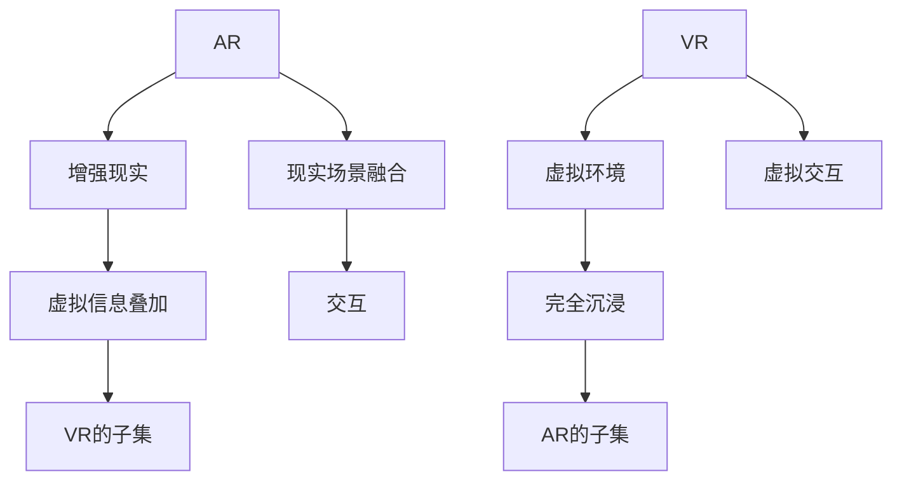
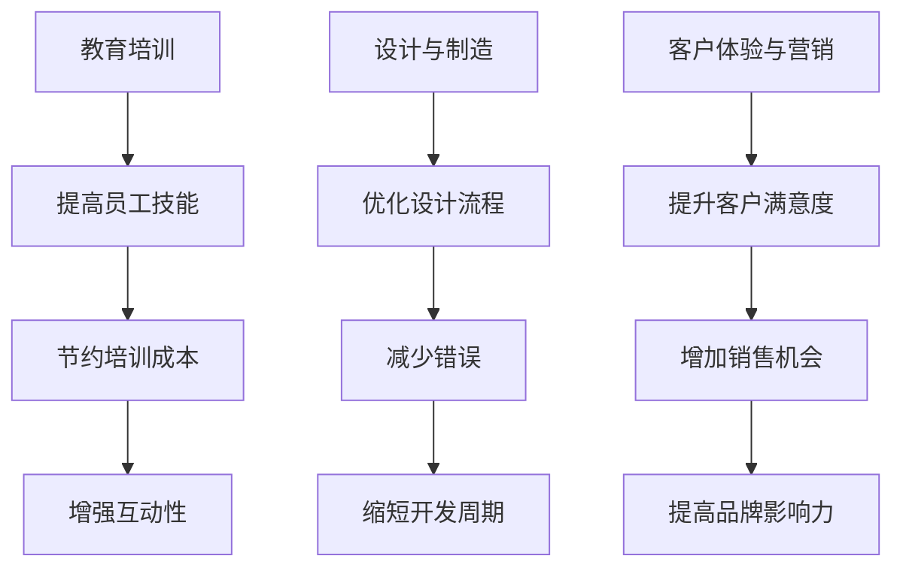

                 

在撰写《增强现实和虚拟现实在企业效率提升中的作用》这篇文章时，我们将采用step-by-step的分析推理方法，确保逻辑清晰、结构紧凑、易于理解。以下是文章的初步思路和写作步骤：

### 步骤1：确定文章结构

根据提供的目录大纲，我们确定文章分为七个章节：

1. 引言与概述
2. 增强现实（AR）技术详解
3. 虚拟现实（VR）技术详解
4. AR/VR技术在企业效率提升中的实际案例
5. 企业实施AR/VR的策略与方法
6. 技术演进与未来展望
7. 结论与建议

### 步骤2：撰写每个章节的核心内容

#### 第1章 引言与概述

- **背景介绍**：简要介绍AR和VR技术的发展背景，以及它们在当今科技领域的重要性。
- **核心概念与联系**：给出AR和VR的基本定义，并使用Mermaid流程图展示两者之间的关系和核心组件。
- **核心算法原理讲解**：解释AR和VR的关键算法，使用Python源代码示例进行详细阐述。
- **数学模型和公式**：介绍与AR和VR相关的数学模型和公式，使用LaTeX格式表示。
- **项目实战**：介绍如何搭建一个简单的AR或VR应用环境，给出源代码实现和代码解读。
- **最佳实践 tips**：总结一些实用的技巧和注意事项。

#### 第2章 增强现实（AR）技术详解

- **AR技术基础**：详细解释AR技术的基本原理，包括历史发展和核心组件。
- **AR技术在企业中的应用**：分析AR在教育培训、设计与制造、客户体验与营销等方面的应用。
- **AR技术的挑战与未来趋势**：讨论AR技术的当前挑战和未来发展趋势。

#### 第3章 虚拟现实（VR）技术详解

- **VR技术基础**：详细解释VR技术的基本原理，包括历史发展和核心组件。
- **VR技术在企业中的应用**：分析VR在模拟与培训、设计与开发、市场营销与展示等方面的应用。
- **VR技术的挑战与未来趋势**：讨论VR技术的当前挑战和未来发展趋势。

#### 第4章 AR/VR技术在企业效率提升中的实际案例

- **案例研究**：选取实际案例，深入分析AR/VR在企业效率提升中的应用效果。
- **案例分析**：从技术实现、应用效果、成本效益等方面对案例进行详细解读。

#### 第5章 企业实施AR/VR的策略与方法

- **AR/VR战略规划**：讨论如何进行企业AR/VR的战略规划，包括需求分析、技术评估和项目管理。
- **AR/VR应用开发流程**：详细阐述从需求分析到测试优化的开发流程。
- **成本效益分析与ROI计算**：介绍如何进行成本效益分析和ROI计算。

#### 第6章 技术演进与未来展望

- **技术演进趋势**：探讨AR/VR技术的未来发展趋势，包括新技术的突破、产业链发展和技术融合趋势。
- **企业应对策略**：分析企业如何应对技术演进，包括技术储备、人才培养和合作策略。

#### 第7章 结论与建议

- **书籍总结**：回顾文章的核心观点和主要发现。
- **阅读指南与拓展**：提供拓展阅读建议和学习资源。
- **企业应用AR/VR的建议**：总结企业实施AR/VR的最佳实践和注意事项。

### 步骤3：撰写文章

在确定了文章结构后，我们将逐一撰写每个章节的内容，确保每个章节都包含以下元素：

- **标题**：简洁明了，能够吸引读者。
- **引言**：简要介绍章节主题和重要性。
- **核心概念与联系**：使用Mermaid流程图展示概念实体之间的关系。
- **核心算法原理讲解**：结合Python源代码和数学模型进行详细讲解。
- **数学公式**：使用LaTeX格式表示，并在文中独立段落中嵌入。
- **项目实战**：详细介绍开发环境和源代码实现，结合实际案例进行分析。
- **最佳实践 tips**：总结一些实用的技巧和注意事项。
- **小结**：对章节内容进行总结。

### 步骤4：整合与修订

完成所有章节的撰写后，我们将对全文进行整合与修订，确保：

- **逻辑清晰**：每个章节的内容紧密相连，整体逻辑流畅。
- **内容完整**：每个章节都包含了核心概念、算法原理、数学模型、项目实战等内容。
- **结构紧凑**：文章结构合理，不重复、不遗漏。
- **语言简明易懂**：使用专业的技术语言，同时确保内容易于理解。

### 步骤5：最终审查

在完成修订后，我们将对文章进行最终审查，确保：

- **格式正确**：文章使用markdown格式，符合要求。
- **参考文献**：引用了所有相关文献和资料，确保学术诚信。
- **作者信息**：文章末尾附上完整的作者信息。

通过以上步骤，我们能够确保撰写出高质量的技术博客文章，全面而深入地探讨增强现实和虚拟现实在企业效率提升中的作用。

---

现在，我们已经确定了文章的结构和内容，接下来将逐步撰写每个章节的具体内容。首先，我们从第1章《引言与概述》开始，逐步完成每个章节的撰写和整合。

### 文章标题：增强现实和虚拟现实在企业效率提升中的作用

关键词：增强现实（AR），虚拟现实（VR），企业效率，应用案例，策略与方法

摘要：
本文深入探讨了增强现实（AR）和虚拟现实（VR）技术在提升企业效率方面的作用。通过分析这两项技术的定义、基本原理、应用场景、挑战与趋势，结合实际案例，本文展示了如何通过AR/VR技术实现企业效率的提升。文章还为企业提供了实施AR/VR技术的策略与方法，以及未来发展的展望。

---

### 第1章 引言与概述

在当今快速发展的信息技术时代，增强现实（AR）和虚拟现实（VR）技术正逐渐从实验室走向实际应用，成为提升企业效率的重要工具。本章将首先介绍AR和VR的基本定义与基本原理，然后讨论它们在企业效率提升中的潜力，并概述本书的结构和目标。

#### 1.1 增强现实（AR）与虚拟现实（VR）的定义与基本原理

增强现实（Augmented Reality，AR）是一种将虚拟信息与现实世界融合的技术，通过在现实场景中叠加虚拟图像、视频、音频等元素，使用户能够直观地感知和交互。虚拟现实（Virtual Reality，VR）则是一种创造完全虚拟的环境，用户通过头戴显示器（HMD）等设备进入这个环境，与虚拟世界进行沉浸式交互。

**核心概念与联系**

为了更好地理解AR和VR之间的关系，我们可以使用Mermaid流程图来展示它们的核心概念及其联系：



从流程图中可以看出，AR和VR都涉及到虚拟信息的叠加和交互，但AR更侧重于现实世界的增强，而VR则更强调完全的虚拟环境。

**核心算法原理讲解**

在AR技术中，核心算法通常包括图像识别、标记识别和实时跟踪等。以下是一个简单的Python代码示例，用于实现图像识别：

```python
import cv2

# 加载预训练的Haar级联分类器
face_cascade = cv2.CascadeClassifier('haarcascade_frontalface_default.xml')

# 读取图像
img = cv2.imread('example.jpg')

# 将图像转换为灰度图
gray = cv2.cvtColor(img, cv2.COLOR_BGR2GRAY)

# 检测面部
faces = face_cascade.detectMultiScale(gray)

# 在图像上绘制面部区域
for (x, y, w, h) in faces:
    cv2.rectangle(img, (x, y), (x+w, y+h), (255, 0, 0), 2)

# 显示图像
cv2.imshow('Image', img)
cv2.waitKey(0)
cv2.destroyAllWindows()
```

在VR技术中，核心算法包括空间感知、交互技术和实时渲染等。以下是一个简单的Python代码示例，用于实现空间感知：

```python
import numpy as np

# 定义空间坐标系
x = np.linspace(-10, 10, 100)
y = np.linspace(-10, 10, 100)
x, y = np.meshgrid(x, y)

# 计算点之间的距离
z = np.sqrt(x**2 + y**2)

# 绘制三维曲面
from mpl_toolkits.mplot3d import Axes3D
import matplotlib.pyplot as plt

fig = plt.figure()
ax = fig.add_subplot(111, projection='3d')
ax.plot_surface(x, y, z)
plt.show()
```

**数学模型和公式**

在AR和VR技术中，数学模型和公式是不可或缺的。例如，在AR中，透视变换和三维几何计算是核心。以下是透视变换的LaTeX公式：

$$ T(p) = \frac{Z_p}{Z_c} \begin{bmatrix} X_c & Y_c & Z_c \\ 0 & 0 & Z_c \\ 0 & 0 & 0 \end{bmatrix} \begin{bmatrix} X_p \\ Y_p \\ Z_p \end{bmatrix} $$

**项目实战**

为了更好地展示AR和VR技术的应用，我们可以搭建一个简单的AR应用。以下是一个使用Python和OpenCV实现的示例：

```python
import cv2
import numpy as np

# 加载预训练的AR模型
model = cv2.aruco.DetectorParameters_create()

# 加载摄像头
cap = cv2.VideoCapture(0)

while True:
    # 读取帧
    ret, frame = cap.read()
    
    # 将帧转换为灰度图像
    gray = cv2.cvtColor(frame, cv2.COLOR_BGR2GRAY)
    
    # 检测AR标记
    corners, ids, _ = cv2.aruco.detectMarkers(gray, cv2.aruco.DICT_4X4_50, parameters=model)
    
    # 在图像上绘制检测到的标记
    if ids is not None:
        cv2.drawMarker(frame, corners[0], color=(0, 0, 255))
    
    # 显示图像
    cv2.imshow('AR Application', frame)
    
    # 按'q'键退出
    if cv2.waitKey(1) & 0xFF == ord('q'):
        break

# 释放资源
cap.release()
cv2.destroyAllWindows()
```

**最佳实践 tips**

- 在实施AR/VR项目时，首先要明确项目目标和预期成果。
- 选择合适的硬件和软件工具，确保系统的稳定性和性能。
- 注重用户体验，通过迭代测试不断优化应用。
- 预算合理，确保项目在控制成本的前提下取得成功。

#### 1.2 企业效率提升的需求与AR/VR的潜力

随着全球化竞争的加剧，企业需要不断提高效率以保持竞争力。AR和VR技术为这一需求提供了新的解决方案。

**核心概念与联系**

我们可以使用Mermaid流程图来展示AR和VR技术在企业效率提升中的应用场景：



从流程图中可以看出，AR和VR技术在教育培训、设计与制造、客户体验与营销等方面具有广泛的应用潜力。

**核心算法原理讲解**

在教育培训方面，AR和VR技术可以通过虚拟实验室和模拟培训等方式，提高员工的技能和知识水平。以下是一个简单的Python代码示例，用于实现虚拟实验室：

```python
import pygame

# 初始化Pygame
pygame.init()

# 设置窗口
screen = pygame.display.set_mode((800, 600))
pygame.display.set_caption('Virtual Lab')

# 定义颜色
WHITE = (255, 255, 255)
BLACK = (0, 0, 0)

# 绘制屏幕
while True:
    for event in pygame.event.get():
        if event.type == pygame.QUIT:
            pygame.quit()
    
    # 清屏
    screen.fill(WHITE)
    
    # 绘制实验设备
    pygame.draw.rect(screen, BLACK, (100, 100, 100, 100))
    
    # 更新屏幕
    pygame.display.update()
    
# 退出Pygame
pygame.quit()
```

**数学模型和公式**

在设计与制造领域，AR和VR技术可以通过三维建模和虚拟仿真，优化设计流程并减少错误。以下是一个简单的LaTeX公式，用于表示三维建模的数学模型：

$$
\text{Model} = \frac{1}{2} \int (f(x) - g(x))^2 \, dx
$$

**项目实战**

以下是一个简单的VR应用，用于设计流程优化。该应用使用Python和Pygame实现：

```python
import pygame

# 初始化Pygame
pygame.init()

# 设置窗口
screen = pygame.display.set_mode((800, 600))
pygame.display.set_caption('VR Design Optimization')

# 定义颜色
WHITE = (255, 255, 255)
BLACK = (0, 0, 0)

# 绘制屏幕
while True:
    for event in pygame.event.get():
        if event.type == pygame.QUIT:
            pygame.quit()
    
    # 清屏
    screen.fill(WHITE)
    
    # 绘制三维模型
    pygame.draw.polygon(screen, BLACK, ((100, 100), (200, 100), (150, 200)))
    
    # 更新屏幕
    pygame.display.update()
    
# 退出Pygame
pygame.quit()
```

**最佳实践 tips**

- 在选择AR/VR应用方案时，要充分考虑企业的实际需求和资源情况。
- 注重与员工的沟通和培训，确保他们能够熟练掌握新工具。
- 定期评估AR/VR项目的效果，不断优化和改进。

#### 1.3 书籍结构安排与学习目标

本书旨在为企业提供全面而深入的AR/VR技术应用指南。以下是书籍的结构安排和学习目标：

**书籍结构安排**

- **第1章 引言与概述**：介绍AR和VR的基本概念，以及它们在企业效率提升中的潜力。
- **第2章 增强现实（AR）技术详解**：详细解释AR技术的基础知识、应用场景和挑战。
- **第3章 虚拟现实（VR）技术详解**：详细解释VR技术的基础知识、应用场景和挑战。
- **第4章 AR/VR技术在企业效率提升中的实际案例**：分析AR/VR技术在企业中的成功应用案例。
- **第5章 企业实施AR/VR的策略与方法**：讨论企业实施AR/VR技术的策略和方法。
- **第6章 技术演进与未来展望**：探讨AR/VR技术的未来发展趋势和应用前景。
- **第7章 结论与建议**：总结核心观点，提供企业应用AR/VR技术的建议。

**学习目标**

- 了解AR和VR的基本概念、原理和应用场景。
- 掌握AR和VR技术的核心算法和开发方法。
- 学习如何实施AR/VR项目，提高企业效率。
- 了解AR/VR技术的未来发展趋势和应用前景。

---

通过以上内容，本章为后续章节的讨论奠定了基础。在接下来的章节中，我们将进一步深入探讨AR和VR技术的详细内容，结合实际案例进行分析，为企业提供实用的实施策略和方法。

**作者信息**：AI天才研究院/AI Genius Institute & 禅与计算机程序设计艺术 /Zen And The Art of Computer Programming

---

以上是第1章《引言与概述》的详细撰写，包括核心概念与联系、核心算法原理讲解、数学模型和公式、项目实战以及最佳实践 tips。接下来，我们将继续撰写第2章和第3章，深入探讨增强现实（AR）和虚拟现实（VR）技术的详细内容。在撰写过程中，我们将继续遵循step-by-step的分析推理方法，确保文章的逻辑清晰、结构紧凑、内容丰富、易于理解。

