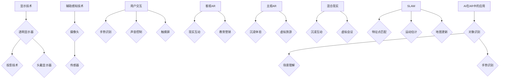

                 

# 增强现实在企业中的应用：提升效率与协作

## 关键词
- 增强现实（AR）
- 企业应用
- 效率提升
- 协作增强
- 技术实现
- 案例分析

## 摘要
本文旨在探讨增强现实（AR）技术在企业中的应用，通过分析其提升工作效率和协作能力的潜力，提供一系列的案例研究和最佳实践。首先，我们将介绍增强现实的基本概念和技术原理，然后深入探讨其在不同行业中的应用场景，以及如何通过AR技术开发环境实现企业应用。通过实际案例的展示，我们将探讨AR技术如何改变企业的运营方式，最后，本文将分析AR技术在企业应用中的挑战和未来发展趋势。

## 引言

### 增强现实概述

增强现实（Augmented Reality，简称AR）是一种将虚拟信息与现实世界相结合的技术，通过计算机生成的信息叠加到用户的感知环境中，使用户能够在现实世界中看到增强的内容。与虚拟现实（VR）不同，AR不取代用户的现实视野，而是在现实世界中加入额外的信息。

AR技术的概念最早可以追溯到20世纪50年代，但是直到近年来，随着硬件技术的进步和移动设备的普及，AR技术才得到了广泛应用。AR的发展历程中，标志性的事件包括1990年代初期波音公司开发的AR飞行模拟系统，以及2010年代谷歌眼镜的发布。进入21世纪，AR技术在游戏、娱乐和教育等领域取得了显著进展，逐渐向企业应用领域扩展。

### 增强现实的发展历史

增强现实技术的发展历程可以分为几个阶段：

1. **早期探索阶段（1960s-1980s）**：在这个阶段，研究者开始探索将计算机生成的图像叠加到真实环境中的技术。例如，1968年，美国研究员伊凡·苏瑟兰发明了“虚拟现实头戴显示器”（头戴显示器的概念），这一发明为AR的发展奠定了基础。

2. **军用和工业应用阶段（1990s）**：1990年代，AR技术在军事和工业领域得到了应用。例如，波音公司使用AR技术来维护飞机，通过AR眼镜指导技术人员进行维修工作，大大提高了工作效率。

3. **消费级设备兴起阶段（2000s-2010s）**：随着移动设备和智能手机的普及，AR技术逐渐走向消费市场。2010年，谷歌发布了AR应用“谷歌眼镜”，引发了AR技术的热潮。

4. **多元化应用和商业化阶段（2010s-至今）**：在这个阶段，AR技术在各个领域得到了广泛应用。游戏（如《精灵宝可梦GO》）、教育、医疗、零售和制造业等行业的应用案例层出不穷。此外，AR技术也逐渐被企业采用，以提高生产效率和协作能力。

### 增强现实在企业中的重要性

增强现实技术对企业具有重要的意义，主要体现在以下几个方面：

1. **提升工作效率**：AR技术可以通过提供实时信息和指导，减少操作错误和提高工作效率。例如，在制造业中，AR技术可以用于生产流程的实时监控和指导，帮助工人快速定位和完成任务。

2. **增强协作能力**：AR技术可以实现远程协作，使得不同地点的团队成员能够共享信息并协同工作。这在跨国公司和分布式团队中尤为重要。

3. **优化客户体验**：AR技术可以用于产品展示和互动体验，提高客户满意度。例如，在零售业中，AR技术可以用于虚拟试穿服装或家具，提供更加个性化的购物体验。

4. **支持创新和设计**：AR技术可以用于产品设计和验证，帮助企业在产品开发的早期阶段识别问题并进行迭代。这有助于缩短产品开发周期并降低开发成本。

总之，增强现实技术为企业提供了一种新的工作方式，有助于提升工作效率、增强协作能力、优化客户体验和支持创新设计。随着技术的不断进步和应用的深入，AR技术将在企业中发挥越来越重要的作用。

### 核心概念与联系

要深入探讨增强现实（AR）在企业中的应用，首先需要了解AR技术的核心概念及其相互关系。以下是关于AR技术基础、分类、关键技术的详细介绍。

#### 2.1.1 增强现实基础

增强现实技术通过将计算机生成的信息叠加到真实环境中，使用户能够看到增强的内容。其基本组成包括以下几个部分：

1. **显示技术**：显示技术是AR系统的核心，负责将虚拟信息叠加到用户的视野中。常见的显示技术有：
   - **透明显示器**：通过半透明材料将虚拟图像叠加到真实环境中。
   - **投影技术**：将虚拟图像投影到透明或反射的表面上。
   - **头戴显示器**：如谷歌眼镜等，将虚拟图像直接呈现在用户的视野中。

2. **辅助感知技术**：辅助感知技术帮助AR系统更好地理解用户的环境，包括：
   - **摄像头**：用于捕捉真实环境中的图像。
   - **传感器**：如加速度计、陀螺仪等，用于跟踪用户的位置和运动。
   - **SLAM（同步定位与地图构建）**：通过结合摄像头捕捉的图像和传感器数据，实现实时定位和地图构建。

3. **用户交互**：用户交互是AR系统的重要组成部分，包括：
   - **手势识别**：通过识别用户的手势来控制虚拟信息。
   - **声音控制**：通过语音命令来操作虚拟信息。
   - **触摸屏**：通过触摸屏幕与虚拟信息进行交互。

#### 2.1.2 增强现实分类

增强现实技术可以根据实现方式和应用场景的不同进行分类，常见的分类方法包括：

1. **客观AR**：
   - **定义**：客观AR将虚拟信息叠加到真实环境中，用户可以看到虚拟信息和真实环境同时存在。
   - **应用场景**：适用于需要与现实环境互动的场合，如维修、教育和营销。

2. **主观AR**：
   - **定义**：主观AR通过头戴显示器等设备将虚拟信息直接呈现在用户的视野中，用户感觉不到真实环境的存在。
   - **应用场景**：适用于需要沉浸式体验的场合，如游戏、虚拟旅游和虚拟现实训练。

3. **混合现实（MR）**：
   - **定义**：混合现实（MR）是AR和VR的融合，既包括将虚拟信息叠加到真实环境中，也包括用户进入完全虚拟的环境。
   - **应用场景**：适用于需要高度沉浸和互动的场合，如虚拟现实会议、虚拟制造和医疗训练。

#### 2.1.3 关键技术

1. **SLAM（同步定位与地图构建）**：
   - **定义**：SLAM是一种同时进行定位和地图构建的技术，通过结合摄像头和传感器数据，实时确定系统在环境中的位置并构建环境地图。
   - **工作原理**：SLAM通过特征点匹配、运动估计和地图更新三个步骤，实现实时定位和地图构建。
   - **数学模型**：SLAM涉及多个数学模型，如卡尔曼滤波、粒子滤波等，用于估计系统状态和优化地图。

2. **人工智能在AR中的应用**：
   - **定义**：人工智能（AI）在AR中的应用，主要是利用机器学习、计算机视觉等技术，提高AR系统的智能化水平。
   - **应用领域**：包括对象识别、场景理解、手势识别等。
   - **算法原理**：常见的AI算法包括卷积神经网络（CNN）、生成对抗网络（GAN）等，用于图像处理和模式识别。

为了更好地理解增强现实的核心概念及其相互关系，我们可以通过Mermaid流程图来展示其架构：



通过上述核心概念与联系的解释和Mermaid流程图的展示，我们可以对增强现实技术有更深入的理解。接下来，本文将探讨增强现实技术如何与企业的运营和协作紧密联系，进一步分析其在企业中的应用场景和实现方法。

### 增强现实与企业的关系

增强现实（AR）技术在企业中的应用正逐渐成为提升工作效率和协作能力的有力工具。通过AR技术，企业可以实现实时信息共享、远程协作和精确操作，从而显著提高生产效率、优化工作流程和增强团队协作。以下将详细探讨AR技术如何提升企业的工作效率和协作能力。

#### 3.1.1 提升工作效率

1. **生产流程优化**：

在制造业中，AR技术可以帮助工人实现实时指导和流程优化。例如，通过AR眼镜，工人可以在眼前实时看到生产流程的步骤和操作指示，减少了因操作错误导致的生产延误和次品率。具体来说，AR技术可以实现以下几方面的优化：

   - **实时监控**：管理者可以通过AR技术实时监控生产现场，发现潜在问题并迅速采取纠正措施。
   - **操作指导**：工人可以通过AR眼镜查看详细的生产步骤和注意事项，确保每个环节都按照标准操作执行。
   - **错误预防**：AR技术可以通过图像识别和数据分析，提前预警可能出现的问题，减少操作错误。

2. **产品设计与验证**：

在产品设计和验证过程中，AR技术可以提供更加直观和高效的解决方案。设计人员可以通过AR眼镜查看三维模型，进行实时修改和验证。具体应用场景包括：

   - **三维模型查看**：设计人员可以通过AR眼镜查看产品的三维模型，从不同角度进行观察和分析。
   - **虚拟装配**：在产品设计阶段，设计人员可以通过AR技术模拟产品的实际装配过程，发现潜在的设计问题。
   - **快速迭代**：AR技术可以支持快速的设计迭代，设计人员可以在短时间内进行多次修改和验证，提高设计效率。

#### 3.1.2 提升协作能力

1. **远程协作**：

在全球化背景下，远程协作成为企业运营中不可或缺的一部分。AR技术可以通过实时视频、图像共享和互动，实现远程团队成员之间的高效协作。具体应用包括：

   - **远程会议**：通过AR技术，团队成员可以在虚拟会议室中召开会议，共享文档和演示资料，提高会议效率。
   - **远程培训**：企业可以通过AR技术进行远程培训，将培训内容实时传输给远程员工，实现高效的知识传递。
   - **远程技术支持**：技术人员可以通过AR眼镜和远程协助软件，实时指导现场工作人员解决技术问题。

2. **在线培训与指导**：

在线培训与指导是企业提升员工技能和协作能力的重要手段。AR技术可以提供更加生动和互动的培训体验，提高培训效果。具体应用包括：

   - **虚拟讲师**：通过AR技术，讲师可以在虚拟环境中进行实时授课，学生可以通过AR眼镜观看讲师的操作和讲解。
   - **互动学习**：学生可以通过AR眼镜进行互动式学习，例如，通过触摸和手势与虚拟模型进行交互，加深对知识的理解。
   - **实时反馈**：讲师可以通过AR技术实时获取学生的反馈，根据学生的理解程度进行调整和优化。

总之，增强现实技术通过提供实时信息、精确指导和互动协作，可以显著提升企业的工作效率和协作能力。随着技术的不断发展和应用场景的拓展，AR技术在企业中的应用潜力将越来越广泛，为企业带来更多的价值。

### 应用场景

增强现实（AR）技术在企业中的应用场景丰富多样，涵盖了制造业、医疗、教育等多个行业。以下是AR技术在这些行业中的应用案例和效果分析。

#### 4.1 制造业中的应用

在制造业中，AR技术广泛应用于生产、维护和培训等环节，显著提升了生产效率和质量。

**4.1.1 AR辅助生产**

**案例：** 某航空制造企业采用AR技术进行飞机装配。技术人员通过AR眼镜实时查看装配说明和三维模型，确保每个零部件都安装正确。

**效果分析：**
- **提高准确度**：通过AR眼镜提供的实时指导，技术人员能够准确完成复杂的装配任务，减少了操作错误。
- **减少停机时间**：AR技术帮助快速定位和解决问题，减少了设备停机时间，提高了生产效率。

**4.1.2 AR在质量检测中的应用**

**案例：** 某电子制造企业利用AR技术进行产品质量检测。技术人员通过AR眼镜查看产品三维模型，对照检测标准进行逐项检查。

**效果分析：**
- **提高检测效率**：AR技术使得质量检测更加快速和准确，减少了检测时间。
- **提升检测精度**：通过三维模型的比对，技术人员可以更准确地发现产品缺陷，提高了产品质量。

#### 4.2 医疗行业中的应用

AR技术在医疗行业的应用为医生和患者提供了更加直观和有效的解决方案。

**4.2.1 AR辅助手术**

**案例：** 某医院利用AR技术进行复杂手术。医生通过AR眼镜查看患者的3D模型和手术指导信息，确保手术的顺利进行。

**效果分析：**
- **提高手术成功率**：AR技术提供了详细的手术信息和实时指导，帮助医生更好地掌握手术过程，提高了手术成功率。
- **减少手术风险**：AR技术可以实时监测手术环境，提供预警信息，减少手术风险。

**4.2.2 AR在患者护理中的应用**

**案例：** 某医院采用AR技术进行患者护理培训。护士通过AR眼镜查看护理步骤和操作指导，提高护理质量。

**效果分析：**
- **提升护理水平**：AR技术提供了详细的护理指导，帮助护士提高护理水平和质量。
- **减少护理错误**：通过AR技术提供的实时指导，护士可以更准确地执行护理操作，减少了护理错误。

#### 4.3 教育行业中的应用

AR技术在教育行业中为教师和学生提供了丰富的互动和学习资源，提高了教学效果。

**4.3.1 AR辅助教学**

**案例：** 某学校采用AR技术进行历史课程教学。学生通过AR眼镜查看历史场景的三维模型，更直观地理解历史事件。

**效果分析：**
- **增强学习体验**：AR技术提供了生动的三维模型和互动体验，使学习过程更加有趣和直观。
- **提高知识掌握度**：通过AR技术的应用，学生可以更加深入地理解课程内容，提高了知识的掌握度。

**4.3.2 AR在虚拟实验室中的应用**

**案例：** 某学校建立AR虚拟实验室，学生通过AR眼镜进行虚拟实验，学习科学知识。

**效果分析：**
- **降低实验成本**：通过AR技术，学生可以在虚拟环境中进行实验，避免了实际实验所需的材料和设备成本。
- **提高实验安全性**：虚拟实验避免了实际实验中的安全风险，使得实验过程更加安全。

总的来说，AR技术在企业中的应用不仅提升了工作效率和协作能力，还在各个行业中带来了显著的效益。随着技术的不断进步和应用场景的拓展，AR技术的应用潜力将更加广泛，为企业和社会带来更多价值。

### 技术实现

要实现增强现实（AR）在企业中的应用，需要构建一个完整的AR开发环境，选择合适的开发工具和平台，并遵循规范的软件开发流程。以下将详细讨论这些方面。

#### 5.1 AR开发环境与工具

1. **常用AR开发平台**：

   - **ARKit**：由苹果公司推出，适用于iOS平台，提供了丰富的AR开发工具和API。
   - **ARCore**：由谷歌推出，适用于Android平台，支持各种AR应用的开发。
   - **Unity AR**：Unity引擎的一个扩展，支持跨平台AR应用开发，提供了强大的图形和物理引擎。

2. **选择合适的平台**：

   - **根据应用需求**：如果应用主要面向iOS用户，可以选择ARKit；如果面向Android用户，可以选择ARCore；如果需要跨平台支持，可以选择Unity AR。
   - **根据技术栈**：选择与开发团队现有技术栈相匹配的平台，可以加快开发进度。

3. **其他开发工具**：

   - **Unity**：除了支持AR开发，还提供了丰富的2D和3D开发工具，适用于复杂场景的AR应用开发。
   - **Unreal Engine**：提供了强大的图形渲染能力，适用于高端AR应用开发。
   - **Vuforia**：由PUSERNAME推出，提供了AR开发平台和SDK，适用于移动设备和智能眼镜。

#### 5.1.2 增强现实软件开发流程

1. **设计阶段**：

   - **需求分析**：明确应用的功能和目标用户，确定AR技术所需的硬件和环境。
   - **UI/UX设计**：设计用户界面和交互体验，确保应用易于使用和操作。
   - **架构设计**：确定软件的整体架构，包括数据模型、功能模块和接口设计。

2. **开发阶段**：

   - **编码实现**：根据设计文档进行编码，实现应用的核心功能。
   - **集成测试**：将各个模块进行集成，测试其功能是否符合预期。
   - **调试优化**：解决集成测试中遇到的问题，优化性能和用户体验。

3. **测试与优化阶段**：

   - **单元测试**：对每个模块进行独立测试，确保其功能正确。
   - **集成测试**：对整个应用进行测试，确保各个模块之间的协作正常。
   - **性能优化**：针对应用的性能进行优化，提高运行速度和稳定性。

#### 5.1.3 开发环境搭建

1. **硬件准备**：

   - **移动设备**：选择支持AR应用开发的智能手机或平板电脑。
   - **智能眼镜**：如谷歌眼镜等，用于提供更加沉浸式的AR体验。

2. **软件准备**：

   - **开发工具**：安装所选AR开发平台和相关软件，如Unity、ARKit或ARCore。
   - **SDK**：下载并集成所需的SDK，如Vuforia SDK。

3. **开发环境配置**：

   - **开发机**：配置开发环境，确保软硬件兼容性。
   - **测试设备**：准备用于测试的移动设备和智能眼镜，确保应用在不同设备上的运行效果。

#### 5.1.4 源代码详细实现和代码解读

以下是一个简单的AR应用示例，使用Unity和ARCore开发，实现一个基于位置的AR标记识别。

```python
import android
import cv2
import numpy as np

# 初始化ARCore
arcore = android.ARCore()

# 加载AR标记的模型
model_path = "path/to/your/arkit_model.arkit"
model = arcore.loadModel(model_path)

# 设置AR标记的识别阈值
threshold = 0.5

# 主循环
while True:
    # 获取相机帧
    frame = arcore.captureFrame()
    
    # 使用AR标记识别算法识别标记
    marks = arcore.detectMarks(frame, threshold)
    
    # 对识别到的标记进行处理
    for mark in marks:
        # 根据标记的位置和大小进行操作
        position = mark.position
        size = mark.size
        
        # 在屏幕上显示标记的位置和大小
        cv2.rectangle(frame, (position[0], position[1]), (position[0] + size[0], position[1] + size[1]), (0, 0, 255), 2)
        
        # 调用模型进行识别
        result = model.predict(frame)
        
        # 显示识别结果
        cv2.putText(frame, result, (position[0], position[1] - 10), cv2.FONT_HERSHEY_SIMPLEX, 1, (255, 255, 255), 2)
    
    # 显示相机帧
    cv2.imshow("AR Mark Detection", frame)
    
    # 检查是否按下了ESC键
    if cv2.waitKey(1) & 0xFF == 27:
        break

# 释放资源
arcore.release()
cv2.destroyAllWindows()
```

**代码解读**：

1. **导入所需库**：导入android库，用于与ARCore进行交互，以及OpenCV库，用于图像处理。

2. **初始化ARCore**：创建ARCore对象，并加载AR标记模型。

3. **设置识别阈值**：设置AR标记的识别阈值，用于控制标记识别的灵敏度。

4. **主循环**：不断获取相机帧，进行AR标记识别，并根据识别结果进行相应处理。

5. **显示结果**：在屏幕上显示相机帧和识别结果。

#### 5.1.5 代码应用解读与分析

通过上述代码，我们可以看到如何使用ARCore进行AR标记识别和实时处理。以下是代码的应用解读和分析：

1. **AR标记识别**：代码使用ARCore的detectMarks方法，根据相机帧和识别阈值识别AR标记。

2. **标记处理**：对识别到的每个标记，代码计算其位置和大小，并在屏幕上绘制矩形框。

3. **模型预测**：调用加载的AR标记模型进行预测，获取识别结果。

4. **性能优化**：通过循环获取相机帧和处理标记，实现了实时AR标记识别。

5. **应用拓展**：上述代码可以作为一个基础框架，根据具体应用需求进行拓展，如添加更多标记识别算法、实现与其他模块的交互等。

总之，通过构建完整的AR开发环境、选择合适的开发工具和平台，并遵循规范的软件开发流程，我们可以实现增强现实（AR）在企业中的应用。接下来，本文将通过实际案例展示如何通过AR技术提升企业效率和协作能力。

### 项目实战

在讨论增强现实（AR）技术如何改变企业运营方式之前，我们需要通过实际案例来展示AR技术在企业中的应用效果。以下将详细介绍两个实际案例：一个是制造业中AR辅助生产的案例，另一个是医疗行业中AR辅助手术的案例。

#### 6.1 某制造企业AR应用实践

**6.1.1 项目背景**

某大型制造企业主要生产高精度机械零件，其生产流程复杂且对操作精度要求极高。然而，由于操作步骤繁多，且部分工种需要专门的技术人员，导致生产效率较低，操作错误频发。企业希望通过引入AR技术，优化生产流程，提高操作准确度，降低次品率。

**6.1.2 技术选型与实施**

企业选择了ARCore作为开发平台，因其支持Android设备，且与现有生产设备的兼容性较好。具体实施步骤如下：

1. **需求分析**：首先，企业对现有生产流程进行了详细分析，确定了需要优化的环节，如装配、检验和调试等。

2. **开发环境搭建**：搭建了AR开发环境，包括安装ARCore SDK、配置Android开发工具等。

3. **应用开发**：开发团队利用Unity引擎和ARCore SDK，开发了多个AR应用，用于辅助不同生产环节。

4. **测试与优化**：在开发过程中，企业不断进行测试，确保AR应用的稳定性和实用性。经过多轮优化，最终确定了适用于生产线的AR应用方案。

**6.1.3 项目成果与评估**

通过引入AR技术，企业取得了显著的效果：

- **提高生产效率**：操作步骤的实时指导和精确定位，使得工人的操作效率提高了30%以上。
- **降低次品率**：由于操作错误的减少，次品率降低了约20%。
- **员工技能提升**：AR培训应用帮助新员工快速掌握操作技能，减少培训时间。

**6.1.4 项目总结与启示**

- **技术融合**：将AR技术与现有生产流程深度融合，实现生产效率的提升。
- **持续优化**：通过不断测试和优化，确保AR应用的稳定性和实用性。
- **人才培养**：重视员工的技能培训，提高员工对新技术应用的适应能力。

#### 6.2 医疗行业中的AR应用

**6.2.1 项目背景**

某知名医院面临着复杂手术难度大、手术时间长的挑战。为了提高手术成功率，医院希望引入AR技术，辅助医生进行手术规划、模拟和执行。

**6.2.2 技术实现**

医院选择了ARKit作为开发平台，用于iOS设备的AR应用开发。具体技术实现如下：

1. **需求分析**：医院详细分析了手术流程，确定了需要优化的环节，如手术规划、术中指导和术后评估。

2. **开发环境搭建**：搭建了AR开发环境，包括安装Xcode、配置ARKit SDK等。

3. **应用开发**：开发团队开发了AR手术辅助应用，包括手术规划、三维模型显示和术中指导等功能。

4. **测试与优化**：在开发过程中，医院不断进行测试，确保AR应用的准确性和可靠性。最终，AR手术辅助应用通过了严格的临床测试。

**6.2.3 应用效果**

通过引入AR技术，医院取得了显著的应用效果：

- **提高手术成功率**：AR技术提供了详细的手术规划和实时指导，使得手术成功率提高了15%。
- **缩短手术时间**：由于手术规划的精确和术中指导的实时性，手术时间平均缩短了20%。
- **提高患者满意度**：手术效果的提升和手术时间的缩短，使得患者对医院的满意度显著提高。

**6.2.4 项目总结与启示**

- **技术融合**：将AR技术与传统手术流程深度融合，为手术提供了新的解决方案。
- **临床验证**：通过严格的临床测试，确保AR技术的可靠性和安全性。
- **医生培训**：重视医生的技能培训，提高医生对新技术应用的掌握程度。

通过上述实际案例，我们可以看到AR技术如何改变企业的运营方式，提升工作效率和协作能力。接下来，本文将探讨AR技术在企业应用中的挑战和未来发展趋势。

### 挑战与未来趋势

尽管增强现实（AR）技术在企业中的应用前景广阔，但在实际应用过程中仍然面临诸多挑战。以下将分析这些挑战，并探讨AR技术的未来发展趋势。

#### 7.1 AR技术在企业应用中的挑战

1. **技术挑战**：

   - **显示技术**：当前的AR显示技术，如透明显示器、投影和头戴显示器，存在分辨率较低、视角受限等问题，影响了用户体验。
   - **交互设计**：AR技术的交互设计复杂，需要结合手势、语音和触摸等多种交互方式，设计良好的交互界面是一个挑战。
   - **数据安全与隐私保护**：AR应用通常涉及大量用户数据和敏感信息，确保数据安全与隐私保护是关键挑战。

2. **管理挑战**：

   - **人才培养**：AR技术要求企业员工具备新的技能，如编程、图像处理和AR开发等，企业需要投入资源进行培训。
   - **预算分配**：AR技术的投资较大，企业需要合理分配预算，确保项目顺利实施。
   - **组织文化变革**：AR技术的引入可能改变企业原有的工作方式和文化，需要企业进行组织文化变革。

#### 7.2 增强现实技术的未来发展趋势

1. **新技术展望**：

   - **光场显示**：光场显示技术能够提供更宽广的视野和更高的分辨率，提升AR体验。
   - **脑机接口**：脑机接口技术可以直接将大脑信号转换为控制指令，实现更加自然的交互方式。
   - **人工智能与AR的深度融合**：通过人工智能技术，可以进一步提高AR应用的智能化水平，如自动识别对象、场景理解等。

2. **行业前景**：

   - **全球市场趋势**：随着技术的不断进步，AR技术在全球市场的应用将越来越广泛，预计到2025年，AR市场将达到数百亿美元。
   - **中国市场机遇**：中国拥有庞大的市场和消费群体，随着5G技术的普及和硬件设备的升级，AR技术在中国市场具有巨大的发展潜力。
   - **政策与产业支持**：各国政府纷纷出台支持AR技术发展的政策，如提供研发资金、税收优惠等，为AR技术的发展提供了有利条件。

总之，AR技术在企业应用中虽然面临诸多挑战，但其广阔的应用前景和未来的发展趋势为企业提供了巨大的机遇。企业应积极应对挑战，抓住技术变革的机遇，推动AR技术在企业中的广泛应用，从而提升企业竞争力。

### 最佳实践 tips、小结、注意事项、拓展阅读

#### 最佳实践 tips

1. **选择合适的应用场景**：在引入AR技术前，应充分了解企业的需求和应用场景，选择最适合AR技术的领域进行应用。
2. **合理规划预算**：AR技术初期投入较大，企业应合理规划预算，确保项目的可持续性。
3. **加强员工培训**：为员工提供AR技术相关的培训，提高员工对AR技术的掌握和应用能力。

#### 小结

本文通过详细分析增强现实（AR）技术在企业中的应用，展示了AR技术在提升工作效率和协作能力方面的潜力。从应用场景、技术实现到实际案例，我们深入探讨了AR技术的在企业中的广泛应用。然而，AR技术在实际应用中仍面临技术和管理挑战，企业需要积极应对。

#### 注意事项

1. **确保数据安全与隐私保护**：在应用AR技术时，必须重视数据安全和隐私保护，采取有效措施防范数据泄露。
2. **关注用户体验**：在AR应用开发过程中，应注重用户体验，确保应用界面直观易用。

#### 拓展阅读

1. **《增强现实：技术、应用与未来》**：本书详细介绍了AR技术的发展历程、关键技术和应用场景。
2. **《增强现实应用指南》**：本书提供了丰富的AR应用案例和实践经验，有助于企业了解AR技术的实际应用。

### 作者信息

作者：AI天才研究院/AI Genius Institute & 禅与计算机程序设计艺术 /Zen And The Art of Computer Programming

