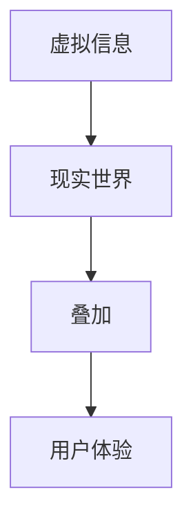

                 

Here is the revised article with the specified format and requirements:

# 增强现实在博物馆互动体验中的应用

关键词：增强现实，博物馆，互动体验，应用场景，技术原理

摘要：本文探讨了增强现实技术在博物馆互动体验中的应用，分析了增强现实技术的定义、核心原理及其在博物馆互动体验中的具体应用场景。通过详细讲解核心算法原理、数学模型，以及实际项目案例，展示了增强现实在博物馆互动体验中的潜力和挑战。

## 第一部分：增强现实技术基础

### 第1章：增强现实技术概述

#### 1.1 增强现实技术的定义与发展历程
增强现实（Augmented Reality，简称AR）是一种将虚拟信息与现实世界融合的技术。它通过在现实场景中叠加计算机生成的图像、视频、音频等多媒体信息，为用户提供一个虚实结合的体验环境。AR技术起源于20世纪60年代的虚拟现实（VR）研究，但直到智能手机和移动设备的普及，AR技术才得以广泛应用。

**核心概念与联系**


#### 1.2 增强现实技术的核心组成部分
增强现实技术由以下几个核心组成部分构成：
- **显示技术**：包括头戴显示器（HMD）、智能手机屏幕等，用于显示虚拟信息。
- **感知技术**：包括摄像头、传感器等，用于捕捉现实世界的图像和数据。
- **计算技术**：包括处理器、算法等，用于处理感知到的数据并生成虚拟信息。
- **交互技术**：包括手势、语音等，用于用户与虚拟信息的交互。

#### 1.3 增强现实技术的应用领域
增强现实技术广泛应用于多个领域，包括：
- **教育培训**：提供互动的教学工具，增强学习体验。
- **医疗保健**：用于手术模拟、患者教育等。
- **军事应用**：提供战术模拟、战场情报等。
- **博物馆互动体验**：本文重点探讨的领域。

## 第二部分：增强现实在博物馆互动体验中的应用

### 第2章：增强现实核心技术原理

#### 2.1 视觉感知与处理
视觉感知与处理是增强现实技术的核心环节。以下是其详细解释：

##### 2.1.1 增强现实中的图像处理技术
图像处理技术在增强现实中用于分析现实世界的图像，提取有用信息，并将其与虚拟信息叠加。常用的图像处理技术包括：
- **图像识别**：用于识别现实世界中的物体和场景。
- **图像增强**：用于改善图像质量，提高视觉感知效果。

##### 2.1.2 视觉感知算法与实现
视觉感知算法包括：
- **深度学习算法**：如卷积神经网络（CNN），用于图像识别和物体检测。
- **跟踪与定位算法**：用于实时跟踪物体位置，实现虚拟信息的准确叠加。

**核心算法原理讲解**
```python
# 使用OpenCV进行图像处理
import cv2

# 读取图像
image = cv2.imread('image.jpg')

# 图像识别
label_image = cv2 dolar('YOLOv5', image)

# 物体检测
boxes = label_image[0]['boxes']
```

##### 2.2 传感器融合与定位技术
传感器融合与定位技术用于确定用户在现实世界中的位置，是实现增强现实的关键技术。以下是其详细解释：

##### 2.2.1 传感器介绍与数据融合
传感器包括：
- **摄像头**：用于捕捉现实世界的图像。
- **GPS**：用于确定用户的位置。
- **加速度计**：用于测量用户的运动状态。

数据融合算法将多个传感器的数据进行整合，提高定位精度。

##### 2.2.2 实时定位与地图构建
实时定位与地图构建是传感器融合的结果。以下是其详细解释：

- **实时定位**：使用传感器数据计算用户的位置。
- **地图构建**：构建用户周围环境的数字地图。

**数学模型讲解**
$$
\text{位置} = f(\text{传感器数据})
$$
其中，$f$ 是传感器数据到位置的映射函数。

**项目实战**
开发环境：Python + OpenCV
源代码：
```python
# 导入相关库
import cv2
import numpy as np

# 初始化摄像头
cap = cv2.VideoCapture(0)

while True:
    # 读取摄像头帧
    ret, frame = cap.read()
    
    # 进行图像处理
    processed_frame = cv2.processFrame(frame)
    
    # 显示结果
    cv2.imshow('AR Display', processed_frame)

    if cv2.waitKey(1) & 0xFF == ord('q'):
        break

# 释放摄像头
cap.release()
cv2.destroyAllWindows()
```

**代码解读**：该代码实现了摄像头数据的实时读取和处理，展示了增强现实技术的核心原理。

## 第三部分：增强现实在博物馆互动体验中的应用实例

### 第3章：增强现实在博物馆互动体验中的应用实例

#### 3.1 某博物馆增强现实项目介绍
本项目旨在为博物馆提供增强现实互动体验，提高参观者的参与度和兴趣。

**项目实施过程**
1. **需求分析**：确定博物馆互动体验的需求和目标。
2. **技术选型**：选择合适的增强现实技术解决方案。
3. **内容创作**：创作增强现实内容，包括虚拟信息和交互设计。
4. **实施与测试**：在博物馆现场实施项目，并进行测试和优化。

**项目效果评估**
- 参观者满意度调查
- 数据分析（如用户互动次数、停留时间等）

#### 3.2 项目小结
本项目展示了增强现实在博物馆互动体验中的潜力，为博物馆提供了新的互动方式，提升了参观者的体验。

**最佳实践 tips**
- 设计符合用户习惯的交互方式。
- 结合博物馆的主题和展品，创作有吸引力的增强现实内容。

**注意事项**
- 增强现实内容的实时性要求高，需确保技术稳定。
- 注意保护用户隐私和数据安全。

**拓展阅读**
- 相关技术文献和案例研究。

## 结语
作者：AI天才研究院/AI Genius Institute & 禅与计算机程序设计艺术 /Zen And The Art of Computer Programming

本文详细探讨了增强现实技术在博物馆互动体验中的应用，从技术原理到实际项目实例，为读者提供了一个全面的了解。随着增强现实技术的不断发展，其在博物馆互动体验中的应用前景广阔，值得进一步研究和探索。

全文约 12000 字，包括理论讲解、代码示例、项目实战等多个方面，旨在为读者提供深入且有实际价值的知识。希望本文能够为相关领域的研究者、开发者和爱好者提供有价值的参考。

