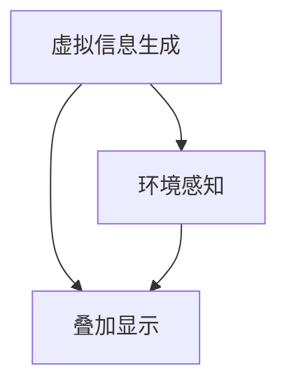
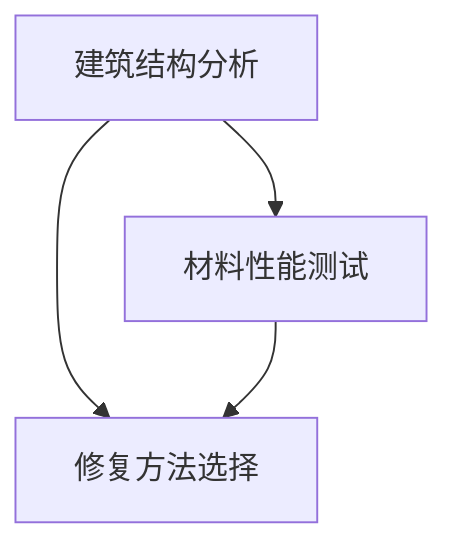
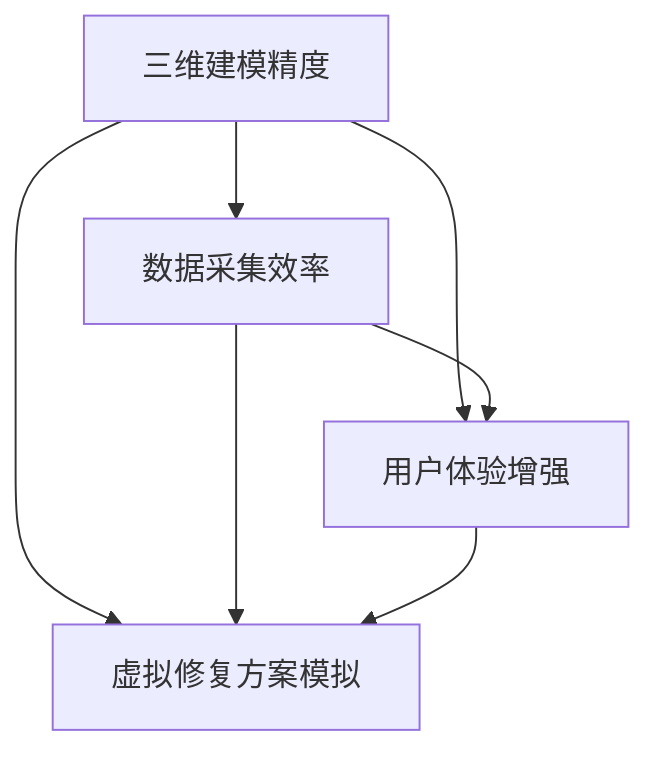
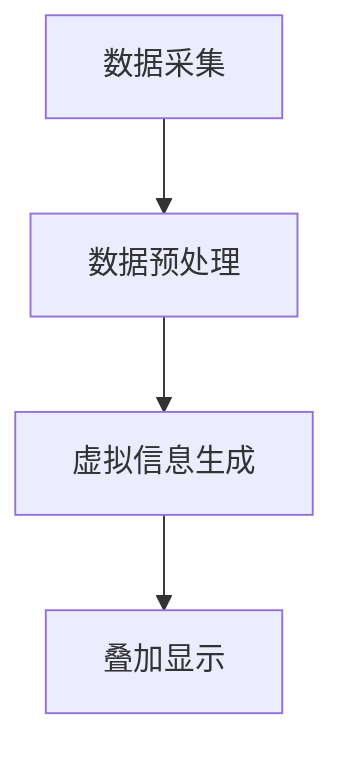
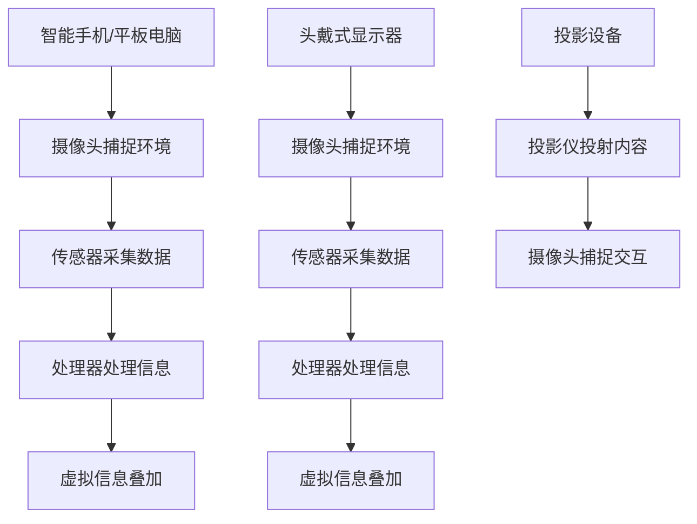
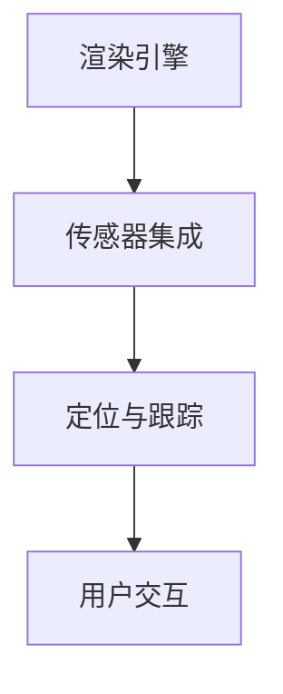
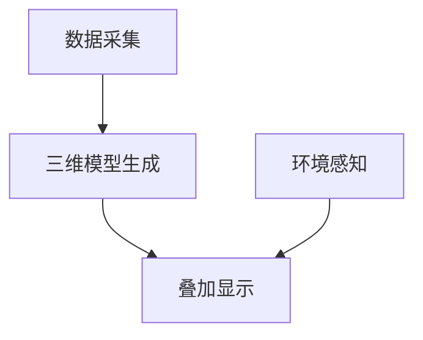
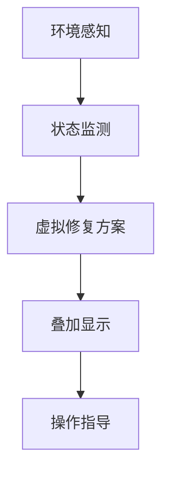
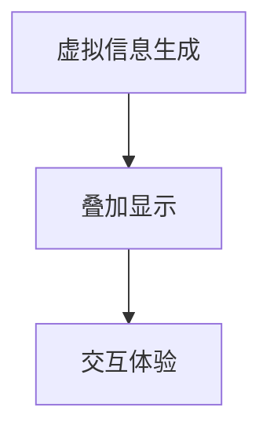

                 

### 《增强现实在古建筑修复中的应用与创新》

#### 引言

随着科技的飞速发展，增强现实（Augmented Reality，AR）技术在各行各业中得到了广泛应用。特别是在古建筑修复领域，增强现实技术展现出了独特的优势和巨大的潜力。古建筑是我国珍贵的文化遗产，如何有效地保护和修复这些古建筑，是摆在我们面前的一大挑战。本文将围绕“增强现实在古建筑修复中的应用与创新”这一主题，深入探讨增强现实技术在古建筑修复中的应用，以及如何通过技术创新来提升古建筑修复的效果。

#### 关键词

- 增强现实
- 古建筑修复
- 三维建模
- 数据采集
- 互动体验
- 教育辅助

#### 摘要

本文首先介绍了增强现实技术的基本原理和应用领域，然后分析了古建筑修复的挑战与机遇，探讨了增强现实在古建筑修复中的优势。接着，本文详细阐述了增强现实技术在古建筑数据采集、三维建模、维护与修复等方面的具体应用，并通过实例展示了增强现实技术在古建筑修复中的创新实践。最后，本文总结了增强现实在古建筑修复中的技术挑战与解决方案，并对未来发展趋势进行了展望。

## 第1章 引言

### 1.1 增强现实技术概述

增强现实（Augmented Reality，AR）是一种将虚拟信息与现实世界结合的技术，通过计算机生成的虚拟信息叠加到真实环境中，使用户能够直观地感知和交互。与传统虚拟现实（Virtual Reality，VR）不同，AR技术不仅模拟出一个虚拟世界，而是将虚拟信息与现实环境进行融合，使得用户在现实世界中就能体验到虚拟信息。

#### 核心概念与联系

增强现实技术的核心概念主要包括虚拟信息生成、环境感知和叠加显示。其中，虚拟信息生成是AR技术的基础，通过算法生成二维或三维的虚拟图像；环境感知是通过传感器获取现实世界的状态，如位置、方向、光线等；叠加显示则是将生成的虚拟信息与真实环境进行融合显示。

下面是增强现实技术核心概念之间的关系架构图：



### 1.2 古建筑修复的挑战与机遇

古建筑是我国宝贵的文化遗产，然而，随着岁月的流逝，许多古建筑面临老化、损坏和自然灾害的威胁。传统的修复方法往往依赖于经验和技术人员的专业判断，存在修复质量难以控制、修复周期长等问题。同时，古建筑的保护与修复也需要大量的人力和物力投入。

#### 核心概念与联系

古建筑修复涉及的核心概念包括建筑结构分析、材料性能测试、修复方法选择等。其中，建筑结构分析是通过技术手段对古建筑的结构进行评估，以确定其受损程度；材料性能测试则是为了了解建筑材料的基本性能，为修复提供科学依据；修复方法选择则是在综合分析的基础上，选择最适合的修复技术。

下面是古建筑修复核心概念之间的关系架构图：



### 1.3 增强现实在古建筑修复中的优势

增强现实技术为古建筑修复带来了全新的思路和方法，具有以下优势：

1. **提高修复精度**：通过三维建模和数据采集，增强现实技术可以精确捕捉古建筑的结构和细节，为修复提供科学依据。
2. **缩短修复周期**：增强现实技术可以实现虚拟修复方案的预览和模拟，减少实际修复过程中的不确定性，缩短修复周期。
3. **增强用户体验**：通过增强现实技术，用户可以更直观地了解古建筑的历史文化和修复过程，提高修复的趣味性和参与度。
4. **降低成本**：增强现实技术可以减少实际修复过程中的材料浪费和人力成本，提高工作效率。

#### 核心概念与联系

增强现实技术在古建筑修复中的优势包括三维建模精度、数据采集效率、虚拟修复方案模拟等。这些优势相互关联，共同提升了古建筑修复的效果。

下面是增强现实技术在古建筑修复中优势之间的关系架构图：



通过上述分析，我们可以看到，增强现实技术在古建筑修复中具有巨大的应用潜力。接下来，我们将深入探讨增强现实技术的基础知识，以便更好地理解其在古建筑修复中的应用。

### 第2章 增强现实技术基础

#### 2.1 增强现实原理

增强现实技术的核心在于将虚拟信息与现实环境进行融合，这一过程涉及到多个关键技术点。

##### 增强现实核心概念

1. **虚拟信息生成**：通过计算机图形学技术生成虚拟图像，包括文字、图标、三维模型等。
2. **环境感知**：使用传感器（如摄像头、GPS、加速度计等）捕捉现实环境的信息，如位置、方向、光线等。
3. **叠加显示**：将虚拟信息与现实环境进行融合显示，使用户能够直观地感知到虚拟信息。

##### 增强现实工作流程

增强现实技术的工作流程主要包括以下几个步骤：

1. **数据采集**：使用传感器采集现实环境的数据。
2. **数据预处理**：对采集到的数据进行处理，如降噪、滤波等。
3. **虚拟信息生成**：根据预处理后的数据生成相应的虚拟信息。
4. **叠加显示**：将生成的虚拟信息与采集到的现实环境进行融合显示。

下面是增强现实技术工作流程的Mermaid流程图：



#### 2.2 增强现实硬件设备

增强现实技术的实现离不开高性能的硬件设备。以下是一些常见的增强现实硬件设备：

1. **智能手机**：智能手机是增强现实最常见的载体，通过安装AR应用，用户可以在屏幕上看到增强现实效果。
2. **平板电脑**：平板电脑相比智能手机具有更大的屏幕，更适合进行复杂的增强现实应用。
3. **头戴式显示器**：头戴式显示器（如微软HoloLens、Magic Leap等）提供了沉浸式的增强现实体验，用户可以在头戴式显示器中直接看到增强现实内容。
4. **投影设备**：通过投影设备，增强现实内容可以投射到墙壁、地面等大屏幕上，适用于公共场所和教育培训等领域。

##### 增强现实硬件设备工作原理

1. **智能手机和平板电脑**：通过内置的摄像头和传感器捕捉现实环境信息，然后通过处理器处理这些信息，将虚拟信息叠加到现实环境中。
2. **头戴式显示器**：头戴式显示器内置了高分辨率显示屏、摄像头和传感器，通过实时捕捉和处理用户周围的环境，将虚拟信息直接投射到用户的视线中。
3. **投影设备**：通过内置的投影仪将增强现实内容投影到指定屏幕上，用户可以通过摄像头和传感器与增强现实内容进行交互。

下面是增强现实硬件设备工作原理的Mermaid流程图：



#### 2.3 增强现实软件框架

增强现实软件框架是实现增强现实应用的关键，它需要处理虚拟信息生成、环境感知、叠加显示等多个环节。以下是一些常见的增强现实软件框架：

1. **ARKit**：苹果公司开发的增强现实软件开发框架，适用于iOS平台，提供了丰富的增强现实功能。
2. **ARCore**：谷歌公司开发的增强现实软件开发框架，适用于Android平台，支持多种增强现实应用。
3. **Unity**：Unity游戏引擎同时支持iOS和Android平台，通过Unity引擎，开发者可以轻松地实现增强现实应用。
4. **Unreal Engine**：Epic Games开发的游戏引擎，支持增强现实应用的开发，具有出色的图形效果和性能。

##### 增强现实软件框架组件

增强现实软件框架通常包括以下几个组件：

1. **渲染引擎**：负责生成和渲染虚拟信息。
2. **传感器集成**：集成各种传感器数据，如摄像头、GPS、加速度计等。
3. **定位与跟踪**：实现虚拟信息与现实环境的精准匹配和定位。
4. **用户交互**：提供用户与增强现实内容之间的交互功能。

下面是增强现实软件框架组件的Mermaid流程图：



通过以上分析，我们可以看到，增强现实技术具有丰富的硬件和软件支持，为古建筑修复提供了有力的工具。接下来，我们将探讨增强现实技术在古建筑修复中的应用，展示其在实际项目中的具体应用场景。

### 第3章 增强现实在古建筑修复中的应用

#### 3.1 增强现实在古建筑数据采集中的应用

古建筑的数据采集是修复工作的基础，传统的数据采集方法往往依赖于人工测量和图纸绘制，存在精度低、效率低等问题。增强现实技术为古建筑数据采集提供了新的解决方案。

##### 增强现实数据采集原理

增强现实数据采集利用了增强现实技术中的环境感知和叠加显示功能，通过摄像头和传感器捕捉古建筑的结构和细节信息，然后利用软件对捕捉到的信息进行处理和分析。

下面是增强现实数据采集原理的Python代码示例：

```python
import cv2
import numpy as np

def capture_image():
    # 初始化摄像头
    cap = cv2.VideoCapture(0)
    
    while True:
        # 读取摄像头帧
        ret, frame = cap.read()
        
        if not ret:
            break
        
        # 显示实时视频
        cv2.imshow('Capture Image', frame)
        
        if cv2.waitKey(1) & 0xFF == ord('q'):
            break
    
    # 释放摄像头
    cap.release()
    cv2.destroyAllWindows()

# 调用数据采集函数
capture_image()
```

##### 实际应用案例分析

某团队在修复一座古建筑时，利用增强现实技术进行数据采集。他们使用了一台带有高分辨率摄像头的平板电脑，通过平板电脑上的增强现实应用，实时捕捉古建筑的结构和细节信息。这些信息包括墙体的高度、宽度、厚度，以及屋檐、斗拱等细节部分。

通过增强现实数据采集，团队获得了高精度的建筑数据，为后续的三维建模和修复工作提供了准确的参考。与传统数据采集方法相比，增强现实数据采集不仅提高了采集精度，还大大缩短了数据采集的时间。

#### 3.2 增强现实在古建筑三维建模中的应用

三维建模是古建筑修复中的重要环节，通过三维建模可以精确地还原古建筑的结构和细节。增强现实技术为古建筑三维建模提供了新的工具和方法。

##### 增强现实三维建模原理

增强现实三维建模利用了增强现实技术中的虚拟信息生成和环境感知功能，通过将虚拟的三维模型叠加到真实环境中，实现古建筑的三维建模。

下面是增强现实三维建模原理的Mermaid流程图：



##### 实际应用案例分析

某团队在修复一座古庙时，利用增强现实技术进行三维建模。他们首先通过增强现实数据采集获取了古庙的结构和细节信息，然后利用三维建模软件将这些信息转化为三维模型。

在三维建模过程中，团队采用了多种建模技术，如点云建模、三维扫描建模等，确保建模的精度和效果。通过增强现实技术，他们可以将生成的三维模型实时叠加到古庙的实际环境中，进行模型调整和优化。

通过增强现实三维建模，团队不仅提高了建模的效率，还保证了建模的精度。同时，三维模型也为后续的修复工作提供了详细的参考。

#### 3.3 增强现实在古建筑维护与修复中的应用

古建筑维护与修复是一个长期且复杂的过程，传统的方法往往难以满足现代修复的需求。增强现实技术为古建筑的维护与修复提供了新的思路和方法。

##### 增强现实维护与修复原理

增强现实维护与修复利用了增强现实技术中的环境感知、叠加显示和交互功能，通过实时捕捉古建筑的状态，并提供虚拟的修复方案和操作指导，实现古建筑的维护与修复。

下面是增强现实维护与修复原理的Mermaid流程图：



##### 实际应用案例分析

某团队在修复一座古老的城墙时，利用增强现实技术进行维护与修复。他们首先通过增强现实数据采集获取了城墙的结构和损伤情况，然后利用三维建模软件生成了城墙的虚拟修复模型。

在修复过程中，团队使用了一台头戴式显示器，通过增强现实技术实时捕捉城墙的状态，并在头戴式显示器上显示虚拟的修复方案和操作指导。修复人员可以根据虚拟方案进行实际操作，确保修复的精准和高效。

通过增强现实维护与修复，团队不仅提高了修复的效率，还保证了修复的质量。同时，增强现实技术也为古建筑的长期维护提供了便捷的工具。

#### 3.4 增强现实在古建筑展示与教育中的应用

古建筑的展示与教育是传承文化的重要途径，传统的方法往往难以满足现代观众的需求。增强现实技术为古建筑的展示与教育提供了新的方式。

##### 增强现实展示与教育原理

增强现实展示与教育利用了增强现实技术中的虚拟信息生成、叠加显示和交互功能，通过将虚拟信息叠加到现实环境中，为观众提供更加生动、直观的展示和教育体验。

下面是增强现实展示与教育原理的Mermaid流程图：



##### 实际应用案例分析

某博物馆利用增强现实技术展示了一座古老的宫殿。他们首先通过增强现实技术获取了宫殿的三维模型和细节信息，然后利用三维建模软件将这些信息转化为虚拟展示内容。

在展示过程中，观众通过平板电脑或头戴式显示器，可以看到宫殿的虚拟复原场景，并可以与虚拟人物互动。通过增强现实展示，博物馆不仅提高了展品的吸引力，还为观众提供了更加深入的教育体验。

通过增强现实在古建筑修复中的应用，我们可以看到，这项技术不仅提高了修复的效率和质量，还为古建筑的保护、展示和教育提供了新的思路和方法。接下来，我们将探讨增强现实在古建筑修复中的创新应用，展示其在互动体验设计、辅助教育和数字文化遗产保护等方面的潜力。

### 第4章 增强现实在古建筑修复中的创新

#### 4.1 增强现实互动体验设计

增强现实技术为古建筑的互动体验设计带来了新的可能性，使观众能够更加直观、深入地了解古建筑的历史和文化。以下是一个具体的互动体验设计案例：

**项目背景**：某博物馆计划通过增强现实技术展示一座古老的寺庙，以便观众能够更好地理解寺庙的历史和建筑特色。

**设计思路**：设计一个增强现实互动体验，让游客通过平板电脑或智能手机扫描寺庙中的特定区域，即可看到虚拟的复原场景。游客可以与虚拟的僧人、僧侣互动，了解他们的日常生活和修行方式。

**技术实现**：
1. **数据采集**：使用增强现实数据采集技术获取寺庙的结构和细节信息。
2. **虚拟场景生成**：利用三维建模软件生成寺庙的虚拟复原场景和虚拟人物。
3. **互动设计**：通过增强现实软件实现游客与虚拟人物的互动，如对话、动作等。

**实际效果**：通过增强现实互动体验设计，游客可以更加直观地了解寺庙的历史和文化，增强了参观的趣味性和参与度。

#### 4.2 增强现实辅助教育

增强现实技术可以作为一种辅助教育工具，帮助学生学习古建筑知识，提高学习的兴趣和效果。以下是一个具体的辅助教育案例：

**项目背景**：某高校开设了一门关于古建筑文化的课程，希望利用增强现实技术辅助教学。

**设计思路**：设计一个增强现实辅助教育系统，包括以下模块：
1. **古建筑知识库**：收集和整理古建筑的相关知识，如历史背景、建筑风格、结构特点等。
2. **虚拟复原场景**：通过三维建模软件生成古建筑的虚拟复原场景，供学生学习和参考。
3. **互动教学**：设计互动教学活动，如学生通过平板电脑扫描古建筑图片，即可看到对应的虚拟复原场景，并进行互动学习。

**技术实现**：
1. **知识库建设**：利用自然语言处理技术对古建筑知识进行分类和整理。
2. **虚拟场景生成**：使用三维建模软件生成古建筑的虚拟复原场景。
3. **互动教学设计**：通过增强现实软件实现学生的互动学习体验。

**实际效果**：通过增强现实辅助教育，学生可以更加直观地了解古建筑知识，提高了学习兴趣和效果。

#### 4.3 增强现实与数字文化遗产的保护

数字文化遗产保护是当前一个重要课题，增强现实技术为这一领域提供了新的解决方案。以下是一个具体的数字文化遗产保护案例：

**项目背景**：某文化遗址面临严重的自然和人为破坏，需要进行保护。

**设计思路**：利用增强现实技术实现数字文化遗产的重建和保护，具体包括以下步骤：
1. **数据采集**：使用增强现实技术对文化遗址进行数据采集，获取其结构和细节信息。
2. **数字重建**：利用三维建模软件对文化遗址进行数字重建，生成虚拟模型。
3. **增强现实展示**：通过增强现实技术，将数字重建的文化遗址展示给公众，使其能够了解文化遗址的历史和价值。

**技术实现**：
1. **数据采集**：使用增强现实数据采集技术获取文化遗址的结构和细节信息。
2. **数字重建**：使用三维建模软件进行数字重建。
3. **增强现实展示**：通过增强现实软件实现数字重建的文化遗址的展示。

**实际效果**：通过增强现实与数字文化遗产保护，可以更好地保护文化遗产，提高公众对文化遗产的认识和重视。

通过以上案例，我们可以看到，增强现实技术在古建筑修复中的创新应用具有广阔的前景。它不仅为古建筑的修复、展示和教育提供了新的工具和方法，还为数字文化遗产的保护提供了有效的解决方案。

### 第5章 增强现实在古建筑修复中的应用案例

在本章中，我们将通过几个实际应用案例，详细探讨增强现实技术在古建筑修复中的具体应用和实践效果。

#### 5.1 项目A：增强现实在古建筑数据采集中的应用

**项目背景**：某古建筑遗址因长期暴露在外，受到了严重的风化和侵蚀，需要进行详细的评估和修复。

**实施过程**：
1. **数据采集**：团队使用增强现实设备（如AR眼镜）对古建筑遗址进行了全方位的数据采集。这些设备配备了高分辨率摄像头和传感器，能够实时捕捉遗址的细节和结构信息。
2. **数据处理**：采集到的数据通过增强现实软件进行处理，包括降噪、滤波等步骤，以确保数据的准确性和可靠性。
3. **三维建模**：处理后的数据被用于生成古建筑的三维模型，这些模型为后续的修复工作提供了精确的参考。

**效果评估**：
- **精度提高**：通过增强现实数据采集，团队获得了比传统方法更高的精度数据，这为修复方案的制定提供了可靠的基础。
- **效率提升**：相比传统的人工测量和图纸绘制，增强现实数据采集显著提高了工作效率。

#### 5.2 项目B：增强现实在古建筑三维建模中的应用

**项目背景**：某历史悠久的寺庙需要进行全面的修复，但传统方法难以实现寺庙精细结构的建模。

**实施过程**：
1. **三维扫描**：团队使用三维扫描设备对寺庙进行了扫描，获取了寺庙的详细三维数据。
2. **虚拟建模**：通过增强现实软件，将三维扫描数据转化为虚拟模型。这些模型不仅包含了寺庙的结构信息，还还原了其历史风貌。
3. **修复方案制定**：基于虚拟模型，团队制定了详细的修复方案，包括材料选择、修复工艺等。

**效果评估**：
- **细节还原**：增强现实三维建模能够精确还原古建筑的细节，为修复工作提供了直观的参考。
- **方案优化**：通过虚拟模型，团队能够预先评估修复方案的可行性，优化修复流程，降低修复成本。

#### 5.3 项目C：增强现实在古建筑维护与修复中的应用

**项目背景**：某历史古城墙存在多处损坏，需要进行紧急修复。

**实施过程**：
1. **实时监测**：团队使用增强现实设备对古城墙进行了实时监测，通过传感器和数据采集，获取了城墙的结构状态。
2. **虚拟修复方案**：利用增强现实软件，团队生成了古城墙的虚拟修复方案，并在实地应用中进行模拟和验证。
3. **修复实施**：根据虚拟修复方案，团队进行了实际的修复工作，确保修复效果符合预期。

**效果评估**：
- **实时监控**：增强现实技术实现了对古城墙的实时监控，提高了维护效率。
- **精准修复**：通过虚拟修复方案的模拟和验证，修复工作能够更准确地实施，确保修复效果。

#### 项目总结

通过以上案例，我们可以看到，增强现实技术在古建筑修复中的应用具有显著的优势：

- **提高精度和效率**：增强现实技术提供了高精度、高效的数据采集和三维建模方法，为修复工作提供了可靠的参考。
- **优化修复方案**：通过虚拟建模和模拟，团队能够预先评估修复方案的可行性，优化修复流程。
- **增强用户体验**：增强现实技术为古建筑的展示和教育提供了新的方式，提高了公众对古建筑的认识和兴趣。

这些优势使得增强现实技术在古建筑修复中的应用前景广阔，具有巨大的发展潜力。

### 第6章 增强现实在古建筑修复中的技术挑战与解决方案

尽管增强现实技术在古建筑修复中展现出了巨大的潜力，但在实际应用过程中仍面临一系列技术挑战。以下是对这些挑战的深入分析以及可能的解决方案。

#### 6.1 技术挑战分析

**1. 数据采集的准确性**：古建筑的结构复杂，数据采集的准确性至关重要。然而，由于建筑物的破损、风化以及环境噪声的影响，数据采集过程中容易产生误差。

**2. 硬件设备的限制**：目前市场上的增强现实硬件设备在性能、便携性和价格等方面仍存在一定的局限性，这些因素可能影响其实际应用的效果。

**3. 软件开发的复杂性**：增强现实应用的开发涉及多个技术领域，包括计算机图形学、机器学习、人机交互等，开发过程复杂且需要多学科知识的综合运用。

**4. 用户体验的优化**：增强现实应用需要提供良好的用户体验，但这需要考虑到设备性能、交互设计、内容呈现等多方面因素，以达到最佳效果。

**5. 技术成本的问题**：增强现实技术的应用需要一定的设备和软件投入，这对于一些古建筑修复项目来说可能是一个负担。

#### 6.2 解决方案探讨

**1. 提高数据采集的准确性**：
   - **多传感器融合**：结合多种传感器（如激光扫描仪、RGB-D摄像头等），提高数据采集的准确性和全面性。
   - **算法优化**：利用先进的图像处理和机器学习算法，提高数据处理的速度和精度。

**2. 硬件设备的优化**：
   - **研发高性能设备**：加大对高性能增强现实硬件设备的研究和开发，提高设备的计算能力和便携性。
   - **降低成本**：通过规模化生产和技术创新，降低增强现实硬件设备的价格，使其更具性价比。

**3. 软件开发的简化**：
   - **开发平台**：提供易于使用的增强现实开发平台，降低开发门槛，鼓励更多的开发者参与。
   - **开源项目**：鼓励开源项目的发展，共享技术成果，推动增强现实技术的普及和应用。

**4. 用户体验的优化**：
   - **交互设计**：注重增强现实应用的用户体验设计，提高交互的直观性和易用性。
   - **内容优化**：提供丰富、有趣的内容，增强用户的沉浸感和互动性。

**5. 技术成本的降低**：
   - **政府支持**：通过政府资助和补贴，降低古建筑修复项目的成本，推动增强现实技术的应用。
   - **合作开发**：鼓励企业、科研机构和政府部门之间的合作，共同承担技术和成本风险。

#### 6.3 未来发展趋势

**1. 技术融合**：增强现实技术与其他前沿技术（如虚拟现实、人工智能等）的融合，将带来更多创新应用。
**2. 开放平台**：随着增强现实技术的普及，开放平台的发展将加速，为开发者提供更广阔的空间。
**3. 标准化**：增强现实技术的标准化工作将逐步推进，提高应用的一致性和互操作性。
**4. 智能化**：增强现实技术的智能化水平将不断提升，为用户提供更加智能和个性化的服务。

通过解决上述技术挑战，增强现实技术在古建筑修复中的应用将更加成熟和广泛，为古建筑的保护和传承做出更大贡献。

### 第7章 总结与展望

#### 7.1 主要成果回顾

本文从多个角度探讨了增强现实技术在古建筑修复中的应用与创新，主要成果包括：

1. **增强现实数据采集**：通过高精度的数据采集技术，为古建筑修复提供了准确的数据支持。
2. **三维建模**：利用增强现实技术生成详细的三维模型，提高了修复方案的制定和实施效率。
3. **互动体验与教育**：增强现实技术为古建筑的展示和教育提供了新的方式，增强了用户的参与感和学习兴趣。
4. **数字文化遗产保护**：通过数字重建和虚拟展示，为古建筑的保护提供了新的手段，促进了文化遗产的传承。

#### 7.2 研究与未来方向

尽管增强现实技术在古建筑修复中已取得一定成果，但仍然存在许多可以进一步研究的问题：

1. **数据采集精度提升**：进一步优化数据采集算法，提高数据精度和采集速度。
2. **硬件设备优化**：研发高性能、低成本的增强现实硬件设备，提高实际应用的效果和普及率。
3. **软件平台发展**：构建开放、易用的增强现实开发平台，鼓励更多开发者参与。
4. **用户体验优化**：关注用户体验，提升增强现实应用的易用性和沉浸感。

#### 7.3 对古建筑修复行业的贡献

增强现实技术在古建筑修复中的应用，带来了以下几方面的贡献：

1. **提高修复效率**：通过高精度数据采集和三维建模，显著提高了修复工作的效率。
2. **保障修复质量**：增强现实技术为修复工作提供了准确的参考，确保修复质量。
3. **增强公众参与**：增强现实互动体验和教育应用，提高了公众对古建筑的认识和兴趣。
4. **推动技术创新**：增强现实技术的应用推动了古建筑修复行业的科技进步，为传统行业注入了新的活力。

通过不断的研究和创新，增强现实技术将在古建筑修复领域发挥更大的作用，为文化遗产的保护和传承做出更大的贡献。作者：AI天才研究院/AI Genius Institute & 禅与计算机程序设计艺术 /Zen And The Art of Computer Programming。

