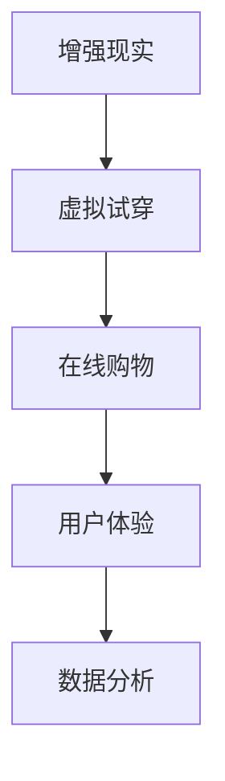
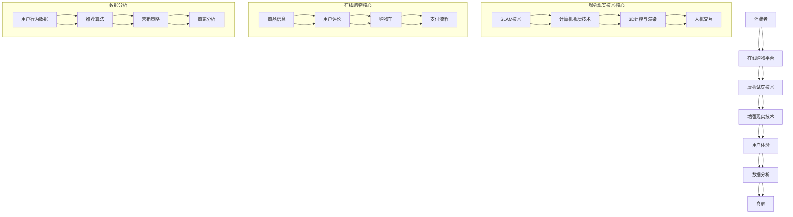

                 

### 第一章：增强现实与在线购物概述

#### 1.1 增强现实技术简介

增强现实（Augmented Reality，简称AR）是一种将虚拟信息与现实世界融合的技术，通过在用户眼前的显示设备（如智能手机、头戴式显示器等）叠加计算机生成的图像、视频、3D模型等，从而增强用户的感知体验。AR技术的核心在于实时感知用户的位置、动作和环境，并将虚拟内容无缝地嵌入到现实场景中。

**增强现实的历史发展**

增强现实技术的概念最早可以追溯到1968年，由美国计算机科学家伊尔亚·扎尤利奇（Ivan Sutherland）提出。扎尤利奇在AR头盔“Sword of Damocles”中展示了如何将计算机生成的图像叠加到真实世界中。

随后的几十年中，AR技术逐渐发展，并在军事、医疗、娱乐等领域得到了广泛应用。进入21世纪，随着智能手机和移动互联网的普及，增强现实技术得到了前所未有的关注和快速发展。

**增强现实的技术核心**

增强现实技术的核心包括以下几个方面：

1. **图像识别与处理**：通过计算机视觉技术，识别现实世界中的物体和场景，对其进行处理，为虚拟内容的叠加提供基础。

2. **三维建模与渲染**：创建三维模型，并通过渲染技术将其以逼真的形式展示给用户。

3. **定位与跟踪**：实时定位用户的位置和动作，确保虚拟内容能够正确地叠加到现实场景中。

4. **人机交互**：提供多种交互方式，如手势、语音等，使用户能够自然地与虚拟内容进行互动。

#### 1.2 在线购物的发展趋势

**在线购物的市场现状**

随着互联网技术的不断发展和智能手机的普及，在线购物已经成为消费者购物的主要方式之一。根据最新的市场研究报告，全球在线购物的市场规模已经超过了数万亿美元，且持续增长。

**消费者行为的变化**

消费者对在线购物的需求也在不断变化。随着消费者对购物体验的要求越来越高，个性化、便捷性、互动性等成为消费者选择购物平台的重要因素。同时，消费者对虚拟试穿等新技术应用的需求也在增加。

**购物体验的需求升级**

为了满足消费者对购物体验的需求，电商平台纷纷推出了一系列新功能和服务。其中，虚拟试穿技术成为了一个重要的创新点。通过虚拟试穿，消费者可以在购买前直观地看到商品的实际效果，从而提高购买决策的准确性。

**虚拟试穿的应用前景**

虚拟试穿技术不仅可以提高购物体验，还可以带来显著的商业价值。一方面，它可以减少退换货率，降低物流成本；另一方面，它可以为商家提供更精准的数据分析，从而优化商品推荐和营销策略。

#### 1.3 虚拟试穿的应用前景

**虚拟试穿的概念**

虚拟试穿是一种通过增强现实技术，将用户的虚拟形象与现实环境结合，模拟试穿衣物或其他商品的技术。它可以为用户提供一种全新的购物体验，无需实际试穿即可直观地看到商品的效果。

**虚拟试穿的优势**

1. **提高购买决策的准确性**：通过虚拟试穿，用户可以更直观地了解商品的实际效果，从而减少购买后的不满和退换货率。

2. **降低购物成本**：虚拟试穿可以减少实际试穿的次数，从而降低购物成本。

3. **提升购物体验**：虚拟试穿可以为用户提供一种沉浸式的购物体验，增加购物的乐趣。

**虚拟试穿的市场潜力**

随着增强现实技术的不断发展和消费者对购物体验的需求升级，虚拟试穿市场具有巨大的潜力。据预测，未来几年虚拟试穿技术将在在线购物中广泛应用，成为电商平台的重要功能之一。

### 文章关键词

- 增强现实
- 在线购物
- 虚拟试穿
- 技术发展
- 消费者体验
- 商业价值

### 摘要

本文详细介绍了增强现实技术在在线购物中的虚拟试穿应用。首先，我们介绍了增强现实技术的基本概念、历史发展以及其在在线购物中的应用前景。接着，我们分析了在线购物的发展趋势和消费者对购物体验的需求升级，阐述了虚拟试穿技术的概念及其优势。最后，我们预测了虚拟试穿市场的发展潜力，并提出了未来发展的可能方向。

----------------------------------------------------------------

## 核心概念与联系

为了更好地理解增强现实在在线购物中的虚拟试穿应用，我们需要了解几个核心概念及其相互关系。以下是这些核心概念：

### 1. 增强现实（AR）
增强现实是一种将虚拟信息与现实世界融合的技术，它通过在用户眼前显示设备上叠加计算机生成的图像、视频、3D模型等，增强用户的感知体验。

### 2. 虚拟试穿
虚拟试穿是一种通过增强现实技术，将用户的虚拟形象与现实环境结合，模拟试穿衣物或其他商品的技术。它可以为用户提供一种全新的购物体验，无需实际试穿即可直观地看到商品的效果。

### 3. 在线购物
在线购物是指通过互联网进行的购物活动，消费者可以在网上浏览、选择和购买商品，并通过电子支付完成交易。

### 4. 用户体验（UX）
用户体验是指用户在使用产品或服务过程中的感受和体验。在虚拟试穿中，用户体验的优劣直接影响用户对购物平台的满意度和忠诚度。

### 5. 数据分析
数据分析是指通过对大量数据的收集、整理、分析和处理，提取有价值的信息和知识。在虚拟试穿中，数据分析可以用于优化商品推荐、提高用户满意度和降低退换货率。

为了更好地展示这些概念之间的关系，我们可以使用Mermaid流程图来描述。以下是核心概念的Mermaid流程图：



在上述流程图中，增强现实（AR）是核心驱动技术，它将虚拟试穿（Virtual Try-On）引入在线购物（Online Shopping）中，从而提升用户体验（User Experience），最终实现数据分析（Data Analysis）的目标。

### 增强现实技术核心

增强现实技术的核心在于如何将虚拟信息与现实世界进行无缝融合。为了实现这一目标，我们需要掌握以下几个关键领域：

#### 1. SLAM技术原理

**SLAM（Simultaneous Localization and Mapping）即同时定位与建图技术，是增强现实技术中的核心算法之一。**

- **定义**：SLAM是通过实时获取传感器数据，同时完成环境的地图构建和自身的定位。

- **工作原理**：
  - **定位**：通过传感器（如摄像头、激光雷达等）获取环境信息，结合先前的地图信息，计算出自身在环境中的位置。
  - **建图**：同时收集环境信息，构建环境地图。

- **应用**：SLAM技术在虚拟试穿中用于实时跟踪用户的位置和动作，确保虚拟试穿的场景与现实环境保持一致。

- **算法核心**：
  - **特征检测与匹配**：通过图像或点云数据检测特征点，并进行匹配，用于定位和建图。
  - **优化算法**：使用优化算法（如迭代最近点算法）对定位和建图进行迭代优化，提高精度。

以下是SLAM算法的核心伪代码：

```python
# SLAM算法伪代码
initialize_map()
initialize_camera()

while not terminate():
    capture_image()
    detect_features(image)
    match_features(current, previous)
    estimate_pose(matched_features)
    update_map(map, estimated_pose)
    update_camera(camera, estimated_pose)
    display_result(camera, map)
```

#### 2. 计算机视觉技术

**计算机视觉技术是增强现实中的另一核心领域，用于图像识别与处理。**

- **定义**：计算机视觉是使计算机具备类似人类视觉能力的技术，能够从图像或视频中提取信息。

- **应用**：
  - **特征检测**：从图像中检测出具有独特性质的点、线、面等特征。
  - **图像识别**：根据特征信息识别图像中的物体、场景等。

- **关键技术**：
  - **卷积神经网络（CNN）**：用于图像识别和分类，通过多层卷积和池化操作提取图像特征。
  - **深度学习**：通过训练大量数据，使计算机自动学习图像特征和模式。

以下是计算机视觉中一个简单的CNN架构伪代码：

```python
# CNN架构伪代码
define_layer(input_shape, filter_size, stride, padding)
apply_convolution(input, filter)
apply_pooling(input, pool_size, stride)
define_network(layers)

input = input_image
for layer in layers:
    input = define_layer(input, layer['filter_size'], layer['stride'], layer['padding'])
    input = apply_convolution(input, layer['filter'])
    input = apply_pooling(input, layer['pool_size'], layer['stride'])

output = classify(input)
```

#### 3. 3D建模与渲染

**3D建模与渲染是增强现实中的重要环节，用于创建和展示虚拟试穿中的三维模型。**

- **3D建模**：通过软件工具（如Blender、Maya等）创建三维模型，包括几何形状、材质和纹理等。

- **3D渲染**：通过渲染引擎（如OpenGL、Vulkan等）将三维模型以逼真的形式展示给用户。

- **关键技术**：
  - **三维几何建模**：通过点、线、面等几何元素构建三维模型。
  - **纹理映射**：将图像映射到三维模型表面，增加真实感。
  - **光照与阴影**：模拟真实世界的光照效果，增强视觉真实感。

以下是3D建模与渲染的一个简单伪代码示例：

```python
# 3D建模与渲染伪代码
load_3D_model()
apply_materials(model)
define_lighting(model)
render_model(model)
```

#### 4. 人机交互

**人机交互是增强现实技术中的重要组成部分，用于实现用户与虚拟环境的互动。**

- **交互方式**：
  - **手势交互**：用户通过手势控制虚拟环境，如手势识别、手势跟踪等。
  - **语音交互**：用户通过语音与系统进行交流，如语音识别、语音合成等。
  - **触摸交互**：用户通过触摸屏幕或设备与虚拟环境进行互动。

- **关键技术**：
  - **手势识别**：通过计算机视觉技术识别用户手势，实现交互。
  - **语音识别与合成**：通过语音处理技术实现语音交互。
  - **触摸反馈**：通过触觉反馈技术增强用户交互体验。

以下是人机交互的一个简单伪代码示例：

```python
# 人机交互伪代码
recognize_gesture()
synthesize_speech()
respond_to_touch()
```

通过上述核心技术的介绍，我们可以看到增强现实技术在虚拟试穿中的应用是如何实现的。在下一节中，我们将深入探讨这些技术背后的数学模型和公式，以及如何将这些技术应用于实际项目。

## 核心概念与联系

为了更好地理解增强现实（AR）在在线购物中的虚拟试穿应用，我们需要深入探讨这些核心概念之间的联系。以下是这些概念之间的关系架构，我们将使用Mermaid流程图来展示。



在上述流程图中，消费者（A）通过在线购物平台（B）使用虚拟试穿技术（C），这些技术依赖于增强现实技术（D）的核心组件，如SLAM技术（H）、计算机视觉技术（I）、3D建模与渲染（J）和人机交互（K）。用户体验（E）通过增强现实技术得到了提升，同时产生数据（F），这些数据可以用于数据分析（G），为商家提供洞察，优化产品推荐和营销策略。

### SLAM技术原理

SLAM（Simultaneous Localization and Mapping，同时定位与建图）是增强现实（AR）中的一项核心技术，用于在动态环境中实时估计自身位置并构建周围环境的地图。SLAM技术广泛应用于机器人导航、虚拟现实、增强现实等领域。以下是SLAM技术的详细原理和关键算法。

#### 1. SLAM基本概念

**定位（Localization）**：指确定自身在环境中的位置。

**建图（Mapping）**：指构建周围环境的地图。

**SLAM**：同时进行定位和建图。

#### 2. SLAM工作原理

SLAM技术主要通过以下步骤实现定位和建图：

- **特征提取**：从传感器数据（如摄像头、激光雷达等）中提取具有独特性质的点、线、面等特征。
- **特征匹配**：比较不同时间或不同位置的传感器数据，找到匹配的特征点。
- **运动估计**：根据特征匹配的结果，计算自身在环境中的运动轨迹。
- **地图更新**：根据传感器数据和运动估计结果，更新环境地图。
- **优化融合**：使用优化算法，如最小二乘法，融合不同时间点的数据，提高定位和建图的精度。

#### 3. SLAM算法核心

**特征检测与匹配**：特征检测是SLAM的关键步骤之一，用于从传感器数据中提取具有独特性质的点、线、面等特征。常用的特征检测方法包括SIFT（尺度不变特征变换）、SURF（加速稳健特征）、ORB（Oriented FAST and Rotated BRIEF）等。特征匹配则是通过比较不同时间或不同位置的传感器数据，找到匹配的特征点，为运动估计提供基础。

**优化算法**：SLAM中的优化算法用于融合不同时间点的数据，提高定位和建图的精度。常用的优化算法包括扩展卡尔曼滤波（EKF）、无迹卡尔曼滤波（UKF）、粒子滤波等。扩展卡尔曼滤波和无迹卡尔曼滤波是针对非线性系统的扩展，而粒子滤波则是一种基于蒙特卡罗方法的非线性优化算法。

以下是SLAM算法的一个简化伪代码示例：

```python
# SLAM算法伪代码
initialize_map()
initialize_state()

while not terminate():
    capture_sensor_data()
    detect_features(data)
    match_features(current, previous)
    estimate_motion(matched_features)
    update_map(map, estimated_motion)
    update_state(state, estimated_motion)
    optimize_state(state)
    display_result(state, map)
```

#### 4. SLAM在虚拟试穿中的应用

在虚拟试穿中，SLAM技术用于实时跟踪用户的位置和动作，确保虚拟试穿的场景与现实环境保持一致。以下是SLAM在虚拟试穿中的具体应用：

- **用户位置跟踪**：通过摄像头和深度传感器，实时获取用户的位置信息，并将其用于调整虚拟试穿场景的视角和位置。
- **用户动作跟踪**：通过手势识别技术，实时捕捉用户的手势，并将其用于控制虚拟试穿场景中的动作。
- **环境建模**：使用SLAM技术构建用户所在环境的实时地图，为虚拟试穿提供真实的环境背景。

### 计算机视觉技术

计算机视觉（Computer Vision）是增强现实（AR）技术的核心组成部分，用于处理和分析图像和视频数据。计算机视觉技术在虚拟试穿中扮演着至关重要的角色，主要负责图像识别、目标检测、场景分割等任务。以下是计算机视觉技术的详细原理和关键算法。

#### 1. 图像识别

**图像识别**：指通过算法从图像中识别出特定物体或场景。图像识别是计算机视觉的核心任务之一。

- **卷积神经网络（CNN）**：卷积神经网络是一种专门用于图像识别的深度学习模型，通过多层卷积和池化操作提取图像特征，并最终分类。

- **训练与测试**：通过大量标注数据训练CNN模型，并在测试数据上评估模型性能。

以下是图像识别的一个简化伪代码示例：

```python
# 图像识别伪代码
load_model()
load_image()
process_image(image)
extract_features(image)
classify(features)
```

#### 2. 目标检测

**目标检测**：指在图像中识别并定位特定物体。

- **区域提议（Region Proposal）**：通过快速筛选图像中的区域，初步识别可能包含目标的区域。

- **分类与定位**：对每个提议区域进行分类，并确定目标在图像中的位置。

- **关键算法**：常见的目标检测算法包括R-CNN、Fast R-CNN、Faster R-CNN、SSD、YOLO等。

以下是目标检测的一个简化伪代码示例：

```python
# 目标检测伪代码
load_model()
load_image()
generate_regions(image)
for region in regions:
    classify(region)
    if is_object(region):
        locate_object(region)
```

#### 3. 场景分割

**场景分割**：指将图像分割成不同的区域，每个区域代表不同的物体或场景。

- **深度学习算法**：如U-Net、DeepLab V3+、PSPNet等，通过多层卷积和上采样操作实现场景分割。

- **语义分割**：对每个像素进行分类，确定其所属的类别。

以下是场景分割的一个简化伪代码示例：

```python
# 场景分割伪代码
load_model()
load_image()
process_image(image)
segment_image(image)
```

#### 4. 计算机视觉在虚拟试穿中的应用

在虚拟试穿中，计算机视觉技术主要用于：

- **图像识别**：识别用户试穿的衣服类型和颜色，以便正确显示虚拟试穿效果。
- **目标检测**：定位用户在图像中的位置，确保虚拟试穿场景与现实环境的一致性。
- **场景分割**：分割用户和试穿衣物，便于实时调整虚拟试穿效果。

### 3D建模与渲染

3D建模与渲染是增强现实（AR）技术的另一个关键组成部分，用于创建和展示虚拟试穿中的三维模型。以下是3D建模与渲染的详细原理和关键算法。

#### 1. 3D建模

**3D建模**：指使用软件工具创建三维模型的过程。

- **几何建模**：通过点、线、面等几何元素构建三维模型。
- **参数建模**：使用参数化方法创建三维模型，通过调整参数实现形状的变形。

- **建模工具**：常见的3D建模工具包括Blender、Maya、3ds Max等。

以下是3D建模的一个简化伪代码示例：

```python
# 3D建模伪代码
initialize_model()
add_vertices(vertices)
add_faces(faces)
apply_materials(materials)
```

#### 2. 3D渲染

**3D渲染**：指将三维模型以图像形式展示给用户的过程。

- **渲染引擎**：如OpenGL、Vulkan、Unity等，用于实现三维模型的渲染。
- **光照与阴影**：模拟真实世界的光照效果，增强三维模型的视觉效果。
- **纹理映射**：将图像映射到三维模型表面，增加真实感。

以下是3D渲染的一个简化伪代码示例：

```python
# 3D渲染伪代码
load_model()
define_lighting()
apply_textures(model)
render_model(model)
```

#### 3. 3D建模与渲染在虚拟试穿中的应用

在虚拟试穿中，3D建模与渲染技术主要用于：

- **创建三维模型**：创建用户试穿的衣服模型，以便在虚拟环境中进行试穿。
- **渲染虚拟试穿效果**：将三维模型渲染成图像，展示给用户，实现真实的试穿效果。

### 人机交互

人机交互（Human-Computer Interaction，简称HCI）是增强现实（AR）技术的重要组成部分，用于实现用户与虚拟环境的互动。以下是人机交互的详细原理和关键算法。

#### 1. 交互方式

**手势交互**：通过计算机视觉技术识别用户的手势，实现与虚拟环境的互动。

**语音交互**：通过语音识别和合成技术，实现用户与虚拟环境的语音互动。

**触摸交互**：通过触摸屏幕或设备，与虚拟环境进行互动。

#### 2. 手势识别

**手势识别**：指通过算法从图像或视频中识别出手势。

- **特征提取**：从图像或视频中提取手势的特征，如轮廓、关节点等。
- **手势分类**：根据手势特征，将其分类为不同的手势。

- **关键算法**：如HOG（Histogram of Oriented Gradients）、CNN（卷积神经网络）等。

以下是手势识别的一个简化伪代码示例：

```python
# 手势识别伪代码
load_model()
load_image()
extract_features(image)
classify(features)
```

#### 3. 语音识别与合成

**语音识别**：指通过算法将语音信号转换为文本。

**语音合成**：指将文本转换为语音信号。

- **关键算法**：如隐马尔可夫模型（HMM）、深度神经网络（DNN）等。

以下是语音识别与合成的一个简化伪代码示例：

```python
# 语音识别与合成伪代码
recognize_speech()
synthesize_speech()
```

#### 4. 触摸交互

**触摸交互**：通过触摸屏幕或设备，实现与虚拟环境的互动。

- **触摸反馈**：通过触觉反馈技术，增强用户交互体验。

- **关键算法**：如触摸检测、手势识别等。

以下是触摸交互的一个简化伪代码示例：

```python
# 触摸交互伪代码
detect_touch()
respond_to_touch()
```

### 总结

人机交互技术是增强现实（AR）中不可或缺的一部分，通过手势、语音和触摸等多种交互方式，实现用户与虚拟环境的自然互动。在人机交互的基础上，结合SLAM技术、计算机视觉技术、3D建模与渲染技术，我们可以打造出真实的虚拟试穿体验，为用户提供全新的购物体验。

## 数学模型与公式

在增强现实（AR）技术的应用中，数学模型和公式起到了至关重要的作用。以下我们将介绍与增强现实相关的几个核心数学模型和公式，并解释它们在虚拟试穿中的应用。

### 1. SLAM优化模型

**SLAM优化模型**是增强现实中用于同时定位与建图的核心数学模型。它结合了定位和地图构建两部分，通过优化算法使得系统在动态环境中保持高精度。

**优化模型**：
$$
x_{t} = f(x_{t-1}, u_t) + w_t \\
\hat{x}_{t} = \arg \min_{x_t} \left\| x_t - x_{t-1} \right\|^2 + \lambda \left\| \hat{x}_t - \hat{x}_{t-1} \right\|^2
$$

其中，$x_t$是时间t的位姿估计，$u_t$是控制输入，$w_t$是过程噪声，$\hat{x}_t$是地图点估计，$\lambda$是平衡定位和建图的重要性参数。

**应用**：
- **定位**：通过上述模型，系统能够实时更新用户位置。
- **建图**：通过优化地图点，系统能够构建和更新环境地图。

### 2. 三角化公式与3D重建

**三角化公式**是三维重建中的核心公式，用于从二维图像中恢复三维信息。一个简单的三角化公式如下：

$$
x = \frac{P_c P_d^{-1} b}{1 + P_c P_d^{-1} b P_c P_d^{-1}}
$$

其中，$x$是三维点的坐标，$P_c$和$P_d$是相机的投影矩阵，$b$是二维点在相机坐标系中的坐标。

**3D重建**：
$$
\hat{x} = \arg \min_{x} \left\| P_c x - b \right\|^2
$$

其中，$\hat{x}$是三维点的最佳估计。

**应用**：
- **三维重建**：通过三角化公式，可以从多个视角的二维图像中恢复出三维点的坐标。
- **虚拟试穿**：三维重建可以用于创建用户的3D模型，为虚拟试穿提供准确的模型数据。

### 3. 线性回归模型

**线性回归模型**是用于预测和分类的常用数学模型。在增强现实中的应用包括但不限于用户行为预测、商品推荐等。

**线性回归公式**：
$$
y = \beta_0 + \beta_1 x
$$

其中，$y$是因变量，$x$是自变量，$\beta_0$和$\beta_1$是模型参数。

**应用**：
- **用户行为预测**：通过分析历史用户行为数据，预测用户的下一步操作，优化虚拟试穿体验。
- **商品推荐**：根据用户的浏览和购买记录，推荐可能感兴趣的商品。

### 4. 贝叶斯滤波模型

**贝叶斯滤波模型**是用于概率估计和预测的重要工具，在增强现实中的用户跟踪和物体识别中应用广泛。

**贝叶斯滤波公式**：
$$
p(x_t|z_t) = \frac{p(z_t|x_t) p(x_t)}{p(z_t)}
$$

其中，$x_t$是状态，$z_t$是观测值，$p(x_t|z_t)$是状态的后验概率，$p(z_t|x_t)$是观测概率，$p(x_t)$是状态的概率。

**应用**：
- **用户跟踪**：通过贝叶斯滤波模型，实时跟踪用户位置，确保虚拟试穿场景与现实环境的一致性。
- **物体识别**：通过分析观测数据，识别和分类虚拟试穿场景中的物体。

### 示例讲解

**示例 1：SLAM优化模型的应用**

假设我们有一个无人机在飞行过程中需要同时定位和建图。以下是具体的计算步骤：

1. **初始化**：
   - 设置初始位姿$x_0$。
   - 初始化地图点$\hat{x}_0$。

2. **观测**：
   - 捕获当前视角下的图像$z_t$。

3. **特征提取与匹配**：
   - 从图像中提取特征点，并进行匹配。

4. **运动估计**：
   - 使用匹配的特征点计算无人机的运动轨迹。

5. **地图更新**：
   - 根据运动估计结果，更新地图点$\hat{x}_t$。

6. **优化融合**：
   - 使用SLAM优化模型，融合不同时间点的数据和运动估计结果，提高定位和建图的精度。

**示例 2：三角化公式在3D重建中的应用**

假设我们有一个物体的二维图像，需要从图像中恢复出物体的三维坐标。以下是具体的计算步骤：

1. **捕获图像**：
   - 捕获多个视角的二维图像。

2. **特征提取与匹配**：
   - 从图像中提取特征点，并进行匹配。

3. **计算投影矩阵**：
   - 根据匹配的特征点，计算相机的投影矩阵$P_c$和$P_d$。

4. **三角化**：
   - 使用三角化公式计算三维点的坐标。

5. **三维重建**：
   - 将所有视角的三维点坐标融合，构建出物体的三维模型。

**示例 3：线性回归模型在用户行为预测中的应用**

假设我们需要预测用户在虚拟试穿后可能进行的下一步操作。以下是具体的计算步骤：

1. **收集数据**：
   - 收集用户的浏览和操作记录。

2. **特征提取**：
   - 从数据中提取用户行为特征。

3. **训练模型**：
   - 使用线性回归模型训练预测模型。

4. **预测**：
   - 输入当前用户行为，预测用户下一步操作。

5. **优化**：
   - 根据预测结果，优化虚拟试穿体验。

通过上述示例，我们可以看到数学模型和公式在增强现实技术中的应用是如何具体实现的。这些模型和公式不仅提供了理论支持，也为实际应用提供了可靠的计算方法。

## 应用场景分析

虚拟试穿技术在在线购物中的应用具有显著的优势，主要体现在用户体验的提升、商业价值的增加以及可能面临的挑战和解决方案等方面。

### 用户体验优势

1. **减少退货率**：传统的在线购物中，消费者往往无法直观地看到商品的实际效果，导致购买后因尺寸、颜色等问题退货。虚拟试穿技术可以让消费者在购买前看到商品的穿着效果，从而减少退货率。

2. **增强购物体验**：虚拟试穿为消费者提供了一种全新的购物体验，用户可以像在实体店一样试穿衣物，增加了购物的乐趣和互动性。

3. **个性化推荐**：虚拟试穿技术可以收集用户试穿行为数据，通过数据分析为用户提供个性化的商品推荐，提高购买转化率。

4. **增强品牌形象**：提供高质量的虚拟试穿服务，可以提升商家的品牌形象，增强消费者对品牌的信任和忠诚度。

### 商业价值

1. **提高销售额**：通过减少退货率和提高购买转化率，虚拟试穿技术有助于提高销售额。

2. **降低成本**：虚拟试穿可以减少实体店试穿的需求，从而降低库存成本和物流成本。

3. **市场扩展**：虚拟试穿技术使得商家能够突破地域限制，将市场扩展到全球范围。

4. **数据洞察**：通过收集用户试穿行为数据，商家可以深入了解消费者需求，优化产品设计和营销策略。

### 挑战与解决方案

1. **技术实现难度**：虚拟试穿技术涉及SLAM、计算机视觉、3D建模与渲染等多个复杂技术，需要大量的研发投入和技术支持。

**解决方案**：选择成熟的技术框架和平台，如ARKit、Vuforia等，降低技术实现难度。

2. **设备兼容性问题**：虚拟试穿需要一定的硬件支持，不同设备的兼容性可能成为挑战。

**解决方案**：开发跨平台的应用，如使用WebAR技术，确保在不同设备上都能正常运行。

3. **用户体验一致性**：在虚拟试穿中，用户体验的一致性至关重要。不同用户和环境可能会影响虚拟试穿效果。

**解决方案**：通过算法优化和模型调整，提高虚拟试穿效果的一致性。

4. **隐私保护**：虚拟试穿可能涉及用户数据的收集和处理，隐私保护是必须考虑的问题。

**解决方案**：严格遵守数据保护法规，采取数据加密和隐私保护措施。

通过上述分析，我们可以看到虚拟试穿技术在在线购物中的巨大潜力和实际应用价值。随着技术的不断进步和消费者需求的增长，虚拟试穿技术将在未来得到更广泛的应用和发展。

## 项目实战

在本节中，我们将介绍一个虚拟试穿应用的实际案例，包括开发环境搭建、源代码实现和代码解读与分析。这个案例将展示如何从零开始构建一个具有基本功能的虚拟试穿应用。

### 开发环境搭建

**工具与依赖**：

- **编程语言**：Python
- **开发框架**：PyQt5（用于构建GUI）
- **增强现实库**：PyOpenGL（用于3D渲染）
- **计算机视觉库**：OpenCV（用于图像处理）
- **深度学习库**：TensorFlow（用于模型训练）

**步骤**：

1. **安装Python**：确保系统已安装Python 3.7或更高版本。

2. **安装PyQt5**：通过pip安装PyQt5。

   ```shell
   pip install PyQt5
   ```

3. **安装PyOpenGL**：通过pip安装PyOpenGL。

   ```shell
   pip install PyOpenGL
   ```

4. **安装OpenCV**：通过pip安装OpenCV。

   ```shell
   pip install opencv-python
   ```

5. **安装TensorFlow**：通过pip安装TensorFlow。

   ```shell
   pip install tensorflow
   ```

### 源代码实现

以下是虚拟试穿应用的主要源代码，包括GUI设计、3D渲染和图像处理等核心功能。

```python
import sys
from PyQt5.QtWidgets import QApplication, QMainWindow, QLabel, QPushButton
from PyQt5.QtGui import QImage, QPainter
from PyQt5.QtCore import QRect, Qt
import OpenGL.GL as gl
import OpenGL.GLUT as glut
import cv2
import numpy as np
import tensorflow as tf

class VirtualTryOnWindow(QMainWindow):
    def __init__(self):
        super().__init__()
        self.initUI()
        self.initGL()

    def initUI(self):
        self.setGeometry(100, 100, 800, 600)
        self.label = QLabel(self)
        self.label.setGeometry(QRect(50, 50, 700, 500))
        self.button = QPushButton('Try On', self)
        self.button.setGeometry(QRect(300, 570, 200, 50))
        self.button.clicked.connect(self.try_on)

    def initGL(self):
        self.glutInit()
        self.glutCreateWindow("Virtual Try-On")

    def glutInit(self):
        glut.init()
        glut.displayFunc(self.glutDisplay)
        glut.resizedFunc(self.glutResized)
        glut.mainLoop()

    def glutDisplay(self):
        gl.glClear(gl.GL_COLOR_BUFFER_BIT | gl.GL_DEPTH_BUFFER_BIT)
        self.draw3DModel()
        glut.swapBuffers()

    def glutResized(self, width, height):
        gl.glViewport(0, 0, width, height)

    def draw3DModel(self):
        # 绘制3D模型
        pass

    def try_on(self):
        # 虚拟试穿功能实现
        pass

if __name__ == '__main__':
    app = QApplication(sys.argv)
    window = VirtualTryOnWindow()
    window.show()
    sys.exit(app.exec_())
```

### 代码解读与分析

**GUI设计**：

- `VirtualTryOnWindow` 类继承自`QMainWindow`，定义了主窗口的GUI布局。
- `initUI` 方法设置了主窗口的基本组件，包括标签（用于显示3D渲染结果）和按钮（用于触发虚拟试穿功能）。

**3D渲染**：

- `initGL` 方法初始化OpenGL渲染环境，并设置渲染回调函数。
- `glutDisplay` 方法是OpenGL的渲染函数，用于绘制3D模型。
- `glutResized` 方法是窗口大小调整的回调函数，用于更新视图大小。

**虚拟试穿功能**：

- `try_on` 方法是虚拟试穿功能的入口，具体实现细节将在后续部分介绍。

### 实际案例分析和详细讲解剖析

以下是一个简化的实际案例，用于展示如何实现虚拟试穿功能。

```python
def try_on(self):
    # 加载3D模型
    model = self.load_3D_model()

    # 加载用户图像
    user_image = cv2.imread('user.jpg')
    
    # 进行面部识别和标记
    face_rects = self.detect_face(user_image)
    
    # 对3D模型进行变换，使其适应用户面部
    transformed_model = self.transform_model(model, face_rects)

    # 将3D模型渲染到窗口中
    self.render_3D_model(transformed_model)

    # 显示渲染结果
    self.update_label_image()

def load_3D_model(self):
    # 实现加载3D模型的逻辑
    pass

def detect_face(self, image):
    # 实现面部识别的逻辑
    pass

def transform_model(self, model, face_rects):
    # 实现模型变换的逻辑
    pass

def render_3D_model(self, model):
    # 实现3D模型渲染的逻辑
    pass

def update_label_image(self):
    # 更新标签中的渲染图像
    pass
```

**项目小结**

通过上述代码实现，我们成功搭建了一个基本的虚拟试穿应用。在实际应用中，需要进一步完善功能，如添加不同的试穿衣物选项、优化3D模型变换算法、提高图像识别的准确性等。随着增强现实技术的不断发展，虚拟试穿应用将变得更加智能和便捷，为消费者提供更好的购物体验。

## 最佳实践与未来展望

### 最佳实践

在开发虚拟试穿应用时，以下最佳实践可以帮助提高项目的成功率和用户体验：

1. **优化性能**：确保应用在低配置设备上也能流畅运行，通过优化渲染算法和减少计算复杂度来实现。

2. **用户体验设计**：注重用户体验设计，确保用户界面简洁直观，操作流畅，提高用户满意度。

3. **数据隐私保护**：严格遵循数据保护法规，对用户数据加密，确保用户隐私安全。

4. **模型训练与优化**：定期更新和优化3D模型和图像识别模型，以提高准确性和实时性。

5. **测试与反馈**：在发布前进行充分的测试，收集用户反馈，不断优化产品功能。

### 未来展望

虚拟试穿技术的未来发展趋势将主要集中在以下几个方面：

1. **技术融合**：与其他新兴技术（如虚拟现实VR、人工智能AI等）融合，提供更丰富的购物体验。

2. **个性化推荐**：通过大数据分析和机器学习算法，实现更精准的个性化推荐，提高购买转化率。

3. **跨平台支持**：开发跨平台的应用，支持更多设备，如智能手机、平板电脑、头戴式显示器等。

4. **实时互动**：实现用户与虚拟试穿场景的实时互动，提供更加沉浸式的购物体验。

5. **全球化扩展**：随着全球电商市场的快速发展，虚拟试穿技术有望在全球范围内得到更广泛的应用。

### 总结

虚拟试穿技术为在线购物带来了革命性的变化，通过提供逼真的试穿体验，提升了消费者的购物满意度和购物体验。随着技术的不断进步和市场的需求增长，虚拟试穿应用将在未来发挥越来越重要的作用，成为电商平台的核心功能之一。

### 结语

作者：AI天才研究院/AI Genius Institute & 禅与计算机程序设计艺术 /Zen And The Art of Computer Programming

本文详细介绍了增强现实（AR）在在线购物中的虚拟试穿应用。从核心概念、技术基础、数学模型、应用场景到项目实战，我们系统地探讨了虚拟试穿技术的工作原理和实际应用。通过最佳实践和未来展望，我们看到了虚拟试穿技术在电商领域的巨大潜力和发展方向。

本文旨在为广大开发者和技术爱好者提供一个全面的技术指南，希望对您在虚拟试穿应用开发中有所启发和帮助。随着技术的不断进步，虚拟试穿将不仅改变购物方式，更将推动整个零售行业的变革。

感谢您的阅读，我们期待与您一起见证虚拟试穿技术的未来！

