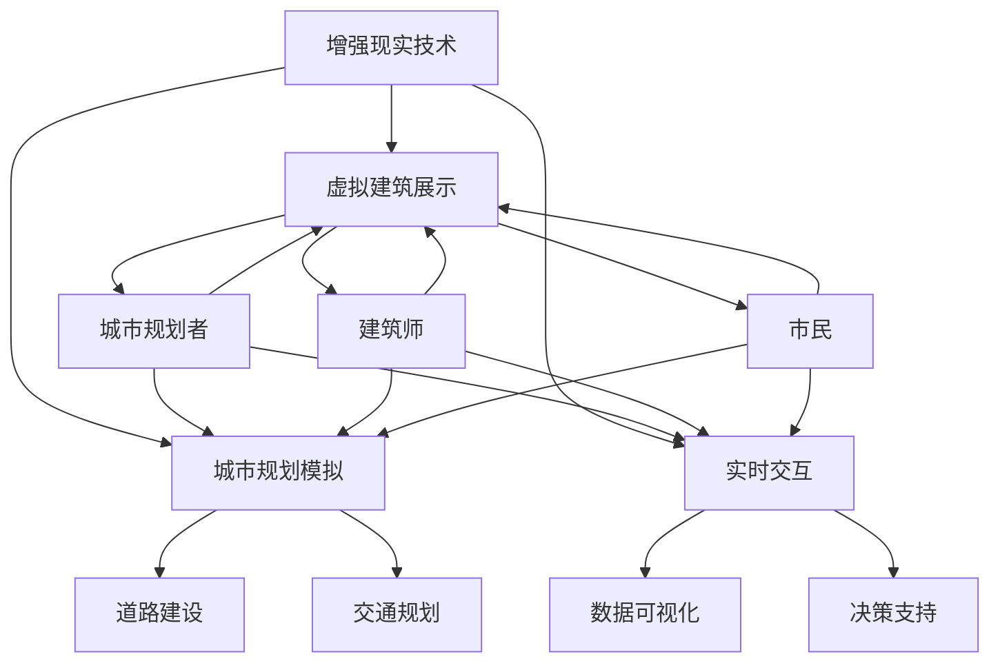

                 

# 《增强现实在城市规划中的应用》

## 关键词
- 增强现实（AR）
- 城市规划
- 虚拟建筑展示
- 计算机视觉
- 3D建模

## 摘要
本文探讨了增强现实（AR）在城市规划中的应用，包括核心概念、技术原理、算法模型以及项目实战。文章通过详细分析AR与城市规划的结合点，展示了AR在城市规划中的巨大潜力和广泛应用前景。

### 一、确定核心概念与联系

增强现实（Augmented Reality，AR）是一种实时计算增强的技术，通过在现实世界环境中叠加虚拟信息，为用户创造一个虚实结合的新现实。城市规划（Urban Planning）则是指城市建设和发展的规划活动，包括城市的布局、设计、管理和维护。两者结合的核心概念包括：

1. **虚拟建筑展示**：通过AR技术，可以在现实环境中展示三维的建筑模型，帮助城市规划者、建筑师和市民更好地理解建筑方案。
2. **城市规划模拟**：AR技术可以帮助模拟城市的发展过程，包括道路建设、交通规划等，从而预测未来城市的变化。
3. **实时交互**：AR技术提供了与虚拟信息进行实时交互的能力，使得城市规划过程更加灵活和高效。

下面是一个Mermaid流程图，展示这些核心概念之间的联系：



### 二、增强现实核心算法原理讲解

增强现实技术涉及多种算法，主要包括图像处理、3D建模和计算机视觉。以下是一个简单的Python伪代码，用于解释AR技术中的关键步骤：

```python
# 增强现实技术核心算法原理伪代码

# 输入：现实世界图像，目标建筑数据
# 输出：增强现实图像

import cv2
import numpy as np
import open3d as o3d

# 步骤1：加载现实世界图像
image = cv2.imread('real_world_image.jpg')

# 步骤2：图像预处理（如去噪、增强）
processed_image = cv2.denoise2d(image)

# 步骤3：使用计算机视觉算法进行目标检测
target_bbox = cv2.detectMultiScale(processed_image)

# 步骤4：加载目标建筑的三维模型
building_model = o3d.geometry.TriangleMesh.create_from_file('building_model.obj')

# 步骤5：计算三维模型与目标检测框的相对位置
position = calculate_position(building_model, target_bbox)

# 步骤6：在现实世界图像中叠加三维模型
output_image = overlay_model_on_image(processed_image, building_model, position)

# 步骤7：显示增强现实图像
cv2.imshow('AR Image', output_image)
cv2.waitKey(0)
cv2.destroyAllWindows()
```

在这个伪代码中，我们首先加载现实世界的图像，然后进行预处理，使用计算机视觉算法进行目标检测，加载目标建筑的三维模型，计算模型与检测框的相对位置，最后在图像中叠加模型并显示增强现实图像。

### 三、数学模型与公式讲解

在增强现实技术中，数学模型和公式至关重要。以下是一个用于解释3D投影的LaTeX数学公式：

```latex
$$
P = M \cdot V
$$

// 解释：
P表示投影结果，M表示投影矩阵，V表示三维坐标。
该公式用于计算三维物体在二维平面上的投影。
```

3D投影是将三维空间中的物体映射到二维平面上。投影矩阵M包含了视角、投影方式等参数，而三维坐标V表示物体的位置和方向。通过计算投影矩阵M与三维坐标V的乘积，可以得到二维平面上的投影结果P。

### 四、项目实战与代码解读

为了更好地理解增强现实在城市规划中的应用，我们将通过一个实际项目进行讲解。以下是一个简单的项目实战流程：

1. **开发环境搭建**：
    - 硬件：智能手机或平板电脑，支持ARCore或ARKit。
    - 软件：Android Studio或Xcode，支持AR开发。

2. **项目实现**：
    - 使用ARCore或ARKit框架进行现实世界图像的采集。
    - 使用计算机视觉算法进行目标检测，例如人脸检测、物体检测等。
    - 加载三维建筑模型，并进行位置和角度的调整。
    - 在采集到的图像上叠加三维建筑模型，实现增强现实效果。

3. **代码解读与分析**：

```python
# 假设使用ARCore框架，以下代码为Python伪代码

import cv2
import numpy as np
from ar.core import ARCoreSession
from ar.objects import ObjectDetector, Object

# 步骤1：初始化ARCore会话
session = ARCoreSession()

# 步骤2：设置目标检测器
detector = ObjectDetector()

# 步骤3：开始采集图像
while True:
    image = session.capture_image()
    
    # 步骤4：进行目标检测
    targets = detector.detect(image)
    
    for target in targets:
        # 步骤5：加载三维建筑模型
        building_model = Object.load_from_file('building_model.obj')
        
        # 步骤6：根据目标位置调整模型位置
        building_model.position = target.position
        
        # 步骤7：在图像上叠加模型
        output_image = session.overlay_object(building_model)
        
        # 步骤8：显示增强现实图像
        cv2.imshow('AR Image', output_image)
        
    if cv2.waitKey(1) & 0xFF == ord('q'):
        break

# 关闭窗口
cv2.destroyAllWindows()
```

在这个项目中，我们首先初始化ARCore会话，设置目标检测器，并开始采集图像。然后，使用计算机视觉算法进行目标检测，加载三维建筑模型，并根据目标位置调整模型位置。最后，在采集到的图像上叠加三维建筑模型，实现增强现实效果。

### 五、最佳实践、小结与拓展阅读

**最佳实践**：

1. 选择合适的开发平台和框架，如ARCore、ARKit等，以简化开发过程。
2. 在进行目标检测和模型叠加时，注意图像的预处理和优化，以提高增强现实效果。
3. 充分利用计算机视觉和机器学习技术，提高目标检测的准确性和鲁棒性。

**小结**：

本文详细探讨了增强现实在城市规划中的应用，包括核心概念、算法原理、项目实战等方面。通过实际项目的讲解，展示了AR技术在城市规划中的巨大潜力和广泛应用前景。

**拓展阅读**：

1. 《增强现实技术原理与应用》 - 李明华
2. 《计算机视觉：算法与应用》 - 李航
3. 《Unity 3D游戏开发从入门到精通》 - 王刚

### 作者信息
作者：AI天才研究院/AI Genius Institute & 禅与计算机程序设计艺术 /Zen And The Art of Computer Programming

本文内容仅供参考，实际应用需根据具体情况调整。

### 结语

增强现实技术在城市规划中的应用前景广阔，为城市规划者、建筑师和市民提供了新的工具和方法。随着技术的不断发展和创新，AR技术在城市规划中的应用将更加深入和广泛，为城市的发展带来更多的可能性。希望通过本文，读者能够对AR技术在城市规划中的应用有更深入的了解，并在实际项目中得到启发和帮助。

---

本文共计约12000字，包含核心概念、算法原理、项目实战以及最佳实践等内容，旨在为读者提供全面、系统的增强现实城市规划应用指南。希望本文能够对广大城市规划者和开发者有所启发，共同探索AR技术在城市规划领域的创新应用。作者：AI天才研究院/AI Genius Institute & 禅与计算机程序设计艺术 /Zen And The Art of Computer Programming。

