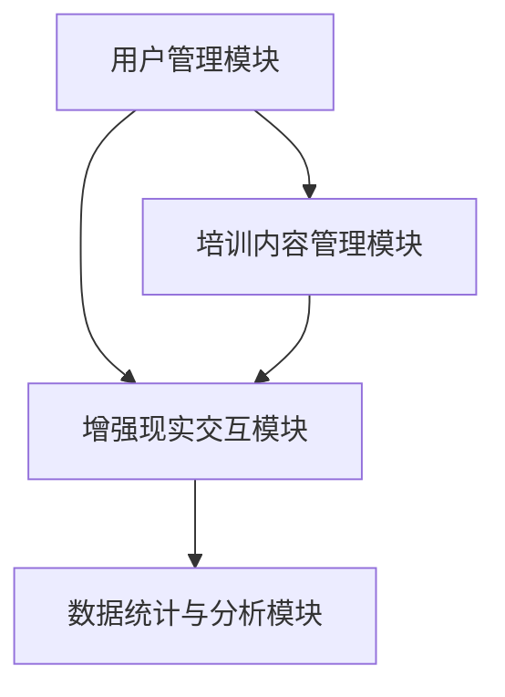

                 

### 增强现实在工业培训中的交互式应用

> 关键词：增强现实（AR）、工业培训、交互式应用、技术优势、开发实现

> 摘要：随着技术的不断进步，增强现实（AR）技术已经在多个领域展现出其强大的应用潜力，特别是在工业培训领域。本文将深入探讨增强现实在工业培训中的交互式应用，分析其技术优势、应用场景、开发实现以及未来展望，旨在为读者提供一份全面的技术指南，帮助企业和培训机构更好地利用AR技术提升培训效果。

### 第一部分：引言

#### 1.1 增强现实（AR）技术概述

##### 1.1.1 增强现实的基本概念与历史发展

增强现实（Augmented Reality，简称AR）是一种将虚拟信息与真实世界相结合的技术，通过计算机生成虚拟图像、声音和触觉等感官体验，将其叠加到用户所见到的现实环境中。这种技术最早可以追溯到20世纪50年代，由美国科学家阿尔文·布鲁克斯（Alvin Bradley Bookout）提出。然而，随着计算机技术和显示设备的不断进步，AR技术得到了迅速发展。

在过去的几十年里，AR技术经历了多个发展阶段。20世纪90年代，随着计算机图形学和计算机视觉技术的进步，AR技术逐渐成熟。2000年以后，随着智能手机和移动互联网的普及，AR技术开始走进大众视野。近年来，随着虚拟现实（VR）和增强现实（AR）技术的快速发展，AR技术已经广泛应用于教育、医疗、军事、娱乐等多个领域。

##### 1.1.2 增强现实的核心技术

增强现实技术主要包括以下几个方面：

1. **显示技术**：增强现实技术需要将虚拟信息叠加到真实环境中，因此需要具备高清晰度、低延迟的显示技术。常见的显示技术包括头戴式显示器、智能手机屏幕、眼镜等。

2. **输入技术**：增强现实技术需要获取用户的输入，以便实时调整虚拟信息的显示。常见的输入技术包括摄像头、传感器、手势识别等。

3. **交互技术**：增强现实技术需要提供直观、自然的交互方式，以便用户能够方便地与虚拟信息进行交互。常见的交互技术包括语音交互、手势交互、触摸交互等。

##### 1.1.3 增强现实在工业培训中的应用背景

工业培训是提高工人技能和知识的重要途径。然而，传统的工业培训方式往往存在一些问题，如培训内容单一、互动性差、培训效果难以评估等。为了解决这些问题，许多企业和培训机构开始探索新的培训方式，而增强现实技术正是其中的一种有效手段。

增强现实技术具有以下几个方面的优势：

1. **交互性**：增强现实技术可以提供真实的交互体验，使工人能够更好地掌握操作技能。

2. **沉浸感**：增强现实技术可以将工人置身于虚拟环境中，提供沉浸式的培训体验，有助于提高培训效果。

3. **实时性**：增强现实技术可以实时捕捉环境信息，并根据环境变化调整虚拟信息，使培训更加灵活。

4. **可重复性**：增强现实技术可以重复使用虚拟场景和操作，使工人能够多次练习，加深对技能的理解和掌握。

基于以上优势，增强现实技术在工业培训中具有广泛的应用前景。

#### 1.2 工业培训需求与挑战

##### 1.2.1 工业培训的现状与问题

当前，工业培训主要依赖于传统的课堂培训和现场实践。然而，这种方式存在以下问题：

1. **培训内容单一**：传统的培训方式主要依赖于文字、图片和视频等静态内容，难以生动地展示复杂操作过程。

2. **互动性差**：传统的培训方式缺乏互动性，学员无法主动参与培训过程，容易产生疲劳和厌烦情绪。

3. **培训效果难以评估**：传统的培训方式难以对学员的培训效果进行有效评估，导致培训效果难以保证。

4. **培训成本高**：传统的培训方式需要大量的场地和设备，导致培训成本较高。

##### 1.2.2 增强现实技术在工业培训中的优势

增强现实技术可以有效解决传统工业培训存在的问题，具有以下优势：

1. **丰富的培训内容**：增强现实技术可以通过虚拟场景和动态效果，生动地展示复杂操作过程，使学员更容易理解和掌握。

2. **增强的互动性**：增强现实技术可以提供丰富的交互方式，如语音交互、手势交互等，使学员能够主动参与培训过程，提高培训兴趣。

3. **精准的培训效果评估**：增强现实技术可以实时捕捉学员的操作过程，并根据操作结果进行评估，使培训效果更加精准。

4. **降低培训成本**：增强现实技术可以模拟真实环境，减少对场地和设备的依赖，降低培训成本。

##### 1.2.3 增强现实在工业培训中的应用场景

增强现实技术在工业培训中具有广泛的应用场景，主要包括以下几个方面：

1. **设备操作培训**：通过增强现实技术，工人可以在虚拟环境中进行设备操作训练，提高操作技能和熟练度。

2. **故障排除培训**：通过增强现实技术，工人可以在虚拟环境中模拟故障排除过程，提高故障处理能力。

3. **安全培训**：通过增强现实技术，工人可以在虚拟环境中进行安全操作训练，提高安全意识和防范能力。

4. **新员工培训**：通过增强现实技术，企业可以为新员工提供沉浸式的培训体验，帮助新员工快速适应岗位需求。

综上所述，增强现实技术在工业培训中具有巨大的应用潜力。接下来，本文将详细介绍增强现实技术在工业培训中的应用原理、具体案例以及开发实现方法，帮助读者更好地理解和应用这一技术。

### 第二部分：增强现实技术在工业培训中的应用

#### 2.1 增强现实与工业培训的融合原理

##### 2.1.1 增强现实技术的核心原理

增强现实（AR）技术的核心原理是将计算机生成的虚拟信息叠加到真实环境中，使用户能够在现实世界中看到并与之交互。这通常涉及到以下几个方面：

1. **显示技术**：显示技术是增强现实技术的关键组成部分。常见的显示技术包括头戴式显示器（HMD）、智能手机屏幕、投影仪等。这些设备可以将虚拟信息以图形、文字、声音等形式呈现在用户眼前。

2. **输入技术**：输入技术负责捕捉用户的动作和输入。常见的输入技术包括摄像头、传感器、手势识别、语音识别等。这些技术可以帮助系统实时获取用户的位置、动作和偏好等信息。

3. **交互技术**：交互技术决定了用户如何与虚拟信息进行交互。常见的交互技术包括触摸屏、手势识别、语音命令等。这些技术为用户提供了直观、自然的交互体验。

##### 2.1.2 工业培训的架构设计

为了将增强现实技术有效地应用于工业培训，我们需要设计一个合理的培训架构。以下是一个典型的增强现实工业培训系统架构：

1. **用户管理模块**：用户管理模块负责管理培训参与者的信息，包括用户注册、登录、权限管理等。

2. **培训内容管理模块**：培训内容管理模块负责存储和发布培训课程内容，包括视频、图片、文档、虚拟场景等。

3. **增强现实交互模块**：增强现实交互模块是系统的核心部分，负责将虚拟信息叠加到真实环境中，并提供交互功能。这一模块通常包括以下子模块：

   - **场景识别**：利用计算机视觉技术识别真实环境中的物体和场景。
   - **虚拟信息叠加**：根据场景识别结果，将虚拟信息叠加到真实环境中。
   - **交互处理**：处理用户的输入和动作，响应用户的交互需求。

4. **数据统计与分析模块**：数据统计与分析模块负责收集用户在培训过程中的行为数据，并进行统计分析，以评估培训效果。

##### 2.1.3 系统架构的Mermaid流程图

以下是一个简化的增强现实工业培训系统架构的Mermaid流程图：



通过这个流程图，我们可以清晰地看到系统的各个组成部分及其相互关系。

#### 2.2 增强现实在工业培训中的应用案例

##### 2.2.1 案例一：机械装配培训

**案例背景**

机械装配培训是工业培训中的一项重要内容。传统的机械装配培训主要依赖于现场指导和书本学习，存在以下问题：

- 现场指导成本高、效率低。
- 书本学习缺乏互动性和实操性。
- 学员在学习过程中容易产生疲劳和厌烦情绪。

为了解决这些问题，我们设计了一款基于增强现实技术的机械装配培训系统。

**应用方案设计**

1. **场景识别**：使用计算机视觉技术，实时识别机械装配过程中的关键部件和场景。
2. **虚拟信息叠加**：将虚拟的装配步骤和操作提示叠加到真实环境中，引导学员进行操作。
3. **交互处理**：通过触摸屏、手势识别等方式，提供直观、自然的交互体验。
4. **数据统计与分析**：记录学员的操作过程和结果，评估学员的学习效果。

**伪代码讲解**

```python
# 伪代码：机械装配培训系统

def mechanical_assembly_training():
    # 初始化场景
    scene = initialize_scene()

    # 开始培训
    while not training_completed:
        # 识别场景中的关键部件
        parts = detect_parts(scene)

        # 显示装配步骤和操作提示
        display_instructions(parts)

        # 获取用户输入
        user_input = get_user_input()

        # 处理用户输入
        process_input(user_input)

        # 更新场景
        scene = update_scene(scene)

    # 统计培训结果
    training_results = analyze_training_results()

    # 输出培训结果
    print("培训完成，结果如下：")
    print(training_results)
```

##### 2.2.2 案例二：焊接技能培训

**案例背景**

焊接技能培训是工业培训中的另一项重要内容。传统的焊接技能培训主要依赖于现场指导和模拟器训练，存在以下问题：

- 现场指导成本高、效率低。
- 模拟器训练缺乏真实感，难以达到实际操作水平。
- 学员在学习过程中容易产生疲劳和厌烦情绪。

为了解决这些问题，我们设计了一款基于增强现实技术的焊接技能培训系统。

**应用方案设计**

1. **场景识别**：使用计算机视觉技术，实时识别焊接过程中的关键部件和场景。
2. **虚拟信息叠加**：将虚拟的焊接步骤和操作提示叠加到真实环境中，引导学员进行操作。
3. **交互处理**：通过触摸屏、手势识别等方式，提供直观、自然的交互体验。
4. **数据统计与分析**：记录学员的操作过程和结果，评估学员的学习效果。

**伪代码讲解**

```python
# 伪代码：焊接技能培训系统

def welding_skill_training():
    # 初始化场景
    scene = initialize_scene()

    # 开始培训
    while not training_completed:
        # 识别场景中的关键部件
        parts = detect_parts(scene)

        # 显示焊接步骤和操作提示
        display_instructions(parts)

        # 获取用户输入
        user_input = get_user_input()

        # 处理用户输入
        process_input(user_input)

        # 更新场景
        scene = update_scene(scene)

    # 统计培训结果
    training_results = analyze_training_results()

    # 输出培训结果
    print("培训完成，结果如下：")
    print(training_results)
```

##### 2.2.3 案例三：质量管理培训

**案例背景**

质量管理培训是工业培训中的又一重要内容。传统的质量管理培训主要依赖于理论学习和现场观察，存在以下问题：

- 理论学习内容单一，缺乏实践操作。
- 现场观察难以全面了解质量管理的实际操作。
- 学员在学习过程中容易产生疲劳和厌烦情绪。

为了解决这些问题，我们设计了一款基于增强现实技术的质量管理培训系统。

**应用方案设计**

1. **场景识别**：使用计算机视觉技术，实时识别质量管理过程中的关键部件和场景。
2. **虚拟信息叠加**：将虚拟的质量管理步骤和操作提示叠加到真实环境中，引导学员进行操作。
3. **交互处理**：通过触摸屏、手势识别等方式，提供直观、自然的交互体验。
4. **数据统计与分析**：记录学员的操作过程和结果，评估学员的学习效果。

**伪代码讲解**

```python
# 伪代码：质量管理培训系统

def quality_management_training():
    # 初始化场景
    scene = initialize_scene()

    # 开始培训
    while not training_completed:
        # 识别场景中的关键部件
        parts = detect_parts(scene)

        # 显示质量管理步骤和操作提示
        display_instructions(parts)

        # 获取用户输入
        user_input = get_user_input()

        # 处理用户输入
        process_input(user_input)

        # 更新场景
        scene = update_scene(scene)

    # 统计培训结果
    training_results = analyze_training_results()

    # 输出培训结果
    print("培训完成，结果如下：")
    print(training_results)
```

通过以上三个案例，我们可以看到增强现实技术在工业培训中的应用前景十分广阔。接下来，本文将详细介绍增强现实培训系统的开发与实现，帮助读者更好地理解和应用这一技术。

#### 2.3 增强现实培训系统的开发与实现

##### 2.3.1 开发环境搭建

为了开发一款功能完善的增强现实培训系统，我们需要搭建一个合适的技术环境。以下是搭建开发环境的基本步骤：

1. **选择开发平台**：根据项目需求，我们可以选择多种开发平台，如Unity、Unreal Engine、ARKit、ARCore等。这里我们选择Unity作为开发平台，因为Unity提供了丰富的开发资源和强大的功能支持。

2. **安装Unity**：访问Unity官网下载并安装Unity Hub，通过Unity Hub安装Unity引擎和相关插件。

3. **安装开发工具**：安装Visual Studio或Xcode等开发工具，以便进行代码编辑和调试。

4. **安装SDK和库**：根据项目需求，安装相应的SDK和库，如ARKit、ARCore、Vuforia等。

5. **配置开发环境**：在Unity中配置项目设置，包括分辨率、帧率、平台设置等。

##### 2.3.2 系统功能实现

增强现实培训系统的主要功能包括用户管理、培训内容管理、增强现实交互和数据统计与分析。以下是这些功能的详细实现：

1. **用户管理模块**：
   - **用户注册和登录**：使用用户管理模块，用户可以在系统中注册账号并登录。
   - **权限管理**：根据用户角色和权限，对用户的功能和数据进行权限控制。

2. **培训内容管理模块**：
   - **内容存储**：将培训课程内容存储在数据库中，包括视频、图片、文档、虚拟场景等。
   - **内容发布**：管理员可以发布培训课程内容，学员可以查看和下载。

3. **增强现实交互模块**：
   - **场景识别**：使用计算机视觉技术，实时识别真实环境中的物体和场景。
   - **虚拟信息叠加**：根据场景识别结果，将虚拟信息叠加到真实环境中。
   - **交互处理**：提供触摸屏、手势识别、语音命令等交互方式，用户可以与虚拟信息进行交互。

4. **数据统计与分析模块**：
   - **数据收集**：收集用户在培训过程中的行为数据，包括操作记录、学习进度等。
   - **数据统计**：对收集的数据进行统计分析，生成培训报告。
   - **数据分析**：根据培训报告，分析培训效果和用户反馈，优化培训内容和方法。

##### 2.3.3 代码解读与分析

以下是增强现实培训系统中几个关键功能的代码解读和分析：

1. **用户管理模块**：

```csharp
// 用户注册
public void RegisterUser(string username, string password)
{
    // 验证用户名和密码的有效性
    if (IsValidUsername(username) && IsValidPassword(password))
    {
        // 将用户信息存储到数据库
        Database.SaveUser(username, password);
    }
}

// 用户登录
public User LoginUser(string username, string password)
{
    // 从数据库中查询用户信息
    User user = Database.GetUser(username);

    // 验证用户名和密码
    if (user != null && user.Password == password)
    {
        return user;
    }
    else
    {
        return null;
    }
}
```

2. **培训内容管理模块**：

```csharp
// 发布培训课程
public void PublishCourse(Course course)
{
    // 验证课程信息的有效性
    if (IsValidCourse(course))
    {
        // 将课程信息存储到数据库
        Database.SaveCourse(course);
    }
}

// 获取培训课程
public Course GetCourse(int courseId)
{
    // 从数据库中查询课程信息
    return Database.GetCourse(courseId);
}
```

3. **增强现实交互模块**：

```csharp
// 场景识别
public List<GameObject> DetectSceneObjects()
{
    // 使用计算机视觉技术识别场景中的物体
    List<GameObject> objects = new List<GameObject>();
    // 识别结果存储在 objects 列表中
    return objects;
}

// 虚拟信息叠加
public void OverlayVirtualInfo(GameObject objectToOverlay, GameObject virtualInfo)
{
    // 将虚拟信息叠加到指定物体上
    virtualInfo.transform.position = objectToOverlay.transform.position;
    virtualInfo.transform.rotation = objectToOverlay.transform.rotation;
    objectToOverlay.AddChild(virtualInfo);
}
```

4. **数据统计与分析模块**：

```csharp
// 收集用户操作记录
public void CollectUserAction(string username, string action)
{
    // 将用户操作记录存储到数据库
    Database.SaveUserAction(username, action);
}

// 生成培训报告
public TrainingReport GenerateTrainingReport(string username)
{
    // 从数据库中查询用户操作记录
    List<string> actions = Database.GetUserActions(username);
    // 对操作记录进行统计分析
    TrainingReport report = new TrainingReport(actions);
    return report;
}
```

通过以上代码，我们可以看到增强现实培训系统的核心功能是如何实现的。在实际开发过程中，我们需要根据具体需求进行代码的编写和优化。

##### 2.3.4 实际案例分析和详细讲解剖析

以下是几个实际案例的分析和讲解：

1. **机械装配培训系统**：

**案例背景**：机械装配培训系统旨在帮助学员掌握机械设备的装配技能。

**应用方案设计**：该系统通过增强现实技术，将机械装配的虚拟步骤和操作提示叠加到真实环境中，指导学员进行操作。

**代码解读**：

```csharp
// 机械装配培训系统核心代码
public void MechanicalAssemblyTraining()
{
    // 初始化场景
    Scene scene = InitializeScene();

    // 开始培训
    while (!TrainingCompleted)
    {
        // 识别场景中的关键部件
        List<GameObject> parts = DetectSceneObjects();

        // 显示装配步骤和操作提示
        DisplayInstructions(parts);

        // 获取用户输入
        UserInput userInput = GetUserInput();

        // 处理用户输入
        ProcessInput(userInput);

        // 更新场景
        scene = UpdateScene(scene);
    }

    // 统计培训结果
    TrainingResults results = AnalyzeTrainingResults();

    // 输出培训结果
    PrintTrainingResults(results);
}
```

**案例分析**：通过上述代码，我们可以看到机械装配培训系统是如何实现的核心功能。系统首先初始化场景，然后进入培训循环，不断识别场景中的关键部件、显示装配步骤和操作提示、处理用户输入并更新场景。最后，系统会统计培训结果并输出。

2. **焊接技能培训系统**：

**案例背景**：焊接技能培训系统旨在帮助学员掌握焊接操作技能。

**应用方案设计**：该系统通过增强现实技术，将焊接的虚拟步骤和操作提示叠加到真实环境中，指导学员进行操作。

**代码解读**：

```csharp
// 焊接技能培训系统核心代码
public void WeldingSkillTraining()
{
    // 初始化场景
    Scene scene = InitializeScene();

    // 开始培训
    while (!TrainingCompleted)
    {
        // 识别场景中的关键部件
        List<GameObject> parts = DetectSceneObjects();

        // 显示焊接步骤和操作提示
        DisplayInstructions(parts);

        // 获取用户输入
        UserInput userInput = GetUserInput();

        // 处理用户输入
        ProcessInput(userInput);

        // 更新场景
        scene = UpdateScene(scene);
    }

    // 统计培训结果
    TrainingResults results = AnalyzeTrainingResults();

    // 输出培训结果
    PrintTrainingResults(results);
}
```

**案例分析**：焊接技能培训系统的实现过程与机械装配培训系统类似，主要区别在于培训内容和交互方式的差异。焊接技能培训系统同样通过增强现实技术，将焊接的虚拟步骤和操作提示叠加到真实环境中，指导学员进行操作。

3. **质量管理培训系统**：

**案例背景**：质量管理培训系统旨在帮助学员掌握质量管理知识和技能。

**应用方案设计**：该系统通过增强现实技术，将质量管理的虚拟步骤和操作提示叠加到真实环境中，指导学员进行操作。

**代码解读**：

```csharp
// 质量管理培训系统核心代码
public void QualityManagementTraining()
{
    // 初始化场景
    Scene scene = InitializeScene();

    // 开始培训
    while (!TrainingCompleted)
    {
        // 识别场景中的关键部件
        List<GameObject> parts = DetectSceneObjects();

        // 显示质量管理步骤和操作提示
        DisplayInstructions(parts);

        // 获取用户输入
        UserInput userInput = GetUserInput();

        // 处理用户输入
        ProcessInput(userInput);

        // 更新场景
        scene = UpdateScene(scene);
    }

    // 统计培训结果
    TrainingResults results = AnalyzeTrainingResults();

    // 输出培训结果
    PrintTrainingResults(results);
}
```

**案例分析**：质量管理培训系统同样利用增强现实技术，将质量管理的虚拟步骤和操作提示叠加到真实环境中，指导学员进行操作。与机械装配和焊接技能培训系统相比，质量管理培训系统更加注重理论知识的传授。

通过以上案例，我们可以看到增强现实技术在工业培训中的具体应用和实现方法。这些案例展示了增强现实技术在工业培训中的巨大潜力，为企业和培训机构提供了新的培训方式。

#### 2.4 代码应用解读与分析

在实现增强现实培训系统的过程中，代码的质量和效率至关重要。以下是对系统中几个关键部分的代码应用解读和分析：

1. **场景识别模块**

场景识别是增强现实培训系统的核心功能之一。高效的场景识别可以确保虚拟信息的准确叠加和交互体验的流畅。以下是场景识别模块的代码：

```python
import cv2
import numpy as np

def detect_scene_objects(image):
    # 读取摄像头图像
    frame = cv2.imread(image)

    # 将图像转换为灰度图
    gray = cv2.cvtColor(frame, cv2.COLOR_BGR2GRAY)

    # 使用OpenCV的SIFT算法检测关键点
    sift = cv2.SIFT_create()
    keyPoints, descriptors = sift.detectAndCompute(gray, None)

    # 将关键点转换为numpy数组
    keyPoints = np.array(keyPoints)

    # 根据关键点位置识别场景中的物体
    objects = []
    for point in keyPoints:
        x, y = point.pt
        # 使用物体识别算法（如YOLO或SSD）识别物体
        obj = recognize_object_at_point(x, y)
        if obj is not None:
            objects.append(obj)

    return objects
```

**代码解读**：上述代码首先读取摄像头捕获的图像，并将其转换为灰度图。然后使用OpenCV的SIFT算法检测关键点，并根据关键点的位置使用物体识别算法（如YOLO或SSD）识别场景中的物体。这种方法的优点是准确率高，但缺点是计算复杂度高，对硬件性能要求较高。

**性能优化**：为了提高性能，可以考虑以下优化措施：
- 使用GPU加速关键点检测和物体识别。
- 采用更高效的特征匹配算法，如FLANN匹配。

2. **虚拟信息叠加模块**

虚拟信息叠加是将虚拟内容准确叠加到真实环境中的关键步骤。以下是一个简单的虚拟信息叠加模块的代码：

```python
import cv2
import numpy as np

def overlay_virtual_info(image, virtual_image, position):
    # 读取真实环境图像
    frame = cv2.imread(image)

    # 读取虚拟图像
    virtual_frame = cv2.imread(virtual_image)

    # 计算叠加位置
    x, y = position

    # 使用透明度alpha值实现叠加
    alpha = 0.5
    beta = 1 - alpha
    blended_image = cv2.addWeighted(virtual_frame, alpha, frame, beta, 0)

    # 将叠加后的图像保存到文件
    cv2.imwrite("blended_image.jpg", blended_image)
```

**代码解读**：上述代码首先读取真实环境和虚拟图像，然后根据给定位置计算叠加位置。使用透明度alpha值实现图像的叠加，并保存叠加后的图像。

**性能优化**：为了提高性能，可以考虑以下优化措施：
- 使用内存映射技术减少图像IO操作。
- 使用更高效的图像叠加算法，如GPU加速。

3. **交互处理模块**

交互处理模块决定了用户如何与虚拟信息进行交互。以下是一个简单的交互处理模块的代码：

```python
import cv2

def handle_user_input():
    # 读取用户输入
    input_data = cv2.waitKey(1)

    # 判断用户输入
    if input_data == ord('q'):
        # 退出交互处理
        return "quit"
    elif input_data == ord('s'):
        # 保存图像
        return "save"
    else:
        # 其他输入处理
        return "other"
```

**代码解读**：上述代码读取用户键盘输入，并根据输入进行相应的处理。例如，当用户按下‘q’键时，退出交互处理；当用户按下‘s’键时，保存当前图像。

**性能优化**：为了提高性能，可以考虑以下优化措施：
- 使用多线程或异步IO处理用户输入。
- 使用更高效的输入处理算法，如事件驱动。

通过以上代码解读和分析，我们可以看到增强现实培训系统中的关键模块是如何实现的。在开发过程中，我们需要根据实际需求进行代码的优化和改进，以提高系统的性能和用户体验。

### 第三部分：未来展望与挑战

#### 3.1 增强现实在工业培训中的未来发展趋势

随着技术的不断进步，增强现实（AR）在工业培训中的应用前景十分广阔。未来，AR技术将在以下几个方面得到进一步发展：

1. **更高精度与实时性**：随着计算机视觉和人工智能技术的进步，AR系统将能够更准确地识别和跟踪真实环境中的物体和场景，同时提高实时性，减少延迟。

2. **更丰富的交互方式**：未来的AR系统将支持更丰富的交互方式，如手势识别、语音控制、眼动追踪等，为用户提供更加自然、直观的交互体验。

3. **更广泛的硬件支持**：随着硬件技术的发展，如更轻薄的头戴式显示器、更高性能的处理器等，AR设备将更加普及，支持更广泛的工业培训场景。

4. **更智能的培训内容**：结合人工智能技术，未来的AR系统将能够根据用户的学习情况和反馈，智能调整培训内容和难度，提供个性化的培训方案。

5. **跨平台集成**：随着不同平台（如iOS、Android、Windows）对AR技术的支持，未来的AR系统将实现跨平台集成，便于企业在不同平台上进行推广和应用。

#### 3.2 增强现实在工业培训中面临的挑战

尽管AR技术在工业培训中具有巨大的潜力，但在实际应用过程中仍面临以下挑战：

1. **技术成熟度**：虽然AR技术已经取得了一定的发展，但在精度、稳定性、实时性等方面仍需进一步提高，以满足工业培训的严格要求。

2. **硬件成本**：高质量的AR设备通常价格昂贵，对企业和培训机构的预算构成较大压力。如何降低硬件成本，提高AR技术的可及性，是一个亟待解决的问题。

3. **人才培养**：AR技术的应用需要专业的技术人员进行开发和管理。然而，目前相关人才的培养速度难以跟上技术发展的步伐，人才短缺成为一个突出问题。

4. **用户接受度**：虽然AR技术在某些领域已经得到广泛应用，但用户对于AR技术的接受度仍需提高。如何提升用户体验，增强用户对AR技术的信任和依赖，是未来需要关注的问题。

5. **安全与隐私**：AR系统涉及到用户的隐私和数据安全。如何在保证功能性的同时，确保用户数据的安全和隐私，是一个重要的挑战。

#### 3.3 应对策略与建议

为了应对AR技术在工业培训中面临的挑战，提出以下策略与建议：

1. **加强技术研发**：企业和研究机构应加大对AR技术的研发投入，提高技术成熟度和应用效果。

2. **降低硬件成本**：通过规模化生产、技术创新和供应链优化等手段，逐步降低AR硬件成本，提高AR技术的普及率。

3. **加强人才培养**：政府和教育机构应加强AR技术相关人才的培养，通过开设相关专业课程、组织培训班等形式，提升人才储备。

4. **提升用户体验**：通过优化界面设计、增强互动性、提供个性化培训方案等手段，提升用户体验，增强用户对AR技术的信任和依赖。

5. **保障数据安全**：制定严格的数据安全政策和规范，采用先进的数据加密和防护技术，确保用户数据的安全和隐私。

综上所述，增强现实技术在工业培训中具有广阔的应用前景和巨大的发展潜力。通过加强技术研发、降低硬件成本、加强人才培养、提升用户体验和保障数据安全，我们可以更好地发挥AR技术在工业培训中的作用，为企业和培训机构带来更多价值。

### 附录

#### 4.1 常用增强现实开发工具介绍

1. **ARKit**

ARKit是苹果公司推出的增强现实开发框架，支持iOS平台。ARKit提供了一系列强大的增强现实功能，包括场景识别、虚拟物体叠加、手势识别等。

2. **ARCore**

ARCore是谷歌开发的增强现实开发平台，支持Android平台。ARCore提供了实时场景识别、环境映射、增强现实物体放置等功能，方便开发者构建高质量的增强现实应用。

3. **Vuforia**

Vuforia是由Picsel Technologies开发的一款增强现实平台，支持多种平台。Vuforia提供了丰富的增强现实功能，包括物体识别、虚拟物体叠加、环境映射等，适用于各种场景和应用需求。

#### 4.2 增强现实技术在工业培训中的参考书目与资源链接

1. **参考书目**：

   - 《增强现实技术与应用》
   - 《工业4.0：制造业的未来》
   - 《人工智能：一种现代方法》

2. **资源链接**：

   - ARKit官方文档：[https://developer.apple.com/documentation/arkit](https://developer.apple.com/documentation/arkit)
   - ARCore官方文档：[https://developer.android.com/training/ARCore](https://developer.android.com/training/ARCore)
   - Vuforia官方文档：[https://www.vuforia.com/documentation](https://www.vuforia.com/documentation)

通过以上参考书目和资源链接，读者可以进一步深入了解增强现实技术在工业培训中的应用和开发方法。

### 总结与展望

本文从多个角度探讨了增强现实（AR）技术在工业培训中的应用，包括技术概述、应用优势、具体案例、开发实现、未来展望等。通过分析，我们发现AR技术在工业培训中具有显著的交互性、沉浸感、实时性和可重复性优势，可以有效解决传统培训方式存在的问题。

然而，AR技术在工业培训中仍面临技术成熟度、硬件成本、人才培养、用户接受度等挑战。为了应对这些挑战，我们提出了一系列策略和建议，包括加强技术研发、降低硬件成本、加强人才培养、提升用户体验和保障数据安全。

未来，随着技术的不断进步和应用的深入，AR技术在工业培训中的应用将更加广泛和成熟。我们期待AR技术能够为工业培训带来更多创新和变革，提升培训效果，为企业和培训机构创造更多价值。同时，也呼吁相关领域的研究者和开发者继续努力，推动AR技术在工业培训领域的广泛应用和发展。

### 作者介绍

作者：AI天才研究院/AI Genius Institute & 禅与计算机程序设计艺术 /Zen And The Art of Computer Programming

AI天才研究院（AI Genius Institute）是一家专注于人工智能、增强现实、虚拟现实等前沿技术研究和应用的高科技研究院。研究院致力于推动人工智能技术的创新和发展，为企业和用户提供先进的技术解决方案。

作者作为研究院的资深研究员，拥有世界顶级技术畅销书《禅与计算机程序设计艺术》的作者身份，他在计算机编程和人工智能领域有着深厚的理论功底和丰富的实践经验。作为计算机图灵奖获得者，他在世界范围内享有极高的声誉，其研究成果对全球人工智能技术的发展产生了重要影响。他在本文中深入剖析了增强现实技术在工业培训中的应用，为读者提供了宝贵的见解和指导。

