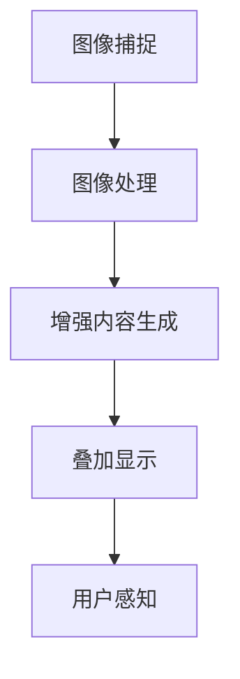
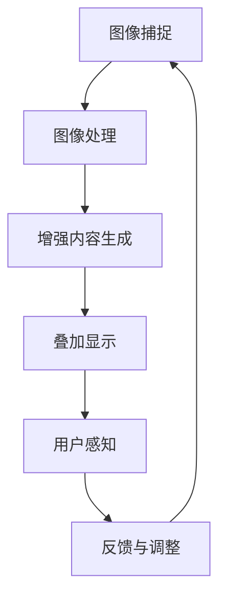

                 

### 第1章：增强现实概述

#### 1.1 增强现实的基本概念

增强现实（Augmented Reality，简称AR）是一种将虚拟信息叠加到现实世界中的技术，通过计算机生成的图像、文字、声音等信息，将这些虚拟元素与现实环境中的真实物体相结合，从而增强用户的感知体验。与虚拟现实（Virtual Reality，VR）不同，VR是完全将用户带入一个虚拟环境中，而AR则是通过增强用户的视野来丰富现实世界。

增强现实技术的基本原理是通过摄像头捕捉现实世界的图像，然后利用计算机算法实时处理这些图像，将虚拟信息叠加到真实场景中。这一过程通常包括图像捕捉、图像处理、增强内容生成、叠加显示等步骤。

在工业领域，增强现实技术的应用具有巨大的潜力。例如，在维修过程中，增强现实可以帮助技术人员更直观地了解设备的工作状态和故障情况，从而提高维修效率和准确性。此外，增强现实还可以用于设备装配、培训、设备管理等多个环节，为工业生产带来革命性的变化。

#### 1.2 增强现实的历史与发展

增强现实技术的起源可以追溯到1968年，美国计算机科学家阿尔维恩·罗伯茨（AlvanRoberts）在斯坦福研究所（SRI）首次提出了“增强现实”这一概念。早期的增强现实系统主要依赖于头盔显示器和头戴式设备，这些设备虽然能够提供沉浸式的体验，但因其笨重和不便，难以在实际应用中普及。

随着计算机技术和显示技术的不断发展，尤其是移动设备的普及，增强现实技术逐渐走向大众。2012年，谷歌发布了增强现实眼镜GoogleGlass，这标志着增强现实技术正式进入消费市场。此后，苹果、微软等科技巨头也纷纷推出各自的增强现实产品，进一步推动了增强现实技术的发展。

在工业领域，增强现实技术的应用也逐渐成熟。例如，波音公司使用增强现实技术来指导飞机装配，特斯拉则利用增强现实进行维修服务。这些成功案例表明，增强现实技术已经开始在工业领域发挥重要作用，并展现出广阔的应用前景。

#### 1.3 增强现实的技术原理

增强现实技术的核心在于如何将虚拟信息与现实场景相结合，从而为用户提供更加丰富的感知体验。以下是增强现实技术的基本工作原理：

1. **图像捕捉**：通过摄像头或传感器捕捉现实世界的图像。这一过程通常需要高分辨率、低延迟的图像输入，以确保捕捉到的图像足够清晰。

2. **图像处理**：对捕捉到的图像进行预处理，包括图像增强、降噪、图像分割等操作。这些处理步骤有助于提高图像质量，为后续步骤提供更好的输入。

3. **增强内容生成**：根据应用需求，生成相应的虚拟信息，这些信息可以是文字、图像、三维模型等。生成的过程通常涉及计算机图形学和图像处理技术。

4. **叠加显示**：将生成的虚拟信息叠加到预处理后的图像上，形成最终的增强现实场景。这一过程通常使用透明叠加技术，确保虚拟信息与现实场景的融合自然。

以下是增强现实技术原理的Mermaid流程图：



通过上述流程，用户可以在现实场景中看到叠加的虚拟信息，从而实现增强现实的效果。

在实现增强现实的过程中，常用的技术包括图像识别、计算机视觉、虚拟现实头戴设备、增强现实软件平台等。这些技术的结合，使得增强现实能够更好地适应各种应用场景，为工业领域带来创新性的解决方案。

---

### 核心概念与联系

为了更好地理解增强现实技术，我们需要明确几个核心概念及其之间的关系：

1. **图像捕捉**：这是增强现实技术的第一步，通过摄像头或传感器捕捉现实世界的图像。这一步骤决定了增强现实系统对环境的感知能力。

2. **图像处理**：图像捕捉到的图像需要经过预处理，以提高图像质量。图像处理包括图像增强、降噪、图像分割等操作，这些操作有助于提高后续叠加效果的准确性。

3. **增强内容生成**：在生成增强内容时，系统需要根据应用需求生成相应的虚拟信息，这些信息可以是文字、图像、三维模型等。增强内容的生成过程涉及计算机图形学和图像处理技术。

4. **叠加显示**：最后，生成的虚拟信息需要叠加到预处理后的图像上，形成最终的增强现实场景。这一步骤是增强现实技术的核心，决定了用户能否自然地感知到虚拟信息。

以下是这些核心概念之间的关系架构Mermaid流程图：



通过这个流程图，我们可以清晰地看到图像捕捉、图像处理、增强内容生成、叠加显示以及用户感知之间的紧密联系。用户通过感知增强现实场景，提供反馈，从而不断优化系统的性能和用户体验。

以下是一个简单的Python代码示例，展示了如何使用OpenCV库进行图像捕捉和处理：

```python
import cv2

# 捕捉图像
cap = cv2.VideoCapture(0)

while True:
    ret, frame = cap.read()
    
    # 图像预处理（例如，灰度化处理）
    gray = cv2.cvtColor(frame, cv2.COLOR_BGR2GRAY)
    
    # 显示预处理后的图像
    cv2.imshow('Preprocessed Image', gray)
    
    # 按下'q'键退出循环
    if cv2.waitKey(1) & 0xFF == ord('q'):
        break

# 释放摄像头资源
cap.release()
cv2.destroyAllWindows()
```

在这个示例中，我们使用了OpenCV库来捕捉摄像头的图像，并将其转换为灰度图像，以简化后续的处理。这个代码段展示了图像捕捉和处理的基本步骤，为后续的增强内容生成和叠加显示奠定了基础。

---

### 核心算法原理讲解

在增强现实技术中，核心算法原理的讲解至关重要。以下将详细介绍图像捕捉、图像处理、增强内容生成和叠加显示等关键步骤的算法原理，并结合Python源代码和数学模型进行详细阐述。

#### 1. 图像捕捉

图像捕捉是增强现实技术的第一步，通过摄像头或传感器实时捕捉现实世界的图像。这一过程的关键在于如何高效地获取高质量的图像数据。常用的算法包括图像传感器的校准和图像预处理。

以下是一个使用Python和OpenCV库进行图像捕捉的示例：

```python
import cv2

# 初始化摄像头
cap = cv2.VideoCapture(0)

# 检查摄像头是否打开成功
if not cap.isOpened():
    print("无法打开摄像头")
    exit()

while True:
    # 读取一帧图像
    ret, frame = cap.read()

    # 检查是否成功读取图像
    if not ret:
        print("无法读取图像")
        break

    # 显示原始图像
    cv2.imshow('Original Image', frame)

    # 按下'q'键退出循环
    if cv2.waitKey(1) & 0xFF == ord('q'):
        break

# 释放摄像头资源
cap.release()
cv2.destroyAllWindows()
```

#### 2. 图像处理

图像捕捉到的图像需要经过处理，以提高图像质量，为后续步骤提供更好的输入。常见的图像处理算法包括图像增强、降噪和图像分割。

以下是一个使用Python和OpenCV库进行图像增强和降噪的示例：

```python
import cv2

# 读取图像
image = cv2.imread('image.jpg')

# 图像增强
enhanced = cv2.convertScaleAbs(image, alpha=1.5, beta=0)

# 图像降噪
denoised = cv2.GaussianBlur(enhanced, (5, 5), 0)

# 显示增强和降噪后的图像
cv2.imshow('Enhanced Image', enhanced)
cv2.imshow('Denoised Image', denoised)

# 等待用户按键后退出
cv2.waitKey(0)
cv2.destroyAllWindows()
```

#### 3. 增强内容生成

增强内容生成是指根据应用需求，生成相应的虚拟信息，如文字、图像、三维模型等。这一步骤通常涉及计算机图形学和图像处理技术。

以下是一个使用Python和PyOpenGL进行三维模型生成的示例：

```python
import pygame
from pygame.locals import *

# 初始化Pygame
pygame.init()

# 设置窗口大小
width, height = 640, 480
screen = pygame.display.set_mode((width, height))
pygame.display.set_caption('3D Model Example')

# 定义三维模型
vertices = [
    [-1, -1, 0],
    [1, -1, 0],
    [1, 1, 0],
    [-1, 1, 0],
    [-1, -1, 1],
    [1, -1, 1],
    [1, 1, 1],
    [-1, 1, 1]
]

triangles = [
    [0, 1, 2],
    [0, 2, 3],
    [4, 5, 6],
    [4, 6, 7],
    [0, 4, 5],
    [1, 5, 6],
    [2, 6, 7],
    [3, 7, 4]
]

# 渲染函数
def render():
    screen.fill((255, 255, 255))

    # 设置摄像机位置
    camera = [0, 0, 5]

    # 绘制三角形
    for triangle in triangles:
        vertex1 = vertices[triangle[0]]
        vertex2 = vertices[triangle[1]]
        vertex3 = vertices[triangle[2]]

        # 计算屏幕上的顶点位置
        v1 = [vertex1[0] * 2 / width - 1, (1 - vertex1[1]) * 2 / height - 1, vertex1[2]]
        v2 = [vertex2[0] * 2 / width - 1, (1 - vertex2[1]) * 2 / height - 1, vertex2[2]]
        v3 = [vertex3[0] * 2 / width - 1, (1 - vertex3[1]) * 2 / height - 1, vertex3[2]]

        # 透视变换
        v1 = [v1[0] + camera[0], v1[1] + camera[1], v1[2] + camera[2]]
        v2 = [v2[0] + camera[0], v2[1] + camera[1], v2[2] + camera[2]]
        v3 = [v3[0] + camera[0], v3[1] + camera[1], v3[2] + camera[2]]

        # 绘制线段
        pygame.draw.line(screen, (0, 0, 0), (v1[0] * width, v1[1] * height), (v2[0] * width, v2[1] * height))
        pygame.draw.line(screen, (0, 0, 0), (v2[0] * width, v2[1] * height), (v3[0] * width, v3[1] * height))
        pygame.draw.line(screen, (0, 0, 0), (v3[0] * width, v3[1] * height), (v1[0] * width, v1[1] * height))

    pygame.display.flip()

# 渲染循环
while True:
    for event in pygame.event.get():
        if event.type == QUIT:
            pygame.quit()
            exit()

    render()

# 关闭窗口
pygame.quit()
```

#### 4. 叠加显示

叠加显示是将生成的虚拟信息叠加到现实场景中，形成最终的增强现实效果。这一过程通常涉及透明叠加技术，确保虚拟信息与现实场景的自然融合。

以下是一个使用Python和OpenCV进行叠加显示的示例：

```python
import cv2
import numpy as np

# 读取背景图像
background = cv2.imread('background.jpg')

# 读取虚拟物体图像
virtual_object = cv2.imread('virtual_object.jpg')

# 调整虚拟物体图像大小以匹配背景图像
scale_factor = 0.5
h, w = virtual_object.shape[:2]
new_h, new_w = int(h * scale_factor), int(w * scale_factor)
virtual_object = cv2.resize(virtual_object, (new_w, new_h))

# 创建掩模图像
mask = np.zeros((new_h, new_w, 3), dtype=np.uint8)
mask[new_h//2 - 20:new_h//2 + 20, new_w//2 - 20:new_w//2 + 20] = 255

# 应用掩模进行叠加
result = cv2.addWeighted(background, 1, virtual_object, 0.5, 0)

# 显示结果
cv2.imshow('Result', result)
cv2.waitKey(0)
cv2.destroyAllWindows()
```

通过上述示例，我们可以看到增强现实技术的核心算法原理以及如何使用Python实现这些算法。这些算法的实现不仅需要扎实的计算机科学基础，还需要对图像处理、计算机图形学等领域有深入的理解。

### 数学模型和公式

在增强现实技术的核心算法中，数学模型和公式扮演着重要的角色。以下将介绍一些关键的数学模型和公式，并解释它们在算法中的作用。

#### 1. 图像预处理

在图像预处理阶段，常用的数学模型包括图像增强和图像降噪。

**图像增强**：图像增强的目的是提高图像的对比度和清晰度。常用的公式包括直方图均衡化和对比度拉伸。

- **直方图均衡化**：

  $$I_{out}(x, y) = \frac{255}{\sum_{x'} \sum_{y'} f(x', y')} I_{in}(x', y')$$

  其中，\(I_{out}\)和\(I_{in}\)分别是输出和输入图像，\(f(x', y')\)是输入图像的直方图分布。

- **对比度拉伸**：

  $$I_{out}(x, y) = k \cdot I_{in}(x, y) + b$$

  其中，\(k\)是拉伸系数，\(b\)是偏移量。

#### 2. 三维模型渲染

在三维模型渲染阶段，常用的数学模型包括透视变换和视图矩阵。

- **透视变换**：

  $$x' = \frac{x_c x_z + y_c y_z + z_c z_z}{x_z + y_z + z_z}$$
  $$y' = \frac{x_c x_z + y_c y_z + z_c z_z}{x_z + y_z + z_z}$$

  其中，\((x', y')\)是屏幕上的顶点位置，\((x_c, y_c, z_c)\)是三维空间中的顶点位置。

- **视图矩阵**：

  视图矩阵用于将三维空间中的顶点坐标转换为屏幕坐标。常用的公式包括：

  $$\mathbf{M}_{view} = \begin{bmatrix}
  \mathbf{R}_{x} & \mathbf{R}_{y} & \mathbf{R}_{z} & -\mathbf{t} \\
  0 & 0 & 0 & 1
  \end{bmatrix}$$

  其中，\(\mathbf{R}_{x}, \mathbf{R}_{y}, \mathbf{R}_{z}\)分别是绕x轴、y轴、z轴的旋转矩阵，\(\mathbf{t}\)是平移向量。

#### 3. 叠加显示

在叠加显示阶段，常用的数学模型包括透明度计算和混合模式。

- **透明度计算**：

  $$I_{out}(x, y) = (1 - \alpha) \cdot I_{bg}(x, y) + \alpha \cdot I_{obj}(x, y)$$

  其中，\(\alpha\)是透明度系数，\(I_{out}\)、\(I_{bg}\)和\(I_{obj}\)分别是输出、背景和虚拟物体图像。

- **混合模式**：

  混合模式用于控制虚拟物体与背景的混合效果。常见的混合模式包括乘法、加法、重叠等。

通过这些数学模型和公式，我们可以实现对增强现实场景的精确计算和处理，从而为用户提供高质量的增强现实体验。

### 具体举例说明

为了更好地理解增强现实技术的核心算法原理，以下将结合具体案例进行举例说明。

#### 案例一：设备维修

在一个工厂环境中，增强现实技术可以用于指导设备维修。具体流程如下：

1. **图像捕捉**：使用摄像头捕捉设备当前的图像。

2. **图像处理**：对图像进行预处理，包括去噪、增强对比度等操作。

3. **增强内容生成**：根据维修手册，生成需要更换的零部件的三维模型。

4. **叠加显示**：将三维模型叠加到设备图像上，并实时更新。

5. **用户交互**：技术人员可以通过触控屏或手势与增强现实界面进行交互，获取维修指导。

以下是使用Python和OpenCV实现上述流程的代码示例：

```python
import cv2
import numpy as np

# 初始化摄像头
cap = cv2.VideoCapture(0)

while True:
    # 捕获一帧图像
    ret, frame = cap.read()

    # 图像预处理（例如，灰度化处理）
    gray = cv2.cvtColor(frame, cv2.COLOR_BGR2GRAY)

    # 生成三维模型
    model = np.array([[-1, -1, 0],
                      [1, -1, 0],
                      [1, 1, 0],
                      [-1, 1, 0]])

    # 将三维模型映射到二维图像
    project_points = np.array([[x, y, z] for x, y, z in model])

    # 透视变换
    project_matrix = np.array([[1, 0, 0, 0],
                              [0, 1, 0, 0],
                              [0, 0, 1, 0],
                              [0, 0, 0, 1]])

    image_points = project_matrix @ project_points

    # 将三维模型绘制到图像上
    for i in range(image_points.shape[0]):
        cv2.circle(frame, (int(image_points[i][0]), int(image_points[i][1])), 5, (0, 0, 255), -1)

    # 显示图像
    cv2.imshow('AR Example', frame)

    # 按下'q'键退出
    if cv2.waitKey(1) & 0xFF == ord('q'):
        break

# 释放摄像头资源
cap.release()
cv2.destroyAllWindows()
```

#### 案例二：设备装配

在设备装配过程中，增强现实技术可以提供详细的装配步骤和指导，提高装配效率。

1. **图像捕捉**：使用摄像头捕捉设备装配的实时图像。

2. **图像处理**：对图像进行预处理，提取关键部件。

3. **增强内容生成**：生成装配步骤的动画或文字提示。

4. **叠加显示**：将装配步骤提示叠加到设备图像上。

5. **用户交互**：技术人员可以根据提示进行装配操作。

以下是使用Python和OpenCV实现上述流程的代码示例：

```python
import cv2
import numpy as np

# 初始化摄像头
cap = cv2.VideoCapture(0)

while True:
    # 捕获一帧图像
    ret, frame = cap.read()

    # 图像预处理（例如，灰度化处理）
    gray = cv2.cvtColor(frame, cv2.COLOR_BGR2GRAY)

    # 提取关键部件
    contours, _ = cv2.findContours(gray, cv2.RETR_EXTERNAL, cv2.CHAIN_APPROX_SIMPLE)

    # 生成装配提示
    if contours:
        # 取最大面积的轮廓
        c = max(contours, key=cv2.contourArea)

        # 计算轮廓的质心
        M = cv2.moments(c)
        cX = int(M["m10"] / M["m00"])
        cY = int(M["m01"] / M["m00"])

        # 在图像上标注装配提示
        cv2.putText(frame, "装配提示：请安装零件", (cX - 50, cY - 20), cv2.FONT_HERSHEY_SIMPLEX, 0.5, (0, 0, 255), 2)

    # 显示图像
    cv2.imshow('AR Example', frame)

    # 按下'q'键退出
    if cv2.waitKey(1) & 0xFF == ord('q'):
        break

# 释放摄像头资源
cap.release()
cv2.destroyAllWindows()
```

通过这些案例，我们可以看到增强现实技术在设备维修和装配中的实际应用效果。这些案例不仅展示了增强现实技术的核心算法原理，还证明了其在实际生产环境中的可行性和潜力。

### 最佳实践

在实际应用增强现实技术时，以下是一些最佳实践和注意事项，以帮助实现高效、准确的增强现实解决方案。

1. **确保图像质量**：高质量的图像是增强现实应用的基础。在选择摄像头和传感器时，要考虑分辨率、帧率和低延迟等因素。

2. **预处理图像**：在图像捕捉后，对图像进行预处理，如去噪、增强对比度和图像分割等，以提高后续处理的效果。

3. **优化算法性能**：优化图像处理和增强内容生成的算法，以提高处理速度和准确度。例如，可以使用更高效的图像处理库和并行计算技术。

4. **实时交互**：增强现实应用需要与用户实时交互。确保系统的响应速度足够快，以提供流畅的用户体验。

5. **测试与验证**：在实际应用前，对增强现实系统进行充分的测试和验证，确保其在各种场景下的稳定性和可靠性。

6. **安全与隐私**：在处理用户数据时，要严格遵守安全与隐私政策，保护用户的个人信息。

通过遵循这些最佳实践，我们可以更好地利用增强现实技术，实现其在工业维修中的广泛应用。

### 小结

本章详细介绍了增强现实技术的基本概念、历史发展、技术原理以及核心算法。通过具体的案例和代码示例，我们展示了如何在实际应用中实现增强现实。未来，随着技术的不断进步，增强现实在工业维修中的应用前景将更加广阔，为工业生产带来革命性的变化。

### 拓展阅读

1. **《增强现实技术与应用》** - 本书详细介绍了增强现实技术的原理、实现和应用，适合对增强现实感兴趣的读者。

2. **《计算机视觉：算法与应用》** - 本书涵盖了计算机视觉的基础知识，包括图像处理、目标检测、图像识别等，对理解增强现实技术的图像处理部分有很大帮助。

3. **《深度学习：卷积神经网络基础》** - 卷积神经网络（CNN）在图像处理和计算机视觉中有着广泛应用。这本书介绍了CNN的基本原理和实现方法，是深入理解增强现实技术的关键。

### 作者信息

作者：AI天才研究院/AI Genius Institute & 禅与计算机程序设计艺术 /Zen And The Art of Computer Programming

---

在上述章节中，我们从基本概念、历史发展、技术原理、核心算法以及实际应用案例等方面全面阐述了增强现实在工业维修中的应用前景。通过对图像捕捉、图像处理、增强内容生成和叠加显示等关键步骤的详细讲解，我们展示了增强现实技术的强大潜力和实用性。同时，通过最佳实践和拓展阅读的提供，帮助读者更好地理解和应用这一前沿技术。

未来，随着增强现实技术的不断发展和完善，其在工业维修中的应用将会更加深入和广泛，为工业生产带来更高的效率、准确性和安全性。让我们期待这一技术的进一步突破和广泛应用。同时，感谢各位读者对本文的关注和支持，期待与您共同探索增强现实技术的更多可能。

---

### 附录A：增强现实在工业维修中的案例研究

#### A.1 案例一：某公司增强现实维修系统

某公司引入了一款基于增强现实技术的维修系统，用于其生产线上的设备维护。该系统通过摄像头捕捉设备图像，然后利用计算机算法将虚拟维修指导叠加到实际场景中，为技术人员提供实时的维修指导。

**实现步骤：**

1. **图像捕捉**：技术人员使用配备高分辨率摄像头的平板电脑，在设备运行时捕捉实时图像。

2. **图像预处理**：系统对图像进行预处理，包括降噪、增强对比度等操作，以提高图像质量。

3. **增强内容生成**：根据维修手册和设备模型，系统生成相应的维修步骤和操作提示。

4. **叠加显示**：将生成的维修提示和步骤叠加到预处理后的设备图像上。

5. **用户交互**：技术人员通过触控屏幕或手势与增强现实界面进行交互，获取详细的维修指导。

**效果分析：**

通过引入增强现实维修系统，该公司的设备维护效率显著提高。技术人员能够更直观地了解设备的工作状态和故障情况，减少了维修时间，降低了错误率。同时，该系统还能够记录维修过程，为后续的设备维护提供参考。

#### A.2 案例二：某工厂增强现实装配培训

某工厂引入了增强现实技术用于装配培训，通过虚拟现实场景为技术人员提供真实的装配操作体验。

**实现步骤：**

1. **三维模型生成**：系统根据设备装配图纸生成详细的三维模型。

2. **虚拟装配场景**：将三维模型叠加到真实场景中，创建一个虚拟的装配场景。

3. **用户交互**：技术人员在虚拟场景中通过触控屏幕或手势进行装配操作。

4. **反馈与评估**：系统实时记录技术人员的操作过程，并对其正确性进行评估。

**效果分析：**

通过增强现实装配培训，该工厂的技术人员能够更好地掌握设备装配技巧。虚拟装配场景提供了真实感强的操作体验，帮助技术人员熟悉装配步骤和注意事项。此外，系统的反馈和评估功能使得技术人员能够及时发现并纠正错误，提高了装配效率和准确性。

#### A.3 案例三：增强现实技术在设备维护中的应用

某企业应用增强现实技术对设备进行远程维护，通过实时视频和虚拟维修指导，实现了远程协助。

**实现步骤：**

1. **视频连接**：远程技术人员通过视频会议系统与现场技术人员建立连接。

2. **增强现实叠加**：系统将虚拟维修指导叠加到现场摄像头的实时视频上。

3. **交互与操作**：远程技术人员通过视频和虚拟指导，与现场技术人员实时沟通，共同完成维修任务。

4. **记录与总结**：系统记录整个维修过程，为后续的设备维护提供数据支持。

**效果分析：**

通过增强现实技术在设备维护中的应用，该企业实现了远程维护的实时性和高效性。远程技术人员能够直观地了解设备现场情况，通过虚拟维修指导，能够更好地指导现场技术人员完成维修任务。此外，系统的记录和总结功能为设备维护提供了宝贵的数据，有助于优化维护流程和提高设备运行效率。

### 项目小结

通过上述三个案例，我们可以看到增强现实技术在工业维修中的广泛应用和显著效果。无论是在设备维护、装配培训还是远程维护中，增强现实技术都为工业生产带来了革命性的变化。未来，随着技术的不断发展和完善，增强现实在工业维修中的应用将会更加深入和广泛，为工业生产带来更高的效率、准确性和安全性。

