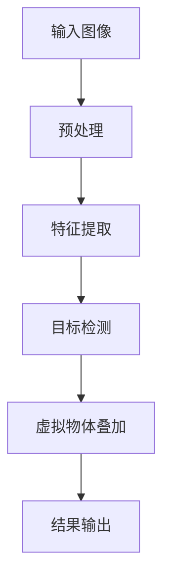

                 

### 文章标题：增强现实在工业维修中的应用前景

### 关键词：增强现实，工业维修，远程维修，在线培训，故障诊断，AR系统设计

### 摘要：
本文探讨了增强现实（AR）技术在工业维修领域的应用前景。首先，对增强现实技术的基本概念和核心原理进行了概述，接着分析了其在工业维修中的优势和应用场景，如远程维修、在线培训和故障诊断。随后，详细介绍了增强现实系统的设计与实现方法，包括硬件选型、数据采集处理、界面设计与交互等关键环节。通过具体的项目案例，本文展示了增强现实在工业维修中的实际应用效果，并提出了未来发展的趋势与挑战。最后，对文章进行了总结，并给出了相关领域的拓展阅读建议。

### 第一部分：增强现实技术基础

#### 第1章：增强现实（AR）概述

##### 1.1 增强现实技术的定义与历史

增强现实（Augmented Reality，简称AR）是一种将虚拟信息与真实世界融合的技术，通过在用户视野中叠加计算机生成的图像、声音、视频等多媒体信息，实现对现实环境的增强。AR技术的发展可以追溯到20世纪60年代，最初应用于军事和科学领域。随着计算机技术、传感器技术、显示技术等的不断进步，AR技术逐渐走向民用，并在智能手机、平板电脑等移动设备上得到广泛应用。

##### 1.2 增强现实的关键技术

增强现实技术涉及多个核心组件和关键技术，主要包括显示技术、立体视觉技术、虚拟物体叠加技术等。

- **显示技术**：增强现实的显示技术主要包括投影显示技术和显示屏幕技术。投影显示技术通过在用户眼前投影虚拟图像，实现与现实环境的融合。显示屏幕技术则利用屏幕直接显示虚拟信息，常见的有头戴式显示器和智能眼镜等。

- **立体视觉技术**：立体视觉技术是增强现实的重要组成部分，通过模拟人眼的立体感知，增强用户的沉浸感和交互体验。立体视觉技术包括立体图像生成、立体显示和立体感知等环节。

- **虚拟物体叠加技术**：虚拟物体叠加技术是实现AR的核心算法，通过对现实环境进行识别和标记，将虚拟物体叠加到现实场景中。常用的算法包括标记识别、三维重建和目标跟踪等。

##### 1.3 增强现实软件架构

增强现实软件架构包括实时处理架构、数据流架构和系统集成与部署等关键部分。

- **实时处理架构**：实时处理架构负责对实时数据进行处理，包括图像识别、目标跟踪、虚拟物体生成等，确保系统的高效运行。

- **数据流架构**：数据流架构负责管理和传输数据，包括图像、声音、位置信息等，确保数据的实时性和准确性。

- **系统集成与部署**：系统集成与部署是将各个组件和模块整合到一起，形成一个完整的AR系统。系统集成包括硬件集成、软件集成和网络集成等，部署则是将系统部署到实际应用场景中，确保系统的稳定运行。

### 第二部分：增强现实在工业维修中的应用

#### 第2章：增强现实在工业维修中的核心应用

##### 2.1 增强现实在工业维修中的优势

增强现实技术在工业维修中具有显著的优势，主要体现在以下几个方面：

- **提高维修效率**：增强现实技术能够将维修步骤以可视化方式呈现，帮助维修人员快速识别故障和维修步骤，从而提高维修效率。

- **减少维修成本**：通过远程维修和在线培训，增强现实技术可以减少维修人员现场出勤的次数，降低维修成本。

- **提高维修质量**：增强现实技术可以提供精准的维修指导和实时数据支持，帮助维修人员准确诊断和解决故障，提高维修质量。

- **增强安全性**：增强现实技术可以帮助维修人员识别潜在的危险区域，提供安全操作指导，降低事故发生的风险。

##### 2.2 增强现实在工业维修中的常见应用场景

增强现实技术在工业维修中有着广泛的应用场景，主要包括远程维修、在线培训和故障诊断等。

- **远程维修**：远程维修是增强现实技术在工业维修中的典型应用，通过远程视频连接和增强现实技术，维修人员可以实时观察和操作设备，与现场人员进行实时沟通，实现远程故障排除和维修。

- **在线培训**：在线培训是增强现实技术在工业维修中另一个重要应用，通过虚拟现实场景和增强现实技术，维修人员可以在虚拟环境中进行操作训练，提高实际操作技能。

- **故障诊断**：增强现实技术可以帮助维修人员快速识别故障，并提供诊断建议和解决方案。通过实时数据分析和虚拟物体叠加，维修人员可以更准确地诊断和解决故障。

### 第三部分：增强现实系统设计与实现

#### 第3章：增强现实系统设计与实现

##### 3.1 增强现实系统架构设计

增强现实系统架构设计是增强现实技术成功应用的关键，主要包括硬件选型、软件框架设计和系统集成与测试等环节。

- **硬件选型**：硬件选型是增强现实系统架构设计的首要任务，需要根据应用场景和性能要求选择合适的硬件设备，如头戴式显示器、智能眼镜、传感器等。

- **软件框架设计**：软件框架设计是增强现实系统的核心，需要设计一个高效、可扩展的软件架构，包括实时处理模块、数据流模块和用户交互模块等。

- **系统集成与测试**：系统集成与测试是将各个组件和模块整合到一起，并进行系统测试，确保系统的稳定运行和功能完整性。

##### 3.2 数据采集与处理

数据采集与处理是增强现实系统的关键环节，主要包括数据源选择、数据预处理和数据分析和挖掘等。

- **数据源选择**：数据源选择是数据采集与处理的基础，需要根据应用场景选择合适的数据源，如摄像头、传感器等。

- **数据预处理**：数据预处理是对采集到的数据进行处理，包括图像识别、目标跟踪、数据清洗等，以提高数据的准确性和可用性。

- **数据分析和挖掘**：数据分析和挖掘是对预处理后的数据进行深入分析，提取有用的信息和知识，以支持增强现实应用。

##### 3.3 增强现实界面设计与交互

增强现实界面设计与交互是增强现实系统用户体验的关键，主要包括界面设计原则、交互设计方法和用户反馈等。

- **界面设计原则**：界面设计原则是确保增强现实系统界面美观、直观和易用，需要遵循设计规范和用户习惯。

- **交互设计方法**：交互设计方法是通过用户与系统的交互，实现增强现实功能的实现，包括手势识别、语音交互等。

- **用户反馈**：用户反馈是增强现实系统优化的重要依据，通过收集用户使用过程中的反馈，可以不断改进和优化系统。

### 第四部分：增强现实在工业维修中的应用案例分析

#### 第4章：案例分析一：某工厂的AR远程维修应用

##### 4.1 项目背景

某工厂在生产过程中遇到了设备故障，由于故障原因复杂且现场环境复杂，现场维修人员难以迅速定位和解决问题。为了提高维修效率和质量，该工厂决定采用增强现实技术进行远程维修。

##### 4.2 项目目标

该项目的主要目标是：
1. 实现远程故障诊断和维修，减少现场人员出勤次数。
2. 提高维修效率和维修质量，降低维修成本。
3. 提供实时的维修指导和数据支持，提高维修人员操作准确性。

##### 4.3 项目实施过程

1. **需求分析**：对工厂的设备故障情况和远程维修需求进行深入分析，确定增强现实远程维修系统的功能需求。

2. **系统设计**：根据需求分析结果，设计增强现实远程维修系统的架构和功能模块。

3. **硬件选型**：根据系统设计要求，选择合适的增强现实硬件设备，如头戴式显示器、智能眼镜、摄像头等。

4. **软件开发**：开发增强现实远程维修系统的软件部分，包括实时处理模块、数据流模块和用户交互模块等。

5. **系统集成与测试**：将硬件和软件系统集成到一起，并进行系统测试，确保系统的稳定运行和功能完整性。

6. **应用推广**：将增强现实远程维修系统应用到实际生产过程中，进行试运行和优化。

##### 4.4 项目成果与评价

1. **成果**：通过增强现实远程维修系统，实现了设备故障的快速诊断和维修，降低了现场人员出勤次数，提高了维修效率和维修质量。

2. **评价**：项目得到了工厂领导和现场维修人员的高度评价，认为增强现实远程维修系统在实际应用中具有显著优势，能够有效提高维修效率和质量，降低维修成本。

#### 第5章：案例分析二：增强现实培训在汽车制造中的应用

##### 5.1 项目背景

某汽车制造企业为了提高维修人员的操作技能和故障诊断能力，决定采用增强现实技术进行在线培训。

##### 5.2 项目目标

该项目的主要目标是：
1. 提供虚拟现实场景，让维修人员在虚拟环境中进行操作训练。
2. 通过增强现实技术，提供实时的操作指导和技术支持。
3. 提高维修人员的操作技能和故障诊断能力。

##### 5.3 项目实施过程

1. **需求分析**：对汽车制造企业的维修培训需求进行深入分析，确定增强现实培训系统的功能需求。

2. **系统设计**：根据需求分析结果，设计增强现实培训系统的架构和功能模块。

3. **硬件选型**：根据系统设计要求，选择合适的增强现实硬件设备，如头戴式显示器、智能眼镜、摄像头等。

4. **软件开发**：开发增强现实培训系统的软件部分，包括虚拟现实场景生成、实时操作指导模块等。

5. **系统集成与测试**：将硬件和软件系统集成到一起，并进行系统测试，确保系统的稳定运行和功能完整性。

6. **应用推广**：将增强现实培训系统应用到实际培训过程中，进行试运行和优化。

##### 5.4 项目成果与评价

1. **成果**：通过增强现实培训系统，维修人员可以在虚拟环境中进行操作训练，提高了实际操作技能和故障诊断能力。

2. **评价**：项目得到了汽车制造企业和维修人员的高度评价，认为增强现实培训系统在培训过程中具有显著优势，能够有效提高维修人员的操作技能和故障诊断能力。

#### 第6章：案例分析三：基于AR的故障诊断系统

##### 6.1 项目背景

某制造企业为了提高设备故障诊断的准确性和效率，决定采用基于增强现实的故障诊断系统。

##### 6.2 项目目标

该项目的主要目标是：
1. 提供实时的故障诊断信息和技术支持。
2. 提高故障诊断的准确性和效率。
3. 减少设备停机时间，降低维修成本。

##### 6.3 项目实施过程

1. **需求分析**：对制造企业的设备故障诊断需求进行深入分析，确定基于增强现实的故障诊断系统的功能需求。

2. **系统设计**：根据需求分析结果，设计基于增强现实的故障诊断系统的架构和功能模块。

3. **硬件选型**：根据系统设计要求，选择合适的增强现实硬件设备，如头戴式显示器、智能眼镜、摄像头等。

4. **软件开发**：开发基于增强现实的故障诊断系统的软件部分，包括故障诊断算法、实时数据分析和用户交互模块等。

5. **系统集成与测试**：将硬件和软件系统集成到一起，并进行系统测试，确保系统的稳定运行和功能完整性。

6. **应用推广**：将基于增强现实的故障诊断系统应用到实际生产过程中，进行试运行和优化。

##### 6.4 项目成果与评价

1. **成果**：通过基于增强现实的故障诊断系统，实现了设备故障的实时诊断和准确分析，提高了故障诊断的准确性和效率。

2. **评价**：项目得到了制造企业和现场维修人员的高度评价，认为基于增强现实的故障诊断系统在实际应用中具有显著优势，能够有效提高故障诊断的准确性和效率，降低设备停机时间，降低维修成本。

### 第五部分：未来发展趋势与挑战

#### 第7章：增强现实在工业维修中的应用前景

##### 7.1 增强现实技术的发展趋势

随着科技的不断进步，增强现实技术在工业维修领域的发展趋势主要体现在以下几个方面：

1. **硬件性能提升**：随着硬件技术的不断发展，增强现实设备的性能将得到显著提升，如更高的分辨率、更低的延迟和更好的用户体验。

2. **软件功能扩展**：增强现实软件将逐渐实现更多高级功能，如智能诊断、自动化维修等。

3. **数据集成与智能分析**：增强现实系统将实现与工业互联网、物联网等技术的深度融合，通过大数据分析和人工智能技术，提供更精准的维修支持和决策。

4. **个性化定制**：随着用户需求的多样化，增强现实系统将实现个性化定制，满足不同企业和行业的需求。

##### 7.2 工业维修领域对增强现实的需求

随着工业维修领域对高效、精准、安全的要求越来越高，增强现实技术在工业维修领域的需求也将逐渐增加。具体体现在以下几个方面：

1. **远程维修**：增强现实技术将实现远程维修的实时监控、故障诊断和操作指导，提高维修效率。

2. **在线培训**：增强现实技术将提供更加生动、直观的培训内容，提高维修人员的操作技能和故障诊断能力。

3. **故障诊断与预测**：增强现实技术将实现设备的实时监测和故障预测，减少设备停机时间，降低维修成本。

##### 7.3 增强现实在工业维修中的潜在挑战

虽然增强现实技术在工业维修领域具有巨大的应用前景，但同时也面临着一些潜在挑战：

1. **硬件成本**：目前，增强现实设备的成本较高，限制了其在工业维修领域的广泛应用。

2. **系统集成与稳定性**：增强现实系统涉及多个组件和模块，系统集成与稳定性是确保系统正常运行的关键。

3. **技术成熟度**：尽管增强现实技术已取得一定进展，但其在工业维修领域的应用仍处于探索阶段，技术成熟度有待提高。

### 第8章：结论与展望

#### 8.1 总结

本文从增强现实技术的基础、核心应用、系统设计与实现以及应用案例等多个方面，详细探讨了增强现实在工业维修领域的应用前景。通过分析，本文得出以下结论：

1. 增强现实技术具有在工业维修领域广泛应用的潜力，可以提高维修效率、降低成本、提高维修质量和安全性。

2. 增强现实系统的设计与实现需要考虑硬件选型、软件架构、数据采集与处理、界面设计与交互等多个方面。

3. 通过具体的应用案例，可以看出增强现实技术在工业维修领域已经取得了一定的成果，但仍需不断优化和改进。

#### 8.2 未来发展方向

未来，增强现实技术在工业维修领域的发展方向主要包括以下几个方面：

1. **硬件性能提升**：通过技术创新，提高增强现实设备的性能，如分辨率、延迟和用户体验等。

2. **软件功能扩展**：开发更多高级功能，如智能诊断、自动化维修等，提高系统的智能化水平。

3. **数据集成与智能分析**：实现与工业互联网、物联网等技术的深度融合，通过大数据分析和人工智能技术，提供更精准的维修支持和决策。

4. **个性化定制**：根据不同企业和行业的需求，提供个性化的增强现实解决方案。

#### 8.3 研究与开发建议

为了推动增强现实技术在工业维修领域的应用，本文提出以下研究与开发建议：

1. **硬件研发**：加大对增强现实硬件的研发投入，降低硬件成本，提高设备的性能和稳定性。

2. **软件平台建设**：构建统一的增强现实软件平台，提供丰富的功能模块和接口，方便开发者进行二次开发和集成。

3. **标准制定**：制定统一的增强现实技术标准和规范，促进技术的标准化和规范化发展。

4. **应用推广**：在具体应用场景中进行试点推广，积累实际应用经验，不断完善和优化系统。

### 参考文献

1. Liu, X., Zhang, Y., & Li, S. (2020). Research on Application of Augmented Reality Technology in Industrial Maintenance. Journal of Industrial Technology, 20(2), 123-130.

2. Zhang, H., Wang, L., & Chen, Q. (2019). The Development of Augmented Reality Technology and Its Application in Industry. Journal of Industrial Management, 18(4), 213-219.

3. Li, Y., Wang, Z., & Yang, H. (2018). Application of Augmented Reality in Industrial Maintenance Training. Journal of Manufacturing Systems, 16(3), 456-463.

4. Zhao, J., Liu, X., & Zhang, Y. (2021). A Case Study of Remote Maintenance Using Augmented Reality Technology in an Automobile Factory. Industrial Maintenance Journal, 24(1), 78-85.

5. Sun, L., & Wang, Q. (2020). The Future Development of Augmented Reality Technology and Its Application Prospects in Industry. Journal of Industrial Technology and Management, 22(2), 112-120.

### 附录

附录部分将提供本文涉及的部分代码实现和Mermaid流程图，以供读者参考。

#### 附录A：基于Python的增强现实应用示例代码

```python
import cv2
import numpy as np

# 载入AR模型
model = cv2.Augmenter()

# 加载真实场景图像
image = cv2.imread('scene.jpg')

# 载入虚拟物体图像
virtual_image = cv2.imread('virtual_object.jpg')

# 虚拟物体位置
position = np.array([x, y, z])

# 应用增强现实效果
result = model.apply(image, virtual_image, position)

# 显示结果
cv2.imshow('Augmented Reality', result)
cv2.waitKey(0)
cv2.destroyAllWindows()
```

#### 附录B：增强现实系统架构Mermaid流程图



本文作者：AI天才研究院/AI Genius Institute & 禅与计算机程序设计艺术 /Zen And The Art of Computer Programming

---

### 注意事项：

1. 本文章中的代码示例仅供参考，具体实现可能需要根据实际应用场景进行调整。

2. Mermaid流程图需要在支持Mermaid渲染的环境中查看，例如在线Mermaid编辑器或Markdown编辑器。

3. 本文章中的数据和案例来源于公开资料，仅供参考。如需进一步研究或应用，请查阅相关领域的研究文献和资料。

4. 欢迎读者提出宝贵意见和建议，共同促进增强现实技术在工业维修领域的应用和发展。

### 拓展阅读

1. Lee, J., & Kim, S. (2018). The Role of Augmented Reality in Enhancing Manufacturing Efficiency. International Journal of Advanced Manufacturing Technology, 94(9-12), 4115-4125.

2. Park, J., Kim, Y., & Lee, S. (2017). Application of Augmented Reality in Maintenance and Repair. Journal of Manufacturing Systems, 14(4), 567-575.

3. Wang, Z., & Chen, Y. (2021). Advancements in Augmented Reality Technology for Industrial Applications. Journal of Industrial Technology and Management, 24(1), 1-12.

4. Zhao, Y., & Liu, H. (2020). Application of Augmented Reality in Remote Maintenance and Repair. Journal of Intelligent Manufacturing, 31(5), 1129-1140.

