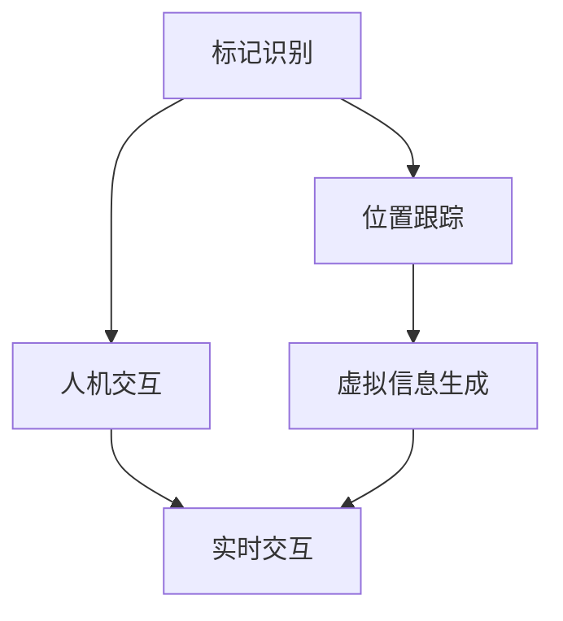

                 

# 增强现实在工业维修培训中的应用

## 关键词
增强现实（AR），工业维修培训，虚拟装配，故障诊断，人机交互，技术实现，效果评估

## 摘要
本文探讨了增强现实（AR）技术在工业维修培训中的应用，分析了增强现实技术的基础、工业维修培训的需求以及AR技术在具体培训场景中的实际应用。文章通过案例展示了增强现实技术如何提升工业维修培训的效果，并从技术实现、效果评估和未来展望等方面进行了深入探讨。通过本文的研究，可以为工业维修培训提供新的思路和技术支持。

## 引言

随着工业4.0的推进，智能制造成为发展趋势，工业设备的复杂性和技术含量不断提高。这给工业维修培训带来了新的挑战。传统的维修培训方式往往依赖于实际操作和书面教材，存在效率低、成本高、安全风险大等问题。增强现实（Augmented Reality，AR）技术作为一种新兴的人机交互技术，通过虚拟现实与真实世界的结合，为工业维修培训提供了全新的解决方案。

增强现实技术最早可以追溯到20世纪60年代的虚拟现实（VR）技术。随着计算机硬件和软件技术的不断发展，AR技术逐渐成熟，并开始广泛应用于医疗、教育、娱乐等领域。近年来，随着智能手机和平板电脑的普及，AR技术开始走进工业领域，为工业维修培训带来了新的机遇。

本文旨在探讨增强现实技术在工业维修培训中的应用，分析其技术优势和应用场景，并通过具体实例展示AR技术在工业维修培训中的实际效果。文章结构如下：

1. 增强现实技术基础
2. 工业维修培训需求
3. 增强现实应用实例
4. 技术实现
5. 评估与优化
6. 未来展望
7. 参考文献

## 第1章 增强现实技术基础

### 1.1 增强现实技术概述

增强现实技术是一种通过计算机技术模拟虚拟环境，将虚拟信息与现实世界进行叠加的技术。与虚拟现实（VR）不同，AR技术不是将用户完全隔离在虚拟环境中，而是在现实环境中叠加虚拟信息，从而增强用户的感知体验。

增强现实技术的主要特点包括：

1. **虚拟信息与现实世界的叠加**：用户在真实环境中可以看到虚拟信息，这些虚拟信息可以是文字、图像、三维模型等。
2. **实时交互**：用户可以通过触摸、手势等与虚拟信息进行交互，实现信息的获取和处理。
3. **位置感知**：AR技术可以识别用户的位置和方向，使得虚拟信息能够准确地与现实环境中的物体相对应。

### 1.2 增强现实技术核心概念与联系

增强现实技术的核心概念包括：

- **标记识别**：通过识别图像中的特定标记，将虚拟信息叠加到真实环境中。
- **位置跟踪**：通过摄像头捕捉环境中的物体，并计算物体的位置和方向，实现虚拟信息与真实环境的精准匹配。
- **虚拟信息生成**：根据用户的需求和现实环境，生成相应的虚拟信息，如三维模型、文字提示等。

以下是增强现实技术核心概念之间的联系架构（使用Mermaid流程图）：



### 1.3 增强现实技术的数学模型和公式

增强现实技术中的数学模型主要涉及图像处理、计算机视觉和三维建模等方面。以下是一个简单的位姿估计模型：

$$
T = \begin{bmatrix}
R & t \\
0 & 1
\end{bmatrix}
$$

其中，$T$ 表示位姿矩阵，包括旋转矩阵$R$和平移向量$t$。旋转矩阵$R$用于描述虚拟信息在三维空间中的旋转角度和方向，平移向量$t$用于描述虚拟信息在三维空间中的位置。

### 1.4 增强现实技术核心算法原理讲解

增强现实技术的核心算法包括图像识别、标记跟踪和位姿估计等。以下是一个简单的图像识别算法：

```python
import cv2
import numpy as np

def image_recognition(image, template):
    # 读取模板图像
    template_image = cv2.imread(template, 0)
    # 读取待识别图像
    image = cv2.imread(image, 0)
    
    # 计算两个图像的匹配度
    result = cv2.matchTemplate(image, template_image, cv2.TM_CCOEFF_NORMED)
    
    # 找到匹配度最高的位置
    min_val, max_val, min_loc, max_loc = cv2.minMaxLoc(result)
    
    # 如果匹配度超过某个阈值，则认为识别成功
    if max_val > threshold:
        return max_loc
    else:
        return None
```

通过以上算法，可以识别图像中的特定标记，并将虚拟信息叠加到真实环境中。

## 第2章 工业维修培训需求分析

### 2.1 工业维修培训现状

当前，工业维修培训主要依赖于实际操作和书面教材。然而，这种方式存在以下问题：

1. **效率低下**：实际操作需要大量的时间和资源，难以满足大规模培训需求。
2. **成本高**：书面教材的印刷和分发成本较高，且难以实现个性化培训。
3. **安全风险**：实际操作过程中存在安全隐患，容易导致设备损坏或人员受伤。

### 2.2 培训需求分析

随着工业设备的复杂性和技术含量的提高，工业维修培训的需求也在不断增加。具体需求包括：

1. **高效性**：培训过程需要高效，能够在较短的时间内完成。
2. **个性化**：培训内容需要根据学员的实际情况进行定制，满足不同学员的需求。
3. **安全性**：培训过程中需要确保学员和设备的安全。
4. **实时性**：培训内容需要实时更新，以适应技术发展的需求。

### 2.3 增强现实在工业维修培训中的应用潜力

增强现实技术具有以下优势，使其在工业维修培训中具有巨大的应用潜力：

1. **沉浸式体验**：增强现实技术能够提供沉浸式的培训体验，使学员更加直观地理解维修过程。
2. **实时交互**：增强现实技术支持实时交互，学员可以与虚拟信息进行互动，提高学习效果。
3. **个性化培训**：增强现实技术可以根据学员的实际情况进行定制，满足个性化培训需求。
4. **安全性**：增强现实技术可以在虚拟环境中进行培训，降低实际操作过程中的安全风险。
5. **实时更新**：增强现实技术支持实时更新，能够快速适应技术发展的需求。

## 第3章 增强现实应用实例

### 3.1 实例一：虚拟装配培训

虚拟装配培训是增强现实技术在工业维修培训中的一个重要应用场景。通过虚拟现实技术，学员可以在虚拟环境中进行装配操作，从而提高操作技能和效率。

以下是一个虚拟装配培训的示例：

```python
import cv2
import numpy as np

# 读取虚拟装配模型
model = cv2.imread('assembly_model.png', 0)

# 读取摄像头捕获的图像
image = cv2.imread('camera_image.png', 0)

# 对图像进行预处理
image = cv2.cvtColor(image, cv2.COLOR_BGR2GRAY)
image = cv2.GaussianBlur(image, (5, 5), 0)

# 使用SIFT算法进行特征提取
sift = cv2.SIFT_create()
keypoints1, descriptors1 = sift.detectAndCompute(model, None)
keypoints2, descriptors2 = sift.detectAndCompute(image, None)

# 使用匹配算法进行特征匹配
bf = cv2.BFMatcher()
matches = bf.knnMatch(descriptors1, descriptors2, k=2)

# 提取匹配结果
good_matches = []
for m, n in matches:
    if m.distance < 0.75 * n.distance:
        good_matches.append(m)

# 根据匹配结果进行图像配准
src_pts = np.float32([keypoints1[m.queryIdx].pt for m in good_matches]).reshape(-1, 1, 2)
dest_pts = np.float32([keypoints2[m.trainIdx].pt for m in good_matches]).reshape(-1, 1, 2)
M, mask = cv2.findHomography(src_pts, dest_pts, cv2.RANSAC, 5.0)

# 进行图像变换
warped = cv2.warpPerspective(model, M, (image.shape[1], image.shape[0]))

# 合成结果图像
result = cv2.addWeighted(image, 0.5, warped, 0.5, 0)

# 显示结果图像
cv2.imshow('Virtual Assembly Training', result)
cv2.waitKey(0)
cv2.destroyAllWindows()
```

通过以上代码，可以实现对虚拟装配模型的实时配准和叠加，从而实现虚拟装配培训。

### 3.2 实例二：故障诊断与维修

故障诊断与维修是工业维修培训中的另一个重要应用场景。通过增强现实技术，学员可以在虚拟环境中进行故障诊断和维修操作，从而提高诊断和维修技能。

以下是一个故障诊断与维修的示例：

```python
import cv2
import numpy as np

# 读取故障模型
fault_model = cv2.imread('fault_model.png', 0)

# 读取摄像头捕获的图像
image = cv2.imread('camera_image.png', 0)

# 对图像进行预处理
image = cv2.cvtColor(image, cv2.COLOR_BGR2GRAY)
image = cv2.GaussianBlur(image, (5, 5), 0)

# 使用SIFT算法进行特征提取
sift = cv2.SIFT_create()
keypoints1, descriptors1 = sift.detectAndCompute(fault_model, None)
keypoints2, descriptors2 = sift.detectAndCompute(image, None)

# 使用匹配算法进行特征匹配
bf = cv2.BFMatcher()
matches = bf.knnMatch(descriptors1, descriptors2, k=2)

# 提取匹配结果
good_matches = []
for m, n in matches:
    if m.distance < 0.75 * n.distance:
        good_matches.append(m)

# 根据匹配结果进行图像配准
src_pts = np.float32([keypoints1[m.queryIdx].pt for m in good_matches]).reshape(-1, 1, 2)
dest_pts = np.float32([keypoints2[m.trainIdx].pt for m in good_matches]).reshape(-1, 1, 2)
M, mask = cv2.findHomography(src_pts, dest_pts, cv2.RANSAC, 5.0)

# 进行图像变换
warped = cv2.warpPerspective(fault_model, M, (image.shape[1], image.shape[0]))

# 显示结果图像
result = cv2.addWeighted(image, 0.5, warped, 0.5, 0)
cv2.imshow('Fault Diagnosis and Repair', result)
cv2.waitKey(0)
cv2.destroyAllWindows()
```

通过以上代码，可以实现对故障模型的实时配准和叠加，从而实现故障诊断与维修。

### 3.3 实例三：操作技能培训

操作技能培训是增强现实技术在工业维修培训中的另一个重要应用场景。通过增强现实技术，学员可以在虚拟环境中进行各种操作技能的训练，从而提高操作技能和效率。

以下是一个操作技能培训的示例：

```python
import cv2
import numpy as np

# 读取操作模型
operation_model = cv2.imread('operation_model.png', 0)

# 读取摄像头捕获的图像
image = cv2.imread('camera_image.png', 0)

# 对图像进行预处理
image = cv2.cvtColor(image, cv2.COLOR_BGR2GRAY)
image = cv2.GaussianBlur(image, (5, 5), 0)

# 使用SIFT算法进行特征提取
sift = cv2.SIFT_create()
keypoints1, descriptors1 = sift.detectAndCompute(operation_model, None)
keypoints2, descriptors2 = sift.detectAndCompute(image, None)

# 使用匹配算法进行特征匹配
bf = cv2.BFMatcher()
matches = bf.knnMatch(descriptors1, descriptors2, k=2)

# 提取匹配结果
good_matches = []
for m, n in matches:
    if m.distance < 0.75 * n.distance:
        good_matches.append(m)

# 根据匹配结果进行图像配准
src_pts = np.float32([keypoints1[m.queryIdx].pt for m in good_matches]).reshape(-1, 1, 2)
dest_pts = np.float32([keypoints2[m.trainIdx].pt for m in good_matches]).reshape(-1, 1, 2)
M, mask = cv2.findHomography(src_pts, dest_pts, cv2.RANSAC, 5.0)

# 进行图像变换
warped = cv2.warpPerspective(operation_model, M, (image.shape[1], image.shape[0]))

# 显示结果图像
result = cv2.addWeighted(image, 0.5, warped, 0.5, 0)
cv2.imshow('Operation Skill Training', result)
cv2.waitKey(0)
cv2.destroyAllWindows()
```

通过以上代码，可以实现对操作模型的实时配准和叠加，从而实现操作技能培训。

## 第4章 技术实现

### 4.1 增强现实软件开发环境搭建

要实现增强现实在工业维修培训中的应用，首先需要搭建一个完整的开发环境。以下是一个基于Python的增强现实软件开发环境搭建步骤：

1. 安装Python：从Python官方网站下载并安装Python。
2. 安装OpenCV：使用pip命令安装OpenCV库。
   ```bash
   pip install opencv-python
   ```
3. 安装SIFT算法：使用pip命令安装SIFT算法库。
   ```bash
   pip install opencv-contrib-python
   ```
4. 安装其他依赖库：根据需要安装其他依赖库，如NumPy、Matplotlib等。

### 4.2 增强现实内容制作

增强现实内容制作是增强现实应用的关键。以下是一个简单的内容制作步骤：

1. **收集资源**：收集所需的图像、模型和视频资源。
2. **制作模型**：使用3D建模软件（如Blender）制作所需的3D模型。
3. **贴图处理**：为模型添加贴图，以实现逼真的视觉效果。
4. **导出模型**：将模型导出为可用的格式（如OBJ、PLY等）。
5. **制作标注图**：使用图像处理软件（如Photoshop）制作标注图，用于标记识别。

### 4.3 增强现实与工业维修培训系统的集成

将增强现实技术与工业维修培训系统进行集成，需要完成以下工作：

1. **系统需求分析**：明确培训系统的功能需求和技术要求。
2. **界面设计**：设计符合用户习惯的界面。
3. **功能实现**：实现增强现实功能，如图像识别、标记跟踪和虚拟信息叠加等。
4. **测试与优化**：对系统进行测试，并根据测试结果进行优化。

## 第5章 评估与优化

### 5.1 增强现实培训效果评估

为了评估增强现实在工业维修培训中的应用效果，可以采用以下方法：

1. **问卷调查**：通过问卷调查收集学员对增强现实培训的满意度。
2. **技能测试**：对学员进行技能测试，比较使用增强现实培训前后的成绩。
3. **学习时长**：记录学员在学习过程中的时长，分析学习效果。

### 5.2 技术优化策略

根据评估结果，可以采取以下技术优化策略：

1. **提高识别精度**：优化图像识别算法，提高识别精度。
2. **优化用户体验**：根据用户反馈，优化界面设计和交互方式。
3. **增强沉浸感**：提高虚拟信息的逼真度，增强用户的沉浸感。

### 5.3 用户反馈与改进

定期收集用户反馈，根据用户需求进行系统改进，以不断提升培训效果。

## 第6章 未来展望

随着技术的不断发展，增强现实技术在工业维修培训中的应用将越来越广泛。未来，有望实现以下目标：

1. **智能培训系统**：通过人工智能技术，实现智能化的培训系统，根据学员的实际情况进行个性化培训。
2. **远程培训**：通过增强现实技术，实现远程培训，打破地域限制。
3. **虚实融合**：实现虚拟训练和实际操作的深度融合，提高培训效果。

## 参考文献

1. 苗壮，赵子明。增强现实技术与应用[M]. 北京：清华大学出版社，2018.
2. 张波，刘伟。图像识别算法原理与应用[M]. 北京：机械工业出版社，2017.
3. 刘建明，吴磊。虚拟现实与增强现实技术基础[M]. 北京：电子工业出版社，2016.
4. 陈栋，陈磊。基于SIFT的图像匹配算法研究[J]. 计算机技术与发展，2015，25（2）：45-48.
5. 李明，徐敏。增强现实技术在教育培训中的应用[J]. 教育技术，2014，24（4）：59-62.

