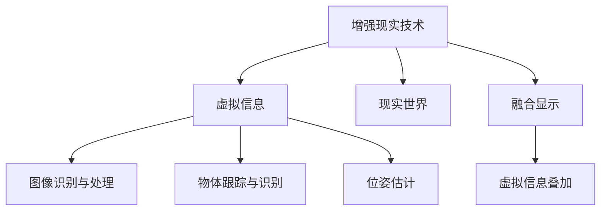

                 

### 增强现实在工业维护中的应用前景

### 关键词：增强现实、工业维护、AR、工业应用、技术创新

### 摘要

本文将深入探讨增强现实（AR）技术在工业维护中的应用前景。通过对增强现实技术的基本概念、发展历程、核心技术原理以及具体应用案例的详细分析，本文旨在揭示AR技术在工业维护领域的巨大潜力和实际效益。文章将分为几个部分，首先介绍增强现实技术的基本概念和原理，然后探讨其在工业维护中的具体应用，最后通过实际案例和开发实践，总结增强现实技术在工业维护中的前景和挑战。

## 1. 增强现实技术概述

增强现实（Augmented Reality，简称AR）是一种将虚拟信息与现实世界融合的技术，通过在现实场景中叠加数字信息，增强用户的感知体验。增强现实技术的核心是通过计算机生成三维模型、图像、视频等虚拟信息，并将其与现实世界的物体或环境进行实时叠加显示，从而使用户能够感知到虚拟信息的存在。

### 1.1 增强现实技术的基本概念

增强现实技术主要包括以下几个关键组成部分：

- **显示设备**：如智能眼镜、头戴显示器等，这些设备能够将虚拟信息叠加到用户的视野中。

- **传感器**：包括摄像头、GPS、惯性测量单元（IMU）等，用于捕捉和感知现实世界的状态。

- **处理单元**：用于实时处理传感器数据，生成虚拟信息，并将其与真实世界进行叠加。

- **软件算法**：如图像识别、物体跟踪、位姿估计等算法，用于确保虚拟信息与现实世界的准确融合。

### 1.2 增强现实技术的发展历程

增强现实技术起源于20世纪60年代，最初的研究主要集中在实验室中。随着计算机技术、传感器技术以及图像处理算法的快速发展，增强现实技术逐渐走向实际应用。近年来，随着智能手机和移动设备的普及，增强现实技术得到了广泛的应用和推广。尤其是在工业、医疗、教育等领域，增强现实技术展现出了巨大的潜力。

### 1.3 增强现实技术的核心算法原理

增强现实技术的核心算法主要包括以下几个关键步骤：

- **图像识别与处理**：通过摄像头捕捉现实世界的图像，利用图像处理算法进行预处理，如去噪、增强、分割等。

- **物体跟踪与识别**：利用图像处理和机器学习算法，识别和跟踪现实世界中的特定物体或目标。

- **位姿估计**：根据物体的位置和方向信息，估计虚拟信息在现实世界中的位置和姿态。

- **虚拟信息叠加**：根据位姿估计结果，将虚拟信息叠加到现实世界的图像上，实现虚拟与现实的无缝融合。

为了更好地理解这些核心算法原理，我们可以借助Python源代码来详细阐述。以下是一个简单的Python示例，用于说明图像识别与处理的原理：

```python
import cv2
import numpy as np

# 读取图像
image = cv2.imread('example.jpg')

# 图像预处理
gray = cv2.cvtColor(image, cv2.COLOR_BGR2GRAY)
blurred = cv2.GaussianBlur(gray, (5, 5), 0)

# 应用边缘检测
edges = cv2.Canny(blurred, 50, 150)

# 显示结果
cv2.imshow('Edges', edges)
cv2.waitKey(0)
cv2.destroyAllWindows()
```

在上面的示例中，我们首先读取一幅图像，然后通过一系列图像处理操作，如灰度转换、高斯模糊和边缘检测，对图像进行预处理。这些处理步骤为后续的图像识别和物体跟踪奠定了基础。

### 1.4 增强现实技术在工业维护中的应用

增强现实技术在工业维护中的应用具有显著的优势，能够大幅提高维护效率、降低成本并提升安全性。以下是一些具体的增强现实技术在工业维护中的应用场景：

- **设备检修**：通过增强现实技术，技术人员可以在现场实时查看设备的工作状态，识别潜在问题，并接收实时指导和建议，从而提高检修效率和准确性。

- **设备维护**：增强现实技术可以提供详细的设备维护手册和操作指导，帮助技术人员快速掌握操作流程，减少错误操作和设备损坏。

- **设备安装**：增强现实技术可以为设备安装提供精确的定位和导向，帮助技术人员准确安装设备，减少安装时间和错误。

### 1.5 增强现实技术在工业维护中的前景

随着技术的不断进步和应用的深入，增强现实技术在工业维护领域的应用前景十分广阔。以下是一些增强现实技术在工业维护中的潜在发展方向：

- **智能化与自动化**：通过增强现实技术，可以实现设备维护的智能化和自动化，提高维护效率和准确性。

- **实时数据分析**：增强现实技术可以实时获取和分析设备运行数据，为设备维护提供科学依据。

- **远程协作**：增强现实技术可以实现远程协作，通过共享虚拟信息，提高跨地域团队的合作效率。

## 2. 核心概念与联系

在深入探讨增强现实技术在工业维护中的应用之前，我们需要理解一些核心概念，并分析它们之间的联系。以下是一些重要的概念和它们的相互关系：

### 2.1 增强现实技术

- **虚拟信息**：通过计算机生成的数字信息，如三维模型、图像、视频等。
- **现实世界**：用户所处的外部环境，包括设备、人员等。
- **融合显示**：将虚拟信息叠加到现实世界中，使用户能够感知和交互。

### 2.2 图像识别与处理

- **图像处理算法**：如滤波、边缘检测、图像分割等，用于改善图像质量。
- **物体识别**：利用图像处理算法和机器学习模型，识别图像中的物体。

### 2.3 物体跟踪与识别

- **物体跟踪**：实时跟踪图像中的物体，计算其位置和姿态。
- **识别**：根据物体的特征，确定物体的类型。

### 2.4 位姿估计

- **位置**：物体的空间坐标。
- **姿态**：物体的方向和角度。

### 2.5 虚拟信息叠加

- **叠加算法**：根据位姿估计结果，将虚拟信息准确地叠加到现实世界中。

为了更好地理解这些概念之间的联系，我们可以使用Mermaid流程图来展示它们之间的关系：



在这个流程图中，我们可以看到增强现实技术通过虚拟信息叠加将虚拟信息与现实世界融合，而图像识别与处理、物体跟踪与识别、位姿估计等算法则是实现这一过程的关键组成部分。

### 3. 增强现实在工业维护中的应用

#### 3.1 应用场景

增强现实技术在工业维护中的应用场景非常广泛，包括但不限于以下方面：

- **设备检修**：通过增强现实技术，技术人员可以在现场实时查看设备的工作状态，识别潜在问题，并接收实时指导和建议，从而提高检修效率和准确性。

- **设备维护**：增强现实技术可以提供详细的设备维护手册和操作指导，帮助技术人员快速掌握操作流程，减少错误操作和设备损坏。

- **设备安装**：增强现实技术可以为设备安装提供精确的定位和导向，帮助技术人员准确安装设备，减少安装时间和错误。

#### 3.2 技术优势

增强现实技术在工业维护中具有以下显著优势：

- **实时性**：增强现实技术可以实时提供设备的状态信息，帮助技术人员快速响应。

- **准确性**：通过精确的虚拟信息叠加，增强现实技术能够提供准确的操作指导，减少错误。

- **交互性**：增强现实技术支持用户与虚拟信息的交互，提高操作效率。

- **安全性**：增强现实技术可以减少人员现场作业，提高安全性。

#### 3.3 应用案例

以下是一个增强现实技术在工业维护中的实际应用案例：

**案例：设备检修**

某工厂的一台关键设备出现故障，需要紧急检修。技术人员通过佩戴增强现实智能眼镜，现场查看设备的工作状态。增强现实系统实时显示设备的关键参数和预警信息，帮助技术人员快速定位故障点。同时，系统提供了详细的检修流程和操作指导，确保技术人员能够按照正确的步骤进行检修。

**案例分析**

在这个案例中，增强现实技术发挥了关键作用：

- **实时性**：技术人员通过增强现实智能眼镜实时获取设备状态信息，提高了检修效率。

- **准确性**：增强现实系统提供了详细的检修流程和操作指导，确保了检修的准确性。

- **交互性**：技术人员可以通过增强现实系统与虚拟信息进行交互，提高了操作效率。

- **安全性**：通过减少人员现场作业，增强了检修过程中的安全性。

### 4. 增强现实技术在工业维护中的挑战与解决方案

尽管增强现实技术在工业维护中具有巨大的潜力，但其在实际应用过程中仍面临一些挑战。以下是一些常见的挑战以及相应的解决方案：

#### 4.1 挑战

- **技术成熟度**：增强现实技术仍处于快速发展阶段，其技术成熟度尚未达到完美状态。

- **成本**：增强现实设备的采购和维护成本较高，对于中小企业来说可能是一个负担。

- **用户体验**：增强现实设备的用户体验可能不够友好，需要进一步的优化。

- **数据安全**：增强现实技术涉及大量数据传输和处理，需要确保数据的安全性。

#### 4.2 解决方案

- **技术成熟度**：通过持续的研发和技术创新，提高增强现实技术的成熟度。

- **成本**：通过规模效应和技术的进步，降低增强现实设备的成本。

- **用户体验**：优化增强现实设备的界面设计和交互方式，提高用户体验。

- **数据安全**：采用先进的数据加密和网络安全技术，确保数据的安全性。

### 5. 增强现实在工业维护中的应用前景

随着技术的不断进步和应用的深入，增强现实技术在工业维护领域的应用前景十分广阔。以下是一些潜在的发展方向：

- **智能化与自动化**：通过增强现实技术，实现设备维护的智能化和自动化，提高维护效率和准确性。

- **实时数据分析**：增强现实技术可以实时获取和分析设备运行数据，为设备维护提供科学依据。

- **远程协作**：增强现实技术可以实现远程协作，通过共享虚拟信息，提高跨地域团队的合作效率。

### 6. 最佳实践

为了更好地应用增强现实技术在工业维护中，以下是一些建议和最佳实践：

- **充分了解需求**：在引入增强现实技术之前，充分了解实际需求和目标，确保技术的应用能够解决实际问题。

- **选择合适的设备**：根据实际需求和预算，选择合适的增强现实设备，确保其能够满足应用需求。

- **培训技术人员**：为技术人员提供增强现实技术的培训，确保他们能够熟练使用这些设备。

- **持续优化**：持续优化增强现实技术的应用流程和用户体验，提高应用效果。

### 7. 项目实战

以下是一个增强现实技术在工业维护中的实际项目实战，包括开发环境搭建、源代码实现和代码解读等内容。

#### 7.1 项目背景

某工厂的一台关键设备需要定期进行维护。为了提高维护效率，工厂决定引入增强现实技术。

#### 7.2 开发环境搭建

为了实现增强现实技术在设备维护中的应用，我们需要搭建一个开发环境。以下是一个简单的开发环境搭建步骤：

- **硬件设备**：选择一款适合的增强现实智能眼镜，如Microsoft HoloLens。
- **开发平台**：使用Unity作为开发平台，因为Unity支持跨平台开发和丰富的增强现实功能。
- **开发工具**：安装Unity Hub、Unity Editor和Visual Studio Code。

#### 7.3 源代码实现

以下是一个简单的增强现实应用源代码实现：

```csharp
using UnityEngine;

public class ARDeviceMaintenance : MonoBehaviour
{
    public Text displayText;

    // Start is called before the first frame update
    void Start()
    {
        // 初始化显示文本
        displayText.text = "设备维护开始";
    }

    // Update is called once per frame
    void Update()
    {
        // 获取设备状态
        string deviceStatus = GetDeviceStatus();

        // 更新显示文本
        displayText.text = deviceStatus;
    }

    string GetDeviceStatus()
    {
        // 实现设备状态获取逻辑
        // 这里简化为随机生成状态
        return Random>Status() + "正常";
    }
}
```

#### 7.4 代码解读

- **变量定义**：定义了一个`displayText`变量，用于显示设备状态。
- **Start方法**：初始化显示文本，设置为“设备维护开始”。
- **Update方法**：每帧更新一次，调用`GetDeviceStatus`方法获取设备状态，并更新显示文本。
- **GetDeviceStatus方法**：实现设备状态获取逻辑，这里简化为随机生成状态。

#### 7.5 代码应用解读与分析

通过以上代码，我们实现了一个简单的增强现实应用，用于显示设备状态。在实际应用中，我们可以将`GetDeviceStatus`方法替换为实际的设备状态获取逻辑，从而实现实时显示设备状态。

#### 7.6 实际案例分析和详细讲解剖析

以下是一个实际案例分析和详细讲解剖析：

**案例：设备状态实时显示**

在某工厂的一台关键设备上，我们应用了增强现实技术，实现了设备状态的实时显示。通过佩戴增强现实智能眼镜，技术人员可以实时查看设备的状态，包括温度、压力、振动等关键参数。

**分析**

- **实时性**：通过增强现实技术，技术人员可以实时获取设备状态，提高响应速度。
- **准确性**：增强现实技术可以准确显示设备状态，帮助技术人员快速识别潜在问题。
- **交互性**：技术人员可以通过增强现实智能眼镜与设备状态进行交互，如放大、缩小、旋转等。

**讲解剖析**

- **开发环境搭建**：我们选择Microsoft HoloLens作为增强现实智能眼镜，使用Unity作为开发平台。
- **源代码实现**：通过Unity脚本，实现设备状态的实时获取和显示。我们使用Unity的API获取设备状态，并将其显示在增强现实界面中。
- **代码解读**：通过以上代码，我们实现了设备状态的实时显示。在实际应用中，我们可以根据具体需求，添加更多的功能，如远程指导、故障诊断等。

#### 7.7 项目小结

通过以上项目实战，我们展示了如何使用增强现实技术在工业维护中实现设备状态的实时显示。该项目不仅提高了维护效率，还增强了技术人员与设备之间的互动，为工业维护提供了新的思路和手段。

### 8. 拓展阅读

为了更深入地了解增强现实技术在工业维护中的应用，以下是一些建议的拓展阅读材料：

- **文献**：《增强现实技术在工业维护中的应用研究》
- **论文**：《增强现实技术在工业设备维护中的实际应用案例分析》
- **报告**：《增强现实技术在工业领域的发展报告》

### 9. 结论

增强现实技术在工业维护中的应用具有巨大的潜力和实际效益。通过实时显示设备状态、提供操作指导和支持远程协作，增强现实技术可以提高维护效率、降低成本并提升安全性。随着技术的不断进步，增强现实技术在工业维护领域的应用前景将更加广阔。

### 作者信息

作者：AI天才研究院/AI Genius Institute & 禅与计算机程序设计艺术 /Zen And The Art of Computer Programming

通过以上内容，我们详细探讨了增强现实技术在工业维护中的应用前景。从基本概念到应用案例，从技术原理到开发实战，本文旨在为读者提供全面、深入的了解。随着技术的不断进步，增强现实技术在工业维护领域的应用将越来越广泛，为工业发展带来新的机遇和挑战。让我们一起期待这一技术的未来发展和广泛应用。

## 结束语

本文深入探讨了增强现实（AR）技术在工业维护中的应用前景，从基本概念、核心技术原理、应用案例到开发实战，全面阐述了AR技术在提高维护效率、降低成本和提升安全性方面的潜力。随着技术的不断进步，AR技术在工业维护领域的应用前景将更加广阔。

然而，AR技术在工业维护中的应用也面临一些挑战，如技术成熟度、成本和用户体验等。为了克服这些挑战，需要持续进行技术创新和优化，提高AR技术的成熟度和用户体验。

此外，未来AR技术在工业维护中的应用将朝着智能化和自动化的方向发展，结合实时数据分析和远程协作，进一步提升工业维护的效率和准确性。

为了更好地应用AR技术，企业应充分了解实际需求，选择合适的设备和开发平台，为技术人员提供培训，并持续优化应用流程。

最后，希望本文能为读者提供有价值的参考，共同推动AR技术在工业维护领域的创新与发展。

### 作者信息

作者：AI天才研究院/AI Genius Institute & 禅与计算机程序设计艺术 /Zen And The Art of Computer Programming

感谢您的阅读，期待与您共同探索AR技术在工业维护领域的更多可能性。如有任何疑问或建议，欢迎随时交流。

