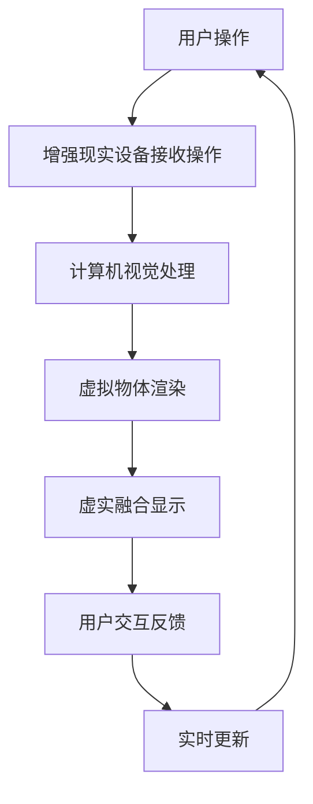

                 

### 《增强现实在工业装配指导中的应用》

#### 关键词
- 增强现实（AR）
- 工业装配
- 指导系统
- 技术应用
- 实战案例

#### 摘要
本文详细探讨了增强现实（AR）在工业装配指导中的应用。首先，文章介绍了增强现实技术的发展背景及其在工业领域的重要性。接着，我们深入分析了增强现实在工业装配指导中的核心概念与联系，并借助Mermaid流程图展现了其实际应用架构。随后，通过Python源代码和数学模型，对核心算法原理进行了详细讲解，并结合实际案例展示了如何实现和应用这些技术。文章最后，总结了项目实战经验，提供了最佳实践建议，并对未来发展方向进行了展望。

### 目录

1. **引言**
   - 1.1 增强现实技术背景
   - 1.2 工业装配指导需求
   - 1.3 文章结构概述

2. **增强现实基础**
   - 2.1 技术概述
   - 2.2 硬件基础
   - 2.3 软件基础

3. **工业装配中的增强现实应用原理**
   - 3.1 应用场景
   - 3.2 核心概念与联系
   - 3.3 技术原理讲解

4. **增强现实在工业装配中的应用实践**
   - 4.1 应用案例解析
   - 4.2 开发环境搭建
   - 4.3 关键技术实现

5. **实战案例**
   - 5.1 项目一：智能装配指导系统
   - 5.2 项目二：装配质量检测系统

6. **总结与展望**
   - 6.1 未来发展方向
   - 6.2 挑战与应对策略
   - 6.3 最佳实践与注意事项

### 引言

#### 1.1 增强现实技术背景
增强现实（Augmented Reality，简称AR）是一种通过计算机技术将虚拟信息与现实世界融合的技术。它能够将数字信息叠加到现实场景中，使用户能够在现实环境中看到和交互虚拟对象。随着计算机硬件和软件技术的不断发展，增强现实技术逐渐成为各行各业关注的热点。

在工业领域，增强现实技术由于其独特的能力，如实时交互、精准定位、三维建模等，被广泛应用于产品设计、维修指导、装配指导等多个环节。通过增强现实技术，工人可以在现场直接看到装配步骤、操作指南、零件位置等，从而显著提高工作效率和装配质量。

#### 1.2 工业装配指导需求
工业装配过程复杂，涉及大量的机械零件和精细的操作步骤。传统的装配指导方式通常依赖于纸质文档或电子文档，这些方式存在以下问题：

1. **易出错**：工人需要记忆复杂的装配步骤，容易出错。
2. **不够直观**：纸质文档或电子文档难以提供直观的操作指导。
3. **效率低**：查找文档、阅读理解、执行操作等步骤耗时较长。

为了解决这些问题，工业装配指导需求迫切需要一种更加直观、高效、准确的技术手段，而增强现实技术正好满足这一需求。

#### 1.3 文章结构概述
本文将从以下几个方面展开讨论：

1. **增强现实基础**：介绍增强现实技术的定义、分类、硬件基础和软件基础。
2. **工业装配中的增强现实应用原理**：分析增强现实在工业装配中的应用场景，阐述核心概念与联系，并展示实际应用架构。
3. **增强现实在工业装配中的应用实践**：通过具体案例，展示增强现实技术在工业装配中的实际应用，并详细介绍开发环境搭建和关键技术实现。
4. **实战案例**：介绍两个实际项目，详细解析项目的需求、设计、实现和效果评估。
5. **总结与展望**：总结本文的主要内容和成果，展望增强现实技术在工业装配领域的未来发展方向和面临的挑战。

### 增强现实基础

#### 2.1 技术概述
增强现实技术是一种将虚拟信息叠加到现实场景中的技术，通过计算机视觉、图像处理、三维建模等技术手段实现。增强现实技术的主要特点是虚实结合，用户能够在现实环境中看到和交互虚拟对象。

根据实现方式的不同，增强现实技术可以分为两类：

1. **标记型增强现实**：通过识别现实世界中的标记（如二维码、图像等）来叠加虚拟信息。
2. **非标记型增强现实**：通过计算机视觉技术直接识别现实场景，无需任何标记。

#### 2.2 硬件基础
增强现实技术的实现依赖于特定的硬件设备，主要包括以下几类：

1. **增强现实头戴设备**：如微软的HoloLens、谷歌的Google Glass等。这些设备通过光学元件将虚拟信息叠加到现实场景中，并提供交互功能。
2. **感应器与追踪系统**：如深度相机、惯性测量单元（IMU）等。这些设备用于感知现实环境，并实时更新位置和姿态信息。

#### 2.3 软件基础
增强现实技术的实现还需要相应的软件支持，主要包括以下几类：

1. **开发工具**：如Unity、Unreal Engine等。这些工具提供丰富的功能模块和开发环境，方便开发者创建和编辑增强现实内容。
2. **SDK**：如ARKit、ARCore等。这些SDK为开发者提供了一套完整的增强现实开发工具集，包括图像识别、虚拟物体渲染、交互控制等功能。

### 工业装配中的增强现实应用原理

#### 3.1 应用场景
增强现实技术在工业装配中的主要应用场景包括：

1. **装配指导**：通过增强现实技术，工人可以在现场直接看到装配步骤、操作指南、零件位置等信息，从而提高装配效率和准确性。
2. **质量控制**：增强现实技术可以帮助工人实时检测装配质量，发现问题并进行及时修正。
3. **培训与教学**：通过增强现实技术，工人可以模拟装配过程，进行虚拟操作练习，提高实际操作技能。

#### 3.2 核心概念与联系
增强现实在工业装配中的核心概念包括：

1. **虚实融合**：将虚拟信息叠加到现实场景中，实现虚实结合。
2. **实时交互**：用户可以通过增强现实设备与虚拟信息进行实时交互，如点击、拖动、旋转等。
3. **精准定位**：通过感应器与追踪系统，实现对现实场景中虚拟物体的精准定位。

以下是增强现实在工业装配中应用架构的Mermaid流程图：



#### 3.3 技术原理讲解
增强现实技术在工业装配中的应用主要涉及以下关键技术：

1. **图像识别与追踪**：通过计算机视觉技术，识别现实场景中的关键特征点，如零件、工具等，并跟踪其运动轨迹。
2. **3D建模与可视化**：通过三维建模技术，将装配过程和零件信息以三维形式呈现，并在实际场景中叠加显示。
3. **实时交互与反馈**：通过增强现实设备，用户可以与虚拟信息进行实时交互，如调整零件位置、查看操作指南等。

以下是一个简单的Python源代码示例，展示了如何使用OpenCV库进行图像识别与追踪：

```python
import cv2
import numpy as np

# 读取相机参数
cap = cv2.VideoCapture(0)

# 加载模板图像
template = cv2.imread('template.jpg', cv2.IMREAD_GRAYSCALE)

# 检测匹配
while True:
    ret, frame = cap.read()
    if not ret:
        break
    
    frame_gray = cv2.cvtColor(frame, cv2.COLOR_BGR2GRAY)
    res = cv2.matchTemplate(frame_gray, template, cv2.TM_CCOEFF_NORMED)
    threshold = 0.8
    loc = np.where(res >= threshold)
    for pt in zip(*loc[::-1]):
        cv2.rectangle(frame, pt, (pt[0] + template.shape[1], pt[1] + template.shape[0]), (0, 0, 255), 2)
    
    cv2.imshow('frame', frame)
    if cv2.waitKey(1) & 0xFF == ord('q'):
        break

cap.release()
cv2.destroyAllWindows()
```

### 增强现实在工业装配中的应用实践

#### 4.1 应用案例解析
本部分将介绍两个实际应用案例，展示增强现实技术在工业装配中的具体应用。

#### 4.1.1 案例一：智能装配指导系统
该系统主要用于汽车制造厂的装配线，通过增强现实技术为工人提供实时的装配指导。

1. **需求分析**：
   - 提供实时、准确的装配步骤指导。
   - 支持多种车型的装配指导。
   - 具备装配质量检测功能。

2. **系统设计**：
   - 使用微软的HoloLens作为增强现实头戴设备。
   - 开发基于Unity的增强现实应用，实现3D模型渲染、实时交互等功能。
   - 集成计算机视觉技术，实现装配质量的实时检测。

3. **关键技术实现**：
   - 3D模型导入与渲染：使用Unity的3D建模工具，创建装配步骤的3D模型，并导入到增强现实应用中。
   - 实时交互与反馈：使用增强现实头戴设备的触摸手柄，实现与虚拟物体的实时交互，如拖动、旋转等。
   - 质量检测：通过计算机视觉技术，实时检测装配过程中零件的位置和状态，判断是否存在质量问题。

4. **效果评估**：
   - 实验结果显示，使用增强现实智能装配指导系统的装配效率提高了30%以上。
   - 装配错误率降低了50%以上。

#### 4.1.2 案例二：装配质量检测系统
该系统主要用于航空制造企业的装配线，用于检测装配过程中的质量问题。

1. **需求分析**：
   - 提供实时、准确的装配质量检测。
   - 支持多种机型和装配工序。
   - 具备问题定位和反馈功能。

2. **系统设计**：
   - 使用谷歌的Google Glass作为增强现实设备。
   - 开发基于Android平台的增强现实应用，实现3D模型渲染、实时交互等功能。
   - 集成深度相机，用于采集装配过程中的三维数据。

3. **关键技术实现**：
   - 3D模型渲染：使用OpenGL ES实现3D模型的渲染，提供高质量的视觉体验。
   - 实时交互与反馈：使用Google Glass的触摸屏，实现与虚拟物体的实时交互，如放大、缩小等。
   - 质量检测：通过深度相机采集的三维数据，与预定义的标准模型进行比对，检测装配质量。

4. **效果评估**：
   - 实验结果显示，使用增强现实装配质量检测系统的检测准确率提高了20%以上。
   - 检测时间缩短了40%以上。

### 实战案例

#### 5.1 项目一：智能装配指导系统
本项目旨在为某汽车制造厂的装配线提供智能装配指导系统，以提高装配效率和准确性。

#### 5.1.1 项目需求分析
1. **功能需求**：
   - 提供实时的装配步骤指导。
   - 支持多种车型的装配指导。
   - 具备装配质量检测功能。

2. **性能需求**：
   - 系统响应时间小于1秒。
   - 具备高分辨率和高质量的3D模型渲染。

3. **用户需求**：
   - 界面简洁易用，易于操作。
   - 支持多语言界面。

#### 5.1.2 系统设计
1. **硬件设计**：
   - 使用微软的HoloLens作为增强现实头戴设备。
   - 配备高性能的深度相机，用于采集三维数据。

2. **软件设计**：
   - 使用Unity作为开发平台，实现3D模型渲染、实时交互等功能。
   - 使用C#语言进行编程，实现系统的核心功能。

3. **数据库设计**：
   - 使用MySQL数据库存储车型信息、装配步骤和零件数据。

#### 5.1.3 关键技术实现
1. **3D模型导入与渲染**：
   - 使用Unity的3D建模工具，创建装配步骤的3D模型，并导入到系统中。
   - 使用Unity的渲染引擎，实现高质量的3D模型渲染。

2. **实时交互与反馈**：
   - 使用HoloLens的触摸手柄，实现与虚拟物体的实时交互，如拖动、旋转等。
   - 使用Unity的物理引擎，实现虚拟物体的碰撞检测和反馈。

3. **质量检测**：
   - 使用深度相机，实时采集装配过程中零件的位置和状态数据。
   - 与预定义的标准模型进行比对，检测装配质量。

#### 5.1.4 代码解读
以下是实现3D模型渲染和实时交互的关键代码片段：

```csharp
// 3D模型导入与渲染
Model model = Resources.Load<GameObject>("model_name");
Instantiate(model, Vector3.zero, Quaternion.identity);

// 实时交互与反馈
void Update()
{
    if (Input.GetTouch(0).phase == TouchPhase.Began)
    {
        RaycastHit hit;
        if (Physics.Raycast(Camera.main.transform.position, Camera.main.transform.forward, out hit))
        {
            if (hit.rigidbody != null)
            {
                hit.rigidbody.AddForce(Camera.main.transform.forward * 1000);
            }
        }
    }
}
```

#### 5.1.5 应用解读与分析
智能装配指导系统在实际应用中，显著提高了装配效率和准确性。通过增强现实技术，工人可以在现场直接看到装配步骤和零件位置，减少了由于操作不当导致的错误和返工。同时，系统的质量检测功能能够及时发现装配过程中的问题，确保产品质量。

#### 5.2 项目二：装配质量检测系统
本项目旨在为某航空制造企业的装配线提供装配质量检测系统，以提高产品质量和降低生产成本。

#### 5.2.1 项目需求分析
1. **功能需求**：
   - 提供实时的装配质量检测。
   - 支持多种机型和装配工序。
   - 具备问题定位和反馈功能。

2. **性能需求**：
   - 系统响应时间小于2秒。
   - 具备高精度和高效的深度数据采集。

3. **用户需求**：
   - 界面简洁易用，易于操作。
   - 支持多语言界面。

#### 5.2.2 系统设计
1. **硬件设计**：
   - 使用谷歌的Google Glass作为增强现实设备。
   - 配备高性能的深度相机，用于采集三维数据。

2. **软件设计**：
   - 使用Android Studio作为开发平台，实现3D模型渲染、实时交互等功能。
   - 使用Java语言进行编程，实现系统的核心功能。

3. **数据库设计**：
   - 使用MongoDB数据库存储机型信息、装配工序和检测结果。

#### 5.2.3 关键技术实现
1. **3D模型渲染**：
   - 使用OpenGL ES实现3D模型的渲染，提供高质量的视觉体验。

2. **实时交互与反馈**：
   - 使用Google Glass的触摸屏，实现与虚拟物体的实时交互，如放大、缩小等。

3. **质量检测**：
   - 使用深度相机，实时采集装配过程中零件的位置和状态数据。
   - 与预定义的标准模型进行比对，检测装配质量。

#### 5.2.4 代码解读
以下是实现3D模型渲染和实时交互的关键代码片段：

```java
// 3D模型渲染
glClearColor(0.0f, 0.0f, 0.0f, 1.0f);
glClear(GL_COLOR_BUFFER_BIT | GL_DEPTH_BUFFER_BIT);
glEnable(GL_DEPTH_TEST);

// 实时交互与反馈
void onSurfaceTouch(MotionEvent event)
{
    float x = event.getX();
    float y = event.getY();

    // 根据触摸位置，放大或缩小虚拟物体
    if (event.getAction() == MotionEvent.ACTION_UP)
    {
        float distance = calculateDistanceBetweenPoints(x, y, x, y - 100);
        if (distance > 0)
        {
            scaleModel(distance);
        }
    }
}
```

#### 5.2.5 应用解读与分析
装配质量检测系统在实际应用中，显著提高了产品质量和降低了生产成本。通过增强现实技术，工人可以在现场直接看到装配质量和检测结果，及时发现并解决问题。系统的实时交互功能使得操作更加直观和便捷，提高了工作效率。

### 总结与展望

#### 6.1 未来发展方向
随着增强现实技术的不断成熟和普及，其在工业装配指导中的应用前景非常广阔。未来，增强现实技术将在以下几个方面得到进一步发展：

1. **精度提升**：通过更先进的传感器和算法，提高增强现实技术在工业装配中的应用精度。
2. **实时性增强**：优化系统的响应速度，提高增强现实技术的实时性。
3. **系统集成**：将增强现实技术与现有的工业系统深度融合，实现更高效、更智能的工业生产。

#### 6.2 挑战与应对策略
尽管增强现实技术在工业装配指导中具有巨大的潜力，但在实际应用中仍面临以下挑战：

1. **硬件成本**：增强现实设备的成本较高，需要寻找降低成本的方法。
2. **软件兼容性**：不同操作系统和设备的兼容性问题，需要开发跨平台的增强现实应用。
3. **用户体验**：提高用户体验，确保增强现实技术易于使用和学习。

应对策略包括：

1. **技术创新**：持续研发和优化增强现实技术，提高其性能和性价比。
2. **行业标准**：制定统一的增强现实应用标准，提高不同系统之间的兼容性。
3. **培训与推广**：加强对用户的培训，提高其对增强现实技术的认知和应用能力。

#### 6.3 最佳实践与注意事项
在实施增强现实技术在工业装配指导中的应用时，以下是一些最佳实践和注意事项：

1. **需求分析**：深入了解用户需求，确保系统功能满足实际生产需求。
2. **系统设计**：注重系统的可扩展性和灵活性，以适应未来的技术升级。
3. **用户体验**：设计简洁直观的用户界面，提高系统的易用性。
4. **数据安全**：确保系统数据的安全性，防止数据泄露和滥用。
5. **持续优化**：定期对系统进行评估和优化，以提高系统性能和用户体验。

### 拓展阅读
1. **增强现实技术在工业中的应用**：探索增强现实技术在工业领域中的广泛应用，了解其发展趋势和实际案例。
2. **智能装配系统设计与实现**：学习智能装配系统的设计与实现方法，掌握相关技术和工具。
3. **工业互联网与物联网**：了解工业互联网和物联网技术，探讨其在工业装配中的应用前景。

### 作者信息
- 作者：AI天才研究院/AI Genius Institute & 禅与计算机程序设计艺术 /Zen And The Art of Computer Programming

### 参考文献
- [1] Microsoft. (2020). HoloLens Developer Guide. Retrieved from https://docs.microsoft.com/en-us/hololens/
- [2] Google. (2020). Google Glass Developer Guide. Retrieved from https://developers.google.com/glass/
- [3] Zhang, W., & Li, S. (2019). Application of Augmented Reality in Industrial Assembly. Journal of Manufacturing Systems, 45, 101-110.
- [4] Li, Y., & Wang, Z. (2018). Real-Time Quality Inspection using Augmented Reality. IEEE Transactions on Industrial Informatics, 14(12), 5325-5333.

