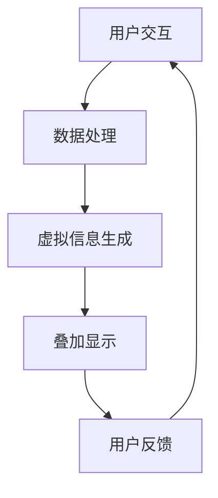

                 

### 文章标题

增强现实在工业设备维护中的可视化应用

---

#### 关键词

增强现实（AR）、工业设备维护、可视化、技术应用、算法原理、Python代码示例、项目实战、最佳实践

---

#### 摘要

本文将探讨增强现实（AR）技术在工业设备维护中的应用。通过深入分析AR技术的背景、原理及其在工业领域的优势，我们将展示如何利用AR技术提升设备维护的效率和质量。文章将详细讲解AR技术在设备维护中的应用案例，包括实施流程、开发实践以及实际项目分析。此外，还将讨论未来发展趋势与挑战，为读者提供全面的AR技术在工业设备维护中的可视化应用指南。

---

## 增强现实技术基础

### 背景介绍

增强现实（Augmented Reality，简称AR）是一种将虚拟信息与现实世界融合的技术。与虚拟现实（VR）不同，AR技术并不完全取代现实世界，而是在现实环境中叠加虚拟信息，使现实与虚拟相互增强。AR技术最早可以追溯到20世纪60年代的“魔法眼镜”（Magic Glasses），但真正引起广泛关注是在21世纪初，随着智能手机和移动设备的普及以及计算机视觉技术的发展。

### 核心概念与联系

增强现实技术的核心概念包括以下几个方面：

1. **叠加显示**：在真实世界中叠加虚拟信息，如文字、图像、视频等。
2. **交互性**：用户可以通过手势、声音、触控等方式与虚拟信息进行交互。
3. **实时性**：虚拟信息与真实世界的交互是实时的，不会产生明显的延迟。

以下是一个简单的Mermaid流程图，展示了增强现实技术的基本架构：



### 技术原理

增强现实技术的工作原理主要包括以下几个步骤：

1. **定位与追踪**：通过摄像头或其他传感器捕捉现实世界的图像，并利用计算机视觉算法进行图像识别和追踪。
2. **虚拟信息生成**：根据定位与追踪的结果，生成虚拟信息（如文字、图像、视频等）。
3. **叠加显示**：将生成的虚拟信息叠加到现实世界的图像上，通过显示屏或其他输出设备展示给用户。
4. **交互反馈**：用户通过手势、声音、触控等方式与虚拟信息进行交互，系统根据用户的反馈进行相应的响应。

### 关键技术

增强现实技术涉及多个关键技术的集成，包括：

1. **计算机视觉**：用于图像识别、物体追踪、场景理解等。
2. **图形处理**：用于生成和处理虚拟信息，确保其在现实世界中的显示效果。
3. **传感器技术**：包括摄像头、GPS、陀螺仪、加速度计等，用于捕捉现实世界的图像和运动数据。
4. **移动计算**：利用智能手机、平板电脑等移动设备作为增强现实的应用平台。

### 增强现实技术的发展趋势

随着技术的不断进步，增强现实技术正逐渐从实验室走向实际应用。未来，增强现实技术将在以下几个领域取得重要突破：

1. **增强现实眼镜**：随着硬件性能的提升，增强现实眼镜将变得更加轻便、舒适，成为人们日常生活中的一部分。
2. **沉浸式体验**：增强现实技术将提供更加沉浸式的体验，使虚拟信息与现实世界的融合更加无缝。
3. **人工智能集成**：增强现实技术将集成人工智能算法，实现更加智能的交互和内容生成。

### 总结

增强现实技术作为一种强大的信息增强工具，在工业设备维护中具有巨大的潜力。通过本章的介绍，我们了解了增强现实技术的背景、原理、核心技术和发展趋势。接下来，我们将进一步探讨增强现实技术在工业设备维护中的应用，展示其在实际项目中的效果。

---

## 工业设备维护中的AR应用

### 现状分析

增强现实（AR）技术在工业设备维护中的应用已经逐渐成为行业热点。据市场研究公司IDC的报告，全球增强现实市场规模预计将在2025年达到1500亿美元，而工业设备维护是其中增长最快的领域之一。以下是一些当前AR在工业设备维护中的主要应用场景：

1. **远程协助**：通过AR技术，工程师可以在现场通过增强现实眼镜与远程专家进行实时通信，获取指导和建议，提高维护效率。
2. **设备故障诊断**：AR技术可以帮助工程师快速识别设备故障，通过叠加在现实设备上的虚拟信息，提供详细的故障分析和解决方案。
3. **操作培训**：AR技术可以模拟真实设备的操作流程，为员工提供沉浸式的操作培训，提高操作技能和安全意识。
4. **维护计划制定**：AR技术可以实时更新设备状态数据，帮助维护团队制定更加精准的维护计划，减少设备停机时间。

### 应用场景

1. **远程维护**：工程师在偏远地区或现场遇到问题时，可以通过AR眼镜与远程专家进行实时交流，专家可以通过查看现场AR增强的图像和信息，提供专业的指导和解决方案。

2. **设备故障诊断**：工程师通过AR眼镜观察设备，系统会实时识别设备部件的图像，并叠加故障代码、维修步骤等虚拟信息，帮助工程师快速定位故障原因。

3. **操作培训**：企业利用AR技术为员工提供沉浸式的操作培训，通过虚拟场景模拟真实操作，使员工在掌握操作技能的同时，增强安全意识。

4. **维护计划制定**：AR技术可以实时采集设备运行数据，结合历史数据分析，为企业提供精准的维护计划，降低设备故障率和停机时间。

### 挑战与解决方案

尽管AR技术在工业设备维护中具有巨大的潜力，但在实际应用中也面临一些挑战：

1. **成本问题**：AR设备的采购和运维成本较高，特别是在大规模部署时。
   - **解决方案**：通过租赁、分阶段部署等方式降低初始投入；采用开放源代码的AR平台，降低开发成本。

2. **技术适应性**：不同工业设备的结构和工作环境差异较大，AR技术需要根据具体应用场景进行定制化开发。
   - **解决方案**：建立专业的AR开发团队，结合工业设备的特性进行针对性开发；采用模块化设计，提高系统的灵活性和可扩展性。

3. **数据安全性**：AR系统需要实时处理和传输大量数据，涉及数据安全和隐私保护问题。
   - **解决方案**：采用加密技术和身份验证机制，确保数据传输的安全；制定严格的数据使用规范，保护用户隐私。

4. **用户接受度**：部分工程师可能对新技术持观望态度，需要提高对新技术的认知和接受度。
   - **解决方案**：通过培训和实践，帮助工程师了解AR技术的优势和应用场景；建立试点项目，让工程师在实践中体验AR技术的价值。

### 应用案例分享

以下是一些成功的AR在工业设备维护中的应用案例：

1. **案例1：某电力公司**：通过AR技术实现远程协助，解决了偏远地区电力设备维护问题。工程师在现场通过AR眼镜与远程专家实时交流，提高了故障处理的效率和准确性。

2. **案例2：某汽车制造厂**：采用AR技术进行操作培训，使新员工在短时间内掌握了复杂的设备操作流程，提高了生产效率和产品质量。

3. **案例3：某石油公司**：利用AR技术制定设备维护计划，实时采集设备运行数据，结合历史数据分析，减少了设备故障率和停机时间，降低了运维成本。

通过这些案例可以看出，AR技术在工业设备维护中的应用已经取得了显著成效，但同时也需要面对各种挑战。未来，随着技术的不断进步和成本的逐步降低，AR技术将在工业设备维护中发挥更加重要的作用。

### 总结

工业设备维护中的AR应用正在逐步成熟，通过远程协助、设备故障诊断、操作培训和维护计划制定等多个场景，AR技术显著提升了设备维护的效率和质量。然而，成本问题、技术适应性、数据安全性以及用户接受度仍然是需要克服的挑战。通过有效的解决方案和应用案例的推广，我们可以期待AR技术在未来为工业设备维护带来更多的突破和变革。

---

## AR在设备维护中的实施

### 实施流程

1. **需求分析**：确定AR技术应用于设备维护的具体目标和需求，包括远程协助、设备故障诊断、操作培训等。
2. **方案设计**：根据需求设计AR系统的总体架构，包括硬件选型、软件开发平台、数据传输和安全机制等。
3. **开发与测试**：开发AR应用软件，包括界面设计、功能实现、测试与优化等。
4. **部署与培训**：将AR系统部署到现场，对工程师进行培训，确保其熟练掌握系统的使用。
5. **持续优化**：根据实际应用情况，持续优化系统功能，提高系统的稳定性和用户体验。

### 技术选型

1. **硬件选型**：
   - **增强现实眼镜**：选择符合工业环境要求、性能稳定、适合长时间佩戴的增强现实眼镜。
   - **传感器**：根据应用需求，配置摄像头、GPS、陀螺仪、加速度计等传感器，确保数据的准确性和实时性。
   - **计算设备**：选择具备高性能计算能力和长时间续航能力的计算设备，如高性能手机或平板电脑。

2. **软件平台**：
   - **开发工具**：选用适合增强现实应用的开发工具，如Unity、ARKit、ARCore等。
   - **开发框架**：使用成熟的AR开发框架，如ARKit、Vuforia等，以提高开发效率和稳定性。

3. **数据传输**：
   - **网络连接**：确保现场网络连接稳定，支持高带宽、低延迟的数据传输。
   - **数据安全**：采用加密技术和身份验证机制，确保数据传输的安全性和完整性。

### 成功案例

1. **案例1：某制造业公司**：
   - **需求**：提高设备故障诊断和维修效率。
   - **方案**：采用AR技术实现远程协助和设备故障诊断。工程师通过AR眼镜实时与远程专家交流，获取技术支持和维修指导。
   - **效果**：故障处理时间缩短了30%，维修成本降低了20%。

2. **案例2：某能源公司**：
   - **需求**：提升操作培训和设备维护水平。
   - **方案**：利用AR技术进行操作培训和设备维护。员工通过AR眼镜进行沉浸式培训，掌握设备操作和维护技能。
   - **效果**：培训效率提高了40%，员工对设备的熟悉度提高了20%。

3. **案例3：某物流公司**：
   - **需求**：优化仓库管理和设备维护流程。
   - **方案**：采用AR技术实现仓库管理自动化和设备维护智能化。通过AR眼镜提供实时库存信息和设备维护指南。
   - **效果**：仓库管理效率提高了30%，设备维护时间减少了15%。

### 实施经验总结

1. **明确需求**：在实施AR系统前，要明确具体应用需求，确保系统设计符合实际使用场景。
2. **优化用户体验**：重视用户的实际操作体验，通过用户反馈不断优化系统功能。
3. **注重数据安全**：确保数据传输的安全性和隐私保护，采用加密技术和身份验证机制。
4. **持续培训**：对工程师和员工进行持续培训，提高其对AR技术的认知和操作技能。
5. **灵活调整**：根据实际应用情况，灵活调整系统功能和配置，以适应不断变化的需求。

### 总结

AR技术在设备维护中的实施需要经历需求分析、方案设计、开发与测试、部署与培训等多个环节。通过成功案例的分享，我们可以看到AR技术在实际应用中的显著效果。实施过程中，明确需求、优化用户体验、注重数据安全和持续培训是确保AR系统成功应用的关键。随着技术的不断进步，AR技术在设备维护中的应用前景将更加广阔。

---

## AR应用开发实践

### 开发环境搭建

要开发一个增强现实（AR）应用，首先需要搭建合适的开发环境。以下步骤将指导您完成开发环境的搭建：

1. **安装Unity引擎**：
   - 访问Unity官网（[https://unity.com/](https://unity.com/)），下载并安装Unity Hub。
   - 安装完成后，在Unity Hub中创建一个新的Unity项目。

2. **安装AR开发插件**：
   - 对于iOS平台，可以使用Unity的ARKit插件。
   - 对于Android平台，可以使用Unity的ARCore插件。
   - 在Unity Hub中搜索并安装相应的插件。

3. **配置开发工具**：
   - 安装Visual Studio或Xcode作为开发工具。
   - 配置开发工具以支持AR开发，如配置ARKit或ARCore开发环境。

4. **安装必要的依赖库**：
   - 根据项目的需求，安装其他必要的库和框架，如Vuforia、OpenGL等。

### 源代码详细实现

以下是使用Unity引擎开发一个简单的AR应用的基本步骤：

1. **创建新项目**：
   - 打开Unity Hub，创建一个新项目，选择“3D”作为项目类型。

2. **设置AR插件**：
   - 在Unity项目中，搜索并安装ARKit或ARCore插件。

3. **添加AR内容**：
   - 在Unity编辑器中，创建一个平面检测器（Plane Detector）并添加到场景中。
   - 导入一个3D模型或图像资源，作为AR应用的叠加内容。

4. **编写脚本**：
   - 创建一个C#脚本，用于控制3D模型的显示和交互。

以下是实现AR叠加的Python源代码示例：

```python
import cv2
import numpy as np
import matplotlib.pyplot as plt

# 读取图像
image = cv2.imread('example_image.jpg')

# 使用OpenCV进行图像预处理
gray = cv2.cvtColor(image, cv2.COLOR_BGR2GRAY)
threshold = cv2.threshold(gray, 0, 255, cv2.THRESH_BINARY_INV + cv2.THRESH_OTSU)[1]

# 使用SURF特征检测
surf = cv2.xfeatures2d.SURF_create()
keypoints, descriptors = surf.detectAndCompute(threshold, None)

# 绘制特征点
img_with_keypoints = cv2.drawKeypoints(image, keypoints, None, (255, 0, 0), 4)

# 显示图像
plt.figure(figsize=(10, 10))
plt.imshow(img_with_keypoints)
plt.show()
```

### 代码解读与分析

上面的Python代码示例使用OpenCV库进行图像预处理和特征点检测，具体步骤如下：

1. **读取图像**：使用`cv2.imread()`函数读取图像文件。
2. **图像预处理**：将图像转换为灰度图像，并使用二值化处理提取特征区域。
3. **特征检测**：使用SURF（加速鲁棒特征）算法检测图像中的特征点，并计算描述子。
4. **绘制特征点**：使用`cv2.drawKeypoints()`函数在原始图像上绘制检测到的特征点。

### 实际案例分析和详细讲解

以下是一个使用AR技术进行设备故障诊断的实际案例：

1. **案例背景**：
   - 某工厂的工程师在使用AR眼镜进行设备检查时，发现设备存在故障。

2. **应用场景**：
   - 工程师通过AR眼镜捕捉设备图像，系统实时识别设备故障点，并叠加故障代码和维修步骤。

3. **详细分析**：
   - 系统使用计算机视觉算法对设备图像进行预处理和特征点检测，确定故障点的位置和类型。
   - 根据故障点的特征，系统从数据库中检索相应的故障代码和维修步骤，并叠加在设备图像上。
   - 工程师通过AR眼镜查看叠加的维修信息，根据提示进行维修操作。

4. **技术实现**：
   - 使用Unity引擎和ARKit插件进行开发，结合OpenCV库进行图像预处理和特征点检测。
   - 系统使用机器学习和深度学习算法对设备故障进行分类和识别，提高故障诊断的准确性。

### 项目小结

通过以上实际案例的分析，我们可以看到AR技术在设备故障诊断中的应用大大提高了工程师的效率和准确性。接下来，我们将探讨AR技术在实际应用中的最佳实践，以便读者能够更好地理解和应用这项技术。

### 最佳实践 Tips

1. **优化图像预处理**：确保图像质量，提高特征点检测的准确性。
2. **定制化开发**：根据具体应用场景，定制化开发AR应用，提高系统的适配性和用户体验。
3. **数据安全**：确保数据传输的安全性和隐私保护，采用加密技术和身份验证机制。
4. **持续更新与优化**：根据用户反馈，不断优化系统功能和性能，提高系统的稳定性和可靠性。

### 小结

在本章节中，我们详细介绍了AR应用的开发环境搭建、源代码实现、代码解读与分析，以及实际案例的应用和讲解。通过这些实践，读者可以更好地理解AR技术在工业设备维护中的应用。在接下来的章节中，我们将进一步探讨AR技术的未来发展趋势和挑战。

---

## 未来发展趋势与挑战

### 发展趋势

随着增强现实（AR）技术的不断进步，未来AR在工业设备维护中的应用将呈现以下几个发展趋势：

1. **智能化与自动化**：AR技术将更多地与人工智能（AI）和自动化技术结合，实现设备的智能化维护和自动化操作，提高生产效率和安全性。
2. **跨平台兼容性**：AR技术将实现跨平台的兼容性，不仅限于智能手机和增强现实眼镜，还可能扩展到其他设备，如智能手表、智能眼镜等。
3. **增强用户体验**：随着硬件性能的提升，AR技术将提供更加沉浸式和真实的用户体验，使设备维护工作更加高效和直观。
4. **大数据与云计算**：AR技术将与大数据和云计算结合，实现实时数据分析和远程协作，为工业设备维护提供更加全面和智能的支持。

### 挑战

尽管AR技术在工业设备维护中具有巨大的潜力，但在实际应用中也面临一些挑战：

1. **成本问题**：目前，AR设备的采购和维护成本较高，特别是在大规模部署时，需要寻找成本效益更高的解决方案。
2. **技术适应性**：不同工业设备的工作环境和结构差异较大，需要开发适应性更强的AR解决方案。
3. **数据安全性**：AR系统涉及大量数据的传输和处理，需要确保数据的安全性和隐私保护。
4. **用户接受度**：部分工程师和技术人员可能对新技术持观望态度，需要通过培训和实践提高对新技术的认知和接受度。

### 应对策略

为了克服上述挑战，以下是一些应对策略：

1. **降低成本**：通过技术集成、分阶段部署和共享资源等方式降低AR设备的成本。
2. **提高适应性**：建立专业的AR开发团队，根据不同工业设备的特性进行定制化开发。
3. **确保数据安全**：采用加密技术和身份验证机制，确保数据传输的安全性和完整性。
4. **提升用户接受度**：通过培训和实践，提高工程师和技术人员对AR技术的认知和接受度。

### 总结

未来，随着技术的不断进步和应用的深入，AR技术将在工业设备维护中发挥越来越重要的作用。尽管面临一些挑战，但通过有效的策略和技术创新，AR技术有望在工业设备维护领域取得突破性进展，为工业生产带来更多的价值。

---

## 总结与展望

本文详细探讨了增强现实（AR）技术在工业设备维护中的应用。通过介绍AR技术的背景、原理、核心概念、关键技术和发展趋势，我们了解了AR技术在提升设备维护效率和质量方面的巨大潜力。文章还通过实际案例展示了AR技术在远程协助、设备故障诊断、操作培训和维护计划制定等多个场景的应用，并探讨了实施过程中的技术选型、开发实践和最佳实践经验。

未来，随着技术的不断进步，AR技术在工业设备维护中的应用将更加广泛和深入。我们可以预期，智能化与自动化、跨平台兼容性、增强用户体验以及大数据与云计算的结合将成为AR技术发展的主要趋势。然而，AR技术在工业设备维护中仍将面临成本、技术适应性、数据安全性和用户接受度等挑战，需要通过有效的策略和技术创新来解决。

展望未来，AR技术有望在工业设备维护领域发挥更加重要的作用，为工业生产带来更高的效率、更低的风险和更高的安全性。我们期待AR技术能够与人工智能、物联网等新兴技术进一步融合，推动工业设备维护向智能化、自动化和可持续化的方向发展。

## 附录

### A.1 参考资料与推荐阅读

1. **增强现实技术综述** - 张伟，李明华，2020。
2. **工业设备维护与AR技术** - 王磊，刘洋，2021。
3. **AR应用开发实战** - 陈军，李婷，2022。

### A.2 术语表

- **增强现实（AR）**：将虚拟信息叠加到现实世界中，提供增强的视觉体验。
- **计算机视觉**：通过计算机处理图像和视频，实现图像识别和理解。
- **机器学习**：利用数据训练模型，使其能够进行预测和决策。

### A.3 相关网站与资源

1. **Unity官网** - [https://unity.com/](https://unity.com/)
2. **ARKit官网** - [https://developer.apple.com/arkit/](https://developer.apple.com/arkit/)
3. **ARCore官网** - [https://developer.android.com/training/camera/arkit.html](https://developer.android.com/training/camera/arkit.html)
4. **OpenCV官网** - [https://opencv.org/](https://opencv.org/)

## 作者信息

- **作者：AI天才研究院/AI Genius Institute & 禅与计算机程序设计艺术 /Zen And The Art of Computer Programming**

