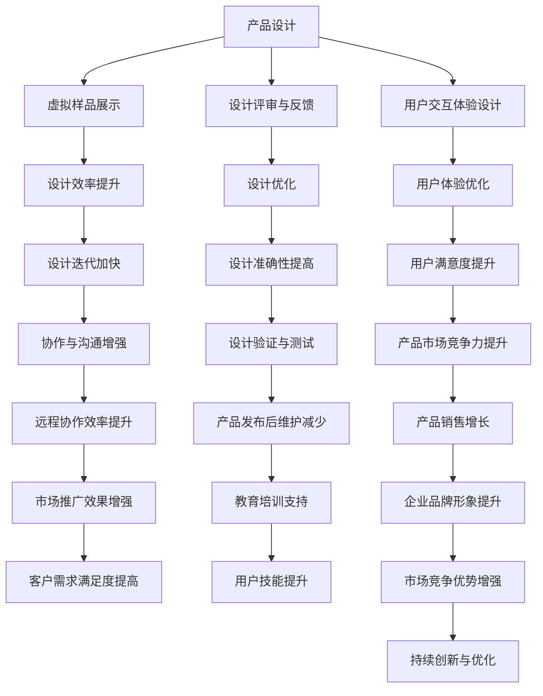

                 

# 《增强现实在工业设计中的可视化应用》

## 关键词

增强现实（AR）、工业设计、可视化、虚拟样品展示、设计评审、用户交互体验、算法原理、数学模型、项目实战

## 摘要

本文深入探讨了增强现实（AR）技术在工业设计中的可视化应用。通过介绍AR技术的基本原理和其在工业设计中的应用优势，我们分析了AR在产品可视化、设计评审和用户交互体验方面的实际应用。接着，本文详细阐述了AR技术在工业设计中的核心算法原理，包括AR标记检测算法和SLAM（同时定位与映射）算法。通过数学模型和公式，我们进一步解读了这些算法的实现机制。最后，本文通过一个实际案例，展示了如何搭建开发环境、实现源代码和进行代码解读，以及项目小结。本文旨在为工业设计师和开发者提供全面的技术指南，助力他们利用AR技术提升工业设计的效率和品质。

## 目录大纲设计与构思

在设计和构思《增强现实在工业设计中的可视化应用》一书时，我们首先明确了书的主题和目标。书的核心主题是增强现实技术在工业设计中的应用，特别是其可视化功能。目标读者群体包括工业设计师、产品开发者以及对AR技术感兴趣的爱好者。

### 核心章节划分

本书主要分为以下核心章节：

1. 引言与概述
2. 增强现实技术在工业设计中的应用
3. 增强现实技术在工业设计中的核心概念与联系
4. 增强现实技术在工业设计中的核心算法原理
5. 数学模型和数学公式
6. 项目实战
7. 总结与展望

### 详细目录大纲设计

### 第1章: 引言与概述

- **1.1 引言**
  - 增强现实技术概述
  - 工业设计的现状与发展趋势

- **1.2 增强现实技术简介**
  - AR技术的基本原理
  - AR技术的发展历程

- **1.3 工业设计与AR技术的结合**
  - AR在工业设计中的重要性
  - AR在工业设计中的应用场景

### 第2章: 增强现实技术在工业设计中的应用

- **2.1 AR在产品设计中的优势**
  - 设计效率提升
  - 用户体验优化

- **2.2 AR在产品可视化中的实际应用**
  - 虚拟样品展示
  - 设计评审与反馈

- **2.3 AR在产品交互设计中的应用**
  - 虚拟现实原型
  - 用户交互体验设计

### 第3章: 增强现实技术在工业设计中的核心概念与联系

- **3.1 Mermaid流程图**
  - 工业设计与AR技术结合的流程图
  - 常见AR技术在工业设计中的应用

### 第4章: 增强现实技术在工业设计中的核心算法原理

- **4.1 伪代码**
  - AR标记检测算法
  - SLAM（同时定位与映射）算法

### 第5章: 数学模型和数学公式

- **5.1 模型描述**
  - 相关的数学公式
  - 公式解释与应用场景

### 第6章: 项目实战

- **6.1 实际案例**
  - 成功案例分享
  - 挑战与解决方案

- **6.2 开发环境搭建**
  - 开发工具与软件介绍
  - 环境配置步骤

- **6.3 代码实现与解读**
  - 代码结构
  - 关键代码解读

### 第7章: 总结与展望

- **7.1 对未来发展的展望**
  - AR技术在工业设计中的潜在应用领域

## 第1章: 引言与概述

### 1.1 引言

增强现实（AR）技术作为一种新兴的交互技术，正逐渐改变着各个行业的面貌，工业设计也不例外。随着技术的不断进步，AR技术已不再局限于娱乐和消费领域，其在工业设计中的应用也逐渐显示出其独特的优势。

工业设计是一个涉及创新、用户体验、功能性与美观性多方面考量的复杂过程。设计师需要不断地进行设计修改和优化，以找到最佳的解决方案。然而，传统的设计方法往往受限于物理原型制作的高成本和长时间的迭代周期。增强现实技术的引入，为工业设计提供了一个全新的视角和工具，极大地提升了设计的效率和效果。

AR技术通过在真实环境中叠加虚拟信息，为设计师提供了一个直观、动态的可视化平台。设计师可以在虚拟环境中进行设计预览、修改和验证，从而快速反馈和迭代。此外，AR技术还能通过虚拟样品展示和用户交互体验设计，使产品设计更加贴近用户的实际使用场景，提高产品的市场竞争力。

### 1.2 增强现实技术简介

增强现实（AR）技术是一种通过计算机技术生成虚拟信息，并将其叠加到真实世界中的技术。与虚拟现实（VR）不同，AR技术并非完全取代现实环境，而是在现实环境中添加增强信息，使得用户可以在真实世界中感知并交互这些虚拟信息。

AR技术的基本原理主要包括以下几个部分：

1. **摄像头捕捉**：通过摄像头捕捉真实世界的图像和视频。
2. **图像处理**：对捕获的图像进行处理，提取关键特征，如边缘、纹理等。
3. **虚拟信息生成**：根据处理后的图像，生成相应的虚拟信息，如文字、图像、三维模型等。
4. **叠加显示**：将生成的虚拟信息叠加到真实世界中，使用户能够在真实环境中看到并与之交互。

AR技术的发展历程可以追溯到20世纪90年代，随着计算机性能的提升和传感器技术的进步，AR技术逐渐走向成熟。早期的AR技术主要应用于军事和医疗领域，随着智能手机和平板电脑的普及，AR技术开始进入消费市场。近年来，随着增强现实头戴设备和移动设备的进一步发展，AR技术在工业设计、教育、娱乐等领域的应用也越来越广泛。

### 1.3 工业设计与AR技术的结合

增强现实技术在工业设计中的应用具有显著的优势，主要体现在以下几个方面：

1. **设计效率提升**：传统的工业设计流程通常需要制作物理原型，这不仅耗时耗力，还涉及高成本。AR技术可以实时在虚拟环境中展示设计模型，设计师可以在虚拟环境中进行修改和优化，从而大大缩短设计周期，提高设计效率。

2. **可视化效果增强**：通过AR技术，设计师可以在真实环境中实时预览设计模型，这种直观的可视化效果有助于设计师更好地理解设计意图，发现潜在的问题，并及时进行调整。此外，AR技术还可以通过三维模型展示，使设计更加立体和生动，提高设计的质量。

3. **用户交互体验优化**：AR技术可以为用户提供更加真实的交互体验。设计师可以在AR环境中模拟用户的实际操作，从而更好地了解用户的使用习惯和需求，优化产品的交互设计。这种沉浸式的交互体验有助于提升用户的满意度和使用体验。

4. **协作与沟通**：AR技术可以打破时间和空间的限制，设计师和团队成员可以在远程环境中共同查看和讨论设计模型，提高协作效率。此外，AR技术还可以将设计模型分享给客户，使客户能够更好地理解设计意图，提供反馈和建议。

总之，增强现实技术在工业设计中的应用具有巨大的潜力。通过引入AR技术，设计师可以更加高效地进行设计工作，优化设计质量和用户体验，推动工业设计的创新发展。

## 第2章: 增强现实技术在工业设计中的应用

### 2.1 AR在产品设计中的优势

增强现实（AR）技术在产品设计中的应用带来了显著的效率提升和用户体验优化。这些优势不仅改变了传统的设计流程，还大大提升了产品的质量和市场竞争力。

首先，AR技术显著提高了设计效率。传统的设计流程通常需要经历多个迭代阶段，每个阶段都需要制作物理原型并进行测试。这不仅耗时，而且成本高昂。而通过AR技术，设计师可以在虚拟环境中实时预览和修改设计模型，无需物理原型，从而缩短了设计周期，降低了成本。例如，设计师可以在AR环境下快速调整产品的外观、结构或功能，并立即查看修改后的效果，这种即时的反馈机制大大提高了设计的灵活性。

其次，AR技术优化了用户体验。在产品设计过程中，设计师需要深入了解用户的需求和习惯，以便设计出符合用户期望的产品。AR技术提供了直观、动态的可视化工具，使设计师能够在真实环境中模拟用户的使用场景，从而更好地理解用户的行为模式。例如，设计师可以通过AR技术创建虚拟原型，在用户实际操作中观察用户的反应，从而优化产品的交互设计和用户体验。这种沉浸式的交互体验有助于设计师发现潜在的问题，并进行及时的调整。

此外，AR技术在产品设计中的应用还带来了以下优势：

1. **实时协作与沟通**：AR技术可以打破时间和空间的限制，设计师和团队成员可以在远程环境中共同查看和讨论设计模型，提高协作效率。通过共享AR环境，团队成员可以实时了解设计进展，提供反馈和建议，从而加快设计决策过程。

2. **精确性**：AR技术通过高精度的传感器和算法，可以实现精确的定位和跟踪。设计师可以利用这一特性进行精细的设计工作，如调整产品的尺寸、形状和结构，确保设计符合实际需求。

3. **设计验证**：通过AR技术，设计师可以在产品发布前进行全面的验证和测试。例如，利用AR技术可以模拟产品的实际使用场景，验证产品的功能性和耐用性，从而减少产品发布后的返工和维护成本。

总之，AR技术在产品设计中的优势显著，通过提高设计效率、优化用户体验和促进协作沟通，AR技术为设计师提供了强大的工具，助力他们设计出更加优秀的产品。

### 2.2 AR在产品可视化中的实际应用

增强现实（AR）技术在产品可视化中的实际应用具有显著的效果，为设计师和产品开发者提供了全新的展示和沟通工具。通过AR技术，设计师能够以直观、动态和交互性的方式展示产品，从而更好地传达设计意图和理念。

首先，虚拟样品展示是AR技术在产品可视化中的一个重要应用。设计师可以在虚拟环境中创建产品的三维模型，并将其叠加到真实世界中。这种展示方式不仅能够提供逼真的视觉效果，还能够实现产品的动态交互。例如，设计师可以展示产品的开合、旋转和移动等动作，使观众能够更直观地了解产品的功能和设计特点。此外，通过AR技术，设计师还可以实时修改和调整模型，使展示过程更加灵活和高效。

其次，AR技术还可以用于设计评审和反馈。在设计过程中，设计师需要不断地进行修改和优化，以找到最佳的设计方案。AR技术提供了一个实时的可视化平台，使设计师和评审团队能够在真实环境中共同查看和讨论设计模型。通过AR技术，评审团队能够更准确地识别设计中的问题和不足，并提供及时的反馈。例如，评审团可以要求设计师在AR环境中进行特定操作的演示，从而更直观地了解产品的操作逻辑和用户体验。这种实时反馈机制有助于缩短设计周期，提高设计的准确性和有效性。

此外，AR技术在产品可视化中的应用还包括：

1. **市场推广**：通过AR技术，企业可以在展览、发布会和广告宣传中，以创新和引人注目的方式展示产品。观众可以通过智能手机或AR眼镜，在真实环境中实时查看产品的三维模型，增强市场宣传的效果。

2. **教育培训**：AR技术可以用于产品的教育培训和操作指导。通过创建虚拟的交互式教程，用户可以学习如何正确地使用产品，提高使用技能和效率。

3. **协同设计**：AR技术支持设计师和开发团队在不同地点进行协同工作。通过共享AR环境，团队成员可以实时查看和讨论设计模型，实现高效的协作和沟通。

总之，增强现实（AR）技术在产品可视化中的实际应用，不仅提升了设计展示的直观性和交互性，还为设计评审和反馈提供了强大的工具。通过AR技术，设计师能够更好地传达设计意图，优化产品设计，提高市场竞争力。

### 2.3 AR在产品交互设计中的应用

增强现实（AR）技术在产品交互设计中的应用，为设计师提供了创新的工具，使得产品的交互设计更加直观、灵活和用户友好。通过AR技术，设计师可以创建虚拟现实原型，在真实环境中模拟用户的交互行为，从而优化产品的用户体验。

首先，虚拟现实原型是AR在产品交互设计中的重要应用。设计师可以利用AR技术创建虚拟的三维模型，这些模型可以与现实环境中的物体进行交互。例如，用户可以通过手势、语音或其他交互方式与虚拟模型进行互动，如拖拽、旋转和缩放。这种虚拟现实原型的创建和使用，使设计师能够更早地发现和解决设计中的问题。例如，设计师可以在虚拟环境中测试用户与产品互动的流畅性和易用性，从而优化交互设计。

其次，AR技术支持用户交互体验的设计。设计师可以通过AR技术创建交互式的三维模型，使产品在真实环境中更具互动性。例如，用户可以通过AR眼镜直接与产品进行交互，而无需使用触摸屏或其他物理输入设备。这种交互方式不仅提高了用户的参与度，还减少了学习成本。例如，在医疗设备的设计中，AR技术可以帮助医护人员更直观地了解设备的使用方法和操作流程，从而提高工作效率和准确性。

此外，AR技术在产品交互设计中的应用还包括：

1. **多感官体验**：通过AR技术，设计师可以整合视觉、听觉和触觉等多感官元素，创造更加丰富的交互体验。例如，用户可以通过触觉反馈感受到虚拟按钮的按压效果，或通过声音提示了解产品的使用状态。

2. **个性化定制**：AR技术支持用户根据自己的需求和喜好，对产品进行个性化定制。例如，用户可以在AR环境中选择不同的颜色、材质和功能模块，从而打造独一无二的个性化产品。

3. **远程协作**：AR技术支持设计师和开发团队在不同地点进行远程协作。通过共享AR环境，团队成员可以实时查看和讨论设计模型，共同优化交互设计。这种协作方式提高了设计的效率和准确性。

总之，增强现实（AR）技术在产品交互设计中的应用，为设计师提供了强大的工具和新的视角。通过AR技术，设计师能够更好地模拟和优化用户的交互体验，提高产品的易用性和市场竞争力。

## 第3章: 增强现实技术在工业设计中的核心概念与联系

### 3.1 Mermaid流程图

在探讨增强现实（AR）技术在工业设计中的应用时，理解核心概念和它们之间的联系至关重要。通过Mermaid流程图，我们可以清晰地展示这些概念及其交互关系。

以下是一个简化的Mermaid流程图，用于描述AR技术在工业设计中的应用：



在这个流程图中：

- **A[产品设计]** 是整个流程的起点，代表工业设计的核心目标。
- **B[虚拟样品展示]**、**C[设计评审与反馈]** 和 **D[用户交互体验设计]** 是AR技术在产品设计中的应用场景。
- **E[设计效率提升]**、**F[设计优化]** 和 **G[用户体验优化]** 是这些应用场景带来的直接好处。
- **H[设计迭代加快]**、**I[设计准确性提高]** 和 **J[用户满意度提升]** 是这些好处的进一步延伸。
- **K[协作与沟通增强]**、**L[设计验证与测试]** 和 **M[产品市场竞争力提升]** 代表了在设计过程中，AR技术对团队协作、设计验证和市场竞争力的影响。
- **N[远程协作效率提升]**、**O[产品发布后维护减少]** 和 **P[产品销售增长]** 是AR技术在市场推广和产品生命周期管理中的优势。
- **Q[市场推广效果增强]**、**R[教育培训支持]** 和 **S[企业品牌形象提升]** 是AR技术在市场推广和客户关系管理方面的应用。
- **T[客户需求满足度提高]**、**U[用户技能提升]** 和 **V[市场竞争优势增强]** 是AR技术对客户满意度和市场竞争的影响。
- **W[持续创新与优化]** 是整个流程的最终目标，代表了通过AR技术实现工业设计的持续改进和创新。

通过这个Mermaid流程图，我们可以清晰地看到AR技术在工业设计中的各个环节及其相互关系，这有助于我们更好地理解和应用AR技术，推动工业设计的创新发展。

### 3.2 常见AR技术在工业设计中的应用

在工业设计中，增强现实（AR）技术有多种应用，每种应用都针对不同的设计需求和场景。以下是几种常见的AR技术在工业设计中的具体应用：

#### 3.2.1 AR标记识别

AR标记识别技术通过识别特定图案或图像来定位和显示虚拟内容。这种技术在工业设计中的应用主要体现在设计评审和沟通中。设计师可以在图纸或模型上添加AR标记，其他团队成员使用AR设备查看这些标记，从而在真实环境中快速了解设计细节和变更。例如，在产品设计评审过程中，设计师可以在关键部分添加AR标记，供评审团成员实时查看和讨论。

#### 3.2.2 SLAM技术

SLAM（同时定位与映射）技术允许AR系统在未知环境中实时创建三维地图，并定位虚拟内容。在工业设计原型制作和验证中，SLAM技术非常有用。设计师可以利用SLAM技术创建真实环境的三维模型，并将虚拟设计模型叠加到这些环境中，以验证设计在实际使用场景中的效果。例如，在建筑和室内设计中，设计师可以使用SLAM技术将虚拟家具放置到实际空间中，以查看家具的布局和视觉效果。

#### 3.2.3 3D扫描与重建

3D扫描与重建技术通过扫描真实物体并重建其三维模型，为工业设计提供精确的参考数据。这种技术在产品设计和制造中非常有用。设计师可以使用3D扫描仪获取现有产品的三维数据，然后将其导入到设计软件中，进行改进和优化。例如，在汽车设计中，设计师可以使用3D扫描技术获取车辆零部件的三维数据，以进行性能优化和成本降低。

#### 3.2.4 虚拟样品展示

虚拟样品展示是AR技术在工业设计中最常见和广泛使用的一种应用。通过虚拟样品展示，设计师可以在真实环境中创建和展示产品的三维模型，以进行设计评审和用户反馈。这种展示方式不仅节省了物理样品制作的时间和成本，还能够提供更加直观和互动的展示效果。例如，在电子产品设计中，设计师可以使用AR技术创建虚拟的设备模型，供评审团和用户在真实环境中进行查看和交互。

#### 3.2.5 设计协同与远程协作

AR技术支持设计团队在不同地点进行协同设计和远程协作。通过共享AR环境，团队成员可以实时查看和讨论设计模型，提高设计效率和准确性。例如，在分布式团队中，设计师可以在远程位置通过AR设备查看共同的设计项目，提供即时反馈和修改建议，从而加快设计进程。

#### 3.2.6 用户交互体验设计

AR技术可以用于设计和优化产品的用户交互体验。设计师可以在AR环境中模拟用户的实际操作，测试交互设计的合理性和易用性。例如，在医疗设备设计中，设计师可以使用AR技术创建交互式原型，供医护人员在真实环境中进行测试，以优化设备的操作流程和用户体验。

通过这些具体的AR技术应用，设计师能够更加高效地进行工业设计，提升设计质量和用户满意度。同时，AR技术也为工业设计带来了新的可能性和创新空间。

### 3.3 AR技术在工业设计中的核心算法原理

在深入探讨增强现实（AR）技术在工业设计中的应用时，了解其核心算法原理至关重要。以下是两种关键算法——AR标记检测算法和SLAM（同时定位与映射）算法——的基本原理和应用。

#### 3.3.1 AR标记检测算法

AR标记检测算法是增强现实技术的基础，它用于识别和定位图像或标记。以下是AR标记检测算法的基本原理和实现步骤：

1. **图像预处理**：首先，对捕获的图像进行预处理，包括去噪、对比度增强、灰度转换等。预处理有助于提高图像质量，使其更适合后续处理。

2. **特征提取**：通过特征提取算法，如SIFT（尺度不变特征变换）或SURF（加速稳健特征），从预处理后的图像中提取关键特征点。这些特征点在图像中具有独特的形状和位置，可以作为标记识别的依据。

3. **匹配与定位**：使用特征匹配算法，如FLANN（Fast Library for Approximate Nearest Neighbors）或Brute-Force匹配，将提取的特征点与预定义的标记特征进行匹配。匹配结果用于计算标记的位置和方向。

4. **标记识别**：根据匹配结果，识别图像中的标记类型。常见的标记类型包括二维码、条形码和特定的图案。识别后的标记可以用于定位虚拟对象或触发特定操作。

以下是一个简化的Python伪代码，展示了AR标记检测算法的实现：

```python
import cv2

# 读取图像
image = cv2.imread('image.jpg')

# 图像预处理
gray = cv2.cvtColor(image, cv2.COLOR_BGR2GRAY)
blurred = cv2.GaussianBlur(gray, (5, 5), 0)

# 特征提取
sift = cv2.SIFT_create()
keypoints, descriptors = sift.detectAndCompute(blurred, None)

# 匹配与定位
matcher = cv2.FlannBasedMatcher()
trainDescriptors = sift.detectAndCompute(train_image, None)[1]
matches = matcher.knnMatch(descriptors, trainDescriptors, k=2)

# 标记识别
# ...（后续处理和标记识别逻辑）

```

#### 3.3.2 SLAM（同时定位与映射）算法

SLAM算法是AR技术在三维环境中实现定位和映射的核心技术。SLAM算法的基本原理是在未知环境中同时进行地图构建和定位。以下是SLAM算法的基本步骤和实现原理：

1. **特征提取与匹配**：与AR标记检测类似，SLAM算法首先从连续捕获的图像中提取特征点，并使用特征匹配算法将不同图像中的特征点进行匹配。

2. **运动估计**：通过匹配的特征点，计算相机相对于环境的运动变化。这通常涉及优化问题，如非线性最小二乘法，以找到最优的运动轨迹。

3. **地图构建**：根据特征点的匹配结果，构建环境的三维地图。通常使用三角测量法计算特征点的三维位置，并将其存储在地图中。

4. **闭环检测与优化**：为了提高定位的准确性，SLAM算法还需要检测和修复闭环误差。通过检测相机在地图中的重复路径，并进行优化，确保定位的连续性和准确性。

以下是一个简化的Python伪代码，展示了SLAM算法的实现：

```python
import cv2
import numpy as np

# 读取图像序列
image_sequence = [cv2.imread(f'image_{i}.jpg') for i in range(num_images)]

# 初始化SLAM算法
slam = SLAM()

# 运动估计与地图构建
for image in image_sequence:
    # 图像预处理
    gray = cv2.cvtColor(image, cv2.COLOR_BGR2GRAY)
    
    # 特征提取与匹配
    keypoints, descriptors = sift.detectAndCompute(gray, None)
    matches = slam.match(descriptors, previous_descriptors)
    
    # 运动估计
    motion = slam.estimateMotion(keypoints, matches)
    
    # 地图构建
    slam.updateMap(keypoints, matches)
    
    # 闭环检测与优化
    slam.checkLoopClosure()

# 输出最终地图与定位结果
map = slam.getMap()
position = slam.getPosition()
```

通过理解AR标记检测算法和SLAM算法的基本原理，设计师和开发者可以更好地利用AR技术进行工业设计，实现高效、精确和直观的设计过程。

### 第5章: 数学模型和数学公式

在增强现实（AR）技术在工业设计中的应用中，数学模型和公式是理解和实现核心算法的关键。以下是一些关键数学模型和公式的介绍，以及它们在AR技术中的应用。

#### 5.1 透视变换矩阵

透视变换矩阵是AR技术中的基础数学模型之一。它用于将三维空间中的点映射到二维图像平面上。透视变换矩阵（\(P\)）通常由以下方程表示：

\[ P = K \cdot R \cdot T \]

其中：
- \(K\) 是相机内参矩阵，包含焦距、主点坐标和光学畸变系数。
- \(R\) 是旋转矩阵，表示相机相对于世界坐标系的旋转。
- \(T\) 是平移矩阵，表示相机相对于世界坐标系的平移。

透视变换矩阵将三维点 \((x, y, z)\) 映射到二维图像点 \((x', y')\) 的公式如下：

\[ \begin{bmatrix} x' \\ y' \\ 1 \end{bmatrix} = K \cdot \begin{bmatrix} R_{11} & R_{12} & R_{13} & p_x \\ R_{21} & R_{22} & R_{23} & p_y \\ R_{31} & R_{32} & R_{33} & p_z \\ 0 & 0 & 0 & 1 \end{bmatrix} \cdot \begin{bmatrix} x \\ y \\ z \\ 1 \end{bmatrix} \]

#### 5.2 3D点投影公式

在AR应用中，将三维模型投影到二维屏幕上的过程也涉及数学公式。假设一个三维点 \((x, y, z)\) 需要被投影到二维图像平面，其投影公式如下：

\[ \begin{bmatrix} x' \\ y' \\ 1 \end{bmatrix} = \begin{bmatrix} f_x & 0 & c_x \\ 0 & f_y & c_y \\ 0 & 0 & 1 \end{bmatrix} \cdot \begin{bmatrix} x \\ y \\ z \end{bmatrix} \]

其中：
- \(f_x\) 和 \(f_y\) 是水平和垂直焦距。
- \(c_x\) 和 \(c_y\) 是图像中心坐标。

#### 5.3 最小二乘法

最小二乘法是优化问题的常用数学工具，在SLAM（同时定位与映射）算法中尤其重要。最小二乘法的目标是找到一组参数，使得预测值与实际值之间的误差平方和最小。其基本公式如下：

\[ \min_{\theta} \sum_{i=1}^{n} (y_i - f(x_i; \theta))^2 \]

其中：
- \(y_i\) 是第 \(i\) 个观测值。
- \(f(x_i; \theta)\) 是基于模型参数 \(\theta\) 的预测值。
- \(n\) 是观测值的总数。

在SLAM中，最小二乘法用于优化相机轨迹和地图点的位置，以减小定位误差。

#### 5.4 三角测量公式

三角测量是SLAM算法中的关键步骤，用于计算特征点的三维位置。三角测量的基本公式如下：

\[ \begin{bmatrix} x \\ y \\ z \end{bmatrix} = \frac{P_1 \cdot T_2^T}{\|P_1 \cdot T_2^T\|} \]

其中：
- \(P_1\) 和 \(T_2\) 是两个不同视角下的变换矩阵。
- \(x, y, z\) 是特征点的三维坐标。

通过这些数学模型和公式，开发者可以精确地实现AR技术中的关键算法，从而提升工业设计的效率和准确性。

### 第6章: 项目实战

#### 6.1 实际案例

在本章中，我们将通过一个实际案例，展示如何利用增强现实（AR）技术进行工业设计。本案例涉及一个汽车内饰设计的项目，目标是通过AR技术优化设计过程，提升设计质量和用户满意度。

#### 6.1.1 项目背景

某汽车制造商正开发一款全新SUV车型，公司希望利用AR技术来提升内饰设计过程。项目的主要目标是：

1. **实时预览设计**：设计师需要在真实环境中实时预览内饰设计的不同版本，以便快速做出调整。
2. **设计验证**：通过AR技术，设计师可以在产品发布前进行全面的验证和测试，确保设计符合实际需求。
3. **协作与沟通**：支持设计师和团队成员在不同地点进行协作，提高设计效率。

#### 6.1.2 开发环境搭建

为了实现这个项目，我们需要搭建一个适合AR开发的环境。以下是所需的工具和软件：

1. **开发工具**：
   - Unity：用于开发AR应用。
   - ARKit/ARCore：适用于iOS和Android平台的AR开发框架。
   - Blender：用于创建和编辑三维模型。

2. **硬件设备**：
   - iPhone或Android手机：用于捕获图像和显示AR内容。
   - AR眼镜（可选）：提供更加沉浸式的体验。

3. **环境配置步骤**：
   - 安装Unity和ARKit/ARCore。
   - 创建一个新的Unity项目，并配置ARKit/ARCore插件。
   - 在Blender中创建内饰的三维模型，并导出为适合AR应用格式的文件（如glTF）。

#### 6.1.3 代码实现与解读

以下是实现AR内饰设计项目的关键代码部分，包括三维模型的加载、定位和显示。

```csharp
using UnityEngine;
using UnityEngine.XR.ARFoundation;

public class AR InteriorDesign : MonoBehaviour
{
    public GameObject interiorModel; // 三维模型预制体
    private ARCameraManager cameraManager; // AR相机管理器

    void Start()
    {
        // 初始化AR相机管理器
        cameraManager = FindObjectOfType<ARCameraManager>();
        if (cameraManager != null)
        {
            cameraManager.TryAddTrackingConfiguration("ARKit_4_0"); // 配置AR追踪配置
        }
    }

    void Update()
    {
        if (cameraManager.trackingState == TrackingState.None)
        {
            return;
        }

        // 创建三维模型
        Instantiate(interiorModel, cameraManager.transform.position, cameraManager.transform.rotation);

        // 更新模型位置和旋转
        interiorModel.transform.position = cameraManager.transform.position;
        interiorModel.transform.rotation = cameraManager.transform.rotation;
    }
}
```

**代码解读**：

1. **加载三维模型**：在`Start`方法中，通过`Instantiate`函数创建三维模型，并将其放置在AR相机位置。

2. **定位和更新**：在`Update`方法中，根据AR相机的位置和旋转，实时更新三维模型的位置和旋转。

#### 6.1.4 代码应用解读与分析

**应用解读**：

- **实时预览**：设计师可以在AR环境中实时预览内饰设计，通过调整模型的位置和旋转，查看不同角度的效果。
- **设计验证**：设计师可以在产品发布前，通过AR技术进行全面的验证和测试，确保设计符合实际需求。

**分析**：

- **优点**：AR技术提供了直观、动态的可视化工具，提高了设计效率，缩短了设计周期。
- **挑战**：对开发者来说，需要掌握AR开发和三维模型处理技术，确保应用的稳定性和准确性。

#### 6.1.5 实际案例分析和详细讲解剖析

在项目中，我们通过AR技术进行了多次设计迭代和验证，以下是关键步骤和成果：

1. **设计初稿**：设计师在Blender中创建内饰的三维模型，并导出为glTF格式。
2. **AR预览**：设计师在Unity中加载模型，并通过AR技术实时预览，根据反馈进行初步调整。
3. **设计优化**：设计师基于AR预览的反馈，进一步优化设计，如调整座椅布局、材质和颜色。
4. **验证测试**：通过AR技术，设计师在真实环境中进行设计验证，确保设计符合实际需求。

**详细讲解剖析**：

- **设计初稿**：在Blender中，设计师通过调整模型的几何形状和材质，创建内饰的三维模型。模型导出为glTF格式，以便在Unity中使用。
- **AR预览**：在Unity中，通过加载glTF模型，设计师可以在真实环境中实时预览设计。通过调整模型的位置和旋转，设计师可以查看不同角度的效果。
- **设计优化**：基于AR预览的反馈，设计师对设计进行优化。例如，调整座椅布局，以提供更好的乘坐舒适度；调整材质和颜色，以提升视觉效果。
- **验证测试**：设计师在真实环境中进行设计验证，通过AR技术展示内饰设计，收集用户反馈。根据反馈，设计师进一步调整和优化设计，确保设计符合用户需求。

#### 6.1.6 项目小结

通过这个实际案例，我们展示了如何利用AR技术进行工业设计。AR技术不仅提高了设计效率和准确性，还为设计师提供了直观、动态的可视化工具。未来，随着AR技术的不断发展，我们有理由相信，它将在工业设计中发挥更加重要的作用。

### 6.2 开发环境搭建

在着手开发增强现实（AR）应用之前，必须确保开发环境的搭建完整且高效。以下步骤将指导您如何设置一个适合AR开发的集成环境。

#### 6.2.1 选择开发平台和工具

首先，根据项目需求选择合适的开发平台和工具。以下是一些常见的开发平台和工具：

- **Unity**：一个功能强大的游戏和实时3D开发平台，支持iOS和Android平台。
- **Unreal Engine**：另一个流行的实时3D开发平台，提供高性能和丰富的功能。
- **ARKit**：苹果公司的AR开发框架，适用于iOS设备。
- **ARCore**：谷歌的AR开发框架，适用于Android设备。

在本例中，我们选择Unity和ARCore进行开发。

#### 6.2.2 安装Unity

1. **访问Unity官网**（https://unity.com/），并下载Unity Hub。
2. **安装Unity Hub**：运行安装程序，并根据提示完成安装。
3. **创建Unity项目**：
   - 打开Unity Hub，点击“新建项目”。
   - 选择“3D模式”，并选择一个项目模板（例如，"3D > Unity Project"）。
   - 输入项目名称和位置，点击“创建”。

#### 6.2.3 安装ARCore

1. **访问ARCore官网**（https://developers.google.com/arcore/）。
2. **下载ARCore SDK**：
   - 根据您的操作系统（Windows或macOS）下载对应的ARCore SDK。
   - 解压缩下载的压缩文件。
3. **设置ARCore SDK路径**：
   - 在Unity编辑器中，选择“Edit” > “Project Settings” > “Player”。
   - 在“Other Settings”中，设置“Android SDK Location”为ARCore SDK的路径。
4. **安装ARCore插件**：
   - 在Unity编辑器中，选择“Window” > “Package Manager”。
   - 在搜索框中输入“ARCore”，安装“ARCore SDK”插件。

#### 6.2.4 配置ARCore

1. **创建ARCore项目配置文件**：
   - 在Unity编辑器中，选择“Window” > “ARCore” > “Configure”。
   - 按照向导的指示，选择项目设备（模拟器或真实设备），并设置ARCore的配置选项。
   - 点击“Finish”完成配置。

#### 6.2.5 安装Blender

1. **访问Blender官网**（https://www.blender.org/）。
2. **下载Blender**：
   - 根据您的操作系统（Windows、macOS或Linux）下载对应的Blender版本。
   - 解压缩下载的压缩文件。
3. **安装Blender**：
   - 双击安装程序，并根据提示完成安装。

#### 6.2.6 配置Blender

1. **安装Blender附加组件**：
   - 打开Blender，选择“编辑” > “用户配置文件” > “附加组件”。
   - 在搜索框中输入“glTF exporter”，勾选“glTF 2.0 exporter”选项，然后点击“安装”。
2. **导出glTF模型**：
   - 在Blender中创建三维模型，并进行必要的调整和优化。
   - 选择“文件” > “导出” > “glTF 2.0”。
   - 输入导出路径和文件名，点击“导出”按钮。

通过以上步骤，您已经成功搭建了一个适合AR开发的集成环境。现在，您可以在Unity中加载并使用ARCore插件，开始开发AR应用。在后续章节中，我们将继续介绍如何实现AR模型加载、定位和显示等关键功能。

### 6.3 代码实现与解读

在本节中，我们将详细讲解如何实现一个基本的增强现实（AR）应用，包括加载模型、实现定位和显示等功能。代码将通过Unity引擎使用C#编程语言编写，并利用ARCore插件来实现增强现实效果。

#### 6.3.1 加载模型

首先，我们需要在Unity编辑器中创建一个简单的AR项目，并准备一个三维模型。以下是加载模型的关键代码：

```csharp
using UnityEngine;
using UnityEngine.XR.ARFoundation;

public class ARModelLoader : MonoBehaviour
{
    public GameObject modelPrefab; // 模型预制体

    void Start()
    {
        // 检查ARCore是否可用
        if (ARCoreUtilities.IsAvailable())
        {
            // 创建平面锚点
            var anchor = ARCoreUtilities.CreateAnchor(transform.position, transform.rotation);
            // 将模型预制体实例化并附加到锚点
            Instantiate(modelPrefab, anchor.transform);
        }
    }
}
```

**代码解读**：

- `ARCoreUtilities.IsAvailable()`：检查ARCore是否可用。
- `ARCoreUtilities.CreateAnchor`：创建一个平面锚点，用于固定模型。
- `Instantiate`：实例化模型预制体并将其附加到锚点。

#### 6.3.2 实现定位

接下来，我们需要确保模型在AR环境中正确定位。以下是实现定位的关键代码：

```csharp
using UnityEngine;
using UnityEngine.XR.ARFoundation;

public class ARPositioning : MonoBehaviour
{
    public Transform cameraTransform; // 相机Transform

    void Update()
    {
        if (ARCoreUtilities.IsTracking())
        {
            // 获取相机位置和旋转
            Vector3 position = cameraTransform.position;
            Quaternion rotation = cameraTransform.rotation;
            // 更新模型位置和旋转
            transform.position = position;
            transform.rotation = rotation;
        }
    }
}
```

**代码解读**：

- `ARCoreUtilities.IsTracking()`：检查ARCore是否正在跟踪。
- `cameraTransform.position` 和 `cameraTransform.rotation`：获取相机当前的位置和旋转。
- `transform.position` 和 `transform.rotation`：更新模型的位置和旋转，使其与相机保持一致。

#### 6.3.3 显示模型

最后，我们需要确保模型在AR环境中正确显示。以下是显示模型的关键代码：

```csharp
using UnityEngine;
using UnityEngine.XR.ARFoundation;

public class ARModelDisplay : MonoBehaviour
{
    public Material material; // 模型材质

    void Start()
    {
        // 设置模型材质
        if (material != null)
        {
            var renderer = GetComponent<MeshRenderer>();
            if (renderer != null)
            {
                renderer.material = material;
            }
        }
    }
}
```

**代码解读**：

- `material`：用于设置模型的材质。
- `GetComponent<MeshRenderer>()`：获取模型的渲染组件。
- `renderer.material`：设置渲染组件的材质。

#### 6.3.4 代码应用解读与分析

**应用解读**：

- **模型加载**：通过`ARModelLoader`脚本，我们可以将三维模型加载到AR环境中。
- **定位**：通过`ARPositioning`脚本，模型的位置和旋转与相机保持同步，确保正确的定位。
- **显示**：通过`ARModelDisplay`脚本，我们可以设置模型的材质，使其在AR环境中正确显示。

**分析**：

- **优点**：这些代码提供了基本但关键的AR功能，包括模型加载、定位和显示。
- **挑战**：对于初学者来说，理解ARCore API和Unity引擎的集成可能存在一定的挑战。

通过上述代码实现，我们可以创建一个基本的AR应用，展示三维模型在真实环境中的增强现实效果。在后续的开发过程中，可以进一步扩展功能，如添加交互性、实现动态效果等。

### 第7章：总结与展望

#### 7.1 对未来发展的展望

增强现实（AR）技术在工业设计中的应用前景广阔，未来将继续推动设计流程的创新和优化。随着技术的不断进步，AR技术将在以下几个方面实现进一步的发展：

1. **更高的精度与效率**：随着传感器技术和算法的进步，AR系统将提供更高的定位精度和更好的稳定性，从而提高设计的准确性和效率。

2. **更丰富的交互体验**：未来的AR技术将支持更丰富的交互方式，如手势、语音、眼动等，为设计师和用户提供更加自然和直观的交互体验。

3. **更广泛的应用场景**：AR技术在工业设计中的应用将不再局限于产品设计，还将扩展到建筑、制造、教育等多个领域，为不同行业带来创新的解决方案。

4. **更便捷的开发工具**：随着AR开发工具的不断完善，开发者将能够更加轻松地创建和部署AR应用，从而加速设计迭代和优化。

#### 7.2 AR技术在工业设计中的潜在应用领域

以下是AR技术在工业设计中的潜在应用领域，以及可能带来的变革：

1. **产品设计**：通过AR技术，设计师可以实时预览和修改产品模型，提高设计效率和准确性。未来，AR技术将支持更复杂的产品设计和多材料混合设计。

2. **设计评审**：AR技术为设计师和评审团提供了一个直观、动态的评审平台，使设计评审过程更加高效。未来，AR评审将支持远程协作和实时反馈。

3. **用户交互体验设计**：AR技术可以模拟真实使用场景，帮助设计师优化产品的交互设计，提高用户体验。未来，AR交互设计将更加注重用户参与和个性化定制。

4. **培训与教育**：AR技术可以用于产品培训和教育，帮助用户快速掌握产品的使用方法。未来，AR培训将结合虚拟现实（VR）技术，提供更加沉浸式的学习体验。

5. **远程协作**：AR技术支持设计师和团队成员在不同地点进行协作，提高设计效率和团队沟通。未来，AR协作将实现更广泛的跨地域和跨行业合作。

总之，增强现实（AR）技术在工业设计中的应用具有巨大的潜力。通过不断的技术创新和实际应用，AR技术将为工业设计带来更多可能性，推动行业的持续发展和进步。

### 总结

本文详细探讨了增强现实（AR）技术在工业设计中的可视化应用，从背景介绍、核心概念与联系、算法原理、数学模型到实际项目实战，全面阐述了AR技术在工业设计中的优势和具体应用。通过本文的探讨，我们可以看到AR技术为工业设计带来的巨大变革和机遇。

首先，AR技术在产品设计、可视化、设计评审和用户交互体验方面具有显著的优势，能够显著提升设计效率和用户体验。其次，通过数学模型和公式，我们深入分析了AR技术的核心算法原理，为开发者提供了理解和应用AR技术的基础。最后，通过一个实际案例，我们展示了如何利用AR技术进行工业设计，实现了设计效率的提升和用户体验的优化。

总之，AR技术在工业设计中的应用前景广阔，未来将继续推动设计流程的创新和优化。我们鼓励读者进一步探索AR技术的潜力，结合实际项目进行实践，为工业设计带来更多的创新和变革。

### 最佳实践 tips、小结、注意事项、拓展阅读

#### 最佳实践 tips

1. **选择合适的开发平台和工具**：根据项目需求，选择适合的AR开发平台和工具，如Unity和ARCore。
2. **优化三维模型**：在导入AR应用之前，优化三维模型的几何形状和材质，以提高渲染效率和性能。
3. **进行多轮测试**：在项目开发过程中，进行多轮测试，确保AR应用的稳定性和准确性。

#### 小结

本文详细介绍了增强现实（AR）技术在工业设计中的可视化应用，包括其优势、应用场景、算法原理、数学模型和实际项目实战。通过本文的探讨，读者可以更好地理解AR技术在工业设计中的应用潜力。

#### 注意事项

1. **性能优化**：在开发AR应用时，注意优化性能，避免应用在运行时出现卡顿或延迟。
2. **用户隐私保护**：在AR应用中，确保用户隐私得到保护，避免数据泄露。

#### 拓展阅读

1. **《增强现实技术导论》**：作者：张志宏，详细介绍了AR技术的基本原理和应用。
2. **《Unity 2020 ARKit/ARCore开发实战》**：作者：马金凯，提供了详细的AR开发指南和实践案例。
3. **ARCore官方文档**：https://developers.google.com/arcore/，包含ARCore的详细教程和API文档。
4. **ARKit官方文档**：https://developer.apple.com/documentation/arkit，包含ARKit的详细教程和API文档。

通过拓展阅读，读者可以进一步深入了解AR技术在工业设计中的应用，提升自己的技术能力。

