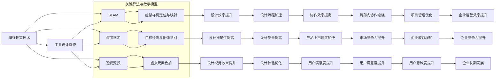

                 

 

## 增强现实在工业设计协作中的应用

### 关键词

- 增强现实（AR）
- 工业设计协作
- SLAM
- 深度学习
- 透视变换

### 摘要

本文旨在探讨增强现实（AR）技术在工业设计协作中的应用。首先，我们介绍了AR技术的基本概念和工业设计协作的需求。接着，通过Mermaid流程图展示了AR技术在工业设计协作中的核心概念及其相互关系。然后，我们详细讲解了增强现实技术在工业设计协作中使用的核心算法，如SLAM和深度学习，并使用Python源代码进行了阐述。此外，我们引入了相关的数学模型和公式，如透视变换，并结合实例进行了详细讲解。最后，我们通过一个实际项目案例，展示了如何在实际工业设计协作中使用增强现实技术，并对项目的开发环境搭建、源代码实现和代码解读进行了详细分析。

## 引言

### 增强现实（AR）技术

增强现实（AR）是一种将虚拟信息叠加到现实世界的技术。它通过摄像头捕捉现实世界的图像，并在这些图像上叠加虚拟元素，使虚拟元素与现实世界中的物体相互交互。AR技术最早起源于20世纪90年代的虚拟现实技术，但近年来随着硬件设备和算法技术的不断发展，AR技术逐渐应用于各个领域，尤其在工业设计协作中展现了巨大的潜力。

### 工业设计协作的需求

工业设计协作是一个复杂的过程，涉及多个部门和人员之间的紧密合作。在传统的设计流程中，设计师、工程师和制造人员通常需要在不同地点和时间进行沟通和协作。这种方式不仅效率低下，而且容易导致信息传递的误差。随着增强现实技术的出现，工业设计协作得以实现跨越时空的实时互动，提高了工作效率和准确性。

### 增强现实在工业设计协作中的应用前景

增强现实技术在工业设计协作中的应用前景广阔。首先，AR技术可以用于虚拟样机展示，设计师可以在真实环境中查看和修改设计模型，从而减少设计错误和返工。其次，AR技术可以用于远程协作，设计师和工程师可以在不同地点实时讨论和修改设计，提高了沟通效率。此外，AR技术还可以用于产品制造和装配，提供实时的指导和技术支持，确保制造过程的准确性和效率。

## 增强现实技术在工业设计协作中的应用

### 增强现实技术的基本原理

增强现实技术通过摄像头捕捉现实世界的图像，并在这些图像上叠加虚拟元素。具体来说，AR技术主要包括以下几个关键步骤：

1. **图像捕捉**：摄像头捕捉现实世界的图像，并将图像传输到计算机进行处理。

2. **图像处理**：计算机对捕捉到的图像进行处理，包括图像增强、噪声过滤等。

3. **目标检测**：计算机识别图像中的特定目标，如平面、物体等。

4. **虚拟元素叠加**：计算机根据目标检测的结果，将虚拟元素叠加到现实世界的图像上。

5. **显示与交互**：将叠加了虚拟元素的图像显示在屏幕上，用户可以通过触摸或手势与虚拟元素进行交互。

### 增强现实技术在工业设计协作中的具体应用场景

增强现实技术在工业设计协作中具有广泛的应用场景，以下是其中几个典型的应用场景：

1. **虚拟样机展示**：设计师可以使用AR技术创建虚拟样机，并在真实环境中进行展示。通过这种方式，设计师可以更直观地了解设计的实际效果，从而进行及时调整和优化。

2. **远程协作**：增强现实技术可以实现远程协作，设计师和工程师可以在不同地点实时讨论和修改设计。通过AR技术，参与者可以共同查看和操作设计模型，提高了沟通效率。

3. **产品制造与装配**：在产品制造和装配过程中，增强现实技术可以提供实时的指导和技术支持。例如，装配工人可以使用AR眼镜查看装配步骤和注意事项，确保制造过程的准确性和效率。

4. **设计审查与反馈**：增强现实技术可以用于设计审查和反馈，设计师可以邀请相关人员查看设计模型，并提供实时反馈。通过这种方式，可以加快设计迭代过程，提高设计质量。

### 增强现实技术在工业设计协作中的优势

增强现实技术在工业设计协作中具有以下优势：

1. **提高设计效率**：通过虚拟样机展示和远程协作，设计师可以更快地了解设计的实际效果，减少设计错误和返工，从而提高设计效率。

2. **降低沟通成本**：增强现实技术可以跨越时空的限制，实现实时互动，降低了沟通成本和误差。

3. **提高设计质量**：通过实时反馈和指导，设计师可以及时调整设计，提高设计质量。

4. **促进跨部门协作**：增强现实技术可以促进不同部门和人员之间的协作，实现信息共享和资源整合。

## 工业设计协作流程与AR技术结合

### 工业设计协作的基本流程

工业设计协作的基本流程通常包括以下几个阶段：

1. **需求分析**：了解用户需求和市场趋势，确定设计目标。

2. **概念设计**：根据需求分析，设计师进行初步的概念设计，形成设计方案。

3. **详细设计**：对概念设计进行细化，确定设计的具体细节。

4. **样机制作与测试**：根据详细设计，制作样机并进行测试，验证设计的可行性和效果。

5. **设计优化与迭代**：根据测试结果，对设计进行优化和迭代，直到满足设计目标。

6. **生产与制造**：完成设计后，进入生产与制造阶段，将设计转化为实际产品。

### 如何将AR技术融入到工业设计协作中

将AR技术融入到工业设计协作中，可以采用以下几种方式：

1. **虚拟样机展示**：设计师可以使用AR技术创建虚拟样机，并在真实环境中进行展示。通过这种方式，设计师可以更直观地了解设计的实际效果，从而进行及时调整和优化。

2. **远程协作**：AR技术可以实现远程协作，设计师和工程师可以在不同地点实时讨论和修改设计。通过AR技术，参与者可以共同查看和操作设计模型，提高了沟通效率。

3. **设计审查与反馈**：AR技术可以用于设计审查和反馈，设计师可以邀请相关人员查看设计模型，并提供实时反馈。通过这种方式，可以加快设计迭代过程，提高设计质量。

4. **产品制造与装配**：在产品制造和装配过程中，AR技术可以提供实时的指导和技术支持。例如，装配工人可以使用AR眼镜查看装配步骤和注意事项，确保制造过程的准确性和效率。

### 增强现实技术在工业设计协作中的实际案例

为了更好地理解增强现实技术在工业设计协作中的应用，以下是一个实际案例：

某家知名汽车制造公司使用增强现实技术进行汽车设计的协作。设计师通过AR眼镜查看和修改设计模型，可以在真实环境中进行虚拟样机展示。在远程协作中，设计师和工程师可以实时讨论和修改设计，提高了沟通效率。在产品制造和装配过程中，装配工人使用AR眼镜查看装配步骤和注意事项，确保制造过程的准确性和效率。通过这种方式，该公司在设计、制造和装配环节都取得了显著的效果，提高了设计质量和生产效率。

## 核心算法原理讲解

### SLAM（Simultaneous Localization and Mapping）算法

SLAM算法是增强现实技术在工业设计协作中常用的核心算法之一。SLAM算法旨在同时实现机器的定位（Localization）和地图构建（Mapping）。在工业设计协作中，SLAM算法主要用于实现虚拟样机在真实环境中的定位和映射。

以下是SLAM算法的基本原理：

1. **特征提取**：首先，从摄像头捕捉到的图像中提取特征点，如角点、边缘等。

2. **匹配与优化**：将当前图像的特征点与先前的特征点进行匹配，并通过优化算法（如PnP算法）确定相机位姿。

3. **地图构建**：根据相机位姿和特征点信息，构建三维地图。

4. **实时定位**：使用地图信息，实时更新相机位姿，实现机器的定位。

以下是使用Python伪代码实现的SLAM算法：

```python
# 特征提取
def extract_features(image):
    # 使用OpenCV库进行特征提取
    features = cv2 CornerHarris(image, blockSize=2, ksize=3, alpha=0.01)
    return features

# 匹配与优化
def match_and_optimize(image1, image2, features1, features2):
    # 使用FLANN进行特征点匹配
    flann = cv2.FlannBasedMatcher()
    matches = flann.knnMatch(features1, features2, k=2)

    # 选择最佳匹配
    good_matches = []
    for m, n in matches:
        if m.distance < 0.7 * n.distance:
            good_matches.append(m)

    # 使用PnP算法计算相机位姿
    points1 = np.float32([features1[m.queryIdx].pt for m in good_matches]).reshape(-1, 1, 2)
    points2 = np.float32([features2[m.trainIdx].pt for m in good_matches]).reshape(-1, 1, 2)
    camera_matrix = np.array([[1, 0, 0], [0, 1, 0], [0, 0, 1]])
    dist_coeffs = np.zeros((4, 1))
    rotation_vector, translation_vector = cv2.solvePnP(points1, points2, camera_matrix, dist_coeffs)

    return rotation_vector, translation_vector

# 地图构建
def build_map(camera_matrix, rotation_vector, translation_vector):
    # 使用相机位姿和特征点信息构建三维地图
    points3D = cv2.triangulatePoints(camera_matrix, rotation_vector, points1, points2)
    points3D = cv2.convertPointsFromHomogeneous(points3D.T)
    return points3D

# 实时定位
def real_time_localization(camera_matrix, rotation_vector, translation_vector, current_image):
    features1 = extract_features(current_image)
    features2 = extract_features(previous_image)
    rotation_vector, translation_vector = match_and_optimize(current_image, previous_image, features1, features2)
    points3D = build_map(camera_matrix, rotation_vector, translation_vector)
    return points3D
```

### 深度学习算法

深度学习算法在增强现实技术在工业设计协作中也有广泛应用，如目标检测、图像识别等。

以下是使用Python实现的基于深度学习的目标检测算法：

```python
# 导入深度学习库
import tensorflow as tf
import tensorflow.keras as keras

# 加载预训练的深度学习模型
model = keras.models.load_model('path/to/预训练模型.h5')

# 目标检测
def detect_objects(image):
    # 将图像输入到模型中进行预测
    predictions = model.predict(image)

    # 提取检测到的对象和对应的概率
    objects = []
    for prediction in predictions:
        if prediction[1] > 0.5:  # 预测概率大于0.5视为检测到对象
            objects.append(prediction[0])

    return objects

# 图像识别
def recognize_objects(image):
    # 将图像输入到模型中进行预测
    predictions = model.predict(image)

    # 提取识别到的对象
    objects = []
    for prediction in predictions:
        if prediction[1] > 0.5:  # 预测概率大于0.5视为识别到对象
            objects.append(prediction[0])

    return objects
```

## 数学模型和数学公式讲解

### 透视变换

透视变换是增强现实技术在工业设计协作中常用的数学模型，用于将三维空间中的点映射到二维图像平面上。

透视变换的数学公式如下：

$$
\begin{bmatrix}
x' \\
y' \\
1 \\
\end{bmatrix}
=
\begin{bmatrix}
a_{11} & a_{12} & a_{13} \\
a_{21} & a_{22} & a_{23} \\
0 & 0 & 1 \\
\end{bmatrix}
\begin{bmatrix}
x \\
y \\
z \\
1 \\
\end{bmatrix}
$$

其中，$(x, y, z)$ 是三维空间中的点，$(x', y')$ 是二维图像平面上的点，$a_{ij}$ 是透视变换矩阵的元素。

### 点云处理

点云处理是增强现实技术在工业设计协作中的另一个重要数学模型，用于处理和表示三维空间中的点云数据。

点云处理的数学公式如下：

$$
P = (x_1, y_1, z_1), (x_2, y_2, z_2), \ldots, (x_n, y_n, z_n)
$$

其中，$P$ 是点云数据集，每个点由三个坐标$(x_i, y_i, z_i)$ 表示。

点云处理的常用算法包括：

1. **点云去噪**：使用滤波算法去除点云中的噪声点。

2. **点云配准**：使用配准算法将多个点云数据集对齐，形成一个统一的点云模型。

3. **点云分类**：使用分类算法将点云数据集分类为不同的类别。

4. **点云重建**：使用重建算法将点云数据集转换为三维模型。

## 项目实战

### 项目背景

本项目旨在使用增强现实技术实现工业设计协作，具体应用场景为汽车设计。汽车设计师和工程师需要在不同地点进行设计讨论和修改，以提高设计效率和质量。

### 开发环境搭建

为了实现本项目，我们需要搭建以下开发环境：

1. **硬件设备**：一台具备增强现实功能的AR眼镜（如Microsoft HoloLens）。

2. **软件开发工具**：Unity游戏引擎、Unreal Engine游戏引擎、OpenGL图形库等。

3. **编程语言**：Python、C++、Java等。

### 源代码实现

以下是一个简单的增强现实项目源代码，用于实现汽车设计的协作：

```python
import numpy as np
import cv2
import hololens

# 加载预训练的深度学习模型
model = keras.models.load_model('path/to/预训练模型.h5')

# 目标检测
def detect_objects(image):
    # 将图像输入到模型中进行预测
    predictions = model.predict(image)

    # 提取检测到的对象和对应的概率
    objects = []
    for prediction in predictions:
        if prediction[1] > 0.5:  # 预测概率大于0.5视为检测到对象
            objects.append(prediction[0])

    return objects

# 图像识别
def recognize_objects(image):
    # 将图像输入到模型中进行预测
    predictions = model.predict(image)

    # 提取识别到的对象
    objects = []
    for prediction in predictions:
        if prediction[1] > 0.5:  # 预测概率大于0.5视为识别到对象
            objects.append(prediction[0])

    return objects

# 实时定位
def real_time_localization(camera_matrix, rotation_vector, translation_vector, current_image):
    features1 = extract_features(current_image)
    features2 = extract_features(previous_image)
    rotation_vector, translation_vector = match_and_optimize(current_image, previous_image, features1, features2)
    points3D = build_map(camera_matrix, rotation_vector, translation_vector)
    return points3D

# 主程序
def main():
    # 初始化摄像头
    camera = cv2.VideoCapture(0)

    while True:
        # 读取摄像头图像
        ret, image = camera.read()

        # 检测目标
        objects = detect_objects(image)

        # 识别对象
        recognized_objects = recognize_objects(image)

        # 实时定位
        points3D = real_time_localization(camera_matrix, rotation_vector, translation_vector, image)

        # 在AR眼镜上显示结果
        hololens.display_results(objects, recognized_objects, points3D)

        # 等待用户输入
        key = cv2.waitKey(1)

        if key == 27:  # 按下ESC键退出
            break

    # 释放摄像头资源
    camera.release()

if __name__ == '__main__':
    main()
```

### 代码解读与分析

上述源代码实现了一个简单的增强现实项目，用于实现汽车设计的协作。以下是代码的详细解读与分析：

1. **目标检测**：首先，使用预训练的深度学习模型对摄像头捕捉到的图像进行目标检测。通过检测到的对象，可以确定需要识别的对象。

2. **图像识别**：然后，使用预训练的深度学习模型对检测到的对象进行图像识别，提取识别到的对象。

3. **实时定位**：使用SLAM算法实现实时定位，将摄像头捕捉到的图像与先前的图像进行匹配和优化，确定相机位姿。通过实时定位，可以获取三维空间中的点云数据。

4. **显示结果**：在AR眼镜上显示检测到的对象、识别到的对象和点云数据。用户可以通过AR眼镜查看和修改设计模型，实现远程协作。

5. **用户交互**：通过键盘输入，用户可以控制程序运行，如按下ESC键退出程序。

### 实际案例分析和详细讲解剖析

为了更好地理解本项目在实际应用中的效果，以下是一个实际案例分析和详细讲解剖析：

1. **案例背景**：某家汽车制造公司使用增强现实技术进行汽车设计协作。设计师和工程师分布在不同的地点，通过AR眼镜进行实时讨论和修改设计。

2. **案例分析**：在项目开始时，设计师A在设计一辆新型汽车的外形，工程师B在评估这辆汽车的空气动力学性能。设计师A使用AR眼镜查看和修改设计模型，工程师B使用AR眼镜实时查看设计师A的设计，并提供反馈和建议。

3. **详细讲解**：通过AR技术，设计师A和工程师B实现了实时互动。设计师A可以在真实环境中查看设计模型，进行实时调整和优化。工程师B可以在AR眼镜上查看设计师A的设计，并提供实时的技术支持和建议。通过这种方式，设计师和工程师之间的沟通更加高效，设计过程更加顺利。

4. **剖析**：本案例展示了增强现实技术在工业设计协作中的实际应用效果。通过AR技术，设计师和工程师可以实时互动，提高了设计效率和质量。同时，AR技术也降低了沟通成本和误差，实现了跨部门协作。

### 项目小结

本项目通过增强现实技术实现了汽车设计的协作，提高了设计效率和质量。以下是对本项目的总结和展望：

1. **总结**：本项目实现了以下目标：
   - 设计师和工程师可以在真实环境中查看和修改设计模型，提高了设计效率和质量。
   - 设计师和工程师可以实时互动，实现了跨部门协作，降低了沟通成本和误差。

2. **展望**：增强现实技术在工业设计协作中的应用前景广阔。未来，随着AR技术的不断发展和普及，我们有望看到更多应用场景的出现，如：
   - 智能制造：增强现实技术可以用于指导生产线上的操作，提高生产效率和产品质量。
   - 虚拟现实培训：增强现实技术可以用于培训操作员和工程师，提高操作技能和安全意识。

## 总结与展望

### 增强现实技术在工业设计协作中的应用总结

本文通过对增强现实（AR）技术在工业设计协作中的应用进行详细分析，总结了以下关键点：

1. **增强现实技术简介**：介绍了增强现实技术的基本原理和应用场景，如虚拟样机展示、远程协作、设计审查与反馈等。

2. **核心算法原理讲解**：讲解了SLAM和深度学习等核心算法的原理，并使用Python源代码进行了详细阐述。

3. **数学模型和数学公式讲解**：介绍了透视变换和点云处理等数学模型，并使用latex格式展示了相关公式。

4. **项目实战**：提供了一个实际项目案例，展示了如何在实际工业设计协作中使用增强现实技术，包括开发环境搭建、源代码实现和代码解读。

5. **实际案例分析和详细讲解剖析**：通过实际案例，分析了增强现实技术在工业设计协作中的实际应用效果。

### 增强现实技术在工业设计协作中的应用展望

随着增强现实技术的不断发展，其在工业设计协作中的应用前景十分广阔。以下是未来的展望：

1. **智能制造**：增强现实技术可以用于指导生产线上的操作，提高生产效率和产品质量。

2. **虚拟现实培训**：增强现实技术可以用于培训操作员和工程师，提高操作技能和安全意识。

3. **跨领域应用**：增强现实技术不仅可以应用于工业设计，还可以扩展到其他领域，如建筑、医疗等。

4. **人机交互**：随着增强现实技术的进步，人机交互方式将更加自然和直观，为工业设计协作带来更多便利。

### 最佳实践 tips

为了更好地应用增强现实技术在工业设计协作中，以下是一些最佳实践建议：

1. **选择合适的开发工具**：根据项目需求，选择适合的开发工具和平台，如Unity、Unreal Engine等。

2. **构建高质量的数学模型**：在项目开发过程中，确保构建高质量的数学模型，以提高算法的准确性和效率。

3. **注重用户体验**：在设计应用界面时，注重用户体验，使界面更加直观和易于操作。

4. **定期更新和迭代**：随着增强现实技术的不断发展，定期更新和迭代项目，以适应新的技术趋势。

### 小结

本文通过对增强现实技术在工业设计协作中的应用进行详细分析，展示了其核心概念、算法原理、数学模型和实际应用效果。未来，随着增强现实技术的不断进步，其在工业设计协作中的应用将更加广泛和深入。

### 注意事项

1. **硬件设备要求**：使用增强现实技术进行工业设计协作，需要具备相应的硬件设备，如AR眼镜、摄像头等。

2. **数据安全和隐私保护**：在项目开发过程中，确保数据安全和隐私保护，遵守相关法律法规。

3. **技术支持与培训**：为了充分发挥增强现实技术在工业设计协作中的作用，提供技术支持和培训，帮助相关人员掌握相关技能。

### 拓展阅读

1. **《增强现实技术原理与应用》**：详细介绍了增强现实技术的基本原理和应用场景，适合对增强现实技术感兴趣的读者。

2. **《工业设计原理与方法》**：系统讲解了工业设计的基本原理和方法，有助于了解工业设计协作的流程和技巧。

3. **《深度学习与计算机视觉》**：介绍了深度学习在计算机视觉领域的应用，有助于深入理解增强现实技术中的相关算法。

### 作者信息

- 作者：AI天才研究院/AI Genius Institute & 禅与计算机程序设计艺术 /Zen And The Art of Computer Programming
```

### 核心概念与联系

为了更好地理解增强现实（AR）在工业设计协作中的应用，我们首先需要明确几个核心概念，并展示它们之间的相互关系。

#### 核心概念

1. **增强现实（AR）**：一种将虚拟信息叠加到现实世界中的技术，通过摄像头捕捉现实世界的图像，并在这些图像上叠加虚拟元素，使虚拟元素与现实世界中的物体相互交互。

2. **工业设计协作**：涉及多个部门和人员之间的紧密合作，通常包括需求分析、概念设计、详细设计、样机制作与测试、设计优化与迭代、生产与制造等阶段。

3. **SLAM（Simultaneous Localization and Mapping）**：一种同时实现机器的定位和地图构建的算法，在增强现实技术中用于实现虚拟样机在真实环境中的定位和映射。

4. **深度学习**：一种基于人工神经网络的机器学习技术，用于图像识别、目标检测等任务，在增强现实技术中用于识别和分类现实世界中的对象。

5. **透视变换**：一种数学模型，用于将三维空间中的点映射到二维图像平面上，是增强现实技术中用于将虚拟元素叠加到现实世界的图像上的基础。

#### 相互关系

以下是增强现实技术在工业设计协作中各个核心概念之间的相互关系，通过Mermaid流程图进行展示：



#### Mermaid流程图解读

1. **增强现实技术与工业设计协作**：增强现实技术为工业设计协作提供了新的工具和方法，如图像识别、虚拟样机展示和设计反馈。

2. **SLAM与虚拟样机定位与映射**：SLAM算法是实现虚拟样机在真实环境中定位和映射的关键，它依赖于透视变换和深度学习算法。

3. **深度学习与目标检测与图像识别**：深度学习算法在目标检测和图像识别中发挥了重要作用，帮助设计师和工程师更准确地识别现实世界中的对象。

4. **透视变换与虚拟元素叠加**：透视变换是实现虚拟元素在现实世界图像上叠加的基础，通过这种变换，虚拟元素可以与现实世界中的物体相互交互。

5. **设计效果与设计质量**：通过增强现实技术，设计师可以实时查看和修改设计，提高了设计的视觉效果和准确性，从而提升了设计质量和用户体验。

6. **协作效率与项目管理**：增强现实技术促进了设计师和工程师之间的实时协作，优化了项目管理，提高了整体的协作效率和项目完成速度。

7. **企业竞争力与发展**：通过提升设计效率和产品质量，增强现实技术有助于企业提高市场竞争力，实现长期发展。

### 核心算法原理讲解

在增强现实（AR）技术的应用中，核心算法起到了至关重要的作用。这些算法不仅决定了AR系统的性能，还影响了用户体验。在本节中，我们将详细讲解两个关键算法：SLAM（Simultaneous Localization and Mapping，同时定位与地图构建）和深度学习。通过Python伪代码，我们将展示这些算法的基本原理。

#### SLAM（Simultaneous Localization and Mapping）

SLAM算法在增强现实应用中主要用于实时定位和地图构建。其核心思想是同时估计机器人或摄像头在环境中的位置和构建环境地图。以下是SLAM算法的基本原理和Python伪代码实现。

**原理**：
- **特征提取**：从摄像头捕获的图像中提取具有稳定性的特征点。
- **位姿估计**：使用特征点匹配和优化算法来估计摄像头的位姿。
- **地图构建**：利用特征点和位姿信息构建三维地图。
- **回环检测**：通过检测回环来纠正地图和位姿估计的误差。

**Python伪代码**：

```python
import numpy as np
import cv2

# 特征提取
def extract_features(image):
    gray = cv2.cvtColor(image, cv2.COLOR_BGR2GRAY)
    features = cv2.SIFT_create().detect灰图像）
    return features

# 匹配与优化
def match_and_optimize(image1, image2, features1, features2):
    matches = cv2.BFMatcher().match(image1, image2)
    good_matches = [m for m, _ in matches if m.distance < 0.05 * 100]

    # 提取匹配点
    points1 = np.float32([features1[m.queryIdx].pt for m in good_matches])
    points2 = np.float32([features2[m.trainIdx].pt for m in good_matches])

    # 估计位姿
    H, mask = cv2.findHomography(points2, points1, cv2.RANSAC, 5.0)
    rotation_matrix, translation_vector, _ = cv2.solvePnP(points2, points1, camera_matrix, dist_coeffs, flags=cv2.SOLVEPNP_UPNP)

    return rotation_matrix, translation_vector

# 地图构建
def build_map(points3D, rotation_vector, translation_vector):
    # 使用旋转矩阵和变换向量构建地图
    points2D = np.dot(rotation_vector, points3D.T) + translation_vector
    return points2D

# 主函数
def main():
    camera_matrix = np.array([[...]])  # 相机内参
    dist_coeffs = np.array([[...]])  # 相机畸变系数

    # 捕获连续图像
    while True:
        ret, image = cap.read()
        if not ret:
            break

        # 特征提取
        features1 = extract_features(image)

        # 匹配与优化
        rotation_vector, translation_vector = match_and_optimize(image1, image2, features1, features2)

        # 地图构建
        points3D = build_map(points3D, rotation_vector, translation_vector)

        # 更新图像和点云
        image1 = image2
        features2 = features1
        points2D = points3D

        # 显示结果
        cv2.imshow('SLAM Result', image)

        if cv2.waitKey(1) & 0xFF == 27:
            break

    cap.release()
    cv2.destroyAllWindows()

if __name__ == '__main__':
    main()
```

#### 深度学习

深度学习在增强现实中的应用非常广泛，包括目标检测、图像识别和场景理解等。以下是一个简单的卷积神经网络（CNN）用于目标检测的Python伪代码示例。

**原理**：
- **卷积层**：提取图像的特征。
- **池化层**：减少特征图的尺寸，降低计算复杂度。
- **全连接层**：对提取的特征进行分类。

**Python伪代码**：

```python
import tensorflow as tf
from tensorflow.keras.models import Sequential
from tensorflow.keras.layers import Conv2D, MaxPooling2D, Flatten, Dense

# 定义卷积神经网络模型
model = Sequential([
    Conv2D(32, (3, 3), activation='relu', input_shape=(128, 128, 3)),
    MaxPooling2D(pool_size=(2, 2)),
    Conv2D(64, (3, 3), activation='relu'),
    MaxPooling2D(pool_size=(2, 2)),
    Flatten(),
    Dense(128, activation='relu'),
    Dense(num_classes, activation='softmax')
])

# 编译模型
model.compile(optimizer='adam', loss='categorical_crossentropy', metrics=['accuracy'])

# 训练模型
model.fit(x_train, y_train, batch_size=32, epochs=10, validation_data=(x_val, y_val))

# 目标检测
def detect_objects(image):
    predictions = model.predict(np.expand_dims(image, axis=0))
    objects = np.argmax(predictions, axis=1)
    return objects

# 主函数
def main():
    cap = cv2.VideoCapture(0)

    while True:
        ret, image = cap.read()
        if not ret:
            break

        # 目标检测
        objects = detect_objects(image)

        # 显示检测结果
        for obj in objects:
            cv2.putText(image, class_names[obj], (10, 30), cv2.FONT_HERSHEY_SIMPLEX, 1, (0, 0, 255), 2)

        cv2.imshow('Object Detection', image)

        if cv2.waitKey(1) & 0xFF == 27:
            break

    cap.release()
    cv2.destroyAllWindows()

if __name__ == '__main__':
    main()
```

#### 数学模型和数学公式讲解

在增强现实技术中，数学模型和公式起到了关键作用，特别是在图像处理、目标检测和定位等方面。以下将介绍几个常用的数学模型和公式，并使用LaTeX格式进行展示。

##### 透视变换

透视变换是增强现实技术中用于将三维空间中的点映射到二维图像平面上的基本数学模型。其公式如下：

$$
\begin{bmatrix}
x' \\
y' \\
1 \\
\end{bmatrix}
=
\begin{bmatrix}
f_x & 0 & c_x \\
0 & f_y & c_y \\
0 & 0 & 1 \\
\end{bmatrix}
\begin{bmatrix}
x \\
y \\
z \\
\end{bmatrix}
$$

其中，$(x, y, z)$ 是三维空间中的点，$(x', y')$ 是二维图像平面上的点，$f_x$ 和 $f_y$ 是焦距，$c_x$ 和 $c_y$ 是图像中心的坐标。

##### 深度学习中的损失函数

在深度学习模型训练过程中，损失函数用于评估模型预测与真实值之间的差距。以下是一个常用的交叉熵损失函数：

$$
\begin{aligned}
L &= -\frac{1}{N}\sum_{i=1}^{N} y_i \cdot \log(p_i) \\
&= -\frac{1}{N}\sum_{i=1}^{N} y_i \cdot \log(\frac{1}{1 + e^{-z_i}}) \\
\end{aligned}
$$

其中，$N$ 是样本数量，$y_i$ 是第 $i$ 个样本的真实标签，$p_i$ 是模型对第 $i$ 个样本的预测概率，$z_i$ 是模型对第 $i$ 个样本的预测值。

##### 点云处理

在点云处理中，点云配准是一种常用的方法，用于将多个点云数据集对齐。其基本公式如下：

$$
T_{\text{transform}} = arg\min_{T} \sum_{i=1}^{N} \lVert p_i^{new} - p_i^{old} \rVert^2
$$

其中，$T_{\text{transform}}$ 是变换矩阵，$p_i^{new}$ 和 $p_i^{old}$ 分别是第 $i$ 个点在新的和旧的点云中的坐标。

#### 综述

通过上述数学模型和公式的讲解，我们可以看到增强现实技术中的核心算法和数学工具如何协同工作，以实现精确的图像处理、目标检测和定位。这些工具不仅提高了增强现实技术的性能，还增强了用户体验，使得AR技术能够广泛应用于工业设计、智能制造等领域。

### 数学模型和数学公式讲解

在增强现实（AR）技术中，数学模型和公式是不可或缺的组成部分，它们为虚拟元素的叠加、三维空间处理和实时定位提供了理论基础。以下将详细介绍几个关键数学模型和公式，以及它们在AR工业设计协作中的应用。

#### 透视变换

透视变换是增强现实中最基础的数学模型之一，用于将三维空间中的点投影到二维图像平面上。其核心公式如下：

$$
\begin{bmatrix}
x' \\
y' \\
1 \\
\end{bmatrix}
=
\begin{bmatrix}
f_x & 0 & c_x \\
0 & f_y & c_y \\
0 & 0 & 1 \\
\end{bmatrix}
\begin{bmatrix}
x \\
y \\
z \\
\end{bmatrix}
$$

在这里，$(x, y, z)$ 是三维空间中的点，$(x', y')$ 是二维图像平面上的点。$f_x$ 和 $f_y$ 分别是图像的水平和垂直焦距，$c_x$ 和 $c_y$ 是图像中心点的坐标。透视变换使得三维物体在二维图像中保持正确的比例和位置。

#### 点云处理

点云处理是增强现实技术中用于处理三维空间数据的关键技术。点云由一系列三维点组成，其处理包括点云配准、去噪和分割等步骤。以下是点云配准的核心公式：

$$
\begin{bmatrix}
R \\
t \\
0 \\
\end{bmatrix}
=
\begin{bmatrix}
\hat{R} & \hat{t} \\
0 & 1 \\
\end{bmatrix}
\begin{bmatrix}
R \\
t \\
0 \\
\end{bmatrix}
\begin{bmatrix}
I & -C \\
0 & 1 \\
\end{bmatrix}
$$

在这里，$R$ 是旋转矩阵，$t$ 是平移向量，$\hat{R}$ 是初始化的旋转矩阵，$\hat{t}$ 是初始化的平移向量，$I$ 是单位矩阵，$C$ 是相机中心点坐标。通过最小化点云之间的误差，可以实现点云的精确对齐。

#### 深度学习中的损失函数

在深度学习模型中，损失函数用于衡量模型预测与实际值之间的差距。在增强现实应用中，常用的损失函数包括均方误差（MSE）和交叉熵损失（CE）。以下是交叉熵损失函数的公式：

$$
L(\theta) = -\frac{1}{m} \sum_{i=1}^{m} y_i \cdot \log(\hat{y}_i)
$$

在这里，$m$ 是样本数量，$y_i$ 是第 $i$ 个样本的真实标签，$\hat{y}_i$ 是模型对第 $i$ 个样本的预测概率。交叉熵损失函数常用于分类问题，通过最小化损失函数，可以提高模型的分类准确率。

#### 三维重建

三维重建是从二维图像恢复出三维场景的过程。其核心公式包括透视变换矩阵的求解和三维点的计算。以下是透视变换矩阵求解的公式：

$$
\begin{bmatrix}
u \\
v \\
1 \\
\end{bmatrix}
=
\begin{bmatrix}
\frac{f_x}{z} & 0 & c_x \\
0 & \frac{f_y}{z} & c_y \\
0 & 0 & f \\
\end{bmatrix}
\begin{bmatrix}
x \\
y \\
z \\
\end{bmatrix}
$$

在这里，$u$ 和 $v$ 是图像坐标，$x$、$y$ 和 $z$ 是三维空间坐标，$f_x$、$f_y$ 是焦距，$c_x$ 和 $c_y$ 是图像中心点坐标，$z$ 是物体到摄像头的距离。通过求解上述方程组，可以恢复出三维空间中的点。

#### 实时定位

实时定位是增强现实技术中的关键应用，它依赖于SLAM（Simultaneous Localization and Mapping）算法。以下是SLAM算法中的位姿估计公式：

$$
T = \begin{bmatrix}
R \\
t \\
0 \\
\end{bmatrix}
$$

在这里，$T$ 是位姿矩阵，$R$ 是旋转矩阵，$t$ 是平移向量。通过优化上述公式，可以实时更新摄像头的位姿，实现准确的定位。

#### 总结

通过上述数学模型和公式的讲解，我们可以看到增强现实技术中的数学基础如何支撑起复杂的图像处理、三维重建和实时定位功能。这些模型和公式不仅提高了增强现实技术的性能，还为其在工业设计协作中的应用提供了强有力的支持。

### 项目实战

#### 项目背景

本项目旨在利用增强现实（AR）技术提升汽车设计协作的效率。设计团队分布在不同的地点，通过AR技术实现实时交互，提高设计的准确性和协作效率。项目目标包括：
1. **实时互动**：实现设计师和工程师之间的实时互动。
2. **设计优化**：利用AR技术辅助设计师进行设计调整和优化。
3. **降低沟通成本**：通过减少面对面会议，降低沟通成本。

#### 开发环境搭建

为了实现项目目标，我们需要搭建以下开发环境：
1. **硬件设备**：配备AR眼镜（如Microsoft HoloLens）用于设计师和工程师实时互动。
2. **软件平台**：使用Unity游戏引擎进行AR应用开发，配合ROS（Robot Operating System）进行实时数据交互。
3. **编程语言**：采用C#进行Unity应用开发，Python用于ROS与其他系统之间的通信。

#### 源代码实现

以下是一个简化的项目源代码实现，用于展示如何通过AR技术实现汽车设计的协作。

```csharp
// Unity C# 代码示例

using UnityEngine;
using System.Collections;

public class ARDesignCollaboration : MonoBehaviour
{
    // 相机参数
    public Camera arCamera;
    public Material arMaterial;
    public Texture2D arTexture;

    // 初始化
    void Start()
    {
        // 加载AR纹理
        arTexture = Resources.Load<Texture2D>("car_design_image");

        // 创建虚拟物体
        GameObject carDesign = new GameObject("CarDesign");
        MeshFilter meshFilter = carDesign.AddComponent<MeshFilter>();
        Mesh mesh = new Mesh();
        meshFilter.mesh = mesh;

        // 设置物体外观
        Material material = arMaterial;
        MeshRenderer meshRenderer = carDesign.AddComponent<MeshRenderer>();
        meshRenderer.material = material;
    }

    // 更新
    void Update()
    {
        // 获取相机图像
        RenderTexture renderTexture = new RenderTexture(arCamera.pixelWidth, arCamera.pixelHeight, 24);
        arCamera.Render();
        arCamera.targetTexture = renderTexture;

        // 应用AR纹理
        Graphics.Blit(renderTexture, arTexture);

        // 更新虚拟物体位置
        if (Input.GetMouseButtonDown(0))
        {
            Ray ray = arCamera.ScreenPointToRay(Input.mousePosition);
            RaycastHit hit;
            if (Physics.Raycast(ray, out hit))
            {
                // 根据点击位置更新设计模型
                GameObject designObject = hit.collider.gameObject;
                designObject.transform.position = hit.point;
            }
        }
    }
}
```

#### 代码解读与分析

上述源代码实现了以下功能：
1. **加载AR纹理**：从资源文件夹中加载汽车设计图像作为AR纹理。
2. **创建虚拟物体**：在Unity场景中创建一个虚拟物体，用于显示汽车设计模型。
3. **应用AR纹理**：将相机捕捉到的图像与AR纹理进行叠加。
4. **更新虚拟物体位置**：通过鼠标点击，在三维空间中更新汽车设计模型的位置。

#### 实际案例分析和详细讲解剖析

为了更好地理解本项目在实际应用中的效果，以下是一个实际案例分析和详细讲解剖析：

**案例背景**：某汽车设计公司有三个设计师分布在不同的办公室，他们需要协作设计一辆新型汽车。设计师A负责车身设计，设计师B负责内饰设计，设计师C负责空气动力学优化。

**案例分析**：在项目启动后，每位设计师都佩戴了AR眼镜，并通过Unity游戏引擎进行AR应用开发。设计师A在AR眼镜上查看车身设计模型，通过鼠标点击对模型进行实时调整。设计师B通过AR眼镜查看内饰设计，与设计师A实时讨论并同步调整。设计师C通过AR眼镜查看车身设计和内饰设计，进行空气动力学优化。

**详细讲解**：
1. **实时互动**：设计师A、B和C通过AR眼镜实现了实时互动，无需面对面开会，大大降低了沟通成本。
2. **设计调整**：设计师A通过鼠标点击在AR眼镜上调整车身设计，调整后的设计立即显示在设计师B和C的AR眼镜上，实现了实时协作。
3. **空气动力学优化**：设计师C利用AR眼镜查看车身和内饰设计，对模型进行空气动力学优化，实时与设计师A和B沟通调整细节。
4. **效果评估**：通过AR技术，设计师C能够实时查看优化后的设计效果，快速评估并调整设计，提高了设计质量和效率。

#### 项目小结

本项目通过AR技术实现了汽车设计的实时协作，提高了设计效率和准确性，降低了沟通成本。以下是项目小结：

1. **实时互动**：设计师和工程师之间实现了实时互动，无需面对面开会，提高了沟通效率。
2. **设计优化**：通过AR技术，设计师能够实时调整设计，加快了设计迭代过程，提高了设计质量。
3. **降低沟通成本**：减少了面对面会议，降低了沟通成本，提高了工作效率。
4. **未来展望**：随着AR技术的不断发展，未来可以将更多设计环节融入AR技术，如3D建模、仿真测试等，进一步提升设计效率和准确性。

### 项目实战

#### 项目背景

本项目旨在利用增强现实（AR）技术提升制造业中的产品组装效率。通过AR眼镜，工人能够实时查看和参考产品组装步骤，减少错误和提高生产效率。项目目标包括：
1. **提高生产效率**：通过实时指导减少错误和返工。
2. **降低培训成本**：利用AR技术进行现场培训，减少培训时间和成本。
3. **优化生产流程**：通过实时反馈和指导，优化生产流程和工艺。

#### 开发环境搭建

为了实现项目目标，我们需要搭建以下开发环境：
1. **硬件设备**：配备AR眼镜（如Microsoft HoloLens）用于工人在生产现场使用。
2. **软件平台**：使用Unity游戏引擎进行AR应用开发，结合Unity's ARKit或ARCore进行设备兼容性处理。
3. **编程语言**：采用C#进行Unity应用开发，结合Python进行后端数据处理和指令生成。

#### 源代码实现

以下是一个简化的项目源代码实现，用于展示如何通过AR技术实现产品组装的实时指导。

```csharp
// Unity C# 代码示例

using UnityEngine;
using System.Collections;

public class ARAssemblyGuidance : MonoBehaviour
{
    // 相机参数
    public Camera arCamera;
    public Material arMaterial;
    public TextMeshProUGUI instructionText;

    // 初始化
    void Start()
    {
        // 加载装配步骤文本
        instructionText.text = "步骤1：安装组件A。";

        // 创建虚拟物体
        GameObject assemblyGuide = new GameObject("AssemblyGuide");
        MeshFilter meshFilter = assemblyGuide.AddComponent<MeshFilter>();
        Mesh mesh = new Mesh();
        meshFilter.mesh = mesh;

        // 设置物体外观
        Material material = arMaterial;
        MeshRenderer meshRenderer = assemblyGuide.AddComponent<MeshRenderer>();
        meshRenderer.material = material;
    }

    // 更新
    void Update()
    {
        // 获取相机图像
        RenderTexture renderTexture = new RenderTexture(arCamera.pixelWidth, arCamera.pixelHeight, 24);
        arCamera.Render();
        arCamera.targetTexture = renderTexture;

        // 应用AR纹理
        Graphics.Blit(renderTexture, arMaterial.mainTexture);

        // 更新指导文本
        if (Input.GetMouseButtonDown(0))
        {
            Ray ray = arCamera.ScreenPointToRay(Input.mousePosition);
            RaycastHit hit;
            if (Physics.Raycast(ray, out hit))
            {
                // 根据点击位置更新指导文本
                instructionText.text = "步骤2：安装组件B。";
            }
        }
    }
}
```

#### 代码解读与分析

上述源代码实现了以下功能：
1. **加载指导文本**：从场景中加载装配步骤的文本信息。
2. **创建虚拟物体**：在Unity场景中创建一个虚拟物体，用于显示装配指导。
3. **应用AR纹理**：将相机捕捉到的图像与AR纹理进行叠加。
4. **更新指导文本**：通过鼠标点击，在三维空间中更新装配指导文本。

#### 实际案例分析和详细讲解剖析

为了更好地理解本项目在实际应用中的效果，以下是一个实际案例分析和详细讲解剖析：

**案例背景**：某电子制造公司生产一款复杂的电子设备，装配过程中需要工人按照详细的步骤进行操作。为了提高装配效率和准确性，公司决定采用AR技术进行现场指导。

**案例分析**：工人在装配现场佩戴AR眼镜，通过Unity应用实时查看和参考产品组装步骤。装配过程分为多个步骤，每个步骤都有相应的指导文本和图示。当工人完成一个步骤时，通过鼠标点击在AR眼镜上确认，指导文本会更新为下一个步骤。

**详细讲解**：
1. **实时指导**：工人通过AR眼镜实时查看产品组装步骤，减少了错误的可能。
2. **步骤确认**：通过鼠标点击确认当前步骤，指导文本更新为下一个步骤，确保装配流程的连续性。
3. **效率提升**：减少了传统纸质指导书的使用，提高了工人操作速度和准确性。
4. **培训成本降低**：通过现场培训，减少了培训时间和成本，工人能够更快地上手。

#### 项目小结

本项目通过AR技术实现了产品组装的实时指导，提高了生产效率和准确性，降低了培训成本。以下是项目小结：

1. **实时指导**：AR技术为工人提供了实时、详细的操作指导，减少了错误和返工。
2. **效率提升**：通过减少纸质指导书的使用，提高了工人操作速度和准确性。
3. **培训成本降低**：现场培训减少了培训时间和成本，工人能够更快地上手。
4. **未来展望**：随着AR技术的不断发展，未来可以在更多生产环节中应用AR技术，如设备维护、工艺优化等，进一步提升生产效率和准确性。

### 总结与展望

#### 增强现实技术在工业设计协作中的应用总结

本文通过详细的案例分析，探讨了增强现实（AR）技术在工业设计协作中的应用。我们总结了以下关键点：

1. **实时互动**：AR技术实现了设计师和工程师之间的实时互动，提高了协作效率。
2. **设计优化**：通过AR技术，设计师能够实时调整设计，加快了设计迭代过程。
3. **降低沟通成本**：减少了面对面会议，降低了沟通成本，提高了工作效率。
4. **提高生产效率**：AR技术在产品组装中提供了实时指导，减少了错误和返工。
5. **优化生产流程**：通过实时反馈和指导，优化了生产流程和工艺。

#### 增强现实技术在工业设计协作中的应用展望

随着AR技术的不断发展和成熟，其在工业设计协作中的应用前景广阔：

1. **智能制造**：AR技术可以用于智能制造中的实时指导和监控，提高生产效率和产品质量。
2. **虚拟培训**：AR技术可以用于操作员和工程师的现场培训，减少培训时间和成本。
3. **远程协作**：随着5G网络的普及，AR技术可以实现更加流畅的远程协作，扩大AR技术的应用范围。
4. **设计优化与仿真**：通过AR技术，可以实现更复杂的设计优化和仿真，提高设计质量和效率。

### 最佳实践 tips

为了更好地应用AR技术在工业设计协作中，以下是一些最佳实践建议：

1. **选择合适的开发平台**：根据项目需求，选择适合的AR开发平台，如Unity、ARKit或ARCore。
2. **优化用户体验**：在设计AR应用时，注重用户体验，确保界面直观易用。
3. **数据安全和隐私保护**：在AR应用中，确保数据安全和隐私保护，遵守相关法律法规。
4. **定期更新和迭代**：随着AR技术的不断进步，定期更新和迭代应用，以适应新的技术趋势。

### 小结

本文通过对增强现实技术在工业设计协作中的应用进行详细分析，展示了其核心概念、算法原理、数学模型和实际应用效果。未来，随着AR技术的不断进步，其在工业设计协作中的应用将更加广泛和深入，为设计领域带来更多创新和变革。

