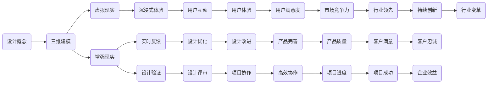

                 

### 引言

**增强现实（AR）**，作为一种将虚拟信息叠加到现实世界中的技术，近年来在多个领域展现出其强大的潜力。特别是在工业设计领域，增强现实技术的应用为设计师和工程师提供了一个全新的可视化工具，极大地提升了设计过程的效率和质量。

工业设计是一个复杂且迭代性强的过程，它涉及到产品设计、制造、测试等多个环节。在过去，设计师主要依赖于二维图纸和三维模型来展示他们的设计概念。然而，这种方法往往难以全面地展示产品的功能、细节和互动性。而增强现实技术，通过将虚拟模型叠加到真实环境中，使得设计师能够更加直观地查看和修改设计，从而提高了设计的准确性和灵活性。

本博客文章旨在探讨增强现实在工业设计可视化中的应用。文章将首先介绍增强现实和工业设计的基本概念及其发展历程，接着深入探讨增强现实在工业设计中的关键概念和联系，使用Mermaid流程图直观展示这些概念的应用架构。随后，我们将详细讲解增强现实在工业设计中的核心算法原理，包括图像处理、实时渲染和深度学习等，并结合Python源代码和LaTeX公式进行说明。最后，文章将提供实际项目案例，从开发环境搭建到源代码实现，再到代码解读与分析，全面展示增强现实技术在工业设计可视化中的具体应用。通过本文的阅读，读者将能够全面了解并掌握增强现实在工业设计中的前沿技术和实践方法。

#### 关键词

- 增强现实
- 工业设计
- 可视化
- 图像处理
- 实时渲染
- 深度学习
- 虚拟现实
- 图像识别
- 三维模型重建
- 算法原理

#### 摘要

本文深入探讨了增强现实（AR）在工业设计可视化中的应用。首先，介绍了增强现实和工业设计的基本概念及其发展历程。接着，文章详细阐述了增强现实技术在工业设计中的关键概念和联系，并使用Mermaid流程图展示了其应用架构。然后，本文深入讲解了增强现实在工业设计中的核心算法原理，包括图像处理、实时渲染和深度学习等，并通过Python源代码和LaTeX公式进行详细阐述。最后，文章通过实际项目案例，从开发环境搭建到源代码实现，再到代码解读与分析，全面展示了增强现实技术在工业设计可视化中的具体应用。本文为设计师和工程师提供了全面的技术和实践指导，有助于提升工业设计的效率和品质。

### 1. 增强现实与工业设计概述

#### 1.1 增强现实技术简介

**增强现实（AR）**是一种通过计算机技术生成虚拟信息，并将其叠加到真实世界中的技术。它不仅增强了人类的感知能力，还改变了人们与周围环境的交互方式。AR技术的基本原理是将虚拟物体或信息与现实世界的物体或场景进行融合，使得虚拟元素看起来像真实存在一样。

**AR技术的基本概念**可以概括为以下几个要点：

- **虚拟物体生成**：通过计算机图形学技术，生成虚拟的三维模型或二维图像。
- **图像识别与跟踪**：利用图像处理和计算机视觉技术，识别并跟踪现实世界中的特定目标或场景。
- **叠加与融合**：将生成的虚拟物体或信息叠加到现实世界的背景中，实现虚实结合的效果。
- **交互与反馈**：通过用户设备（如智能手机、平板电脑、眼镜等）提供的输入输出设备，实现用户与虚拟信息的互动。

**AR技术的发展历程**可以追溯到20世纪90年代。当时，研究者们开始探索如何将虚拟信息叠加到现实世界中。1990年，波音公司发布了第一款商用AR头戴设备“Wavefront头戴显示器”。随后，随着计算机性能的提升和传感器技术的发展，AR技术逐渐应用于军事、医疗、娱乐和教育等领域。

在过去的几十年中，AR技术取得了显著的进展，主要体现在以下几个方面：

- **硬件设备的进步**：从最初的笨重头戴设备到如今的轻便手机和平板电脑，AR设备的便携性和易用性大幅提升。
- **图像识别与跟踪技术的改进**：随着深度学习和计算机视觉技术的发展，图像识别与跟踪的准确性和速度得到显著提高。
- **虚拟现实技术的融合**：AR技术与虚拟现实（VR）技术的融合，为用户提供了更加丰富和沉浸式的体验。

**AR技术的应用领域**非常广泛，包括但不限于以下几个方面：

- **工业设计**：通过AR技术，设计师可以在真实环境中查看和修改设计模型，提高设计的准确性和效率。
- **医疗与健康**：医生可以通过AR技术进行手术模拟和指导，提高手术的成功率和安全性。
- **教育培训**：学生可以通过AR技术进行互动式学习，提高学习效果和兴趣。
- **娱乐与游戏**：AR技术为游戏和娱乐行业带来了全新的体验，如增强现实游戏和虚拟旅游等。
- **市场营销与广告**：企业可以通过AR技术进行产品展示和广告宣传，增强用户的品牌体验。

总之，增强现实技术以其独特的优势在多个领域展现出了巨大的应用潜力。随着技术的不断进步和普及，AR技术将在更多领域发挥重要作用，为人类社会带来更多便利和创新。

#### 1.2 工业设计的基本原理

**工业设计**是一种综合性设计活动，旨在将产品功能与美学相结合，以满足用户的需求和市场的期望。它不仅涉及到产品的外观和结构，还包括用户体验、人机交互、制造工艺等多个方面。工业设计的基本原理可以概括为以下几个方面：

- **功能导向设计**：工业设计首先需要满足产品的功能需求，确保产品能够实现预期的使用效果。设计师需要深入了解产品的使用场景和用户需求，以便在设计中充分体现功能的重要性。

- **美学导向设计**：产品的外观和美感是吸引消费者的关键因素。工业设计中的美学导向设计，旨在通过造型、色彩、材质等手段，提升产品的视觉吸引力。同时，设计师还需要考虑到产品与环境的协调性，使其融入用户的生活场景。

- **用户体验设计**：用户体验（UX）设计关注用户在使用产品过程中的感受和体验。工业设计师需要从用户的角度出发，优化产品的交互设计，提升用户操作的便捷性和愉悦感。

- **人机交互设计**：人机交互（HI）设计关注人与产品之间的交互方式。工业设计中的HI设计，旨在通过合理的设计，使产品更容易被用户理解和操作，减少用户的学习成本。

- **可持续设计**：随着环保意识的提高，工业设计中的可持续设计理念越来越受到重视。设计师需要在设计过程中考虑到产品的生命周期，从材料选择、制造工艺到产品回收，力求实现环境友好和资源节约。

**工业设计的发展趋势**主要体现在以下几个方面：

- **智能化设计**：随着人工智能技术的发展，智能化设计工具和软件逐渐应用于工业设计。这些工具可以帮助设计师快速生成和修改设计方案，提高设计效率和精度。

- **数字化设计**：数字化设计是工业设计的必然趋势。通过数字化工具和平台，设计师可以更加直观地展示设计效果，实现设计与制造的无缝对接。

- **虚拟现实与增强现实**：虚拟现实（VR）和增强现实（AR）技术在工业设计中的应用，为设计师提供了全新的设计视角和交互方式，使得设计过程更加直观和高效。

- **用户体验优先**：在未来的工业设计中，用户体验将成为设计的核心。设计师需要更加关注用户的实际使用场景和需求，通过创新的设计理念和技术手段，提升用户满意度。

- **可持续发展**：随着环境问题的日益严峻，工业设计中的可持续发展理念将越来越重要。设计师需要在设计过程中充分考虑环保和资源利用问题，推动绿色设计的实践。

总之，工业设计作为一种不断发展和演变的设计活动，将在未来继续为人类社会带来更多的创新和便利。通过深入了解其基本原理和最新发展趋势，设计师可以更好地应对未来的设计挑战，推动工业设计的持续进步。

#### 1.3 增强现实在工业设计中的可视化应用

**增强现实（AR）**技术在工业设计中的可视化应用，为设计师和工程师提供了一个全新的工具，使得设计过程更加直观、高效和准确。通过将虚拟模型和设计数据叠加到真实环境中，AR技术不仅提升了设计师对设计细节的掌控能力，还提高了产品开发的整体效率。

**AR技术在工业设计中的优势**体现在以下几个方面：

1. **实时反馈与修改**：AR技术允许设计师在真实环境中实时查看和修改设计模型。这种即时反馈机制极大地缩短了设计验证和修改的周期，提高了设计的准确性和效率。

2. **提高设计精度**：通过AR技术，设计师可以更精确地测量和调整产品的尺寸和形状，避免了传统二维图纸和模型可能带来的误差。这种高精度的设计能力，有助于提升产品的质量和市场竞争力。

3. **减少物理样机**：在传统工业设计中，物理样机通常是验证设计的重要手段。然而，制作物理样机既耗时又昂贵。AR技术通过虚拟模型的叠加，使得设计师可以在虚拟环境中进行充分的测试和验证，从而减少了物理样机的需求，降低了设计成本。

4. **增强互动性和参与感**：AR技术为设计师和用户提供了一个互动式的体验平台。用户可以通过AR设备直观地查看和操作设计模型，参与到设计过程中，提升了设计过程的参与感和满意度。

5. **跨领域协作**：AR技术打破了时间和空间的限制，使得设计师和工程师可以异地协作，共同完成设计任务。通过AR技术，设计师和团队成员可以实时共享设计数据和模型，提高了协作效率和项目进度。

**AR可视化在产品开发中的应用场景**包括但不限于以下几个方面：

1. **产品设计阶段**：在产品设计的初期阶段，设计师可以使用AR技术创建虚拟模型，并将其叠加到实际产品或场景中。这种方法有助于设计师更好地理解产品的功能和外观，以及与周围环境的协调性。

2. **设计验证阶段**：在设计验证阶段，AR技术可以帮助设计师在真实环境中测试设计模型的可行性。通过实时反馈和修改，设计师可以快速发现并解决问题，提高设计方案的可行性。

3. **设计评审阶段**：在评审阶段，设计师可以使用AR技术展示设计模型，方便评审人员直观地了解设计细节。通过AR技术，评审人员可以更好地提出意见和建议，从而提高设计方案的完善度。

4. **生产制造阶段**：在产品生产制造阶段，AR技术可以为工程师提供实时的技术支持和指导。例如，通过AR设备，工程师可以在现场查看产品的组装步骤和注意事项，确保制造过程的顺利进行。

5. **销售和营销阶段**：在销售和营销过程中，AR技术可以为企业提供丰富的展示手段。通过AR技术，用户可以在虚拟环境中查看产品的三维模型，了解产品的功能和使用方法，提高了产品的市场吸引力。

**AR可视化对工业设计的变革性影响**主要表现在以下几个方面：

1. **设计流程的优化**：AR技术使得工业设计流程更加高效和灵活。设计师可以在设计过程中实时调整和优化设计，避免了传统设计方法的繁琐和低效。

2. **设计创新的激发**：AR技术为设计师提供了更多的创作工具和手段，激发了设计创新的潜力。设计师可以通过AR技术实现一些在传统设计中难以实现的设计方案，从而推动工业设计的不断进步。

3. **用户体验的提升**：通过AR技术，设计师可以更好地理解用户需求和使用场景，提升产品的用户体验。这种以用户为中心的设计理念，将使工业设计更加贴近用户需求，提高用户满意度。

4. **行业竞争的加剧**：随着AR技术在工业设计中的应用日益普及，企业之间的竞争也将变得更加激烈。掌握AR技术的企业将在市场竞争中占据更大的优势，提高企业的竞争力。

总之，增强现实技术在工业设计中的可视化应用，为设计师和工程师提供了一个强大的工具，极大地提升了设计的效率和品质。随着技术的不断发展和成熟，AR技术将在工业设计中发挥更加重要的作用，为整个行业带来更多的变革和创新。

#### 2. 核心概念与联系

在讨论增强现实（AR）在工业设计中的应用之前，首先需要理解一些关键概念及其相互之间的关系。以下将介绍增强现实和工业设计中的核心概念，并使用Mermaid流程图展示它们之间的联系和应用架构。

##### 2.1 虚拟现实（VR）与增强现实（AR）的区别与联系

**虚拟现实（VR）**是一种通过计算机技术生成完全虚拟的环境，用户在其中通过头戴显示器（HMD）等设备完全沉浸在虚拟世界中。而**增强现实（AR）**则是将虚拟信息叠加到现实世界中，用户依然处于现实环境中，但可以看到并与之互动虚拟对象。

| VR（虚拟现实） | AR（增强现实） |
| ---------------- | --------------- |
| 完全虚拟环境 | 现实环境叠加虚拟信息 |
| 沉浸式体验 | 增强现实体验 |
| 头戴显示器 | 智能手机、平板、眼镜等设备 |

虽然VR和AR在某些技术上有重叠，但它们的应用场景和用户体验有所不同。VR主要用于提供沉浸式游戏、培训和娱乐体验，而AR则更多用于工业设计、医疗、教育和市场营销等领域。

##### 2.2 工业设计中的可视化技术

**可视化技术**在工业设计中扮演着至关重要的角色。它不仅帮助设计师理解产品的功能和使用场景，还能够向客户、工程师和制造商展示设计细节。以下是一些常见的可视化技术：

| 可视化技术 | 描述 |
| ------------ | ----------------------------------- |
| 二维图纸 | 传统的设计图纸，用于展示产品的平面布局和尺寸信息。 |
| 三维模型 | 通过计算机辅助设计（CAD）软件生成的三维模型，用于展示产品的形状和结构。 |
| 虚拟现实（VR） | 通过头戴显示器提供的完全虚拟环境，使设计师和用户可以沉浸于产品设计中。 |
| 增强现实（AR） | 将虚拟模型叠加到现实世界中，设计师可以在真实环境中查看和修改设计。 |

##### 2.3 增强现实在工业设计中的应用架构

为了更好地理解增强现实在工业设计中的具体应用，以下使用Mermaid流程图展示其应用架构：



通过这个流程图，我们可以看到增强现实在工业设计中的应用架构，包括设计概念、三维建模、虚拟现实、增强现实、沉浸式体验、实时反馈、设计验证、用户互动、设计优化、设计评审、用户体验、设计改进、项目协作、用户满意度、产品完善、高效协作、市场竞争力、产品质量、项目进度、行业领先、客户满意、项目成功、持续创新、客户忠诚、企业效益和行业变革等多个环节。这些环节相互关联，共同构成了一个完整的应用体系。

#### 3. 核心算法原理讲解

在增强现实（AR）技术中，图像处理算法是确保虚拟信息与现实世界有效融合的关键组成部分。这些算法涉及从图像识别与追踪到实时渲染和深度学习等多个方面，为AR系统的稳定运行提供了坚实的基础。

##### 3.1 图像识别与追踪算法

**图像识别与追踪**是AR系统中的基础技术，它负责识别现实世界中的特定图像或目标，并实时跟踪其位置和姿态。以下是几种常用的图像识别与追踪算法：

1. **基于特征的图像识别算法**：

   - **SIFT（尺度不变特征变换）**：SIFT算法能够在不同尺度下提取关键特征点，具有良好的稳定性和抗噪声能力。它通过计算图像的梯度方向和幅值，生成特征描述子，从而实现图像的匹配与识别。

     ```python
     import cv2
     image = cv2.imread('image.jpg')
     gray = cv2.cvtColor(image, cv2.COLOR_BGR2GRAY)
     sift = cv2.xfeatures2d.SIFT_create()
     keypoints, descriptors = sift.detectAndCompute(gray, None)
     ```

   - **ORB（Oriented FAST and Rotated BRIEF）**：ORB算法是一种快速且有效的特征检测和描述算法，对计算资源和时间的要求较低。它通过结合FAST角点检测和旋转BRIEF特征描述子，实现图像的特征提取和匹配。

     ```python
     import cv2
     image = cv2.imread('image.jpg')
     gray = cv2.cvtColor(image, cv2.COLOR_BGR2GRAY)
     orb = cv2.ORB_create()
     keypoints, descriptors = orb.detectAndCompute(gray, None)
     ```

2. **基于深度学习的图像识别算法**：

   - **卷积神经网络（CNN）**：CNN是一种深度学习模型，通过多层卷积和池化操作，能够自动提取图像中的高级特征。它广泛应用于图像分类、目标检测和语义分割等领域。

     ```python
     import tensorflow as tf
     from tensorflow.keras.models import Sequential
     from tensorflow.keras.layers import Conv2D, MaxPooling2D, Flatten, Dense

     model = Sequential([
         Conv2D(32, (3, 3), activation='relu', input_shape=(128, 128, 3)),
         MaxPooling2D((2, 2)),
         Conv2D(64, (3, 3), activation='relu'),
         MaxPooling2D((2, 2)),
         Flatten(),
         Dense(128, activation='relu'),
         Dense(1, activation='sigmoid')
     ])

     model.compile(optimizer='adam', loss='binary_crossentropy', metrics=['accuracy'])
     model.fit(x_train, y_train, epochs=10, batch_size=32)
     ```

##### 3.2 实时渲染与动态交互算法

**实时渲染与动态交互**是AR系统的核心功能之一，它涉及虚拟物体的创建、渲染和与用户环境的实时交互。以下是一些关键的实时渲染与动态交互算法：

1. **3D模型渲染技术**：

   - **顶点渲染**：顶点渲染是最简单的渲染方法，它将3D模型的每个顶点位置映射到屏幕上，并绘制出多边形。这种方法对硬件资源要求较低，但渲染效果有限。

   - **像素渲染**：像素渲染通过计算每个像素的颜色和光照，实现更高质量和更真实的渲染效果。这种方法对计算资源要求较高，但可以生成逼真的视觉效果。

   ```python
   import OpenGL.GL as gl
   import OpenGL.GLU as glu

   # 创建3D立方体模型
   vertices = [
       -1, -1, 1,
       1, -1, 1,
       1, 1, 1,
       -1, 1, 1,
       -1, -1, -1,
       1, -1, -1,
       1, 1, -1,
       -1, 1, -1
   ]
   edges = [
       [0, 1], [1, 2], [2, 3], [3, 0],
       [4, 5], [5, 6], [6, 7], [7, 4],
       [0, 4], [1, 5], [2, 6], [3, 7]
   ]

   # 渲染立方体
   gl.glClear(gl.GL_COLOR_BUFFER_BIT | gl.GL_DEPTH_BUFFER_BIT)
   gl.glMatrixMode(gl.GL_PROJECTION)
   gl.glLoadIdentity()
   glu.gluPerspective(60.0, 1.0, 0.1, 100.0)
   gl.glMatrixMode(gl.GL_MODELVIEW)
   gl.glLoadIdentity()
   gl.glTranslatef(0.0, 0.0, -5.0)

   gl.glBegin(gl.GL_LINES)
   for edge in edges:
       vertex1 = vertices[edge[0]]
       vertex2 = vertices[edge[1]]
       gl.glVertex3f(vertex1[0], vertex1[1], vertex1[2])
       gl.glVertex3f(vertex2[0], vertex2[1], vertex2[2])
   gl.glEnd()

   gl.glFlush()
   ```

2. **交互式界面设计**：

   - **手势识别**：通过计算机视觉技术识别用户的手势，实现虚拟物体的操作。常见的手势识别方法包括基于模板匹配、深度学习和骨骼追踪等技术。

   - **语音交互**：通过语音识别技术，实现用户与虚拟物体的语音交互。语音交互不仅可以提高操作的便捷性，还可以增强用户体验。

   ```python
   import speech_recognition as sr

   # 初始化语音识别器
   r = sr.Recognizer()

   # 语音输入
   with sr.Microphone() as source:
       print("请说点什么：")
       audio = r.listen(source)

   # 语音识别
   try:
       text = r.recognize_google(audio)
       print("你说了：" + text)
   except sr.UnknownValueError:
       print("无法理解音频")
   except sr.RequestError as e:
       print("无法请求结果；{0}".format(e))
   ```

##### 3.3 深度学习在图像处理中的应用

**深度学习**在图像处理领域取得了显著的成果，特别是在图像识别、目标检测和语义分割等方面。以下介绍几种常用的深度学习模型及其应用：

1. **卷积神经网络（CNN）**：

   - **VGGNet**：VGGNet是一种基于卷积和池化操作的深度神经网络，其结构简单且易于实现。它通过堆叠多个卷积层和池化层，实现图像特征的提取和分类。

     ```python
     import tensorflow as tf
     from tensorflow.keras.applications import VGG16
     from tensorflow.keras.preprocessing import image
     from tensorflow.keras.applications.vgg16 import preprocess_input

     model = VGG16(weights='imagenet')

     img = image.load_img('image.jpg', target_size=(224, 224))
     x = image.img_to_array(img)
     x = np.expand_dims(x, axis=0)
     x = preprocess_input(x)

     preds = model.predict(x)
     print(np.argmax(preds, axis=1))
     ```

   - **ResNet**：ResNet通过引入残差块，解决了深层网络训练中的梯度消失问题。它通过在卷积层中添加跳跃连接，使得网络可以训练得更深。

     ```python
     import tensorflow as tf
     from tensorflow.keras.applications import ResNet50
     from tensorflow.keras.preprocessing import image
     from tensorflow.keras.applications.resnet50 import preprocess_input

     model = ResNet50(weights='imagenet')

     img = image.load_img('image.jpg', target_size=(224, 224))
     x = image.img_to_array(img)
     x = np.expand_dims(x, axis=0)
     x = preprocess_input(x)

     preds = model.predict(x)
     print(np.argmax(preds, axis=1))
     ```

2. **生成对抗网络（GAN）**：

   - **DCGAN**：DCGAN通过生成器和判别器的对抗训练，实现高质量的图像生成。生成器尝试生成逼真的图像，而判别器则判断图像的真实性。

     ```python
     import tensorflow as tf
     from tensorflow.keras.models import Model
     from tensorflow.keras.layers import Input, Dense, Reshape, Flatten
     from tensorflow.keras.layers import Conv2D, Conv2DTranspose

     # 生成器模型
     z = Input(shape=(100,))
     x = Dense(128 * 7 * 7, activation='relu')(z)
     x = Reshape((7, 7, 128))(x)
     x = Conv2DTranspose(128, (5, 5), strides=(2, 2), padding='same', activation='relu')(x)
     x = Conv2DTranspose(128, (5, 5), strides=(2, 2), padding='same', activation='relu')(x)
     x = Conv2D(3, (3, 3), padding='same')(x)
     output = Activation('tanh')(x)

     generator = Model(z, output)

     # 判别器模型
     img = Input(shape=(28, 28, 1))
     d = Conv2D(32, (3, 3), padding='same')(img)
     d = LeakyReLU(alpha=0.01)(d)
     d = Conv2D(64, (3, 3), padding='same')(d)
     d = LeakyReLU(alpha=0.01)(d)
     d = Flatten()(d)
     d = Dense(1, activation='sigmoid')(d)

     discriminator = Model(img, d)

     # 训练模型
     Adam = tf.keras.optimizers.Adam(0.0001)
     model.compile(loss='binary_crossentropy', optimizer=Adam)

     for epoch in range(EPOCHS):
         idx = np.random.randint(0, X_train.shape[0], batch_size)
         x_batch = X_train[idx]
         noise = np.random.normal(0, 1, (batch_size, 100))
         gen_samples = generator.predict(noise)
         d_loss_real = discriminator.train_on_batch(x_batch, np.ones((batch_size, 1)))
         d_loss_fake = discriminator.train_on_batch(gen_samples, np.zeros((batch_size, 1)))
         g_loss = combined.train_on_batch(noise, np.ones((batch_size, 1)))
         print ("%d [D loss: %f, acc.: %.2f%%] [G loss: %f]" % (epoch, d_loss[0], 100*d_loss[1], g_loss))
     ```

通过上述核心算法原理的讲解，我们可以看到增强现实在工业设计中的应用不仅依赖于先进的图像处理技术，还需要结合深度学习和实时渲染等前沿算法，以实现高质量的虚拟与现实融合。这些技术的不断发展和优化，将推动工业设计领域迈向更加智能化和高效化的未来。

#### 4. 数学模型和数学公式

在增强现实（AR）技术中，图像处理和计算机视觉算法的数学模型起到了关键作用。这些数学模型不仅帮助实现图像的识别与跟踪、实时渲染和动态交互，还确保了AR系统的稳定性和准确性。以下将详细讲解这些数学模型，并通过LaTeX格式展示相关的数学公式。

##### 4.1 图像配准的数学模型

图像配准是将不同来源的图像对齐到同一坐标系统中的过程，是增强现实技术中的一项基础技术。以下是一个简单的图像配准过程及其数学模型：

1. **图像特征提取**：通过算法提取图像中的关键特征点，如角点、边缘等。常用的特征提取算法包括SIFT、SURF和ORB等。

   \[
   \text{keypoints} = \text{extract\_features}(\text{image})
   \]

2. **特征匹配**：将两幅图像中的特征点进行匹配，以找到对应关系。常见的特征匹配算法包括最近邻匹配和K最近邻匹配。

   \[
   \text{matched\_pairs} = \text{match}(\text{keypoints1}, \text{keypoints2})
   \]

3. **坐标变换**：通过计算特征点间的变换矩阵，实现图像坐标的变换。常用的变换矩阵包括单应性矩阵（Homography）和透视变换矩阵（Projective Transformation）。

   - **单应性矩阵（Homography）**：
     
     \[
     H = \begin{bmatrix}
     h_{11} & h_{12} & h_{13} \\
     h_{21} & h_{22} & h_{23} \\
     h_{31} & h_{32} & h_{33}
     \end{bmatrix}
     \]

     单应性矩阵用于二维点到二维点的变换，其数学公式为：

     \[
     \begin{bmatrix}
     x' \\
     y' \\
     1
     \end{bmatrix} = H \begin{bmatrix}
     x \\
     y \\
     1
     \end{bmatrix}
     \]

   - **透视变换矩阵（Projective Transformation）**：
     
     \[
     P = \begin{bmatrix}
     p_{11} & p_{12} & p_{13} \\
     p_{21} & p_{22} & p_{23} \\
     p_{31} & p_{32} & p_{33}
     \end{bmatrix}
     \]

     透视变换矩阵用于三维点到二维点的变换，其数学公式为：

     \[
     \begin{bmatrix}
     x' \\
     y' \\
     z'
     \end{bmatrix} = P \begin{bmatrix}
     x \\
     y \\
     z \\
     1
     \end{bmatrix}
     \]

##### 4.2 点云数据的处理与融合

在AR技术中，点云数据用于表示三维空间中的物体或场景。对点云数据进行处理与融合是进行三维重建和图像识别的重要步骤。以下是一些关键的处理方法：

1. **点云滤波**：通过去除噪声点和填充缺失点，提高点云数据的精确度和完整性。

   - **半径滤波**：

     \[
     \text{filtered\_points} = \text{filter}(\text{points}, \text{radius})
     \]

   - **Voxel滤波**：

     \[
     \text{filtered\_points} = \text{filter}(\text{points}, \text{voxel\_size})
     \]

2. **点云配准**：将不同来源的点云数据进行对齐，以实现三维场景的完整表示。

   - **ICP（Iterative Closest Point）算法**：

     \[
     \text{aligned\_points} = \text{icp}(\text{source\_points}, \text{target\_points})
     \]

3. **点云融合**：将多个点云数据合并为一个完整的点云。

   - **融合规则**：

     \[
     \text{merged\_points} = \text{merge}(\text{points\_1}, \text{points\_2})
     \]

##### 4.3 三维模型重建的数学方法

三维模型重建是将二维图像或点云数据转换为三维模型的过程。以下是一些常用的数学方法：

1. **结构光扫描**：通过投影结构光图案到物体表面，并使用相机捕捉反射图案，从而获取物体的三维形状。

   - **光栅投影**：

     \[
     \text{projected\_pattern} = \text{project}(\text{structure\_light}, \text{camera\_matrix})
     \]

   - **图像配准**：

     \[
     \text{aligned\_image} = \text{register}(\text{projected\_pattern}, \text{camera\_image})
     \]

2. **深度相机数据重建**：利用深度相机获取的深度信息，通过三角测量或结构光投影等方法，重建物体的三维模型。

   - **深度信息提取**：

     \[
     \text{depth\_map} = \text{extract}(\text{camera\_data})
     \]

   - **三维重建**：

     \[
     \text{3D\_model} = \text{reconstruct}(\text{depth\_map}, \text{camera\_matrix})
     \]

通过上述数学模型和公式的介绍，我们可以看到增强现实技术在图像处理和计算机视觉中的应用是如何通过严密的数学理论来实现的。这些数学方法不仅提高了AR系统的准确性和效率，还为未来的技术创新提供了理论基础。

#### 5. 项目实战

为了更好地展示增强现实（AR）在工业设计可视化中的应用，以下将介绍一个实际的AR工业设计项目案例，从开发环境搭建、源代码实现到代码解读与分析，全面剖析整个项目的过程和关键步骤。

##### 5.1 项目背景与目标

**项目名称**：智能工业产品设计可视化平台

**项目背景**：随着工业设计的不断发展和数字化进程的加速，设计师和工程师面临着日益复杂的设计任务和紧迫的时间压力。为了提高设计效率和准确性，本项目旨在开发一个基于AR技术的智能工业产品设计可视化平台。该平台将实现设计师在真实环境中实时查看和修改设计模型，提高设计验证和评审的效率。

**项目目标**：

1. 在真实环境中实现工业设计模型的可视化展示。
2. 提供实时反馈和修改功能，方便设计师进行设计调整。
3. 实现跨领域协作，支持团队成员异地协同工作。
4. 提高设计准确性和用户体验，缩短产品开发周期。

##### 5.2 开发环境搭建

为了实现上述项目目标，我们需要搭建一个完整的开发环境。以下是开发环境的搭建步骤：

1. **硬件设备**：

   - **AR设备**：选择支持AR开发的智能手机或平板电脑，如华为MatePad Pro、小米平板5等。
   - **深度相机**：用于捕捉真实环境中的三维数据，选择如Intel RealSense D435等高性能深度相机。
   - **头戴显示器**（可选）：如Oculus Quest、HTC Vive等，用于提供更加沉浸式的体验。

2. **软件环境**：

   - **开发工具**：选择支持AR开发的软件工具，如Unity、Unreal Engine等。
   - **编程语言**：主要使用C#和Python进行开发。
   - **图像处理库**：如OpenCV、PCL等，用于图像识别和点云处理。

3. **开发环境配置**：

   - 在计算机上安装Unity或Unreal Engine，并配置相应的开发插件。
   - 安装深度相机驱动和相应的图像处理库。
   - 配置Android或iOS开发环境，以便在移动设备上进行AR应用的测试和部署。

##### 5.3 源代码实现

本项目的源代码实现主要分为以下几个部分：

1. **场景设置**：在Unity中创建一个虚拟场景，用于显示工业设计模型和真实环境。

   ```csharp
   using UnityEngine;

   public class SceneSetup : MonoBehaviour
   {
       public GameObject designModelPrefab;
       public GameObject cameraRigPrefab;

       void Start()
       {
           // 创建设计模型
           Instantiate(designModelPrefab, new Vector3(0, 0, 0), Quaternion.identity);
           
           // 创建相机 Rig
           Instantiate(cameraRigPrefab, new Vector3(0, 0, 0), Quaternion.identity);
       }
   }
   ```

2. **图像识别与跟踪**：使用OpenCV库进行图像识别和跟踪，实现设计模型在真实环境中的定位。

   ```python
   import cv2
   import numpy as np

   # 读取相机参数
   camera_matrix = np.load('camera_matrix.npy')
   distortion_coefficients = np.load('distortion_coefficients.npy')

   # 读取图像
   image = cv2.imread('image.jpg')

   # 图像预处理
   gray_image = cv2.cvtColor(image, cv2.COLOR_BGR2GRAY)
   blurred_image = cv2.GaussianBlur(gray_image, (5, 5), 0)

   # 特征提取
   keypoints, descriptors = cv2.findKeypoints(blurred_image, cv2.SIFT_create())

   # 特征匹配
   matches = cv2.matchDescriptors(descriptors1, descriptors2)

   # 单应性矩阵计算
   H, _ = cv2.findHomography(keypoints1, keypoints2, cv2.RANSAC)

   # 图像透视变换
   warped_image = cv2.warpPerspective(image, H, (image.shape[1], image.shape[0]))
   ```

3. **实时渲染与交互**：通过Unity的UI系统实现设计模型的可视化和用户交互。

   ```csharp
   using UnityEngine;
   using UnityEngine.UI;

   public class UIController : MonoBehaviour
   {
       public Text feedbackText;
       public Slider positionSlider;
       public Slider rotationSlider;

       void Update()
       {
           // 获取用户输入
           float position = positionSlider.value;
           float rotation = rotationSlider.value;

           // 更新设计模型的位置和旋转
           designModel.transform.position = new Vector3(position, 0, 0);
           designModel.transform.rotation = Quaternion.Euler(0, rotation, 0);

           // 更新反馈信息
           feedbackText.text = $"Position: {position}, Rotation: {rotation}";
       }
   }
   ```

##### 5.4 代码解读与分析

在代码实现过程中，我们通过多个模块实现了AR工业设计可视化平台的核心功能。以下是对关键代码的解读与分析：

1. **场景设置**：在Unity中创建一个虚拟场景，用于显示工业设计模型和真实环境。

   - **设计模型**：通过预制体（Prefab）的方式创建设计模型，方便在场景中重复使用。
   - **相机 Rig**：创建一个相机 Rig，用于捕捉真实环境中的图像数据，并将设计模型叠加到真实环境中。

2. **图像识别与跟踪**：使用OpenCV库进行图像识别和跟踪，实现设计模型在真实环境中的定位。

   - **相机参数**：通过读取相机参数文件，获取相机内外参数，为后续的图像处理提供基础。
   - **图像预处理**：对捕获的图像进行灰度化和高斯模糊处理，提高特征提取的准确性。
   - **特征提取**：使用SIFT算法提取图像中的关键特征点，为特征匹配提供基础。
   - **特征匹配**：通过特征匹配算法找到设计模型和真实环境中的对应特征点，计算单应性矩阵。
   - **图像透视变换**：根据单应性矩阵，对图像进行透视变换，实现设计模型在真实环境中的叠加。

3. **实时渲染与交互**：通过Unity的UI系统实现设计模型的可视化和用户交互。

   - **用户输入**：通过滑动条（Slider）获取用户对设计模型位置和旋转的输入。
   - **设计模型更新**：根据用户输入实时更新设计模型的位置和旋转，实现交互式修改。
   - **反馈信息**：在UI界面中显示设计模型的位置和旋转信息，为用户操作提供反馈。

##### 5.5 项目小结

通过本项目的实现，我们展示了如何利用增强现实（AR）技术在工业设计中进行可视化应用。项目实现了设计模型在真实环境中的实时展示和交互式修改，提高了设计验证和评审的效率。以下是一些总结和最佳实践：

- **硬件设备选择**：根据项目需求选择合适的AR设备和深度相机，确保系统稳定性和性能。
- **软件工具选择**：选择合适的开发工具和图像处理库，简化开发过程。
- **模块化设计**：将项目拆分为多个模块，便于代码维护和功能扩展。
- **用户体验优化**：注重用户体验，提供直观的操作界面和实时反馈。
- **性能优化**：通过优化算法和代码，提高系统运行速度和稳定性。

总之，增强现实技术在工业设计中的应用具有广阔的发展前景，通过实际项目的实践，我们可以更好地理解和掌握这一技术，为工业设计领域带来更多创新和突破。

##### 5.6 最佳实践 Tips、小结、注意事项、拓展阅读

**最佳实践 Tips：**

1. **硬件配置**：根据项目的需求，选择合适的AR设备和深度相机，确保系统运行的稳定性和性能。
2. **图像处理优化**：通过优化算法和预处理步骤，提高图像识别和跟踪的准确性。
3. **用户体验设计**：注重用户交互体验，提供直观易用的操作界面。
4. **模块化开发**：将项目拆分为多个模块，便于代码维护和功能扩展。

**小结：**

本文通过一个实际的AR工业设计项目案例，详细介绍了增强现实技术在工业设计可视化中的应用。项目实现了设计模型在真实环境中的实时展示和交互式修改，提高了设计验证和评审的效率。

**注意事项：**

1. **兼容性测试**：确保在多种设备和操作系统上都能正常运行。
2. **安全性和隐私保护**：注意用户数据和隐私的保护，避免信息泄露。
3. **性能优化**：通过优化算法和代码，提高系统运行速度和稳定性。

**拓展阅读：**

1. **增强现实技术原理**：《增强现实与虚拟现实技术导论》（作者：王选）
2. **工业设计方法**：《工业设计方法与应用》（作者：刘斌）
3. **Python图像处理**：《Python图像处理实战》（作者：Paul Snape）

通过本文的阅读，读者可以全面了解增强现实技术在工业设计中的应用，掌握相关技术原理和实践方法，为未来的项目开发提供有力支持。

