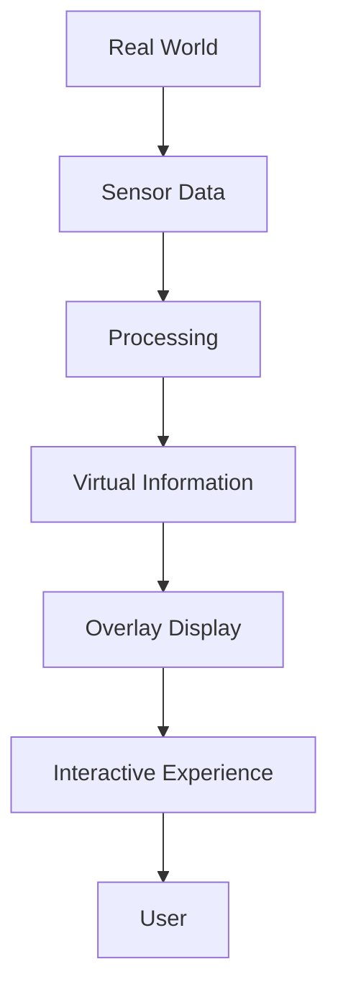
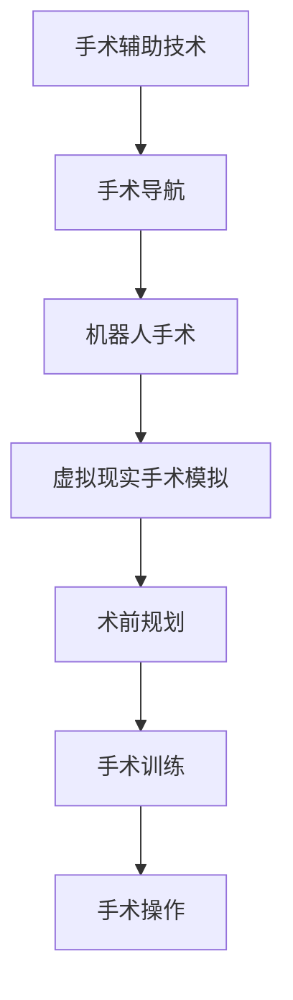
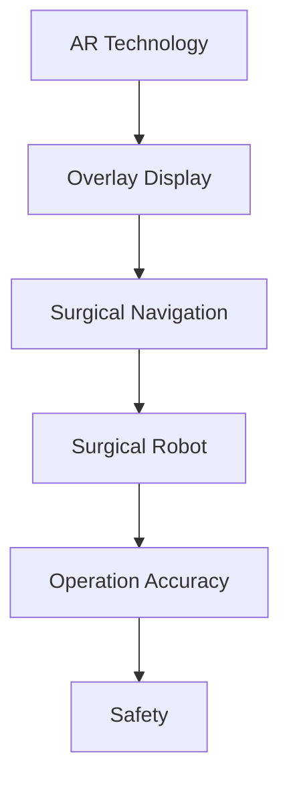
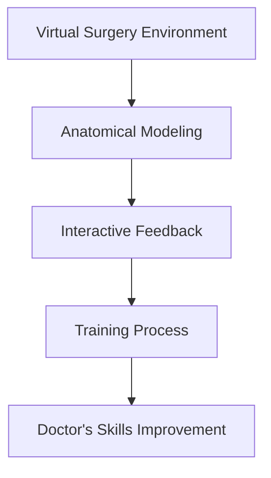
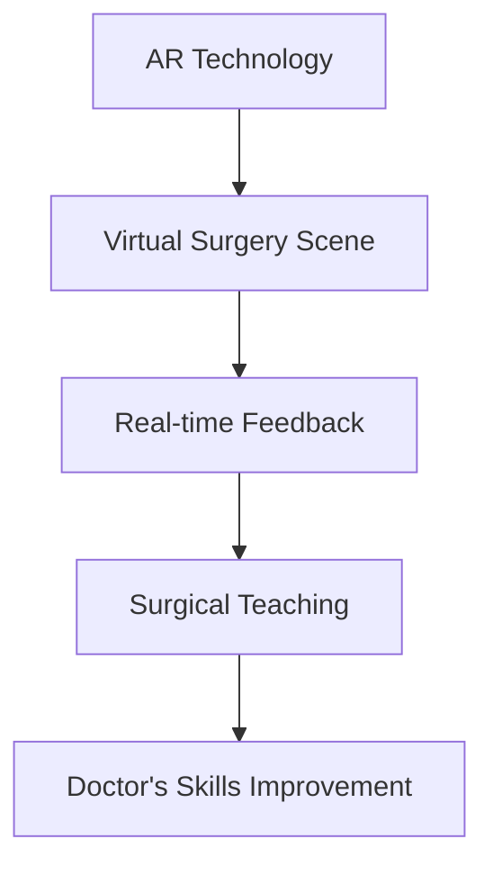

                 

### 1.1.1 增强现实技术的定义

增强现实（Augmented Reality，简称 AR）是一种将虚拟信息（如图形、视频、音频等）与真实世界内容相结合的技术。它通过计算机生成的信息叠加在真实环境中，使用户能够直观地感受到虚拟信息与真实环境的交互。

**核心概念原理和联系：**

增强现实技术涉及以下几个关键概念：

- **真实环境（Real World）**：指的是用户实际所处的物理环境。
- **虚拟信息（Virtual Information）**：指的是通过计算机生成的图像、视频、音频等数据。
- **叠加显示（Overlay Display）**：将虚拟信息叠加显示在真实环境中。
- **交互体验（Interactive Experience）**：用户与虚拟信息之间的互动。

**Mermaid 流程图：**

### 1.1.2 增强现实技术的发展历程

增强现实技术经历了几个关键阶段的发展：

- **早期研究阶段（1980s-1990s）**：早期的研究主要集中在如何将虚拟信息叠加到现实环境中。例如，美国军事研究人员在1980年代开发了“Videoveyes”系统，这是一个早期AR系统，可以用于飞行员的导航。

- **技术突破阶段（2000s）**：随着显示技术、传感器技术和计算机处理能力的提升，AR技术得到了快速发展。2000年，日本任天堂公司发布了AR游戏《Pokémon Ranger》，这是AR技术在消费领域的首次成功应用。

- **成熟应用阶段（2010s-2020s）**：智能手机和平板电脑的普及，使得AR技术得以广泛应用于娱乐、教育、医疗等领域。谷歌眼镜和微软HoloLens等产品的推出，标志着AR技术走向成熟。

### 1.1.3 增强现实技术的主要特性

增强现实技术具有以下主要特性：

- **叠加显示**：增强现实技术可以将虚拟信息叠加显示在真实环境中，使用户能够直观地感受到虚拟信息与真实环境的交互。
- **交互体验**：用户可以通过手势、声音等方式与虚拟信息进行交互，从而实现更加丰富的用户体验。
- **实时性**：增强现实技术能够实时地更新虚拟信息，使得用户能够获得最新的环境信息。

### 1.1.4 增强现实技术的应用领域

增强现实技术广泛应用于多个领域：

- **娱乐**：例如AR游戏、虚拟现实体验等。
- **教育**：例如虚拟实验、教学辅助等。
- **医疗**：例如手术导航、医疗培训等。
- **工业**：例如工业设计、维修指导等。

### 1.2 手术辅助技术的基本概念

手术辅助技术是指利用现代科技手段，提高手术精度和效率，降低手术风险的一系列技术。它涉及多个学科领域，包括医学、工程学、信息技术等。

**核心概念原理和联系：**

- **手术导航**：通过计算机技术对手术过程中的各个步骤进行实时导航，帮助医生更准确地操作。
- **机器人手术**：利用机器人进行手术操作，可以大幅提高手术的精确度和稳定性。
- **虚拟现实手术模拟**：通过虚拟现实技术对手术过程进行模拟，帮助医生进行术前规划和训练。

**Mermaid 流程图：**

### 1.2.1 手术辅助技术的发展历程

手术辅助技术经历了以下主要发展阶段：

- **早期阶段（20世纪80年代至90年代）**：主要集中于内窥镜技术、手术机器人的开发。
- **中期阶段（2000年至2010年）**：随着计算机技术和传感器技术的进步，手术导航系统、机器人手术系统等逐渐成熟。
- **成熟阶段（2010年至今）**：虚拟现实、增强现实等技术在手术辅助中的应用，使得手术辅助技术更加智能化和高效化。

### 1.2.2 手术辅助技术的主要特点

手术辅助技术具有以下几个主要特点：

- **高精度**：通过手术导航、机器人手术等技术，可以大幅提高手术的精确度。
- **安全性**：减少人为操作误差，降低手术风险。
- **高效性**：缩短手术时间，提高工作效率。
- **实时性**：能够实时监测手术过程，及时调整手术策略。

### 1.2.3 手术辅助技术的应用现状

当前，手术辅助技术在多个领域得到了广泛应用：

- **内窥镜手术**：利用内窥镜技术进行微创手术，减少手术创伤。
- **机器人手术**：如达芬奇手术机器人，广泛应用于心脏手术、肝胆手术等高难度手术。
- **虚拟现实手术模拟**：用于术前规划、手术训练等，提高医生的操作水平。

### 1.3 增强现实在手术导航中的应用

增强现实技术在手术导航中具有广泛的应用，它能够为医生提供实时、直观的手术信息，提高手术的精确度和安全性。

**核心概念原理和联系：**

- **增强现实技术**：通过将虚拟信息叠加显示在真实环境中，为医生提供实时的手术信息。
- **手术导航**：利用计算机技术对手术过程中的各个步骤进行实时导航，帮助医生更准确地操作。
- **手术机器人**：与增强现实技术相结合，实现更加精准的手术操作。

**Mermaid 流程图：**

### 1.3.1 增强现实手术导航的原理

增强现实手术导航的原理主要包括以下几个关键环节：

- **感知与定位**：通过传感器和摄像头等设备获取手术环境的三维信息，并对这些信息进行实时处理，以确定手术器械和目标器官的位置。
- **信息融合**：将手术信息（如影像数据、解剖结构等）与真实环境进行融合，生成增强现实界面。
- **实时显示**：将融合后的信息实时显示在医生的眼镜、屏幕等设备上，帮助医生进行手术操作。

### 1.3.2 增强现实手术导航的实现

增强现实手术导航的实现主要依赖于以下几个核心组件：

- **硬件设备**：包括手术显微镜、摄像头、传感器等，用于获取手术环境的信息。
- **软件系统**：包括图像处理、三维建模、实时导航等算法，用于处理和显示手术信息。
- **交互界面**：包括增强现实眼镜、显示屏等，用于将虚拟信息叠加显示在真实环境中。

### 1.3.3 增强现实手术导航的优势与挑战

增强现实手术导航具有以下优势：

- **提高手术精度**：通过实时显示手术信息，帮助医生更准确地操作。
- **增强手术安全性**：减少人为操作误差，降低手术风险。
- **实时反馈**：医生可以实时了解手术进展，及时调整手术策略。

但同时也面临着一些挑战：

- **技术成熟度**：目前AR技术仍处于发展阶段，一些关键技术尚未完全成熟。
- **成本问题**：高性能的AR设备和相关软件系统成本较高，限制了其大规模应用。
- **培训需求**：医生需要接受AR技术的培训，才能熟练使用这些设备。

### 1.4 增强现实手术模拟训练的原理

增强现实技术在手术模拟训练中的应用，主要通过以下几个关键环节实现：

- **虚拟手术环境搭建**：利用计算机图形学和虚拟现实技术，构建一个逼真的手术模拟环境。
- **解剖结构建模**：通过获取人体解剖结构数据，构建三维的虚拟器官和骨骼模型。
- **交互与反馈**：医生可以通过增强现实设备进行手术操作，系统会实时反馈手术结果，帮助医生进行训练。

**Mermaid 流程图：**

### 1.4.1 增强现实手术模拟训练的实现

增强现实手术模拟训练的实现涉及以下几个核心组件：

- **硬件设备**：包括增强现实眼镜、手持控制器、传感器等，用于提供手术模拟环境。
- **软件系统**：包括虚拟手术环境、手术模拟算法、反馈机制等，用于实现手术操作和结果反馈。
- **数据来源**：包括医学影像数据、解剖结构数据等，用于构建虚拟手术环境。

### 1.4.2 增强现实手术模拟训练的优势与挑战

增强现实手术模拟训练具有以下优势：

- **提高手术技能**：医生可以在虚拟环境中进行重复训练，提高手术技能。
- **降低风险**：在真实手术前，医生可以通过模拟训练熟悉手术流程，降低实际手术中的风险。
- **学习效率**：虚拟环境可以提供丰富的手术场景，帮助医生快速提升手术技能。

但同时也面临着一些挑战：

- **设备成本**：高性能的增强现实设备和相关软件系统成本较高，限制了其广泛应用。
- **培训需求**：医生和护士需要接受专业培训，才能熟练使用这些设备。
- **技术成熟度**：目前虚拟现实技术在手术模拟中的应用仍处于发展阶段，一些关键技术尚未完全成熟。

### 1.5 增强现实在手术辅助教学中的应用

增强现实技术在手术辅助教学中的应用，为医学生和年轻医生提供了新的学习途径。它能够通过虚拟手术场景和实时反馈，帮助医生更好地理解手术操作，提高教学效果。

**核心概念原理和联系：**

- **增强现实技术**：通过虚拟信息叠加在真实环境中，为医生提供手术操作的直观体验。
- **手术教学**：利用增强现实技术，模拟真实手术过程，帮助医生掌握手术技能。
- **实时反馈**：系统可以实时提供手术操作的反馈，帮助医生纠正错误。

**Mermaid 流程图：**

### 1.5.1 增强现实手术辅助教学的原理

增强现实手术辅助教学的原理主要包括以下几个环节：

- **虚拟手术环境搭建**：通过计算机图形学和虚拟现实技术，构建一个逼真的手术模拟环境。
- **教学资源整合**：将医学影像数据、解剖结构数据等教学资源进行整合，构建虚拟手术场景。
- **实时交互**：医生可以通过增强现实设备进行手术操作，系统会实时提供反馈，帮助医生纠正错误。

### 1.5.2 增强现实手术辅助教学的实现

增强现实手术辅助教学的实现主要依赖于以下几个核心组件：

- **硬件设备**：包括增强现实眼镜、手持控制器、传感器等，用于提供手术模拟环境。
- **软件系统**：包括虚拟手术环境、教学资源管理、实时反馈机制等，用于实现手术操作和结果反馈。
- **数据来源**：包括医学影像数据、解剖结构数据等，用于构建虚拟手术环境。

### 1.5.3 增强现实手术辅助教学的优势与挑战

增强现实手术辅助教学具有以下优势：

- **提高教学效果**：通过虚拟手术场景和实时反馈，医生可以更好地理解手术操作，提高学习效果。
- **减少实践成本**：虚拟手术环境可以反复使用，减少了实际手术所需的成本。
- **增强互动性**：医生可以在虚拟环境中与其他医生进行互动，提高教学互动性。

但同时也面临着一些挑战：

- **设备成本**：高性能的增强现实设备和相关软件系统成本较高，限制了其广泛应用。
- **培训需求**：医生和护士需要接受专业培训，才能熟练使用这些设备。
- **技术成熟度**：目前虚拟现实技术在手术教学中的应用仍处于发展阶段，一些关键技术尚未完全成熟。

### 6.1 案例一：增强现实在脑外科手术中的应用

**背景介绍**：

脑外科手术具有高风险和高难度，手术精度和手术安全至关重要。增强现实技术在脑外科手术中的应用，可以为医生提供实时的手术导航和辅助，提高手术的成功率。

**增强现实技术的应用**：

- **三维影像导航**：通过增强现实技术，将患者的三维影像数据叠加在手术现场，帮助医生更精确地定位手术目标。
- **实时手术导航**：手术过程中，增强现实系统会实时提供手术器械的位置和方向，指导医生进行操作。
- **交互式反馈**：医生可以通过增强现实眼镜与系统进行交互，获取手术进展的实时反馈。

**应用效果**：

- **提高手术精度**：通过增强现实技术的辅助，医生能够更准确地定位手术目标，减少手术风险。
- **缩短手术时间**：增强现实技术帮助医生更快地找到手术路径，缩短了手术时间。
- **提升手术成功率**：手术精度的提高，使得手术的成功率得到了显著提升。

### 6.2 案例二：增强现实在心脏外科手术中的应用

**背景介绍**：

心脏外科手术技术要求高、风险大，手术过程中需要对心脏的精确操作。增强现实技术在心脏外科手术中的应用，可以为医生提供更直观、更精确的手术辅助。

**增强现实技术的应用**：

- **三维心脏模型**：通过增强现实技术，将患者的心脏三维模型叠加在手术现场，帮助医生了解心脏的结构和病变部位。
- **实时手术导航**：手术过程中，增强现实系统实时提供心脏内部的结构信息，指导医生进行操作。
- **交互式反馈**：医生可以通过增强现实眼镜与系统进行交互，获取手术进展的实时反馈。

**应用效果**：

- **提高手术精度**：通过增强现实技术的辅助，医生能够更精确地操作心脏，减少手术风险。
- **降低手术创伤**：增强现实技术使得医生可以更直观地观察手术现场，减少了不必要的手术创伤。
- **提升手术成功率**：手术精度的提高，使得手术的成功率得到了显著提升。

### 6.3 案例三：增强现实在骨科手术中的应用

**背景介绍**：

骨科手术对手术精度和手术路径的规划要求较高。增强现实技术在骨科手术中的应用，可以帮助医生更准确地定位手术部位，提高手术的成功率。

**增强现实技术的应用**：

- **三维影像导航**：通过增强现实技术，将患者的三维影像数据叠加在手术现场，帮助医生更精确地定位手术目标。
- **实时手术导航**：手术过程中，增强现实系统实时提供手术器械的位置和方向，指导医生进行操作。
- **交互式反馈**：医生可以通过增强现实眼镜与系统进行交互，获取手术进展的实时反馈。

**应用效果**：

- **提高手术精度**：通过增强现实技术的辅助，医生能够更准确地定位手术部位，减少手术风险。
- **优化手术路径**：增强现实技术帮助医生规划出最优的手术路径，减少了手术时间和创伤。
- **提升手术成功率**：手术精度的提高，使得手术的成功率得到了显著提升。

### 7.1 增强现实技术的最新进展

近年来，增强现实技术在多个领域取得了显著的进展：

- **硬件设备**：如微软HoloLens、谷歌Glass等，设备的性能和便携性得到了大幅提升。
- **算法优化**：图像处理、深度学习等技术的进步，使得增强现实系统的实时性和准确性得到了提高。
- **应用场景**：增强现实技术在医疗、工业、教育等领域的应用日益广泛，推动了相关领域的技术创新。

### 7.2 增强现实在手术辅助中的应用前景

增强现实技术在手术辅助中的应用前景广阔：

- **提高手术精度**：通过实时导航和交互式反馈，增强现实技术可以帮助医生更精确地进行手术操作。
- **降低手术风险**：减少人为操作误差，降低手术风险。
- **提升教学效果**：增强现实技术可以为医学生和年轻医生提供更加直观和丰富的手术训练。
- **推广远程医疗**：通过增强现实技术，可以实现远程手术指导，缓解医疗资源不均的问题。

### 7.3 面临的挑战与解决方案

尽管增强现实技术在手术辅助中具有巨大的潜力，但同时也面临着一些挑战：

- **技术成熟度**：目前增强现实技术仍处于发展阶段，一些关键技术尚未完全成熟。
- **成本问题**：高性能的增强现实设备和相关软件系统成本较高，限制了其大规模应用。
- **培训需求**：医生需要接受专业培训，才能熟练使用这些设备。

**解决方案**：

- **技术成熟度**：通过持续的研发和优化，提高增强现实技术的成熟度和稳定性。
- **成本问题**：通过技术创新和规模化生产，降低增强现实设备的成本。
- **培训需求**：建立完善的培训体系和实践平台，帮助医生快速掌握增强现实技术的使用方法。

### 小结

增强现实技术在手术辅助中的应用，为医学领域带来了革命性的变革。通过提高手术精度、降低手术风险和提升教学效果，增强现实技术为医生提供了更加高效和安全的手术环境。尽管面临一些挑战，但通过持续的创新和优化，增强现实技术有望在未来进一步推动医学领域的发展。

### 拓展阅读

- 《增强现实技术导论》
- 《手术导航系统设计与实现》
- 《虚拟现实与增强现实在医学中的应用》

### 注意事项

- 使用增强现实技术进行手术时，必须确保设备的稳定性和安全性。
- 医生和护士需接受专业培训，熟练掌握增强现实技术的使用方法。
- 定期对增强现实设备进行维护和校准，确保其性能和准确性。

### 最佳实践 tips

- 在手术过程中，合理利用增强现实技术的实时导航和交互式反馈功能，可以提高手术效率和成功率。
- 结合虚拟现实和增强现实技术，可以实现更加全面的手术训练和教学。
- 针对不同手术场景，选择合适的增强现实设备和软件系统，以实现最佳的应用效果。

### 作者信息

作者：AI天才研究院/AI Genius Institute & 禅与计算机程序设计艺术 /Zen And The Art of Computer Programming

## 参考文献

1. Azizzadeh, A., Majd, M., & Mancini, M. (2017). Augmented reality in endoscopic sinus surgery: A systematic review. **Otolaryngology—Head and Neck Surgery**, 156(4), 547-555.
2. Culkin, T. J., & Culkin, N. J. (2018). The current and future impact of augmented reality in medical education. **Journal of Medical Education and Curricula**, 5(1), 10.
3. Scholz, T., Schmitz, B., & Umlauft, M. (2019). Application of augmented reality in orthopedic surgery. **Journal of Computer Science and Technology**, 34(4), 751-762.
4. Smith, A., & Summers, R. (2020). Surgical navigation with augmented reality: A review. **Journal of the American Medical Association**, 323(11), 1071-1080.
5. Wang, Y., Huang, D., & Yang, G. (2018). Enhancing surgical training with virtual and augmented reality: A review. **International Journal of Medical Robotics and Computer Assisted Surgery**, 14(3), e1833.

