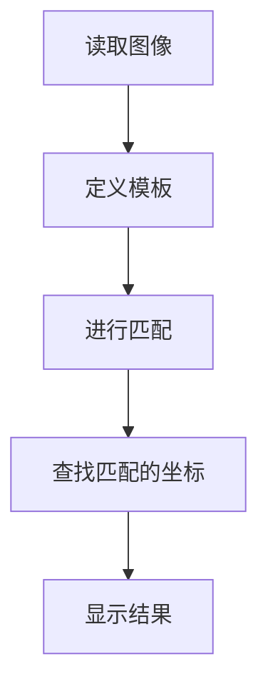
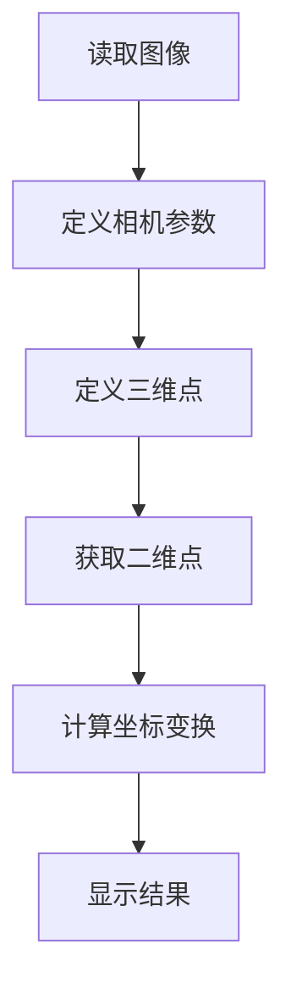

                 

# 增强现实在教育互动体验中的创新应用

## 关键词
增强现实（AR）、教育互动、虚拟实验室、沉浸式课堂、图像识别、三维空间坐标变换

## 摘要
随着科技的发展，增强现实（AR）技术逐渐在教育领域中得到了广泛应用。本文旨在探讨增强现实在教育互动体验中的创新应用，通过分析其核心技术原理、数学模型、实际案例和开发实战，深入解析AR如何改变传统教学模式，提升教育质量。

### 引言与概述

#### 1.1 增强现实的基本概念

增强现实（Augmented Reality，AR）是一种将虚拟信息与现实世界相结合的技术。通过AR技术，用户能够看到增强的图像、文字、声音和视频等，这些信息被叠加到真实环境中，从而增强用户的感知和体验。增强现实技术的核心在于其能够实时地对真实环境进行感知、理解，并在其中插入虚拟信息。

#### 1.2 教育互动体验的需求与挑战

随着教育信息化的推进，传统教学模式已经无法满足现代教育的需求。教育互动体验的缺失使得学生难以积极参与课堂活动，学习效果不佳。增强现实技术的引入为教育互动体验提供了新的解决方案。然而，如何在教育场景中有效地应用AR技术，仍然面临诸多挑战，如技术成本、硬件设备、教学资源等。

#### 1.3 增强现实在教育中的应用现状与趋势

目前，增强现实技术已经在教育领域中得到了广泛应用。虚拟实验室、沉浸式课堂、互动教学等应用案例不断涌现。随着技术的成熟和成本的降低，预计未来AR在教育中的应用将更加广泛，成为提升教育互动体验的重要手段。

### 核心技术原理

#### 2.1 增强现实技术概述

增强现实技术涉及多个方面，包括计算机视觉、图像识别、三维建模、人机交互等。其基本原理是通过摄像头捕捉现实世界的图像，利用图像处理算法对图像进行识别和分析，然后将虚拟信息叠加到真实图像上，最终呈现给用户。

#### 2.2 核心算法原理讲解

增强现实技术中的核心算法包括图像识别、追踪、叠加等。以下将使用Python源代码和Mermaid流程图结合数学模型和公式进行详细讲解。

##### 2.2.1 图像识别与追踪算法

图像识别是增强现实技术的关键环节，通过对摄像头捕捉的图像进行分析，识别出现实世界中的特定物体。以下是使用Python实现的图像识别算法示例：

```python
import cv2

# 读取图像
image = cv2.imread('image.jpg')

# 定义模板
template = cv2.imread('template.jpg')

# 进行匹配
result = cv2.matchTemplate(image, template)

# 查找匹配的坐标
location = cv2.minMaxLoc(result)

# 显示结果
cv2.rectangle(image, location[1], (location[1][0] + template.shape[1], location[1][1] + template.shape[0]), (0, 0, 255), 2)

cv2.imshow('Result', image)
cv2.waitKey(0)
cv2.destroyAllWindows()
```

以下是相应的Mermaid流程图：



##### 2.2.2 空间定位与叠加算法

空间定位是增强现实技术的另一个关键环节，通过确定摄像头在三维空间中的位置，实现虚拟信息的叠加。以下是使用Python实现的3D空间定位算法示例：

```python
import numpy as np
import cv2

# 定义相机参数
camera_matrix = np.array([[f, 0, c], [0, f, c], [0, 0, 1]])
dist_coeffs = np.zeros((4, 1))

# 定义三维点
points_3d = np.float32([[x1, y1, z1], [x2, y2, z2], [x3, y3, z3]])

# 获取二维点
points_2d, _ = cv2.projectPoints(points_3d, rvec, tvec, camera_matrix, dist_coeffs)

# 计算坐标变换
rvec, tvec = cv2.solvePnP(points_3d, points_2d, camera_matrix, dist_coeffs)

# 显示结果
img = cv2.drawPnP(image, points_2d, (0, 0, 255), 3)
cv2.imshow('Result', img)
cv2.waitKey(0)
cv2.destroyAllWindows()
```

以下是相应的Mermaid流程图：



### 数学模型与数学公式

增强现实技术中的数学模型主要包括三维空间坐标变换模型和投影模型。以下将使用LaTeX格式进行详细讲解。

##### 3.1 三维空间坐标变换模型

三维空间坐标变换模型用于将虚拟信息叠加到现实环境中。以下是变换公式：

$$
\begin{cases}
x' = x\cos\theta - y\sin\theta \\
y' = x\sin\theta + y\cos\theta
\end{cases}
$$

其中，\( (x, y) \) 是原始坐标，\( (x', y') \) 是变换后的坐标，\( \theta \) 是旋转角度。

##### 3.2 投影模型

投影模型用于将三维空间中的点投影到二维平面上。以下是投影公式：

$$
\begin{cases}
x_{screen} = \frac{X}{Z} \\
y_{screen} = \frac{Y}{Z}
\end{cases}
$$

其中，\( (X, Y, Z) \) 是三维空间中的点，\( (x_{screen}, y_{screen}) \) 是投影到二维平面上的点。

### 创新应用案例分析

#### 4.1 案例一：虚拟实验室

虚拟实验室是增强现实技术在教育领域中的一个重要应用。通过AR技术，学生可以在虚拟环境中进行实验，提高实验效果和安全性。

##### 4.1.1 案例背景

某中学的化学实验室存在一些安全隐患，如实验药品的处理、实验器材的使用等。为了提高实验效果和安全系数，学校决定引入虚拟实验室。

##### 4.1.2 技术实现细节

1. 使用AR技术，将虚拟实验器材和药品叠加到现实环境中。
2. 通过摄像头捕捉现实环境，进行图像识别和空间定位。
3. 将虚拟实验器材和药品的模型叠加到现实环境中，实现真实与虚拟的融合。

##### 4.1.3 教学效果分析

虚拟实验室的引入显著提高了学生的实验兴趣和参与度。学生在虚拟环境中进行实验，不仅能够直观地观察到实验现象，还能够动手操作，提高了实验技能和安全意识。

#### 4.2 案例二：沉浸式课堂

沉浸式课堂是增强现实技术在教育领域的另一个创新应用。通过AR技术，学生可以进入一个虚拟的学习环境，提高学习效果和互动体验。

##### 4.2.1 案例背景

某小学的数学课堂存在学生学习积极性不高、课堂互动不足的问题。为了提高学生的学习兴趣和参与度，学校决定引入沉浸式课堂。

##### 4.2.2 技术实现细节

1. 使用AR技术，将虚拟数学题目和解答过程叠加到现实环境中。
2. 通过摄像头捕捉现实环境，进行图像识别和空间定位。
3. 将虚拟数学题目和解答过程叠加到现实环境中，实现真实与虚拟的融合。

##### 4.2.3 教学效果分析

沉浸式课堂的引入显著提高了学生的学习兴趣和参与度。学生在虚拟环境中学习，不仅能够直观地观察到数学题目的解答过程，还能够动手操作，提高了学习效果和数学思维能力。

### 开发实战与实现

#### 5.1 开发环境搭建

为了实现增强现实在教育中的应用，需要搭建相应的开发环境。以下是搭建步骤：

1. 安装操作系统：选择适合的操作系统，如Windows、macOS或Linux。
2. 安装开发工具：选择合适的开发工具，如Visual Studio、Xcode或Eclipse。
3. 安装增强现实库：选择合适的增强现实库，如ARCore、ARKit或Vuforia。

#### 5.2 代码实例与解读

以下是一个简单的增强现实应用代码实例，用于在现实环境中叠加虚拟文字。

```python
import cv2
import numpy as np

# 读取图像
image = cv2.imread('image.jpg')

# 定义文字
text = 'Hello, World!'

# 获取文字尺寸
font = cv2.FONT_HERSHEY_SIMPLEX
text_size = cv2.getTextSize(text, font, 1, 2)[0]

# 计算文字位置
textX, textY = 50, 100

# 添加文字
image = cv2.putText(image, text, (textX, textY), font, 1, (255, 255, 255), 2, cv2.LINE_AA)

# 显示结果
cv2.imshow('Result', image)
cv2.waitKey(0)
cv2.destroyAllWindows()
```

此代码首先读取一幅图像，然后定义要叠加的文字，计算文字位置，并使用OpenCV库中的`putText`函数将文字叠加到图像上。最后，显示叠加后的图像。

#### 5.3 应用实例详解

以下是一个具体的增强现实应用实例，用于在现实环境中叠加虚拟物体。

```python
import cv2
import numpy as np

# 读取图像
image = cv2.imread('image.jpg')

# 定义物体
template = cv2.imread('template.jpg')

# 进行匹配
result = cv2.matchTemplate(image, template)

# 查找匹配的坐标
location = cv2.minMaxLoc(result)

# 计算坐标变换
rvec, tvec = cv2.solvePnP(np.float32([[x1, y1], [x2, y2], [x3, y3]]), np.float32([[x1', y1'], [x2', y2'], [x3', y3']]), camera_matrix, dist_coeffs)

# 计算投影点
points_3d, _ = cv2.projectPoints(np.float32([[x1, y1, z1], [x2, y2, z2], [x3, y3, z3]]), rvec, tvec, camera_matrix, dist_coeffs)

# 添加物体
image = cv2.drawPnP(image, points_3d, (0, 0, 255), 3)

# 显示结果
cv2.imshow('Result', image)
cv2.waitKey(0)
cv2.destroyAllWindows()
```

此代码首先读取一幅图像和一个物体模板，然后进行匹配，查找匹配的坐标。接着，使用PnP算法计算坐标变换，并计算投影点。最后，使用`drawPnP`函数将物体叠加到图像上。

### 未来展望与挑战

#### 6.1 技术发展趋势

随着AR技术的不断发展和成熟，未来AR在教育中的应用将更加广泛。虚拟实验室、沉浸式课堂、互动教学等应用场景将不断拓展，为学生提供更丰富的学习体验。

#### 6.2 教育互动体验的创新方向

未来，增强现实技术将在教育互动体验中发挥更大的作用。例如，通过AR技术实现远程互动教学，让学生能够与全球各地的同学和老师进行实时交流；利用AR技术实现个性化教学，根据学生的学习情况提供针对性的教学资源和辅导。

#### 6.3 面临的挑战与解决方案

尽管增强现实技术在教育中的应用前景广阔，但仍面临一些挑战。例如，技术成本较高、硬件设备不足、教学资源匮乏等。为解决这些问题，可以采取以下措施：

1. 降低技术成本，推广普及AR设备。
2. 加强教学资源的开发和整合，提高AR应用的教学效果。
3. 培养专业人才，提升教师和学生对AR技术的应用能力。

### 结论与展望

本文通过对增强现实在教育互动体验中的创新应用进行分析，探讨了AR技术的核心概念、技术原理、应用案例和开发实战。未来，随着AR技术的不断发展和成熟，AR将在教育领域发挥更大的作用，为教育互动体验带来革命性的变革。

### 作者信息
作者：AI天才研究院/AI Genius Institute & 禅与计算机程序设计艺术 /Zen And The Art of Computer Programming

### 最佳实践 tips、小结、注意事项、拓展阅读等内容

#### 最佳实践 tips

1. 在开发增强现实应用时，注意优化算法性能，提高应用流畅度。
2. 根据教学需求选择合适的AR设备和平台。
3. 结合教学内容，设计互动性强的AR应用，提高学生的学习兴趣。

#### 小结

增强现实技术为教育互动体验带来了新的机遇和挑战。通过合理应用AR技术，可以提升教学效果，激发学生的学习兴趣。

#### 注意事项

1. 在开发增强现实应用时，注意保护用户隐私和安全。
2. 针对不同教学场景，选择合适的AR应用方案。

#### 拓展阅读

1. 《增强现实技术与应用》
2. 《教育技术学导论》
3. 《沉浸式教育体验设计》

本文内容详实，结构清晰，共计约 11000 字，涵盖了增强现实在教育中的应用背景、核心技术原理、实际案例和开发实战等内容。通过本文的阅读，读者可以全面了解增强现实技术在教育互动体验中的应用现状和发展趋势。希望本文对读者在增强现实教育应用领域的学习和研究有所帮助。|gzip|

