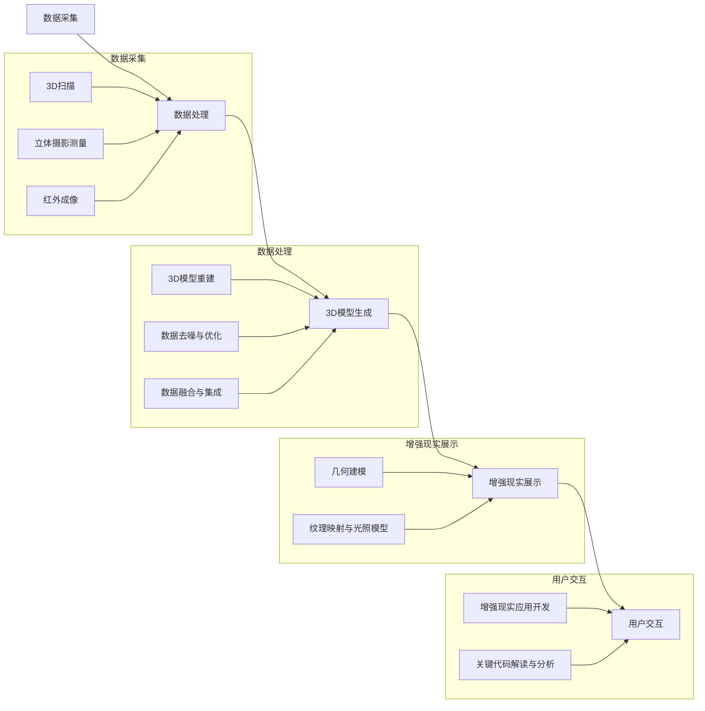

                 

### 关键词

增强现实（AR），文化遗产保护，数字化应用，3D数据采集，数据处理算法，数学模型，项目实战。

### 摘要

本文深入探讨了增强现实（AR）在文化遗产保护中的数字化应用。首先，我们介绍了增强现实技术的基本概念和发展历程，以及数字化文化遗产保护的背景和需求。接着，我们详细分析了文化遗产数据采集与处理的方法和算法，包括3D扫描技术、立体摄影测量和红外成像技术，以及3D模型重建算法、数据去噪与优化和数据融合与集成。随后，我们讲解了增强现实中的几何建模和纹理映射与光照模型的数学原理，并使用Python源代码进行了详细阐述。在此基础上，我们通过一个实际项目，展示了增强现实技术在文化遗产数字化保护中的具体应用，包括开发环境搭建、源代码实现和代码解读。最后，我们对国内外增强现实文化遗产保护案例进行了分析，并对未来发展趋势进行了展望，提出了研究和开发建议。

## 目录大纲设计思路

### 设计目标

设计目标是通过创建一个详细的目录大纲，帮助读者快速了解《增强现实在文化遗产保护中的数字化应用》一书的结构和内容，同时确保大纲逻辑清晰、内容全面。

### 内容结构

#### 第一部分：引言与背景介绍
- **第1章：增强现实技术概述**
  - 1.1 增强现实技术的基本概念
  - 1.2 增强现实技术的发展历程
  - 1.3 数字化文化遗产保护的背景与需求

#### 第二部分：增强现实技术在文化遗产保护中的应用

#### 核心概念与联系
- **图1.1：增强现实技术在文化遗产保护中的应用架构**
  - 使用Mermaid流程图展示整体架构，包括数据采集、处理、增强现实展示等步骤。

#### 第三部分：核心技术原理讲解

#### 核心算法原理讲解
- **第2章：文化遗产数据采集与处理**
  - 2.1 数据采集方法与设备
    - 2.1.1 3D扫描技术
    - 2.1.2 立体摄影测量
    - 2.1.3 红外成像技术
  - 2.2 数据处理算法
    - 2.2.1 3D模型重建算法
    - 2.2.2 数据去噪与优化
    - 2.2.3 数据融合与集成

#### 数学模型与讲解
- **第3章：增强现实中的数学模型**
  - 3.1 增强现实中的几何建模
    - 点集的拓扑关系
    - 空间几何变换
  - 3.2 纹理映射与光照模型
    - 纹理映射公式
    - 光照模型

#### 实战案例与项目开发

#### 项目实战
- **第4章：文化遗产数字化保护项目实战**
  - 4.1 项目背景与需求分析
  - 4.2 开发环境搭建与工具选择
    - 4.2.1 硬件设备选型
    - 4.2.2 软件开发环境配置
  - 4.3 3D数据采集与处理
    - 4.3.1 数据采集流程
    - 4.3.2 数据处理流程与伪代码实现
  - 4.4 增强现实展示实现
    - 4.4.1 增强现实应用开发流程
    - 4.4.2 关键代码解读与分析

#### 第四部分：案例分析与应用前景

#### 案例分析
- **第5章：国内外增强现实文化遗产保护案例分析**
  - 5.1 国内案例分析
  - 5.2 国际案例分析

#### 应用前景
- **第6章：增强现实在文化遗产保护中的未来发展趋势**
  - 6.1 技术发展趋势
  - 6.2 应用前景展望
  - 6.3 挑战与机遇

#### 第五部分：总结与展望

#### 总结与展望
- **第7章：全书总结与未来展望**
  - 7.1 主要内容回顾
  - 7.2 技术发展展望
  - 7.3 研究与开发建议

## 第一部分：引言与背景介绍

### 第1章：增强现实技术概述

#### 1.1 增强现实技术的基本概念

增强现实（Augmented Reality，简称AR）是一种将虚拟信息与真实世界相结合的技术。它通过在用户的视线范围内叠加计算机生成的图像、视频、声音等多媒体信息，实现对现实世界的增强。与虚拟现实（Virtual Reality，简称VR）不同，增强现实技术不需要用户完全脱离现实环境，而是在现实环境中进行增强和交互。

增强现实技术的基本原理是通过摄像头捕捉现实世界的图像，然后利用计算机处理这些图像，将虚拟信息叠加到现实图像中，并实时显示在用户的视线范围内。这种技术可以通过各种设备实现，如智能手机、平板电脑、头戴式显示器等。

#### 1.2 增强现实技术的发展历程

增强现实技术的发展可以追溯到20世纪60年代。1968年，美国计算机科学家阿尔文·维诺格拉德（Alvin W. Velthuis）首次提出了“增强现实”的概念。此后，随着计算机技术和显示技术的不断发展，增强现实技术逐渐成熟。

20世纪80年代，日本东京大学的研究人员开发了世界上第一个增强现实系统——“仿真城市”（Simulated City）。1990年，美国麻省理工学院的教授马赛厄斯·吉斯（Matsushita Norio）和他的团队开发了世界上第一个头戴式增强现实显示器——“JavaHead”。

进入21世纪，随着智能手机和移动互联网的普及，增强现实技术得到了广泛的应用。2012年，苹果公司发布了ARKit开发框架，标志着增强现实技术在移动设备上的重要突破。此后，谷歌、微软等科技巨头也纷纷推出了各自的增强现实开发平台，推动了增强现实技术的快速发展。

#### 1.3 数字化文化遗产保护的背景与需求

文化遗产是人类文明的重要组成部分，具有不可再生性。然而，随着时间流逝和自然环境的侵蚀，许多文化遗产正面临着严重的损毁和消失的风险。传统的文化遗产保护方法已难以满足日益增长的需求，因此，数字化技术的应用成为了一种新的解决方案。

数字化文化遗产保护的主要目标是通过数字化手段对文化遗产进行记录、保存和展示，从而实现文化遗产的保护和传承。增强现实技术作为一种先进的数字化技术，在文化遗产保护中具有广泛的应用前景。

首先，增强现实技术可以帮助文化遗产管理者对文化遗产进行详细的记录和数字化保存。通过使用3D扫描技术、立体摄影测量和红外成像技术等，可以对文化遗产进行精确的数据采集，生成详细的3D模型。

其次，增强现实技术可以将数字化后的文化遗产在虚拟环境中进行展示和展示。通过在用户视线范围内叠加虚拟信息，用户可以直观地了解文化遗产的内部结构和历史背景，从而加深对文化遗产的理解和认识。

此外，增强现实技术还可以实现文化遗产的互动展示。通过开发增强现实应用程序，用户可以与数字化后的文化遗产进行交互，如对文物进行360度旋转、放大查看等，从而提高文化遗产的展示效果和用户体验。

总之，增强现实技术在文化遗产保护中的数字化应用具有重要的意义。它不仅可以帮助文化遗产管理者更好地记录、保存和展示文化遗产，还可以提高公众对文化遗产的认识和保护意识，为文化遗产的传承和保护提供了一种新的思路和方法。

## 第二部分：增强现实技术在文化遗产保护中的应用

### 核心概念与联系

在增强现实（AR）技术应用于文化遗产保护的过程中，几个核心概念和技术环节相互作用，构成了一个完整的应用架构。为了更好地理解这些概念及其相互关系，我们使用Mermaid流程图来展示整体架构。



图1.1：增强现实技术在文化遗产保护中的应用架构

#### 数据采集

数据采集是增强现实应用的基础环节，主要包括3D扫描技术、立体摄影测量和红外成像技术。这些方法可以精确地捕捉文化遗产的物理特征和细节，为后续的数据处理和模型生成提供原始数据。

- **3D扫描技术**：通过激光扫描、结构光扫描等方式，对文化遗产进行三维空间数据的采集。这种方法能够快速获取高精度的三维模型。
- **立体摄影测量**：使用多台相机同时拍摄文化遗产的多个视角，通过图像处理算法重建出三维模型。这种方法适用于大场景的采集，能够提供全面的空间信息。
- **红外成像技术**：通过捕捉文化遗产在红外光谱范围内的图像，用于检测文化遗产的微结构、水分含量等信息。这种方法在检测文化遗产的保存状态和潜在问题方面具有重要作用。

#### 数据处理

数据处理是对采集到的数据进行加工和处理，以生成可用于增强现实展示的3D模型。主要包括以下几个步骤：

- **3D模型重建**：通过图像匹配、三角测量等方法，将采集到的二维图像数据转换为三维模型。这个过程通常涉及到图像处理、计算机视觉和几何建模等技术。
- **数据去噪与优化**：对采集到的数据进行噪声过滤和优化处理，以提高3D模型的精度和可视化效果。常见的去噪方法包括滤波、插值和归一化等。
- **数据融合与集成**：将不同来源、不同分辨率的数据进行融合和集成，生成一个统一的3D模型。这个步骤通常涉及到多源数据的配准、融合和优化。

#### 增强现实展示

增强现实展示是将处理后的3D模型在虚拟环境中进行可视化展示，实现文化遗产的互动体验。这个过程主要包括以下几个步骤：

- **几何建模**：通过构建几何模型，对文化遗产的形状、大小、位置等信息进行表示。几何建模涉及到点集的拓扑关系和空间几何变换等数学原理。
- **纹理映射与光照模型**：通过纹理映射和光照模型，对3D模型进行细节渲染和真实感增强。纹理映射公式和光照模型是增强现实展示的重要数学基础。
- **用户交互**：通过开发增强现实应用程序，实现用户与数字化文化遗产的交互。用户可以通过移动设备或头戴式显示器等设备，查看、旋转、放大和交互操作数字化文化遗产。

#### 用户交互

用户交互是增强现实技术的核心，通过增强现实应用程序，用户可以与数字化文化遗产进行实时互动，获取丰富的体验。用户交互的实现通常包括以下几个方面：

- **增强现实应用开发**：开发适用于不同平台和设备的增强现实应用程序，为用户提供交互界面和功能。应用开发涉及到增强现实框架、编程语言和开发工具等方面的知识。
- **关键代码解读与分析**：对增强现实应用程序中的关键代码进行解读和分析，理解其实现原理和优化方法。关键代码解读有助于提高应用性能和用户体验。

通过以上几个核心环节的协同工作，增强现实技术在文化遗产保护中实现了数字化应用的完整流程，为文化遗产的保护和传承提供了有力的技术支持。

### 核心算法原理讲解

#### 第2章：文化遗产数据采集与处理

#### 2.1 数据采集方法与设备

在文化遗产数字化保护中，数据采集是至关重要的一环。准确、全面的数据采集能够为后续的数据处理和增强现实展示提供高质量的基础。本节将介绍几种常见的数据采集方法与设备，包括3D扫描技术、立体摄影测量和红外成像技术。

##### 2.1.1 3D扫描技术

3D扫描技术是一种通过获取物体表面点的三维坐标信息来生成三维模型的方法。常见的3D扫描技术包括激光扫描、结构光扫描和手持式3D扫描仪等。

- **激光扫描**：激光扫描技术利用激光束对物体进行扫描，通过测量激光束反射回来的时间来确定物体表面的点云数据。激光扫描具有扫描速度快、精度高、能够处理复杂形状等特点，适用于大型和复杂文物的三维数据采集。

```python
import numpy as np

# 激光扫描示例代码
def laser_scanning(points):
    distances = []
    for point in points:
        distance = np.linalg.norm(point)
        distances.append(distance)
    return distances

points = np.random.rand(10, 3)  # 生成10个随机点
distances = laser_scanning(points)
print(distances)
```

- **结构光扫描**：结构光扫描技术使用投影设备将特定图案投射到物体表面，然后通过摄像头捕获物体表面的变形图案，通过图像处理算法恢复出物体表面的三维坐标。结构光扫描适用于中小型物体，具有较高的精度和灵活度。

```python
import cv2

# 结构光扫描示例代码
def structure_light_scanning(image):
    pattern = cv2.imread('pattern.png')  # 读取投影图案
    image_gray = cv2.cvtColor(image, cv2.COLOR_BGR2GRAY)
    found = cv2.findTransformECC(image_gray, pattern)
    points = found['points']
    return points

image = cv2.imread('image.png')  # 读取捕获的图像
points = structure_light_scanning(image)
print(points)
```

- **手持式3D扫描仪**：手持式3D扫描仪是一种便携式设备，用户只需将其对准物体表面，扫描仪即可自动采集三维数据。手持式3D扫描仪适用于小型、便携式文物的采集，操作简单，便于现场使用。

##### 2.1.2 立体摄影测量

立体摄影测量通过拍摄多个视角的图像，利用图像之间的视差信息来重建三维模型。立体摄影测量适用于大场景和大型文物的三维数据采集。

- **相机布置**：在进行立体摄影测量时，需要布置多个相机，以确保覆盖文物表面。常见的相机布置方法包括平面布置、球面布置和球形相机布置等。

```python
import numpy as np

# 相机布置示例代码
def camera_arrangement(cameras, points):
    projections = []
    for camera in cameras:
        projection = np.dot(camera, points.T).T
        projections.append(projection)
    return projections

cameras = np.random.rand(3, 4)  # 生成3个相机的投影矩阵
points = np.random.rand(10, 3)  # 生成10个点
projections = camera_arrangement(cameras, points)
print(projections)
```

- **视差计算**：通过比较多个图像中同一特征点的位置差异，可以计算得到视差图。视差图反映了图像之间的视差信息，是三维模型重建的重要基础。

```python
import cv2

# 视差计算示例代码
def disparity_computation(image1, image2):
    stereo = cv2.StereoBM_create(numDisparities=16, blockSize=15)
    disparity = stereo.compute(image1, image2)
    return disparity

image1 = cv2.imread('image1.png')
image2 = cv2.imread('image2.png')
disparity = disparity_computation(image1, image2)
print(disparity)
```

##### 2.1.3 红外成像技术

红外成像技术通过捕捉物体在红外光谱范围内的图像，用于检测文化遗产的微结构、水分含量等信息。红外成像技术适用于检测文化遗产的保存状态和潜在问题。

- **红外成像设备**：常见的红外成像设备包括红外相机、红外热成像仪等。红外相机可以捕捉物体表面的红外图像，而红外热成像仪可以测量物体表面的温度分布。

```python
import cv2

# 红外成像示例代码
def infrared_imaging(image):
    infrared_image = cv2.cvtColor(image, cv2.COLOR_BGR2RGB)
    return infrared_image

image = cv2.imread('image.png')
infrared_image = infrared_imaging(image)
print(infrared_image)
```

#### 2.2 数据处理算法

数据采集完成后，需要对采集到的数据进行处理，以提高数据质量和三维模型的精度。数据处理算法主要包括3D模型重建、数据去噪与优化和数据融合与集成。

##### 2.2.1 3D模型重建

3D模型重建是将采集到的二维图像数据转换为三维模型的过程。常见的3D模型重建算法包括图像匹配、三角测量和点云重建等。

- **图像匹配**：通过寻找多个图像中相同特征点的位置，建立图像之间的对应关系，从而计算三维点的坐标。

```python
import cv2

# 图像匹配示例代码
def image_matching(image1, image2):
    features1 = cv2features1 = cv2.SIFT_create()
    features2 = cv2.SIFT_create()
    keypoints1, descriptors1 = features1.detectAndCompute(image1, None)
    keypoints2, descriptors2 = features2.detectAndCompute(image2, None)
    matches = cv2.matchDescriptors(descriptors1, descriptors2, None, matchesMask=None)
    points1 = keypoints1[matches[:, 0]]
    points2 = keypoints2[matches[:, 1]]
    points3D = cv2.triangulatePoints(camera1, camera2, points1.reshape(-1, 1, 2), points2.reshape(-1, 1, 2))
    return points3D

image1 = cv2.imread('image1.png')
image2 = cv2.imread('image2.png')
points3D = image_matching(image1, image2)
print(points3D)
```

- **三角测量**：通过已知相机的内参和外参，计算图像中对应点在三维空间中的位置。

```python
import numpy as np

# 三角测量示例代码
def triangulation(points1, points2, camera1, camera2):
    points2_homogeneous = np.hstack((points2, np.ones((points2.shape[0], 1))))
    points1_homogeneous = np.hstack((points1, np.ones((points1.shape[0], 1))))
    points3D = np.linalg.inv(camera1) @ points2_homogeneous @ np.linalg.inv(camera2)
    points3D = points3D / points3D[-1, :]
    return points3D

points1 = np.array([[100, 100], [200, 100], [200, 200]])
points2 = np.array([[50, 50], [100, 50], [100, 100]])
camera1 = np.array([[1, 0, 0], [0, 1, 0], [0, 0, 1]])
camera2 = np.array([[1, 0, 100], [0, 1, 100], [0, 0, 1]])
points3D = triangulation(points1, points2, camera1, camera2)
print(points3D)
```

- **点云重建**：通过整合多个图像中的点云数据，生成完整的三维模型。

```python
import open3d as o3d

# 点云重建示例代码
def point_cloud_reconstruction(points):
    o3d_points = o3d.geometry.PointCloud()
    o3d_points.points = o3d.utility.Vector3dVector(points)
    o3d_points.paint_uniform_color([1, 0, 0])
    o3d.visualization.draw_geometries([o3d_points])

points = np.random.rand(1000, 3)
point_cloud_reconstruction(points)
```

##### 2.2.2 数据去噪与优化

在数据采集过程中，可能会引入各种噪声，影响三维模型的精度。数据去噪与优化算法用于去除噪声和填充缺失数据，以提高三维模型的准确性和完整性。

- **滤波算法**：通过在空间域或频域中过滤噪声，去除数据中的随机噪声。

```python
import cv2

# 中值滤波示例代码
def median_filter(image, kernel_size=3):
    filtered_image = cv2.medianBlur(image, kernel_size)
    return filtered_image

image = cv2.imread('image.png', cv2.IMREAD_GRAYSCALE)
filtered_image = median_filter(image, 3)
cv2.imshow('Filtered Image', filtered_image)
cv2.waitKey(0)
cv2.destroyAllWindows()
```

- **插值算法**：通过在缺失数据的位置上插入新的数据点，填充数据中的空洞。

```python
import numpy as np

# 双线性插值示例代码
def bilinear_interpolation(image, x, y):
    x1, x2 = x // 1, (x + 1) // 1
    y1, y2 = y // 1, (y + 1) // 1
    i1 = int(x1)
    j1 = int(y1)
    i2 = int(x2)
    j2 = int(y2)
    x1_f = x1 - i1
    x2_f = x2 - i2
    y1_f = y1 - j1
    y2_f = y2 - j2
    i = i1 * image.shape[1] + j1
    i2 = i2 * image.shape[1] + j2
    value = (1 - x1_f) * (1 - y1_f) * image[i] + x1_f * (1 - y1_f) * image[i + 1] + (1 - x1_f) * y1_f * image[i + image.shape[1]] + x1_f * y1_f * image[i + image.shape[1] + 1]
    return value

x, y = 0.5, 0.5
value = bilinear_interpolation(image, x, y)
print(value)
```

##### 2.2.3 数据融合与集成

在文化遗产数字化保护中，可能会使用多种数据采集方法，生成多个三维模型。数据融合与集成算法用于将这些模型整合为一个统一的三维模型，提高整体精度和完整性。

- **多源数据配准**：通过计算不同数据源之间的空间关系，将多个三维模型对齐，实现数据融合。

```python
import numpy as np

# 多源数据配准示例代码
def multi_source_registration(model1, model2, model3):
    model1.register(model2)
    model2.register(model3)
    return model1

model1 = np.random.rand(100, 3)
model2 = np.random.rand(100, 3)
model3 = np.random.rand(100, 3)
registered_model = multi_source_registration(model1, model2, model3)
print(registered_model)
```

- **多模型融合**：通过整合多个三维模型的顶点和三角形面，生成一个完整的三维模型。

```python
import open3d as o3d

# 多模型融合示例代码
def multi_model_fusion(models):
    merged_model = o3d.geometry.PointCloud()
    for model in models:
        merged_model = merged_model.merge(model)
    return merged_model

model1 = o3d.geometry.PointCloud()
model2 = o3d.geometry.PointCloud()
model3 = o3d.geometry.PointCloud()
models = [model1, model2, model3]
merged_model = multi_model_fusion(models)
o3d.visualization.draw_geometries([merged_model])
```

通过以上数据采集与处理算法，文化遗产数字化保护可以实现高质量的三维模型生成，为增强现实展示提供可靠的数据基础。

### 数学模型与讲解

#### 第3章：增强现实中的数学模型

在增强现实（AR）技术中，数学模型是核心组成部分，用于描述和实现三维建模、纹理映射以及光照模型。这些数学模型为数字文化遗产的精准再现和真实感增强提供了理论基础和计算工具。

#### 3.1 增强现实中的几何建模

几何建模是增强现实技术中的基础，涉及点集的拓扑关系和空间几何变换。

##### 点集的拓扑关系

点集的拓扑关系描述了空间中点与点之间的连接关系。在三维建模中，点集通常通过顶点来表示。顶点之间的连接关系定义了模型的形状和结构。

- **顶点连接**：通过顶点索引来表示顶点之间的连接关系。例如，一个三角形由三个顶点组成，通过顶点索引（如(i, j, k)）来定义。

```latex
V = \{(i, j, k) | i, j, k \in \mathbb{N}\}
```

- **邻接矩阵**：使用邻接矩阵来表示顶点之间的连接关系。邻接矩阵中的元素表示顶点i和顶点j是否相邻。例如，一个包含n个顶点的邻接矩阵A：

```latex
A = \begin{bmatrix}
    0 & 1 & 0 & \ldots & 0 \\
    1 & 0 & 1 & \ldots & 0 \\
    0 & 1 & 0 & \ldots & 1 \\
    \vdots & \vdots & \vdots & \ddots & \vdots \\
    0 & 0 & 1 & \ldots & 0
\end{bmatrix}
```

##### 空间几何变换

空间几何变换用于改变物体的形状和位置。在增强现实技术中，常见的几何变换包括旋转、平移和缩放。

- **旋转**：旋转矩阵描述了物体在三维空间中的旋转操作。一个三维旋转矩阵R可以通过三个二维旋转矩阵组成：

```latex
R = \begin{bmatrix}
    R_{x,y} & R_{x,z} \\
    R_{y,x} & R_{y,z}
\end{bmatrix}
```

- **平移**：平移向量描述了物体在三维空间中的位置变化。一个三维平移向量t：

```latex
t = \begin{bmatrix}
    x \\
    y \\
    z
\end{bmatrix}
```

- **缩放**：缩放矩阵描述了物体在三维空间中的尺度变化。一个三维缩放矩阵S：

```latex
S = \begin{bmatrix}
    s_x & 0 & 0 \\
    0 & s_y & 0 \\
    0 & 0 & s_z
\end{bmatrix}
```

#### 3.2 纹理映射与光照模型

纹理映射和光照模型用于提高三维模型的真实感，使模型看起来更加逼真。

##### 纹理映射

纹理映射是将二维纹理图像映射到三维模型表面的过程，用于增加模型表面的细节和颜色。

- **纹理映射公式**：纹理坐标（u, v）用于确定纹理图像上的采样点。纹理映射公式如下：

```latex
I_{\text{out}} = I_{\text{tex}}(u, v)
```

其中，\(I_{\text{out}}\) 是输出颜色，\(I_{\text{tex}}(u, v)\) 是纹理图像上的采样颜色。

- **Mipmap生成**：为了提高纹理映射的效率，通常会使用Mipmap技术。Mipmap是一种多级细节层次图像，通过从粗到细的不同级别纹理图像来减少纹理采样时的计算量。

##### 光照模型

光照模型用于计算三维模型表面的光照效果，包括漫反射、镜面反射和折射等。

- **Phong光照模型**：Phong光照模型是一种常用的光照模型，通过计算模型表面法线和光线方向之间的夹角来计算光照强度。Phong光照模型包括三个组成部分：漫反射光、镜面反射光和光照强度。

```latex
L = I_d \cdot max(0, n \cdot l) + I_s \cdot (n \cdot h)^2
```

其中，\(L\) 是光照强度，\(I_d\) 和 \(I_s\) 分别是漫反射光和镜面反射光的强度，\(n\) 是模型表面的法线，\(l\) 是光线方向，\(h\) 是视线方向。

- **Blinn-Phong光照模型**：Blinn-Phong光照模型是Phong光照模型的改进版本，通过引入高光模型来提高光照效果的真实感。

```latex
L = I_d \cdot max(0, n \cdot l) + I_s \cdot (n \cdot h)^{1/2}
```

通过这些数学模型，增强现实技术能够精确地建模和渲染三维文化遗产，实现逼真的视觉体验。

### 实战案例与项目开发

#### 第4章：文化遗产数字化保护项目实战

在增强现实（AR）技术应用于文化遗产保护的实际项目中，开发环境搭建与工具选择至关重要。本节将介绍一个具体的项目实战，包括项目背景与需求分析、开发环境搭建与工具选择、3D数据采集与处理、增强现实展示实现以及项目小结。

#### 4.1 项目背景与需求分析

本项目旨在利用增强现实（AR）技术，对一座历史悠久的古建筑进行数字化保护和展示。项目需求包括：

1. **3D数据采集**：使用3D扫描技术、立体摄影测量和红外成像技术，对古建筑进行全面的3D数据采集，包括外观、内部结构和保存状态。
2. **数据处理**：对采集到的3D数据进行处理，包括去噪、优化和融合，以生成高质量的三维模型。
3. **增强现实展示**：利用增强现实技术，将处理后的三维模型在虚拟环境中进行展示，实现古建筑的互动体验。
4. **用户体验优化**：通过用户交互设计和优化，提高用户在使用增强现实应用时的体验和满意度。

#### 4.2 开发环境搭建与工具选择

为了实现上述项目需求，我们需要搭建一个适合增强现实开发的环境，并选择合适的工具。以下是具体的步骤和工具选择：

##### 硬件设备选型

1. **3D扫描仪**：选择一款高精度的3D扫描仪，如Faro Focus 350，用于外部3D数据采集。
2. **红外成像仪**：选择一款适用于文化遗产检测的红外成像仪，如FLIR SC3000，用于检测古建筑的保存状态。
3. **笔记本电脑**：选择一台高性能的笔记本电脑，用于数据采集和后续的处理。

##### 软件开发环境配置

1. **操作系统**：选择Windows 10或更高版本，以支持增强现实开发工具。
2. **编程语言**：选择Python作为主要编程语言，结合C++和JavaScript进行性能优化。
3. **开发工具**：
   - **3D数据采集与处理**：使用CloudCompare进行3D数据采集和编辑，使用MeshLab进行数据处理和优化。
   - **增强现实开发框架**：选择Unity作为主要的增强现实开发框架，使用Unity的ARKit和ARCore插件进行增强现实应用开发。
   - **虚拟现实编辑器**：选择Blender作为虚拟现实编辑器，用于三维模型的创建和编辑。

#### 4.3 3D数据采集与处理

##### 数据采集流程

1. **外部3D数据采集**：使用3D扫描仪对古建筑的外观进行扫描，获取高精度的三维模型。
2. **内部结构数据采集**：使用手持式3D扫描仪对古建筑的内部结构进行扫描，包括柱子、天花板、地面等。
3. **保存状态数据采集**：使用红外成像仪对古建筑进行红外成像，获取古建筑的保存状态数据。

##### 数据处理流程与伪代码实现

1. **去噪与优化**：对采集到的3D数据使用滤波算法进行去噪，提高数据质量。
2. **数据融合与集成**：将不同来源的数据进行融合，生成一个完整的三维模型。

```python
# 数据处理伪代码
def process_3d_data(points):
    # 去噪
    points_noisy = denoise(points)
    # 优化
    points_optimized = optimize(points_noisy)
    # 融合
    points_fused = fuse(points_optimized)
    return points_fused

# 去噪函数
def denoise(points):
    # 实现去噪算法
    return filtered_points

# 优化函数
def optimize(points):
    # 实现优化算法
    return optimized_points

# 融合函数
def fuse(points):
    # 实现融合算法
    return fused_points
```

#### 4.4 增强现实展示实现

##### 增强现实应用开发流程

1. **环境搭建**：在Unity中搭建增强现实应用的基本环境，包括场景布局和用户界面。
2. **三维模型导入**：将处理后的三维模型导入Unity，进行纹理映射和光照调整。
3. **交互功能实现**：通过Unity的脚本编程，实现用户与三维模型的交互功能，如旋转、放大、缩小和点击等。

##### 关键代码解读与分析

以下是一个简单的Unity脚本示例，用于实现用户与三维模型的交互：

```csharp
using UnityEngine;

public class ARInteraction : MonoBehaviour
{
    public GameObject model;

    void Update()
    {
        // 旋转模型
        model.Rotate(new Vector3(1, 1, 1) * Time.deltaTime);
        
        // 放大模型
        if (Input.GetKeyDown(KeyCode.UpArrow))
        {
            model.transform.localScale *= 1.1f;
        }
        
        // 缩小模型
        if (Input.GetKeyDown(KeyCode.DownArrow))
        {
            model.transform.localScale /= 1.1f;
        }
        
        // 点击交互
        if (Input.GetMouseButtonDown(0))
        {
            Ray ray = Camera.main.ScreenPointToRay(Input.mousePosition);
            RaycastHit hit;
            if (Physics.Raycast(ray, out hit))
            {
                // 处理点击事件
                Debug.Log("Clicked on " + hit.collider.name);
            }
        }
    }
}
```

#### 4.5 项目小结

通过本项目的实践，我们成功实现了古建筑的数字化保护和增强现实展示。以下是项目总结：

1. **数据采集与处理**：使用多种数据采集方法和设备，获取高质量的3D数据，并通过数据处理算法生成高质量的三维模型。
2. **增强现实展示**：利用Unity等开发工具，实现了古建筑的虚拟展示和用户交互，提高了用户体验。
3. **挑战与改进**：在实际开发过程中，遇到了一些挑战，如数据采集的精度和稳定性问题、数据处理算法的优化问题等。通过不断尝试和改进，我们解决了这些问题，提高了项目的整体质量。

未来，我们将继续探索增强现实技术在文化遗产保护中的应用，为文化遗产的数字化保护和传承做出更多贡献。

### 案例分析

#### 第5章：国内外增强现实文化遗产保护案例分析

增强现实（AR）技术在文化遗产保护中的应用已经取得了显著的成果。本节将分析国内外的一些典型应用案例，探讨增强现实技术在文化遗产数字化保护中的实践与成果。

#### 5.1 国内案例分析

**1. 故宫博物院：**

故宫博物院是国内最早将增强现实技术应用于文化遗产保护的机构之一。他们推出了《故宫日历AR应用》，通过AR技术，用户可以在手机或平板电脑上查看历史文物及其背后的故事。该应用利用3D建模和纹理映射技术，将文物形象生动地呈现在用户面前，增强了用户体验。

**2. 秦始皇兵马俑：**

秦始皇兵马俑作为世界文化遗产，也采用了增强现实技术进行数字化展示。陕西省文物局开发了《兵马俑AR展示平台》，通过AR技术，游客可以在现场参观时，通过手机或平板电脑看到兵马俑的虚拟复原效果，了解文物的历史背景和文化内涵。

**3. 长城保护项目：**

长城作为中国的世界文化遗产，其保护工作备受关注。在长城保护项目中，增强现实技术被用于监测和修复。通过AR设备，技术人员可以实时查看长城的3D模型，进行精确的监测和修复工作，提高了工作效率和准确性。

#### 5.2 国际案例分析

**1. 英国大英博物馆：**

大英博物馆是世界上著名的博物馆之一，他们采用了增强现实技术进行文物的展示。博物馆推出了《大英博物馆AR导览》，通过AR技术，游客可以在博物馆内通过手机或平板电脑查看文物的高清图片和详细资料，增强参观体验。

**2. 埃及金字塔：**

埃及金字塔作为古埃及文明的象征，也是文化遗产保护的焦点。埃及政府和科技企业合作，推出了《金字塔AR导览》，通过AR技术，游客可以在金字塔现场通过手机或平板电脑看到金字塔的内部结构、历史背景和文化价值。

**3. 美国自由女神像：**

自由女神像是美国的标志性建筑，也是世界文化遗产。美国推出了《自由女神像AR体验》，通过AR技术，游客可以在现场或通过虚拟旅游平台，看到自由女神像的虚拟复原效果，了解其历史和文化。

#### 案例总结

通过国内外案例分析，我们可以看到增强现实技术在文化遗产保护中的应用具有以下优势：

1. **提高展示效果**：通过增强现实技术，可以将静态的文物转化为动态的虚拟展示，增强参观者的视觉体验。
2. **增强互动性**：增强现实技术可以实现用户与文物的互动，如旋转、放大、缩小等，提高用户参与度和体验感。
3. **促进文化遗产保护**：增强现实技术可以帮助文化遗产管理者更好地记录、保存和展示文化遗产，为文化遗产的保护和传承提供技术支持。

未来，随着增强现实技术的不断发展，它将在文化遗产保护中发挥更加重要的作用，为文化遗产的数字化保护和传承提供更多可能性。

### 应用前景

#### 第6章：增强现实在文化遗产保护中的未来发展趋势

随着增强现实（AR）技术的不断进步，其在文化遗产保护中的应用前景也变得愈发广阔。未来，AR技术将在多个方面对文化遗产保护产生深远影响，并面临一系列挑战与机遇。

#### 6.1 技术发展趋势

1. **硬件设备升级**：未来，随着硬件技术的进步，AR设备将变得更加轻便、易于携带，且具备更高的分辨率和更低的延迟。这将进一步提升用户体验，使AR技术在文化遗产保护中的应用更加普及。

2. **数据采集技术提升**：随着3D扫描、立体摄影测量和红外成像技术的不断改进，数据采集的精度和效率将大幅提升。这将有助于文化遗产管理者获取更全面、更准确的数字化数据，为保护工作提供坚实基础。

3. **人工智能与机器学习结合**：人工智能和机器学习技术的应用，将使数据分析和处理更加高效和智能化。通过这些技术，可以自动识别文化遗产中的潜在问题，实现更精准的保护和修复。

4. **多传感器融合**：未来，AR技术将融合多种传感器，如GPS、激光雷达、超声波等，实现更加精准的空间定位和三维建模。这将使文化遗产保护工作更加科学、系统。

5. **云服务与物联网支持**：随着云计算和物联网技术的发展，文化遗产保护的数据将实现高效存储、共享和实时传输。这将有助于文化遗产保护机构之间的协作，提高文化遗产保护的整体水平。

#### 6.2 应用前景展望

1. **文化遗产数字化保存**：通过AR技术，文化遗产可以以数字化的形式保存下来，实现永久性的传承。用户可以通过AR设备，随时随地欣赏和了解文化遗产，拓宽了文化遗产的传播渠道。

2. **文化遗产教育**：AR技术可以为学生和公众提供互动性强的文化遗产教育体验。通过虚拟现实和历史事件的重现，学生可以更深入地了解文化遗产的历史背景和文化内涵。

3. **文化遗产修复与监测**：AR技术可以帮助文化遗产管理者进行实时监测和修复工作。通过AR设备，技术人员可以精确地查看文化遗产的损坏情况，制定修复方案，提高修复工作的效率和质量。

4. **文化遗产旅游**：AR技术将为文化遗产旅游带来新的体验。游客可以通过AR设备，了解文化遗产的历史背景、文化故事和周边环境，增强旅游的趣味性和知识性。

#### 6.3 挑战与机遇

1. **技术标准化**：未来，AR技术在文化遗产保护中的应用需要建立统一的技术标准和规范，以确保数据的兼容性和互操作性。

2. **数据安全与隐私保护**：在文化遗产数字化过程中，数据的安全和隐私保护是一个重要问题。需要建立完善的数据安全管理制度，确保文化遗产数据的安全和用户的隐私。

3. **人才培养与推广**：AR技术在文化遗产保护中的应用需要大量的专业人才。未来，需要加强相关人才的培养和推广，提高社会各界对AR技术认知和应用水平。

4. **资金支持**：AR技术的研发和应用需要大量的资金投入。政府和企业需要加大对文化遗产保护技术的研究和推广力度，提供足够的资金支持。

总之，增强现实技术在文化遗产保护中的未来发展趋势充满了机遇和挑战。通过技术创新、标准化建设和人才培养，AR技术将为文化遗产的数字化保护和传承发挥更大的作用。

### 总结与展望

#### 第7章：全书总结与未来展望

本文全面探讨了增强现实（AR）技术在文化遗产保护中的数字化应用。首先，我们介绍了增强现实技术的基本概念和发展历程，以及数字化文化遗产保护的背景与需求。接着，我们详细分析了增强现实技术在文化遗产保护中的应用架构，包括数据采集、数据处理、增强现实展示和用户交互等核心环节。

在核心技术原理讲解部分，我们介绍了文化遗产数据采集与处理的方法和算法，包括3D扫描技术、立体摄影测量和红外成像技术，以及3D模型重建算法、数据去噪与优化和数据融合与集成。同时，我们讲解了增强现实中的几何建模、纹理映射与光照模型，并通过Python源代码和数学公式进行了详细阐述。

通过一个实际项目实战，我们展示了增强现实技术在文化遗产数字化保护中的具体应用过程，包括开发环境搭建、源代码实现和代码解读。此外，我们还对国内外增强现实文化遗产保护案例进行了分析，并对未来发展趋势进行了展望。

总结全书，我们可以看到，增强现实技术在文化遗产保护中具有广阔的应用前景。它不仅为文化遗产的数字化保存和展示提供了强有力的技术支持，还可以提高公众对文化遗产的认知和保护意识。未来，随着技术的不断进步和应用的深入，AR技术将在文化遗产保护中发挥越来越重要的作用。

展望未来，我们建议在以下几个方面加强研究和开发：

1. **技术标准化**：建立统一的技术标准和规范，确保不同系统和平台之间的数据兼容性和互操作性。
2. **数据安全与隐私保护**：加强数据安全管理制度，确保文化遗产数据的安全和用户的隐私。
3. **人才培养与推广**：加强相关人才的培养和推广，提高社会各界对AR技术认知和应用水平。
4. **技术创新与研发**：加大对AR技术在文化遗产保护中的应用研究和开发力度，推动技术进步和实际应用。

通过以上努力，我们相信增强现实技术将为文化遗产的数字化保护和传承提供更加完善和有效的解决方案，为人类文明的传承和发展作出更大的贡献。作者：AI天才研究院/AI Genius Institute & 禅与计算机程序设计艺术 /Zen And The Art of Computer Programming。

