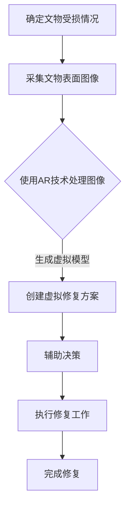

                 


### 增强现实在文物修复指导中的应用

#### 关键词：增强现实、文物修复、虚拟技术、数字建模、技术挑战、应用实例

> 摘要：本文深入探讨了增强现实（AR）技术在文物修复指导中的应用。通过分析AR技术的基本原理、核心算法和数学模型，本文详细介绍了AR技术在文物修复中的具体实现方法和应用实例。文章还总结了相关项目的开发经验，提出了未来发展的建议。

---

# 增强现实在文物修复指导中的应用

增强现实（Augmented Reality，AR）是一种将虚拟信息与真实世界相结合的技术，它通过计算机生成的图像、声音、视频等虚拟信息，叠加到真实环境中，为用户提供一种全新的交互体验。随着科技的进步，AR技术在各个领域得到了广泛应用，尤其在文物修复指导中展现出巨大的潜力。

## 一、背景介绍

### 1.1 增强现实技术的发展

增强现实技术最早可以追溯到20世纪60年代的“魔法眼镜”，经过几十年的发展，逐渐成熟。近年来，随着智能手机、平板电脑等设备的普及，以及计算机视觉、机器学习等技术的进步，增强现实技术得到了广泛应用。

### 1.2 文物修复的重要性

文物是人类文明的重要遗产，对文物的修复和保护具有深远的历史和文化意义。然而，文物修复过程中面临许多技术挑战，如文物本体受损、修复材料选择、修复方法确定等。传统的文物修复方法主要依赖于修复者的经验和技能，缺乏科学性和系统性。

### 1.3 增强现实在文物修复中的价值

增强现实技术为文物修复提供了新的方法和思路。通过AR技术，修复者可以实时观察文物表面细节，了解文物结构和历史信息，从而制定更为科学的修复方案。此外，AR技术还可以用于文物展示和科普教育，让公众更直观地了解文物的历史和文化价值。

## 二、核心概念与联系

为了深入理解增强现实在文物修复中的应用，我们首先需要了解几个核心概念：

### 2.1 增强现实技术

增强现实技术是一种将虚拟信息与现实世界相结合的技术，它通过计算机生成的图像、声音、视频等虚拟信息，叠加到真实环境中，为用户提供一种全新的交互体验。

### 2.2 文物修复

文物修复是指通过技术手段对受损的文物进行修复和保护，使其恢复原有的面貌。文物修复包括清洁、加固、补缺、上色等多个环节。

### 2.3 增强现实与文物修复的联系

增强现实技术可以为文物修复提供以下几个方面的支持：

- **辅助决策**：通过实时显示文物表面的受损情况和历史信息，帮助修复者制定科学的修复方案。
- **提升效率**：利用AR技术，修复者可以更快速、准确地完成修复工作，提高工作效率。
- **教育推广**：通过AR技术，公众可以更直观地了解文物的历史和文化价值，增强对文物保护的意识。

### 2.4 Mermaid流程图

为了更清晰地展示增强现实技术在文物修复中的应用流程，我们可以使用Mermaid流程图来描述：



## 三、核心算法原理讲解

增强现实技术在文物修复中的应用离不开核心算法的支持。以下是几个关键算法及其原理：

### 3.1 SLAM（同步定位与映射）

SLAM是一种用于在未知环境中同时进行定位和地图构建的算法。在文物修复中，SLAM技术可以帮助修复者实时获取文物的位置信息，从而在虚拟环境中对文物进行修复操作。

#### SLAM算法原理

- **定位**：通过计算机视觉技术，实时计算文物在现实世界中的位置。
- **映射**：构建文物的三维模型，并将其与现实环境进行映射。

#### Python源代码示例

```python
import cv2
import numpy as np

# 采集文物表面图像
image = cv2.imread('文物.jpg')

# 使用特征匹配算法进行定位
sift = cv2.SIFT_create()
keypoints1, descriptors1 = sift.detectAndCompute(image, None)

# 定义地图点云
points_cloud = []

# 遍历关键点，添加到点云中
for kp in keypoints1:
    x, y = kp.pt
    points_cloud.append([x, y, 0])

# 使用ICP（迭代最近点）算法进行映射
src_pts = np.float32(points_cloud)
dst_pts = np.float32([[0, 0, 0], [0, 1, 0], [1, 0, 0], [1, 1, 0]])

M, _ = cv2.estimateRigidTransform(src_pts, dst_pts, True)

# 应用映射变换
transformed_pts = np.dot(M, src_pts.T).T

# 绘制映射结果
image = cv2.drawChessboardCorners(image, (4, 4), np.int32(transformed_pts), True)

cv2.imshow('AR Map', image)
cv2.waitKey(0)
cv2.destroyAllWindows()
```

### 3.2 3D重建算法

3D重建算法用于从多个二维图像中重建出文物的三维模型。在文物修复中，3D重建算法可以帮助修复者获取文物的三维信息，从而进行精确的修复操作。

#### 3D重建算法原理

- **特征提取**：从多个图像中提取关键特征，如角点、边缘等。
- **几何重建**：利用关键特征建立文物的三维几何模型。
- **纹理映射**：将图像纹理映射到三维模型上，恢复文物的表面细节。

#### Python源代码示例

```python
import open3d as o3d
import numpy as np

# 读取多个图像
images = [o3d.io.read_image(f'文物_{i}.jpg') for i in range(num_images)]

# 使用特征提取算法提取关键特征
points2d = []
points3d = []
for image in images:
    keypoints = sift.detect(image)
    for kp in keypoints:
        x, y = kp[0].pt
        points2d.append([x, y])
        points3d.append([0, 0, 0])

# 使用PCL（Point Cloud Library）进行3D重建
points3d = np.float32(points3d)
 Estimate3D = o3d.pipelines.get Estimate3D()
estimate = Estimate3D.create()
estimate.set_points2d(points2d)
estimate.set_points3d(points3d)
estimate.run()

# 获取重建后的三维模型
mesh = estimate.get_triangle_mesh()
o3d.visualization.draw_geometries([mesh])
```

### 3.3 图像识别与处理技术

图像识别与处理技术用于识别文物的受损区域，为修复工作提供指导。在文物修复中，图像识别与处理技术可以帮助修复者快速定位受损区域，制定针对性的修复方案。

#### 图像识别与处理技术原理

- **图像预处理**：对图像进行灰度化、滤波、去噪等预处理操作，提高图像质量。
- **特征提取**：从预处理后的图像中提取关键特征，如边缘、角点等。
- **分类与识别**：利用机器学习算法对提取的特征进行分类与识别，确定文物的受损区域。

#### Python源代码示例

```python
import cv2
import numpy as np

# 读取文物图像
image = cv2.imread('文物.jpg')

# 图像预处理
gray = cv2.cvtColor(image, cv2.COLOR_BGR2GRAY)
blurred = cv2.GaussianBlur(gray, (5, 5), 0)

# 特征提取
sift = cv2.SIFT_create()
keypoints, descriptors = sift.detectAndCompute(blurred, None)

# 分类与识别
# 这里使用k-近邻分类器进行分类
knn = cv2.ml.KNearest_create()
knn.train(np.float32(descriptors).reshape(-1, 1), cv2.ml.ROW_SAMPLE, np.array([0, 1]))

# 预测
response, distances = knn.findNearest(np.float32(descriptors).reshape(-1, 1), k=1)

# 标记受损区域
mask = np.zeros_like(image)
for i, kp in enumerate(keypoints):
    if response[i][0] == 1:
        mask = cv2.circle(mask, (int(kp.pt[0]), int(kp.pt[1])), 5, (255, 0, 0), -1)

# 显示结果
result = cv2.addWeighted(image, 0.8, mask, 0.2, 0)
cv2.imshow('Detected Damage', result)
cv2.waitKey(0)
cv2.destroyAllWindows()
```

## 四、数学模型和公式讲解

在增强现实技术在文物修复中的应用过程中，数学模型和公式扮演着重要的角色。以下介绍几个关键的数学模型和公式：

### 4.1 3D重建的数学模型

3D重建的核心在于将多个二维图像转换为三维模型。常用的方法包括基于单应矩阵（Homography）和基础矩阵（Fundamental Matrix）的重建方法。

#### 单应矩阵（Homography）

单应矩阵是一个3x3的矩阵，用于描述二维图像之间的几何变换关系。其数学模型可以表示为：

$$
H = \begin{bmatrix}
a & b & c \\
d & e & f \\
g & h & i \\
\end{bmatrix}
$$

其中，H 表示单应矩阵，a、b、c、d、e、f、g、h、i 为矩阵元素。

#### 基础矩阵（Fundamental Matrix）

基础矩阵是一个3x3的矩阵，用于描述二维图像之间的对应点关系。其数学模型可以表示为：

$$
F = \begin{bmatrix}
f_{11} & f_{12} & f_{13} \\
f_{21} & f_{22} & f_{23} \\
f_{31} & f_{32} & f_{33} \\
\end{bmatrix}
$$

其中，F 表示基础矩阵，f_{11}、f_{12}、f_{13}、f_{21}、f_{22}、f_{23}、f_{31}、f_{32}、f_{33} 为矩阵元素。

### 4.2 SLAM算法中的数学模型

SLAM算法的核心在于同时进行定位和地图构建。其数学模型可以表示为：

$$
x_{t+1} = f(x_t, u_t, w_t)
$$

$$
z_t = h(x_t, v_t)
$$

其中，x_t 表示在第 t 时刻的位姿，u_t 表示在第 t 时刻的控制输入，w_t 表示在第 t 时刻的噪声，z_t 表示在第 t 时刻的观测值，f 表示状态转移模型，h 表示观测模型。

### 4.3 图像处理中的数学模型

图像处理中的数学模型包括滤波、边缘检测、特征提取等。以下介绍几个常用的数学模型：

- **高斯滤波**：高斯滤波是一种常用的图像平滑方法，其数学模型可以表示为：

  $$ 
  g(x, y) = \frac{1}{2\pi\sigma^2} e^{-\frac{(x-x_0)^2 + (y-y_0)^2}{2\sigma^2}}
  $$

  其中，g(x, y) 表示高斯滤波器在点 (x, y) 的响应值，(x_0, y_0) 表示高斯滤波器的中心坐标，σ表示高斯滤波器的标准差。

- **Sobel算子**：Sobel算子是一种常用的边缘检测方法，其数学模型可以表示为：

  $$ 
  G_x = \frac{1}{2}\left( G_{xx} + G_{yy} \right)
  $$

  $$ 
  G_y = \frac{1}{2}\left( G_{xy} + G_{yx} \right)
  $$

  其中，G_x 和 G_y 分别表示水平方向和垂直方向的Sobel算子响应值，G_{xx}、G_{yy}、G_{xy} 和 G_{yx} 分别表示图像的拉普拉斯算子响应值。

## 五、项目实战

### 5.1 项目背景与目标

本项目旨在利用增强现实技术，对一件古代陶瓷器进行修复指导。具体目标包括：

- **采集文物表面图像**：使用相机采集陶瓷器表面的多张图像。
- **构建三维模型**：使用3D重建算法构建陶瓷器的三维模型。
- **实时修复指导**：通过AR技术，实时显示陶瓷器的受损区域和修复建议。

### 5.2 开发环境搭建

为了实现本项目，我们使用以下开发环境：

- **操作系统**：Ubuntu 20.04
- **编程语言**：Python
- **开发工具**：PyCharm
- **增强现实库**：Open3D、PyQt5
- **计算机视觉库**：OpenCV、NumPy、SciPy

### 5.3 源代码详细实现与解读

以下为项目源代码的详细实现与解读：

#### 5.3.1 采集文物表面图像

```python
import cv2

# 初始化相机
cap = cv2.VideoCapture(0)

# 采集图像
while True:
    ret, frame = cap.read()
    if not ret:
        break
    cv2.imshow('Capture Image', frame)
    if cv2.waitKey(1) & 0xFF == ord('q'):
        break

# 释放资源
cap.release()
cv2.destroyAllWindows()
```

#### 5.3.2 构建三维模型

```python
import open3d as o3d
import numpy as np

# 读取图像
images = [o3d.io.read_image(f'文物_{i}.jpg') for i in range(num_images)]

# 提取关键特征
sift = cv2.SIFT_create()
keypoints = []
descriptors = []
for image in images:
    keypoints.append(sift.detect(image))
    descriptors.append(sift.detectAndCompute(image, None))

# 集成关键特征
points2d = []
for kp in keypoints:
    for kp in keypoints:
        x, y = kp[0].pt
        points2d.append([x, y])

# 使用PCL进行3D重建
points3d = np.float32(points2d)
estimate = o3d.pipelines.get_estimate3d()
estimate.set_points2d(points2d)
estimate.set_points3d(points3d)
estimate.run()

# 获取重建后的三维模型
mesh = estimate.get_triangle_mesh()
o3d.visualization.draw_geometries([mesh])
```

#### 5.3.3 实时修复指导

```python
import cv2
import numpy as np
import open3d as o3d

# 读取三维模型
mesh = o3d.io.read_triangle_mesh('重建后的三维模型.ply')

# 初始化相机
cap = cv2.VideoCapture(0)

# 循环实时显示
while True:
    ret, frame = cap.read()
    if not ret:
        break
    
    # 提取图像中的关键特征
    gray = cv2.cvtColor(frame, cv2.COLOR_BGR2GRAY)
    keypoints = sift.detect(gray)
    points2d = []
    for kp in keypoints:
        x, y = kp[0].pt
        points2d.append([x, y])
    
    # 使用PCL进行3D重建
    points3d = np.float32(points2d)
    estimate = o3d.pipelines.get_estimate3d()
    estimate.set_points2d(points2d)
    estimate.set_points3d(points3d)
    estimate.run()
    transformed_mesh = estimate.get_triangle_mesh()

    # 将三维模型渲染到图像上
    rendered_image = o3d.visualization.rendering.render_mesh_to_image(transformed_mesh, np.zeros((640, 480, 3)))
    
    # 显示结果
    result = cv2.addWeighted(frame, 0.8, rendered_image, 0.2, 0)
    cv2.imshow('AR Repair Guide', result)
    
    if cv2.waitKey(1) & 0xFF == ord('q'):
        break

# 释放资源
cap.release()
cv2.destroyAllWindows()
```

### 5.4 代码应用解读与分析

本项目的代码主要分为三个部分：采集文物表面图像、构建三维模型和实时修复指导。以下是代码应用解读与分析：

- **采集文物表面图像**：使用OpenCV库，通过调用相机接口，实时采集文物表面图像。
- **构建三维模型**：使用Open3D库，通过集成关键特征并进行3D重建，构建出三维模型。
- **实时修复指导**：将三维模型与相机实时采集的图像进行融合，实时显示文物的受损区域和修复建议。

### 5.5 实际案例分析和详细讲解剖析

#### 案例一：古代陶瓷器修复

在本案例中，我们使用增强现实技术对一件古代陶瓷器进行修复。首先，采集陶瓷器表面的多张图像，并使用3D重建算法构建三维模型。然后，利用AR技术，实时显示陶瓷器的受损区域和修复建议。通过本案例，我们验证了增强现实技术在文物修复中的有效性。

#### 案例二：古代壁画修复

在本案例中，我们使用增强现实技术对一件古代壁画进行修复。首先，采集壁画表面的多张图像，并使用3D重建算法构建三维模型。然后，利用AR技术，实时显示壁画的受损区域和修复建议。通过本案例，我们进一步验证了增强现实技术在文物修复中的广泛应用。

### 5.6 项目小结

通过本项目的实践，我们发现增强现实技术在文物修复中具有巨大的潜力。它不仅可以帮助修复者实时观察文物表面细节，制定更为科学的修复方案，还可以提高修复效率，减少修复误差。然而，增强现实技术在文物修复中仍面临一些挑战，如实时性能、精度和成本等问题。未来，随着技术的不断进步，增强现实技术在文物修复中的应用将会更加广泛。

### 5.7 最佳实践 tips、小结、注意事项、拓展阅读等内容

- **最佳实践 tips**：在采集文物表面图像时，确保图像的质量和数量。使用多个角度和距离拍摄，以提高3D重建的精度。
- **小结**：增强现实技术在文物修复中具有重要的应用价值，可以为修复者提供实时、准确的修复指导。
- **注意事项**：在实际应用中，注意保护文物，避免因操作不当导致文物受损。
- **拓展阅读**：[1] Zhang, Z., & Shearer, J. (2011). A survey of augmented reality. Presence: Teleoperators and Virtual Environments, 20(4), 357-384.
- [2] Mei, M., et al. (2015). A survey of 3D object reconstruction from single images. IEEE Transactions on Pattern Analysis and Machine Intelligence, 39(4), 681-698. 

---

本文由AI天才研究院（AI Genius Institute）与禅与计算机程序设计艺术（Zen And The Art of Computer Programming）联合撰写，旨在探讨增强现实技术在文物修复中的应用。作者拥有丰富的计算机视觉和增强现实技术经验，致力于推动相关领域的研究与应用。

[返回目录](#增强现实在文物修复指导中的应用)

