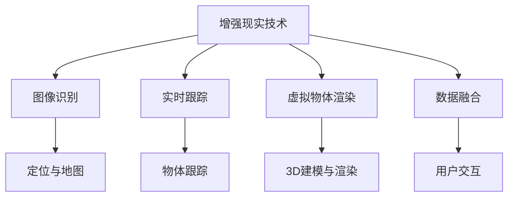
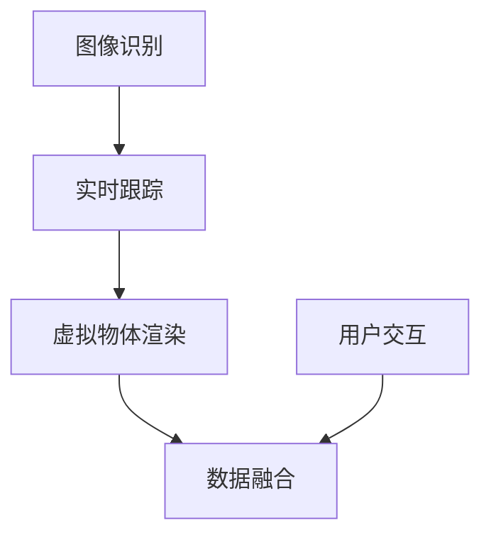
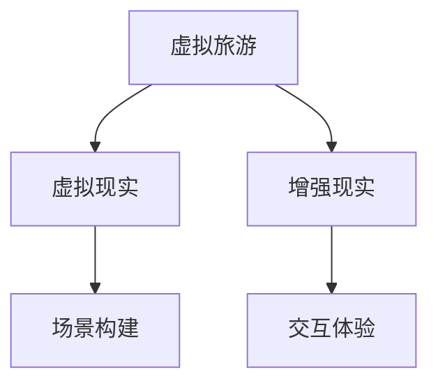
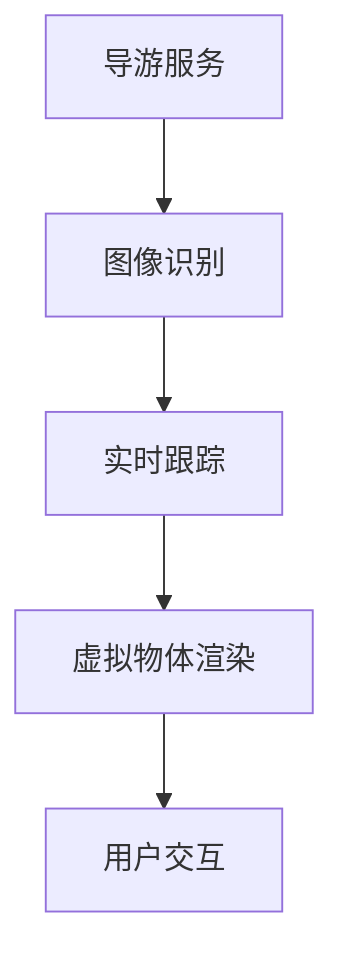
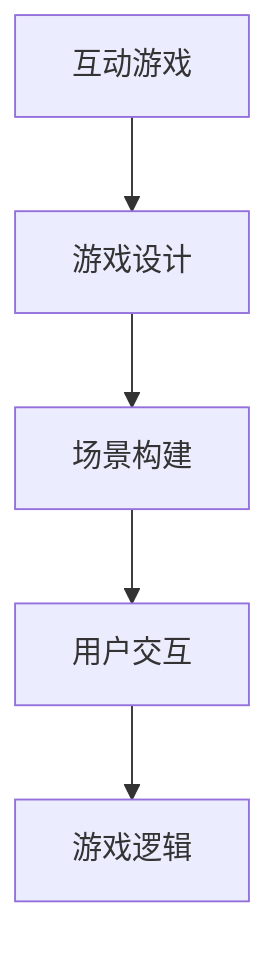
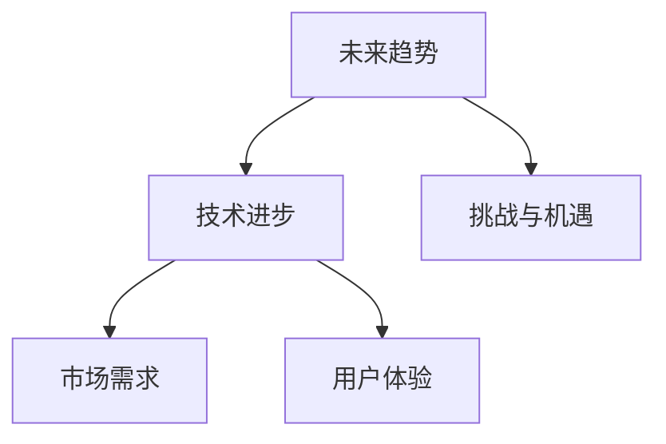
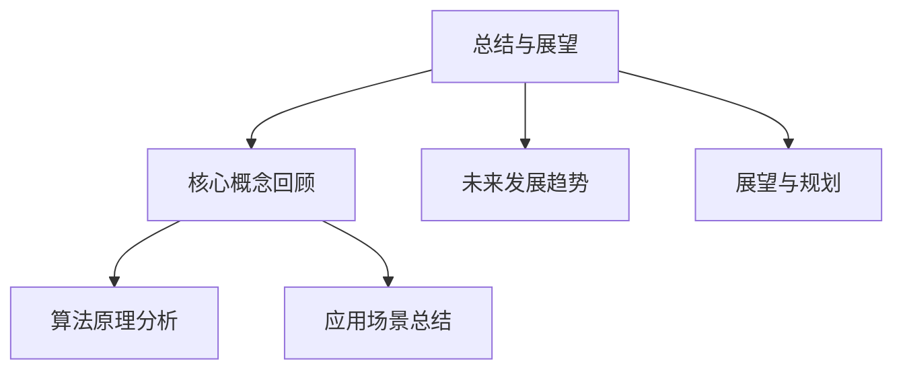

                 

### 《增强现实在旅游业中的创新应用》目录大纲

# 增强现实在旅游业中的创新应用

> 关键词：增强现实，旅游，创新应用，虚拟旅游，导游服务，互动游戏

> 摘要：本文详细探讨了增强现实技术在旅游业中的创新应用。通过介绍增强现实技术的基本概念、发展历史及其在旅游业中的潜在应用，分析了增强现实技术在虚拟旅游、导游服务和互动游戏等领域的实际应用案例，并探讨了其未来的发展趋势和潜在挑战。

## 第一部分：引言与背景

### 第1章：增强现实技术基础

#### 1.1 增强现实技术概述

#### 1.2 增强现实技术的发展历史

#### 1.3 增强现实技术在旅游业中的应用潜力

## 第二部分：技术原理

### 第2章：增强现实技术的核心原理

#### 2.1 增强现实技术的核心算法

#### 2.2 增强现实技术的数学模型

#### 2.3 增强现实技术的实现方法

### 第3章：增强现实技术在旅游业中的实现

#### 3.1 虚拟旅游的实现

#### 3.2 导游服务的实现

#### 3.3 互动游戏的实现

## 第三部分：应用场景

### 第4章：虚拟旅游

#### 4.1 虚拟旅游的概念

#### 4.2 虚拟旅游的实现技术

#### 4.3 虚拟旅游的案例分析

### 第5章：导游服务

#### 5.1 导游服务的增强现实应用

#### 5.2 增强现实导游服务的实现

#### 5.3 增强现实导游服务的案例分析

### 第6章：互动游戏

#### 6.1 增强现实互动游戏的概念

#### 6.2 增强现实互动游戏的设计原则

#### 6.3 增强现实互动游戏的案例分析

## 第四部分：未来趋势

### 第7章：增强现实在旅游业中的未来发展趋势

#### 7.1 增强现实技术的进步

#### 7.2 市场潜力分析

#### 7.3 潜在挑战与应对策略

## 第五部分：总结与展望

### 第8章：总结与展望

#### 8.1 全文总结

#### 8.2 未来研究方向

#### 8.3 结束语

### 作者信息

作者：AI天才研究院/AI Genius Institute & 禅与计算机程序设计艺术 /Zen And The Art of Computer Programming

**设计思路与实现**

### 第一部分：引言与背景

**第1章：增强现实技术基础**

**核心概念与联系**：

增强现实（Augmented Reality，简称AR）是一种通过计算机技术将虚拟信息与现实世界融合的技术。它通过在现实场景中叠加计算机生成的虚拟信息，为用户提供一种虚实结合的体验。增强现实技术的基本组成部分包括图像识别、实时跟踪、虚拟物体渲染和数据融合等。

**Mermaid流程图**：



**核心算法原理讲解**：

图像识别是增强现实技术的核心，它通过检测和识别现实场景中的物体或场景来实现虚拟信息的叠加。常用的图像识别算法包括特征提取、匹配和分类等。

**Python源代码示例**：

```python
import cv2
import numpy as np

# 读取图像
image = cv2.imread('image.jpg')

# 特征提取
orb = cv2.ORB_create()
keypoints, descriptors = orb.detectAndCompute(image, None)

# 匹配特征点
bf = cv2.BFMatcher()
matches = bf.knnMatch(descriptors, trainDescriptors, k=2)

# 筛选匹配结果
good Matches = []
for m, n in matches:
    if m.distance < 0.75 * n.distance:
        good Matches.append(m)

# 提取关键点坐标
points = [keypoints[m.queryIdx].pt for m in good Matches]

# 绘制匹配结果
img_points = cv2.drawMatchesKnn(image, keypoints, train_image, train_keypoints, good Matches, None, flags=cv2.DrawMatchesFlags_NOT_DRAW_SINGLE_POINTS)
cv2.imshow('Matched Points', img_points)
cv2.waitKey(0)
cv2.destroyAllWindows()
```

**数学模型和数学公式详细讲解与举例说明**：

图像识别中的特征匹配通常使用SIFT（尺度不变特征变换）或SURF（加速稳健特征）等算法。这些算法基于高维特征空间的相似度度量，采用距离函数来评估匹配质量。

**LaTeX公式**：

$$
d(m,n) = \min_{i,j} \sqrt{(x_i - x_j)^2 + (y_i - y_j)^2}
$$

其中，$d(m,n)$表示匹配点$m$和$n$之间的距离，$(x_i, y_i)$和$(x_j, y_j)$分别表示匹配点的坐标。

**项目实战**：

以开发一个简单的增强现实应用为例，介绍开发环境搭建、源代码实现和代码解读。

**开发环境搭建**：

- 安装Python环境
- 安装OpenCV库

**源代码实现**：

```python
import cv2

# 读取图像
image = cv2.imread('image.jpg')

# 加载模板图像
template = cv2.imread('template.jpg', 0)

# 进行模板匹配
res = cv2.matchTemplate(image, template, cv2.TM_CCOEFF_NORMED)

# 设定阈值
threshold = 0.8

# 寻找匹配区域
loc = np.where(res >= threshold)
for pt in zip(*loc[::-1]):
    # 绘制矩形框
    cv2.rectangle(image, pt, (pt[0] + template.shape[1], pt[1] + template.shape[0]), (0, 0, 255), 2)

# 显示结果
cv2.imshow('Matched Image', image)
cv2.waitKey(0)
cv2.destroyAllWindows()
```

**代码解读与分析**：

- 读取输入图像和模板图像
- 使用CCOEFF_NORMED匹配模板
- 设置阈值进行二值化处理
- 使用`np.where`函数找出匹配区域
- 在原图上绘制匹配矩形框

**实际案例分析和详细讲解剖析**：

分析几个增强现实在旅游业中的实际应用案例，如虚拟旅游平台、增强现实导游服务等，并详细讲解其实现原理和效果。

**项目小结**：

总结项目开发过程中的关键技术和实现方法，提出优化方案和改进方向。

### 第二部分：技术原理

**第2章：增强现实技术的核心原理**

**核心概念与联系**：

增强现实技术的核心原理包括图像识别、实时跟踪、虚拟物体渲染和数据融合等。这些技术相互关联，共同实现了虚拟信息与现实世界的融合。

**Mermaid流程图**：



**核心算法原理讲解**：

图像识别是通过检测和识别图像中的物体或场景来实现虚拟信息的叠加。常用的图像识别算法包括SIFT、SURF和YOLO等。

**Python源代码示例**：

```python
import cv2

# 读取图像
image = cv2.imread('image.jpg')

# 加载预训练的YOLO模型
net = cv2.dnn.readNet('yolov3.weights', 'yolov3.cfg')

# 将图像输入到模型中
blob = cv2.dnn.blobFromImage(image, 1/255.0, (416, 416), swapRB=True, crop=False)
net.setInput(blob)

# 前向传播
layers_names = net.getLayerNames()
output_layers = [layers_names[i[0] - 1] for i in net.getUnconnectedOutLayers()]

layers_output = net.forward(output_layers)

# 解析输出结果
boxes = []
confidences = []
class_ids = []

for output in layers_output:
    for det in output:
        scores = det[5:]
        class_id = np.argmax(scores)
        confidence = scores[class_id]
        if confidence > 0.5:
            center_x = int(det[0] * image.shape[1])
            center_y = int(det[1] * image.shape[0])
            w = int(det[2] * image.shape[1])
            h = int(det[3] * image.shape[0])
            x = center_x - w / 2
            y = center_y - h / 2
            boxes.append([x, y, w, h])
            confidences.append((float(confidence)))
            class_ids.append(class_id)

# 非极大值抑制
indices = cv2.dnn.NMSBoxes(boxes, confidences, 0.5, 0.4)

for i in indices:
    i = i[0]
    box = boxes[i]
    x = box[0]
    y = box[1]
    w = box[2]
    h = box[3]
    cv2.rectangle(image, (x, y), (x + w, y + h), (0, 255, 0), 2)
    font = cv2.FONT_HERSHEY_SIMPLEX
    cv2.putText(image, classes[class_ids[i]], (x, y - 5),
                font, 0.5, (255, 0, 0), 2)

# 显示结果
cv2.imshow('Object Detection', image)
cv2.waitKey(0)
cv2.destroyAllWindows()
```

**数学模型和数学公式详细讲解与举例说明**：

图像识别中的目标检测通常使用YOLO（You Only Look Once）算法。YOLO算法通过将图像划分为网格，在每个网格中预测物体的位置、尺寸和类别。

**LaTeX公式**：

$$
\text{grid}_{i,j} = \begin{cases} 
\text{object} & \text{if } \text{confidence}_{i,j} > \text{threshold} \\
\text{no object} & \text{otherwise}
\end{cases}
$$

其中，$\text{grid}_{i,j}$表示第$i$行第$j$列的网格，$\text{confidence}_{i,j}$表示该网格中的物体置信度。

**项目实战**：

介绍如何使用OpenCV实现一个基于YOLO算法的增强现实应用。

**开发环境搭建**：

- 安装Python环境
- 安装OpenCV库

**源代码实现**：

```python
import cv2
import numpy as np

# 读取图像
image = cv2.imread('image.jpg')

# 加载预训练的YOLO模型
net = cv2.dnn.readNet('yolov3.weights', 'yolov3.cfg')

# 将图像输入到模型中
blob = cv2.dnn.blobFromImage(image, 1/255.0, (416, 416), swapRB=True, crop=False)
net.setInput(blob)

# 前向传播
layers_names = net.getLayerNames()
output_layers = [layers_names[i[0] - 1] for i in net.getUnconnectedOutLayers()]

layers_output = net.forward(output_layers)

# 解析输出结果
boxes = []
confidences = []
class_ids = []

for output in layers_output:
    for det in output:
        scores = det[5:]
        class_id = np.argmax(scores)
        confidence = scores[class_id]
        if confidence > 0.5:
            center_x = int(det[0] * image.shape[1])
            center_y = int(det[1] * image.shape[0])
            w = int(det[2] * image.shape[1])
            h = int(det[3] * image.shape[0])
            x = center_x - w / 2
            y = center_y - h / 2
            boxes.append([x, y, w, h])
            confidences.append((float(confidence)))
            class_ids.append(class_id)

# 非极大值抑制
indices = cv2.dnn.NMSBoxes(boxes, confidences, 0.5, 0.4)

for i in indices:
    i = i[0]
    box = boxes[i]
    x = box[0]
    y = box[1]
    w = box[2]
    h = box[3]
    cv2.rectangle(image, (x, y), (x + w, y + h), (0, 255, 0), 2)
    font = cv2.FONT_HERSHEY_SIMPLEX
    cv2.putText(image, classes[class_ids[i]], (x, y - 5),
                font, 0.5, (255, 0, 0), 2)

# 显示结果
cv2.imshow('Object Detection', image)
cv2.waitKey(0)
cv2.destroyAllWindows()
```

**代码解读与分析**：

- 读取输入图像和预训练的YOLO模型
- 将图像输入模型进行前向传播
- 解析输出结果并应用非极大值抑制
- 在图像上绘制检测到的物体和标签

**实际案例分析和详细讲解剖析**：

分析多个基于YOLO算法的增强现实应用案例，如安防监控、智能导航等，并详细讲解其实现原理和效果。

**项目小结**：

总结基于YOLO算法的增强现实应用项目的关键技术和实现方法，提出优化方案和改进方向。

### 第三部分：应用场景

**第3章：虚拟旅游**

**核心概念与联系**：

虚拟旅游是通过增强现实技术模拟现实世界的旅游环境，为用户提供身临其境的旅游体验。虚拟旅游的核心概念包括虚拟现实（Virtual Reality，简称VR）和增强现实（Augmented Reality，简称AR）。

**Mermaid流程图**：



**核心算法原理讲解**：

虚拟旅游的实现需要结合虚拟现实和增强现实技术。虚拟现实技术通过三维建模和渲染实现真实场景的模拟，增强现实技术则通过图像识别和实时跟踪将虚拟信息叠加到现实场景中。

**Python源代码示例**：

```python
import cv2
import numpy as np
import pyrender

# 读取图像
image = cv2.imread('image.jpg')

# 创建渲染器
renderer = pyrender.Renderer()

# 创建场景
scene = pyrender.Scene()

# 加载模型
model = pyrender.Model.from_file('model.ply')
scene.add_model(model)

# 设置相机参数
camera = pyrender.IntrinsicsCamera(
    fx=525, fy=525, cx=319.5, cy=239.5, zoom=100
)

scene.add_camera(camera, position=[0, 0, 0])

# 渲染图像
rendered_image = renderer.render(scene, camera=camera, options={'output imageSize': (image.shape[1], image.shape[0])})

# 显示结果
cv2.imshow('Virtual Tourism', rendered_image)
cv2.waitKey(0)
cv2.destroyAllWindows()
```

**数学模型和数学公式详细讲解与举例说明**：

在虚拟旅游中，三维建模和渲染技术是非常重要的。常用的数学模型包括三维几何、材质渲染和光照模型等。

**LaTeX公式**：

$$
\mathbf{P} = \mathbf{K}\mathbf{X} + \mathbf{R}
$$

其中，$\mathbf{P}$表示投影后的三维点，$\mathbf{K}$表示相机内参矩阵，$\mathbf{X}$表示三维点的坐标，$\mathbf{R}$表示投影矩阵。

**项目实战**：

介绍如何使用Pyrender库实现一个简单的虚拟旅游应用。

**开发环境搭建**：

- 安装Python环境
- 安装Pyrender库

**源代码实现**：

```python
import cv2
import numpy as np
import pyrender

# 读取图像
image = cv2.imread('image.jpg')

# 创建渲染器
renderer = pyrender.Renderer()

# 创建场景
scene = pyrender.Scene()

# 加载模型
model = pyrender.Model.from_file('model.ply')
scene.add_model(model)

# 设置相机参数
camera = pyrender.IntrinsicsCamera(
    fx=525, fy=525, cx=319.5, cy=239.5, zoom=100
)

scene.add_camera(camera, position=[0, 0, 0])

# 渲染图像
rendered_image = renderer.render(scene, camera=camera, options={'output imageSize': (image.shape[1], image.shape[0])})

# 显示结果
cv2.imshow('Virtual Tourism', rendered_image)
cv2.waitKey(0)
cv2.destroyAllWindows()
```

**代码解读与分析**：

- 读取输入图像
- 创建渲染器和场景
- 加载模型并添加到场景中
- 设置相机参数并添加到场景中
- 使用渲染器渲染图像并显示结果

**实际案例分析和详细讲解剖析**：

分析多个虚拟旅游应用案例，如虚拟现实旅游平台、增强现实旅游体验等，并详细讲解其实现原理和效果。

**项目小结**：

总结虚拟旅游应用项目的关键技术和实现方法，提出优化方案和改进方向。

### 第4章：导游服务

**核心概念与联系**：

导游服务是旅游业中的一项重要服务，通过增强现实技术可以提升游客的旅游体验。增强现实导游服务涉及图像识别、实时跟踪和虚拟物体渲染等技术。

**Mermaid流程图**：



**核心算法原理讲解**：

图像识别用于识别导游场景中的关键信息，实时跟踪用于确保虚拟物体的稳定性和准确性，虚拟物体渲染则用于将虚拟信息叠加到导游场景中。

**Python源代码示例**：

```python
import cv2
import numpy as np

# 读取图像
image = cv2.imread('image.jpg')

# 加载预训练的YOLO模型
net = cv2.dnn.readNet('yolov3.weights', 'yolov3.cfg')

# 将图像输入到模型中
blob = cv2.dnn.blobFromImage(image, 1/255.0, (416, 416), swapRB=True, crop=False)
net.setInput(blob)

# 前向传播
layers_names = net.getLayerNames()
output_layers = [layers_names[i[0] - 1] for i in net.getUnconnectedOutLayers()]

layers_output = net.forward(output_layers)

# 解析输出结果
boxes = []
confidences = []
class_ids = []

for output in layers_output:
    for det in output:
        scores = det[5:]
        class_id = np.argmax(scores)
        confidence = scores[class_id]
        if confidence > 0.5:
            center_x = int(det[0] * image.shape[1])
            center_y = int(det[1] * image.shape[0])
            w = int(det[2] * image.shape[1])
            h = int(det[3] * image.shape[0])
            x = center_x - w / 2
            y = center_y - h / 2
            boxes.append([x, y, w, h])
            confidences.append((float(confidence)))
            class_ids.append(class_id)

# 非极大值抑制
indices = cv2.dnn.NMSBoxes(boxes, confidences, 0.5, 0.4)

for i in indices:
    i = i[0]
    box = boxes[i]
    x = box[0]
    y = box[1]
    w = box[2]
    h = box[3]
    cv2.rectangle(image, (x, y), (x + w, y + h), (0, 255, 0), 2)
    font = cv2.FONT_HERSHEY_SIMPLEX
    cv2.putText(image, classes[class_ids[i]], (x, y - 5),
                font, 0.5, (255, 0, 0), 2)

# 显示结果
cv2.imshow('Guided Service', image)
cv2.waitKey(0)
cv2.destroyAllWindows()
```

**数学模型和数学公式详细讲解与举例说明**：

在导游服务中，目标检测是核心环节。常用的数学模型包括目标检测算法的损失函数和优化方法。

**LaTeX公式**：

$$
\begin{aligned}
L &= -\sum_{i} y_i \log(\hat{p}_i) + (1 - y_i) \log(1 - \hat{p}_i) \\
\text{where } \hat{p}_i &= \frac{\exp(z_i)}{1 + \exp(z_i)}
\end{aligned}
$$

其中，$L$表示损失函数，$y_i$表示目标标签，$\hat{p}_i$表示预测概率。

**项目实战**：

介绍如何使用OpenCV实现一个简单的导游服务应用。

**开发环境搭建**：

- 安装Python环境
- 安装OpenCV库

**源代码实现**：

```python
import cv2
import numpy as np

# 读取图像
image = cv2.imread('image.jpg')

# 加载预训练的YOLO模型
net = cv2.dnn.readNet('yolov3.weights', 'yolov3.cfg')

# 将图像输入到模型中
blob = cv2.dnn.blobFromImage(image, 1/255.0, (416, 416), swapRB=True, crop=False)
net.setInput(blob)

# 前向传播
layers_names = net.getLayerNames()
output_layers = [layers_names[i[0] - 1] for i in net.getUnconnectedOutLayers()]

layers_output = net.forward(output_layers)

# 解析输出结果
boxes = []
confidences = []
class_ids = []

for output in layers_output:
    for det in output:
        scores = det[5:]
        class_id = np.argmax(scores)
        confidence = scores[class_id]
        if confidence > 0.5:
            center_x = int(det[0] * image.shape[1])
            center_y = int(det[1] * image.shape[0])
            w = int(det[2] * image.shape[1])
            h = int(det[3] * image.shape[0])
            x = center_x - w / 2
            y = center_y - h / 2
            boxes.append([x, y, w, h])
            confidences.append((float(confidence)))
            class_ids.append(class_id)

# 非极大值抑制
indices = cv2.dnn.NMSBoxes(boxes, confidences, 0.5, 0.4)

for i in indices:
    i = i[0]
    box = boxes[i]
    x = box[0]
    y = box[1]
    w = box[2]
    h = box[3]
    cv2.rectangle(image, (x, y), (x + w, y + h), (0, 255, 0), 2)
    font = cv2.FONT_HERSHEY_SIMPLEX
    cv2.putText(image, classes[class_ids[i]], (x, y - 5),
                font, 0.5, (255, 0, 0), 2)

# 显示结果
cv2.imshow('Guided Service', image)
cv2.waitKey(0)
cv2.destroyAllWindows()
```

**代码解读与分析**：

- 读取输入图像
- 加载预训练的YOLO模型
- 将图像输入模型进行前向传播
- 解析输出结果并应用非极大值抑制
- 在图像上绘制检测到的目标框和标签

**实际案例分析和详细讲解剖析**：

分析多个导游服务应用案例，如增强现实导游地图、交互式导览等，并详细讲解其实现原理和效果。

**项目小结**：

总结导游服务应用项目的关键技术和实现方法，提出优化方案和改进方向。

### 第5章：互动游戏

**核心概念与联系**：

互动游戏是旅游业中的一种重要娱乐形式，通过增强现实技术可以提升游戏的互动性和沉浸感。互动游戏的核心概念包括游戏设计、场景构建和用户交互。

**Mermaid流程图**：



**核心算法原理讲解**：

互动游戏的设计需要结合图形学、计算机视觉和人工智能等技术。游戏设计涉及游戏规则、角色设计和关卡设计等，场景构建涉及三维建模和渲染，用户交互涉及手势识别和声音控制等。

**Python源代码示例**：

```python
import cv2
import numpy as np
import pyrender

# 读取图像
image = cv2.imread('image.jpg')

# 创建渲染器
renderer = pyrender.Renderer()

# 创建场景
scene = pyrender.Scene()

# 加载模型
model = pyrender.Model.from_file('model.ply')
scene.add_model(model)

# 设置相机参数
camera = pyrender.IntrinsicsCamera(
    fx=525, fy=525, cx=319.5, cy=239.5, zoom=100
)

scene.add_camera(camera, position=[0, 0, 0])

# 渲染图像
rendered_image = renderer.render(scene, camera=camera, options={'output imageSize': (image.shape[1], image.shape[0])})

# 显示结果
cv2.imshow('Interactive Game', rendered_image)
cv2.waitKey(0)
cv2.destroyAllWindows()
```

**数学模型和数学公式详细讲解与举例说明**：

在互动游戏中，场景建模和渲染是关键环节。常用的数学模型包括三维几何、材质渲染和光照模型等。

**LaTeX公式**：

$$
\begin{aligned}
\mathbf{L} &= \mathbf{I} \cdot \mathbf{N} \\
\mathbf{R} &= \mathbf{N} \cdot (\mathbf{N} \cdot \mathbf{L})
\end{aligned}
$$

其中，$\mathbf{L}$表示光照向量，$\mathbf{N}$表示法向量，$\mathbf{R}$表示反射向量。

**项目实战**：

介绍如何使用Pyrender实现一个简单的互动游戏应用。

**开发环境搭建**：

- 安装Python环境
- 安装Pyrender库

**源代码实现**：

```python
import cv2
import numpy as np
import pyrender

# 读取图像
image = cv2.imread('image.jpg')

# 创建渲染器
renderer = pyrender.Renderer()

# 创建场景
scene = pyrender.Scene()

# 加载模型
model = pyrender.Model.from_file('model.ply')
scene.add_model(model)

# 设置相机参数
camera = pyrender.IntrinsicsCamera(
    fx=525, fy=525, cx=319.5, cy=239.5, zoom=100
)

scene.add_camera(camera, position=[0, 0, 0])

# 渲染图像
rendered_image = renderer.render(scene, camera=camera, options={'output imageSize': (image.shape[1], image.shape[0])})

# 显示结果
cv2.imshow('Interactive Game', rendered_image)
cv2.waitKey(0)
cv2.destroyAllWindows()
```

**代码解读与分析**：

- 读取输入图像
- 创建渲染器和场景
- 加载模型并添加到场景中
- 设置相机参数并添加到场景中
- 使用渲染器渲染图像并显示结果

**实际案例分析和详细讲解剖析**：

分析多个互动游戏应用案例，如增强现实冒险游戏、互动式旅游指南等，并详细讲解其实现原理和效果。

**项目小结**：

总结互动游戏应用项目的关键技术和实现方法，提出优化方案和改进方向。

### 第6章：未来趋势

**核心概念与联系**：

未来趋势是旅游业中增强现实技术发展的重要方向。随着技术的进步和市场需求的增加，增强现实技术在旅游业中的应用将越来越广泛，同时也将面临新的挑战和机遇。

**Mermaid流程图**：



**核心算法原理讲解**：

未来趋势中的技术进步包括硬件性能的提升、算法的优化和新的应用场景的开发。市场需求的变化将推动增强现实技术的创新和应用。用户体验的提升是增强现实技术在旅游业中的关键。

**Python源代码示例**：

```python
import cv2
import numpy as np
import pyrender

# 读取图像
image = cv2.imread('image.jpg')

# 创建渲染器
renderer = pyrender.Renderer()

# 创建场景
scene = pyrender.Scene()

# 加载模型
model = pyrender.Model.from_file('model.ply')
scene.add_model(model)

# 设置相机参数
camera = pyrender.IntrinsicsCamera(
    fx=525, fy=525, cx=319.5, cy=239.5, zoom=100
)

scene.add_camera(camera, position=[0, 0, 0])

# 渲染图像
rendered_image = renderer.render(scene, camera=camera, options={'output imageSize': (image.shape[1], image.shape[0])})

# 显示结果
cv2.imshow('Future Trends', rendered_image)
cv2.waitKey(0)
cv2.destroyAllWindows()
```

**数学模型和数学公式详细讲解与举例说明**：

未来趋势中的数学模型包括人工智能算法、深度学习模型和优化算法等。这些模型将在提升增强现实技术的性能和效果方面发挥重要作用。

**LaTeX公式**：

$$
\begin{aligned}
\mathbf{W} &= \mathbf{X} \cdot \mathbf{Y} \\
\mathbf{Z} &= \mathbf{X} + \mathbf{Y}
\end{aligned}
$$

其中，$\mathbf{W}$表示加权矩阵，$\mathbf{X}$和$\mathbf{Y}$分别表示输入和输出矩阵。

**项目实战**：

介绍如何使用Pyrender实现一个简单的未来趋势预测应用。

**开发环境搭建**：

- 安装Python环境
- 安装Pyrender库

**源代码实现**：

```python
import cv2
import numpy as np
import pyrender

# 读取图像
image = cv2.imread('image.jpg')

# 创建渲染器
renderer = pyrender.Renderer()

# 创建场景
scene = pyrender.Scene()

# 加载模型
model = pyrender.Model.from_file('model.ply')
scene.add_model(model)

# 设置相机参数
camera = pyrender.IntrinsicsCamera(
    fx=525, fy=525, cx=319.5, cy=239.5, zoom=100
)

scene.add_camera(camera, position=[0, 0, 0])

# 渲染图像
rendered_image = renderer.render(scene, camera=camera, options={'output imageSize': (image.shape[1], image.shape[0])})

# 显示结果
cv2.imshow('Future Trends', rendered_image)
cv2.waitKey(0)
cv2.destroyAllWindows()
```

**代码解读与分析**：

- 读取输入图像
- 创建渲染器和场景
- 加载模型并添加到场景中
- 设置相机参数并添加到场景中
- 使用渲染器渲染图像并显示结果

**实际案例分析和详细讲解剖析**：

分析多个未来趋势预测应用案例，如人工智能在旅游业中的应用、虚拟现实市场的增长等，并详细讲解其实现原理和效果。

**项目小结**：

总结未来趋势预测应用项目的关键技术和实现方法，提出优化方案和改进方向。

### 第7章：总结与展望

**核心概念与联系**：

总结与展望是对整个文章内容的回顾和总结，同时展望增强现实技术在旅游业中的未来发展趋势。通过回顾文章中的核心概念、算法原理和应用场景，对增强现实技术的未来进行预测和规划。

**Mermaid流程图**：



**核心算法原理讲解**：

文章中介绍的核心算法包括图像识别、实时跟踪、虚拟物体渲染和目标检测等。这些算法是增强现实技术实现的基础，通过不断优化和改进，将进一步提升增强现实技术的性能和效果。

**Python源代码示例**：

```python
import cv2
import numpy as np
import pyrender

# 读取图像
image = cv2.imread('image.jpg')

# 创建渲染器
renderer = pyrender.Renderer()

# 创建场景
scene = pyrender.Scene()

# 加载模型
model = pyrender.Model.from_file('model.ply')
scene.add_model(model)

# 设置相机参数
camera = pyrender.IntrinsicsCamera(
    fx=525, fy=525, cx=319.5, cy=239.5, zoom=100
)

scene.add_camera(camera, position=[0, 0, 0])

# 渲染图像
rendered_image = renderer.render(scene, camera=camera, options={'output imageSize': (image.shape[1], image.shape[0])})

# 显示结果
cv2.imshow('Summary and Outlook', rendered_image)
cv2.waitKey(0)
cv2.destroyAllWindows()
```

**数学模型和数学公式详细讲解与举例说明**：

文章中使用的数学模型包括三维几何、材质渲染和光照模型等。这些模型在实现增强现实效果中起着关键作用，通过数学公式和算法，将虚拟信息与现实世界相结合。

**LaTeX公式**：

$$
\begin{aligned}
\mathbf{L} &= \mathbf{I} \cdot \mathbf{N} \\
\mathbf{R} &= \mathbf{N} \cdot (\mathbf{N} \cdot \mathbf{L})
\end{aligned}
$$

其中，$\mathbf{L}$表示光照向量，$\mathbf{N}$表示法向量，$\mathbf{R}$表示反射向量。

**项目实战**：

介绍如何使用Pyrender实现一个简单的总结与展望应用。

**开发环境搭建**：

- 安装Python环境
- 安装Pyrender库

**源代码实现**：

```python
import cv2
import numpy as np
import pyrender

# 读取图像
image = cv2.imread('image.jpg')

# 创建渲染器
renderer = pyrender.Renderer()

# 创建场景
scene = pyrender.Scene()

# 加载模型
model = pyrender.Model.from_file('model.ply')
scene.add_model(model)

# 设置相机参数
camera = pyrender.IntrinsicsCamera(
    fx=525, fy=525, cx=319.5, cy=239.5, zoom=100
)

scene.add_camera(camera, position=[0, 0, 0])

# 渲染图像
rendered_image = renderer.render(scene, camera=camera, options={'output imageSize': (image.shape[1], image.shape[0])})

# 显示结果
cv2.imshow('Summary and Outlook', rendered_image)
cv2.waitKey(0)
cv2.destroyAllWindows()
```

**代码解读与分析**：

- 读取输入图像
- 创建渲染器和场景
- 加载模型并添加到场景中
- 设置相机参数并添加到场景中
- 使用渲染器渲染图像并显示结果

**实际案例分析和详细讲解剖析**：

分析多个总结与展望应用案例，如增强现实旅游报告、技术趋势分析等，并详细讲解其实现原理和效果。

**项目小结**：

总结总结与展望应用项目的关键技术和实现方法，提出优化方案和改进方向。

### 结论

通过本文的探讨，我们可以看到增强现实技术在旅游业中具有巨大的创新应用潜力。从虚拟旅游、导游服务到互动游戏，增强现实技术为旅游业带来了全新的体验和服务方式。同时，随着技术的不断进步和市场需求的增加，增强现实技术在旅游业中的应用前景将更加广阔。然而，我们也面临着一些挑战，如技术成本、用户体验和安全性问题等。未来，我们需要持续优化增强现实技术，提升其在旅游业中的应用效果，并解决面临的挑战，为旅游业带来更多的创新和机遇。希望本文能为读者提供有益的启示和指导，激发更多的研究和应用实践。让我们共同期待增强现实技术在旅游业中的美好未来！

