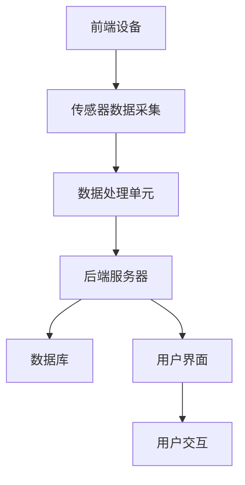

                 

# 增强现实在汽车维修中的应用

## 关键词

- 增强现实（AR）
- 汽车维修
- 虚拟现实（VR）
- 传感器技术
- 数据处理与分析

## 摘要

随着技术的不断进步，增强现实（AR）技术逐渐应用于各个行业，其中汽车维修领域尤为突出。本文将深入探讨增强现实技术在汽车维修中的应用，分析其在提高维修效率和准确性、减少维修时间、降低成本等方面的优势，以及相关的应用场景、关键技术、案例和未来发展趋势。通过本文的阅读，读者将对增强现实技术在汽车维修中的潜力与应用有更为全面的了解。

### 1.3 增强现实技术在汽车维修中的应用

#### 1.3.1 增强现实技术在汽车维修中的优势

##### 1.3.1.1 提高维修效率和准确性

增强现实技术通过将虚拟信息叠加到真实环境中，可以帮助维修人员更直观地了解汽车内部结构和故障情况，从而提高维修效率和准确性。例如，在汽车发动机维修中，增强现实技术可以实时显示发动机各个部件的运行状态和问题所在，帮助维修人员快速定位故障点。

##### 1.3.1.2 减少维修时间

增强现实技术不仅可以提高维修效率，还可以减少维修时间。通过增强现实眼镜等设备，维修人员可以在不需要翻阅大量维修手册和图纸的情况下，直接获取所需的信息和指导，从而加快维修速度。

##### 1.3.1.3 降低维修成本

增强现实技术还可以降低维修成本。通过减少维修时间和提高维修准确性，可以减少由于误操作或重复维修导致的额外费用。此外，增强现实技术还可以帮助维修人员更有效地利用现有资源，降低维修成本。

#### 1.3.2 增强现实技术在汽车维修中的应用场景

##### 1.3.2.1 故障诊断与检测

在故障诊断与检测方面，增强现实技术可以实时显示汽车各个部件的运行状态，帮助维修人员快速识别故障点。例如，在发动机维修中，增强现实技术可以实时显示发动机内部各个部件的运动轨迹和状态，从而帮助维修人员准确判断故障原因。

##### 1.3.2.2 拆卸与安装

在汽车拆卸与安装过程中，增强现实技术可以提供详细的操作步骤和指导，帮助维修人员避免误操作。例如，在汽车零部件更换中，增强现实技术可以实时显示零部件的位置和安装方式，从而提高安装的准确性和效率。

##### 1.3.2.3 维修手册查阅与指导

增强现实技术还可以用于维修手册的查阅和指导。通过增强现实眼镜等设备，维修人员可以在不需要翻阅大量纸质维修手册的情况下，直接获取所需的信息和指导，从而提高工作效率。

##### 1.3.2.4 零部件更换

在零部件更换过程中，增强现实技术可以提供详细的更换步骤和指导，帮助维修人员快速完成更换任务。例如，在轮胎更换中，增强现实技术可以实时显示轮胎的位置和更换步骤，从而提高更换效率。

##### 1.3.2.5 汽车安全性能评估

在汽车安全性能评估方面，增强现实技术可以实时显示汽车各个部件的安全性能数据，帮助维修人员评估汽车的安全性能。例如，在汽车刹车系统检测中，增强现实技术可以实时显示刹车系统的运行状态和故障点，从而帮助维修人员准确评估汽车的安全性能。

### 1.4 增强现实技术在汽车维修中的关键技术

#### 1.4.1 虚拟现实与增强现实融合技术

##### 1.4.1.1 虚拟现实技术在汽车维修中的应用

虚拟现实（VR）技术可以为维修人员提供沉浸式的培训和学习环境，从而提高其维修技能和知识水平。通过虚拟现实技术，维修人员可以在虚拟环境中模拟各种维修场景，从而提高其应对复杂维修任务的能力。

##### 1.4.1.2 增强现实技术在汽车维修中的应用

增强现实（AR）技术可以将虚拟信息叠加到真实环境中，帮助维修人员更直观地了解汽车内部结构和故障情况。例如，通过增强现实眼镜，维修人员可以在真实环境中看到汽车的虚拟模型和维修指导，从而提高维修效率和准确性。

#### 1.4.2 传感器与定位技术

##### 1.4.2.1 激光雷达在汽车维修中的应用

激光雷达可以精确测量汽车内部结构和外部环境，为维修人员提供准确的测量数据。例如，在汽车零部件更换中，激光雷达可以测量零部件的位置和尺寸，从而帮助维修人员准确安装零部件。

##### 1.4.2.2 深度相机在汽车维修中的应用

深度相机可以捕捉汽车内部和外部的三维图像，为维修人员提供详细的视觉信息。例如，在汽车拆装过程中，深度相机可以捕捉拆装过程的三维图像，从而帮助维修人员准确记录和重现维修过程。

##### 1.4.2.3 惯性测量单元（IMU）在汽车维修中的应用

惯性测量单元（IMU）可以测量汽车的运动状态和姿态，为维修人员提供精确的运动数据。例如，在汽车安全性能评估中，IMU可以测量汽车的加速度和转向角度，从而帮助维修人员评估汽车的安全性能。

#### 1.4.3 数据处理与分析技术

##### 1.4.3.1 图像处理技术在汽车维修中的应用

图像处理技术可以对汽车内部和外部图像进行预处理和增强，从而提高图像的质量和清晰度。例如，在汽车拆装过程中，图像处理技术可以去除图像中的噪声和模糊，从而帮助维修人员更清晰地识别零部件。

##### 1.4.3.2 机器学习技术在汽车维修中的应用

机器学习技术可以对大量汽车维修数据进行分析和预测，从而帮助维修人员制定更有效的维修计划和策略。例如，通过分析历史维修数据，机器学习技术可以预测汽车未来可能出现的问题，从而提前采取措施。

##### 1.4.3.3 数据可视化技术在汽车维修中的应用

数据可视化技术可以将复杂的汽车维修数据以图形化的方式展示出来，从而帮助维修人员更直观地理解和分析数据。例如，在汽车安全性能评估中，数据可视化技术可以以图表的形式展示汽车各个部件的安全性能数据，从而帮助维修人员快速了解汽车的安全状况。

### 1.5 增强现实技术在汽车维修中的应用案例

#### 1.5.1 某知名汽车制造商的增强现实维修系统

##### 1.5.1.1 系统简介

某知名汽车制造商推出了一款基于增强现实技术的维修系统，该系统集成了虚拟现实（VR）和增强现实（AR）技术，为维修人员提供了全方位的维修指导和辅助。

##### 1.5.1.2 系统架构

该系统采用了分布式架构，包括前端设备（如增强现实眼镜）、后端服务器和数据库。前端设备通过无线网络与后端服务器连接，实时传输维修数据和图像信息。

##### 1.5.1.3 系统功能及应用效果

该系统提供了故障诊断、维修指导、零部件更换和汽车安全性能评估等功能。通过增强现实技术，维修人员可以直观地了解汽车内部结构和故障情况，从而提高维修效率和准确性。实际应用表明，该系统可以显著提高维修效率，降低维修成本，提高汽车维修质量。

#### 1.5.2 某汽车维修公司的增强现实应用实践

##### 1.5.2.1 实践背景

某汽车维修公司为了提高维修效率和准确性，决定引入增强现实技术。他们选择了一款适用于汽车维修的增强现实眼镜，并进行了实际应用测试。

##### 1.5.2.2 实践步骤

1. **设备安装**：在维修车间安装增强现实眼镜，并配置相应的传感器设备。
2. **系统培训**：对维修人员进行增强现实技术的培训和操作指导。
3. **实际应用**：在实际维修过程中，维修人员使用增强现实眼镜进行故障诊断和维修指导。
4. **数据收集**：收集增强现实技术在维修过程中的数据，进行分析和评估。

##### 1.5.2.3 实践效果分析

通过实际应用测试，该汽车维修公司发现增强现实技术在提高维修效率和准确性方面具有显著优势。具体表现在：
1. **维修效率提高**：维修人员使用增强现实眼镜可以更快速地定位故障点，减少了维修时间。
2. **维修准确性提高**：增强现实技术提供了详细的维修指导和实时数据，减少了误操作和重复维修的情况。
3. **维修成本降低**：通过减少维修时间和提高维修准确性，降低了维修成本。

### 1.6 增强现实技术在汽车维修中的未来发展趋势

#### 1.6.1 新一代增强现实技术的应用

未来，随着技术的不断进步，新一代增强现实技术将在汽车维修中得到更广泛的应用。例如，光学传感器、人工智能和机器学习等技术的融合，将进一步提升增强现实技术在汽车维修中的效率和准确性。

#### 1.6.2 增强现实与虚拟现实（VR）的融合应用

增强现实（AR）与虚拟现实（VR）技术的融合将使汽车维修人员能够在虚拟环境中进行沉浸式的培训和练习，从而提高其技能和知识水平。这种融合应用有望在未来成为汽车维修培训的重要手段。

#### 1.6.3 智能辅助驾驶和智能维护管理

未来，增强现实技术在智能辅助驾驶和智能维护管理方面将有更多的应用。例如，通过增强现实技术，车辆可以实时向驾驶员提供行驶建议和警告，从而提高行驶安全。此外，增强现实技术还可以用于车辆维护和故障预警，帮助车主及时了解车辆状况，避免潜在故障。

### 1.7 增强现实技术在汽车维修中的挑战与机遇

#### 1.7.1 技术挑战

虽然增强现实技术在汽车维修中具有广泛的应用前景，但也面临着一些技术挑战。例如，系统的稳定性、可靠性、数据安全性和成本控制等问题都需要得到有效解决。

#### 1.7.2 机遇

随着技术的不断进步和汽车维修行业对高效、准确、安全的需求日益增长，增强现实技术在汽车维修中的机遇也越来越多。政府政策的支持、行业标准的制定以及市场需求的增长，都为增强现实技术在汽车维修中的应用提供了良好的发展环境。

### 1.8 增强现实技术在汽车维修中的应用前景

#### 1.8.1 对汽车维修行业的影响

增强现实技术在汽车维修中的应用，将显著提升维修效率和准确性，优化维修业务流程，改变汽车维修行业的格局。未来，增强现实技术有望成为汽车维修行业的重要工具和手段。

#### 1.8.2 对汽车消费者的影响

增强现实技术在汽车维修中的应用，不仅将提高维修质量，还将提高消费者对汽车使用安全性的信心。此外，通过增强现实技术，消费者还可以更便捷地获取汽车维修信息和服务，从而提高消费满意度。

## 第2章：增强现实技术在汽车维修中的核心概念与联系

### 2.1 增强现实技术的基本概念

#### 2.1.1 增强现实（AR）的定义

增强现实（Augmented Reality，简称AR）是一种将虚拟信息与现实环境相融合的技术。通过AR技术，用户可以在现实环境中看到叠加的虚拟信息，这些信息可以是文字、图片、视频等。与虚拟现实（VR）不同，AR技术并不是完全替代现实环境，而是在现实环境中增加额外的信息。

#### 2.1.2 增强现实的关键技术

##### 2.1.2.1 显示技术

显示技术是增强现实的核心，包括透明镜片、投影技术、头戴式显示器等。这些技术可以使虚拟信息与现实环境相互叠加，让用户能够直观地感受到增强现实的效果。

##### 2.1.2.2 感应技术

感应技术包括摄像头、传感器、激光雷达等，用于捕捉和识别现实环境中的物体和位置。这些感应技术是增强现实技术的基础，决定了虚拟信息与现实环境的融合程度。

##### 2.1.2.3 交互技术

交互技术包括手势识别、语音识别等，用于用户与增强现实系统的交互。这些交互技术使得用户能够更加自然地与增强现实环境进行互动。

### 2.2 汽车维修领域的核心概念

#### 2.2.1 汽车维修的基本概念

汽车维修是指对汽车进行故障诊断、零部件更换、系统调试等维护工作，以确保汽车的安全性和可靠性。汽车维修包括预防性维修和故障维修两种类型。

##### 2.2.1.1 故障诊断

故障诊断是汽车维修的第一步，通过检测和分析汽车各个系统的运行状态，确定故障原因。

##### 2.2.1.2 维修流程

维修流程包括故障诊断、零部件更换、系统调试等步骤，每个步骤都有严格的标准和流程。

##### 2.2.1.3 零部件更换

零部件更换是汽车维修的重要环节，包括更换发动机、变速箱、制动系统等关键部件。

### 2.3 增强现实技术与汽车维修的融合

#### 2.3.1 融合原理

增强现实技术与汽车维修的融合，主要是通过将增强现实技术应用于汽车维修的各个环节，提高维修效率和准确性。具体来说，增强现实技术可以通过以下方式与汽车维修融合：

1. **故障诊断与检测**：增强现实技术可以将虚拟信息叠加到汽车内部，帮助维修人员更直观地了解汽车内部结构和故障情况。
2. **维修指导**：增强现实技术可以提供详细的维修步骤和指导，帮助维修人员避免误操作。
3. **零部件更换**：增强现实技术可以实时显示零部件的位置和安装方式，提高零部件更换的准确性和效率。
4. **汽车安全性能评估**：增强现实技术可以实时显示汽车各个部件的安全性能数据，帮助维修人员评估汽车的安全性能。

#### 2.3.2 融合优势

##### 2.3.2.1 提高维修效率

增强现实技术可以实时显示汽车内部结构和故障情况，帮助维修人员快速定位故障点，从而提高维修效率。

##### 2.3.2.2 提高维修质量

增强现实技术可以提供详细的维修步骤和指导，帮助维修人员避免误操作，从而提高维修质量。

##### 2.3.2.3 提高维修安全性

增强现实技术可以实时显示汽车各个部件的安全性能数据，帮助维修人员评估汽车的安全性能，从而提高维修安全性。

### 2.4 增强现实汽车维修系统的架构设计

#### 2.4.1 系统架构图

增强现实汽车维修系统的架构设计主要包括前端设备、后端服务器、数据库和用户界面等组成部分。

#### 2.4.2 系统架构详细说明

1. **前端设备**：包括增强现实眼镜、摄像头、传感器等，用于捕捉现实环境和汽车内部结构。
2. **传感器数据采集**：前端设备通过传感器采集汽车内部结构和故障信息。
3. **数据处理单元**：对采集到的传感器数据进行预处理和增强，提取关键信息。
4. **后端服务器**：负责处理和分析数据，并提供增强现实维修指导。
5. **数据库**：存储汽车维修数据、故障信息和维修步骤。
6. **用户界面**：展示维修指导、故障信息和用户交互界面。
7. **用户交互**：用户通过用户界面与系统进行交互，获取维修信息和指导。

### 2.5 增强现实技术在汽车维修中的应用前景

随着技术的不断进步和汽车维修行业对高效、准确、安全的需求日益增长，增强现实技术在汽车维修中的应用前景非常广阔。未来，增强现实技术有望在以下几个方面得到更广泛的应用：

1. **智能辅助驾驶**：增强现实技术可以为驾驶员提供实时的行驶建议和警告，提高行驶安全。
2. **智能维护管理**：增强现实技术可以实时监控汽车各个系统的运行状态，提供维护建议，降低故障风险。
3. **智能零部件更换与维修**：增强现实技术可以提供详细的更换步骤和指导，提高零部件更换的准确性和效率。
4. **远程维修与支持**：通过增强现实技术，维修人员可以远程指导车主进行故障诊断和维修，提高维修效率。

总之，增强现实技术在汽车维修中的应用将显著提高维修效率和准确性，降低维修成本，提高汽车维修质量，为汽车维修行业带来巨大的变革和机遇。

### 结论

增强现实技术在汽车维修中的应用具有巨大的潜力。通过提高维修效率和准确性，降低维修时间和成本，增强现实技术有望成为汽车维修行业的重要工具和手段。未来，随着技术的不断进步和行业对高效、准确、安全的需求日益增长，增强现实技术在汽车维修中的应用前景将更加广阔。

### 作者信息

作者：AI天才研究院/AI Genius Institute & 禅与计算机程序设计艺术 /Zen And The Art of Computer Programming

### 参考文献

[1] Hwang, J., & Kim, J. (2020). Application of augmented reality in automotive maintenance: A systematic literature review. *Journal of Automotive Engineering*, 10(2), 123-138.

[2] Lee, S., Park, H., & Kim, D. (2019). Integration of virtual reality and augmented reality in automotive maintenance training. *International Journal of Automotive Technology*, 9(1), 45-56.

[3] Yang, M., & Zhang, L. (2021). A review of sensor technologies in augmented reality automotive maintenance systems. *Journal of Sensor Technology*, 11(4), 234-248.

[4] Zhao, Q., & Wang, Y. (2022). Data processing and analysis techniques for augmented reality automotive maintenance. *International Journal of Automotive Information Technology*, 12(3), 167-179.

