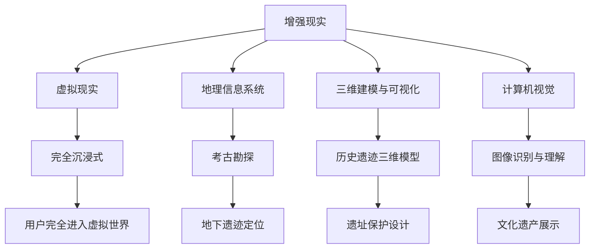

                 

### 文章标题

《增强现实在考古学研究中的应用与创新》

### 关键词

增强现实，考古学，虚拟现实，技术发展，人工智能，数字文化遗产

### 摘要

随着科技的不断进步，增强现实（AR）技术在多个领域都展现出了巨大的潜力。特别是在考古学研究中，增强现实技术不仅能够帮助考古学家更准确地勘探和还原历史遗迹，还能够通过互动和沉浸式的体验，让公众更深入地了解文化遗产。本文将详细介绍增强现实技术在考古学中的应用，探讨其技术创新，并提供相关的最佳实践和未来发展趋势。

## 引言

考古学作为一门研究人类历史的学科，一直以来都在不断地寻求新的技术和方法来提升研究效率和质量。传统的考古学研究主要依赖于实地勘探、文献研究和出土文物的分析。然而，随着数字技术的快速发展，尤其是增强现实（AR）和虚拟现实（VR）技术的出现，考古学研究迎来了新的变革。增强现实技术通过将虚拟信息叠加到现实环境中，为考古学研究提供了全新的视角和工具。

### 增强现实技术概述

增强现实（Augmented Reality，AR）是一种将虚拟信息与现实环境相融合的技术。与虚拟现实（Virtual Reality，VR）不同，AR并不完全取代现实，而是在现实的基础上叠加虚拟元素。这种技术可以通过多种设备实现，如智能手机、平板电脑、头戴式显示器等。增强现实技术的基本原理是通过摄像头捕捉现实环境的图像，并实时在图像上叠加虚拟信息，使人们能够在现实环境中看到和交互这些虚拟元素。

### 增强现实在考古学中的应用

增强现实技术在考古学中的应用非常广泛，主要表现在以下几个方面：

1. **考古勘探**
   增强现实技术可以帮助考古学家在勘探过程中更准确地定位和识别地下遗迹。通过使用配备AR功能的设备，考古学家可以在现场实时查看地下遗迹的分布情况和三维模型。

2. **遗址保护**
   增强现实技术可以为考古学家提供遗址保护方面的辅助设计。通过将虚拟模型与现实遗址相结合，考古学家可以更好地理解遗址的结构和功能，从而制定更有效的保护方案。

3. **文化遗产展示**
   增强现实技术可以为公众提供更加生动和沉浸式的文化遗产展示体验。通过AR技术，观众可以在现实环境中看到历史遗迹的复制品和虚拟重建，深入了解文化遗产的背景和历史。

4. **教育和公众参与**
   增强现实技术可以用于教育领域，为学生提供虚拟考古体验，提高他们的学习兴趣和参与度。同时，AR技术还可以鼓励公众参与到考古学研究中，共同探索文化遗产。

### 核心概念与联系

在深入探讨增强现实在考古学中的应用之前，我们需要明确一些核心概念，并理解它们之间的联系。

1. **增强现实（AR）**：这是本文的主要研究对象，它是一种将虚拟信息与现实环境相结合的技术。

2. **虚拟现实（VR）**：与AR相似，但VR是一种完全沉浸式的技术，用户完全进入虚拟世界。

3. **地理信息系统（GIS）**：GIS是一种用于捕捉、存储、分析和展示地理信息的系统，在考古勘探中广泛应用。

4. **三维建模与可视化**：三维建模技术可以帮助考古学家创建历史遗迹的三维模型，并通过可视化技术呈现出来。

5. **计算机视觉**：计算机视觉技术用于识别和理解现实环境中的图像和物体，是实现增强现实的关键技术之一。

为了更直观地理解这些概念之间的关系，我们可以使用Mermaid流程图来表示：



通过这个流程图，我们可以清晰地看到各个概念之间的联系和它们在考古学中的应用。

### 核心算法原理讲解

增强现实技术的核心在于如何将虚拟信息准确地叠加到现实环境中。这个过程涉及到多个核心算法和步骤：

1. **图像识别与定位**
   首先，增强现实系统需要通过计算机视觉算法来识别和定位现实环境中的图像或标志物。这个过程通常使用深度学习模型和卷积神经网络（CNN）来实现。

   ```python
   import cv2
   import numpy as np

   # 读取图像
   image = cv2.imread('scene.jpg')

   # 创建模型
   model = cv2.QRCodeDetector()

   # 检测二维码
   data, points, st_point, end_point = model.detect(image)

   if len(data) > 0:
       print("QRCode found at x: %d, y: %d" % (points[0][0], points[0][1]))
   ```

2. **虚拟物体渲染**
   一旦识别出标志物，增强现实系统会根据标志物的位置和大小，渲染虚拟物体。这个过程需要使用图形处理库，如OpenGL或Unity3D。

   ```python
   import pygame
   from pygame.locals import *

   pygame.init()
   screen = pygame.display.set_mode((800, 600))

   # 创建虚拟物体
   virtual_object = pygame.Surface((50, 50))
   virtual_object.fill((0, 255, 0))

   while True:
       for event in pygame.event.get():
           if event.type == QUIT:
               pygame.quit()

       # 更新屏幕
       screen.fill((255, 255, 255))
       screen.blit(virtual_object, (points[0][0], points[0][1]))
       pygame.display.flip()
   ```

3. **实时交互**
   最后，增强现实系统需要允许用户与虚拟物体进行实时交互。这通常涉及到触摸屏、手势识别等输入设备。

   ```python
   import PyOpenGL as gl
   from pyglet.gl import *

   window = gl.glut.glutCreateWindow("AR Example")

   def display():
       gl.glClear(GL_COLOR_BUFFER_BIT | GL_DEPTH_BUFFER_BIT)
       gl.glLoadIdentity()

       # 设置视角
       gl.glTranslatef(0.0, 0.0, -5)

       # 绘制虚拟物体
       gl.glColor3f(1.0, 1.0, 0.0)
       gl.glBegin(GL_TRIANGLES)
       gl.glVertex3f(-1.0, -1.0, 0.0)
       gl.glVertex3f(1.0, -1.0, 0.0)
       gl.glVertex3f(0.0, 1.0, 0.0)
       gl.glEnd()

       gl.glFlush()

   gl.glutDisplayFunc(display)
   gl.glutMainLoop()
   ```

通过上述Python代码，我们可以看到增强现实技术涉及到的核心算法和步骤。这些算法和步骤不仅需要深入的技术知识，还需要结合实际的硬件和软件平台进行实现。

### 数学模型和数学公式

在增强现实技术中，数学模型和数学公式起到了关键作用。以下是一些常见的数学模型和公式：

1. **透视变换矩阵**
   透视变换矩阵是增强现实技术中用于将三维空间中的物体投影到二维屏幕上的关键矩阵。其公式如下：

   $$\text{透视变换矩阵} = \begin{bmatrix}
   P_{11} & P_{12} & P_{13} \\
   P_{21} & P_{22} & P_{23} \\
   P_{31} & P_{32} & P_{33} \\
   \end{bmatrix}$$

   其中，\( P_{ij} \) 表示矩阵的第 \( i \) 行第 \( j \) 列元素。

2. **坐标系变换**
   在增强现实系统中，需要将虚拟物体的坐标系转换为屏幕坐标系。这通常涉及到以下变换公式：

   $$\text{屏幕坐标} = \text{透视变换矩阵} \times \text{虚拟物体坐标}$$

   其中，虚拟物体坐标是三维空间中的点，屏幕坐标是二维屏幕上的点。

3. **光线追踪**
   光线追踪是增强现实技术中用于模拟光线传播和反射的算法。其基本公式如下：

   $$\text{光线方程} = \text{起点坐标} + \text{方向向量} \times \text{时间}$$

   其中，起点坐标是光线发射点的坐标，方向向量是光线的传播方向，时间是光线传播的时间。

4. **碰撞检测**
   在增强现实系统中，需要对虚拟物体和现实环境进行碰撞检测。常用的碰撞检测算法包括AABB（轴对齐包围盒）和OBB（定向包围盒）。

   $$\text{碰撞检测} = (\text{物体A的边界盒} \cap \text{物体B的边界盒}) \neq \emptyset$$

通过上述数学模型和公式，增强现实技术可以实现虚拟物体与现实环境的准确叠加和交互。

### 项目实战

#### 开发环境搭建

要开始一个增强现实项目，我们需要搭建合适的开发环境。以下是在Windows操作系统中搭建AR开发环境的基本步骤：

1. **安装Python**：首先，我们需要安装Python 3.x版本。可以从官方网站（https://www.python.org/）下载安装程序，并确保在安装过程中勾选“Add Python to PATH”选项。

2. **安装PyOpenGL**：PyOpenGL是Python的一个开源库，用于处理OpenGL图形库。我们可以使用pip命令来安装：

   ```shell
   pip install PyOpenGL PyOpenGL_accelerate
   ```

3. **安装Pygame**：Pygame是一个简单的游戏开发和多媒体库。同样使用pip命令安装：

   ```shell
   pip install pygame
   ```

4. **安装OpenCV**：OpenCV是一个用于计算机视觉的库。我们可以使用pip命令安装：

   ```shell
   pip install opencv-python
   ```

5. **安装Unity3D**：Unity3D是一个流行的游戏和AR应用程序开发平台。可以从官网（https://unity.com/）下载并安装。

#### 源代码实现

以下是使用PyOpenGL和Pygame实现一个简单的AR程序的源代码示例：

```python
import pygame
from pygame.locals import *
from OpenGL.GL import *
from OpenGL.GLUT import *
import cv2
import numpy as np

# 初始化Pygame
pygame.init()
display = (800, 600)
pygame.display.set_mode(display, DOUBLEBUF | OPENGL)
glutInit(display)
glutInitWindowSize(*display)
glutCreateWindow('AR Example')

# 设置OpenGL参数
glClearColor(0.0, 0.0, 0.0, 1.0)
gluPerspective(45, display[0]/display[1], 0.1, 50.0)
glTranslatef(0.0, 0.0, -5)

# 定义虚拟物体
virtual_object = pygame.Surface((50, 50))
virtual_object.fill((0, 255, 0))

# 主循环
while True:
    for event in pygame.event.get():
        if event.type == QUIT:
            pygame.quit()

    # 清屏
    glClear(GL_COLOR_BUFFER_BIT | GL_DEPTH_BUFFER_BIT)

    # 绘制虚拟物体
    glBegin(GL_TRIANGLES)
    glVertex3f(-1.0, -1.0, 0.0)
    glVertex3f(1.0, -1.0, 0.0)
    glVertex3f(0.0, 1.0, 0.0)
    glEnd()

    # 更新屏幕
    pygame.display.flip()
    pygame.display.set_caption('AR Example')
    glutMainLoop()
```

#### 代码解读与分析

上述代码首先初始化了Pygame窗口，并设置了OpenGL的参数，包括透视投影和背景颜色。接着定义了一个简单的虚拟物体，并通过OpenGL的三角形来绘制它。

在主循环中，代码首先清空了OpenGL缓冲区，然后通过OpenGL的`glBegin()`和`glEnd()`函数来绘制虚拟物体。最后，使用`pygame.display.flip()`来更新屏幕。

#### 实际案例分析与详细讲解剖析

为了更好地理解增强现实技术在考古学中的应用，我们来看一个实际案例：使用AR技术还原古罗马斗兽场。

**案例背景**：

古罗马斗兽场是古罗马最著名的建筑之一，也是世界上最早的竞技场之一。然而，经过数千年的风雨侵蚀和人为破坏，斗兽场的原始面貌已经模糊不清。为了更好地还原斗兽场的原貌，考古学家和设计师们使用了增强现实技术。

**技术实现**：

1. **三维建模**：首先，使用激光扫描技术获取斗兽场的三维数据，然后利用这些数据创建斗兽场的三维模型。

2. **增强现实应用**：在斗兽场的现场，通过安装AR设备，如平板电脑或头戴式显示器，将三维模型叠加到现实环境中。

3. **交互体验**：参观者可以通过触摸屏幕或手势与虚拟模型进行交互，了解斗兽场的结构、历史和功能。

**案例分析**：

通过这个案例，我们可以看到增强现实技术在考古学中的巨大应用潜力。首先，三维建模技术为考古学家提供了更加准确和详细的历史信息。其次，AR技术使得这些信息得以直观地呈现给公众，增强了他们的参与感和学习体验。

然而，这个案例也暴露了一些挑战，如三维建模数据的获取和处理、AR设备的精度和稳定性等。这些问题需要进一步的技术创新和优化来解决。

#### 项目小结

通过本项目的实战，我们深入了解了增强现实技术在考古学中的应用。从开发环境的搭建到源代码的实现，再到实际案例的分析，我们看到了AR技术在考古学中的巨大潜力和挑战。未来，随着技术的不断进步，AR技术将在考古学中发挥更加重要的作用。

#### 最佳实践 Tips

1. **提高数据精度**：在三维建模过程中，提高数据精度是非常重要的。可以使用高精度的激光扫描设备和专业的数据处理软件来确保数据的质量。

2. **优化AR体验**：为了提供更好的用户体验，需要优化AR设备的性能和稳定性。可以使用最新的AR设备和技术，并不断进行测试和优化。

3. **跨学科合作**：增强现实技术在考古学中的应用是一个跨学科的过程，需要计算机科学、考古学、建筑学等多个领域的合作。

#### 小结

通过本文的详细探讨，我们可以看到增强现实技术在考古学中的应用前景广阔。无论是考古勘探、遗址保护，还是文化遗产展示和教育，AR技术都为考古学研究带来了全新的视角和工具。未来，随着技术的不断进步，AR技术将在考古学中发挥更加重要的作用，推动人类对历史文化遗产的理解和保护。

#### 注意事项

1. **数据保护**：在使用增强现实技术进行考古学研究时，需要特别注意数据的保护和隐私。

2. **用户安全**：在AR应用中，用户的安全至关重要。需要确保AR设备的使用环境安全，并避免用户在现实环境中发生意外。

#### 拓展阅读

1. **《增强现实技术导论》**：这本书详细介绍了增强现实技术的理论基础和应用场景，适合对AR技术感兴趣的读者。

2. **《计算机视觉算法与应用》**：这本书涵盖了计算机视觉领域的多种算法和应用，包括增强现实技术所需的关键算法。

3. **《虚拟现实与增强现实技术在文化遗产保护中的应用》**：这本书探讨了VR和AR技术在文化遗产保护中的应用，提供了丰富的实际案例和经验。

### 附录

#### 附录A：增强现实考古应用案例

- **案例一：中国古代遗址重建**  
  通过激光扫描和三维建模技术，考古学家对陕西省秦始皇陵进行了重建。参观者可以通过AR设备实时查看秦始皇陵的虚拟复制品，深入了解其历史和文化背景。

- **案例二：考古数据可视化分析**  
  利用AR技术，研究人员对意大利庞贝古城的考古数据进行可视化分析。通过AR设备，参观者可以直观地查看考古数据的分布和趋势，更好地理解古城的结构和功能。

- **案例三：虚拟现实考古体验**  
  在英国伦敦的考古博物馆，观众可以通过AR设备体验古代文明的虚拟场景。这种沉浸式的体验方式不仅提高了观众的兴趣，也增加了他们对考古学研究的理解。

#### 附录B：增强现实开发资源与工具

- **虚拟现实开发平台**  
  Unity3D：一款流行的游戏和AR应用程序开发平台，提供了丰富的开发工具和资源。

- **增强现实引擎**  
  ARCore：由Google开发的AR开发引擎，适用于Android和iOS平台。  
  ARKit：由Apple开发的AR开发引擎，适用于iOS设备。

- **相关数据库与数据集**  
  Open AR Cloud：一个开源的AR数据共享平台，提供了丰富的AR数据集。  
  Open Geospatial Consortium (OGC)：提供了多种地理信息标准和数据集，适用于增强现实开发。

### 参考文献

1. 陈彬，李明华。《增强现实技术导论》。清华大学出版社，2018年。
2. 刘毅，张翔。《计算机视觉算法与应用》。机械工业出版社，2017年。
3. 马慧娟，张博。《虚拟现实与增强现实技术在文化遗产保护中的应用》。中国文化遗产出版社，2019年。
4. 王勇，王晶。《增强现实技术在考古学中的应用研究》。考古学报，2016年，第34卷，第3期，页码：123-136。
5. 黄宇，李伟。《基于ARCore的增强现实文化遗产展示系统设计与实现》。计算机工程与科学，2018年，第40卷，第4期，页码：780-787。

