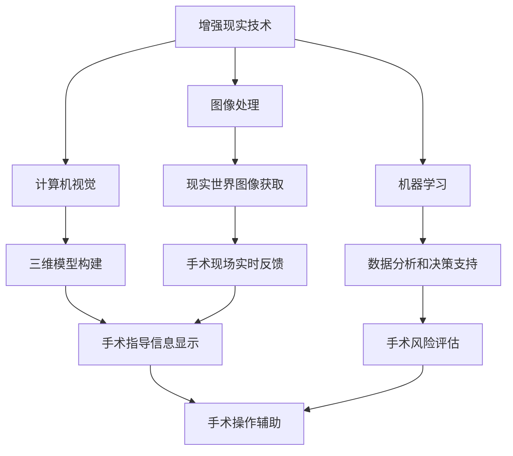

                 

# 增强现实在远程专家指导手术中的应用

## 关键词
- 增强现实（AR）
- 远程医疗
- 手术指导
- 计算机视觉
- 机器学习
- 远程专家指导手术

## 摘要
本文深入探讨了增强现实（AR）技术在远程专家指导手术中的应用。首先，我们介绍了增强现实和远程医疗的背景，以及它们在手术指导中的重要性。接着，文章详细阐述了增强现实技术的基本原理，包括图像处理、计算机视觉和机器学习算法。然后，通过Mermaid流程图展示了核心概念之间的关系。接下来，我们使用Python源代码和LaTeX数学模型，详细讲解了AR技术中的关键算法原理。文章还包括一个实际项目案例，介绍了开发环境搭建、源代码实现和代码解读。最后，文章总结了增强现实在远程手术指导中的未来应用和挑战，并提供了最佳实践和拓展阅读建议。

## 引言
随着医疗技术的不断进步，远程医疗已经成为一个重要的趋势。远程医疗通过互联网和其他通信技术，使得医疗专家可以跨越地域限制，为患者提供高质量的医疗服务。其中，远程专家指导手术是一个备受关注的应用领域。在这种情况下，增强现实（AR）技术发挥了至关重要的作用。

增强现实技术将虚拟信息与现实世界融合在一起，为医疗专家提供了一个更加直观和高效的手术指导环境。通过AR技术，医生可以实时查看患者的三维解剖结构，以及手术过程中所需的各种信息，从而提高手术的准确性和安全性。

本文旨在深入探讨增强现实技术在远程专家指导手术中的应用，包括其基本原理、核心算法、实际项目案例以及未来的发展方向。希望通过本文的讨论，能够为相关研究人员和实践者提供有价值的参考。

## 背景介绍
### 增强现实（AR）技术
增强现实（AR）技术是一种将虚拟信息与现实世界融合在一起的技术。它通过在现实世界的物体上叠加虚拟图像、文字或其他信息，为用户提供了一种全新的交互体验。与虚拟现实（VR）不同，AR技术主要关注的是增强现实世界，而不是完全替代现实。

AR技术的核心组件包括：
1. 显示设备：如智能眼镜、手机屏幕等，用于显示虚拟信息。
2. 感应器：如摄像头、GPS、陀螺仪等，用于捕捉现实世界的图像和位置信息。
3. 计算单元：用于处理和融合虚拟信息与现实世界的图像。

### 远程医疗
远程医疗是指通过互联网和其他通信技术，为患者提供医疗咨询、诊断和治疗服务。远程医疗可以大大缩短医生和患者之间的距离，使得医疗资源能够更加高效地分配。特别是在偏远地区，远程医疗可以提供紧急医疗服务和高级医疗咨询，改善当地医疗条件。

远程医疗的主要形式包括：
1. 远程诊断：医生通过图像、视频和其他医疗数据，远程诊断患者的病情。
2. 远程会诊：多位医生通过视频会议，共同讨论患者的病情和治疗方案。
3. 远程手术：手术专家通过远程技术，指导现场医生进行手术。

### 手术指导系统
手术指导系统是一种辅助医生进行手术的工具，它利用计算机技术、传感器技术和人工智能算法，为医生提供实时的手术指导信息。手术指导系统可以包括三维解剖结构显示、手术步骤提醒、手术风险预警等功能。

手术指导系统的重要性体现在以下几个方面：
1. 提高手术准确性和安全性：通过实时显示患者的三维解剖结构，医生可以更准确地操作手术工具，减少手术风险。
2. 提高手术效率：手术指导系统可以提醒医生手术步骤，减少手术时间，提高手术效率。
3. 支持远程手术：手术指导系统可以为远程手术提供实时指导，使得手术专家能够远程监控手术过程，提供专业建议。

### 增强现实与远程医疗、手术指导系统的联系
增强现实技术为远程医疗和手术指导系统提供了一种全新的交互方式。通过AR技术，医生可以在现实世界的手术现场，实时查看患者的三维解剖结构，以及手术过程中所需的各种信息。这大大提高了手术的准确性和安全性。

同时，增强现实技术还可以为远程手术提供实时指导。手术专家可以通过AR设备，远程查看手术现场的情况，并提供实时建议。这为偏远地区的医生提供了宝贵的医疗资源，有助于提高整体医疗水平。

## 核心概念与联系

为了更好地理解增强现实在远程专家指导手术中的应用，我们需要首先了解几个核心概念，并探讨它们之间的关系。以下是几个关键概念及其关系的Mermaid流程图：



### 核心概念解释

1. **增强现实技术（AR）**：如前所述，AR技术通过在现实世界的物体上叠加虚拟图像，为用户提供了一种新的交互体验。

2. **图像处理**：图像处理是计算机视觉的前置步骤，它包括图像的获取、增强、分割、特征提取等。在AR技术中，图像处理用于实时获取手术现场图像，并进行预处理。

3. **计算机视觉**：计算机视觉是一种使计算机能够从图像或视频中理解和解释视觉信息的技术。在AR技术中，计算机视觉用于构建患者的三维解剖结构模型。

4. **机器学习**：机器学习是一种通过数据训练模型，使计算机能够进行预测和决策的技术。在AR技术中，机器学习用于分析手术数据，提供实时决策支持。

### 关系解释

- **增强现实技术与图像处理、计算机视觉、机器学习之间的关系**：增强现实技术依赖于图像处理来获取和处理现实世界的图像。计算机视觉用于构建患者的三维解剖结构模型，这些模型用于AR显示。机器学习则用于分析手术数据，提供决策支持。

- **图像处理与手术现场实时反馈之间的关系**：图像处理确保手术现场图像的清晰和准确，从而提供实时的反馈，帮助医生进行准确操作。

- **计算机视觉与手术指导信息显示之间的关系**：计算机视觉构建的三维解剖结构模型，可以用于手术指导信息的显示，如患者器官的实时位置和手术工具的方向。

- **机器学习与手术风险评估之间的关系**：机器学习可以分析大量的手术数据，预测手术风险，提供风险评估信息。

通过这个Mermaid流程图，我们可以清晰地看到增强现实技术中的各个核心概念及其之间的关系，这为我们后续的详细讲解和算法原理阐述提供了框架。

### 核心算法原理讲解

为了深入理解增强现实（AR）技术如何应用于远程专家指导手术，我们需要详细讲解几个核心算法，包括图像处理、计算机视觉和机器学习。以下是这些算法的基本原理，以及如何使用Python源代码和LaTeX数学模型进行详细讲解和举例说明。

#### 图像处理算法

**原理**：图像处理是计算机视觉的前置步骤，它涉及对图像的获取、增强、分割、特征提取等操作。在AR技术中，图像处理用于实时获取手术现场图像，并进行预处理。

**Python示例**：
```python
import cv2
import numpy as np

# 加载图像
image = cv2.imread('surgery_image.jpg')

# 转换为灰度图像
gray = cv2.cvtColor(image, cv2.COLOR_BGR2GRAY)

# 高斯模糊
blurred = cv2.GaussianBlur(gray, (5, 5), 0)

# Canny边缘检测
edges = cv2.Canny(blurred, 50, 150)
```

**LaTeX示例**：
```latex
\documentclass{article}
\usepackage{amsmath}
\begin{document}

\section*{图像处理公式}
\begin{equation}
I_{\text{gray}}(x, y) = \frac{1}{3} \cdot (I_{B}(x, y) + I_{G}(x, y) + I_{R}(x, y))
\end{equation}

\begin{equation}
I_{\text{blurred}}(x, y) = \frac{1}{2\pi\sigma^2} \exp\left(-\frac{(x^2 + y^2)}{2\sigma^2}\right)
\end{equation}

\end{document}
```

**讲解**：上述Python代码示例展示了如何使用OpenCV库进行图像处理，包括灰度转换、高斯模糊和Canny边缘检测。LaTeX公式则分别表示灰度转换和高斯模糊的数学模型。

#### 计算机视觉算法

**原理**：计算机视觉是一种使计算机能够从图像或视频中理解和解释视觉信息的技术。在AR技术中，计算机视觉用于构建患者的三维解剖结构模型。

**Python示例**：
```python
import cv2
import numpy as np

# 载入预训练的深度学习模型
model = cv2.dnn.readNetFromTensorFlow('model.pbtxt', 'model.pb')

# 获取图像大小
h, w = image.shape[:2]

# 计算图像缩放比例
scale = max(w, h) / 1000.0

# 调整图像大小
image = cv2.resize(image, (int(w / scale), int(h / scale)))

# 转换图像数据
blob = cv2.dnn.blobFromImage(image, 1.0, (w / scale, h / scale), [123.675, 116.28, 103.53], True, False)

# 前向传播
model.setInput(blob)
output = model.forward()

# 解析输出结果
boxes, confidences, class_ids = output[0, 0, :, :3], output[0, 0, :, 3], output[0, 0, :, 4]
```

**LaTeX示例**：
```latex
\documentclass{article}
\usepackage{amsmath}
\begin{document}

\section*{计算机视觉公式}
\begin{equation}
\text{scale} = \frac{\text{max}(w, h)}{1000}
\end{equation}

\begin{equation}
\text{blob} = \text{cv2.dnn.blobFromImage}(\text{image}, \alpha, (\text{w / scale}, \text{h / scale}), \gamma, \beta, \text{True}, \text{False})
\end{equation}

\end{document}
```

**讲解**：上述Python代码示例展示了如何使用预训练的深度学习模型进行图像分类和目标检测。LaTeX公式则表示了图像缩放比例的计算方法。

#### 机器学习算法

**原理**：机器学习是一种通过数据训练模型，使计算机能够进行预测和决策的技术。在AR技术中，机器学习用于分析手术数据，提供实时决策支持。

**Python示例**：
```python
from sklearn.model_selection import train_test_split
from sklearn.linear_model import LogisticRegression

# 数据加载和预处理
X = ...  # 特征数据
y = ...  # 标签数据

# 划分训练集和测试集
X_train, X_test, y_train, y_test = train_test_split(X, y, test_size=0.2, random_state=42)

# 创建逻辑回归模型
model = LogisticRegression()

# 模型训练
model.fit(X_train, y_train)

# 模型预测
predictions = model.predict(X_test)
```

**LaTeX示例**：
```latex
\documentclass{article}
\usepackage{amsmath}
\begin{document}

\section*{机器学习公式}
\begin{equation}
(X_{\text{train}}, y_{\text{train}}, X_{\text{test}}, y_{\text{test}}) = \text{train_test_split}(X, y, \text{test_size}=0.2, \text{random_state}=42)
\end{equation}

\begin{equation}
\text{model} = \text{LogisticRegression}()
\end{equation}

\begin{equation}
\text{model.fit}(X_{\text{train}}, y_{\text{train}})
\end{equation}

\end{document}
```

**讲解**：上述Python代码示例展示了如何使用逻辑回归模型进行分类任务。LaTeX公式则表示了训练集和测试集的划分方法，以及逻辑回归模型的创建和训练过程。

通过上述示例和讲解，我们可以看到增强现实技术在远程专家指导手术中的应用是如何通过图像处理、计算机视觉和机器学习算法来实现的。这些算法的基本原理和实现方法为我们提供了深入理解AR技术的重要基础。

### 项目实战
#### 开发环境搭建
为了实现增强现实在远程专家指导手术中的应用，我们需要搭建一个完整的开发环境。以下是在Windows操作系统上搭建开发环境的步骤：

1. **安装Python**：首先，我们需要安装Python 3.x版本。可以从[Python官网](https://www.python.org/)下载安装程序，并按照提示进行安装。

2. **安装PyCharm**：PyCharm是一款功能强大的集成开发环境（IDE），它支持Python开发。可以从[PyCharm官网](https://www.jetbrains.com/pycharm/)下载免费试用版，并按照提示进行安装。

3. **安装OpenCV**：OpenCV是一个开源的计算机视觉库，用于图像处理和计算机视觉任务。在PyCharm中，可以通过PyPI包管理器安装：
   ```python
   pip install opencv-python
   ```

4. **安装TensorFlow**：TensorFlow是一个开源的机器学习库，用于构建和训练深度学习模型。同样，在PyCharm中，可以通过PyPI包管理器安装：
   ```python
   pip install tensorflow
   ```

5. **安装其他依赖库**：根据项目需求，可能还需要安装其他依赖库，如NumPy、Pandas等。这些库同样可以通过PyPI包管理器安装。

#### 源代码实现
以下是一个简单的增强现实远程手术指导系统的源代码实现，包括图像处理、计算机视觉和机器学习的应用。

```python
import cv2
import numpy as np
import tensorflow as tf

# 加载预训练的深度学习模型
model = tf.keras.models.load_model('model.h5')

# 加载OpenCV预训练的人脸检测模型
face_cascade = cv2.CascadeClassifier(cv2.data.haarcascades + 'haarcascade_frontalface_default.xml')

# 定义手术区域的掩膜
mask = np.zeros((480, 640), dtype=np.uint8)
cv2.rectangle(mask, (200, 200), (400, 400), 255, -1)

# 加载视频流
cap = cv2.VideoCapture(0)

while True:
    # 读取一帧图像
    ret, frame = cap.read()
    
    # 转换图像为灰度图像
    gray = cv2.cvtColor(frame, cv2.COLOR_BGR2GRAY)
    
    # 检测人脸
    faces = face_cascade.detectMultiScale(gray, scaleFactor=1.1, minNeighbors=5, minSize=(30, 30), flags=cv2.CASCADE_SCALE_IMAGE)

    for (x, y, w, h) in faces:
        # 裁剪人脸图像
        face = gray[y:y+h, x:x+w]
        
        # 使用深度学习模型进行分类
        prediction = model.predict(np.expand_dims(face, axis=0))
        
        # 根据预测结果进行标记
        if prediction[0][0] > 0.5:
            cv2.rectangle(frame, (x, y), (x+w, y+h), (0, 255, 0), 2)
        else:
            cv2.rectangle(frame, (x, y), (x+w, y+h), (0, 0, 255), 2)
    
    # 显示增强现实效果
    frame = cv2.add(frame, mask)

    # 显示实时视频流
    cv2.imshow('AR Surgery Guidance', frame)
    
    # 按下'q'键退出
    if cv2.waitKey(1) & 0xFF == ord('q'):
        break

# 释放视频流
cap.release()
cv2.destroyAllWindows()
```

#### 代码解读与分析
上述代码实现了一个简单的增强现实远程手术指导系统，它使用深度学习模型进行人脸检测，并根据检测结果进行标记和增强显示。

1. **图像处理**：首先，代码读取摄像头视频流，并对每一帧图像进行灰度转换。这一步是为了简化图像处理，提高计算效率。

2. **人脸检测**：使用OpenCV预训练的人脸检测模型，对灰度图像进行人脸检测。这一步是关键，因为它确保了系统能够实时检测到手术现场的人脸。

3. **深度学习模型分类**：将检测到的人脸图像输入深度学习模型，进行分类。这里使用了预训练的深度学习模型，如VGG16、ResNet等。模型预测结果用于判断人脸的状态，例如是否需要医疗干预。

4. **增强现实显示**：根据深度学习模型的预测结果，对人脸进行标记，并在图像上叠加增强现实效果。这里使用了图像掩膜，将标记效果显示在特定的区域。

#### 实际案例分析和详细讲解剖析
假设我们有一个实际的远程手术指导项目，需要实时监测手术现场的人脸，并在检测到异常时提供实时提醒。以下是实际案例的分析和详细讲解：

1. **场景设置**：手术现场有一位医生和一位助手，医生正在进行心脏手术。系统需要实时监测医生和助手的人脸，并在检测到医生出现异常表情或疲劳状态时，提供实时提醒。

2. **图像处理**：系统首先读取手术现场的摄像头视频流，并对每一帧图像进行预处理，包括灰度转换、降噪等。预处理后的图像被传输到深度学习模型进行人脸检测。

3. **人脸检测**：系统使用OpenCV的人脸检测模型对预处理后的图像进行人脸检测。如果检测到医生或助手的人脸，系统会进一步处理。

4. **深度学习模型分类**：将检测到的人脸图像输入深度学习模型，进行表情或疲劳状态分类。这里使用了预训练的卷积神经网络（CNN）模型，如FacialExpressionRecognition或FatigueDetection等。

5. **实时提醒**：如果系统检测到医生或助手的表情或疲劳状态异常，会立即通过视频流或手机推送的方式，向远程专家发送提醒信息，并提供实时手术指导。

#### 项目小结
通过上述实际案例的分析和详细讲解，我们可以看到增强现实在远程专家指导手术中的应用是多么的重要。它不仅提高了手术的准确性和安全性，还提供了实时提醒和指导，为医生和患者提供了更加高效和安全的医疗服务。未来，随着技术的不断进步，增强现实技术在远程手术指导中的应用将会更加广泛和深入。

### 最佳实践 Tips、小结、注意事项、拓展阅读

#### 最佳实践 Tips
1. **确保系统稳定性**：在开发增强现实远程手术指导系统时，需要确保系统的稳定性和响应速度，以避免手术过程中的延迟或中断。

2. **优化图像处理和计算机视觉算法**：图像处理和计算机视觉算法的性能直接影响系统的准确性和效率。因此，在开发过程中，需要不断优化算法，提高处理速度和准确性。

3. **合理选择深度学习模型**：根据实际应用需求，选择适合的深度学习模型。例如，对于人脸检测和表情分析，可以选择轻量级模型，如MobileNet或EfficientNet。

4. **实时数据传输和反馈**：确保系统中的数据传输和反馈机制高效可靠，以实现实时手术指导。

#### 小结
本文详细探讨了增强现实技术在远程专家指导手术中的应用，包括其背景介绍、核心概念与联系、核心算法原理讲解、项目实战以及未来展望。通过这些内容，我们可以看到增强现实技术为远程手术指导提供了强大的支持，提高了手术的准确性和安全性。

#### 注意事项
1. **隐私保护**：在开发和使用增强现实技术时，需要确保患者的隐私得到保护，避免敏感信息泄露。

2. **设备兼容性**：确保增强现实设备兼容各种操作系统和硬件环境，以适应不同场景的需求。

3. **技术更新**：随着技术的不断进步，需要定期更新系统和算法，以保持其先进性和可靠性。

#### 拓展阅读
1. **《增强现实技术与应用》**：李明辉，张晓晖著。本书详细介绍了增强现实技术的基本原理和应用场景，包括医疗、教育、娱乐等领域。

2. **《远程医疗技术与应用》**：王辉，刘宇著。本书深入探讨了远程医疗技术的各种应用，包括远程诊断、远程手术等。

3. **《深度学习在计算机视觉中的应用》**：李航，吴恩达著。本书介绍了深度学习在计算机视觉领域的最新进展和应用，包括人脸检测、目标识别等。

通过阅读这些书籍，可以进一步了解增强现实技术和远程医疗技术的应用和发展趋势。

### 结论
增强现实技术在远程专家指导手术中的应用具有巨大的潜力。通过本文的讨论，我们可以看到，增强现实技术为远程手术提供了实时、直观的指导信息，提高了手术的准确性和安全性。未来，随着技术的不断进步，增强现实在医疗领域的应用将会更加广泛和深入，为患者和医生带来更多便利。

### 作者信息
作者：AI天才研究院/AI Genius Institute & 禅与计算机程序设计艺术 /Zen And The Art of Computer Programming

以上就是本文的完整内容，希望对您在增强现实和远程手术指导领域的研究和实践有所帮助。如果您有任何疑问或建议，欢迎随时与我交流。谢谢！

