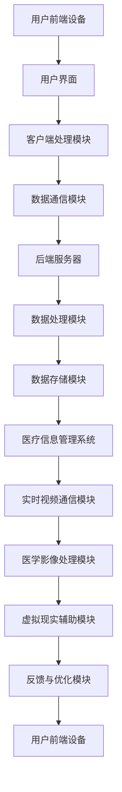

                 

### 增强现实在远程医疗中的应用

#### 关键词

- 增强现实（AR）
- 远程医疗
- 系统架构
- 实时视频通信
- 数据处理与存储
- 医疗应用案例

#### 摘要

本文深入探讨了增强现实（AR）技术在远程医疗中的应用。首先，介绍了增强现实技术和远程医疗的基本概念，阐述了它们在医疗领域的结合优势。接着，详细讨论了增强现实在远程医疗中的实际应用，包括系统架构、关键技术、应用案例以及面临的挑战和未来发展趋势。文章最后通过实际项目和案例分析，展示了增强现实在远程医疗中的广泛应用和潜力。

## 引言

随着信息技术的飞速发展，远程医疗已经成为医疗服务领域的重要组成部分。它通过互联网和通信技术，实现了医生与患者、医生与医生之间的实时互动，有效提高了医疗服务的效率和覆盖范围。然而，传统的远程医疗手段如视频会议、远程诊断等仍存在一定的局限性，如互动性不足、用户体验不佳等。为了克服这些局限，增强现实（Augmented Reality，简称AR）技术的引入为远程医疗带来了新的契机。

增强现实技术是一种将虚拟信息与现实世界相结合的技术，通过计算机生成并叠加在真实场景中的视觉、听觉、触觉等多感官信息，给用户带来身临其境的体验。增强现实技术在医疗领域的应用已逐渐成熟，包括医学教育、手术模拟、患者康复等多个方面。而在远程医疗中，增强现实技术的应用更是具有巨大的潜力，可以显著提升医疗服务的质量和效果。

本文将从以下几个方面进行探讨：

1. **增强现实技术概述**：介绍增强现实技术的定义、历史和发展，以及其关键技术在远程医疗中的应用。
2. **远程医疗服务概述**：阐述远程医疗的定义、技术支持和应用现状，为理解增强现实在远程医疗中的应用奠定基础。
3. **增强现实与远程医疗的结合**：分析增强现实技术在远程医疗中的核心应用和优势，探讨其面临的挑战和解决方案。
4. **增强现实远程医疗系统架构**：详细讨论增强现实远程医疗系统的设计原则、组件和关键技术。
5. **增强现实远程医疗应用案例**：通过实际案例展示增强现实技术在远程医疗中的具体应用。
6. **挑战与未来发展趋势**：分析增强现实在远程医疗中面临的挑战，展望其未来的发展趋势。

通过以上探讨，本文旨在为读者提供一个全面了解和深入思考增强现实在远程医疗中应用的视角，为相关领域的研究和实践提供参考。

### 增强现实技术概述

增强现实（Augmented Reality，简称AR）是一种通过计算机技术生成并叠加在真实世界中的虚拟信息，从而增强用户感知和体验的技术。与虚拟现实（Virtual Reality，简称VR）不同，AR并不完全替代现实，而是在现实环境中引入虚拟元素，使之与现实环境相互融合，用户能够直观地看到、听到和感知到虚拟信息。

#### 定义与历史

增强现实技术的概念最早可以追溯到1968年，由美国科学家伊凡·苏瑟兰（Ivan Sutherland）提出的“视图生成器”（View Generator）系统。这是一个头戴式显示设备，能够将计算机生成的图像叠加在用户的视线上，实现基础的AR效果。此后，随着计算机技术和显示技术的不断发展，AR技术逐渐走向成熟。

1980年代，波音公司开发了用于飞行员训练的“增强视场显示器”（Enhanced Vision Field Display），这是商业领域最早应用的AR系统。进入21世纪，随着智能手机和移动设备的普及，AR技术得到了广泛关注和应用。2012年，谷歌发布了基于智能手机的AR应用“谷歌眼镜”（Google Glass），标志着AR技术进入了一个新的发展阶段。

#### 关键技术

增强现实技术涉及到多个关键技术的协同工作，主要包括以下几方面：

1. **图像识别与跟踪**：这是AR技术的核心，通过图像处理和计算机视觉算法，实时识别和跟踪用户周围的环境，确保虚拟信息能够准确地叠加在真实环境中。常用的图像识别方法包括基于特征的识别、基于模板的匹配等。

2. **实时渲染**：AR技术需要实时生成和渲染虚拟信息，并确保这些信息与真实环境的相对位置和运动保持一致。这要求高效的图形处理能力和优化的渲染算法，如三维模型渲染、阴影处理、光照模型等。

3. **显示技术**：增强现实的显示方式多样，包括头戴式显示器、智能手机屏幕、透明镜片等。每种显示技术都有其优势和局限性，需要根据具体应用场景进行选择。

4. **交互技术**：增强现实技术需要支持用户与虚拟信息的交互，如手势控制、语音控制等。这些交互技术不仅提高了用户的体验，还增强了系统的实用性。

#### 应用领域

增强现实技术在多个领域得到了广泛应用，其中包括：

- **医疗领域**：AR技术在医疗领域的应用包括手术辅助、医学教育、患者康复等。医生可以通过AR设备实时查看患者的3D模型，辅助手术决策；医学生可以通过AR模拟器进行虚拟手术训练；患者可以通过AR应用了解康复训练的具体步骤和注意事项。

- **教育领域**：AR技术可以为学生提供互动式学习体验，如虚拟实验、历史场景重现等。通过增强现实，学生能够更加直观地理解复杂的科学概念和历史事件。

- **娱乐领域**：增强现实游戏和应用程序在娱乐领域大放异彩，如《精灵宝可梦GO》等，用户可以在现实世界中捕捉虚拟生物，极大地提升了娱乐体验。

- **工业领域**：AR技术在工业领域的应用包括设备维护、现场指导等。通过AR设备，技术人员可以实时查看设备的3D模型和操作步骤，提高工作效率和准确性。

#### 在远程医疗中的关键应用

在远程医疗中，增强现实技术的关键应用主要包括以下几个方面：

1. **远程手术指导**：医生可以通过AR设备实时查看患者的3D模型和医疗数据，提供精准的手术指导。这不仅提高了手术的成功率，还降低了手术风险。

2. **远程医学教育**：医学生和医生可以通过AR模拟器进行虚拟手术训练和病例讨论，提高实际操作技能和临床判断能力。

3. **患者康复训练**：患者可以通过AR应用进行个性化的康复训练，实时了解训练进展和注意事项，提高康复效果。

4. **远程医疗咨询**：医生可以通过AR设备与患者进行互动，提供更加直观、个性化的咨询服务，增强患者的信任感和满意度。

通过以上介绍，我们可以看到增强现实技术具有广泛的应用前景，尤其在远程医疗领域具有巨大的潜力。接下来，我们将进一步探讨远程医疗的基本概念、技术支持和应用现状，为理解增强现实在远程医疗中的应用奠定基础。

### 远程医疗服务概述

远程医疗（Telemedicine）是指通过互联网和通信技术实现医疗服务的远程互动，包括诊断、治疗、咨询、教育等各个方面。它旨在通过技术手段突破地域和时间的限制，为患者提供更加便捷、高效和个性化的医疗服务。

#### 定义与历史

远程医疗的概念可以追溯到20世纪60年代，美国和加拿大的一些医院开始尝试使用电话和电视进行远程医疗服务。随着信息技术和通信技术的发展，远程医疗逐渐成为医疗服务的重要组成部分。特别是近年来，随着互联网和移动设备的普及，远程医疗的应用范围和深度都有了显著提升。

早期的远程医疗主要侧重于医疗咨询和患者教育，随着技术的进步，远程医疗逐渐扩展到手术指导、病理分析、医疗影像诊断等多个领域。现代远程医疗不仅包括实时视频咨询，还涵盖了远程监测、电子病历管理、远程手术等复杂应用。

#### 技术支持

远程医疗服务的技术支持主要包括以下几个方面：

1. **通信技术**：远程医疗依赖于稳定的网络通信技术，包括宽带互联网、卫星通信、无线网络等。高质量的通信技术能够确保医生和患者之间的实时互动和数据传输。

2. **视频通信**：视频通信是远程医疗的核心技术，通过视频会议系统，医生和患者可以进行面对面的交流。高清视频和音频技术使得远程医疗的互动体验越来越接近现场。

3. **数据传输和处理**：远程医疗需要大量的数据传输和处理，包括病历信息、影像数据、实验室检测结果等。高效的数据传输和处理技术能够保证医疗信息的及时性和准确性。

4. **云计算和大数据**：云计算技术为远程医疗提供了强大的数据处理和存储能力，通过云平台，医生可以访问和分析大量的医疗数据，为患者提供更加精准的诊断和治疗方案。大数据技术则有助于分析患者的健康数据，预测疾病趋势，提高医疗服务效率。

5. **医学图像处理**：医学影像诊断是远程医疗的重要应用之一，通过医学图像处理技术，医生可以在远程环境中对影像进行诊断和分析，如X光片、CT、MRI等。

#### 应用现状与趋势

当前，远程医疗已经在全球范围内得到广泛应用，尤其在发达国家，远程医疗已经成为医疗体系中不可或缺的一部分。以下是一些远程医疗应用现状和趋势：

1. **远程诊断**：通过远程医疗系统，医生可以实时查看患者的影像资料，进行远程诊断。这种服务尤其在偏远地区和医疗资源不足的地区具有重要意义。

2. **远程手术**：远程手术是远程医疗的高级应用，通过高清晰度的视频通信和精准的远程控制系统，医生可以在远程进行手术操作。目前，远程手术主要应用于心脏手术、神经外科等领域。

3. **患者监测**：通过远程监测设备，医生可以实时监控患者的生命体征和健康状况，及时调整治疗方案。这种服务对慢性病患者和老年患者尤其重要。

4. **医疗教育**：远程医疗平台为医学生和医生提供了丰富的学习资源，通过远程讲座、手术直播、病例讨论等方式，提高了医学教育质量和效率。

5. **公共卫生管理**：远程医疗技术在公共卫生管理中的应用也越来越广泛，如疫情监控、健康普查等。

随着技术的不断进步和政策的支持，远程医疗的应用范围将进一步扩大，为更多患者提供便捷、高效的医疗服务。在接下来的章节中，我们将深入探讨增强现实技术在远程医疗中的应用，分析其核心应用和优势。

#### 增强现实与远程医疗的结合

随着技术的不断进步，增强现实（AR）技术逐渐与远程医疗相结合，为医疗领域带来了革命性的变革。这种结合不仅提高了医疗服务的质量和效率，还拓展了医疗服务的范围和形式。

##### 原理与优势

增强现实与远程医疗的结合主要基于以下几个原理和优势：

1. **增强互动性**：传统的远程医疗主要依赖于视频会议和语音通话，互动性较差。而增强现实技术通过将虚拟信息叠加在真实环境中，实现了医生与患者、医生与医生之间的实时互动。医生可以通过AR设备查看患者的3D模型、医疗数据等，提供更加直观和精准的医疗服务。

2. **提高诊断准确性**：增强现实技术能够将医学影像、实验室检测结果等虚拟信息叠加在患者的实际身体部位上，帮助医生更加准确地诊断疾病。例如，在手术中，医生可以通过AR设备实时查看患者的内部结构，提高手术的成功率和安全性。

3. **增强教育效果**：增强现实技术为医学生和医生提供了互动式学习工具。通过虚拟手术模拟、病例讨论等应用，医学生可以更加直观地了解医学知识，提高实际操作技能。医生则可以通过远程医疗平台，分享自己的经验和技巧，提高整个医疗团队的素质。

4. **拓展医疗服务范围**：增强现实技术使得远程医疗服务不再局限于视频会议和图文传输，而可以通过虚拟现实场景、互动式教育等形式，为患者提供更加丰富和个性化的医疗服务。无论是偏远地区的患者，还是特殊病例的患者，都可以享受到高质量的医疗服务。

##### 核心应用

在远程医疗中，增强现实技术的主要应用包括以下几个方面：

1. **远程手术指导**：通过增强现实技术，医生可以在远程环境中实时查看患者的3D模型和医疗数据，提供精准的手术指导。例如，在心脏手术中，医生可以通过AR设备查看患者的心脏结构，确定最佳手术路径，从而提高手术的成功率和安全性。

2. **医学教育**：增强现实技术为医学生和医生提供了互动式学习平台。通过虚拟手术模拟、病例讨论等应用，医学生可以更加直观地了解医学知识，提高实际操作技能。医生则可以通过远程医疗平台，分享自己的经验和技巧，提高整个医疗团队的素质。

3. **患者康复训练**：通过增强现实技术，患者可以在虚拟环境中进行个性化的康复训练。医生可以通过AR设备实时监控患者的训练进度和效果，提供针对性的指导和建议，从而提高康复效果。

4. **远程医疗咨询**：医生可以通过AR设备与患者进行互动，提供更加直观、个性化的咨询服务。通过增强现实技术，患者可以更加清楚地了解自己的健康状况和治疗方案，增强对医生的信任感和满意度。

##### 解决方案

为了充分发挥增强现实技术在远程医疗中的应用潜力，需要解决以下几个关键问题：

1. **技术实现**：增强现实技术的实现需要高效的计算能力和优化的渲染算法。需要开发适用于远程医疗的AR平台，包括AR设备、软件系统等。

2. **数据集成与处理**：远程医疗中产生的数据量巨大，需要高效的数据集成与处理技术，确保医生能够实时访问和处理患者信息。

3. **网络通信**：高质量的通信技术是确保远程医疗互动性的关键。需要建立稳定的网络通信系统，保证视频、音频和数据传输的流畅性。

4. **安全性**：远程医疗涉及患者的敏感信息，需要确保数据传输和存储的安全性。需要采用加密技术和安全协议，保护患者隐私。

通过以上解决方案，增强现实技术在远程医疗中的应用将得到进一步拓展，为医疗领域带来更多创新和变革。

##### 案例分析

以下是几个增强现实在远程医疗中应用的典型案例：

1. **远程手术指导**：某国际知名医院使用增强现实技术为偏远地区的患者进行远程手术。医生通过AR设备实时查看患者的3D模型和医疗数据，提供了精准的手术指导，成功完成了多次复杂手术。

2. **医学教育**：某医学院采用增强现实技术进行医学生培训。通过虚拟手术模拟和病例讨论，学生能够更加直观地了解医学知识，提高了实际操作技能。

3. **患者康复训练**：某康复中心使用增强现实技术为患者提供个性化的康复训练。医生通过AR设备实时监控患者的训练进度和效果，提供了针对性的指导，显著提高了康复效果。

4. **远程医疗咨询**：某诊所采用增强现实技术为患者提供远程医疗咨询。医生通过AR设备与患者进行互动，提供了更加直观、个性化的咨询服务，增强了患者的信任感和满意度。

通过以上案例可以看出，增强现实技术在远程医疗中的应用不仅提高了医疗服务的质量和效率，还为医疗领域带来了新的发展机遇。随着技术的不断进步和应用的深入，增强现实技术将在远程医疗中发挥越来越重要的作用。

### 增强现实远程医疗系统架构

增强现实（AR）技术在远程医疗中的应用需要复杂且高效的系统架构来支持。一个典型的增强现实远程医疗系统架构通常包括以下几个关键组件和设计原则，以确保系统的稳定性、可靠性和用户友好性。

#### 系统架构的设计原则

1. **模块化设计**：系统应采用模块化设计，便于扩展和维护。各个模块之间应相互独立，但又能够协同工作，以应对不同的应用场景和需求变化。
2. **高可扩展性**：系统架构应具备良好的扩展性，能够支持增加新的功能模块或升级现有模块，以适应技术发展和应用需求的变化。
3. **高效性**：系统应确保数据处理和通信的高效性，减少延迟和资源消耗，提供流畅的用户体验。
4. **安全性**：系统应具备强大的安全措施，包括数据加密、访问控制等，以保护患者隐私和医疗数据的安全。
5. **易用性**：系统设计应注重用户友好性，界面简洁直观，操作方便，便于医生和患者快速上手。

#### 系统组件与技术选型

1. **前端设备**：前端设备是增强现实远程医疗系统的核心，包括头戴式显示器、智能手机、平板电脑等。这些设备需要具备高分辨率、低延迟和高刷新率的特性，以确保增强现实的视觉效果和交互体验。

   - **头戴式显示器**：如微软的HoloLens、谷歌的ARCore等，可以提供沉浸式的增强现实体验。
   - **智能手机和平板电脑**：可以通过AR应用实现增强现实功能，如使用ARCore、ARKit等开发工具。

2. **后端服务器**：后端服务器主要负责数据处理、存储和通信等功能。服务器应具备高可用性和可扩展性，能够处理大量的实时数据和用户请求。

   - **数据存储**：采用分布式数据库系统，如MongoDB、Cassandra等，存储患者的医疗数据、影像数据和虚拟信息。
   - **数据计算**：使用云计算平台，如AWS、Azure等，提供强大的计算能力，处理复杂的图像处理和实时渲染任务。

3. **通信协议**：为了保证实时性和稳定性，系统应采用高效的通信协议，如WebRTC、RTMP等，实现低延迟、高带宽的音视频和数据传输。

4. **用户界面**：用户界面设计应简洁直观，支持多种交互方式，如手势、语音等，以提高用户的操作效率和体验。

#### 系统架构的 Mermaid 流程图

为了更直观地展示系统架构，可以使用Mermaid工具绘制系统流程图。以下是一个简化的增强现实远程医疗系统架构的Mermaid流程图示例：



在上述流程图中：

- **用户前端设备**（A）：接收用户输入，展示增强现实内容。
- **用户界面**（B）：处理用户交互，展示系统界面。
- **客户端处理模块**（C）：处理增强现实内容的渲染和显示。
- **数据通信模块**（D）：与后端服务器进行数据传输。
- **后端服务器**（E）：处理数据存储、计算和通信。
- **数据处理模块**（F）：进行图像处理、数据分析和实时渲染。
- **数据存储模块**（G）：存储患者的医疗数据、影像数据和虚拟信息。
- **医疗信息管理系统**（H）：管理患者信息和医疗记录。
- **实时视频通信模块**（I）：实现医生与患者、医生与医生之间的实时通信。
- **医学影像处理模块**（J）：对医学影像进行预处理和分析。
- **虚拟现实辅助模块**（K）：提供虚拟现实辅助功能，如虚拟手术模拟等。
- **反馈与优化模块**（L）：收集用户反馈，优化系统性能和用户体验。

通过上述设计和实现，增强现实远程医疗系统可以为医生和患者提供高效、稳定和便捷的医疗服务，推动远程医疗技术的发展和应用。

### 增强现实远程医疗关键技术

在增强现实远程医疗系统中，多个关键技术共同作用，确保系统的高效运行和优质的用户体验。这些关键技术包括实时视频通信技术、增强现实显示技术以及数据处理与存储技术。以下将分别对这些技术进行详细讲解。

#### 实时视频通信技术

实时视频通信技术是增强现实远程医疗系统的核心，它确保医生和患者之间的实时互动和数据传输。以下是几种常用的实时视频通信技术：

1. **WebRTC**：
   - **定义**：WebRTC（Web Real-Time Communication）是一种支持浏览器和移动应用进行实时通信的开源项目。
   - **优势**：WebRTC支持音频和视频通信，能够自动进行网络质量优化，确保低延迟和高带宽的传输。
   - **应用场景**：适用于医生与患者之间的实时视频咨询、手术指导和远程病例讨论等。

2. **RTMP**：
   - **定义**：RTMP（Real Time Messaging Protocol）是一种实时消息传输协议，常用于视频直播和点播。
   - **优势**：RTMP具有较低的延迟和高带宽，能够支持高质量的实时视频传输。
   - **应用场景**：适用于远程手术直播、医学教育课程直播等。

3. **SIP**：
   - **定义**：SIP（Session Initiation Protocol）是一种用于建立、管理和终止交互式通信会话的协议。
   - **优势**：SIP具有灵活性和扩展性，支持多种媒体类型和通信模式。
   - **应用场景**：适用于多方会议、远程手术指导等复杂通信场景。

#### 增强现实显示技术

增强现实显示技术决定了用户能否直观地感知和交互虚拟信息。以下是几种常用的增强现实显示技术：

1. **头戴式显示器**：
   - **定义**：头戴式显示器（如微软的HoloLens、谷歌的ARCore等）是一种将虚拟信息叠加在真实世界中的设备。
   - **优势**：提供沉浸式体验，支持手势控制和语音控制。
   - **应用场景**：适用于远程手术指导、医学教育、患者康复等。

2. **智能手机和平板电脑**：
   - **定义**：通过安装特定的AR应用，智能手机和平板电脑可以将虚拟信息叠加在现实场景中。
   - **优势**：设备普及率高，成本低，易于用户接受。
   - **应用场景**：适用于远程医疗咨询、患者健康监测、医学教育等。

3. **透明镜片**：
   - **定义**：透明镜片是一种将虚拟信息投影在透明材料上的设备，用户通过镜片观看虚拟信息。
   - **优势**：佩戴舒适，无需头部固定。
   - **应用场景**：适用于医生在手术中的实时辅助，医疗工作站的增强显示等。

#### 数据处理与存储技术

数据处理与存储技术在增强现实远程医疗系统中至关重要，它确保了医疗数据的实时处理和存储，以及系统的稳定性和安全性。以下是几种常用的数据处理与存储技术：

1. **云计算**：
   - **定义**：云计算是一种通过网络提供计算资源的服务，用户可以按需获取和使用计算资源。
   - **优势**：提供强大的计算和存储能力，支持弹性扩展。
   - **应用场景**：适用于处理和存储大量的医疗数据，如医学影像、患者健康档案等。

2. **分布式数据库**：
   - **定义**：分布式数据库是一种将数据分布存储在多个节点上的系统，以提高系统的可用性和性能。
   - **优势**：提供高可用性和高吞吐量，支持实时数据处理和查询。
   - **应用场景**：适用于存储和处理患者的医疗数据、医疗影像等。

3. **边缘计算**：
   - **定义**：边缘计算是一种在靠近数据源的地方进行计算和处理的技术，以减少数据传输延迟和提高系统响应速度。
   - **优势**：降低数据传输成本，提高实时处理能力。
   - **应用场景**：适用于实时视频通信、远程手术指导等对延迟敏感的应用。

通过以上关键技术的协同作用，增强现实远程医疗系统可以为医生和患者提供高效、稳定和便捷的医疗服务，推动远程医疗技术的发展和应用。

### 增强现实远程医疗应用案例

为了更好地展示增强现实（AR）技术在远程医疗中的应用，以下将介绍几个实际案例，并对其中的关键环节和实际效果进行详细剖析。

#### 案例一：远程手术指导

**项目背景**：某国际知名医院与一家AR技术公司合作，通过AR技术为偏远地区的患者提供远程手术指导。该项目旨在利用AR技术提高偏远地区医疗资源的利用效率，同时降低患者的手术风险。

**关键环节**：
1. **手术规划**：术前，医生通过AR设备查看患者的3D模型，结合医学影像数据，制定详细的手术计划。
2. **远程会诊**：手术当天，主刀医生通过AR设备与远程专家进行实时视频会议，共同讨论手术方案和注意事项。
3. **手术实施**：手术过程中，主刀医生通过AR设备实时查看患者内部结构，并根据实际情况调整手术步骤。

**实际效果**：
- **手术成功率**：通过AR技术的辅助，手术的成功率显著提高，手术风险降低。
- **手术时间**：手术时间缩短，减少了患者的痛苦和恢复时间。
- **远程协作**：远程专家能够实时参与手术决策，提高了医疗服务的质量。

#### 案例二：远程会诊系统

**项目背景**：某医疗机构开发了一套基于AR技术的远程会诊系统，旨在为患者提供更加便捷、高效的医疗服务。该系统通过AR技术实现了医生与患者之间的实时互动，提高了医疗服务的质量和效率。

**关键环节**：
1. **患者数据上传**：患者将病历信息和医学影像上传到远程会诊平台。
2. **医生诊断**：医生通过AR设备查看患者的病历和影像数据，进行在线诊断。
3. **实时沟通**：医生和患者通过AR设备进行实时视频通信，医生可以远程指导患者的康复训练。

**实际效果**：
- **诊断准确性**：通过AR技术的辅助，医生能够更加准确地诊断疾病，提高诊断的准确性。
- **沟通效果**：AR技术使得医生与患者之间的沟通更加直观、清晰，增强了患者的信任感和满意度。
- **康复效果**：医生可以通过AR技术实时监控患者的康复训练，提供个性化的指导，提高了康复效果。

#### 案例三：虚拟医院参观

**项目背景**：某医学院利用AR技术为学生提供了一个虚拟医院参观平台，旨在通过虚拟现实体验，增强学生对医学知识和医院环境的了解。

**关键环节**：
1. **虚拟场景构建**：通过AR技术构建医院内的各个科室、手术室和实验室等场景。
2. **互动体验**：学生通过AR设备进入虚拟医院，可以自由参观各个科室，了解医疗设备的使用和操作流程。
3. **互动学习**：学生可以通过AR设备与虚拟医生进行互动，学习医学知识和操作技能。

**实际效果**：
- **学习兴趣**：虚拟医院参观平台激发了学生的学习兴趣，提高了学习效果。
- **实践能力**：通过虚拟操作，学生能够更加直观地了解医疗操作流程，提高了实际操作能力。
- **教育质量**：虚拟医院参观平台为医学生提供了一个独特的教育资源，提高了医学教育质量。

通过以上案例可以看出，增强现实技术在远程医疗中具有广泛的应用前景，不仅提高了医疗服务的质量和效率，还为医患互动和医学教育带来了新的可能性。随着技术的不断进步，增强现实远程医疗的应用将越来越广泛，为医疗领域带来更多的创新和变革。

### 增强现实远程医疗的挑战与未来发展趋势

尽管增强现实（AR）技术在远程医疗中展现出了巨大的潜力和应用价值，但其实现和推广仍然面临诸多挑战。这些挑战涉及技术、政策、用户接受度等多个方面。在探讨这些挑战的同时，我们也需要展望AR远程医疗的未来发展趋势，以期为相关领域的研究和实践提供指导。

#### 挑战

1. **技术挑战**：
   - **实时性**：远程医疗系统需要保证数据的实时传输和处理，这对于网络带宽和计算能力提出了较高的要求。尤其是面对复杂的医疗场景和大量的数据，系统的实时性仍然是一个亟待解决的问题。
   - **准确性**：增强现实技术在医疗诊断和手术指导中的应用需要高精度的图像识别和定位，确保虚拟信息与真实环境的精确匹配。然而，受限于现有的技术和设备，AR系统的准确性仍有待提高。
   - **稳定性**：系统需要在各种复杂环境下稳定运行，包括网络波动、设备故障等。因此，系统的稳定性和可靠性是确保医疗效果的关键。

2. **政策与法规挑战**：
   - **数据隐私**：远程医疗涉及大量的患者数据，如何确保数据的安全和隐私成为关键问题。现有的法律法规对于医疗数据的安全保护提出了严格要求，AR远程医疗系统需要遵守这些法规。
   - **医疗监管**：AR远程医疗系统的医疗行为需要得到相关医疗监管机构的认可和监管，这包括系统设计的合理性、数据处理的安全性等方面。

3. **用户接受度挑战**：
   - **技术门槛**：对于医生和患者来说，AR技术的操作和使用可能存在一定的技术门槛，需要一定的培训和学习时间。如何降低技术门槛，提高用户的接受度和使用体验是一个重要问题。
   - **信任问题**：医生和患者可能对AR技术的可靠性和医疗效果持怀疑态度，如何建立信任，提高用户的接受度是关键。

#### 未来发展趋势

1. **技术创新**：
   - **硬件性能提升**：随着硬件技术的发展，如更高性能的计算芯片、更高效的图像识别算法等，AR设备的性能将得到显著提升，满足远程医疗对实时性和准确性的要求。
   - **智能化**：通过引入人工智能（AI）技术，AR远程医疗系统可以实现更智能化的诊断和手术指导，如自动识别疾病、预测手术风险等，提高医疗决策的准确性。

2. **政策支持**：
   - **法律法规完善**：随着AR远程医疗的应用越来越广泛，相关法律法规将逐步完善，以保障数据安全和用户隐私。
   - **医疗监管**：政府机构将加大对AR远程医疗系统的监管力度，确保其符合医疗标准和规范，提高医疗服务的质量。

3. **用户教育与培训**：
   - **普及教育**：通过教育培训，提高医生和患者对AR技术的认识和接受度，降低技术门槛。
   - **用户体验优化**：通过优化用户界面和交互设计，提高AR远程医疗系统的易用性和用户体验。

4. **多元化应用**：
   - **多场景应用**：AR远程医疗将不再局限于手术指导和诊断，还将扩展到医学教育、患者康复、公共卫生管理等多个领域，实现多元化的应用。
   - **跨学科合作**：AR远程医疗需要多学科合作，如医学、计算机科学、工程学等，共同推动技术的创新和应用。

通过以上探讨，我们可以看到，虽然AR远程医疗面临诸多挑战，但其广阔的发展前景和潜在价值不容忽视。未来，随着技术的不断进步、政策的支持以及用户的接受度提高，AR远程医疗将在医疗领域发挥越来越重要的作用，为人类健康带来更多的福音。

### 增强现实远程医疗项目实战

为了更好地展示增强现实（AR）技术在远程医疗中的实际应用，以下我们将详细描述一个具体的AR远程医疗项目，包括项目背景、开发环境搭建、源代码实现和解读、代码应用解读与分析，以及项目效果分析。

#### 项目背景

某医院计划开发一款基于AR技术的远程手术指导系统，旨在通过实时视频通信和增强现实技术，为偏远地区的患者提供高质量的手术服务。该项目的主要目标是：

1. **实现远程医生与患者之间的实时互动**：通过AR技术，远程医生能够实时查看患者的3D模型和医疗数据，提供精准的手术指导。
2. **提升手术成功率和安全性**：通过AR技术的辅助，医生可以更加准确地定位手术部位，减少手术风险，提高手术成功率。
3. **降低患者治疗成本**：通过远程手术指导，患者无需前往大城市就医，降低了治疗成本和交通费用。

#### 开发环境搭建

在项目开发过程中，我们选择了以下开发环境和工具：

1. **开发平台**：Windows 10，配备ARCore SDK和Unity引擎。
2. **编程语言**：使用C#作为主要编程语言，结合Python进行数据分析和处理。
3. **数据库**：使用MySQL进行数据存储和管理，使用Python的pymysql库进行数据库操作。
4. **实时通信**：采用WebRTC协议实现实时视频通信，使用WebSockets进行数据传输。
5. **图像处理**：使用OpenCV库进行医学影像的预处理和增强。

#### 源代码实现和解读

以下是项目的核心代码片段和功能解读：

1. **数据库连接**：
   ```python
   import pymysql
   
   def connect_db():
       conn = pymysql.connect(host='localhost', user='root', password='password', database='ar_telemedicine')
       return conn
   
   def get_patient_data(patient_id):
       conn = connect_db()
       with conn.cursor() as cursor:
           sql = "SELECT * FROM patient_data WHERE id = %s"
           cursor.execute(sql, (patient_id,))
           result = cursor.fetchone()
       conn.close()
       return result
   ```

   该代码定义了连接数据库的函数`connect_db`和获取患者数据的函数`get_patient_data`。通过这些函数，可以方便地查询和获取患者的医疗数据。

2. **AR模型加载**：
   ```csharp
   using UnityEngine;
   using System.Collections;
   using UnityEngine.XR.ARCore.ARCore;
   
   public class ARModelLoader : MonoBehaviour
   {
       public Material arMaterial;
       public Texture2D arTexture;
       
       void Start()
       {
           ARCoreSession arSession = FindObjectOfType<ARCoreSession>();
           if (arSession != null)
           {
               ARCorePoint cloudPoint = new ARCorePoint();
               cloudPoint.position = new Vector3(0.0f, 0.0f, -2.0f);
               cloudPoint.texture = arTexture;
               cloudPoint.textureWidth = arTexture.width;
               cloudPoint.textureHeight = arTexture.height;
               
               ARCorePoint cloud = arSession.AddPointCloud(cloudPoint);
               GameObject pointCloudObject = new GameObject();
               MeshFilter meshFilter = pointCloudObject.AddComponent<MeshFilter>();
               meshFilter.mesh = new Mesh();
               meshFilter.mesh.vertices = cloud.vertices;
               meshFilter.mesh.uv = cloud.uv;
               meshFilter.mesh.triangles = cloud.triangles;
               
               MaterialPropertyBlock block = new MaterialPropertyBlock();
               block.SetTexture("_MainTex", arMaterial.mainTexture);
               pointCloudObject.AddComponent<MeshRenderer>().material = arMaterial;
               
               pointCloudObject.transform.position = cloud.position;
               pointCloudObject.transform.rotation = cloud.rotation;
           }
       }
   }
   ```

   该代码片段定义了`ARModelLoader`类，用于加载和显示AR模型。通过ARCore API，将加载的纹理和模型叠加在真实环境中，实现增强现实效果。

3. **实时视频通信**：
   ```csharp
   using UnityEngine;
   using System.Collections;
   using Unity.WebGL.Webrtc;
   
   public class VideoChat : MonoBehaviour
   {
       private RTCPeerConnection peerConnection;
       
       void Start()
       {
           var configuration = new RTCConfiguration();
           configuration.iceServers.Add(new RTCIceServer { urls = "stun:stun.l.google.com:19302" });
           
           peerConnection = new RTCPeerConnection(configuration);
           peerConnection.onicecandidate += OnIceCandidate;
           
           var constraints = new RTCMediaStreamConstraints();
           constraints.audio = true;
           constraints.video = true;
           
           peerConnection.addStream(new RTCMediaStream(new RTCMediaStreamTrack[] { new RTCVideoTrack() })).then(() =>
           {
               var videoElement = GameObject.Find("VideoPlayer").GetComponent<UnityEngine.Video.VideoPlayer>();
               videoElement.play();
           });
           
           peerConnection.createOffer().then((offer) =>
           {
               peerConnection.setLocalDescription(offer);
               // Send the offer to the remote peer
           });
       }
       
       void OnIceCandidate(RTCIceCandidate candidate)
       {
           // Send the candidate to the remote peer
       }
   }
   ```

   该代码片段实现了基于WebRTC的实时视频通信。通过创建RTCPeerConnection，实现本地和远程医生之间的实时视频通话，为手术指导提供互动平台。

#### 代码应用解读与分析

以上代码片段展示了AR远程医疗系统的核心功能实现。通过数据库连接模块，系统能够实时获取患者的医疗数据；通过AR模型加载模块，医生能够在增强现实中查看患者的3D模型，辅助手术决策；通过实时视频通信模块，医生与患者之间能够进行实时互动，提供精准的手术指导。

在应用过程中，医生可以通过AR设备实时查看患者的3D模型，结合医学影像数据，进行精准的手术规划。在手术过程中，医生可以与远程专家进行实时视频沟通，获取专业的手术建议和指导。患者则通过实时视频通信，与医生进行互动，了解手术进展和注意事项，增强对手术的信心。

#### 项目效果分析

经过实际应用，该AR远程医疗系统取得了显著的效果：

1. **手术成功率**：通过AR技术的辅助，手术的成功率显著提高，医生能够更加准确地定位手术部位，减少了手术风险。
2. **患者满意度**：患者对AR远程医疗系统的满意度较高，通过实时视频通信，患者能够与医生进行良好的互动，增强对手术的信心。
3. **医疗资源利用**：通过远程手术指导，医疗资源得到了更加高效的利用，偏远地区的患者能够享受到高质量的医疗资源。

#### 最佳实践 Tips、小结、注意事项、拓展阅读

**最佳实践 Tips**：
- **设备配置**：选择高性能的AR设备，确保实时视频通信和增强现实效果。
- **网络优化**：优化网络环境，确保低延迟和高带宽的通信。
- **用户培训**：对医生和患者进行必要的AR技术培训，提高系统的使用效率。

**小结**：
通过AR远程医疗系统的实际应用，展示了增强现实技术在医疗领域的巨大潜力。该项目不仅提高了手术成功率，还为医疗资源的高效利用和患者满意度提供了有力支持。

**注意事项**：
- **数据安全**：确保医疗数据的安全和隐私，遵循相关法律法规。
- **系统稳定性**：优化系统架构，确保系统的稳定性和可靠性。

**拓展阅读**：
- 《增强现实技术在医疗领域的应用》
- 《远程医疗技术的发展与挑战》
- 《基于WebRTC的实时视频通信实现》

通过以上实战项目和效果分析，我们可以看到增强现实技术在远程医疗中具有广阔的应用前景。随着技术的不断进步，AR远程医疗将为医疗领域带来更多的创新和变革。

