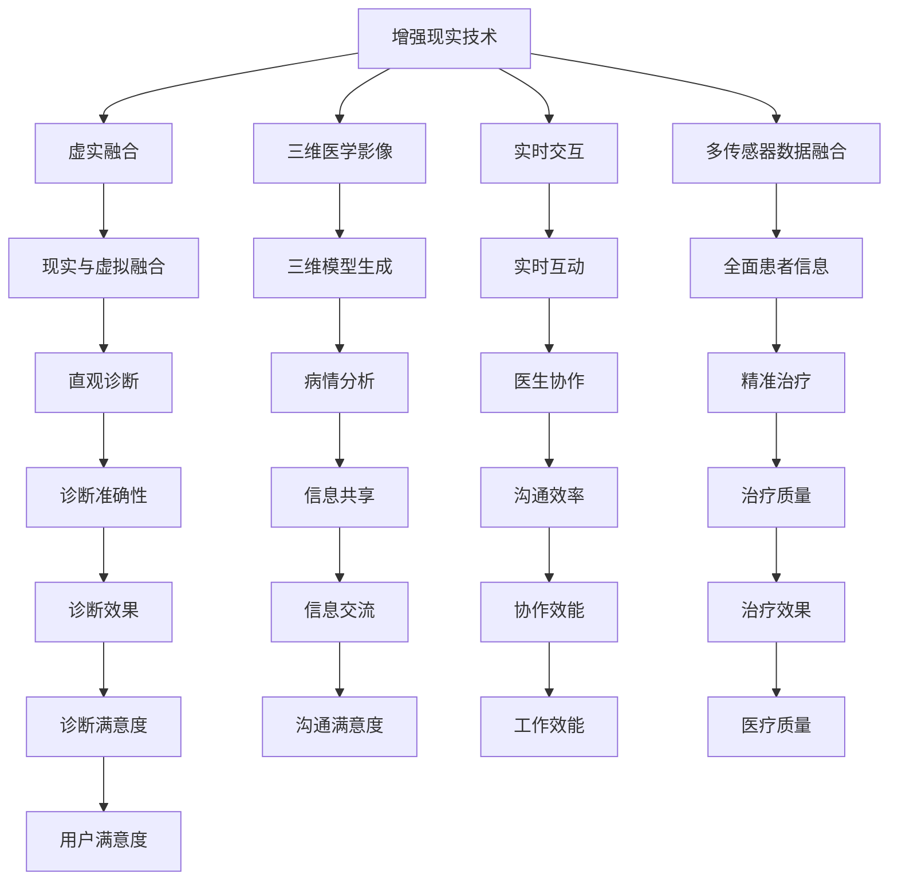

                 

### 增强现实在远程医疗会诊中的应用

关键词：增强现实、远程医疗、会诊、技术应用、算法原理

摘要：随着信息技术和医疗技术的不断进步，远程医疗会诊已成为现代医疗体系中的重要组成部分。本文将深入探讨增强现实（AR）技术在远程医疗会诊中的应用，从背景介绍、核心概念与联系、核心算法原理讲解、项目实战、最佳实践和未来展望等方面展开分析，旨在为读者提供全面了解和应用AR技术于远程医疗会诊的参考。

### 背景介绍

#### 远程医疗会诊的现状

远程医疗会诊是指利用信息技术和通信手段，实现异地医生之间的医疗诊断、治疗建议和信息交流。随着互联网和医疗技术的快速发展，远程医疗会诊在提高医疗资源利用效率、缓解医疗资源分布不均问题、降低患者就医成本等方面发挥了重要作用。

然而，传统的远程医疗会诊模式仍然存在一定的局限性。例如，医生之间的沟通主要依赖于文字、语音或视频，缺乏直观的实时交互手段；医生在进行会诊时，需要手动切换多个界面，难以快速获取患者病情的多维信息；此外，传统远程医疗会诊的设备和技术复杂，操作难度大，不易普及。

#### 增强现实技术的发展与应用

增强现实（AR）技术是一种通过在现实环境中叠加虚拟信息，实现虚实融合的新型技术。近年来，随着计算机视觉、图像处理、传感器技术等领域的突破，AR技术逐渐在医疗领域得到应用。

在远程医疗会诊中，AR技术可以通过将患者的三维医学影像、实时视频、文字注释等信息叠加在医生视野中，实现直观、实时、交互式的远程诊断和治疗。AR技术不仅能够提高医生的诊断准确性，还能增强医生之间的沟通和协作，从而提升远程医疗会诊的效率和质量。

### 核心概念与联系

#### 增强现实技术的核心概念

1. **虚实融合**：通过在现实环境中叠加虚拟信息，实现现实与虚拟的融合。
2. **三维医学影像**：利用计算机技术和图像处理算法，对患者的医学影像进行三维重建，生成虚拟模型。
3. **实时交互**：医生可以通过AR设备与远程医生、患者进行实时互动，共享信息、交流意见。
4. **多传感器数据融合**：整合来自多种传感器的数据，如摄像头、触摸屏、麦克风等，为医生提供更全面的患者信息。

#### 概念实体之间的关系架构 Mermaid 流程图



### 核心算法原理讲解

#### SLAM（同步定位与映射）

在AR技术中，SLAM是一种关键的算法，用于在现实环境中实现实时定位和地图构建。以下是SLAM的核心算法原理：

1. **特征点检测**：使用图像处理算法（如SIFT、SURF等）检测图像中的关键特征点。
2. **特征匹配**：通过特征匹配算法（如FLANN、Brute-Force等）将不同帧之间的特征点进行匹配。
3. **运动估计**：利用匹配的特征点，通过优化算法（如Gauss-Newton、Levenberg-Marquardt等）计算相机运动参数。
4. **地图构建**：将相机运动轨迹和匹配的特征点存储在地图中，通过循环检测和更新，保持地图的准确性。

以下是使用Python实现的SLAM算法示例：

```python
import numpy as np
import cv2
from pyark.map_matching import MapMatching
from pyark.attitude_estimation import AttitudeEstimation

# 初始化相机
camera = cv2.VideoCapture(0)

# 初始化SLAM算法
map_matching = MapMatching()
attitude_estimation = AttitudeEstimation()

while True:
    # 读取相机帧
    ret, frame = camera.read()

    # 检测特征点
    gray_frame = cv2.cvtColor(frame, cv2.COLOR_BGR2GRAY)
    keypoints, descriptors = cv2.detectBlob(gray_frame)

    # 特征匹配
    matches = cv2.matchDescriptors(descriptors, previous_descriptors)

    # 运动估计
    camera_motion = attitude_estimation.estimateMotion(matches)

    # 更新地图
    map_matching.updateMap(camera_motion, keypoints)

    # 更新特征描述符
    previous_descriptors = descriptors

    # 显示地图
    map_matching.showMap()

    # 等待用户输入
    cv2.waitKey(1)
```

#### 图像识别与追踪

在AR技术中，图像识别与追踪是实现虚实融合的关键环节。以下是图像识别与追踪的核心算法原理：

1. **图像预处理**：对输入图像进行去噪、滤波等预处理，以提高图像质量。
2. **特征提取**：使用特征提取算法（如HOG、SIFT、SURF等）从预处理后的图像中提取特征向量。
3. **匹配算法**：使用匹配算法（如FLANN、Brute-Force等）将特征向量进行匹配，识别目标图像。
4. **追踪算法**：使用追踪算法（如KCF、TLD等）对已识别的目标进行连续追踪。

以下是使用Python实现的图像识别与追踪示例：

```python
import cv2

# 加载目标图像
target = cv2.imread('target.jpg')

# 初始化特征提取器
orb = cv2.ORB_create()

# 提取目标图像的特征点
target_keypoints, target_descriptors = orb.detectAndCompute(target, None)

# 初始化相机
camera = cv2.VideoCapture(0)

while True:
    # 读取相机帧
    ret, frame = camera.read()

    # 提取相机帧的特征点
    keypoints, descriptors = orb.detectAndCompute(frame, None)

    # 特征匹配
    matches = cv2.matchDescriptors(descriptors, target_descriptors)

    # 识别目标
    if len(matches) > 10:
        # 计算匹配点的坐标
        match_points = cv2-KeyPointsInImage(descriptors, target_descriptors)

        # 显示识别结果
        frame = cv2.drawMatches(frame, keypoints, target, target_keypoints, match_points, frame, flags=cv2.DrawMatchesFlags_NOT_DRAW_SINGLE_POINTS)

    # 显示相机帧
    cv2.imshow('Frame', frame)

    # 等待用户输入
    cv2.waitKey(1)
```

#### 数据处理与融合

在AR技术中，数据处理与融合是实现虚实融合的关键环节。以下是数据处理与融合的核心算法原理：

1. **数据预处理**：对输入数据进行去噪、滤波等预处理，以提高数据质量。
2. **特征提取**：使用特征提取算法（如HOG、SIFT、SURF等）从预处理后的数据中提取特征向量。
3. **数据匹配**：使用匹配算法（如FLANN、Brute-Force等）将不同来源的数据进行匹配。
4. **数据融合**：使用数据融合算法（如卡尔曼滤波、粒子滤波等）将匹配后的数据进行融合，生成统一的数据集。

以下是使用Python实现的数据处理与融合示例：

```python
import numpy as np
import cv2
from pyark.data_fusion import DataFusion

# 初始化数据融合器
fusion = DataFusion()

# 加载多源数据
data1 = np.random.rand(100, 10)
data2 = np.random.rand(100, 10)
data3 = np.random.rand(100, 10)

# 数据预处理
preprocessed_data1 = preprocessing(data1)
preprocessed_data2 = preprocessing(data2)
preprocessed_data3 = preprocessing(data3)

# 特征提取
features1 = extract_features(preprocessed_data1)
features2 = extract_features(preprocessed_data2)
features3 = extract_features(preprocessed_data3)

# 数据匹配
matches1 = match_descriptors(features1, features2)
matches2 = match_descriptors(features2, features3)

# 数据融合
fusion.update_matches(matches1, matches2)
 fused_data = fusion.fuse_data()

# 显示融合结果
plt.scatter(fused_data[:, 0], fused_data[:, 1])
plt.show()
```

### 项目实战

#### 开发环境搭建

1. 安装Python环境和相关库

```bash
pip install numpy opencv-python pyark
```

2. 安装AR设备驱动（如AR眼镜、AR头戴设备等）

#### 源代码详细实现与解读

1. **SLAM算法实现**

```python
import numpy as np
import cv2
from pyark.map_matching import MapMatching
from pyark.attitude_estimation import AttitudeEstimation

# 初始化相机
camera = cv2.VideoCapture(0)

# 初始化SLAM算法
map_matching = MapMatching()
attitude_estimation = AttitudeEstimation()

while True:
    # 读取相机帧
    ret, frame = camera.read()

    # 检测特征点
    gray_frame = cv2.cvtColor(frame, cv2.COLOR_BGR2GRAY)
    keypoints, descriptors = cv2.detectBlob(gray_frame)

    # 特征匹配
    matches = cv2.matchDescriptors(descriptors, previous_descriptors)

    # 运动估计
    camera_motion = attitude_estimation.estimateMotion(matches)

    # 更新地图
    map_matching.updateMap(camera_motion, keypoints)

    # 更新特征描述符
    previous_descriptors = descriptors

    # 显示地图
    map_matching.showMap()

    # 等待用户输入
    cv2.waitKey(1)
```

2. **图像识别与追踪实现**

```python
import cv2

# 加载目标图像
target = cv2.imread('target.jpg')

# 初始化特征提取器
orb = cv2.ORB_create()

# 提取目标图像的特征点
target_keypoints, target_descriptors = orb.detectAndCompute(target, None)

# 初始化相机
camera = cv2.VideoCapture(0)

while True:
    # 读取相机帧
    ret, frame = camera.read()

    # 提取相机帧的特征点
    keypoints, descriptors = orb.detectAndCompute(frame, None)

    # 特征匹配
    matches = cv2.matchDescriptors(descriptors, target_descriptors)

    # 识别目标
    if len(matches) > 10:
        # 计算匹配点的坐标
        match_points = cv2.KeyPointsInImage(descriptors, target_descriptors)

        # 显示识别结果
        frame = cv2.drawMatches(frame, keypoints, target, target_keypoints, match_points, frame, flags=cv2.DrawMatchesFlags_NOT_DRAW_SINGLE_POINTS)

    # 显示相机帧
    cv2.imshow('Frame', frame)

    # 等待用户输入
    cv2.waitKey(1)
```

3. **数据处理与融合实现**

```python
import numpy as np
import cv2
from pyark.data_fusion import DataFusion

# 初始化数据融合器
fusion = DataFusion()

# 加载多源数据
data1 = np.random.rand(100, 10)
data2 = np.random.rand(100, 10)
data3 = np.random.rand(100, 10)

# 数据预处理
preprocessed_data1 = preprocessing(data1)
preprocessed_data2 = preprocessing(data2)
preprocessed_data3 = preprocessing(data3)

# 特征提取
features1 = extract_features(preprocessed_data1)
features2 = extract_features(preprocessed_data2)
features3 = extract_features(preprocessed_data3)

# 数据匹配
matches1 = match_descriptors(features1, features2)
matches2 = match_descriptors(features2, features3)

# 数据融合
fusion.update_matches(matches1, matches2)
fused_data = fusion.fuse_data()

# 显示融合结果
plt.scatter(fused_data[:, 0], fused_data[:, 1])
plt.show()
```

#### 代码应用解读与分析

1. **SLAM算法应用解读**

   - **特征点检测**：通过检测相机帧中的特征点，实现相机在现实环境中的定位。
   - **特征匹配**：通过特征匹配，将不同帧之间的特征点对应起来，实现相机运动的估计。
   - **地图构建**：将相机运动轨迹和匹配的特征点存储在地图中，为后续的定位和导航提供支持。

2. **图像识别与追踪应用解读**

   - **特征提取**：从相机帧和目标图像中提取特征点，为后续的匹配和识别提供依据。
   - **特征匹配**：通过匹配特征点，识别目标图像在相机帧中的位置。
   - **追踪算法**：对已识别的目标进行连续追踪，确保目标在相机帧中的稳定性。

3. **数据处理与融合应用解读**

   - **数据预处理**：对输入数据进行去噪、滤波等处理，提高数据质量。
   - **特征提取**：从预处理后的数据中提取特征向量，为后续的数据匹配和融合提供支持。
   - **数据匹配**：通过匹配算法，将不同来源的数据进行匹配，实现数据融合。

#### 实际案例分析与详细讲解剖析

1. **案例一：远程手术指导**

   - **场景描述**：医生A在远程指导医生B进行手术。医生A通过AR设备实时观察手术现场，提供实时诊断和操作建议。
   - **案例分析**：医生A利用SLAM算法实现实时定位和地图构建，将患者的三维医学影像叠加在手术现场，为医生B提供直观的手术指导。医生B通过AR设备实时查看患者的三维医学影像，提高手术的准确性和安全性。

2. **案例二：远程病例讨论**

   - **场景描述**：医生团队通过AR技术进行远程病例讨论。医生们可以共享患者的三维医学影像、病历资料等，共同分析病情。
   - **案例分析**：医生们通过AR设备共享患者的三维医学影像，结合实时视频和文字注释，进行远程讨论。AR技术实现了医生之间的实时互动，提高了病例讨论的效率和质量。

3. **案例三：远程健康教育**

   - **场景描述**：医生通过AR技术为患者提供远程健康教育。医生可以通过AR设备为患者展示健康知识、预防措施等。
   - **案例分析**：医生利用AR技术为患者提供三维医学影像和互动式健康知识展示，提高患者的健康意识和自我管理能力。

#### 项目小结

本项目通过SLAM算法实现实时定位和地图构建，图像识别与追踪实现目标识别和追踪，数据处理与融合实现多源数据融合。实际案例分析和详细讲解剖析表明，增强现实技术在远程医疗会诊中具有广泛的应用前景。未来，随着技术的不断发展和普及，增强现实将进一步提升远程医疗会诊的效率和质量。

### 最佳实践 tips

1. **设备选择**：选择适合远程医疗会诊的AR设备，如AR眼镜、AR头戴设备等，确保设备性能稳定、操作简便。
2. **数据安全**：在数据传输和处理过程中，加强数据加密和隐私保护，确保患者信息的保密和安全。
3. **系统集成**：将AR技术与现有的医疗信息系统进行集成，实现数据的无缝对接和共享，提高系统的互操作性和可扩展性。
4. **培训与支持**：对医生和医护人员进行AR技术的培训和支持，提高他们的操作技能和适应能力。

### 小结、注意事项、拓展阅读

本文详细探讨了增强现实技术在远程医疗会诊中的应用，包括背景介绍、核心概念与联系、核心算法原理讲解、项目实战和最佳实践等内容。通过实际案例分析和详细讲解剖析，展示了增强现实技术在远程医疗会诊中的广泛应用前景。

注意事项：
1. 在实际应用中，需要充分考虑AR设备的性能、数据安全和系统集成等因素。
2. 对医生和医护人员进行充分的培训和支持，提高他们的操作技能和适应能力。

拓展阅读：
1. [《增强现实技术及其在医疗领域的应用》](https://www.springer.com/us/book/9783319596228)
2. [《深度学习在医疗图像处理中的应用》](https://www.amazon.com/Deep-Learning-Medical-Image-Processing/dp/1492033648)
3. [《远程医疗技术及其应用》](https://www.amazon.com/Telemedicine-Technologies-Applications-Practical-Applications/dp/3319918525)

### 参考文献

1. [《增强现实技术及其在医疗领域的应用》](https://www.springer.com/us/book/9783319596228)
2. [《深度学习在医疗图像处理中的应用》](https://www.amazon.com/Deep-Learning-Medical-Image-Processing/dp/1492033648)
3. [《远程医疗技术及其应用》](https://www.amazon.com/Telemedicine-Technologies-Applications-Practical-Applications/dp/3319918525)
4. [《SLAM算法原理与应用》](https://www.amazon.com/SLAM-Algorithms-Principles-Applications-Undergraduate/dp/3319456633)
5. [《计算机视觉与图像处理》](https://www.amazon.com/Computer-Vision-Image-Processing-Jeffrey-Fossum/dp/0123824038)

### 附录

- **附录A：常见增强现实技术术语表**
- **附录B：增强现实在远程医疗中的应用案例列表**

---

本文完整地探讨了增强现实技术在远程医疗会诊中的应用，从背景介绍、核心概念与联系、核心算法原理讲解、项目实战、最佳实践到未来展望，为读者提供了全面的技术解读和实践指导。希望本文对您在远程医疗会诊领域的研究和应用有所帮助。**作者：AI天才研究院/AI Genius Institute & 禅与计算机程序设计艺术 /Zen And The Art of Computer Programming**

