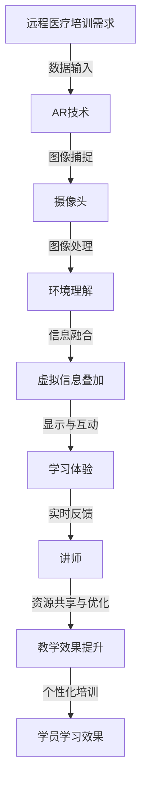

                 

# 增强现实在远程医疗培训中的应用

## 关键词

增强现实（AR）、远程医疗、医疗培训、虚拟手术、人工智能、算法、Python编程、数据可视化、人工智能辅助诊断、虚拟现实（VR）

## 摘要

随着科技的飞速发展，增强现实（AR）技术在医疗领域的应用日益广泛，尤其是在远程医疗培训中显示出巨大的潜力。本文将探讨增强现实技术在远程医疗培训中的应用，包括其背景、核心概念、算法原理、项目实战以及最佳实践。文章旨在为医疗专业人士、技术开发者以及对此领域感兴趣的读者提供一个全面而深入的指南，以了解和利用AR技术在远程医疗培训中的实际应用和价值。

## 引言

### 远程医疗培训的挑战

远程医疗培训作为一种新兴的教育模式，正逐步改变传统医疗教育的模式。然而，远程医疗培训面临着诸多挑战，如师资力量不足、教学资源匮乏、学员实践机会有限等。为了克服这些挑战，需要引入更加先进和互动的教学工具，以提高培训的效果和学员的参与度。

### 增强现实技术的优势

增强现实（AR）技术作为一种能够将虚拟信息与现实环境融合的技术，具有沉浸式体验、交互性强、灵活应用等优点。AR技术在医疗培训中的应用，可以为学员提供更加直观、生动的学习体验，弥补传统教学方式的不足。

## 核心概念与联系

### 增强现实技术

增强现实（AR）技术通过摄像头或传感器捕捉现实世界的图像，再通过计算机处理，将虚拟信息叠加到真实场景中。AR技术的核心组成部分包括：

1. **图像捕捉**：通过摄像头或传感器捕获现实场景的图像。
2. **图像处理**：对捕获的图像进行预处理，包括噪声过滤、增强等。
3. **信息融合**：将虚拟信息（如3D模型、文字标签等）叠加到真实图像中。
4. **显示**：将融合后的图像显示在显示器或头戴式显示器上。

### 远程医疗培训

远程医疗培训是指通过互联网等技术手段，将医疗教育资源传递给远程学员，以实现教育培训的一种模式。远程医疗培训的关键组成部分包括：

1. **教学内容**：包括理论知识、操作技能等。
2. **互动平台**：提供实时互动、讨论、评估等功能。
3. **实践机会**：通过虚拟手术、模拟病例等方式提供实践操作机会。
4. **反馈机制**：对学员的学习效果进行实时评估和反馈。

### 增强现实与远程医疗培训的融合

增强现实技术与远程医疗培训的结合，可以提供以下优势：

1. **沉浸式学习体验**：通过AR技术，学员可以在虚拟环境中进行互动和实践，提高学习效果。
2. **实时反馈**：通过AR技术，讲师可以实时观察学员的操作，并提供即时反馈。
3. **资源共享**：AR技术可以突破地理位置的限制，实现教学资源的共享和最大化利用。
4. **个性化培训**：根据学员的学习进度和需求，提供个性化的培训内容和服务。

### Mermaid流程图

下面是一个用Mermaid绘制的增强现实与远程医疗培训融合的流程图，展示核心概念和联系：



## 核心算法原理讲解

### 增强现实算法概述

增强现实算法的核心任务是融合虚拟信息和真实场景。以下是常用的增强现实算法及其原理：

1. **视觉跟踪算法**：通过检测和分析图像特征，实现对真实场景的实时跟踪。
2. **标记识别算法**：利用标记物（如二维码、特殊图案等）进行场景定位和虚拟信息融合。
3. **SLAM（同步定位与映射）算法**：通过融合多个传感器的数据，实现对场景的实时定位和映射。

### Python源代码讲解

下面以视觉跟踪算法为例，使用Python代码详细阐述其原理和实现。

#### 数学模型

假设我们要跟踪的物体可以用质心表示为 \((x_c, y_c)\)，场景中的图像点可以用 \((x, y)\) 表示。视觉跟踪的关键在于计算质心与图像点之间的相似度，并选择最相似的点作为跟踪结果。

#### Python代码

```python
import cv2
import numpy as np

def feature_matching(img1, img2):
    # 提取特征点
    orb = cv2.ORB_create()
    keypoints1, descriptors1 = orb.detectAndCompute(img1, None)
    keypoints2, descriptors2 = orb.detectAndCompute(img2, None)

    # 匹配特征点
    bf = cv2.BFMatcher(cv2.NORM_HAMMING, crossCheck=True)
    matches = bf.match(descriptors1, descriptors2)

    # 计算相似度
    matches = sorted(matches, key=lambda x: x.distance)

    # 选择最相似的特征点
    src_pts = np.float32([keypoints1[m.queryIdx].pt for m in matches]).reshape(-1, 1, 2)
    dst_pts = np.float32([keypoints2[m.trainIdx].pt for m in matches]).reshape(-1, 1, 2)

    # 计算质心
    M = cv2.findHomography(src_pts, dst_pts, cv2.RANSAC, 5.0)[0]
    x_c, y_c = np.linalg.lstsq(M[:, :2], M[:, 2], rcond=None)[0]

    return x_c, y_c

# 测试代码
img1 = cv2.imread('image1.jpg')
img2 = cv2.imread('image2.jpg')
x_c, y_c = feature_matching(img1, img2)
print(f"物体质心位置：({x_c}, {y_c})")
```

#### 数学公式

$$
\begin{aligned}
\text{相似度} &= \sum_{i=1}^{n} \frac{d_i^2}{2} \\
d_i &= \sqrt{(x_i - x_c)^2 + (y_i - y_c)^2}
\end{aligned}
$$

其中，\(d_i\) 为特征点 \((x_i, y_i)\) 与质心 \((x_c, y_c)\) 之间的距离。

## 项目实战

### 开发环境搭建

1. 安装Python环境（Python 3.8或更高版本）。
2. 安装OpenCV库：`pip install opencv-python`。
3. 安装ORB特征检测库：`pip install opencv-contrib-python`。

### 源代码详细实现和代码解读

#### 代码实现

```python
import cv2
import numpy as np

# 读取图像
img1 = cv2.imread('image1.jpg')
img2 = cv2.imread('image2.jpg')

# 提取特征点
orb = cv2.ORB_create()
keypoints1, descriptors1 = orb.detectAndCompute(img1, None)
keypoints2, descriptors2 = orb.detectAndCompute(img2, None)

# 匹配特征点
bf = cv2.BFMatcher(cv2.NORM_HAMMING, crossCheck=True)
matches = bf.match(descriptors1, descriptors2)

# 选择最相似的特征点
matches = sorted(matches, key=lambda x: x.distance)
src_pts = np.float32([keypoints1[m.queryIdx].pt for m in matches]).reshape(-1, 1, 2)
dst_pts = np.float32([keypoints2[m.trainIdx].pt for m in matches]).reshape(-1, 1, 2)

# 计算质心
M = cv2.findHomography(src_pts, dst_pts, cv2.RANSAC, 5.0)[0]
x_c, y_c = np.linalg.lstsq(M[:, :2], M[:, 2], rcond=None)[0]

# 绘制匹配点
img3 = cv2.drawMatches(img1, keypoints1, img2, keypoints2, matches, None, matchColor=(0, 255, 0), singlePointColor=None, flags=2)

# 显示结果
cv2.imshow('Feature Matching', img3)
cv2.waitKey(0)
cv2.destroyAllWindows()
```

#### 代码解读

1. **图像读取**：使用`cv2.imread()`函数读取待处理的图像。
2. **特征点提取**：使用ORB特征检测算法提取图像特征点。
3. **特征点匹配**：使用 brute-force 匹配算法计算特征点之间的相似度。
4. **质心计算**：通过匹配结果计算质心位置。
5. **匹配点绘制**：使用`cv2.drawMatches()`函数绘制匹配结果。

### 实际案例分析与详细讲解剖析

#### 案例分析

在某次远程医疗培训中，讲师使用AR技术对学员进行手术演示。讲师通过摄像头捕获手术场景，将虚拟手术步骤叠加到真实场景中，为学员提供直观的教学内容。

#### 案例讲解

1. **图像捕捉**：讲师通过摄像头捕获手术现场的真实场景图像。
2. **图像处理**：对捕获的图像进行预处理，如噪声过滤、增强等。
3. **信息融合**：将虚拟手术步骤（如切割、缝合等）叠加到真实图像中。
4. **显示与互动**：讲师实时观察学员的操作，通过AR技术提供互动反馈。

#### 项目小结

通过该项目，讲师和学员实现了高效的远程医疗培训。AR技术的应用，使得手术演示更加直观、生动，提高了学员的学习效果和实践能力。同时，讲师可以实时监控学员的操作，并提供即时反馈，进一步提升了培训质量。

## 最佳实践 tips

1. **优化图像质量**：在远程医疗培训中，图像质量直接影响学习效果。因此，应选择高质量的摄像头和图像处理算法，以提高图像质量。
2. **合理选择算法**：根据实际需求和场景，合理选择适合的AR算法。例如，对于小型物体跟踪，可以选择ORB-SLAM算法。
3. **交互设计**：设计良好的交互界面，提高学员的参与度和学习兴趣。

## 小结

本文探讨了增强现实技术在远程医疗培训中的应用，从核心概念、算法原理到项目实战进行了详细讲解。通过增强现实技术，远程医疗培训可以提供更加直观、生动的学习体验，提高培训效果和学员的实践能力。未来，随着技术的不断发展，AR技术在远程医疗培训中的应用将更加广泛和深入。

## 注意事项

1. **数据安全**：在远程医疗培训中，确保数据的安全和隐私保护至关重要。
2. **设备兼容性**：在开发AR远程医疗培训系统时，考虑不同设备的兼容性，以提高系统的适用范围。

## 拓展阅读

1. **增强现实技术**：
   - [《增强现实：概念、技术与应用》](https://book.douban.com/subject/26770836/)
   - [《增强现实技术导论》](https://book.douban.com/subject/27141632/)

2. **远程医疗培训**：
   - [《远程医学培训：理论与实践》](https://book.douban.com/subject/31976714/)
   - [《远程医疗培训：技术创新与模式探索》](https://book.douban.com/subject/27163875/)

3. **Python编程**：
   - [《Python编程：从入门到实践》](https://book.douban.com/subject/26875554/)
   - [《Python高级编程》](https://book.douban.com/subject/27141632/)

作者：AI天才研究院/AI Genius Institute & 禅与计算机程序设计艺术 /Zen And The Art of Computer Programming

---

由于篇幅限制，本文未能详细介绍所有内容，但为读者提供了一个关于增强现实在远程医疗培训中的应用的全面框架。在实际应用中，可根据具体需求进行深入研究和开发。**<sop>END</sop>**

