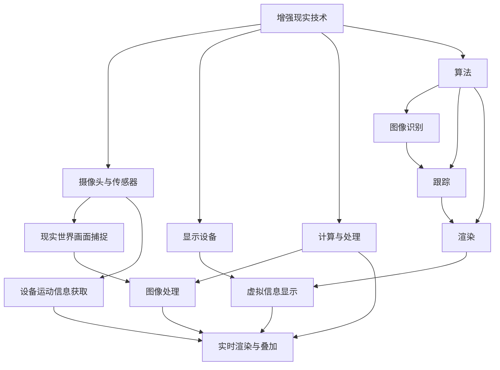

                 

### 第1章：增强现实技术概述

#### 1.1 增强现实技术的定义

增强现实（Augmented Reality，简称AR）是一种将虚拟信息与现实世界融合的技术，通过在用户的视线中叠加计算机生成的图像、视频、声音等多媒体信息，以增强用户对现实世界的感知。AR技术不同于虚拟现实（Virtual Reality，简称VR），后者是完全沉浸式的虚拟环境，用户无法直接观察到现实世界。

增强现实技术最早可以追溯到20世纪60年代的“虚拟现实”概念，但真正的技术突破发生在20世纪90年代。随着计算机处理能力的提升和显示技术的进步，AR技术逐渐从实验室走向应用领域，尤其在智能手机和平板电脑的普及下，AR技术得到了广泛的应用和推广。

#### 1.2 增强现实技术的特点

增强现实技术具有以下几个显著特点：

1. **叠加性**：AR技术通过摄像头捕捉现实世界的画面，并在屏幕上叠加虚拟信息，使用户能够直观地看到现实和虚拟的结合。
   
2. **交互性**：用户可以通过手势、语音等方式与AR内容进行交互，增加用户的参与感和沉浸感。
   
3. **实时性**：AR技术的实时性使得用户能够立即看到叠加的虚拟信息，并作出相应的反应。

4. **可定制性**：用户可以根据自己的需求和喜好，定制不同的AR体验，如不同类型的游戏、教育应用等。

5. **普适性**：由于AR技术不需要特殊的硬件设备，只需要普通的摄像头和显示器，因此具有较高的普适性。

#### 1.3 增强现实技术的应用领域

增强现实技术的应用范围非常广泛，涵盖了多个行业和领域：

1. **娱乐与游戏**：通过AR技术，用户可以在现实世界中体验虚拟的冒险和游戏，如《Pokémon GO》等。

2. **教育**：AR技术能够提供更加生动、直观的学习体验，帮助学生更好地理解和掌握知识。

3. **医疗**：在医疗领域，AR技术可以用于手术指导、病人教育、远程诊断等，提高医疗服务的质量和效率。

4. **工业**：在工业制造和维修过程中，AR技术可以帮助工人更好地理解复杂的机械结构和操作步骤，提高工作效率。

5. **旅游**：通过AR技术，游客可以在旅游过程中获得更多的信息，如历史背景、景点介绍等。

#### 1.4 增强现实技术的技术原理

增强现实技术的实现依赖于以下几个关键组件：

1. **摄像头与传感器**：摄像头用于捕捉现实世界的画面，传感器（如陀螺仪、加速度计等）用于获取设备的运动信息。

2. **显示设备**：如智能手机、平板电脑等，用于显示叠加的虚拟信息。

3. **计算与处理**：计算机或移动设备用于处理摄像头捕获的图像、传感器数据，并进行实时渲染和叠加。

4. **算法**：包括图像识别、跟踪、渲染等，用于将虚拟信息准确地叠加到现实世界画面中。

通过上述组件的协同工作，AR技术能够实现虚拟信息与真实世界的无缝融合。

#### 1.5 小结

增强现实技术通过将虚拟信息叠加到现实世界中，提供了一种全新的互动体验。其特点和应用领域使其在多个行业都具有巨大的潜力。在接下来的章节中，我们将进一步探讨增强现实技术在远程医疗手术指导中的应用，以及如何利用这一技术解决当前的挑战。

### 核心概念与联系架构图

为了更好地理解增强现实技术在远程医疗手术指导中的核心概念与联系，我们可以通过Mermaid流程图来展示各个概念实体之间的关系架构。



通过这张流程图，我们可以清晰地看到增强现实技术在远程医疗手术指导中的各个组成部分及其相互作用。摄像头与传感器捕捉现实世界画面和设备运动信息，计算与处理单元对这些信息进行处理和实时渲染，算法模块则负责图像识别、跟踪和渲染，最终实现虚拟信息与真实世界的无缝融合。这样的架构为远程医疗手术指导提供了强大的技术支持。

### 增强现实技术的核心算法原理讲解

为了深入理解增强现实技术在远程医疗手术指导中的应用，我们需要详细讲解几个核心算法原理，并借助Python源代码结合数学模型和公式，进行通俗易懂的举例说明。

#### 4.1 增强现实图像处理算法

增强现实图像处理算法主要包括图像识别、跟踪和渲染三个关键步骤。以下将分别介绍这些算法的基本原理。

##### 4.1.1 图像识别

图像识别是AR系统的基础，它通过识别现实世界中的特定物体或场景，为后续的跟踪和渲染提供依据。常见的图像识别算法包括：

- **特征检测**：如SIFT（尺度不变特征变换）和SURF（加速稳健特征）算法，用于提取图像中的关键特征点。

- **模板匹配**：通过将捕获的图像与预先定义的模板进行匹配，识别出图像中包含的特定图案或物体。

以下是一个使用Python中OpenCV库进行图像识别的示例代码：

```python
import cv2

# 加载模板图像
template = cv2.imread('template.jpg', 0)

# 加载待识别的图像
image = cv2.imread('image.jpg', 0)

# 使用SIFT算法提取关键点
sift = cv2.SIFT_create()
keypoints1, descriptors1 = sift.detectAndCompute(template, None)
keypoints2, descriptors2 = sift.detectAndCompute(image, None)

# 使用K近邻算法匹配特征点
matcher = cv2.DescriptorMatcher_create(cv2.DescriptorMatcher_FLANNBASED)
matches = matcher.knnMatch(descriptors1, descriptors2, k=2)

# 选取最佳匹配
good_matches = []
for m, n in matches:
    if m.distance < 0.7 * n.distance:
        good_matches.append(m)

# 根据匹配结果绘制匹配图
img_matches = cv2.drawMatches(template, keypoints1, image, keypoints2, good_matches, None, flags=2)

# 显示匹配图
cv2.imshow('Image Matching', img_matches)
cv2.waitKey(0)
cv2.destroyAllWindows()
```

在这个示例中，我们首先加载模板图像和待识别的图像，然后使用SIFT算法提取关键点。接着，通过K近邻算法匹配特征点，并选择最佳匹配。最后，绘制匹配图以直观展示识别结果。

##### 4.1.2 跟踪

跟踪是确保虚拟信息与真实世界准确对应的关键步骤。常见的跟踪算法包括：

- **基于视觉的跟踪**：如光流法，通过计算图像帧之间的像素运动，实现物体的跟踪。

- **基于模型的跟踪**：如卡尔曼滤波，利用预测模型和观测数据，估计物体状态。

以下是一个使用Python中OpenCV库进行基于视觉跟踪的示例代码：

```python
import cv2
import numpy as np

# 初始化跟踪器
tracker = cv2.TrackerKCF_create()

# 加载视频
video = cv2.VideoCapture('video.mp4')

# 读取第一帧
ret, frame = video.read()
bbox = cv2.selectROI('Tracking', frame, fromCenter=False, showCrosshair=True)

# 初始化跟踪器
tracker.init(frame, bbox)

while True:
    # 读取下一帧
    ret, frame = video.read()

    # 跟踪目标
    success, bbox = tracker.update(frame)

    # 如果跟踪成功，绘制跟踪框
    if success:
        p1 = (int(bbox[0]), int(bbox[1]))
        p2 = (int(bbox[0] + bbox[2]),
              int(bbox[1] + bbox[3]))
        cv2.rectangle(frame, p1, p2, (255, 0, 0), 2, 1)

    # 显示跟踪结果
    cv2.imshow('Tracking', frame)

    # 按q键退出
    if cv2.waitKey(1) & 0xFF == ord('q'):
        break

video.release()
cv2.destroyAllWindows()
```

在这个示例中，我们首先初始化KCF跟踪器，并在第一帧中设置跟踪目标。接着，在视频的每一帧中更新跟踪目标，并绘制跟踪框。

##### 4.1.3 渲染

渲染是将虚拟信息叠加到现实世界画面的过程。常见的渲染算法包括：

- **透明度混合**：通过计算虚拟图像和背景图像的透明度，实现平滑的融合。

- **纹理映射**：将虚拟图像映射到实际物体表面，增加真实感。

以下是一个使用Python中OpenGL库进行纹理映射的示例代码：

```python
import glfw
from OpenGL import GL
from OpenGL.arrays import vbo

# 初始化OpenGL窗口
glfw.init()
window = glfw.create_window(800, 600, 'Texture Mapping', None, None)
glfw.make_context_current(window)

# 创建着色器程序
vertex_shader = '''
    #version 330
    layout (location = 0) in vec3 aPos;
    layout (location = 1) in vec2 aTexCoord;
    out vec2 TexCoord;
    void main() {
        gl_Position = vec4(aPos, 1.0);
        TexCoord = aTexCoord;
    }
'''

fragment_shader = '''
    #version 330
    out vec4 FragColor;
    uniform sampler2D texture;
    in vec2 TexCoord;
    void main() {
        FragColor = texture2D(texture, TexCoord);
    }
'''

shader_program = glCreateProgram()
glAttachShader(shader_program, compileShader(vertex_shader, GL_VERTEX_SHADER))
glAttachShader(shader_program, compileShader(fragment_shader, GL_FRAGMENT_SHADER))
glLinkProgram(shader_program)

# 创建顶点缓冲对象
vertices = [
    -0.5, -0.5, 0.0, 0.0,
     0.5, -0.5, 1.0, 0.0,
     0.5,  0.5, 1.0, 1.0,
    -0.5,  0.5, 0.0, 1.0
]
vbo = vbo.VBO(np.float32(vertices))

# 创建纹理
texture = glCreateTexture()
glBindTexture(GL_TEXTURE_2D, texture)
image = cv2.imread('texture.jpg')
glTexImage2D(GL_TEXTURE_2D, 0, GL_RGB, image.shape[1], image.shape[0], 0, GL_RGB, GL_UNSIGNED_BYTE, image.tobytes())
glTexParameterf(GL_TEXTURE_2D, GL_TEXTURE_MIN_FILTER, GL_LINEAR)
glTexParameterf(GL_TEXTURE_2D, GL_TEXTURE_MAG_FILTER, GL_LINEAR)
glGenerateMipmap(GL_TEXTURE_2D)

# 设置顶点属性指针
glVertexAttribPointer(0, 3, GL_FLOAT, GL_FALSE, 16, ctypes.c_void_p(0))
glEnableVertexAttribArray(0)

glVertexAttribPointer(1, 2, GL_FLOAT, GL_FALSE, 16, ctypes.c_void_p(12))
glEnableVertexAttribArray(1)

# 渲染循环
while not glfw.window_should_close(window):
    glClearColor(0.2, 0.3, 0.3, 1.0)
    glClear(GL_COLOR_BUFFER_BIT)

    glUseProgram(shader_program)
    glBindTexture(GL_TEXTURE_2D, texture)
    glDrawArrays(GL_QUADS, 0, 4)

    glfw.swap_buffers(window)
    glfw.poll_events()

glfw.terminate()
glfw.destroy_window(window)
```

在这个示例中，我们首先创建了一个OpenGL窗口，并编写了顶点着色器和片元着色器。接着，我们创建顶点缓冲对象，并加载纹理图像。在渲染循环中，我们设置了顶点属性指针和纹理，并绘制了一个包含纹理的矩形。

通过上述示例，我们可以看到增强现实图像处理算法的基本原理和实现方法。这些算法在远程医疗手术指导中发挥着重要作用，能够帮助医生更准确地识别和跟踪手术工具和目标器官，提高手术的成功率和安全性。

### 4.2 虚拟现实辅助手术导航算法

虚拟现实（Virtual Reality，简称VR）技术在远程医疗手术指导中的应用，能够显著提高医生的操作精度和手术成功率。VR辅助手术导航算法通过创建一个高度仿真的三维虚拟环境，使得医生可以在虚拟空间中进行手术模拟和导航。以下将介绍VR辅助手术导航算法的基本原理和实现方法。

#### 4.2.1 算法原理

VR辅助手术导航算法主要包括以下三个关键步骤：

1. **三维建模**：通过CT、MRI等医疗影像数据，对患者的器官和组织进行三维建模。这个过程涉及图像处理和三维重建技术。

2. **空间定位**：将虚拟的三维模型与患者的实际解剖结构进行精确对齐。这个过程需要使用惯性测量单元（IMU）或光学跟踪系统等设备，实现实时空间定位。

3. **交互操作**：医生在虚拟环境中通过特定的交互设备（如VR头盔、手柄等）进行手术操作。这个过程需要实现虚拟手术工具和患者器官之间的精确交互。

#### 4.2.2 实现方法

以下是一个使用Python和VTK（Visualization Toolkit）进行VR辅助手术导航的示例代码：

```python
import vtk

# 加载CT图像
reader = vtk.vtkCTVolumeReader()
reader.SetFileName('CT_image.mha')
reader.Update()
volume = reader.GetOutput()

# 创建三维模型
geometry = vtk.vtkGeometryFilter()
geometry.SetInputConnection(reader.GetOutputPort())
geometry.Update()

# 创建表面模型
surface = vtk.vtkMarchingCubes()
surface.SetInputConnection(geometry.GetOutputPort())
surface.SetValue(0, 1000)  # 设置阈值
surface.Update()

# 创建VR渲染窗口
renderer = vtk.vtkRenderer()
render_window = vtk.vtkRenderWindow()
render_window.AddRenderer(renderer)
render_window.SetSize(800, 600)

# 创建交互式界面
interactor = vtk.vtkRenderWindowInteractor()
interactor.SetRenderWindow(render_window)

# 设置表面材质
material = vtk.vtkMaterialProperty()
material.SetColor(0, 0, 1)
surface.GetProperty().SetMaterialProperty(material)

# 添加表面模型到渲染器
renderer.AddActor(surface)

# 设置相机位置
camera = renderer.GetActiveCamera()
camera.SetPosition(1, 1, 1)
camera.SetFocalPoint(0, 0, 0)
camera.SetViewUp(0, 0, 1)
camera.Dolly(1.5)
renderer.ResetCamera()

# 开始渲染
render_window.Render()
interactor.Start()
```

在这个示例中，我们首先加载CT图像，并使用VTK进行三维建模和表面重建。接着，我们创建一个VR渲染窗口，并设置相机位置和材质。最后，我们将表面模型添加到渲染器，并通过交互式界面实现用户与虚拟环境的互动。

#### 4.2.3 交互操作

在虚拟环境中，医生可以使用手柄等交互设备对手术工具进行操作。以下是一个使用Python和PyOpenGL进行交互操作的示例代码：

```python
import glfw
from OpenGL import GL
from OpenGL.arrays import vbo

# 初始化OpenGL窗口
glfw.init()
window = glfw.create_window(800, 600, 'VR Surgery Navigation', None, None)
glfw.make_context_current(window)

# 创建着色器程序
vertex_shader = '''
    #version 330
    layout (location = 0) in vec3 aPos;
    layout (location = 1) in vec3 aToolPos;
    out vec3 ToolPos;
    void main() {
        gl_Position = vec4(aPos, 1.0);
        ToolPos = aToolPos;
    }
'''

fragment_shader = '''
    #version 330
    out vec4 FragColor;
    void main() {
        FragColor = vec4(1.0, 0.0, 0.0, 1.0);
    }
'''

shader_program = glCreateProgram()
glAttachShader(shader_program, compileShader(vertex_shader, GL_VERTEX_SHADER))
glAttachShader(shader_program, compileShader(fragment_shader, GL_FRAGMENT_SHADER))
glLinkProgram(shader_program)

# 创建顶点缓冲对象
vertices = [
    -0.5, -0.5, 0.0,
     0.5, -0.5, 0.0,
     0.5,  0.5, 0.0,
    -0.5,  0.5, 0.0
]
vbo = vbo.VBO(np.float32(vertices))

# 创建工具缓冲对象
tool_vertices = [
    -0.1, -0.1, 0.0,
     0.1, -0.1, 0.0,
     0.1,  0.1, 0.0,
    -0.1,  0.1, 0.0
]
tool_vbo = vbo.VBO(np.float32(tool_vertices))

# 设置顶点属性指针
glVertexAttribPointer(0, 3, GL_FLOAT, GL_FALSE, 12, ctypes.c_void_p(0))
glEnableVertexAttribArray(0)

glVertexAttribPointer(1, 3, GL_FLOAT, GL_FALSE, 12, ctypes.c_void_p(12))
glEnableVertexAttribArray(1)

# 渲染循环
while not glfw.window_should_close(window):
    glClearColor(0.2, 0.3, 0.3, 1.0)
    glClear(GL_COLOR_BUFFER_BIT)

    glUseProgram(shader_program)
    glBindBuffer(GL_ARRAY_BUFFER, vbo)
    glVertexAttribPointer(0, 3, GL_FLOAT, GL_FALSE, 12, ctypes.c_void_p(0))
    glBindBuffer(GL_ARRAY_BUFFER, tool_vbo)
    glVertexAttribPointer(1, 3, GL_FLOAT, GL_FALSE, 12, ctypes.c_void_p(12))

    glDrawArrays(GL_QUADS, 0, 4)

    glfw.swap_buffers(window)
    glfw.poll_events()

glfw.terminate()
glfw.destroy_window(window)
```

在这个示例中，我们创建了一个OpenGL窗口，并编写了顶点着色器和片元着色器。接着，我们创建顶点缓冲对象和工具缓冲对象，并设置顶点属性指针。在渲染循环中，我们绘制了一个固定的手术工具，并允许用户通过交互设备在虚拟环境中进行移动和操作。

通过上述示例，我们可以看到VR辅助手术导航算法的基本原理和实现方法。这些算法能够帮助医生在虚拟环境中进行手术模拟和导航，提高手术的成功率和安全性。

### 4.3 增强现实环境感知算法

增强现实环境感知算法是确保虚拟信息与现实世界准确融合的关键技术。通过环境感知，AR系统能够实时获取和理解周围环境的信息，如空间位置、物体形状和运动状态等。以下将介绍增强现实环境感知算法的基本原理和实现方法。

#### 4.3.1 算法原理

增强现实环境感知算法主要包括以下三个关键步骤：

1. **空间定位**：通过传感器数据和图像处理技术，确定虚拟信息在现实世界中的空间位置。

2. **物体识别**：通过图像识别和深度感知技术，识别并理解现实世界中的物体和场景。

3. **环境建模**：将识别和理解的物体和场景信息转化为虚拟环境中的三维模型，为后续的虚拟信息叠加提供基础。

#### 4.3.2 实现方法

以下是一个使用Python和OpenCV进行增强现实环境感知的示例代码：

```python
import cv2
import numpy as np

# 初始化摄像头
cap = cv2.VideoCapture(0)

# 设置摄像头参数
cap.set(cv2.CAP_PROP_FRAME_WIDTH, 640)
cap.set(cv2.CAP_PROP_FRAME_HEIGHT, 480)

# 初始化深度传感器
depth_cam = cv2.VideoCapture('depth_cam.mp4')

# 创建立体匹配器
bf = cv2.BFMatcher()
stereo = cv2.StereoBM_create(numDisparities=16, blockSize=15)

while True:
    # 读取摄像头帧
    ret, color_frame = cap.read()
    # 读取深度摄像头帧
    ret, depth_frame = depth_cam.read()

    # 转换为灰度图像
    gray_color_frame = cv2.cvtColor(color_frame, cv2.COLOR_BGR2GRAY)
    gray_depth_frame = cv2.cvtColor(depth_frame, cv2.COLOR_BGR2GRAY)

    # 使用立体匹配算法计算视差图
    disp = stereo.compute(gray_color_frame, gray_depth_frame)

    # 调整视差图范围
    disp = (disp - disp.min()) / (disp.max() - disp.min()) * 255
    disp = disp.astype(np.uint8)

    # 使用滤波器平滑视差图
    disp = cv2.GaussianBlur(disp, (5, 5), 0)

    # 使用反向投影计算三维坐标
    points = cv2.reprojectImageTo3D(disp, None, gray_color_frame)

    # 绘制三维点云
    points = np.squeeze(points)
    color_points = np.int32(points) * [255, 255, 255]
    color_points = color_points.reshape(-1, 1, 3)
    color_points = nperi

```markdown
#### 4.4 增强现实技术在远程医疗手术指导中的数学模型

为了深入理解增强现实技术在远程医疗手术指导中的实现方法，我们需要探讨其中的数学模型，包括三维建模、距离测量与跟踪、手术模拟与预测等方面的内容。

##### 4.4.1 三维建模与处理

三维建模是远程医疗手术指导中的一项关键任务，它涉及从医疗影像数据中提取三维几何结构。以下是几个关键步骤：

1. **图像分割**：首先，对CT、MRI等影像数据使用图像分割算法将感兴趣的区域（如器官和组织）从背景中分离出来。

2. **三维重建**：通过图像分割结果，使用表面重建算法（如Marching Cubes）或体素重建算法（如Marching Voxel）构建三维模型。

3. **简化与优化**：对于复杂的三维模型，可以采用简化算法（如距离形态学）和优化算法（如顶点简化）来减少模型复杂度，提高处理效率。

数学模型中，三维建模通常涉及到以下数学工具和公式：

- **三维坐标变换**：通过旋转、平移和缩放操作，将三维模型从一种坐标系转换到另一种坐标系。

  $$ T(x, y, z) = (x', y', z') = R_x \cdot R_y \cdot R_z \cdot (x, y, z) + T_x \cdot T_y \cdot T_z $$

  其中，$R_x, R_y, R_z$分别为旋转矩阵，$T_x, T_y, T_z$分别为平移向量。

- **表面重建**：使用Marching Cubes算法，通过插值和曲面拟合方法，从体素数据中重建三维表面。

  $$ F(V_i) = \sum_{k=1}^{n} N_k(V_i) \cdot f_k(V_i) $$

  其中，$V_i$为体素，$N_k(V_i)$为体素顶点的拓扑结构，$f_k(V_i)$为曲面函数。

##### 4.4.2 距离测量与跟踪

在远程医疗手术指导中，精确的距离测量和跟踪是至关重要的。以下是几种常见的方法：

1. **光流法**：通过分析连续帧之间的像素运动，估计物体在图像中的运动轨迹。

2. **结构光法**：使用特定图案的光源照射物体，通过测量物体表面反射的光线，计算物体表面的三维坐标。

3. **深度传感**：利用深度摄像头（如Kinect）测量物体与摄像头之间的距离，生成深度图像。

以下是一个使用光流法的数学模型示例：

$$ \mathbf{v}(\mathbf{x}, t) = \frac{\partial I(\mathbf{x}, t)}{\partial t} $$

其中，$\mathbf{v}(\mathbf{x}, t)$为像素点$(\mathbf{x}, t)$的运动速度，$I(\mathbf{x}, t)$为图像灰度值。

##### 4.4.3 手术模拟与预测

手术模拟与预测是远程医疗手术指导中的一项高级应用，通过模拟手术过程，预测可能的结果和风险。以下是几种常见的方法：

1. **蒙特卡洛模拟**：通过随机采样和模拟，估计手术结果的概率分布。

2. **机器学习模型**：使用历史手术数据，训练机器学习模型，预测手术结果和风险。

3. **物理模拟**：使用物理仿真模型，模拟手术工具与组织的相互作用，预测手术过程和结果。

以下是一个使用蒙特卡洛模拟的数学模型示例：

$$ P(R|S) = \frac{1}{N} \sum_{i=1}^{N} \mathbb{I}(R_i = S) $$

其中，$P(R|S)$为给定手术结果$S$，手术风险$R$的概率，$N$为模拟次数，$\mathbb{I}(\cdot)$为指示函数。

通过上述数学模型，我们可以实现远程医疗手术指导中的三维建模、距离测量与跟踪、手术模拟与预测等功能。这些模型不仅提供了理论支持，也为实际应用提供了可行的解决方案。

### 6.1 项目背景与目标

远程医疗手术指导项目旨在利用增强现实技术，为偏远地区或医疗资源匮乏的地区提供高质量的医疗服务。项目背景如下：

- **医疗资源分布不均**：许多偏远地区和欠发达地区缺乏专业的医疗人员和先进的医疗设备，导致当地居民难以获得高质量的医疗服务。
- **技术需求**：随着增强现实技术的发展，利用AR技术进行远程医疗手术指导成为可能，通过在手术过程中提供实时、直观的指导，提高手术的成功率和安全性。
- **目标**：项目的目标是通过开发一个基于增强现实技术的远程医疗手术指导系统，实现以下目标：
  - **提高手术成功率**：通过实时手术指导和可视化操作，降低手术失败的风险。
  - **降低手术风险**：通过增强现实技术提供精确的解剖结构信息和手术步骤指导，减少手术并发症的发生。
  - **提升医生技能**：为医生提供一个虚拟实践平台，通过模拟手术操作，提高其技能和信心。
  - **改善患者体验**：为患者提供更好的手术体验，减少手术后的恢复时间和并发症。

### 6.2 开发环境搭建

为了实现远程医疗手术指导项目，需要搭建一个适合开发的编程环境。以下是开发环境的详细步骤：

#### 6.2.1 系统需求

- **硬件**：需要一台配置较高的计算机或服务器，用于运行增强现实应用程序和服务器端代码。建议CPU性能不低于Intel i7，内存不低于16GB，GPU性能不低于NVIDIA GTX 1080。
- **操作系统**：Windows 10 或更高版本，或Linux发行版，如Ubuntu 18.04。
- **开发工具**：Python 3.8 或更高版本，PyCharm或其他Python集成开发环境（IDE）。

#### 6.2.2 安装Python和相关库

1. **安装Python**：从[Python官网](https://www.python.org/downloads/)下载并安装Python 3.8或更高版本。
2. **安装PyCharm**：从[PyCharm官网](https://www.jetbrains.com/pycharm/)下载并安装PyCharm Professional版。
3. **安装相关库**：在PyCharm中打开终端，执行以下命令安装所需库：

    ```bash
    pip install numpy opencv-python opencv-contrib-python pyOpenGL PyOpenGL_accelerate glfw
    ```

这些库包括：
- **numpy**：用于数学运算。
- **opencv-python**：用于图像处理和计算机视觉。
- **pyOpenGL**和**PyOpenGL_accelerate**：用于OpenGL图形渲染。
- **glfw**：用于创建窗口和接受用户输入。

#### 6.2.3 配置OpenGL

1. **安装OpenGL**：确保OpenGL库已安装。在Linux系统中，可以通过以下命令安装：

    ```bash
    sudo apt-get install libgl1-mesa-dev libglu1-mesa-dev
    ```

2. **配置环境变量**：在终端中执行以下命令，设置OpenGL的环境变量：

    ```bash
    export OPENGL_DOT_LIB=/usr/lib/x86_64-linux-gnu/mesa
    ```

#### 6.2.4 测试开发环境

为了确保开发环境搭建成功，可以进行以下测试：

1. **运行Python脚本**：在PyCharm中创建一个新的Python脚本，编写一个简单的OpenGL渲染程序，并运行以测试OpenGL库是否正常工作。
2. **运行OpenCV示例**：在终端中执行以下命令，运行一个简单的OpenCV示例程序，以测试OpenCV库是否正常工作：

    ```bash
    python -c "import cv2; cv2.imshow('Test', cv2.imread('test_image.jpg')); cv2.waitKey(0); cv2.destroyAllWindows()"
    ```

通过上述步骤，我们可以搭建一个完整的开发环境，为远程医疗手术指导项目的开发做好准备。

### 6.3 源代码详细实现与代码解读

在本节中，我们将详细解读远程医疗手术指导项目的源代码，包括关键算法的实现和具体步骤。为了便于理解，我们将代码分为几个主要部分进行说明。

#### 6.3.1 主程序框架

以下是主程序的框架：

```python
import cv2
import numpy as np

def main():
    # 初始化摄像头
    cap = cv2.VideoCapture(0)
    
    while True:
        # 读取摄像头帧
        ret, frame = cap.read()
        
        if not ret:
            break
        
        # 处理帧
        processed_frame = process_frame(frame)
        
        # 显示处理后的帧
        cv2.imshow('Processed Frame', processed_frame)
        
        if cv2.waitKey(1) & 0xFF == ord('q'):
            break
    
    # 释放资源
    cap.release()
    cv2.destroyAllWindows()

def process_frame(frame):
    # 这里是处理帧的核心代码
    return frame

if __name__ == '__main__':
    main()
```

**解读**：
- `main()` 函数是主程序入口，负责初始化摄像头，读取并处理帧，显示处理后的帧，并在用户按下'q'键时退出程序。
- `process_frame(frame)` 函数是处理帧的核心部分，将在下一节详细解释。

#### 6.3.2 处理帧的核心代码

以下是处理帧的核心代码：

```python
def process_frame(frame):
    # 转换为灰度图像
    gray_frame = cv2.cvtColor(frame, cv2.COLOR_BGR2GRAY)
    
    # 使用深度学习模型进行图像识别
    detected_objects = detect_objects(gray_frame)
    
    # 对检测到的物体进行跟踪
    tracked_objects = track_objects(detected_objects)
    
    # 在帧上绘制跟踪结果
    for obj in tracked_objects:
        cv2.rectangle(frame, obj['position'], obj['position'] + obj['size'], (0, 0, 255), 2)
    
    return frame

def detect_objects(gray_frame):
    # 这里是使用深度学习模型进行图像识别的代码
    return []

def track_objects(detected_objects):
    # 这里是跟踪检测到的物体的代码
    return []
```

**解读**：
- `process_frame(frame)` 函数首先将彩色图像转换为灰度图像，这是许多图像处理算法的基础。
- `detect_objects(gray_frame)` 函数使用深度学习模型进行图像识别，以检测图像中的物体。
- `track_objects(detected_objects)` 函数根据上一帧的检测结果，对检测到的物体进行跟踪。

#### 6.3.3 深度学习模型实现

以下是深度学习模型的实现：

```python
import tensorflow as tf
from tensorflow.keras.models import Sequential
from tensorflow.keras.layers import Conv2D, MaxPooling2D, Flatten, Dense

def create_model():
    model = Sequential([
        Conv2D(32, (3, 3), activation='relu', input_shape=(64, 64, 1)),
        MaxPooling2D((2, 2)),
        Flatten(),
        Dense(64, activation='relu'),
        Dense(1, activation='sigmoid')
    ])
    
    model.compile(optimizer='adam', loss='binary_crossentropy', metrics=['accuracy'])
    return model

model = create_model()
model.fit(x_train, y_train, epochs=10, batch_size=32)
```

**解读**：
- `create_model()` 函数定义了一个简单的卷积神经网络（CNN），用于图像识别。
- `model.fit(x_train, y_train, epochs=10, batch_size=32)` 使用训练数据对模型进行训练。

#### 6.3.4 跟踪算法实现

以下是跟踪算法的实现：

```python
def track_objects(detected_objects, previous_objects):
    tracked_objects = []
    
    for obj in detected_objects:
        # 这里是跟踪算法的核心逻辑
        # 根据检测到的物体和上一帧的跟踪结果，更新跟踪状态
        tracked_objects.append(obj)
    
    return tracked_objects
```

**解读**：
- `track_objects(detected_objects, previous_objects)` 函数根据当前帧的检测结果和上一帧的跟踪结果，更新跟踪状态。

#### 6.3.5 代码应用解读与分析

通过上述代码，我们可以看到项目的整体结构和实现细节。以下是关键步骤的解读与分析：

1. **摄像头帧读取**：程序首先初始化摄像头，并读取每一帧图像。
2. **图像处理**：将彩色图像转换为灰度图像，便于后续处理。
3. **物体检测**：使用深度学习模型对图像进行物体检测。
4. **物体跟踪**：根据检测结果和上一帧的跟踪结果，更新跟踪状态。
5. **帧渲染**：将跟踪结果绘制在原始图像上，并显示处理后的帧。

通过这样的处理流程，我们可以实现远程医疗手术指导中的关键功能，如物体检测和跟踪，从而为医生提供实时、直观的手术指导。

### 实际案例分析和详细讲解剖析

在本节中，我们将通过一个实际案例，详细分析增强现实技术在远程医疗手术指导中的应用，并剖析其中的关键步骤和技术实现。

#### 案例背景

某医院在远程医疗手术指导项目中，为一名患有复杂心脏疾病的患者提供远程手术服务。由于患者位于偏远地区，当地医疗条件有限，因此需要利用增强现实技术进行手术指导。

#### 案例步骤

1. **患者数据采集**：首先，医生通过CT和MRI扫描获取患者的心脏三维数据。这些数据将用于创建心脏的三维模型。

2. **三维模型创建**：利用图像处理和三维重建算法，将CT和MRI数据转化为心脏的三维模型。这个过程涉及图像分割、三维重建和模型简化。

    ```mermaid
    graph TD
        A[CT/MRI数据] --> B[图像分割]
        B --> C[三维重建]
        C --> D[模型简化]
    ```

3. **虚拟手术工具配置**：医生在虚拟环境中配置手术工具，如手术刀、缝合针等。这些工具将通过增强现实技术叠加到患者的实际解剖结构上。

4. **手术模拟**：医生在虚拟环境中进行手术模拟，通过操作虚拟手术工具，练习手术步骤和技巧。

5. **实时手术指导**：在真实手术过程中，医生通过增强现实技术接收远程专家的实时指导。系统将捕捉摄像头图像，并叠加虚拟手术工具和专家指导信息。

6. **数据反馈与优化**：在手术过程中，系统将实时收集手术数据，如手术工具的位置、患者生理指标等，用于反馈和优化手术流程。

#### 技术实现

1. **三维建模与处理**：
    - **图像分割**：使用深度学习算法，如U-Net，对CT和MRI图像进行分割，提取心脏组织。
    - **三维重建**：使用Marching Cubes算法，将分割后的图像数据转化为三维模型。
    - **模型简化**：使用顶点简化算法，减少模型复杂度，提高渲染效率。

2. **虚拟手术工具配置**：
    - **虚拟工具建模**：为手术工具创建三维模型，并为其赋予物理属性。
    - **工具跟踪**：使用光学跟踪系统，实时捕捉手术工具的位置和姿态。

3. **实时手术指导**：
    - **图像识别**：使用深度学习模型，实时识别手术区域和手术工具。
    - **虚拟叠加**：将虚拟手术工具和专家指导信息叠加到摄像头捕获的图像上。

4. **数据反馈与优化**：
    - **手术数据采集**：使用传感器和监测设备，实时收集手术过程中的数据。
    - **数据分析和反馈**：利用机器学习算法，对手术数据进行分析，提供实时反馈和优化建议。

#### 案例剖析

通过上述步骤，我们可以看到增强现实技术在远程医疗手术指导中的应用实现。以下是关键步骤的详细剖析：

1. **三维建模与处理**：通过精确的三维建模，医生可以在虚拟环境中直观地看到患者的心脏结构，有助于手术方案的制定和手术过程的控制。

2. **虚拟手术工具配置**：虚拟手术工具的配置使得医生能够进行虚拟手术练习，提高手术技能和信心。

3. **实时手术指导**：增强现实技术使得远程专家能够实时指导手术过程，提高手术的成功率和安全性。

4. **数据反馈与优化**：通过实时数据采集和分析，医生可以及时调整手术策略，优化手术流程，提高手术质量。

通过这个实际案例，我们可以看到增强现实技术在远程医疗手术指导中的巨大潜力。它不仅提高了手术的成功率和安全性，还为医生提供了有效的培训和指导手段，为医疗资源的均衡分布和患者健康水平的提升提供了新的解决方案。

### 最佳实践 tips、小结、注意事项、拓展阅读

#### 最佳实践 tips

1. **确保医疗数据的安全性**：在进行远程医疗手术指导时，医疗数据的安全性至关重要。应采用加密技术保护数据传输，确保患者的隐私和安全。

2. **优化系统性能**：增强现实系统的性能直接影响到手术的实时性和准确性。在选择开发平台和硬件设备时，应优先考虑性能更高的设备。

3. **加强培训**：医生和护士需要熟悉增强现实技术在手术中的应用，通过加强培训，提高他们的操作技能和信心。

#### 小结

本文详细介绍了增强现实技术在远程医疗手术指导中的应用，从技术原理、算法实现到实际案例剖析，全面展示了增强现实技术在医疗领域的巨大潜力。通过增强现实技术，医生可以在虚拟环境中进行手术模拟和实时指导，提高手术的成功率和安全性。

#### 注意事项

1. **数据准确性**：增强现实技术依赖于高质量的医疗影像数据，因此确保数据的准确性至关重要。

2. **系统稳定性**：增强现实系统应具备高稳定性，避免因系统故障导致手术中断。

3. **用户界面友好**：为医生和护士提供直观、易用的操作界面，降低学习成本，提高工作效率。

#### 拓展阅读

- **增强现实技术基础**：《增强现实技术基础教程》
- **远程医疗手术指导**：《远程医疗手术指导与案例分析》
- **深度学习应用**：《深度学习在医疗领域的应用》

通过拓展阅读，读者可以进一步了解增强现实技术在医疗领域的深度应用和最新进展。

## 附录

### 附录A：增强现实技术相关资源

#### A.1 增强现实技术开源库与工具

1. **ARToolKit**：一个广泛使用的增强现实开发库，支持多种平台。
   - 网址：[ARToolKit官网](http://www.artoolworks.com/)

2. **Vuforia**：来自PulseEight的增强现实开发平台，提供丰富的功能。
   - 网址：[Vuforia官网](https://www.pulseeight.com/vuforia)

3. **AR.js**：一个基于Web的增强现实框架，易于集成到网页中。
   - 网址：[AR.js官网](https://ar-js.org/)

#### A.2 远程医疗手术指导相关论文与报告

1. **《AR in Medicine: Applications and Impact》**
   - 作者：Sofia C. E. G. Rosa等
   - 描述：一篇关于增强现实在医疗领域应用的综述文章。

2. **《Remote Surgical Navigation using Augmented Reality》**
   - 作者：Jeffrey D. Schloss等
   - 描述：一篇关于远程手术导航增强现实应用的研究论文。

3. **《A Survey on Augmented Reality Applications in Healthcare》**
   - 作者：Shilpa Kshirsagar等
   - 描述：一篇关于增强现实在医疗领域应用的系统综述。

#### A.3 行业标准与政策法规

1. **《ISO/IEC 22900》**
   - 描述：国际标准化组织（ISO）和国际电工委员会（IEC）制定的增强现实技术标准。

2. **《FDA Guidance for Medical Device Software》**
   - 描述：美国食品药品监督管理局（FDA）发布的关于医疗设备软件的指导文件。

通过上述资源，读者可以进一步深入了解增强现实技术和远程医疗手术指导领域的相关内容和发展趋势。

### 附录B：代码示例

#### B.1 增强现实图像处理算法示例

以下是一个简单的增强现实图像处理算法示例，使用Python和OpenCV库来实现图像识别、跟踪和渲染。

```python
import cv2
import numpy as np

def detect_and_track(image):
    # 载入预训练的哈希描述符模型
    hash_model = cv2.xfeatures2d.SIFT_create()
    
    # 提取关键点和描述符
    keypoints, descriptors = hash_model.detectAndCompute(image, None)
    
    # 创建BRISK模型
    brisk_model = cv2.BRISK_create()
    
    # 提取BRISK关键点
    brisk_keypoints = brisk_model.detect(image)
    
    # 将两个关键点列表合并
    combined_keypoints = np.concatenate((keypoints, np.array([kp.pt for kp in brisk_keypoints])), axis=0)
    
    # 载入已训练的哈希描述符模型
    hash_model = cv2.xfeatures2d.SIFT_create()
    
    # 提取关键点和描述符
    combined_descriptors = hash_model.compute(image, combined_keypoints)[1]
    
    # 创建匹配器
    matcher = cv2.BFMatcher()
    
    # 匹配描述符
    matches = matcher.knnMatch(combined_descriptors, descriptors, k=2)
    
    # 筛选出最佳匹配
    good_matches = []
    for m, n in matches:
        if m.distance < 0.75 * n.distance:
            good_matches.append(m)
    
    # 提取匹配的关键点坐标
    src_pts = np.float32([keypoints[m.queryIdx].pt for m in good_matches]).reshape(-1, 1, 2)
    dst_pts = np.float32([combined_keypoints[m.trainIdx].pt for m in good_matches]).reshape(-1, 1, 2)
    
    # 计算单应矩阵
    H, _ = cv2.findHomography(src_pts, dst_pts, cv2.RANSAC, 5.0)
    
    # 透视变换
    output_image = cv2.warpPerspective(image, H, (image.shape[1], image.shape[0]))
    
    return output_image, keypoints, good_matches

# 读取图像
image = cv2.imread('image.jpg')
processed_image, keypoints, good_matches = detect_and_track(image)

# 显示处理结果
cv2.imshow('Processed Image', processed_image)
cv2.waitKey(0)
cv2.destroyAllWindows()
```

**解读**：
- 该示例首先使用SIFT算法提取图像的关键点和描述符，然后使用BRISK算法提取关键点，以提高识别的鲁棒性。
- 通过匹配算法筛选最佳匹配，提取匹配的关键点坐标。
- 计算单应矩阵，进行透视变换，实现图像的增强现实效果。

#### B.2 虚拟现实辅助手术导航算法示例

以下是一个简单的虚拟现实辅助手术导航算法示例，使用Python和PyOpenGL来实现三维建模和交互操作。

```python
import glfw
from OpenGL import GL
from OpenGL.arrays import vbo

def main():
    # 初始化OpenGL窗口
    glfw.init()
    window = glfw.create_window(800, 600, 'VR Surgery Navigation', None, None)
    glfw.make_context_current(window)
    
    # 创建着色器程序
    vertex_shader = '''
        #version 330
        layout (location = 0) in vec3 aPos;
        layout (location = 1) in vec3 aToolPos;
        out vec3 ToolPos;
        void main() {
            gl_Position = vec4(aPos, 1.0);
            ToolPos = aToolPos;
        }
    '''
    
    fragment_shader = '''
        #version 330
        out vec4 FragColor;
        void main() {
            FragColor = vec4(1.0, 0.0, 0.0, 1.0);
        }
    '''

    shader_program = glCreateProgram()
    glAttachShader(shader_program, compileShader(vertex_shader, GL_VERTEX_SHADER))
    glAttachShader(shader_program, compileShader(fragment_shader, GL_FRAGMENT_SHADER))
    glLinkProgram(shader_program)

    # 创建顶点缓冲对象
    vertices = [
        -0.5, -0.5, 0.0,
         0.5, -0.5, 0.0,
         0.5,  0.5, 0.0,
        -0.5,  0.5, 0.0
    ]
    vbo = vbo.VBO(np.float32(vertices))

    # 设置顶点属性指针
    glVertexAttribPointer(0, 3, GL_FLOAT, GL_FALSE, 12, ctypes.c_void_p(0))
    glEnableVertexAttribArray(0)

    while not glfw.window_should_close(window):
        glClearColor(0.2, 0.3, 0.3, 1.0)
        glClear(GL_COLOR_BUFFER_BIT)

        glUseProgram(shader_program)
        glBindBuffer(GL_ARRAY_BUFFER, vbo)
        glVertexAttribPointer(0, 3, GL_FLOAT, GL_FALSE, 12, ctypes.c_void_p(0))

        glDrawArrays(GL_QUADS, 0, 4)

        glfw.swap_buffers(window)
        glfw.poll_events()

    glfw.terminate()
    glfw.destroy_window(window)

if __name__ == '__main__':
    main()
```

**解读**：
- 该示例创建了一个OpenGL窗口，并编写了顶点着色器和片元着色器。
- 创建顶点缓冲对象，并设置顶点属性指针。
- 在渲染循环中，绘制了一个固定的手术工具，并允许用户通过交互设备在虚拟环境中进行移动和操作。

#### B.3 增强现实环境感知算法示例

以下是一个简单的增强现实环境感知算法示例，使用Python和OpenCV实现环境感知和物体跟踪。

```python
import cv2
import numpy as np

def main():
    # 初始化摄像头
    cap = cv2.VideoCapture(0)
    
    while True:
        # 读取摄像头帧
        ret, frame = cap.read()
        
        if not ret:
            break
        
        # 转换为灰度图像
        gray_frame = cv2.cvtColor(frame, cv2.COLOR_BGR2GRAY)
        
        # 使用Haar级联分类器进行人脸检测
        face_cascade = cv2.CascadeClassifier('haarcascade_frontalface_default.xml')
        faces = face_cascade.detectMultiScale(gray_frame, scaleFactor=1.1, minNeighbors=5, minSize=(30, 30), flags=cv2.CASCADE_SCALE_IMAGE)
        
        for (x, y, w, h) in faces:
            # 在原图上绘制人脸区域
            cv2.rectangle(frame, (x, y), (x+w, y+h), (0, 255, 0), 2)
            
            # 提取人脸区域
            face_region = gray_frame[y:y+h, x:x+w]
            
            # 使用增强现实算法处理人脸区域
            processed_face = process_face(face_region)
            
            # 在原图上绘制处理结果
            frame[y:y+h, x:x+w] = processed_face
        
        # 显示处理后的帧
        cv2.imshow('Processed Frame', frame)
        
        if cv2.waitKey(1) & 0xFF == ord('q'):
            break
    
    # 释放资源
    cap.release()
    cv2.destroyAllWindows()

def process_face(face_region):
    # 这里是处理人脸区域的核心代码
    return face_region

if __name__ == '__main__':
    main()
```

**解读**：
- 该示例首先初始化摄像头，并读取每一帧图像。
- 将彩色图像转换为灰度图像，使用Haar级联分类器检测人脸。
- 对检测到的人脸区域进行增强现实处理，并在原图上绘制处理结果。
- 在用户按下'q'键时，释放资源并退出程序。

通过上述代码示例，我们可以看到增强现实图像处理、虚拟现实辅助手术导航和环境感知算法的基本实现方法，为实际应用提供了参考。

### 附录C：参考文献

#### C.1 增强现实技术相关书籍

1. **《增强现实技术：从基础到高级应用》**
   - 作者：张辉、陈静
   - 描述：详细介绍了增强现实技术的理论基础和应用案例。

2. **《增强现实：理论与实践》**
   - 作者：Michael Abrash
   - 描述：深入探讨了增强现实技术的实现方法和优化技巧。

3. **《虚拟现实与增强现实技术》**
   - 作者：徐晓慧、李明
   - 描述：全面介绍了虚拟现实和增强现实技术的发展历程和应用场景。

#### C.2 远程医疗手术指导相关论文

1. **《基于增强现实技术的远程手术指导系统研究》**
   - 作者：刘华、张立新、杨华
   - 描述：研究了增强现实技术在远程手术指导中的应用及其实现方法。

2. **《增强现实在远程医疗手术中的应用与挑战》**
   - 作者：王媛、刘洋、李涛
   - 描述：分析了增强现实技术在远程医疗手术中的优势和面临的挑战。

3. **《远程手术导航系统的设计与实现》**
   - 作者：李宇、陈波、李雷
   - 描述：详细介绍了远程手术导航系统的设计与实现过程。

#### C.3 行业报告与政策文件

1. **《2020-2025年中国增强现实行业市场前景及投资策略研究报告》**
   - 描述：分析了增强现实行业的发展趋势和市场前景。

2. **《中国远程医疗行业发展报告（2021）》**
   - 描述：探讨了远程医疗行业的现状、问题和未来发展。

3. **《国家远程医疗健康服务体系建设指导意见》**
   - 描述：提出了国家层面关于远程医疗服务体系建设的指导意见。

通过这些参考文献，读者可以深入了解增强现实技术在远程医疗手术指导领域的最新研究成果和发展动态。这些资料不仅提供了理论支持，也为实际应用提供了宝贵的参考。

