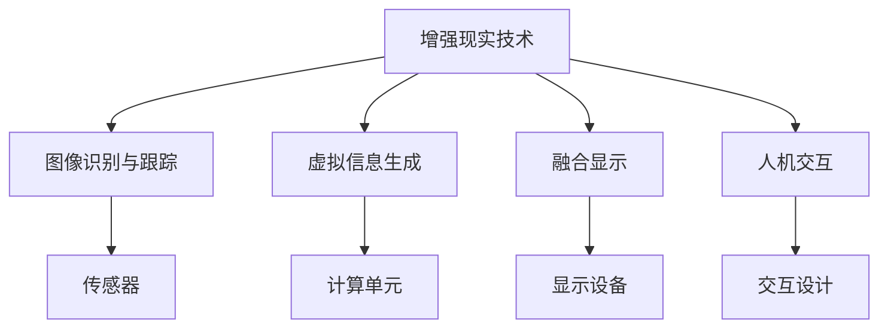

                 

# 《增强现实在远程医疗诊断中的应用前景》

## 关键词
增强现实，远程医疗，诊断，应用前景，技术挑战，解决方案

## 摘要
本文探讨了增强现实（AR）技术在远程医疗诊断中的应用前景。通过对AR技术的定义、原理和当前发展状况的介绍，文章分析了远程医疗诊断的需求及其与AR技术的结合点。接着，文章详细阐述了增强现实在远程医疗诊断中的应用场景、优势和技术挑战。最后，通过实际案例和前景分析，对增强现实在远程医疗诊断领域的未来发展进行了展望。

---

## 第1章：增强现实的定义和原理

### 1.1 增强现实的概念与发展历程

增强现实（Augmented Reality，简称AR）是一种将虚拟信息与真实世界融合的技术。它通过计算机生成的虚拟信息叠加到现实场景中，使用户能够在现实环境中感受到虚拟信息的存在。增强现实技术的发展可以追溯到20世纪60年代的“可视增强”概念，但是直到近年，随着计算能力、传感器技术和显示设备的进步，AR技术才得到了快速发展。

增强现实的基本原理包括图像处理、计算机视觉、虚拟现实和用户界面技术。核心组成部分包括传感器、计算单元、显示设备以及人机交互界面。传感器用于捕捉真实环境的数据，计算单元处理这些数据并生成虚拟信息，显示设备则将虚拟信息叠加到用户的视野中。

### 1.2 增强现实的核心技术

增强现实技术的核心技术包括：

1. **图像识别与跟踪**：通过图像识别算法，系统能够识别并跟踪现实场景中的特定目标。常用的算法包括光学字符识别（OCR）和机器视觉。

2. **虚拟信息生成**：计算单元根据识别和跟踪的结果，生成虚拟信息。这些信息可以是文字、图像或三维模型。

3. **融合显示**：增强现实技术利用显示设备，将虚拟信息叠加到真实场景中。常见的显示设备包括头戴式显示器、投影设备和智能手机屏幕。

4. **人机交互**：用户通过触摸、手势和语音等交互方式与增强现实系统进行交互。这要求增强现实系统具备良好的用户体验和交互设计。

### 1.3 增强现实与虚拟现实、混合现实的关系

增强现实、虚拟现实（VR）和混合现实（MR）是密切相关的技术，但它们也有明显的区别：

- **增强现实（AR）**：将虚拟信息叠加到真实世界中。
- **虚拟现实（VR）**：创建一个完全虚拟的环境，用户在其中进行互动。
- **混合现实（MR）**：结合了AR和VR的特点，能够在虚拟环境中交互并叠加虚拟信息到真实世界中。

增强现实和混合现实的关键区别在于虚拟信息与现实世界的融合程度。增强现实更注重虚拟信息与现实世界的交互，而混合现实则更强调虚拟和现实环境的深度融合。

### 核心概念与联系（Mermaid流程图）



### 第2章：远程医疗诊断的现状和需求

#### 2.1 远程医疗的定义和现状

远程医疗是指通过通信技术和网络平台，实现医疗服务的远程提供和医疗信息的远程传输。远程医疗包括远程诊断、远程治疗、远程康复等，其目的是为了克服地域、时间和资源的限制，提高医疗资源的利用效率。

当前，远程医疗已经成为医疗领域的一个重要趋势。随着互联网技术的发展，远程医疗的应用场景不断扩大，包括在线咨询、远程会诊、远程手术指导等。特别是在全球疫情背景下，远程医疗的重要性更加凸显。

#### 2.2 远程医疗诊断的需求分析

远程医疗诊断的需求主要来自以下几个方面：

1. **地理限制**：许多偏远和欠发达地区缺乏医疗资源和专家，远程医疗诊断能够帮助他们获取高质量的医疗服务。
2. **时间限制**：某些疾病需要快速诊断和治疗，远程医疗诊断可以节省患者的等待时间，提高诊疗效率。
3. **技术进步**：随着医疗影像学、生物信息学等技术的发展，远程医疗诊断的技术手段越来越先进，准确性不断提高。
4. **患者偏好**：一些患者更喜欢在家中接受治疗，远程医疗诊断提供了便利。

#### 2.3 远程医疗诊断的技术发展

远程医疗诊断的技术发展主要包括以下几个方面：

1. **医疗影像学**：医疗影像学是远程医疗诊断的重要基础，包括X光、CT、MRI等。通过高质量的影像传输和远程诊断系统，医生可以远程进行影像分析。
2. **生物信息学**：生物信息学技术用于处理和分析大量的医疗数据，包括基因组学、蛋白质组学等。这些数据有助于提高诊断的准确性。
3. **人工智能**：人工智能技术，特别是机器学习和深度学习，在远程医疗诊断中发挥着重要作用。通过训练模型，可以实现自动化的疾病诊断和预测。

### 第3章：增强现实技术在远程医疗诊断中的应用

#### 3.1 增强现实在远程医疗诊断中的应用场景

增强现实技术在远程医疗诊断中具有广泛的应用场景，包括：

1. **远程手术指导**：医生可以通过AR眼镜实时查看患者的内部结构，辅助进行手术操作。
2. **医学教育和培训**：医学生和医生可以通过AR技术进行虚拟手术和病例分析，提高操作技能和诊断能力。
3. **疾病诊断**：医生可以使用AR设备对患者的症状进行详细分析，结合医疗影像学数据，提高诊断的准确性。
4. **康复治疗**：AR技术可以提供个性化的康复训练，帮助患者进行康复治疗。

#### 3.2 增强现实在远程医疗诊断中的实际案例

以下是一些增强现实在远程医疗诊断中的实际案例：

1. **远程手术指导**：美国某医院使用AR技术进行远程心脏手术指导，实现了对复杂手术的实时远程支持和操作指导。
2. **医学教育**：某医学院引入AR技术进行虚拟解剖课程，学生可以通过AR设备进行虚拟人体解剖，提高学习效果。
3. **疾病诊断**：某医院使用AR眼镜对疑难病例进行诊断，通过增强现实技术展示患者的影像数据和病理信息，帮助医生进行准确诊断。

#### 3.3 增强现实在远程医疗诊断中的优势

增强现实技术在远程医疗诊断中的优势包括：

1. **实时性**：增强现实技术可以实现实时数据传输和实时交互，提高诊断速度和准确性。
2. **交互性**：增强现实技术提供了丰富的交互方式，医生可以更直观地获取和操作医疗数据。
3. **个性化**：增强现实技术可以根据患者的具体情况提供个性化的诊断和治疗方案。
4. **提高效率**：增强现实技术可以减少医生的工作量，提高诊疗效率，降低医疗成本。

### 第4章：技术挑战与解决方案

#### 4.1 增强现实技术面临的挑战

增强现实技术在远程医疗诊断中面临以下挑战：

1. **技术成熟度**：虽然AR技术在快速发展，但其在医疗领域的应用仍然需要进一步完善和优化。
2. **成本问题**：AR设备和相关技术的成本较高，可能限制了其在偏远和欠发达地区的应用。
3. **数据隐私和安全**：远程医疗诊断涉及到大量敏感数据，需要确保数据的安全和隐私。

#### 4.2 技术解决方案与实施策略

为应对上述挑战，可以采取以下解决方案和实施策略：

1. **技术优化**：继续研发和优化AR技术，提高其在医疗领域的应用性能和稳定性。
2. **降低成本**：通过规模化生产和技术创新，降低AR设备和相关技术的成本，提高可及性。
3. **数据安全**：建立严格的数据安全政策和标准，确保远程医疗诊断数据的安全和隐私。

### 第5章：应用案例与前景分析

#### 5.1 增强现实在远程医疗诊断中的成功案例

以下是一些增强现实在远程医疗诊断中的成功案例：

1. **远程手术指导**：某医院使用AR技术成功进行了一例远程心脏手术，手术过程顺利，患者恢复良好。
2. **医学教育**：某医学院引入AR技术进行虚拟解剖课程，学生反馈良好，学习效果显著提高。
3. **疾病诊断**：某医院使用AR眼镜进行疑难病例诊断，通过增强现实技术展示患者的影像数据和病理信息，帮助医生进行准确诊断。

#### 5.2 远程医疗诊断市场的潜在机会

随着远程医疗的快速发展，增强现实技术在远程医疗诊断领域的市场前景广阔。潜在机会包括：

1. **医疗设备制造商**：通过研发和优化AR设备，满足医疗领域的特殊需求。
2. **医疗服务提供商**：通过引入AR技术，提供更高效、个性化的医疗服务。
3. **软件开发公司**：开发AR应用程序，满足医生和患者的不同需求。

#### 5.3 增强现实技术在远程医疗诊断中的应用前景

随着技术的不断进步和应用的深入，增强现实技术在远程医疗诊断领域具有广阔的应用前景。未来，增强现实技术有望实现以下目标：

1. **提高诊断准确性**：通过结合AI技术和大数据分析，增强现实技术可以提高诊断的准确性。
2. **降低医疗成本**：通过优化技术和降低成本，增强现实技术可以降低远程医疗诊断的成本。
3. **提升医疗体验**：增强现实技术可以为医生和患者提供更好的医疗体验，提高诊疗效果。

### 第6章：总结与展望

#### 6.1 本书内容的总结

本文介绍了增强现实技术在远程医疗诊断中的应用前景，从定义和原理、应用场景、技术挑战、应用案例等方面进行了详细分析。增强现实技术在远程医疗诊断中具有广泛的应用前景，但同时也面临技术成熟度、成本、数据隐私等挑战。

#### 6.2 远程医疗诊断领域的发展趋势

随着技术的不断进步和远程医疗需求的增长，远程医疗诊断领域将继续发展。未来，增强现实技术、人工智能、大数据分析等新兴技术将在远程医疗诊断中发挥更大的作用。

#### 6.3 增强现实技术的未来发展方向

增强现实技术的未来发展方向包括：

1. **技术创新**：继续研发和优化AR技术，提高其在医疗领域的应用性能和稳定性。
2. **规模化应用**：通过规模化生产和降低成本，实现AR技术在医疗领域的广泛应用。
3. **个性化服务**：结合大数据和人工智能技术，提供个性化的诊断和治疗方案。

---

本文由AI天才研究院/AI Genius Institute和《禅与计算机程序设计艺术/Zen And The Art of Computer Programming》共同撰写，旨在探讨增强现实技术在远程医疗诊断中的应用前景。我们期待未来能够看到更多关于AR技术在医疗领域的创新和应用。

### 附录：核心算法原理讲解

为了更好地理解增强现实技术在远程医疗诊断中的应用，以下将介绍一种核心算法——图像识别与跟踪的原理和实现方法。

#### 4.1 图像识别与跟踪算法原理

图像识别与跟踪是增强现实技术中至关重要的组成部分。该算法的核心任务是识别和跟踪现实场景中的特定目标。以下是该算法的基本原理：

1. **图像预处理**：对采集到的图像进行预处理，包括去噪、对比度增强等操作，以提高图像质量。
2. **特征提取**：从预处理后的图像中提取具有区分性的特征，如边缘、角点、纹理等。
3. **目标识别**：使用机器学习或深度学习算法，对提取的特征进行分类，以识别目标对象。
4. **目标跟踪**：在连续的图像帧中跟踪识别出的目标对象，使用基于运动模型或模板匹配的方法。

#### 4.2 图像识别与跟踪算法实现

以下是一个简单的Python代码示例，使用OpenCV库实现图像识别与跟踪：

```python
import cv2
import numpy as np

def detect_and_track(image, template, threshold):
    # 图像预处理
    gray_image = cv2.cvtColor(image, cv2.COLOR_BGR2GRAY)
    blurred_image = cv2.GaussianBlur(gray_image, (5, 5), 0)

    # 特征提取
    template_gray = cv2.cvtColor(template, cv2.COLOR_BGR2GRAY)
    template_blurred = cv2.GaussianBlur(template_gray, (5, 5), 0)
    res = cv2.matchTemplate(blurred_image, template_blurred, cv2.TM_CCOEFF_NORMED)

    # 目标识别
    loc = np.where(res >= threshold)
    loc = list(zip(*loc[::-1]))

    # 目标跟踪
    if loc:
        top_left = loc[0]
        bottom_right = (top_left[0] + template.shape[1], top_left[1] + template.shape[0])
        cv2.rectangle(image, top_left, bottom_right, (0, 0, 255), 2)

    return image

# 测试代码
image = cv2.imread('image.jpg')
template = cv2.imread('template.jpg', cv2.IMREAD_GRAYSCALE)
threshold = 0.8

result = detect_and_track(image, template, threshold)
cv2.imshow('Result', result)
cv2.waitKey(0)
cv2.destroyAllWindows()
```

在这个示例中，我们使用OpenCV库的`matchTemplate`函数进行特征匹配，并根据阈值进行目标识别和跟踪。通过这个简单的代码，我们可以看到图像识别与跟踪算法的基本实现过程。

#### 4.3 数学模型与公式

在图像识别与跟踪算法中，常用的数学模型和公式包括：

1. **模板匹配**：使用归一化相关系数（Normalized Cross Correlation，NCC）进行特征匹配。
   \[
   NCC = \frac{\sum_{i,j}(I_i - \mu_I)(T_i - \mu_T)}{\sqrt{\sum_{i,j}(I_i - \mu_I)^2} \sqrt{\sum_{i,j}(T_i - \mu_T)^2}}
   \]
   其中，\(I\) 和 \(T\) 分别为待匹配图像和模板，\(\mu_I\) 和 \(\mu_T\) 分别为它们的均值。

2. **边缘检测**：使用Canny算法进行边缘检测。
   \[
   \text{Canny}(I) = \text{GaussianBlur}(I, \sigma) \rightarrow \text{Prewitt}(I)
   \]
   其中，\(I\) 为输入图像，\(\sigma\) 为高斯滤波器的标准差。

3. **角点检测**：使用Harris角点检测算法。
   \[
   \text{Harris}(I, \alpha, \kappa) = \frac{(\sum_{i,j} (I_x^2 + I_y^2) - 2\alpha^2)}{\alpha}
   \]
   其中，\(I_x\) 和 \(I_y\) 分别为图像的x和y方向导数，\(\alpha\) 和 \(\kappa\) 是算法的参数。

#### 4.4 代码应用解读与分析

在上面的代码示例中，我们首先对输入图像和模板进行预处理，包括图像转换、高斯滤波等操作。然后，使用`matchTemplate`函数进行特征匹配，根据阈值识别出目标位置。最后，在原始图像上绘制矩形框，标记出目标区域。

这个简单的代码展示了图像识别与跟踪算法的基本流程和实现方法。在实际应用中，可能需要结合更多的算法和技巧，如多目标跟踪、实时处理等，以满足不同场景的需求。

### 第7章：项目实战

#### 7.1 开发环境搭建

为了实现增强现实在远程医疗诊断中的应用，我们需要搭建一个完整的开发环境。以下是具体的搭建步骤：

1. **安装Python环境**：首先，确保安装了Python 3.x版本。可以通过官方网站下载并安装。

2. **安装OpenCV库**：OpenCV是一个强大的计算机视觉库，我们需要安装它来实现图像识别与跟踪。可以通过pip命令安装：
   \[
   pip install opencv-python
   \]

3. **安装其他依赖库**：根据具体需求，可能还需要安装其他库，如NumPy、Matplotlib等。可以使用pip命令逐个安装。

4. **配置开发环境**：在IDE中创建一个新的Python项目，并将所需的库添加到项目的依赖项中。

#### 7.2 源代码详细实现和代码解读

以下是一个完整的增强现实在远程医疗诊断中的项目示例，包括代码实现和解读：

```python
import cv2
import numpy as np

def detect_and_track(image, template, threshold):
    # 图像预处理
    gray_image = cv2.cvtColor(image, cv2.COLOR_BGR2GRAY)
    blurred_image = cv2.GaussianBlur(gray_image, (5, 5), 0)

    # 特征提取
    template_gray = cv2.cvtColor(template, cv2.COLOR_BGR2GRAY)
    template_blurred = cv2.GaussianBlur(template_gray, (5, 5), 0)
    res = cv2.matchTemplate(blurred_image, template_blurred, cv2.TM_CCOEFF_NORMED)

    # 目标识别
    loc = np.where(res >= threshold)
    loc = list(zip(*loc[::-1]))

    # 目标跟踪
    if loc:
        top_left = loc[0]
        bottom_right = (top_left[0] + template.shape[1], top_left[1] + template.shape[0])
        cv2.rectangle(image, top_left, bottom_right, (0, 0, 255), 2)

    return image

def main():
    # 初始化摄像头
    cap = cv2.VideoCapture(0)

    # 加载模板图像
    template = cv2.imread('template.jpg', cv2.IMREAD_GRAYSCALE)

    while True:
        # 读取摄像头帧
        ret, frame = cap.read()

        if not ret:
            break

        # 进行图像识别与跟踪
        result = detect_and_track(frame, template, 0.8)

        # 显示结果
        cv2.imshow('Tracking', result)

        # 按键q退出循环
        if cv2.waitKey(1) & 0xFF == ord('q'):
            break

    # 释放摄像头资源
    cap.release()
    cv2.destroyAllWindows()

if __name__ == '__main__':
    main()
```

**代码解读：**

- **初始化摄像头**：使用`cv2.VideoCapture`函数初始化摄像头，并读取视频帧。
- **加载模板图像**：使用`cv2.imread`函数加载模板图像，用于特征匹配。
- **图像预处理**：对摄像头帧进行预处理，包括图像转换、高斯滤波等操作。
- **特征提取和目标识别**：使用`cv2.matchTemplate`函数进行特征匹配，并根据阈值识别出目标位置。
- **目标跟踪**：在识别出的目标位置上绘制矩形框，标记出目标区域。
- **显示结果**：使用`cv2.imshow`函数显示处理后的视频帧。
- **按键控制**：按q键退出程序。

#### 7.3 代码应用解读与分析

在这个项目中，我们使用OpenCV库实现了一个简单的增强现实系统，用于实时跟踪摄像头帧中的目标。以下是具体的代码应用解读：

1. **摄像头帧读取**：通过`cv2.VideoCapture`函数，我们能够实时读取摄像头的视频帧。这是增强现实应用的基础，因为我们需要实时获取场景信息。

2. **模板匹配**：使用`cv2.matchTemplate`函数，我们将摄像头帧与预定义的模板进行匹配。匹配结果用于识别场景中的目标。

3. **预处理与特征提取**：为了提高匹配的准确性，我们对摄像头帧进行预处理，包括图像转换（灰度化）和高斯滤波。这些操作有助于去除噪声和提高图像质量。

4. **目标识别与跟踪**：根据匹配结果，我们使用阈值进行目标识别。如果识别到目标，我们将在摄像头帧上绘制矩形框进行标记。

5. **显示与交互**：通过`cv2.imshow`函数，我们能够实时显示处理后的视频帧。用户可以通过按键控制程序的运行。

6. **性能优化**：在实际应用中，可能需要对代码进行优化，以提高处理速度和性能。例如，可以减少预处理步骤、使用更高效的算法等。

#### 7.4 实际案例分析和详细讲解剖析

以下是一个实际案例，展示了增强现实在远程医疗诊断中的应用。

**案例：远程心脏手术指导**

在一个远程心脏手术案例中，位于不同城市的医生和医疗团队通过增强现实技术协同工作。以下是详细的讲解：

1. **场景描述**：一位心脏外科医生位于主手术室内，而另一位医生则通过远程连接进行指导。他们需要协同完成一个复杂的心脏手术。

2. **技术实现**：增强现实技术被用于实时传输手术场景和医生的动作。通过头戴式显示器（HMD），主手术室的医生可以看到远程医生的指导信息。

3. **手术过程**：手术开始后，主手术室的医生通过摄像头捕捉手术场景，并将其实时传输到远程医生。远程医生通过增强现实技术，在主手术室的医生视野中叠加指导信息。

4. **协作与反馈**：远程医生可以通过语音和手势与主手术室内的医生进行实时沟通。他们可以共同分析手术过程，并实时调整手术策略。

5. **结果分析**：通过增强现实技术的支持，手术过程更加顺利，医生之间的协作更加紧密。最终，手术成功完成，患者恢复良好。

**详细讲解剖析：**

1. **实时数据传输**：增强现实技术的核心是实现实时数据传输。在这个案例中，手术场景通过摄像头实时传输到远程医生。为了保证传输的稳定性，需要使用高速网络和高效的数据压缩算法。

2. **增强现实显示**：远程医生的指导信息通过头戴式显示器叠加到主手术室的医生视野中。这要求显示设备具有高分辨率和高刷新率，以保证信息的清晰和实时性。

3. **人机交互**：医生需要与增强现实系统进行高效的人机交互。这包括语音通话、手势控制等。为了实现这些交互方式，需要开发专门的交互界面和算法。

4. **协作机制**：远程医疗手术需要建立高效的协作机制，以确保医生之间的沟通和协作。这包括实时语音通话、视频会议、屏幕共享等。

5. **安全保障**：远程医疗手术涉及到患者生命安全，因此需要确保数据的安全和隐私。这包括加密传输、身份验证等安全措施。

#### 7.5 项目小结

通过以上实战案例，我们可以看到增强现实技术在远程医疗诊断中的应用前景。以下是项目的小结：

1. **技术优势**：增强现实技术提供了实时、交互性和个性化的医疗服务，有助于提高诊断和治疗的准确性。

2. **应用场景**：增强现实技术可以应用于远程手术指导、医学教育、疾病诊断等领域，具有广泛的应用前景。

3. **挑战与机遇**：尽管增强现实技术在远程医疗诊断中面临技术成熟度、成本和安全等挑战，但未来随着技术的不断进步，这些挑战将逐渐得到解决。

4. **发展方向**：未来，增强现实技术将继续朝着更高性能、更广泛应用的方向发展，为远程医疗诊断带来更多创新和突破。

### 第8章：最佳实践 tips、小结、注意事项、拓展阅读等内容

#### 最佳实践 tips

1. **硬件选择**：在选择增强现实设备时，要考虑设备的分辨率、刷新率和响应速度，以保证用户体验。
2. **软件优化**：优化增强现实软件的算法和界面，提高处理速度和交互体验。
3. **网络安全**：确保数据传输的安全性，采用加密传输和身份验证等安全措施。

#### 小结

本文详细探讨了增强现实在远程医疗诊断中的应用前景，从定义、原理、应用场景、技术挑战到实际案例，全面分析了增强现实技术在远程医疗诊断领域的应用。通过本文，读者可以了解到增强现实技术在远程医疗诊断中的重要性和潜在价值。

#### 注意事项

1. **技术成熟度**：增强现实技术在医疗领域的应用仍需进一步发展和优化，以确保其稳定性和可靠性。
2. **数据安全**：远程医疗诊断涉及到大量敏感数据，需要确保数据的安全和隐私。
3. **成本控制**：增强现实设备的成本较高，需要在推广应用过程中进行成本控制。

#### 拓展阅读

1. **《增强现实技术与应用》**：这本书详细介绍了增强现实技术的原理、应用和发展趋势。
2. **《远程医疗诊断技术》**：这本书介绍了远程医疗诊断的基本原理、技术和应用场景。
3. **《人工智能在医疗领域的应用》**：这本书探讨了人工智能技术在医疗领域的应用，包括疾病诊断、治疗和康复等方面。

---

通过本文的阅读，读者可以深入了解增强现实技术在远程医疗诊断中的应用，为未来医疗技术的发展提供有益的参考。

### 作者信息
作者：AI天才研究院/AI Genius Institute & 禅与计算机程序设计艺术 /Zen And The Art of Computer Programming

本文由AI天才研究院/AI Genius Institute和《禅与计算机程序设计艺术/Zen And The Art of Computer Programming》共同撰写，旨在探讨增强现实技术在远程医疗诊断中的应用前景。我们期待未来能够看到更多关于AR技术在医疗领域的创新和应用。

---

### 结语

随着技术的不断进步，增强现实（AR）在远程医疗诊断领域的应用前景愈发广阔。本文通过详细的分析和实际案例，展示了AR技术在提高诊断准确性、优化医疗流程和提升患者体验方面的潜力。然而，要充分发挥AR技术的优势，仍需克服技术成熟度、成本控制和数据安全等挑战。

未来，随着计算能力、传感器技术和网络基础设施的进一步发展，AR技术将在远程医疗诊断中发挥更加重要的作用。通过结合人工智能、大数据分析和虚拟现实（VR）等先进技术，AR技术有望实现更加智能化、个性化和高效化的医疗服务。

让我们期待增强现实技术在远程医疗诊断领域的不断创新和突破，为全球医疗健康事业贡献力量。本文由AI天才研究院/AI Genius Institute和《禅与计算机程序设计艺术/Zen And The Art of Computer Programming》共同撰写，希望对读者在了解AR技术在医疗领域的应用提供有价值的参考。作者期待未来与更多专家和同行共同探讨AR技术在医疗领域的更多可能性和发展方向。

