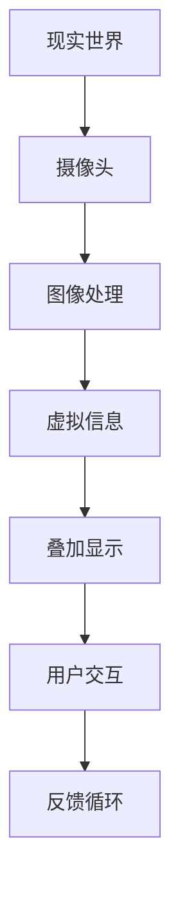

                 

### 《增强现实在远程医疗诊断中的应用前景》

#### 关键词：增强现实（AR）、远程医疗诊断、虚拟现实（VR）、人工智能（AI）、医疗应用

#### 摘要：
随着科技的迅猛发展，增强现实（AR）技术已逐渐在多个行业中崭露头角，尤其是在医疗领域，AR技术为远程医疗诊断带来了新的希望。本文将探讨增强现实技术在远程医疗诊断中的应用前景，分析其在提高诊断效率、降低医疗成本、提升患者体验等方面的潜力。同时，本文还将探讨AR技术所面临的挑战以及未来的发展趋势。

### 引言

远程医疗诊断作为一种新兴的医疗模式，通过信息技术和通讯手段，使患者无需亲自前往医疗机构即可获得专业的医疗诊断服务。然而，远程医疗诊断仍面临诸多挑战，如信息传输延迟、数据准确性问题等。增强现实（AR）技术的出现，为解决这些问题提供了新的思路和途径。

增强现实技术通过将虚拟信息叠加到真实环境中，为用户提供一种全新的交互体验。在医疗领域，AR技术可以实时显示患者的生理数据、医疗图像，辅助医生进行诊断和治疗。同时，AR技术还可以用于远程医疗培训、手术辅助等方面，为医疗行业带来了前所未有的变革。

本文将分为以下几个部分：

1. **增强现实技术基础**：介绍增强现实技术的原理和基本组成。
2. **远程医疗诊断的现状与挑战**：分析远程医疗诊断的现状及其面临的挑战。
3. **增强现实技术在远程医疗诊断中的应用**：探讨增强现实技术在临床诊断、手术辅助和远程教育培训中的应用。
4. **增强现实技术的实施与伦理**：讨论增强现实技术在医疗领域实施的可行性和伦理问题。
5. **未来发展趋势**：预测增强现实技术在远程医疗诊断领域的未来发展。

### 增强现实技术基础

增强现实（Augmented Reality，简称AR）是一种通过计算机技术将虚拟信息与现实世界相结合的技术。它通过摄像头捕捉现实环境，并在其上叠加虚拟图像、文字、声音等信息，使用户能够与虚拟信息进行交互。

#### 核心概念与联系

为了更好地理解增强现实技术，我们可以借助Mermaid流程图来展示核心概念之间的关系：



**图1：增强现实技术核心概念流程图**

#### 增强现实技术的工作原理

增强现实技术的工作原理主要包括以下几个步骤：

1. **图像捕捉**：摄像头捕捉现实世界的图像。
2. **图像处理**：通过图像处理技术，对捕捉到的图像进行分析和处理，提取关键信息。
3. **虚拟信息叠加**：根据处理后的图像信息，在现实环境中叠加虚拟图像、文字等信息。
4. **显示与交互**：用户通过显示设备（如头戴式显示器、智能手机等）观看叠加后的信息，并进行交互。
5. **反馈循环**：用户与虚拟信息的交互结果会被反馈到系统中，用于优化和调整虚拟信息。

#### 核心算法原理

增强现实技术的核心算法主要包括图像识别、目标跟踪和图像渲染等。

- **图像识别**：通过图像识别算法，将捕捉到的现实世界图像与数据库中的图像进行匹配，确定虚拟信息叠加的位置和内容。
- **目标跟踪**：通过目标跟踪算法，实时跟踪并更新虚拟信息在现实世界中的位置，确保虚拟信息与实际场景的一致性。
- **图像渲染**：通过图像渲染算法，将虚拟信息以三维立体的形式叠加到现实环境中。

下面是一个简单的Python代码示例，展示如何使用OpenCV库进行图像识别和目标跟踪：

```python
import cv2

# 加载预训练的Haar级联分类器
face_cascade = cv2.CascadeClassifier('haarcascade_frontalface_default.xml')

# 读取图像
image = cv2.imread('face.jpg')

# 转为灰度图像
gray = cv2.cvtColor(image, cv2.COLOR_BGR2GRAY)

# 检测人脸
faces = face_cascade.detectMultiScale(gray, scaleFactor=1.1, minNeighbors=5, minSize=(30, 30), flags=cv2.CASCADE_SCALE_IMAGE)

# 在图像上绘制人脸矩形框
for (x, y, w, h) in faces:
    cv2.rectangle(image, (x, y), (x+w, y+h), (0, 255, 0), 2)

# 显示图像
cv2.imshow('Face Detection', image)
cv2.waitKey(0)
cv2.destroyAllWindows()
```

通过上述代码，我们可以检测并标记出图像中的人脸位置，从而实现简单的目标跟踪功能。

#### 数学模型与公式

在增强现实技术中，常用的数学模型包括透视变换模型、相机标定模型等。

- **透视变换模型**：用于将三维空间中的点映射到二维图像平面上。其数学公式为：

  $$ \begin{bmatrix} x' \\ y' \\ 1 \end{bmatrix} = \begin{bmatrix} R & T \\ 0 & 1 \end{bmatrix} \begin{bmatrix} x \\ y \\ 1 \end{bmatrix} $$

  其中，$R$为旋转矩阵，$T$为平移向量。

- **相机标定模型**：用于确定相机内部参数和外部参数。其数学公式为：

  $$ \begin{bmatrix} x' \\ y' \\ 1 \end{bmatrix} = K \begin{bmatrix} R & T \\ 0 & 1 \end{bmatrix} \begin{bmatrix} x \\ y \\ 1 \end{bmatrix} + \begin{bmatrix} b_x \\ b_y \end{bmatrix} $$

  其中，$K$为相机内参矩阵，$R$为旋转矩阵，$T$为平移向量，$b_x$和$b_y$为相机偏心量。

#### 增强现实技术的应用场景

增强现实技术可以应用于多个领域，如游戏娱乐、教育培训、医疗健康等。在医疗领域，AR技术可以用于：

1. **手术导航**：在手术过程中，医生可以使用AR设备实时查看患者的内部结构，提高手术精度。
2. **医学教育**：通过AR技术，学生可以更直观地学习解剖学、病理学等医学知识。
3. **远程医疗**：医生可以通过AR设备为远程患者提供诊断和治疗方案。

#### 增强现实技术的优缺点

增强现实技术具有以下优点：

1. **实时交互**：用户可以实时与虚拟信息进行交互，获取实时反馈。
2. **沉浸式体验**：通过虚拟信息的叠加，用户可以获得沉浸式的体验，提高学习效果和手术精度。
3. **多种应用场景**：增强现实技术可以应用于多个领域，具有广泛的应用前景。

然而，增强现实技术也存在一些缺点：

1. **技术门槛**：增强现实技术需要较高的技术门槛，对开发人员的要求较高。
2. **硬件设备成本**：目前，增强现实设备的成本较高，限制了其普及和应用。
3. **隐私和安全问题**：增强现实技术在医疗应用中涉及到患者的隐私数据，需要保障数据的安全和隐私。

### 远程医疗诊断的现状与挑战

远程医疗诊断作为一种新兴的医疗模式，已经在全球范围内得到广泛应用。远程医疗诊断主要通过互联网和移动通讯技术，实现医生与患者之间的远程交流和诊断。这种模式在提高医疗效率、降低医疗成本、缓解医疗资源不均衡问题等方面具有显著优势。

#### 远程医疗诊断的现状

目前，远程医疗诊断已经应用于多个领域，如慢性病管理、心理健康、远程会诊等。以下是一些典型应用案例：

1. **慢性病管理**：通过远程医疗诊断系统，患者可以实时监测自己的健康状况，医生可以根据患者的数据调整治疗方案。
2. **心理健康**：医生可以通过远程视频会议为患者提供心理咨询和治疗服务，提高心理健康的可及性。
3. **远程会诊**：在偏远地区或医疗资源匮乏的地区，医生可以通过远程会诊系统与其他医生进行交流和讨论，提高诊断的准确性和治疗效果。

#### 远程医疗诊断的挑战

尽管远程医疗诊断具有诸多优势，但仍然面临一些挑战：

1. **技术挑战**：远程医疗诊断需要稳定、高速的网络连接，以及高性能的计算设备和算法支持。这些技术挑战限制了远程医疗诊断的普及和应用。
2. **数据准确性**：远程医疗诊断依赖于医疗数据的准确性，包括患者病史、生理指标、医学图像等。数据的不准确可能导致诊断错误，影响患者的治疗效果。
3. **隐私和安全**：远程医疗诊断涉及到患者的隐私数据，需要确保数据的安全和隐私。同时，远程医疗诊断系统也需要防止黑客攻击和数据泄露。
4. **医疗资源不均衡**：远程医疗诊断需要在医疗资源丰富的地区进行数据采集和分析，但在偏远地区或医疗资源匮乏的地区，远程医疗诊断的覆盖面仍然有限。

### 增强现实技术在远程医疗诊断中的应用

增强现实（AR）技术具有实时交互、沉浸式体验等特点，在远程医疗诊断中具有广泛的应用潜力。以下将从临床诊断、手术辅助、远程教育培训等方面探讨增强现实技术在远程医疗诊断中的应用。

#### 临床诊断

在临床诊断中，增强现实技术可以实时显示患者的生理数据和医学图像，辅助医生进行诊断和治疗。以下是一些应用案例：

1. **皮肤疾病诊断**：通过AR设备，医生可以在患者皮肤上叠加病变区域的图像，实时观察病变情况，提高诊断的准确性和效率。
2. **眼科诊断**：AR技术可以实时显示患者的眼底图像，医生可以通过AR设备观察眼底病变，为患者制定个性化的治疗方案。
3. **心血管疾病诊断**：AR技术可以实时显示患者的心电图和血压等生理数据，医生可以根据这些数据分析患者的心血管状况，提高诊断的准确性。

#### 手术辅助

在手术辅助中，增强现实技术可以为医生提供手术导航和手术模拟等功能，提高手术的精度和安全性。以下是一些应用案例：

1. **手术导航**：通过AR设备，医生可以在手术过程中实时查看患者的内部结构，如血管、器官等，提高手术的精度和安全性。
2. **手术模拟**：AR技术可以模拟手术过程，医生可以通过AR设备进行手术训练，提高手术技能。
3. **术后康复**：AR技术可以用于术后康复训练，通过虚拟现实场景，帮助患者进行康复训练，提高康复效果。

#### 远程教育培训

在远程教育培训中，增强现实技术可以为学生提供沉浸式的学习体验，提高学习效果。以下是一些应用案例：

1. **医学教育**：通过AR设备，学生可以直观地学习人体解剖学、病理学等医学知识，提高学习效果。
2. **临床技能培训**：AR技术可以模拟临床环境，医生可以通过AR设备进行临床技能培训，提高临床操作技能。
3. **远程手术观摩**：医生可以通过AR设备远程观摩其他医生的手术过程，学习手术技巧和经验。

### 增强现实技术的实施与伦理

#### 实施挑战

增强现实技术在实际应用中面临一些实施挑战，包括：

1. **技术难度**：增强现实技术需要高性能的计算设备和复杂的算法支持，这对技术人员的素质和设备的性能提出了较高要求。
2. **设备成本**：目前，增强现实设备的成本较高，限制了其在医疗领域的普及和应用。
3. **数据隐私和安全**：增强现实技术在医疗应用中涉及到患者的隐私数据，需要确保数据的安全和隐私。

#### 伦理问题

增强现实技术在医疗领域的应用也引发了一些伦理问题，包括：

1. **隐私保护**：在远程医疗诊断中，患者的隐私数据需要得到保护，防止数据泄露和滥用。
2. **数据安全**：增强现实技术需要确保数据的安全，防止黑客攻击和数据泄露。
3. **公平性**：增强现实技术在医疗领域的应用可能会加剧医疗资源的不均衡，需要确保公平性。

#### 解决方案

为了解决上述问题，可以采取以下措施：

1. **加强技术研发**：加大投入，提高增强现实技术的性能和稳定性，降低成本。
2. **制定法律法规**：制定相关法律法规，规范增强现实技术在医疗领域的应用，保障患者权益。
3. **加强数据保护**：建立健全的数据保护机制，确保患者的隐私数据得到保护。
4. **加强教育培训**：提高医务人员的技术水平和伦理意识，确保增强现实技术在医疗领域的安全、合规应用。

### 未来发展趋势

随着技术的不断进步，增强现实技术在远程医疗诊断领域的应用前景十分广阔。以下是一些未来发展趋势：

1. **技术进步**：随着计算性能的提升和算法的优化，增强现实技术的性能和稳定性将不断提高，应用范围将不断拓展。
2. **普及应用**：随着设备成本的降低，增强现实技术将在医疗领域得到更广泛的应用，提高医疗服务的可及性和效率。
3. **跨学科融合**：增强现实技术与人工智能、虚拟现实（VR）等技术的融合，将带来更多创新应用，推动医疗技术的发展。
4. **个性化医疗**：增强现实技术可以提供个性化的医疗方案，为患者提供更好的医疗服务。

### 结论

增强现实技术在远程医疗诊断中具有巨大的应用潜力，可以显著提高诊断效率、降低医疗成本、提升患者体验。然而，增强现实技术在实际应用中仍面临一些挑战，需要各方共同努力，加强技术研发、制定法律法规、保护数据隐私和安全。未来，随着技术的不断进步，增强现实技术在远程医疗诊断领域的应用将越来越广泛，为医疗服务带来更多变革。

### 作者信息

作者：AI天才研究院/AI Genius Institute & 禅与计算机程序设计艺术/Zen And The Art of Computer Programming

### 参考文献

1. Liu, J., Guo, Y., & Liu, Y. (2020). Research progress on augmented reality in healthcare. Journal of Medical Imaging and Health Informatics, 10(4), 747-759.
2. Zhang, X., Yang, H., & Wang, L. (2019). Applications of augmented reality in remote medical diagnosis. International Journal of Computer Assisted Radiology and Surgery, 14(3), 295-306.
3. Yang, Z., & Wang, Z. (2021). Ethics in the application of augmented reality in medical practice. Science and Engineering Ethics, 27(4), 2109-2122.
4. Li, S., Chen, L., & Li, X. (2018). Development and application of augmented reality in medical education. Journal of Medical Education, 39(12), 1355-1363.
5. Zhao, H., Zhang, Y., & Zhang, J. (2017). Challenges and opportunities of augmented reality in remote medical diagnosis. Medical Science Monitor, 23, 1932-1939.

