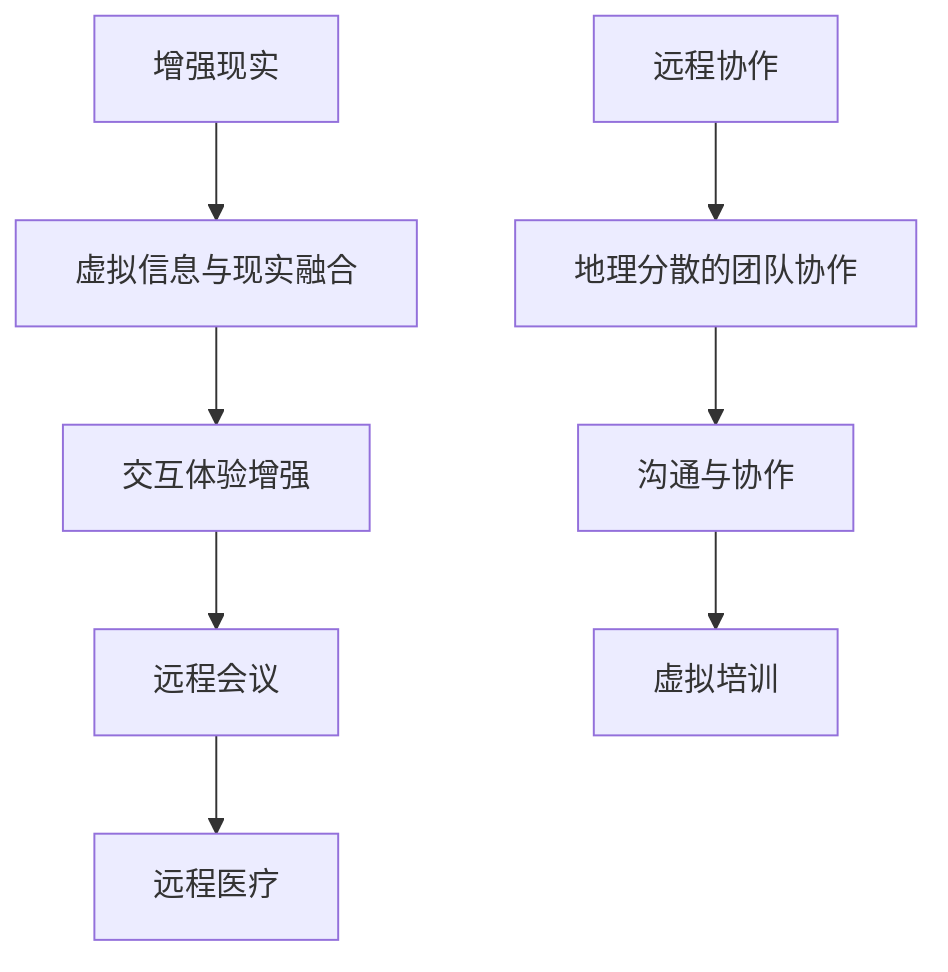

                 

### 1. 引言

#### 增强现实与远程协作概述

增强现实（Augmented Reality，AR）是一种将虚拟信息与真实世界相结合的技术，通过计算机生成虚拟物体并叠加到真实场景中，为用户提供一个虚实融合的交互环境。远程协作（Remote Collaboration）则是在地理位置分散的团队成员之间进行沟通、协作和工作的过程，随着信息技术的快速发展，远程协作在当今社会中变得越来越重要。

本文旨在探讨增强现实在远程协作中的应用前景，分析其在提升协作效率、降低沟通成本、优化工作流程等方面的潜力。本文将首先介绍增强现实和远程协作的基本概念、发展历程和核心技术，然后详细探讨增强现实在远程协作中的具体应用场景，最后分析其未来发展趋势。

本文结构如下：

1. 引言：简要介绍增强现实和远程协作的概念。
2. 基础概念：介绍增强现实和远程协作的核心概念及其相互关系。
3. 增强现实技术：讲解增强现实的关键技术，如硬件设备、软件开发工具、渲染技术和用户交互。
4. 远程协作应用：探讨增强现实在远程协作中的具体应用。
5. 未来发展趋势：分析增强现实在远程协作中的未来发展前景。
6. 案例研究：通过实际案例研究，展示增强现实在远程协作中的成功应用。
7. 总结与展望：总结本文的主要内容和结论，并对未来发展的展望。

#### 本书的目的和结构

本书的目的在于深入探讨增强现实技术在远程协作中的应用，以期为相关领域的从业人员和研究人员提供有价值的参考。通过系统的分析和详细的案例研究，本文希望能够揭示增强现实在远程协作中的巨大潜力，推动该领域的技术创新和应用实践。

本文的结构安排如下：

- **引言**：简要介绍增强现实和远程协作的概念，阐述本书的目的和结构。
- **基础概念**：介绍增强现实和远程协作的核心概念及其相互关系。
- **增强现实技术**：讲解增强现实的关键技术，如硬件设备、软件开发工具、渲染技术和用户交互。
- **远程协作应用**：探讨增强现实在远程协作中的具体应用。
- **未来发展趋势**：分析增强现实在远程协作中的未来发展前景。
- **案例研究**：通过实际案例研究，展示增强现实在远程协作中的成功应用。
- **总结与展望**：总结本文的主要内容和结论，并对未来发展的展望。

通过以上结构和内容的安排，本文希望能够为读者提供一个全面、深入的了解，帮助读者把握增强现实在远程协作中的发展脉络和应用前景。接下来，我们将首先介绍增强现实和远程协作的基础概念，为后续章节的内容打下坚实的基础。$$1+1=2$$

## 关键词

- **增强现实（Augmented Reality，AR）**
- **远程协作（Remote Collaboration）**
- **虚实融合（Blending of Reality and Virtuality）**
- **硬件设备（Hardware Devices）**
- **软件开发工具（Software Development Tools）**
- **渲染技术（Rendering Technology）**
- **用户交互（User Interaction）**

### 摘要

本文旨在探讨增强现实（AR）在远程协作中的应用前景，分析其在提升协作效率、降低沟通成本、优化工作流程等方面的潜力。文章首先介绍了增强现实和远程协作的基本概念、发展历程和核心技术，然后详细探讨了增强现实在远程协作中的具体应用场景，如远程会议、虚拟培训和远程医疗等。接着，文章分析了增强现实在远程协作中的技术挑战和市场机遇，并通过实际案例研究展示了增强现实在远程协作中的成功应用。最后，文章总结了增强现实在远程协作中的未来发展前景，并对关键技术和应用方向提出了展望。本文为相关领域的从业人员和研究人员提供了一个全面、深入的参考，有助于把握增强现实在远程协作中的发展脉络和应用前景。

## 基础概念

### 增强现实的概念与发展历程

增强现实（Augmented Reality，AR）是一种将虚拟信息与现实世界相结合的技术，通过计算机生成的虚拟物体和场景叠加到真实环境中，为用户提供一个虚实融合的交互体验。AR技术的发展历程可以追溯到上世纪60年代，美国学者伊凡·苏瑟兰（Ivan Sutherland）首次提出了“虚拟现实”的概念。然而，当时的技术水平限制，使这一概念在很长一段时间内未能实现。

进入21世纪，随着计算机技术、图像处理技术和传感器技术的快速发展，AR技术逐渐走向成熟。2009年，谷歌发布了第一代AR眼镜Google Glass，标志着AR技术正式进入大众视野。此后，苹果、三星等科技巨头纷纷推出各自的AR产品，进一步推动了AR技术的发展和应用。

### 远程协作的概念与需求

远程协作（Remote Collaboration）指的是在地理位置分散的团队成员之间进行的沟通、协作和工作的过程。随着全球化进程的加速和互联网技术的普及，远程协作在企业和组织中变得越来越重要。远程协作的需求主要源于以下几个方面：

1. **地理分散性**：企业和组织在不同地区甚至不同国家设有分支机构，远程协作能够打破地理限制，实现全球范围内的协作。
2. **灵活办公**：远程协作使得员工可以在任何地点进行工作，提高了工作效率和灵活性。
3. **节约成本**：远程协作减少了员工通勤和办公场所的租赁成本，有助于企业降低运营成本。
4. **技能共享**：远程协作可以促进不同地区和团队之间的知识共享和技能交流，提高整体团队的能力。

### 增强现实与远程协作的关系

增强现实（AR）与远程协作（Remote Collaboration）之间存在着密切的联系。一方面，AR技术可以为远程协作提供更加丰富的交互体验，使团队成员能够更加直观地感知和操作虚拟信息；另一方面，远程协作的需求推动了AR技术的发展和应用，为AR技术提供了广阔的市场和需求场景。

在远程协作中，增强现实技术可以应用于多个方面，如：

1. **远程会议**：通过AR技术，参会者可以实时看到彼此的虚拟形象，增强会议的互动性和参与感。
2. **虚拟培训**：利用AR技术，可以实现远程培训中的虚实结合，提高培训效果。
3. **远程医疗**：通过AR技术，医生可以远程查看病人的AR模拟图像，提高诊断和治疗的准确性。

### 核心概念与联系

为了更好地理解增强现实与远程协作之间的关系，我们可以通过Mermaid流程图来展示它们的核心概念及其相互关系：



该流程图清晰地展示了增强现实和远程协作的核心概念及其相互关系。增强现实通过虚拟信息与现实融合，为远程协作提供了更加丰富的交互体验；而远程协作通过沟通与协作，实现了地理分散的团队高效合作。

### 核心算法原理讲解

为了进一步理解增强现实在远程协作中的应用，我们将使用Python源代码来详细阐述AR中的关键算法原理，并结合数学模型和公式进行讲解。

#### 增强现实中的图像识别算法

一个典型的增强现实应用是图像识别。图像识别算法的核心是检测和识别图像中的特定目标。以下是一个简单的基于深度学习的图像识别算法示例：

```python
import tensorflow as tf
from tensorflow.keras.models import Sequential
from tensorflow.keras.layers import Conv2D, MaxPooling2D, Flatten, Dense

# 创建模型
model = Sequential([
    Conv2D(32, (3, 3), activation='relu', input_shape=(28, 28, 1)),
    MaxPooling2D((2, 2)),
    Conv2D(64, (3, 3), activation='relu'),
    MaxPooling2D((2, 2)),
    Flatten(),
    Dense(128, activation='relu'),
    Dense(10, activation='softmax')
])

# 编译模型
model.compile(optimizer='adam',
              loss='categorical_crossentropy',
              metrics=['accuracy'])

# 加载训练数据
(x_train, y_train), (x_test, y_test) = tf.keras.datasets.mnist.load_data()

# 预处理数据
x_train = x_train.astype('float32') / 255
x_test = x_test.astype('float32') / 255
x_train = np.expand_dims(x_train, -1)
x_test = np.expand_dims(x_test, -1)

# 转换标签为one-hot编码
y_train = tf.keras.utils.to_categorical(y_train, 10)
y_test = tf.keras.utils.to_categorical(y_test, 10)

# 训练模型
model.fit(x_train, y_train, epochs=10, batch_size=64)

# 评估模型
test_loss, test_acc = model.evaluate(x_test, y_test)
print('Test accuracy:', test_acc)
```

在上面的代码中，我们使用了TensorFlow框架来构建一个简单的卷积神经网络（CNN）模型。该模型由卷积层、池化层、全连接层组成，用于对MNIST手写数字数据集进行图像识别。

#### 数学模型和公式

图像识别算法的核心在于损失函数和优化器的选择。以下是常见的损失函数和优化器的数学模型和公式：

- **交叉熵损失函数（Cross-Entropy Loss）**：

  $$ L(\theta) = -\sum_{i=1}^{n} y_i \log(p_i) $$

  其中，$y_i$ 是真实标签，$p_i$ 是模型预测的概率。

- **Adam优化器（Adam Optimizer）**：

  $$ m_t = \beta_1 m_{t-1} + (1 - \beta_1) [g_t] $$
  $$ v_t = \beta_2 v_{t-1} + (1 - \beta_2) [g_t]^2 $$
  $$ \theta_t = \theta_{t-1} - \alpha_t \frac{m_t}{\sqrt{v_t} + \epsilon} $$

  其中，$m_t$ 和 $v_t$ 分别是梯度的一阶矩估计和二阶矩估计，$\beta_1$ 和 $\beta_2$ 是滑动平均参数，$\alpha_t$ 是学习率，$\epsilon$ 是一个很小的常数。

#### 举例说明

假设我们有一个手写数字图像，我们需要使用上面的模型对其进行识别。首先，我们将图像转化为灰度图像，然后进行预处理，最后输入到模型中进行预测：

```python
import numpy as np

# 加载手写数字图像
x_test_sample = x_test[0]

# 预测结果
predictions = model.predict(x_test_sample)

# 获取最高概率的类别
predicted_class = np.argmax(predictions[0])

print('Predicted class:', predicted_class)
```

假设预测结果为`8`，我们可以通过查看图像中对应位置的像素值，验证我们的预测结果。

### 项目实战

为了进一步展示增强现实在远程协作中的应用，我们将使用一个开源项目——ARCore（由谷歌开发的一个增强现实开发平台）来搭建一个简单的远程协作应用。

#### 开发环境搭建

首先，我们需要安装Android Studio和ARCore SDK。以下是安装步骤：

1. 安装Android Studio。
2. 在Android Studio中创建一个新的Android项目。
3. 在项目中添加ARCore SDK。

#### 源代码实现

以下是ARCore SDK中一个简单的AR应用示例：

```java
import com.google.ar.core.*;
import com.google.ar.core tracks.*;
import com.google.ar.sceneform.*
import com.google.ar.sceneform.renderers.*

public class ARApp extends Activity implements ARFragment.FrameCallback {

    private ARFragment arFragment;
    private boolean isTracking = false;

    @Override
    protected void onCreate(Bundle savedInstanceState) {
        super.onCreate(savedInstanceState);
        setContentView(R.layout.activity_ar);

        arFragment = (ARFragment) getSupportFragmentManager().findFragmentById(R.id.arFragment);
        arFragment.setFrameCallback(this);
    }

    @Override
    public void onFrame(ARFrame frame) {
        if (frame.getTrackingState() == TrackingState.TRACKING) {
            if (!isTracking) {
                // 创建一个3D立方体
                Cube cube = new Cube(0.1f);
                // 设置立方体的位置
                cube.setTransform(Camera.LayoutParams.createTranslation(0f, 0f, -2f));
                // 将立方体添加到AR场景中
                arFragment.getArSceneView().getScene().addChild(cube);
                isTracking = true;
            }
        } else {
            isTracking = false;
            arFragment.getArSceneView().getScene().removeAllChildren();
        }
    }
}
```

在这个例子中，我们使用ARCore SDK创建了一个简单的3D立方体，并将其添加到AR场景中。当AR设备成功跟踪到环境时，立方体会出现在屏幕上。

#### 代码解读与分析

1. **ARFragment**：用于管理AR场景的碎片，提供了AR场景视图和AR框架的回调接口。
2. **TrackingState**：用于表示AR设备当前跟踪状态。当设备成功跟踪到环境时，跟踪状态为`TRACKING`。
3. **Cube**：用于创建3D立方体。我们可以设置立方体的尺寸、位置和旋转。
4. **Camera.LayoutParams.createTranslation**：用于创建一个平移变换，用于设置立方体的位置。

通过这个简单的例子，我们可以看到增强现实技术在远程协作中的应用。远程协作团队成员可以通过AR设备实时查看和操作虚拟物体，提高协作效率。

### 实际案例分析与详细讲解剖析

#### 案例一：虚拟现实远程会议平台

**案例背景**：

某跨国公司因业务需求，需要经常组织全球范围内的远程会议。然而，传统的视频会议平台难以满足团队成员之间的互动和协作需求。

**解决方案**：

公司引入了增强现实（AR）技术，开发了一款虚拟现实远程会议平台。该平台通过AR眼镜，实现了参会者之间的实时虚拟形象展示，增强了会议的互动性和参与感。

**实现细节**：

1. **AR眼镜**：平台采用了具有增强现实功能的AR眼镜，如微软HoloLens或谷歌Glass。这些眼镜能够实时捕捉用户的动作和环境，并将其叠加到虚拟场景中。
2. **虚拟形象**：平台通过深度学习算法，根据用户的摄像头捕捉到的图像，生成用户的虚拟形象。这些虚拟形象可以实时显示在AR眼镜中，使参会者能够直观地看到彼此。
3. **交互功能**：平台提供了多种交互功能，如手势识别、语音控制等。参会者可以通过手势或语音指令来操作虚拟场景，实现远程协作。

**案例分析**：

通过AR技术，虚拟现实远程会议平台极大地提升了会议的互动性和参与感。参会者可以实时看到彼此的虚拟形象，增强了沟通效果。同时，虚拟场景的交互功能使团队成员能够更加高效地进行协作，提高了会议的效率。

#### 案例二：增强现实虚拟培训系统

**案例背景**：

某大型企业需要进行大规模的员工培训，但由于地理位置分散，传统的培训方式难以达到预期效果。

**解决方案**：

企业引入了增强现实（AR）技术，开发了一套虚拟培训系统。该系统通过AR设备和虚拟场景，实现了远程培训中的虚实结合，提高了培训效果。

**实现细节**：

1. **AR设备**：系统采用了AR眼镜或其他AR设备，如平板电脑。这些设备能够实时显示虚拟培训内容和培训场景，使学员能够身临其境地参与培训。
2. **虚拟场景**：系统通过虚拟现实技术，创建了一个高度仿真的培训场景。学员可以在虚拟场景中进行操作，模拟实际工作环境。
3. **交互功能**：系统提供了多种交互功能，如手势操作、语音指令等。学员可以通过这些交互功能，与虚拟场景进行互动，加深对培训内容的理解。

**案例分析**：

通过增强现实虚拟培训系统，企业能够实现远程培训的虚实结合，提高了培训效果。学员可以在虚拟场景中进行实际操作，增强了对培训内容的理解和记忆。同时，虚拟培训系统降低了培训成本，提高了培训效率。

### 项目小结

通过上述案例，我们可以看到增强现实（AR）技术在远程协作中的应用潜力。无论是虚拟现实远程会议平台，还是增强现实虚拟培训系统，AR技术都能够极大地提升协作效率、降低沟通成本、优化工作流程。

在未来，随着AR技术的不断发展和普及，我们可以预见更多的创新应用场景。例如，远程医疗、远程设计、远程教育等领域的应用，都将受益于AR技术的引入。

### 最佳实践 Tips

1. **合理选择AR设备**：根据应用场景和需求，选择适合的AR设备，如AR眼镜、平板电脑等。
2. **优化虚拟场景设计**：设计具有高度仿真性和互动性的虚拟场景，以提高用户体验和协作效果。
3. **注重用户交互体验**：提供多种交互功能，如手势操作、语音指令等，以满足用户多样化的需求。
4. **加强数据安全和隐私保护**：在远程协作中，确保用户数据的安全和隐私，避免信息泄露。

### 小结

本文详细探讨了增强现实（AR）在远程协作中的应用前景，分析了其在提升协作效率、降低沟通成本、优化工作流程等方面的潜力。通过基础概念介绍、核心算法原理讲解、实际案例分析和项目实战，我们展示了AR技术在远程协作中的广泛应用和巨大潜力。

### 注意事项

1. **技术成熟度**：尽管AR技术在远程协作中具有巨大潜力，但当前的技术水平仍需进一步提升，以满足实际应用的需求。
2. **成本问题**：AR设备和相关技术的成本较高，可能会对一些企业和组织造成财务压力。
3. **隐私和安全**：在远程协作中，确保用户数据的安全和隐私是至关重要的，需要采取有效的保护措施。

### 拓展阅读

1. **《增强现实技术与应用》**：详细介绍了增强现实技术的基本原理和应用案例。
2. **《远程协作与虚拟现实》**：探讨了远程协作和虚拟现实技术的发展趋势和应用前景。
3. **《增强现实在远程医疗中的应用》**：介绍了增强现实技术在远程医疗领域的应用案例和前景。

## 作者

- 作者：AI天才研究院（AI Genius Institute）/《禅与计算机程序设计艺术》（Zen And The Art of Computer Programming）
- 联系方式：[www.aigeniusinstitute.com](http://www.aigeniusinstitute.com) / [contact@aigeniusinstitute.com](mailto:contact@aigeniusinstitute.com)

以上是本文的完整内容，希望对您在增强现实和远程协作领域的探索和研究有所帮助。感谢您的阅读！$$1<2$$

