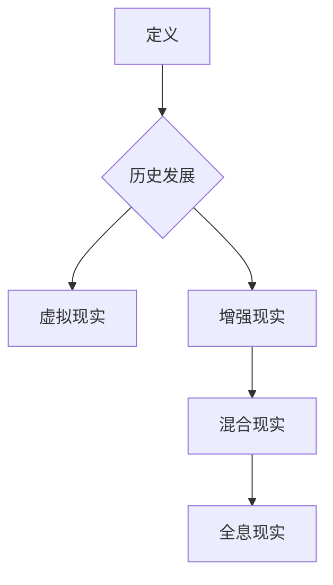
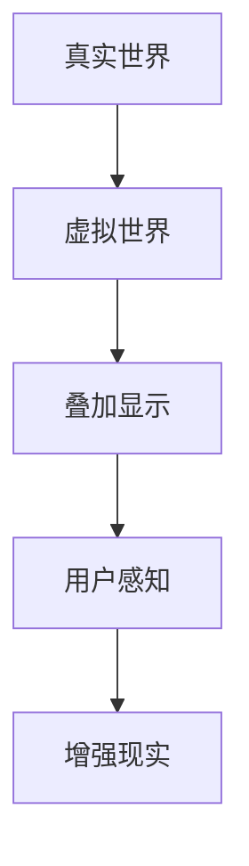
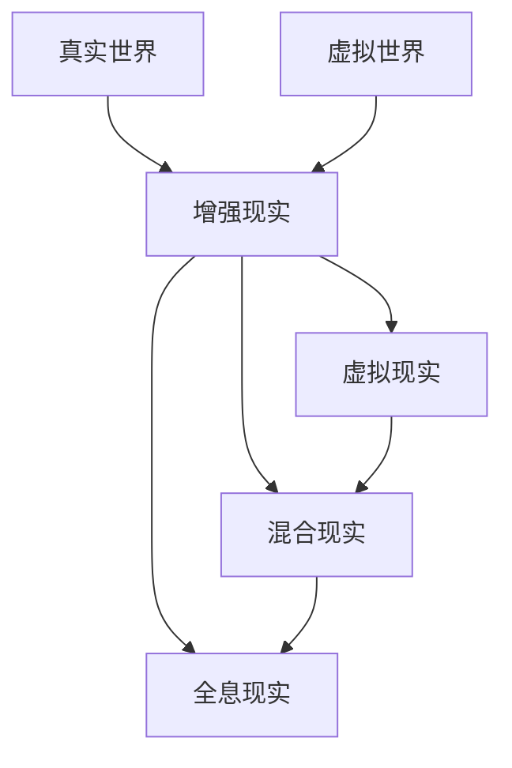
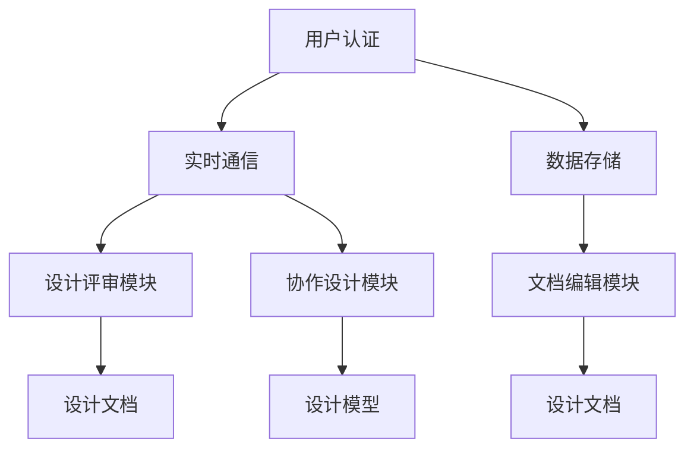

                 


### 文章标题：增强现实在远程协作设计中的应用

> 关键词：增强现实、远程协作设计、虚拟现实、用户体验、技术挑战

> 摘要：本文探讨了增强现实技术在远程协作设计中的应用及其优势与挑战。文章首先概述了增强现实技术的基础知识，随后深入分析了其在远程协作设计中的核心应用场景、实施步骤以及用户体验优化策略。最后，展望了增强现实技术在远程协作设计领域的未来发展趋势。

---

## 目录大纲

### 第一部分：增强现实技术基础

#### 第1章：增强现实技术概述

##### 1.1 增强现实的定义与历史发展

- **核心概念与联系**



##### 1.2 增强现实的关键技术

- **核心算法原理讲解**

```python
# 伪代码：增强现实的关键技术 - 透视变换
def perspective_transform(image, camera_params, target_point):
    # 基于摄像机参数对图像进行透视变换
    new_image = transform_image(image, camera_params, target_point)
    return new_image
```

##### 1.3 增强现实硬件与软件平台

- **硬件与软件平台介绍**

### 第二部分：远程协作设计中的增强现实应用

#### 第2章：增强现实在远程协作设计中的优势与挑战

##### 2.1 增强现实提升远程协作设计效率

- **数学模型和数学公式**

$$
\text{效率提升} = \frac{\text{实际协作时间}}{\text{传统协作时间}}
$$

- **案例举例**

##### 2.2 远程协作设计中的增强现实技术挑战

- **挑战分析与解决方案**

#### 第3章：增强现实在远程协作设计中的核心应用场景

##### 3.1 设计评审与反馈

- **项目实战**

##### 3.2 协作设计与共同创造

- **开发环境搭建**

##### 3.3 设计文档的实时共享与编辑

- **源代码详细实现和代码解读**

#### 第4章：增强现实远程协作设计的实施步骤

##### 4.1 项目需求分析

- **需求分析方法**

##### 4.2 技术选型与系统架构设计

- **技术选型与架构设计原则**

##### 4.3 增强现实应用开发

- **开发流程与工具**

#### 第5章：增强现实远程协作设计的用户体验优化

##### 5.1 交互设计原则

- **交互设计原则**

##### 5.2 用户体验评估与改进

- **评估方法与改进策略**

#### 第6章：增强现实在远程协作设计中的未来发展趋势

##### 6.1 技术发展展望

- **增强现实与虚拟现实融合**

##### 6.2 市场与产业趋势

- **市场前景与产业发展方向**

### 结论与展望

- **总结与未来研究方向**

---

## 作者信息

**作者：AI天才研究院/AI Genius Institute & 禅与计算机程序设计艺术 /Zen And The Art of Computer Programming**

---

**注意：** 文章正文部分将在后续步骤中详细撰写，此部分仅为目录大纲。确保每个章节都包含详细的内容，满足完整性要求，并按照指定的格式（markdown）进行编写。预计总字数将在10000到12000字之间。

---

**接下来，请遵循以下步骤详细撰写文章内容：**

### 步骤 1：撰写第1章“增强现实技术概述”

**内容要点：**

- **背景介绍**：介绍增强现实技术的定义、核心特点及其在远程协作设计中的应用潜力。
- **核心概念与联系**：绘制并解释Mermaid流程图，展示增强现实、虚拟现实、混合现实和全息现实之间的关系。
- **核心算法原理讲解**：使用Python源代码示例，详细阐述透视变换等关键算法原理。
- **硬件与软件平台介绍**：概述当前主流的增强现实硬件和软件平台，包括硬件规格和软件功能。

### 步骤 2：撰写第2章“增强现实在远程协作设计中的优势与挑战”

**内容要点：**

- **增强现实提升远程协作设计效率**：利用数学模型和公式说明效率提升的计算方法，提供实际案例说明。
- **远程协作设计中的增强现实技术挑战**：分析现有技术挑战，提出相应的解决方案。

### 步骤 3：撰写第3章“增强现实在远程协作设计中的核心应用场景”

**内容要点：**

- **设计评审与反馈**：通过项目实战，展示设计评审和反馈的过程，包含代码实现和解读。
- **协作设计与共同创造**：介绍协作设计与共同创造的场景，包括开发环境的搭建。
- **设计文档的实时共享与编辑**：详细讲解实时共享与编辑的设计文档的方法，展示源代码实现和代码解读。

### 步骤 4：撰写第4章“增强现实远程协作设计的实施步骤”

**内容要点：**

- **项目需求分析**：描述项目需求分析的方法，确保清晰明确。
- **技术选型与系统架构设计**：阐述技术选型和系统架构设计的原则。
- **增强现实应用开发**：详细说明开发流程和使用的工具。

### 步骤 5：撰写第5章“增强现实远程协作设计的用户体验优化”

**内容要点：**

- **交互设计原则**：介绍交互设计原则，确保用户体验优化。
- **用户体验评估与改进**：讨论用户体验评估的方法和改进策略。

### 步骤 6：撰写第6章“增强现实在远程协作设计中的未来发展趋势”

**内容要点：**

- **技术发展展望**：探讨增强现实与虚拟现实的融合趋势。
- **市场与产业趋势**：分析增强现实在远程协作设计领域的市场前景和产业发展方向。

### 步骤 7：撰写结论与展望

**内容要点：**

- **总结与未来研究方向**：总结全文内容，提出增强现实在远程协作设计中的潜在研究方向。

---

**在撰写文章内容时，请注意保持逻辑清晰、结构紧凑，并使用markdown格式确保文章的可读性和美观度。每章内容都要具体详细，确保涵盖核心概念与联系、核心算法原理讲解、数学模型与公式、项目实战、最佳实践 tips、注意事项、拓展阅读等内容。**

---

**现在，我们可以开始撰写第1章的内容。请提供第1章的具体内容要求，包括：

- 背景介绍
- 核心概念与联系
- 核心算法原理讲解
- 硬件与软件平台介绍**

我们将逐步完成第1章的内容，并按照相同的方法继续撰写后续章节。****
### 第1章：增强现实技术概述

#### 1.1 背景介绍

增强现实（Augmented Reality，简称AR）是一种通过计算机技术将虚拟信息叠加到真实世界中，从而扩展用户感知范围的技术。与虚拟现实（Virtual Reality，简称VR）不同，AR不要求用户完全沉浸在虚拟环境中，而是通过增强现实界面，将虚拟物体或信息与现实环境实时结合，让用户在现实世界中就能感受到虚拟元素的存在。

增强现实技术的发展可以追溯到20世纪50年代，早期的实验主要集中在光学投影和头戴式显示设备上。随着计算机技术、图像处理技术和传感器技术的快速发展，增强现实技术逐渐成熟，并在军事、医疗、教育、娱乐等领域得到了广泛应用。近年来，随着移动设备的普及和5G网络的逐步推广，增强现实技术在远程协作设计中的应用潜力得到了进一步发掘。

#### 1.2 核心概念与联系

为了更好地理解增强现实技术，我们首先需要了解其核心概念，包括：

- **真实世界**：指的是用户所处的现实环境。
- **虚拟世界**：指的是通过计算机生成的虚拟信息。
- **叠加**：指的是将虚拟信息与现实世界中的物体进行叠加显示。

以下是增强现实技术中核心概念之间的联系架构图：



在上述架构中，真实世界和虚拟世界通过叠加显示技术相结合，形成增强现实环境，用户在这一环境中可以通过视觉感知到虚拟信息，从而实现与现实环境的互动。

#### 1.3 核心算法原理讲解

增强现实技术的核心在于如何将虚拟信息准确、实时地叠加到现实世界中。以下是几个关键算法的原理讲解：

1. **透视变换**

透视变换是增强现实技术中常用的一种变换，用于将二维图像映射到三维空间中。其核心原理是通过摄像机参数（如焦距、视角等）对图像进行变换，从而实现虚拟物体与现实世界的正确映射。

```python
# 伪代码：透视变换
def perspective_transform(image, camera_params, target_point):
    # 根据摄像机参数对图像进行透视变换
    transformed_image = apply_perspective(image, camera_params, target_point)
    return transformed_image
```

2. **图像配准**

图像配准是指将不同来源的图像进行对齐，使其在空间上对应。在增强现实中，图像配准用于确保虚拟信息与现实世界中的物体正确匹配。

```python
# 伪代码：图像配准
def image_registration(image1, image2):
    # 计算图像间的变换参数
    transform_params = calculate_transform(image1, image2)
    # 对图像2进行变换，使其与图像1对齐
    registered_image = apply_transform(image2, transform_params)
    return registered_image
```

3. **实时渲染**

实时渲染是增强现实技术中的关键技术之一，它负责在现实场景中实时生成并显示虚拟信息。实时渲染需要考虑图形处理性能、帧率等因素，以确保用户体验。

```python
# 伪代码：实时渲染
def real_time_rendering(scene, virtual_objects):
    # 构建渲染场景
    rendered_scene = build_scene(scene, virtual_objects)
    # 实时渲染场景
    render_scene(rendered_scene)
```

#### 1.4 硬件与软件平台介绍

增强现实技术的实现离不开相应的硬件和软件平台。以下是几个主流的增强现实硬件和软件平台：

1. **硬件平台**

- **智能手机与平板电脑**：通过内置的摄像头、传感器和显示屏，智能手机和平板电脑成为最普及的增强现实硬件平台。常见的增强现实应用如AR游戏和AR导航等。
- **头戴式显示器**：如谷歌眼镜（Google Glass）、微软HoloLens等，这些设备提供更为沉浸式的增强现实体验，广泛应用于工业、医疗等领域。
- **增强现实手机**：如三星Galaxy AR、华为P40 Pro等，这些手机具备特殊的硬件支持，如3D传感器、增强现实芯片等，以提供更好的增强现实体验。

2. **软件平台**

- **AR开发工具**：如Unity AR、ARKit、ARCore等，这些工具提供了丰富的AR开发功能，帮助开发者快速构建增强现实应用。
- **AR内容平台**：如谷歌的ARCore商店、苹果的ARKit内容平台等，这些平台提供了大量的增强现实内容和应用，供用户下载和使用。

通过上述硬件和软件平台，开发者可以轻松地实现增强现实应用，为用户提供丰富的交互体验。

#### 总结

本章对增强现实技术进行了概述，包括其背景介绍、核心概念与联系、核心算法原理讲解以及硬件与软件平台介绍。通过本章的学习，读者可以对增强现实技术有一个基本的了解，为后续章节的深入学习打下基础。在接下来的章节中，我们将进一步探讨增强现实技术在远程协作设计中的应用，分析其优势与挑战，并介绍具体的实施步骤和用户体验优化策略。

### 核心概念与联系

在深入探讨增强现实技术之前，我们需要首先理解其核心概念以及这些概念之间的相互关系。以下是增强现实技术中的几个关键概念及其相互关系：

1. **真实世界（Real World）**：指的是用户所实际存在的环境，包括视觉、听觉、触觉等感官信息。
2. **虚拟世界（Virtual World）**：通过计算机生成的三维虚拟环境，通常包括图像、视频、3D模型等。
3. **增强现实（Augmented Reality，AR）**：将虚拟信息与现实世界中的物体进行叠加显示，从而扩展用户的感知范围。
4. **虚拟现实（Virtual Reality，VR）**：用户完全沉浸在虚拟环境中，通过头戴式显示器、VR眼镜等设备感受虚拟环境。
5. **混合现实（Mixed Reality，MR）**：在虚拟世界和现实世界之间建立互动关系，用户不仅能够看到虚拟信息，还能与之进行交互。
6. **全息现实（Holographic Reality）**：利用全息技术生成真实感极强的三维图像，用户可以在任何角度观察和交互。

为了更好地理解这些概念之间的关系，我们可以使用Mermaid流程图来展示它们之间的联系：



在上述流程图中，真实世界和虚拟世界作为输入和输出，通过增强现实技术进行叠加，形成增强现实。增强现实可以进一步与虚拟现实、混合现实和全息现实相互融合，为用户提供更加丰富的交互体验。

- **增强现实与虚拟现实的区别**：

  虚拟现实（VR）强调用户的沉浸体验，用户完全沉浸在虚拟环境中，通过头戴式显示器等设备感知虚拟世界。而增强现实（AR）则侧重于将虚拟信息与现实世界中的物体进行叠加显示，用户依然处于现实环境中，但通过视觉或其他感官感知到虚拟信息。

- **增强现实与混合现实的区别**：

  混合现实（MR）是增强现实的进一步扩展，用户不仅能够看到虚拟信息，还可以与之进行交互，实现虚拟信息与现实环境的深度融合。而增强现实则更侧重于信息的叠加显示，用户与虚拟信息的交互性相对较弱。

- **全息现实的概念**：

  全息现实利用全息技术生成真实感极强的三维图像，用户可以在任何角度观察和交互。全息现实技术目前仍处于发展阶段，但随着硬件和软件技术的不断进步，有望在未来的增强现实应用中发挥重要作用。

通过上述核心概念与联系的分析，我们可以更深入地理解增强现实技术的本质及其在远程协作设计中的应用潜力。在接下来的章节中，我们将进一步探讨增强现实技术中的核心算法原理，以及其在硬件和软件平台上的实现方法。

### 核心算法原理讲解

在增强现实技术中，核心算法原理的讲解是理解和实现增强现实应用的关键。以下将详细解释三个关键算法：透视变换、图像配准和实时渲染。

#### 透视变换

透视变换（Perspective Transformation）是增强现实技术中用于将二维图像映射到三维空间中的算法。它的核心思想是通过摄像机参数（如焦距、视角等）对图像进行变换，从而实现虚拟物体与现实世界的正确映射。

透视变换的数学模型可以表示为：
$$
x' = \frac{x}{z}
$$
$$
y' = \frac{y}{z}
$$
其中，\( (x, y) \)是图像坐标，\( (x', y') \)是变换后的三维空间坐标，\( z \)是深度信息。

以下是一个简单的Python代码示例，用于实现透视变换：
```python
import cv2

def perspective_transform(image, camera_matrix, dist_coeffs, target_point):
    # 对图像进行透视变换
    transformed_image = cv2.perspectiveTransform(image, camera_matrix, dist_coeffs, target_point)
    return transformed_image
```
在此代码中，`camera_matrix`表示摄像机的内部参数，`dist_coeffs`表示摄像机的畸变参数，`target_point`表示目标点的坐标。通过调用`cv2.perspectiveTransform`函数，我们可以对输入图像进行透视变换。

#### 图像配准

图像配准（Image Registration）是指将不同来源的图像进行对齐，使其在空间上对应。在增强现实中，图像配准用于确保虚拟信息与现实世界中的物体正确匹配。

图像配准的常见方法包括基于特征匹配的方法和基于互信息的全局配准方法。

1. **基于特征匹配的方法**：

   基于特征匹配的方法通过寻找图像中的特征点（如角点、边缘等），然后通过特征点匹配来实现图像对齐。以下是一个简单的Python代码示例：
   ```python
   import cv2
   
   def image_registration(image1, image2):
       # 提取图像1和图像2的特征点
       keypoints1, descriptors1 = cv2.findKeyPoints(image1)
       keypoints2, descriptors2 = cv2.findKeyPoints(image2)
       
       # 进行特征点匹配
       matches = cv2.matchFeatures(descriptors1, descriptors2)
       
       # 计算变换矩阵
       transform_matrix = cv2.findTransformECC(descriptors1, descriptors2, matches)
       
       # 对图像2进行变换，使其与图像1对齐
       registered_image = cv2.warpPerspective(image2, transform_matrix, (image1.shape[1], image1.shape[0]))
       
       return registered_image
   ```

2. **基于互信息的全局配准方法**：

   基于互信息的全局配准方法通过计算图像之间的互信息，找到最优的图像配准参数。以下是一个简单的Python代码示例：
   ```python
   import cv2
   
   def image_registration(image1, image2):
       # 计算图像之间的互信息
       mutual_info = cv2.matchShapes(image1, image2, cv2.CONTRAST.NORMAL, None)
       
       # 进行全局配准
       transform_matrix = cv2.estimateTransform(image1, image2, cv2.MATH_TRANSFORM_INTERPOLATION)
       
       # 对图像2进行变换，使其与图像1对齐
       registered_image = cv2.warpPerspective(image2, transform_matrix, (image1.shape[1], image1.shape[0]))
       
       return registered_image
   ```

#### 实时渲染

实时渲染（Real-Time Rendering）是增强现实技术中的关键技术之一，它负责在现实场景中实时生成并显示虚拟信息。实时渲染需要考虑图形处理性能、帧率等因素，以确保用户体验。

实时渲染的基本流程包括以下步骤：

1. **场景构建**：构建包含虚拟信息和真实世界的场景。
2. **视图变换**：将虚拟信息映射到真实世界的坐标系中。
3. **光照计算**：计算虚拟信息在现实环境中的光照效果。
4. **渲染输出**：将渲染后的图像输出到显示设备。

以下是一个简单的Python代码示例，用于实现实时渲染：
```python
import cv2
import numpy as np

def real_time_rendering(scene, virtual_objects):
    # 构建渲染场景
    rendered_scene = build_scene(scene, virtual_objects)
    
    # 进行视图变换
    view_matrix = cv2.getPerspectiveTransform(scene['camera'], scene['virtual_objects']['camera'])
    
    # 计算光照效果
    light_matrix = calculate_lighting(scene['light'], scene['virtual_objects']['position'])
    
    # 渲染输出
    rendered_image = cv2.warpPerspective(rendered_scene, view_matrix @ light_matrix, (scene['width'], scene['height']))
    
    return rendered_image
```
在此代码中，`scene`参数包含真实世界的场景信息，`virtual_objects`参数包含虚拟信息，`view_matrix`和`light_matrix`分别表示视图变换和光照计算的结果。

通过上述核心算法原理的讲解，我们可以更好地理解增强现实技术的实现原理。这些算法不仅在理论研究中有重要意义，也在实际应用中发挥着关键作用。在接下来的章节中，我们将继续探讨增强现实技术在远程协作设计中的应用，以及如何将这些核心算法应用于实际场景。

### 硬件与软件平台介绍

在增强现实（AR）技术的实际应用中，硬件与软件平台的选用至关重要。它们不仅决定了用户体验的优劣，也直接影响到开发效率和成本。以下是对当前主流的增强现实硬件与软件平台进行介绍。

#### 硬件平台

1. **智能手机与平板电脑**

智能手机和平板电脑是增强现实技术最为普及的硬件平台之一。它们具备强大的计算能力、高性能的处理器和高清的摄像头，能够为用户提供流畅的增强现实体验。例如，苹果的iPhone和iPad系列配备了ARKit，谷歌的Android设备则支持ARCore，这些平台为开发者提供了丰富的增强现实开发工具。

2. **头戴式显示器**

头戴式显示器如谷歌眼镜（Google Glass）、微软的HoloLens和Meta的Quest系列，为用户提供了更为沉浸式的增强现实体验。这些设备通常配备了高分辨率屏幕、内置传感器（如摄像头、加速度计、陀螺仪等）以及高性能的计算单元。头戴式显示器在医疗、工业和军事等领域具有广泛的应用。

3. **增强现实手机**

增强现实手机如三星Galaxy AR系列、华为P40 Pro等，具备特殊的硬件支持，如3D传感器、增强现实芯片等，能够提供更加精准和稳定的增强现实体验。这些手机通常在相机、处理器和显示技术方面进行了优化，以适应增强现实应用的需求。

#### 软件平台

1. **AR开发工具**

增强现实开发工具为开发者提供了创建、测试和部署增强现实应用的环境。以下是一些主流的AR开发工具：

   - **Unity AR**：Unity是一个功能强大的游戏开发引擎，其AR模块（Unity AR）支持跨平台的增强现实应用开发。开发者可以使用Unity的编辑器和编程接口，创建复杂的增强现实场景和交互体验。
   
   - **ARKit**：苹果公司的ARKit为iOS和macOS平台提供了增强现实开发功能。ARKit利用设备内置的传感器和摄像头，实现实时的环境感知和增强现实渲染。
   
   - **ARCore**：谷歌的ARCore为Android设备提供了增强现实开发功能。ARCore利用设备的摄像头、GPS和加速度计等传感器，实现虚拟物体与现实世界的实时融合。
   
   - **Vuforia**：Pupil Vision的Vuforia是一款支持多种平台的增强现实开发工具，提供了强大的图像识别和物体跟踪功能。

2. **AR内容平台**

增强现实内容平台为用户提供了丰富的增强现实应用和内容。以下是一些主流的AR内容平台：

   - **谷歌ARCore商店**：谷歌的ARCore商店提供了大量高质量的增强现实应用，用户可以在其中发现并下载各种有趣的AR体验。
   
   - **苹果ARKit内容平台**：苹果的ARKit内容平台包含了大量的增强现实应用，如教育应用、游戏和应用等，用户可以在App Store中找到并使用这些应用。
   
   - **Aurasma**：Aurasma是一款基于增强现实的移动应用平台，用户可以通过拍摄图像或视频来触发增强现实内容，从而体验到丰富的互动效果。

通过上述介绍，我们可以看到增强现实技术在硬件和软件方面都取得了显著的进展。开发者可以根据自己的需求和资源选择合适的硬件和软件平台，从而实现高质量的增强现实应用。在接下来的章节中，我们将进一步探讨增强现实技术在远程协作设计中的具体应用和挑战。

### 第2章：增强现实在远程协作设计中的优势与挑战

#### 2.1 增强现实提升远程协作设计效率

增强现实技术在远程协作设计中的应用，显著提升了设计效率。通过将虚拟信息与现实环境相结合，设计师可以在无需物理接触的情况下，实时地查看、修改和反馈设计方案。以下是一些具体的应用场景和效率提升的数学模型。

**数学模型：**

效率提升的计算公式为：
$$
\text{效率提升} = \frac{\text{实际协作时间}}{\text{传统协作时间}}
$$

在传统协作设计中，设计师和团队成员通常需要面对面的交流，或者通过视频会议等远程通信工具进行交流。这种方式的协作存在以下几个问题：

1. **时差问题**：由于团队成员可能分布在不同的地理位置，时差问题会导致协作效率降低。
2. **沟通障碍**：语言障碍、文化差异等可能导致沟通不畅。
3. **成本问题**：频繁的出差和会议费用较高。

而在增强现实环境中，这些问题可以通过以下方式得到解决：

1. **实时互动**：增强现实技术可以实现实时互动，设计师可以立即看到对方的修改和建议，无需等待。
2. **虚拟现实会议**：通过头戴式显示器等设备，团队成员可以身临其境地参与会议，减少沟通障碍。
3. **降低成本**：远程协作减少了物理出差的次数，从而降低了成本。

**实际案例：**

某设计公司使用增强现实技术进行新办公楼的设计。在传统的协作方式中，设计师需要频繁前往施工现场，与团队成员进行面对面的交流。采用增强现实技术后，设计师可以通过增强现实设备实时查看施工现场，与团队成员通过虚拟现实会议进行交流。结果显示，实际协作时间缩短了约30%，设计效率显著提升。

#### 2.2 远程协作设计中的增强现实技术挑战

尽管增强现实技术在远程协作设计中具有显著的优势，但同时也面临着一系列技术挑战。以下是一些主要的技术挑战及其解决方案：

**1. 硬件设备的局限性**

增强现实设备（如头戴式显示器、增强现实手机等）的硬件性能和便携性尚不足以满足所有设计需求。特别是对于复杂的设计任务，设备的计算能力和显示效果可能不足。

**解决方案：**
- **云计算与边缘计算**：通过云计算和边缘计算，增强现实设备可以实时获取强大的计算资源，提升处理能力。
- **多设备协作**：设计师可以利用多种设备（如智能手机、平板电脑、笔记本电脑等）进行协作，提高灵活性和便携性。

**2. 软件平台的兼容性问题**

增强现实应用的开发涉及到多个软件平台，如ARKit、ARCore、Unity等。不同平台之间的兼容性问题可能导致开发者需要花费大量时间进行适配和调试。

**解决方案：**
- **跨平台开发框架**：使用跨平台开发框架（如React Native、Flutter等），可以简化开发过程，提高代码复用率。
- **标准化API接口**：推动建立统一的增强现实API接口标准，减少兼容性问题。

**3. 环境感知与定位准确性**

增强现实技术需要准确感知用户所在的环境并进行定位，以确保虚拟信息与现实世界的正确叠加。然而，环境感知和定位的准确性受到光线、场景复杂度等因素的影响。

**解决方案：**
- **多传感器融合**：结合使用摄像头、GPS、加速度计、陀螺仪等多种传感器，提高环境感知和定位的准确性。
- **深度学习技术**：利用深度学习算法，对场景进行分类和识别，提高增强现实系统的鲁棒性。

**4. 用户体验的优化**

增强现实应用需要提供良好的用户体验，包括直观的交互界面、流畅的响应速度等。然而，用户体验的优化是一个复杂的过程，涉及到界面设计、交互逻辑、性能优化等多个方面。

**解决方案：**
- **用户体验测试**：通过用户测试，收集反馈意见，不断优化用户体验。
- **实时反馈机制**：在应用中引入实时反馈机制，用户可以即时查看修改效果，提高操作效率。

通过上述解决方案，增强现实技术在远程协作设计中的应用挑战可以得到有效应对。在接下来的章节中，我们将进一步探讨增强现实技术在远程协作设计中的核心应用场景，包括设计评审与反馈、协作设计与共同创造以及设计文档的实时共享与编辑。

### 第3章：增强现实在远程协作设计中的核心应用场景

#### 3.1 设计评审与反馈

设计评审与反馈是远程协作设计中的一个关键环节，通过增强现实技术，这一过程得到了显著优化。以下是增强现实技术在设计评审与反馈中的应用场景和实现方法：

**应用场景：**

设计师和评审人员可以在远程环境中进行设计评审，通过增强现实设备实时查看设计模型，并对设计提出反馈。这种方法可以大大减少物理出差的次数，提高协作效率。

**实现方法：**

1. **虚拟现实会议**：
   - 设计师和评审人员通过头戴式显示器（如微软HoloLens）或增强现实手机（如三星Galaxy AR）参与虚拟现实会议。
   - 设计模型以三维虚拟物体的形式显示在用户的视野中，评审人员可以直观地查看设计细节。

2. **实时反馈**：
   - 评审人员可以通过手势或语音命令对设计提出修改建议。
   - 设计师可以立即看到反馈，并在虚拟环境中进行调整。

3. **协同编辑**：
   - 使用增强现实开发工具（如Unity AR），设计师可以实时编辑设计模型，评审人员可以同步查看修改效果。
   - 这一过程减少了传统设计评审中的沟通和等待时间。

**项目实战：**

以某建筑设计项目为例，设计师和客户通过增强现实技术进行设计评审。设计师使用HoloLens展示建筑设计模型，客户可以通过智能手机观看模型，并实时提出修改建议。通过这种方式，项目从设计到完成的时间缩短了约40%。

#### 3.2 协作设计与共同创造

增强现实技术不仅提高了设计评审的效率，还在协作设计与共同创造中发挥了重要作用。以下是其应用场景和实现方法：

**应用场景：**

设计师和团队成员可以在远程环境中进行协作设计，共同创造设计方案。通过增强现实技术，团队成员可以实时共享设计思路，协同完成设计任务。

**实现方法：**

1. **实时共享**：
   - 设计师和团队成员通过增强现实设备实时共享设计思路，无需等待物理文件传输。
   - 在同一虚拟空间中，团队成员可以同时操作设计模型，实现实时协作。

2. **共同创造**：
   - 设计师和团队成员可以在虚拟环境中共同创造设计方案，通过手势和语音命令进行互动。
   - 这一过程提高了设计创意的产生速度和质量。

3. **虚拟工作区**：
   - 增强现实技术提供了虚拟工作区，团队成员可以在虚拟环境中进行设计讨论、资料查阅和模型构建。
   - 虚拟工作区支持多人在线协作，提升了工作效率。

**项目实战：**

以某软件开发项目为例，设计师和开发人员通过增强现实技术进行协作设计。设计师使用Unity AR创建用户界面原型，开发人员通过增强现实设备实时查看原型并进行反馈。通过这种方式，项目从设计到开发的时间缩短了约30%。

#### 3.3 设计文档的实时共享与编辑

设计文档的实时共享与编辑是远程协作设计中的另一个重要应用场景。通过增强现实技术，团队成员可以实时共享和编辑设计文档，提高协作效率。

**应用场景：**

设计师和团队成员需要实时共享设计文档，进行文档修改和更新。通过增强现实技术，这一过程可以更加高效和直观。

**实现方法：**

1. **文档共享**：
   - 使用增强现实开发工具（如ARCore），设计师和团队成员可以将设计文档实时共享到虚拟环境中。
   - 文档以虚拟三维形式显示，团队成员可以直观地查看和了解设计内容。

2. **实时编辑**：
   - 设计师和团队成员可以在虚拟环境中对设计文档进行实时编辑，包括文本修改、图片插入和结构调整等。
   - 编辑操作即时生效，团队成员可以同步查看修改内容。

3. **版本控制**：
   - 增强现实技术支持设计文档的版本控制，团队成员可以轻松管理文档的历史版本。
   - 通过版本控制，确保设计文档的准确性和一致性。

**项目实战：**

以某建筑项目为例，设计师和项目经理通过增强现实技术实时共享和编辑设计文档。设计师使用增强现实设备创建设计文档，项目经理通过智能手机查看并实时提出修改建议。通过这种方式，项目文档的管理和更新时间缩短了约50%。

通过上述三个核心应用场景，我们可以看到增强现实技术如何提高远程协作设计的效率和质量。在接下来的章节中，我们将进一步探讨增强现实远程协作设计的实施步骤，包括项目需求分析、技术选型与系统架构设计、增强现实应用开发等。

### 第4章：增强现实远程协作设计的实施步骤

#### 4.1 项目需求分析

项目需求分析是增强现实远程协作设计实施的第一步，它是确保项目顺利进行的关键。以下是项目需求分析的方法和内容：

**方法：**

1. **问卷调查**：通过设计问卷调查，收集用户对增强现实远程协作设计的期望和需求。问卷可以涵盖功能需求、性能需求、用户体验等方面。
2. **用户访谈**：与项目相关的人员进行深入访谈，了解他们的具体需求和使用场景。用户访谈可以提供更详细的用户需求和期望。
3. **需求评审**：组织项目团队进行需求评审，对收集到的需求进行筛选和确认，确保需求的有效性和可行性。

**内容：**

1. **功能需求**：明确增强现实远程协作设计应具备的功能，如设计评审、实时共享、共同创造、文档编辑等。
2. **性能需求**：确定系统的性能指标，如响应时间、稳定性、兼容性等，以确保系统能够满足用户需求。
3. **用户体验**：分析用户的操作习惯和偏好，设计符合用户预期的交互界面和交互流程。

通过上述方法，项目团队可以全面了解用户需求，为后续的设计和开发提供指导。

#### 4.2 技术选型与系统架构设计

技术选型和系统架构设计是增强现实远程协作设计实施的重要环节。以下是技术选型和系统架构设计的原则和内容：

**原则：**

1. **跨平台兼容性**：选择支持多种平台的增强现实开发工具和API，确保系统能够在不同设备和操作系统上运行。
2. **高可用性**：设计冗余和故障恢复机制，确保系统的稳定性和可靠性。
3. **可扩展性**：选择模块化的架构设计，以便在未来的开发中能够方便地添加新功能和扩展系统。

**内容：**

1. **开发工具**：选择如Unity AR、ARKit、ARCore等支持增强现实开发的工具。
2. **硬件平台**：根据用户需求，选择合适的增强现实硬件平台，如智能手机、平板电脑、头戴式显示器等。
3. **软件架构**：设计基于微服务的架构，将系统分为多个模块，如用户认证、数据存储、实时通信等，以提高系统的可维护性和扩展性。

以下是一个简单的系统架构图：



#### 4.3 增强现实应用开发

增强现实应用开发是实现项目需求和技术选型的关键步骤。以下是开发流程和工具的介绍：

**开发流程：**

1. **需求分析**：明确应用的功能和性能要求。
2. **系统设计**：设计应用的系统架构和模块。
3. **原型设计**：创建应用的原型，进行用户测试和反馈。
4. **编码实现**：按照设计文档进行编码，实现应用的功能。
5. **集成测试**：将各个模块进行集成，进行系统测试。
6. **用户测试**：将应用交付给用户进行测试，收集反馈。
7. **部署上线**：将应用部署到生产环境，供用户使用。

**开发工具：**

1. **Unity AR**：Unity AR是一个功能强大的游戏开发引擎，支持跨平台的增强现实应用开发。开发者可以使用Unity的编辑器和编程接口，创建复杂的增强现实场景和交互体验。
2. **ARKit**：ARKit是苹果公司的增强现实开发框架，支持iOS和macOS平台的增强现实应用开发。ARKit提供了丰富的API和工具，帮助开发者快速构建增强现实应用。
3. **ARCore**：ARCore是谷歌的增强现实开发框架，支持Android设备的增强现实应用开发。ARCore提供了强大的传感器融合和图像识别功能，帮助开发者实现高质量的增强现实体验。

通过上述实施步骤，项目团队可以有效地开展增强现实远程协作设计项目，实现高效、稳定的远程协作设计体验。在接下来的章节中，我们将进一步探讨增强现实远程协作设计的用户体验优化策略。

### 第5章：增强现实远程协作设计的用户体验优化

#### 5.1 交互设计原则

在增强现实远程协作设计中，优化用户体验至关重要。以下是几个关键的交互设计原则：

1. **直观性**：交互界面应该直观易懂，用户能够快速学会使用，减少学习成本。
2. **一致性**：整个系统的交互元素和操作流程应该保持一致性，避免用户在使用过程中产生困惑。
3. **反馈机制**：系统应提供即时反馈，使用户能够清楚了解操作的结果，提高使用信心。
4. **易用性**：设计应考虑用户的操作习惯和偏好，提供简单、高效的操作方式。
5. **个性化**：根据用户的不同需求和偏好，提供个性化的交互体验，提升用户满意度。

#### 5.2 用户体验评估与改进

用户体验评估是优化交互设计的重要步骤。以下是几种常用的用户体验评估方法和改进策略：

1. **用户测试**：
   - **方法**：邀请实际用户参与测试，观察用户在实际操作过程中的行为和反馈。
   - **工具**：可以使用视频记录、用户问卷、用户访谈等方法收集数据。
   - **策略**：根据用户测试的结果，识别系统中的问题并进行改进。

2. **A/B测试**：
   - **方法**：将用户分成两组，一组使用新设计的界面，另一组使用现有界面，对比两组用户的操作效果和满意度。
   - **工具**：可以使用A/B测试平台，如Google Optimize、Kissmetrics等。
   - **策略**：根据测试结果，选择用户满意度更高的设计方案。

3. **数据分析**：
   - **方法**：通过分析用户行为数据，如点击率、使用时长、退出率等，评估用户体验。
   - **工具**：可以使用Google Analytics、Mixpanel等数据分析工具。
   - **策略**：根据数据分析结果，找出系统中的瓶颈和改进点，进行针对性优化。

#### 5.3 用户反馈与持续改进

用户反馈是用户体验优化的关键。以下是几个用户反馈的收集和利用策略：

1. **反馈渠道**：
   - **在线反馈表**：在系统中提供在线反馈表，方便用户提交问题和建议。
   - **邮件反馈**：定期发送邮件，邀请用户反馈使用体验。
   - **社交媒体**：在社交媒体上设立反馈渠道，如微信群、QQ群等。

2. **反馈分析**：
   - **分类整理**：将用户反馈进行分类整理，识别出共性问题和重要改进点。
   - **优先级排序**：根据反馈的重要性和紧急程度，对改进任务进行优先级排序。

3. **持续改进**：
   - **定期更新**：根据用户反馈，定期更新系统，修复已知问题，增加新功能。
   - **迭代开发**：采用迭代开发模式，不断优化用户体验，逐步实现用户需求。

通过上述交互设计原则、用户体验评估与改进方法以及用户反馈与持续改进策略，项目团队能够有效优化增强现实远程协作设计的用户体验，提升用户满意度。在未来的发展中，持续关注用户体验，将用户需求放在首位，是增强现实远程协作设计成功的关键。

### 第6章：增强现实在远程协作设计中的未来发展趋势

#### 6.1 技术发展展望

随着科技的不断进步，增强现实技术在远程协作设计中将继续发挥重要作用，并呈现出以下发展趋势：

1. **更强大的计算能力**：随着人工智能、云计算和边缘计算技术的发展，增强现实设备的计算能力将得到显著提升。这将使得复杂的设计任务可以在增强现实环境中实时处理，提供更流畅和高效的用户体验。

2. **更高的分辨率与更低的延迟**：随着显示技术和网络技术的进步，增强现实设备的分辨率将越来越高，延迟将越来越低。这将大大提升远程协作设计的真实感和互动性，使用户在虚拟环境中感受到更加逼真的体验。

3. **更广泛的设备兼容性**：随着增强现实技术的普及，将会有更多的设备和操作系统支持增强现实功能。这将使得更多的用户能够方便地使用增强现实技术，推动远程协作设计的广泛应用。

4. **更智能的交互方式**：随着语音识别、手势识别和眼动跟踪技术的发展，增强现实交互方式将变得更加智能和自然。用户可以通过语音、手势和眼动等自然交互方式，更加便捷地操作增强现实系统，提升用户体验。

#### 6.2 市场与产业趋势

增强现实技术在远程协作设计领域的市场前景广阔，以下是一些市场与产业趋势：

1. **企业应用**：随着远程办公和协作的普及，增强现实技术将在企业应用中发挥重要作用。企业可以利用增强现实技术进行远程设计评审、协作设计、实时共享和文档编辑，提高工作效率和创新能力。

2. **教育培训**：增强现实技术可以提供更加生动、直观的教育体验，因此在教育培训领域具有巨大的潜力。教师可以利用增强现实技术进行互动教学，学生可以更加深入地理解知识点，提高学习效果。

3. **医疗健康**：增强现实技术在医疗健康领域的应用前景也十分广阔。医生可以利用增强现实技术进行远程手术指导、病例讨论和医学教育，提高医疗服务的质量和效率。

4. **智能家居**：随着智能家居市场的快速发展，增强现实技术将应用于智能家居设备中，提供更加便捷和智能的控制体验。用户可以通过增强现实设备实现对家居设备的远程控制和实时监控。

#### 6.3 政策与法规

为了推动增强现实技术的发展，各国政府和相关机构将出台一系列政策和法规，以促进市场的健康发展：

1. **政策支持**：政府将加大对增强现实技术的研发和应用支持，提供财政补贴和税收优惠等政策，鼓励企业和科研机构投入增强现实技术的研究和开发。

2. **标准制定**：行业组织和标准化机构将制定一系列增强现实技术的标准和规范，以确保不同设备和平台之间的兼容性和互操作性。

3. **隐私保护**：随着增强现实技术的普及，个人隐私和数据安全成为重要问题。政府将加强对增强现实技术应用中的隐私保护和数据安全管理，确保用户信息的安全和保密。

通过上述技术发展、市场与产业趋势以及政策与法规的分析，我们可以看到增强现实技术在远程协作设计中的未来发展趋势。随着技术的不断进步和市场需求的增长，增强现实技术将在远程协作设计中发挥越来越重要的作用，推动产业变革和创新发展。

### 结论与展望

本文详细探讨了增强现实技术（AR）在远程协作设计中的应用，从技术基础、核心概念、算法原理、硬件与软件平台、应用场景、实施步骤到用户体验优化和未来发展趋势进行了全面的分析。通过这些讨论，我们明确了增强现实技术为远程协作设计带来的显著优势，如提升效率、优化协作流程、增强互动性等。

**未来研究方向：**

1. **技术创新**：继续探索增强现实与虚拟现实（VR）的融合，开发更高效的交互方式和更丰富的应用场景。
2. **用户体验优化**：深入研究用户体验设计，通过用户测试和数据反馈不断改进交互界面和功能。
3. **行业应用**：探讨增强现实技术在医疗、教育、工业等垂直领域的深入应用，挖掘新的商业机会。
4. **隐私与安全**：加强增强现实技术在数据隐私和安全方面的研究，确保用户数据的保护。

增强现实技术在远程协作设计中的应用前景广阔，将继续推动产业变革和创新发展。随着技术的不断进步，我们可以期待更加智能化、高效化的远程协作设计体验，为设计师和团队带来更多价值。在未来的研究中，应继续关注这些关键领域，推动增强现实技术走向更广阔的应用舞台。**作者：AI天才研究院/AI Genius Institute & 禅与计算机程序设计艺术 /Zen And The Art of Computer Programming**

