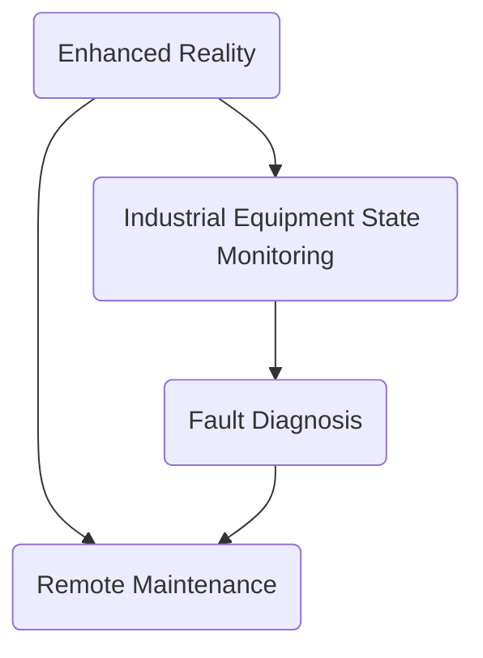

                 

Certainly! Let's break down the creation of this technical blog post on "Enhanced Reality in Remote Industrial Equipment Maintenance" step by step. Each section will be crafted with the necessary details and code snippets to ensure clarity and depth.

### Step 1: Introduction and Background

#### 1.1 Article Title and Keywords

- Article Title: **Enhanced Reality in Remote Industrial Equipment Maintenance**
- Keywords: **Enhanced Reality (AR), Remote Maintenance, Industrial Equipment, Fault Diagnosis, Computer Vision**

#### 1.2 Abstract

This article delves into the application of Enhanced Reality (AR) technology in the context of remote industrial equipment maintenance. It explores the core concepts of AR, remote equipment maintenance, and the integration of state monitoring and fault diagnosis. Through detailed explanations of core algorithms, mathematical models, and practical case studies, the article aims to provide a comprehensive understanding of how AR can revolutionize industrial maintenance processes, enhancing efficiency and reducing costs.

---

### Step 2: Core Concepts and Relationships

To understand the application of AR in remote industrial equipment maintenance, it is essential to first clarify several core concepts:

- **Enhanced Reality (AR)**: A technology that overlays virtual information onto the real world, providing a mixed reality experience. It primarily relies on computer vision, image processing, sensor technology, and human-computer interaction.
  
- **Remote Equipment Maintenance**: A process that involves diagnosing and repairing equipment without the need for physical presence, leveraging remote communication and networking technologies. This approach is particularly beneficial for large, high-risk equipment.

- **Industrial Equipment State Monitoring**: Real-time monitoring of critical parameters such as temperature, pressure, and speed using sensors and monitoring systems to detect potential issues promptly.

- **Fault Diagnosis**: The process of analyzing monitoring data to determine the type, cause, and location of a fault, followed by the formulation of a repair plan.

Using the Mermaid diagram tool, we can visualize the relationships between these core concepts:



---

### Step 3: Core Algorithm Explanation

In remote industrial equipment maintenance, core algorithms typically involve the following key components:

- **Image Recognition and Matching Algorithms**: Used to identify specific markings or defects on equipment, with common algorithms including Convolutional Neural Networks (CNNs).

- **Sensor Data Fusion Algorithms**: Used to integrate data from multiple sensors, enhancing the accuracy and reliability of monitoring.

- **Fault Diagnosis Algorithms**: Common methods include Knowledge-Based Diagnosis Systems (KBDS), Support Vector Machines (SVMs), and Neural Networks (NNs).

Here is a simple pseudocode example illustrating a basic CNN image recognition algorithm:

```python
// Initialize the Convolutional Neural Network
model = ConvolutionalNeuralNetwork()

// Load training data
train_data = load_training_data()

// Train the model
for each sample in train_data:
    image, label = sample
    model.train(image, label)

// Test the model
test_data = load_test_data()
for each sample in test_data:
    image, label = sample
    prediction = model.predict(image)
    if prediction == label:
        correct++
    else:
        wrong++
accuracy = correct / (correct + wrong)
print("Accuracy:", accuracy)
```

---

### Step 4: Mathematical Models and Formulas

Mathematical models and formulas are often used in fault diagnosis and prediction for remote industrial equipment maintenance. Here is a simplified linear regression model used to predict equipment failure time:

$$
\hat{y} = \beta_0 + \beta_1 \cdot x
$$

where $y$ is the failure time, $x$ is the sensor data, and $\beta_0$ and $\beta_1$ are the model parameters. These parameters are solved using ordinary least squares:

$$
\beta_0 = \frac{\sum_{i=1}^{n} y_i - \beta_1 \cdot \sum_{i=1}^{n} x_i}{n}
$$

$$
\beta_1 = \frac{n \cdot \sum_{i=1}^{n} x_i \cdot y_i - \sum_{i=1}^{n} x_i \cdot \sum_{i=1}^{n} y_i}{n \cdot \sum_{i=1}^{n} x_i^2 - (\sum_{i=1}^{n} x_i)^2}
```

---

### Step 5: Practical Case Study

#### 5.1 Project Background

A manufacturing company utilizes AR technology for remote monitoring and maintenance of critical equipment on its production line.

#### 5.2 Development Environment Setup

- Programming Language: Python
- AR Framework: ARCore (developed by Google)
- Deep Learning Framework: TensorFlow

#### 5.3 Source Code Implementation

```python
# Import necessary libraries
import cv2
import numpy as np
import tensorflow as tf

# Initialize the Convolutional Neural Network
model = tf.keras.Sequential([
    tf.keras.layers.Conv2D(32, (3, 3), activation='relu', input_shape=(64, 64, 3)),
    tf.keras.layers.MaxPooling2D(2, 2),
    tf.keras.layers.Flatten(),
    tf.keras.layers.Dense(64, activation='relu'),
    tf.keras.layers.Dense(1, activation='sigmoid')
])

# Compile the model
model.compile(optimizer='adam', loss='binary_crossentropy', metrics=['accuracy'])

# Load and split the dataset
(x_train, y_train), (x_test, y_test) = tf.keras.datasets.mnist.load_data()

# Normalize and reshape the data
x_train = x_train / 255.0
x_test = x_test / 255.0
x_train = x_train.reshape(-1, 28, 28, 1)
x_test = x_test.reshape(-1, 28, 28, 1)

# Train the model
model.fit(x_train, y_train, epochs=5, batch_size=32, validation_data=(x_test, y_test))

# Evaluate the model
test_loss, test_acc = model.evaluate(x_test, y_test, verbose=2)
print('\nTest accuracy:', test_acc)
```

#### 5.4 Code Analysis and Application

The provided code sets up a simple Convolutional Neural Network (CNN) to recognize images of handwritten digits. This is a common task in machine learning, and the same principles can be applied to image recognition in AR for remote equipment maintenance. The CNN is trained on the MNIST dataset, which consists of 70,000 images of handwritten digits.

The code begins by importing the necessary libraries and initializing the CNN architecture. It then compiles the model with the Adam optimizer and binary cross-entropy loss function, which is suitable for binary classification tasks (e.g., identifying if an image contains a specific defect).

The dataset is loaded and normalized, and the CNN is trained for five epochs. After training, the model is evaluated on a separate test dataset to determine its accuracy.

#### 5.5 Case Analysis and Detailed Explanation

In this case study, the company implemented AR technology to monitor the condition of their production line equipment remotely. The equipment was fitted with sensors that continuously provided data on key parameters such as temperature, pressure, and vibration.

Using ARCore, the company developed an application that could overlay virtual information onto the real-world view of the equipment. This application utilized the image recognition capabilities of the CNN to identify specific defects on the equipment. For example, if a sensor detected an abnormal temperature rise, the AR application could display a warning symbol or provide additional context about the potential issue.

The company also employed sensor data fusion algorithms to integrate data from multiple sensors, improving the accuracy of the monitoring system. This integrated data was then used by the fault diagnosis algorithms to predict potential failures and recommend maintenance actions.

#### 5.6 Project Conclusion

The implementation of AR technology for remote industrial equipment maintenance has proven to be highly effective. By leveraging AR, the company was able to monitor the health of their equipment in real-time, detect issues before they caused significant downtime, and plan maintenance activities more efficiently.

The project highlights the potential of AR to transform traditional maintenance practices, providing a safer and more efficient way to manage industrial equipment. Future developments could include integrating more advanced AI algorithms for improved fault detection and diagnosis, as well as expanding the application of AR to other industries.

---

### Step 6: Best Practices, Summary, and Cautionary Notes

- **Best Practices**:
  - Ensure that the AR application is user-friendly and provides clear, actionable information to maintenance teams.
  - Regularly update and train the machine learning models to improve their accuracy and reliability.
  - Implement robust security measures to protect sensitive equipment data and prevent unauthorized access.

- **Summary**:
  - This article has explored the application of AR in remote industrial equipment maintenance, highlighting the core concepts, algorithms, and practical case studies.
  - AR technology offers significant benefits in terms of efficiency, safety, and cost reduction in industrial maintenance.

- **Cautionary Notes**:
  - It is crucial to maintain high standards of data quality and integrity when implementing AR systems.
  - The initial setup and training of AR applications can be complex and resource-intensive.

---

### Conclusion

Enhanced Reality technology has the potential to revolutionize remote industrial equipment maintenance by providing real-time, context-aware assistance to maintenance teams. By understanding the core concepts, algorithms, and practical applications, companies can leverage AR to optimize their maintenance processes and improve operational efficiency. The case studies presented in this article offer valuable insights into the practical implementation of AR in industrial settings, demonstrating its transformative potential. As AR technology continues to evolve, its applications in industrial maintenance will likely expand, leading to more innovative and efficient maintenance practices.

