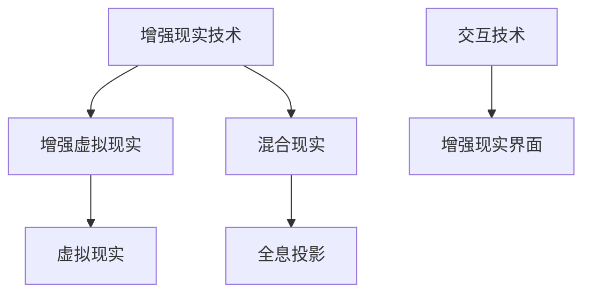

                 

### 关键词

增强现实，零售业，创新应用，技术趋势，用户体验

### 摘要

本文深入探讨了增强现实（AR）在零售业中的创新应用，分析了AR技术的核心概念及其在零售场景中的适用性。文章首先介绍了增强现实的基本原理和技术框架，随后探讨了AR在零售业中的多种应用模式，如虚拟试穿、数字货架和互动营销等。通过具体案例，文章展示了增强现实技术如何提升消费者的购物体验和零售商的业务效率。此外，文章还探讨了增强现实在零售业中的挑战和解决方案，并对未来发展趋势进行了展望。通过本文，读者可以全面了解增强现实技术在零售行业的潜力及其实现路径。

## 增强现实在零售业中的创新应用

随着技术的不断进步，增强现实（AR）技术已经成为零售业创新的重要驱动力。AR技术通过将数字信息叠加到现实世界中，为消费者提供了全新的购物体验。本章节将详细介绍增强现实技术的核心概念，其在零售业中的应用模式，以及这些应用如何改变消费者的购物习惯和零售商的经营策略。

### 一、增强现实技术的核心概念

增强现实技术（Augmented Reality，简称AR）是一种通过计算机技术和传感器设备，将虚拟信息与现实世界融合的交互技术。它通过摄像头捕捉现实环境，然后利用计算机视觉算法生成虚拟信息，并将这些信息实时叠加到用户的视野中。

#### 1.1 基本原理

增强现实的基本原理包括以下几个步骤：

1. **环境感知**：通过摄像头或其他传感器捕捉现实场景。
2. **特征提取**：从捕获的图像中提取关键特征，如边缘、角点等。
3. **定位跟踪**：使用提取的特征进行场景定位和跟踪，确保虚拟信息与真实世界的正确对齐。
4. **信息叠加**：根据定位信息，将虚拟信息叠加到现实场景中。
5. **实时反馈**：通过显示设备，如头戴设备或手机屏幕，将叠加后的图像实时呈现给用户。

#### 1.2 技术框架

增强现实技术框架通常包括以下组件：

1. **传感器**：如摄像头、GPS、陀螺仪等，用于捕捉环境和用户行为。
2. **计算单元**：如处理器或GPU，用于处理传感器数据并执行计算任务。
3. **显示设备**：如头戴设备、平板电脑或手机屏幕，用于向用户展示增强的图像。
4. **内容生成与处理**：包括虚拟信息创建、图像处理和内容管理。

#### 1.3 关键技术

增强现实技术涉及的关键技术包括：

1. **计算机视觉**：用于识别和跟踪现实环境中的物体和特征。
2. **图像处理**：用于对捕获的图像进行预处理和增强。
3. **实时渲染**：用于快速生成和显示虚拟信息。
4. **用户交互**：包括手势识别、语音控制和触屏操作等。

### 二、增强现实在零售业中的应用模式

增强现实技术在零售业中的应用形式多样，以下列举了几种主要的模式：

#### 2.1 虚拟试穿

虚拟试穿是增强现实在零售业中最具代表性的应用之一。通过AR技术，消费者可以在无需实际试穿的情况下，看到自己穿着特定服装的效果。这不仅节省了消费者的时间，还减少了试衣间的拥堵。

#### 2.2 数字货架

数字货架是另一种流行的AR应用模式。通过在现实环境中叠加虚拟货架，零售商可以提供更多样化的商品展示，同时增强顾客的购物体验。

#### 2.3 互动营销

增强现实技术还可以用于互动营销，如虚拟优惠券、互动广告和品牌故事等。这些应用不仅能够吸引顾客的注意力，还能够提高品牌知名度。

#### 2.4 增强现实导购

增强现实导购应用利用AR技术，为消费者提供导航和信息查询服务。例如，在大型购物中心，消费者可以使用AR导航找到他们感兴趣的店铺或产品。

### 三、增强现实对零售业的影响

增强现实技术的应用正在深刻改变零售行业的面貌，以下是它对零售业的主要影响：

#### 3.1 提升用户体验

AR技术为消费者提供了更加直观和沉浸式的购物体验，从而提升了用户满意度。

#### 3.2 增加销售机会

通过虚拟试穿和数字货架等应用，零售商可以提供更多产品信息和展示方式，从而增加销售机会。

#### 3.3 提高运营效率

AR技术可以帮助零售商优化库存管理和商品陈列，从而提高运营效率。

#### 3.4 创新品牌营销

增强现实技术为品牌营销提供了新的手段，如互动广告和虚拟体验等，从而创新品牌营销方式。

### 四、案例分析

以下是一些增强现实在零售业中的成功案例：

#### 4.1 IKEA 的 AR 试衣应用

家具零售巨头IKEA推出了AR试衣应用，允许用户在家中虚拟摆放家具，以评估其与房间空间的适配性。这一应用显著提高了用户的购物决策效率。

#### 4.2 Sephora 的 AR 化妆试妆

化妆品零售商Sephora开发了AR化妆试妆应用，用户可以在手机或平板电脑上尝试不同化妆品的效果，从而更方便地做出购买决策。

#### 4.3 Walmart 的 AR 导购应用

沃尔玛推出了AR导购应用，通过手机摄像头扫描货架上的商品条码，用户可以获取商品详细信息、用户评价和促销信息。

### 五、结论

增强现实技术在零售业中的应用为消费者提供了更加丰富和便捷的购物体验，同时也为零售商带来了新的业务机会。随着技术的不断成熟和应用场景的拓展，增强现实有望在未来的零售行业中发挥更加重要的作用。

### 附录

#### 附录A：增强现实技术资源

- **开发工具**：Unity、ARKit、ARCore
- **开发平台**：iOS、Android、Windows
- **开源库**：Vuforia、ARCore、ARKit

#### 附录B：增强现实技术在零售业中的应用论文与书籍

- **论文**：《增强现实在零售中的应用研究》、《基于增强现实技术的零售体验研究》
- **书籍**：《增强现实技术与应用》、《零售业的数字化转型》

### 作者

作者：AI天才研究院/AI Genius Institute & 禅与计算机程序设计艺术 /Zen And The Art of Computer Programming

### 后续章节

在接下来的章节中，我们将深入探讨增强现实在零售业中的具体应用案例，分析其中的技术挑战和解决方案，并探讨增强现实技术的未来发展趋势。敬请期待。

---

### 文章标题

《增强现实在零售业中的创新应用》

### 关键词

增强现实，零售业，创新应用，技术趋势，用户体验

### 摘要

本文深入探讨了增强现实（AR）在零售业中的创新应用，分析了AR技术的核心概念、应用模式以及对零售业的影响。通过具体案例，文章展示了AR如何提升消费者购物体验和零售商业务效率，并探讨了AR技术的挑战与未来趋势。文章旨在为零售行业提供关于增强现实技术的全面了解和实施指南。

### 增强现实技术的核心概念

增强现实（Augmented Reality，简称AR）是一种通过计算机技术和传感器设备，将虚拟信息与现实世界融合的交互技术。它通过摄像头捕捉现实环境，然后利用计算机视觉算法生成虚拟信息，并将这些信息实时叠加到用户的视野中。

#### 核心概念联系图

#### 基本原理

增强现实技术的基本原理包括以下几个步骤：

1. **环境感知**：通过摄像头或其他传感器捕捉现实场景。
2. **特征提取**：从捕获的图像中提取关键特征，如边缘、角点等。
3. **定位跟踪**：使用提取的特征进行场景定位和跟踪，确保虚拟信息与真实世界的正确对齐。
4. **信息叠加**：根据定位信息，将虚拟信息叠加到现实场景中。
5. **实时反馈**：通过显示设备，如头戴设备或手机屏幕，将叠加后的图像实时呈现给用户。

#### 技术框架

增强现实技术框架通常包括以下组件：

1. **传感器**：如摄像头、GPS、陀螺仪等，用于捕捉环境和用户行为。
2. **计算单元**：如处理器或GPU，用于处理传感器数据并执行计算任务。
3. **显示设备**：如头戴设备、平板电脑或手机屏幕，用于向用户展示增强的图像。
4. **内容生成与处理**：包括虚拟信息创建、图像处理和内容管理。

#### 关键技术

增强现实技术涉及的关键技术包括：

1. **计算机视觉**：用于识别和跟踪现实环境中的物体和特征。
2. **图像处理**：用于对捕获的图像进行预处理和增强。
3. **实时渲染**：用于快速生成和显示虚拟信息。
4. **用户交互**：包括手势识别、语音控制和触屏操作等。

### 增强现实在零售业中的应用模式

增强现实技术在零售业中的应用形式多样，以下列举了几种主要的模式：

#### 1. 虚拟试穿

虚拟试穿是增强现实在零售业中最具代表性的应用之一。通过AR技术，消费者可以在无需实际试穿的情况下，看到自己穿着特定服装的效果。这不仅节省了消费者的时间，还减少了试衣间的拥堵。

#### 2. 数字货架

数字货架是另一种流行的AR应用模式。通过在现实环境中叠加虚拟货架，零售商可以提供更多样化的商品展示，同时增强顾客的购物体验。

#### 3. 互动营销

增强现实技术还可以用于互动营销，如虚拟优惠券、互动广告和品牌故事等。这些应用不仅能够吸引顾客的注意力，还能够提高品牌知名度。

#### 4. 增强现实导购

增强现实导购应用利用AR技术，为消费者提供导航和信息查询服务。例如，在大型购物中心，消费者可以使用AR导航找到他们感兴趣的店铺或产品。

### 应用案例分析

以下是一些增强现实在零售业中的成功案例：

#### 1. IKEA 的 AR 试衣应用

家具零售巨头IKEA推出了AR试衣应用，允许用户在家中虚拟摆放家具，以评估其与房间空间的适配性。这一应用显著提高了用户的购物决策效率。

#### 2. Sephora 的 AR 化妆试妆

化妆品零售商Sephora开发了AR化妆试妆应用，用户可以在手机或平板电脑上尝试不同化妆品的效果，从而更方便地做出购买决策。

#### 3. Walmart 的 AR 导购应用

沃尔玛推出了AR导购应用，通过手机摄像头扫描货架上的商品条码，用户可以获取商品详细信息、用户评价和促销信息。

### 总结

增强现实技术在零售业中的应用为消费者提供了更加丰富和便捷的购物体验，同时也为零售商带来了新的业务机会。通过虚拟试穿、数字货架和互动营销等应用，零售商可以提升消费者的购物体验和忠诚度。然而，要实现这些应用，零售商需要克服技术挑战，如图像识别准确性、实时渲染性能和用户交互体验等。未来，随着技术的不断成熟，增强现实将在零售业中发挥更大的作用。

### 附录

#### 附录A：增强现实技术资源

- **开发工具**：Unity、ARKit、ARCore
- **开发平台**：iOS、Android、Windows
- **开源库**：Vuforia、ARCore、ARKit

#### 附录B：增强现实技术在零售业中的应用论文与书籍

- **论文**：《增强现实在零售中的应用研究》、《基于增强现实技术的零售体验研究》
- **书籍**：《增强现实技术与应用》、《零售业的数字化转型》

### 作者

作者：AI天才研究院/AI Genius Institute & 禅与计算机程序设计艺术 /Zen And The Art of Computer Programming

### 结语

增强现实技术在零售业的创新应用正逐渐改变传统的购物模式，为消费者和零售商带来新的机遇和挑战。随着技术的不断进步，我们可以预见，增强现实将在未来零售行业中扮演更加重要的角色，为消费者提供更加个性化和沉浸式的购物体验。

### 篇章总结

在本章中，我们详细介绍了增强现实技术的核心概念、应用模式及其在零售业中的具体应用。通过案例分析和总结，我们看到了增强现实技术如何为零售业带来创新和变革。接下来，我们将进一步探讨增强现实技术在不同零售场景下的应用实例，以及这些应用对消费者和零售商的影响。敬请期待。

