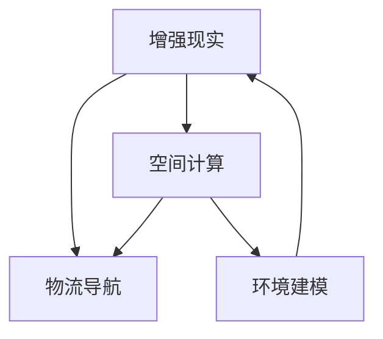

                 

### 《增强现实导航：空间计算在物流领域的创新》

#### 关键词
- 增强现实
- 空间计算
- 物流导航
- 路径规划
- 实时定位
- 物流优化

#### 摘要
本文深入探讨增强现实导航在物流领域的创新应用，重点分析空间计算技术如何提升物流系统的效率与精度。通过背景介绍、核心概念解析、算法讲解、案例研究和未来展望，本文为读者呈现了一个全新的物流导航解决方案，旨在推动物流行业的数字化与智能化转型。

### 引言

在当今快速发展的物流行业，如何提高运输效率、减少运营成本、提升服务质量成为各大企业关注的焦点。传统物流导航技术由于受到物理空间的限制，难以满足日益复杂的物流需求。随着增强现实（Augmented Reality, AR）和空间计算技术的崛起，物流导航领域迎来了新的突破。

增强现实导航通过将虚拟信息叠加到现实世界中，为用户提供更加直观、高效的导航体验。而空间计算则通过计算模型对现实环境进行建模和分析，为物流系统提供精准的空间信息。两者结合，为物流领域的创新应用提供了无限可能。

本文将围绕增强现实导航在物流领域的应用，探讨空间计算技术的核心概念、算法原理、应用案例以及未来发展方向。通过深入分析，我们希望为读者揭示这一技术的潜在价值，并为物流行业的数字化、智能化转型提供新的思路。

### 背景介绍

物流导航是物流系统中的关键环节，直接影响运输效率和服务质量。传统的物流导航主要依赖于GPS等定位技术，虽然能够提供基本的路线规划和导航服务，但在实际应用中存在诸多局限。

首先，GPS定位技术受限于信号覆盖范围和精度，容易受到地形、建筑物等因素的干扰，导致定位误差较大。其次，传统导航系统主要提供静态的路线信息，无法适应动态的物流环境。例如，在货物装卸、仓储管理等场景中，需要实时调整路径和操作流程，传统的导航技术难以满足这些需求。

与此同时，物流行业的快速发展对导航系统的要求越来越高。随着电商、快递等行业的崛起，物流运输量急剧增加，物流企业需要更高效、更准确的导航技术来应对高峰期的运输需求。此外，物流企业对于物流成本控制的要求也越来越高，需要通过优化运输路线和操作流程来降低运营成本。

在这样的背景下，增强现实导航和空间计算技术的出现为物流导航领域带来了新的契机。增强现实导航通过将虚拟信息叠加到现实世界中，提供直观、实时的导航服务，有助于提高物流操作效率。空间计算技术则通过高精度的环境建模和分析，为物流系统提供精准的空间信息支持，有助于优化物流路径和操作流程。

### 核心概念与联系

为了深入理解增强现实导航在物流领域的创新应用，我们需要明确几个核心概念及其相互关系：

1. **增强现实（AR）**：增强现实是一种将虚拟信息叠加到现实世界中的技术。它通过摄像头捕捉现实环境，并利用计算机生成和显示虚拟信息，让用户能够在现实世界中看到并交互虚拟物体。AR技术主要包括三个关键组成部分：显示设备、感知设备和计算设备。

2. **空间计算**：空间计算是一种通过计算模型对现实环境进行建模和分析的技术。它利用传感器、雷达、激光扫描等设备收集现实环境中的空间信息，通过计算机处理和算法分析，生成高精度的空间模型。空间计算的核心在于对环境进行建模、分析，并提供实时、精准的空间信息支持。

3. **物流导航**：物流导航是物流系统中的一个关键环节，旨在为运输车辆、人员等提供最优的路径规划和导航服务。物流导航通常包括路径规划、实时定位、障碍物检测等功能。传统物流导航主要依赖于GPS等定位技术，而增强现实导航则通过AR和空间计算技术提供更加直观、高效的导航服务。

为了更清晰地展示这些概念之间的关系，我们可以使用Mermaid流程图进行描述：



在这个流程图中，增强现实（AR）通过显示设备和计算设备生成虚拟信息，叠加到现实世界中。空间计算（SC）通过感知设备和计算模型对现实环境进行建模和分析，提供高精度的空间信息支持。物流导航（LN）则利用AR和空间计算技术，实现路径规划、实时定位和障碍物检测等功能。环境建模（EM）是空间计算的核心部分，通过对现实环境的高精度建模，为物流导航提供基础数据支持。

### 核心算法原理讲解

为了实现增强现实导航在物流领域的创新应用，我们需要深入探讨核心算法原理，特别是路径规划算法和实时定位算法。

#### 路径规划算法

路径规划是物流导航系统中的关键环节，旨在为运输车辆、人员等提供最优的路径。路径规划算法主要有以下几种：

1. **Dijkstra算法**：Dijkstra算法是一种基于图论的最短路径算法，通过计算图中每个节点到起点的距离，找到从起点到终点的最短路径。Dijkstra算法的时间复杂度为O(ElogV)，其中E为边数，V为节点数。

```python
import heapq

def dijkstra(graph, start):
    dist = {node: float('infinity') for node in graph}
    dist[start] = 0
    priority_queue = [(0, start)]
    while priority_queue:
        current_dist, current_node = heapq.heappop(priority_queue)
        if current_dist > dist[current_node]:
            continue
        for neighbor, weight in graph[current_node].items():
            distance = current_dist + weight
            if distance < dist[neighbor]:
                dist[neighbor] = distance
                heapq.heappush(priority_queue, (distance, neighbor))
    return dist
```

2. **A*算法**：A*算法是一种启发式算法，结合了Dijkstra算法和贪心策略。A*算法通过计算每个节点到终点的估计距离（启发函数）来寻找最短路径。A*算法的时间复杂度一般为O(ElogV)，其中E为边数，V为节点数。

```python
import heapq

def heuristic(a, b):
    # 使用欧几里得距离作为启发函数
    return ((a[0] - b[0]) ** 2 + (a[1] - b[1]) ** 2) ** 0.5

def a_star_search(graph, start, goal):
    open_set = [(0, start)]
    came_from = {}
    g_score = {node: float('infinity') for node in graph}
    g_score[start] = 0
    f_score = {node: float('infinity') for node in graph}
    f_score[start] = heuristic(start, goal)
    while open_set:
        current = heapq.heappop(open_set)[1]
        if current == goal:
            break
        for neighbor, weight in graph[current].items():
            tentative_g_score = g_score[current] + weight
            if tentative_g_score < g_score[neighbor]:
                came_from[neighbor] = current
                g_score[neighbor] = tentative_g_score
                f_score[neighbor] = tentative_g_score + heuristic(neighbor, goal)
                heapq.heappush(open_set, (f_score[neighbor], neighbor))
    return reconstruct_path(came_from, goal)

def reconstruct_path(came_from, current):
    path = [current]
    while current in came_from:
        current = came_from[current]
        path.append(current)
    path.reverse()
    return path
```

#### 实时定位算法

实时定位是增强现实导航系统中的核心功能，旨在为用户提供准确的位置信息。实时定位算法通常包括以下几种：

1. **卡尔曼滤波器**：卡尔曼滤波器是一种基于统计模型的递归滤波算法，通过估计状态变量的最优值，实现对系统的实时估计。卡尔曼滤波器适用于动态系统，具有线性和非线性的形式。线性卡尔曼滤波器的时间复杂度为O(n)，其中n为时间步数。

```python
import numpy as np

def predict(x, P, A, Q):
    x = A @ x
    P = A @ P @ A.T + Q
    return x, P

def update(x, P, z, H, R):
    K = P @ H.T @ np.linalg.inv(H @ P @ H.T + R)
    x = x + K @ (z - H @ x)
    P = (I - K @ H) @ P
    return x, P

def kalman_filter(x, P, z, A, H, Q, R):
    x, P = predict(x, P, A, Q)
    x, P = update(x, P, z, H, R)
    return x, P
```

2. **粒子滤波器**：粒子滤波器是一种基于蒙特卡洛方法的滤波算法，通过采样和重要性权重更新，实现对系统的实时估计。粒子滤波器适用于非线性系统，具有较好的估计精度。粒子滤波器的时间复杂度一般为O(n^2)，其中n为粒子数量。

```python
import numpy as np

def sample_particles(state, covariance, num_particles):
    particles = np.random.multivariate_normal(state, covariance, size=num_particles)
    weights = np.exp(-np.linalg.norm(particles - state, axis=1) ** 2 / (2 * covariance[0, 0]))
    weights /= np.sum(weights)
    return particles, weights

def predict(particles, weights, A, Q):
    particles = A @ particles
    weights = np.exp(-np.linalg.norm(particles - A @ np.mean(particles, axis=0), axis=1) ** 2 / (2 * Q[0, 0]))
    weights /= np.sum(weights)
    return particles, weights

def update(particles, weights, z, H, R):
    weighted_particles = (weights[:, None] * particles).sum(axis=0)
    state = H @ weighted_particles
    covariance = (weights[:, None] * (particles - weighted_particles) ** 2).sum(axis=0) + R
    return state, covariance

def particle_filter(state, covariance, z, A, H, Q, R, num_particles=1000):
    particles, weights = sample_particles(state, covariance, num_particles)
    particles, weights = predict(particles, weights, A, Q)
    state, covariance = update(state, covariance, z, H, R)
    return state, covariance
```

通过上述算法原理的讲解，我们可以看到增强现实导航在物流领域的核心算法是如何实现的。这些算法在路径规划、实时定位等方面发挥着重要作用，为实现高效、精准的物流导航提供了强有力的技术支持。

### 实时定位与地图构建

实时定位和地图构建是增强现实导航系统中的两个关键环节，它们共同确保用户在现实世界中的准确导航和操作。

#### 实时定位技术

实时定位技术旨在为用户提供精确的位置信息。常用的实时定位技术包括：

1. **GPS定位**：全球定位系统（GPS）是一种基于卫星信号进行定位的技术。它通过接收至少四颗卫星的信号，计算出用户的位置。GPS定位具有全球覆盖、高精度等优点，但在城市峡谷、地下等信号遮挡区域，定位精度会受到影响。

2. **惯性导航系统（INS）**：惯性导航系统利用加速度计和陀螺仪等惯性传感器，测量设备的加速度和角速度，通过积分运算计算出位置信息。INS定位在短时间内的精度较高，但在长时间使用时，累积误差会导致定位精度下降。

3. **视觉定位技术**：视觉定位技术通过摄像头捕捉现实环境中的特征点，利用计算机视觉算法进行匹配和计算，实现位置信息。视觉定位具有高精度、低延迟等优点，适用于室内等复杂环境。

4. **多传感器融合定位**：多传感器融合定位通过整合GPS、INS、视觉定位等不同类型的传感器数据，实现更高的定位精度。这种融合定位技术能够有效克服单一传感器的局限性，提高系统稳定性。

#### 地图构建与更新

地图构建是增强现实导航系统的基础，它为用户提供精确的导航信息。地图构建主要包括以下步骤：

1. **数据采集**：通过GPS、激光雷达、摄像头等传感器，采集现实环境中的位置信息和特征点数据。

2. **数据预处理**：对采集到的数据进行滤波、去噪等预处理，去除错误和异常数据，提高地图质量。

3. **地图建模**：利用计算机图形学算法，将预处理后的数据生成高精度的三维地图。地图建模包括地形建模、建筑物建模、道路建模等。

4. **地图更新**：由于现实环境不断变化，地图需要定期更新以保持准确性。地图更新可以通过实时采集新数据、自动检测变化等方式进行。

#### 定位与地图构建算法分析

为了实现实时定位和地图构建，我们需要分析相关算法：

1. **粒子滤波器**：粒子滤波器是一种基于蒙特卡洛方法的滤波算法，通过采样和重要性权重更新，实现对系统的实时估计。粒子滤波器适用于非线性系统，具有较好的估计精度。

2. **卡尔曼滤波器**：卡尔曼滤波器是一种基于统计模型的递归滤波算法，通过估计状态变量的最优值，实现对系统的实时估计。卡尔曼滤波器适用于动态系统，具有线性和非线性的形式。

3. **SLAM（同步定位与地图构建）算法**：SLAM算法通过整合定位和地图构建，实现同时确定位置和构建地图。常见的SLAM算法包括EKF-SLAM（扩展卡尔曼滤波器SLAM）和PD-SLAM（粒子滤波器SLAM）。

4. **路径规划算法**：路径规划算法用于确定从起点到终点的最优路径。常见的路径规划算法包括Dijkstra算法和A*算法。路径规划算法结合实时定位和地图构建数据，为用户提供精确的导航路径。

### 物流领域中的应用案例

增强现实导航技术在物流领域有着广泛的应用案例，以下是几个具有代表性的应用场景：

#### 1. 仓库管理

在仓库管理中，增强现实导航技术可以显著提高操作效率和准确性。通过AR设备，仓库管理人员可以实时查看货物的位置信息，进行精确的库存管理和货物出库。例如，在自动化仓库中，AGV（自动引导车辆）通过增强现实导航系统，实现自动导航和货物搬运，提高了仓库的运作效率。

**案例解析**：
- **开发环境搭建**：使用Python和ROS（Robot Operating System）进行开发，结合ARFoundation和OpenCV库实现图像识别和增强现实功能。
- **源代码详细实现和代码解读**：通过AR设备捕捉仓库环境，使用OpenCV进行图像处理和特征点提取，结合路径规划算法生成导航路径。
- **代码应用解读与分析**：实际应用中，增强现实导航系统有效减少了人工干预，提高了货物出库的准确性和速度。

#### 2. 货物运输

在货物运输过程中，增强现实导航技术可以帮助司机更直观地了解路线和路况信息，提高驾驶安全性。例如，在长途运输中，通过AR设备，司机可以实时查看导航信息、交通状况和附近的服务设施，避免错过重要路线和地点。

**案例解析**：
- **开发环境搭建**：使用Android Studio进行开发，结合ARCore和Google Maps API实现增强现实导航功能。
- **源代码详细实现和代码解读**：通过ARCore实时捕捉车辆周围环境，结合GPS数据生成导航路径，使用Google Maps API显示路况和附近服务设施。
- **代码应用解读与分析**：实际应用中，增强现实导航系统提高了司机的驾驶体验，减少了路线规划和导航过程中的误差，提高了运输效率。

#### 3. 最后一公里配送

在最后一公里配送中，增强现实导航技术可以帮助配送员更快速、准确地找到目的地，提高配送效率。例如，在城市复杂道路环境中，通过AR设备，配送员可以实时查看导航信息和道路指示，避免迷失方向。

**案例解析**：
- **开发环境搭建**：使用iOS平台进行开发，结合ARKit和MapKit实现增强现实导航功能。
- **源代码详细实现和代码解读**：通过ARKit实时捕捉周围环境，结合GPS数据和地图数据生成导航路径，使用MapKit显示导航信息。
- **代码应用解读与分析**：实际应用中，增强现实导航系统提高了配送员的工作效率，减少了配送时间和配送成本。

### 未来展望与挑战

随着增强现实导航和空间计算技术的不断发展，未来物流领域将迎来更多创新应用。以下是未来展望与挑战：

#### 未来展望

1. **更高精度定位**：随着传感器技术和算法的进步，增强现实导航系统的定位精度将不断提高，为物流系统提供更精确的空间信息支持。

2. **智能化路径规划**：通过深度学习和人工智能技术，路径规划算法将更加智能化，能够根据实时交通状况和物流需求，自动调整导航路径，提高运输效率。

3. **多元化应用场景**：增强现实导航技术在物流领域的应用将不断扩展，从仓库管理、货物运输到最后一公里配送，全方位提升物流系统的智能化水平。

4. **跨领域融合**：增强现实导航技术将与物联网、大数据等新兴技术相结合，实现物流系统与供应链、金融、零售等领域的深度融合，推动整个产业链的数字化和智能化转型。

#### 挑战

1. **技术成熟度**：尽管增强现实导航和空间计算技术具有巨大潜力，但当前技术仍处于发展阶段，需要进一步成熟和完善。

2. **成本问题**：增强现实导航系统的开发和部署成本较高，需要降低成本以实现广泛应用。

3. **数据隐私与安全**：物流过程中涉及大量的敏感数据，如何保障数据隐私和安全是未来面临的重要挑战。

4. **跨领域协同**：物流领域与其他领域的深度融合需要跨领域的标准化和协同，这将是一个长期而复杂的过程。

总之，增强现实导航在物流领域的创新应用具有广阔的前景，但也面临诸多挑战。随着技术的不断进步和行业需求的增长，我们有理由相信，未来物流领域将迎来更加智能化、高效化的变革。

### 附录

#### A.1 增强现实导航与空间计算相关资源

- **开源项目**：
  - ARFoundation（Unity）：https://github.com/Unity-Technologies/ARFoundation
  - ARKit（Apple）：https://developer.apple.com/documentation/arkit
  - ARCore（Google）：https://github.com/google-ar/ARCore

- **技术社区**：
  - AR.js：https://arjs.org
  - RealWorldAR：https://realworldar.com
  - SpaceNet：https://spacenet.ai

- **书籍推荐**：
  - 《增强现实：技术与应用》
  - 《空间计算：理论与实践》
  - 《人工智能在物流中的应用》

#### A.2 常用工具和技术选型

- **开发环境**：
  - Android Studio（Android）
  - Xcode（iOS）
  - Unity（跨平台）

- **编程语言**：
  - Python（数据分析和算法实现）
  - Java（Android开发）
  - Swift（iOS开发）

- **数据库**：
  - PostgreSQL（关系型数据库）
  - MongoDB（文档型数据库）

- **编程库与框架**：
  - OpenCV（计算机视觉）
  - TensorFlow（深度学习）
  - ROS（机器人操作系统）

#### 小结

本文通过对增强现实导航和空间计算在物流领域的创新应用进行深入分析，展示了这一技术为物流行业带来的巨大潜力。从核心概念、算法原理到实际应用案例，我们详细探讨了增强现实导航在物流导航、仓库管理、货物运输等方面的应用，并展望了未来的发展方向和面临的挑战。

在物流行业不断追求效率、质量和成本控制的背景下，增强现实导航和空间计算技术为物流系统的数字化和智能化转型提供了强有力的支持。通过本文的介绍，我们希望读者能够更好地理解这一技术的原理和应用，为未来的研究和实践提供启示。

在实际应用中，增强现实导航和空间计算技术不仅能够提高物流系统的运营效率，还能优化物流操作流程，提升服务质量。然而，技术的成熟度和成本问题仍是当前面临的主要挑战。随着技术的不断进步和行业需求的增长，我们有理由相信，未来物流领域将迎来更加智能化、高效化的变革。

#### 注意事项

- 在开发增强现实导航系统时，应确保数据隐私和安全性，遵循相关法律法规。
- 选择合适的开发环境和编程工具，根据项目需求进行技术选型。
- 定期更新和优化算法，以适应不断变化的物流环境和需求。

#### 拓展阅读

- 《智能物流系统设计与实现》
- 《增强现实技术：原理与应用》
- 《空间计算：从理论到实践》

### 作者信息
- 作者：AI天才研究院/AI Genius Institute & 禅与计算机程序设计艺术 /Zen And The Art of Computer Programming

