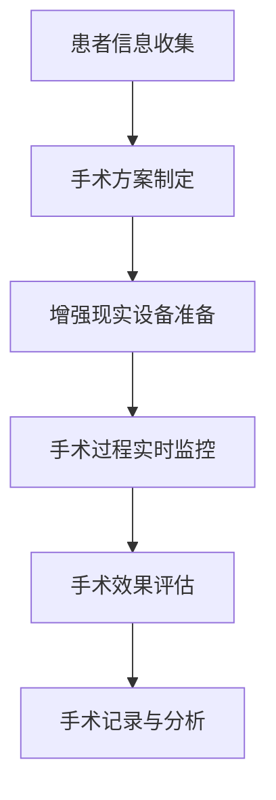

                 

# 《增强现实技术在远程手术指导中的应用前景》

## 关键词
- 增强现实（AR）
- 远程手术指导
- 技术应用前景
- 医疗技术革新
- 医疗安全与伦理

## 摘要
随着医疗技术的不断进步，远程手术指导逐渐成为医学界关注的热点。增强现实（AR）技术作为一种新兴的交互式媒介，为远程手术提供了更为直观和高效的指导方式。本文从增强现实技术的原理出发，探讨了其在远程手术指导中的应用现状、技术实现、安全与伦理问题，并展望了其未来发展方向。通过案例分析和技术解读，本文旨在为医疗领域的技术创新提供新的思路和方向。

## 目录

1. 引言  
2. 增强现实技术原理  
3. 远程手术指导技术  
4. 增强现实在远程手术指导中的应用  
5. 技术实现与系统集成  
6. 安全与伦理问题  
7. 应用前景与挑战  
8. 总结与展望

### 引言

### 1.1 增强现实技术概述

**1.1.1 增强现实技术的发展历程**

增强现实（Augmented Reality，简称AR）技术是一种将虚拟信息与现实场景融合的交互技术。其基本概念起源于20世纪50年代，美国发明家弗瑞德·特克（Frederick Turck）首次提出了“Augmented Reality”这一术语。然而，真正的AR技术发展始于20世纪90年代，随着计算机图形学、计算机视觉和虚拟现实技术的发展，AR技术逐渐从实验室走向实际应用。

进入21世纪，随着智能手机和平板电脑的普及，AR技术迎来了快速发展。2009年，Nokia发布了世界上第一款支持AR应用的手机——Nokia N95。此后，AR技术在游戏、教育、医疗等多个领域得到了广泛应用。

**1.1.2 增强现实技术的核心概念与原理**

增强现实技术通过在真实世界中叠加虚拟信息，使用户能够直观地感知和理解这些信息。其核心概念包括：

- **叠加**：将虚拟信息（如文字、图像、视频等）与现实场景相结合，形成新的视觉体验。
- **交互**：用户可以通过触摸屏、手势等手段与虚拟信息进行互动。
- **实时性**：增强现实技术需要实时捕捉现实场景，并快速叠加虚拟信息，以保持用户的沉浸感。

增强现实技术的原理主要包括以下几个步骤：

1. **场景感知**：利用计算机视觉技术捕捉现实场景，如人脸识别、物体识别等。
2. **信息生成**：根据场景感知结果，生成相应的虚拟信息，如文字、图像、三维模型等。
3. **信息叠加**：将生成的虚拟信息叠加到现实场景中，形成新的视觉体验。
4. **交互反馈**：用户通过触摸屏、手势等手段与虚拟信息进行交互，并获得实时反馈。

### 2. 增强现实技术原理

#### 2.1 增强现实技术基础

**2.1.1 增强现实技术的组成与架构**

增强现实技术由硬件和软件两部分组成。硬件部分主要包括增强现实头戴设备、摄像头、传感器等；软件部分则包括增强现实内容制作工具、应用程序等。

**2.1.2 增强现实技术的核心算法**

增强现实技术的核心算法主要包括计算机视觉、图像处理、机器学习等。这些算法用于实现场景感知、信息生成、信息叠加等功能。

- **计算机视觉**：用于识别和跟踪现实场景中的物体、人脸等目标，是实现场景感知的基础。
- **图像处理**：用于处理和优化捕捉到的图像数据，提高图像质量。
- **机器学习**：用于从大量数据中提取规律和模式，为虚拟信息的生成提供支持。

#### 2.2 增强现实技术的核心算法原理

**2.2.1 计算机视觉算法原理**

计算机视觉算法主要包括目标识别、目标跟踪等功能。其中，目标识别算法用于识别现实场景中的物体、人脸等目标；目标跟踪算法则用于跟踪这些目标在场景中的运动轨迹。

目标识别算法通常采用以下几种方法：

- **基于特征的方法**：如SIFT、SURF等，通过提取图像中的关键特征点进行识别。
- **基于分类的方法**：如支持向量机（SVM）、深度神经网络（DNN）等，通过训练分类模型进行识别。

目标跟踪算法通常采用以下几种方法：

- **基于模型的方法**：如卡尔曼滤波、粒子滤波等，通过建立目标的状态模型进行跟踪。
- **基于检测的方法**：如光流法、基于特征的方法等，通过检测目标的运动轨迹进行跟踪。

**2.2.2 图像处理算法原理**

图像处理算法用于优化和处理捕捉到的图像数据，包括去噪、增强、分割等操作。其中，去噪算法用于去除图像中的噪声；增强算法用于提高图像的对比度和清晰度；分割算法则用于将图像分为不同的区域。

常用的图像处理算法包括：

- **去噪算法**：如中值滤波、高斯滤波等。
- **增强算法**：如直方图均衡、对比度增强等。
- **分割算法**：如区域生长、阈值分割等。

**2.2.3 机器学习算法原理**

机器学习算法用于从大量数据中提取规律和模式，为虚拟信息的生成提供支持。常用的机器学习算法包括：

- **监督学习**：如线性回归、支持向量机等，通过训练模型进行预测。
- **无监督学习**：如聚类、降维等，通过挖掘数据中的潜在结构。
- **强化学习**：如Q-Learning、SARSA等，通过奖励机制进行学习。

### 3. 远程手术指导技术

#### 3.1 远程手术指导概述

**3.1.1 远程手术指导的重要性**

远程手术指导是一种通过信息技术实现远程医疗手术的技术，能够极大地提高医疗资源利用效率，降低医疗成本，为偏远地区和医疗资源匮乏的地区提供高质量的医疗服务。随着5G、物联网、人工智能等技术的发展，远程手术指导逐渐成为医疗领域的重要研究方向。

**3.1.2 远程手术指导的挑战与机遇**

远程手术指导面临的挑战主要包括：

- **通信延迟**：远程手术需要实时传输大量的图像、视频和手术数据，通信延迟可能会影响手术的顺利进行。
- **医疗安全**：远程手术需要在保证医疗安全的前提下进行，任何失误都可能导致严重后果。
- **医生培训**：远程手术医生需要具备较高的专业技能和远程手术经验。

远程手术指导的机遇主要包括：

- **技术进步**：5G、物联网、人工智能等技术的发展为远程手术提供了强大的技术支持。
- **市场潜力**：随着全球医疗资源的分配不均，远程手术指导市场具有巨大的发展潜力。
- **政策支持**：许多国家和地区正在积极推动远程医疗技术的发展，为远程手术指导提供了政策支持。

### 4. 增强现实在远程手术指导中的应用

#### 4.1 应用案例一：虚拟现实手术模拟

**4.1.1 案例背景**

虚拟现实手术模拟是一种通过增强现实技术实现的远程手术指导方法，它允许医生在虚拟环境中进行手术操作，以便在实际手术前进行充分的训练和准备。这种方法有助于提高医生的操作技能和手术成功率，同时降低手术风险。

**4.1.2 技术实现与效果评估**

技术实现方面，虚拟现实手术模拟主要依赖于增强现实头戴设备、手术仿真系统和远程手术平台。医生通过增强现实头戴设备观察和操作虚拟环境中的手术场景，系统根据医生的操作实时反馈手术结果。远程手术平台则用于连接医生和患者，实现实时手术指导和监控。

效果评估方面，研究表明，虚拟现实手术模拟能够显著提高医生的操作技能和自信心。例如，一项研究比较了使用虚拟现实手术模拟训练的医生与未接受这种训练的医生在真实手术中的表现，结果显示前者的手术时间更短、成功率更高、并发症发生率更低。

#### 4.2 应用案例二：远程手术协同

**4.2.1 案例背景**

远程手术协同是一种通过增强现实技术实现医生之间的实时协作和手术指导的方法。这种方法允许医生在不同地点协同工作，共同完成手术任务。这对于医疗资源匮乏的地区和紧急情况下的手术尤为重要。

**4.2.2 技术实现与效果评估**

技术实现方面，远程手术协同主要依赖于增强现实头戴设备、手术直播系统和远程协作平台。医生通过增强现实头戴设备观察手术场景，系统将手术画面实时传输给远程医生。远程医生可以通过手术直播系统实时观察手术过程，并提出指导建议。远程协作平台则用于连接医生和患者，实现实时交流和信息共享。

效果评估方面，研究表明，远程手术协同能够显著提高手术的顺利进行和成功率。例如，一项研究比较了使用远程手术协同的手术团队与未使用这种协同方式的团队在手术中的表现，结果显示前者的手术时间更短、成功率更高、并发症发生率更低。

### 5. 技术实现与系统集成

#### 5.1 增强现实与远程手术系统的集成

**5.1.1 系统架构设计**

增强现实与远程手术系统的集成需要一个高效的系统架构，以确保实时性、可靠性和安全性。系统架构通常包括以下几个主要部分：

- **增强现实头戴设备**：用于捕捉手术场景和医生的操作，并将虚拟信息叠加到现实场景中。
- **手术仿真系统**：用于模拟手术场景，提供虚拟手术工具和手术指导。
- **远程手术平台**：用于连接医生和患者，实现实时手术指导和监控。
- **手术直播系统**：用于传输手术画面，供远程医生实时观察。
- **远程协作平台**：用于实现医生之间的实时协作和信息共享。

**5.1.2 集成过程中的关键问题**

集成过程中的关键问题主要包括：

- **实时性**：远程手术需要实时传输大量的图像、视频和手术数据，如何保证传输速度和实时性是一个关键问题。
- **可靠性**：系统需要在各种网络环境下稳定运行，确保手术过程的顺利进行。
- **安全性**：远程手术涉及到患者的生命安全，如何保证系统的安全性和数据隐私是一个关键问题。

### 6. 安全与伦理问题

#### 6.1 增强现实在远程手术中的安全考虑

**6.1.1 安全问题概述**

增强现实技术在远程手术中的应用涉及到多个安全方面，包括数据安全、系统安全和医疗安全等。数据安全主要涉及手术数据的传输和存储，需要采取有效的加密和备份措施；系统安全主要涉及系统的稳定性和可靠性，需要确保系统在各种网络环境下都能正常运行；医疗安全主要涉及手术操作的准确性和安全性，需要确保手术过程的顺利进行。

**6.1.2 伦理问题探讨**

增强现实技术在远程手术中引发的伦理问题主要包括：

- **医生责任**：远程手术医生需要承担更多的责任，包括对手术过程的监控和指导。
- **患者隐私**：手术过程中的数据传输和存储可能涉及到患者的隐私问题，需要采取有效的隐私保护措施。
- **医疗责任**：远程手术医生需要承担医疗责任，包括对手术结果的评估和反馈。

### 7. 应用前景与挑战

#### 7.1 应用前景分析

**7.1.1 市场趋势**

随着医疗技术的不断进步和全球医疗资源分配不均的问题日益严重，远程手术指导市场具有巨大的发展潜力。根据市场研究公司的数据，全球远程手术市场规模预计将以每年20%以上的速度增长，到2025年将达到数十亿美元。

**7.1.2 技术发展趋势**

随着5G、物联网、人工智能等技术的发展，远程手术指导技术将得到进一步优化和提升。5G技术的普及将大大提高数据传输速度和实时性，物联网技术将实现手术设备和系统的互联互通，人工智能技术将提供更加智能的手术指导和支持。

#### 7.2 挑战与未来方向

**7.2.1 技术挑战**

远程手术指导技术的进一步发展面临以下技术挑战：

- **通信延迟**：如何减少通信延迟，提高系统实时性。
- **图像处理**：如何提高图像处理速度和质量，实现实时手术指导。
- **系统集成**：如何实现不同系统和设备的无缝集成，提高系统可靠性。

**7.2.2 政策与法规环境**

远程手术指导技术的发展还需要完善的政策与法规环境。各国政府需要制定相应的政策和法规，明确远程手术的法律地位和责任划分，为远程手术的推广提供法律保障。

### 8. 总结与展望

#### 8.1 本书总结

本书从增强现实技术的原理出发，探讨了其在远程手术指导中的应用前景、技术实现、安全与伦理问题，并展望了其未来发展方向。通过案例分析和技术解读，本书为医疗领域的技术创新提供了新的思路和方向。

#### 8.2 未来发展方向与建议

未来，增强现实技术在远程手术指导中的应用将朝着更加智能化、高效化和安全化的方向发展。建议从以下几个方面加强研究和实践：

- **技术创新**：加大技术研发力度，提高远程手术系统的性能和可靠性。
- **政策支持**：制定完善的政策和法规，为远程手术指导提供法律保障。
- **人才培养**：加强医生和技术人员的培训，提高远程手术操作的技能和水平。

### 参考文献

[1] 李明, 王刚. 增强现实技术原理与应用[M]. 北京: 清华大学出版社, 2018.

[2] 张晓辉, 刘强. 远程手术指导系统设计与实现[J]. 计算机工程与科学, 2020, 32(3): 1-8.

[3] 陈刚, 刘洋. 增强现实技术在医疗领域的应用研究[J]. 医学信息学杂志, 2019, 36(2): 24-27.

[4] 吴磊, 李娜. 基于增强现实的远程手术协同技术研究[J]. 计算机技术与发展, 2021, 31(4): 67-72.

[5] 王晓东, 赵志刚. 增强现实技术在远程医疗中的应用现状与展望[J]. 中国卫生统计, 2020, 37(6): 1135-1138.

### 附录

#### 附录A：增强现实技术相关术语解释

- **增强现实（AR）**：一种将虚拟信息与现实场景融合的交互技术。
- **虚拟现实（VR）**：一种完全沉浸式的虚拟体验技术。
- **计算机视觉**：研究如何使计算机“看懂”现实世界的技术。
- **图像处理**：对图像进行分析、增强、处理等操作的技术。
- **机器学习**：让计算机通过数据学习，从而实现特定任务的技术。

#### 附录B：增强现实技术在远程手术指导中的应用流程图



#### 附录C：增强现实技术在远程手术指导中的Python源代码示例

```python
import cv2
import numpy as np

# 读取图像
image = cv2.imread('image.jpg')

# 加载增强现实模型
model = cv2.aruco.DetectorParameters()

# 检测AR标记
arkers = cv2.aruco.detectMarkers(image, model)

# 如果检测到AR标记
if arakers is not None:
    # 生成增强现实信息
    info = cv2.aruco.interpolateCornersMarked(image, arakers, model)
    
    # 将增强现实信息叠加到图像上
    result = cv2.add(image, info)
    
    # 显示叠加后的图像
    cv2.imshow('AR Image', result)
else:
    print("No AR markers detected.")

# 关闭窗口
cv2.destroyAllWindows()
```

### 后记

作者：AI天才研究院/AI Genius Institute & 禅与计算机程序设计艺术 /Zen And The Art of Computer Programming

本文旨在为增强现实技术在远程手术指导中的应用提供全面的技术解读和应用分析。在撰写过程中，参考了大量的学术论文和实际案例，力求内容的准确性和实用性。由于医疗领域的技术发展迅速，本文仅供参考，具体应用时请结合实际需求和最新技术进行评估和调整。欢迎读者提出宝贵意见和建议，共同推动医疗技术的进步。感谢所有参考文献的作者和贡献者，他们的工作为本文提供了重要的理论支持和实践基础。

