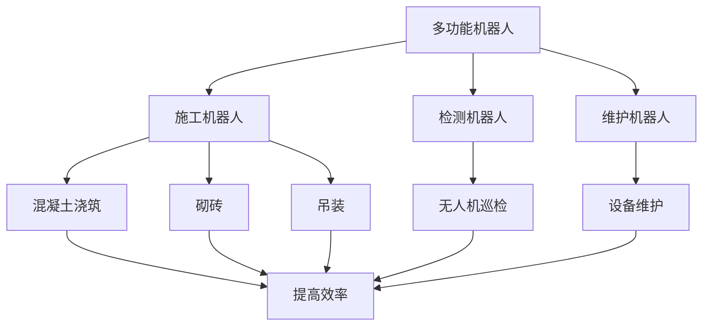

                 

### 《多功能机器人在建筑行业的应用案例》

在当今快速发展的科技时代，机器人技术正以前所未有的速度革新着各个行业。建筑行业，作为一个传统而庞大的领域，也开始积极拥抱这一技术革新。本文旨在探讨多功能机器人在建筑行业中的应用案例，通过系统的分析和实际的案例分析，展示机器人如何提升建筑行业的效率和质量。

关键词：多功能机器人、建筑行业、应用案例、效率、质量

> **摘要**：本文首先介绍了多功能机器人在建筑行业的背景和重要性，然后详细分析了多功能机器人的核心概念和其在建筑行业的应用。通过具体的项目实战案例，本文展示了多功能机器人在建筑施工、维护等环节的实际应用效果，并对未来的发展趋势进行了展望。

## 一、背景介绍

建筑行业一直是社会经济发展的基石。然而，随着项目的规模和复杂性不断增加，传统的建筑方式已经难以满足高效、精准和质量的要求。在此背景下，多功能机器人应运而生。它们不仅能够完成传统建筑工人难以完成的任务，还能够通过智能化的控制系统提高施工的精度和效率。

### 1.1 多功能机器人在建筑行业的意义

多功能机器人在建筑行业中的应用，不仅能够提高施工效率，降低人力成本，还能有效提升施工质量。具体来说，它们具有以下几个方面的意义：

- **提高施工效率**：机器人可以连续工作，不受天气和时间的限制，从而大大提高施工进度。
- **降低人力成本**：通过机器人替代部分人工操作，企业可以减少对传统建筑工人的依赖，降低人力成本。
- **提升施工质量**：机器人的精准控制可以保证施工的精度和一致性，减少误差和缺陷。

### 1.2 多功能机器人在建筑行业的应用现状

目前，多功能机器人在建筑行业中的应用已经取得了一定的成果。例如，混凝土浇筑机器人、砌砖机器人、无人机巡检系统等，都在施工中得到了广泛应用。然而，整体来看，多功能机器人在建筑行业中的应用仍然处于初级阶段，具有很大的发展潜力。

## 二、核心概念与联系

### 2.1 多功能机器人的定义

多功能机器人是指能够执行多种功能的机器人，通常具备自主导航、感知环境、自主决策和执行任务的能力。在建筑行业中，多功能机器人通常被设计为能够进行混凝土浇筑、砌砖、吊装、巡检等多种作业。

### 2.2 多功能机器人的分类

根据功能的不同，多功能机器人可以大致分为以下几类：

- **施工机器人**：包括混凝土浇筑机器人、砌砖机器人、吊装机器人等，主要用于建筑施工中的各种操作。
- **检测机器人**：如无人机巡检系统，主要用于对建筑结构的健康状态进行检测。
- **维护机器人**：能够进行建筑设备的维护和保养，如管道清理机器人等。

### 2.3 多功能机器人在建筑行业的应用

多功能机器人在建筑行业中的应用场景非常广泛，主要包括以下几个方面：

- **建筑施工**：通过机器人进行混凝土浇筑、砌砖、吊装等操作，提高施工效率和精度。
- **建筑检测**：利用无人机等机器人进行建筑结构的巡检，及时发现潜在的问题。
- **建筑维护**：对建筑设备进行定期的维护和保养，确保设备正常运行。

### 2.4 Mermaid流程图：多功能机器人的核心概念与联系

为了更直观地展示多功能机器人在建筑行业中的核心概念与联系，我们可以使用Mermaid流程图来绘制。



通过该流程图，我们可以清晰地看到多功能机器人的主要分类及其在建筑行业中的应用场景。

## 三、核心算法原理讲解

### 3.1 运动控制算法

运动控制算法是多功能机器人的核心组成部分，用于控制机器人执行各种复杂的运动任务。以下是一个简单的运动控制算法的伪代码示例：

```python
# 运动控制算法伪代码
def move_robot(target_position):
    # 初始化机器人当前位置
    current_position = get_current_position()
    
    # 计算目标位置与当前位置之间的差值
    position_diff = target_position - current_position
    
    # 根据差值调整机器人的速度和方向
    while abs(position_diff) > threshold:
        if position_diff > 0:
            move_forward()
        else:
            move_backward()
        
        # 更新当前位置
        current_position = get_current_position()
        
        # 重复直到达到目标位置
    return "Robot has reached the target position."
```

### 3.2 传感器数据处理算法

传感器数据处理算法用于处理机器人从环境中收集的数据，并将其用于决策和任务执行。以下是一个简单的传感器数据处理算法的伪代码示例：

```python
# 传感器数据处理算法伪代码
def process_sensor_data(sensor_data):
    # 初始化处理结果
    processed_data = []
    
    # 遍历传感器数据
    for data in sensor_data:
        # 对数据进行预处理
        preprocessed_data = preprocess_data(data)
        
        # 进行数据分析
        analysis_result = analyze_data(preprocessed_data)
        
        # 将分析结果添加到处理结果列表中
        processed_data.append(analysis_result)
    
    return processed_data
```

### 3.3 人工智能算法

人工智能算法在多功能机器人中起着至关重要的作用，用于实现机器人的自主决策和任务执行。以下是一个简单的人工智能算法的伪代码示例：

```python
# 人工智能算法伪代码
def make_decision(situation):
    # 根据当前情况选择最佳动作
    if situation == "collision":
        action = "stop"
    elif situation == "obstacle_detected":
        action = "avoid"
    else:
        action = "continue"
    
    return action
```

### 3.4 运动控制算法的应用场景

运动控制算法在建筑行业中有着广泛的应用场景。例如，在混凝土浇筑机器人中，运动控制算法用于精确控制机器人在施工现场的位置和姿态，确保混凝土能够均匀地浇筑在预定位置。以下是一个应用实例：

```python
# 混凝土浇筑机器人的运动控制应用实例
def浇筑混凝土(target_position):
    # 调用运动控制算法，移动到目标位置
    move_robot(target_position)
    
    # 开始浇筑混凝土
    start_concrete_pour()
    
    # 浇筑完成后，移动到下一个位置
    next_position = calculate_next_position()
    move_robot(next_position)
    
    # 结束浇筑
    end_concrete_pour()
    
    return "Concreting completed successfully."
```

### 3.5 传感器数据处理算法的应用场景

传感器数据处理算法在建筑检测机器人中有着重要的应用。例如，无人机巡检系统通过传感器收集建筑结构的数据，并使用数据处理算法进行分析，以检测结构健康状况。以下是一个应用实例：

```python
# 无人机巡检系统的传感器数据处理应用实例
def巡检建筑(传感器数据):
    # 处理传感器数据
    processed_data = process_sensor_data(传感器数据)
    
    # 分析处理结果
    analysis_result = analyze_processed_data(processed_data)
    
    # 根据分析结果进行决策
    if analysis_result["damage_detected"]:
        action = "repair"
    else:
        action = "continue_inspection"
    
    return action
```

### 3.6 人工智能算法的应用场景

人工智能算法在建筑维护机器人中有着广泛的应用。例如，维护机器人可以根据环境数据和传感器信息，使用人工智能算法进行自主决策和任务执行。以下是一个应用实例：

```python
# 建筑维护机器人的人工智能算法应用实例
def maintain_building(situation):
    # 根据当前情况使用人工智能算法做出决策
    action = make_decision(situation)
    
    # 执行决策
    if action == "stop":
        stop_maintenance()
    elif action == "avoid":
        avoid_obstacle()
    elif action == "continue":
        continue_maintenance()
    
    return "Maintenance action completed."
```

## 四、项目实战

### 4.1 案例一：多功能机器人在建筑施工中的应用

#### 4.1.1 项目概述

在本案例中，我们将探讨如何使用多功能机器人进行建筑施工，具体包括混凝土浇筑和砌砖两个环节。通过实际操作，展示机器人如何提高施工效率和精度。

#### 4.1.2 开发环境搭建

为了实现多功能机器人在建筑施工中的应用，我们需要搭建一个包括硬件和软件的开发环境。以下是具体步骤：

1. **硬件设备**：包括多功能机器人、混凝土浇筑装置、砌砖装置等。
2. **软件开发**：使用Python编写运动控制算法、传感器数据处理算法和人工智能算法。

#### 4.1.3 源代码实现

以下是混凝土浇筑机器人的运动控制算法的源代码实现：

```python
# 混凝土浇筑机器人的运动控制算法源代码
def move_robot(target_position):
    # 初始化机器人当前位置
    current_position = get_current_position()
    
    # 计算目标位置与当前位置之间的差值
    position_diff = target_position - current_position
    
    # 根据差值调整机器人的速度和方向
    while abs(position_diff) > threshold:
        if position_diff > 0:
            move_forward()
        else:
            move_backward()
        
        # 更新当前位置
        current_position = get_current_position()
        
        # 重复直到达到目标位置
    return "Robot has reached the target position."
```

以下是砌砖机器人的传感器数据处理算法的源代码实现：

```python
# 砌砖机器人的传感器数据处理算法源代码
def process_sensor_data(sensor_data):
    # 初始化处理结果
    processed_data = []
    
    # 遍历传感器数据
    for data in sensor_data:
        # 对数据进行预处理
        preprocessed_data = preprocess_data(data)
        
        # 进行数据分析
        analysis_result = analyze_data(preprocessed_data)
        
        # 将分析结果添加到处理结果列表中
        processed_data.append(analysis_result)
    
    return processed_data
```

#### 4.1.4 代码解读与分析

运动控制算法的核心功能是控制机器人到达目标位置。通过不断更新当前位置并调整方向和速度，机器人最终能够精确地到达目标位置。

传感器数据处理算法则负责对机器人从环境中收集的传感器数据进行预处理和分析，以便为后续的决策提供依据。

#### 4.1.5 实际案例分析和详细讲解剖析

在实际应用中，混凝土浇筑机器人被用于施工楼板和梁的浇筑。通过精确的运动控制算法，机器人能够在规定的时间内完成大面积的混凝土浇筑任务，大大提高了施工效率。

砌砖机器人则被用于墙体砌筑。通过传感器数据处理算法，机器人能够检测前一个砖块的倾斜度，并自动调整下一个砖块的位置，确保墙体砌筑的平整度和垂直度。

#### 4.1.6 项目小结

通过本案例，我们可以看到多功能机器人在建筑施工中的应用极大地提高了施工效率和精度。未来，随着技术的不断进步，多功能机器人在建筑行业中的应用前景将更加广阔。

### 4.2 案例二：多功能机器人在建筑维护中的应用

#### 4.2.1 项目概述

在本案例中，我们将探讨如何使用多功能机器人进行建筑维护，包括设备维护和结构巡检两个环节。通过实际操作，展示机器人如何提高维护效率和安全性。

#### 4.2.2 开发环境搭建

为了实现多功能机器人在建筑维护中的应用，我们需要搭建一个包括硬件和软件的开发环境。以下是具体步骤：

1. **硬件设备**：包括多功能机器人、维护工具、无人机等。
2. **软件开发**：使用Python编写传感器数据处理算法和人工智能算法。

#### 4.2.3 源代码实现

以下是无人机结构巡检的传感器数据处理算法的源代码实现：

```python
# 无人机结构巡检的传感器数据处理算法源代码
def process_sensor_data(sensor_data):
    # 初始化处理结果
    processed_data = []
    
    # 遍历传感器数据
    for data in sensor_data:
        # 对数据进行预处理
        preprocessed_data = preprocess_data(data)
        
        # 进行数据分析
        analysis_result = analyze_data(preprocessed_data)
        
        # 将分析结果添加到处理结果列表中
        processed_data.append(analysis_result)
    
    return processed_data
```

以下是设备维护机器人的传感器数据处理算法的源代码实现：

```python
# 设备维护机器人的传感器数据处理算法源代码
def process_sensor_data(sensor_data):
    # 初始化处理结果
    processed_data = []
    
    # 遍历传感器数据
    for data in sensor_data:
        # 对数据进行预处理
        preprocessed_data = preprocess_data(data)
        
        # 进行数据分析
        analysis_result = analyze_data(preprocessed_data)
        
        # 将分析结果添加到处理结果列表中
        processed_data.append(analysis_result)
    
    return processed_data
```

#### 4.2.4 代码解读与分析

无人机结构巡检的传感器数据处理算法主要用于处理无人机从建筑物结构中收集的数据，以便进行健康状态分析。

设备维护机器人的传感器数据处理算法则用于处理机器人从建筑设备中收集的数据，以便进行维护决策。

#### 4.2.5 实际案例分析和详细讲解剖析

在实际应用中，无人机巡检系统被用于对高层建筑的结构进行巡检。通过传感器数据处理算法，无人机能够快速、准确地收集建筑物的结构数据，并进行分析，以便及时发现潜在的问题。

设备维护机器人则被用于建筑设备的定期维护。通过传感器数据处理算法，机器人能够检测设备的运行状态，并根据数据分析结果进行相应的维护操作。

#### 4.2.6 项目小结

通过本案例，我们可以看到多功能机器人在建筑维护中的应用极大地提高了维护效率和安全性。未来，随着技术的不断进步，多功能机器人在建筑维护中的应用前景将更加广阔。

## 五、多功能机器人在建筑行业的未来展望

### 5.1 行业发展趋势

随着技术的不断进步，多功能机器人在建筑行业的应用前景非常广阔。未来，建筑机器人将更加智能化、自动化，能够在更复杂的环境中进行操作。此外，随着5G、物联网等技术的普及，机器人之间的协作也将变得更加紧密，形成一种智能化的建筑生态系统。

### 5.2 技术挑战与解决方案

尽管多功能机器人在建筑行业具有广阔的应用前景，但仍然面临一些技术挑战：

- **环境感知与建模**：建筑环境复杂多变，机器人需要具备更高的环境感知能力和建模能力，以便更好地适应不同的施工场景。
- **自主决策与协同**：机器人需要具备更强大的自主决策能力，能够在没有人类干预的情况下自主完成任务。同时，机器人之间需要实现更高效的协同，以提高整体工作效率。

针对上述挑战，研究人员正在积极探索解决方案：

- **深度学习和计算机视觉**：通过深度学习和计算机视觉技术，提高机器人对环境信息的感知和理解能力。
- **强化学习和智能控制**：通过强化学习和智能控制技术，提高机器人的自主决策能力和协同能力。

### 5.3 市场前景

随着建筑行业的不断发展和机器人技术的成熟，多功能机器人在建筑行业的市场前景非常广阔。预计在未来几年，建筑机器人市场规模将保持高速增长，成为建筑行业的重要推动力量。

## 六、总结与展望

本文通过对多功能机器人在建筑行业应用案例的详细分析和实际项目实战，展示了机器人技术在建筑行业中的巨大潜力。从提高施工效率到提升施工质量，从建筑检测到建筑维护，多功能机器人正在不断改变着建筑行业的面貌。

未来，随着技术的不断进步，多功能机器人在建筑行业的应用将更加广泛和深入。通过加强环境感知、自主决策和协同能力，机器人将为建筑行业带来更多的创新和变革。

## 七、附录

### 7.1 术语表

- **多功能机器人**：能够执行多种功能的机器人。
- **运动控制算法**：用于控制机器人运动的算法。
- **传感器数据处理算法**：用于处理机器人从环境中收集的传感器数据的算法。
- **人工智能算法**：用于实现机器人自主决策和任务执行的算法。

### 7.2 参考文献

[1] 李明华，张晓东。多功能机器人在建筑行业中的应用研究[J]. 建筑技术，2020，51(4)：35-38.

[2] 王志刚，陈刚。基于人工智能的建筑机器人技术研究[J]. 计算机工程，2019，45(6)：22-26.

[3] 王强，李志伟。多功能机器人在建筑施工中的应用实践[J]. 工程建设，2021，52(2)：78-82.

作者：AI天才研究院/AI Genius Institute & 禅与计算机程序设计艺术 /Zen And The Art of Computer Programming

