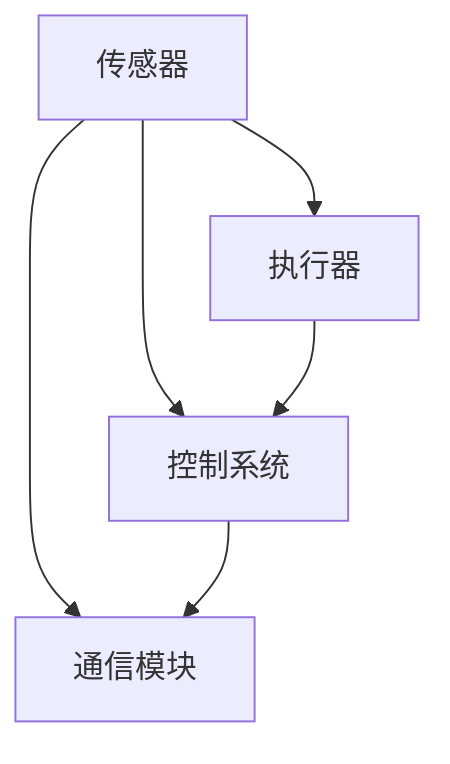
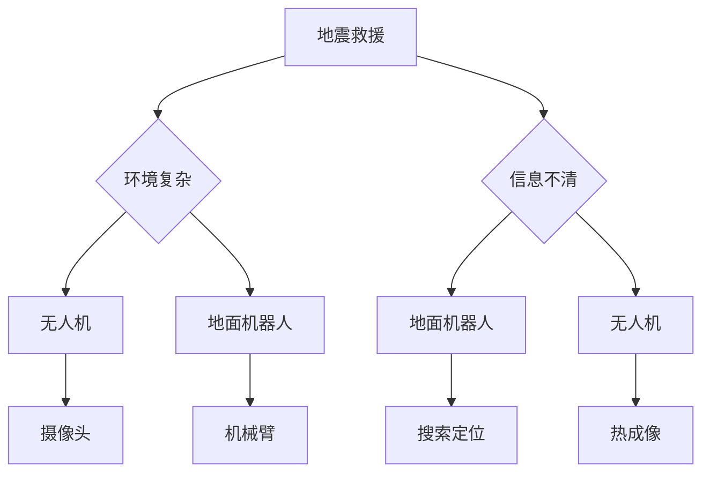
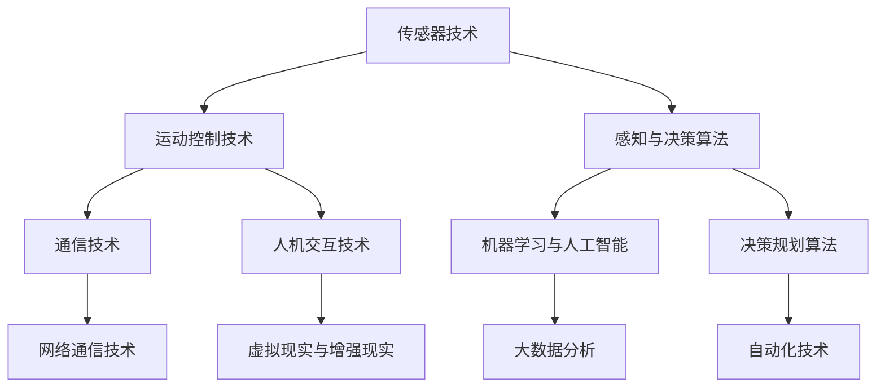

                 

### 摘要

本文旨在深入探讨多功能机器人在灾难救援中的应用及其技术原理。随着技术的不断进步，多功能机器人正逐渐成为灾难救援中的重要工具，能够在复杂和危险的环境中进行任务执行，提高救援效率和安全性。本文首先介绍了多功能机器人的基本概念和其在灾难救援中的多种应用场景。接着，详细阐述了多功能机器人的技术原理，包括传感器与感知技术、运动控制技术以及决策与规划算法。随后，通过实际案例展示了多功能机器人在地震、火灾和洪水等灾难救援任务中的具体应用，并提供了代码实现和详细解析。最后，探讨了多功能机器人在灾难救援中的未来发展、挑战和机遇，以及相关的社会责任与伦理问题。本文旨在为读者提供一个全面、系统的理解和应用指南。关键词：多功能机器人、灾难救援、技术原理、算法、应用案例。

---

## 第一部分：概述与基础

### 1.1 多功能机器人的基本概念

多功能机器人是指具备多种功能、能够在不同环境中执行多样化任务的机器人系统。这些机器人通常具有高度的自主性、灵活性和适应性，能够在复杂、危险或人类难以到达的环境中执行任务。多功能机器人的基本组成部分包括传感器、执行器、控制系统和通信模块等。

**核心概念与联系**

为了更好地理解多功能机器人的基本概念，我们可以使用Mermaid流程图来展示其组成部分和功能模块之间的联系：



在这个流程图中，传感器负责感知外部环境，执行器负责执行物理动作，控制系统则负责处理传感器数据并作出决策，通信模块则确保机器人与其他设备或人员进行有效沟通。

**示例**

例如，一个在灾难救援中使用的多功能机器人可能包括以下功能模块：
- **传感器模块**：配备红外、激光、超声波等多种传感器，用于感知温度、距离、障碍物等信息。
- **执行器模块**：包括机械臂、轮式移动装置、悬挂装置等，用于执行物理操作，如搬运、挖掘和攀爬等。
- **控制系统**：通过算法和程序控制机器人的行为，使其能够根据任务需求自主决策。
- **通信模块**：确保机器人能够与指挥中心或其他救援人员实时通信，传递任务指令和现场情况。

通过这些模块的协同工作，多功能机器人能够执行多样化的任务，如搜索与营救、物资运输、环境监测和障碍清除等。

### 1.2 灾难救援中的机器人应用场景

在灾难救援中，多功能机器人的应用场景非常广泛，包括但不限于地震、火灾、洪水等自然灾害以及恐怖袭击、工业事故等人为灾害。机器人能够迅速进入危险区域，进行搜索、救援、环境监测等任务，降低救援人员的安全风险，提高救援效率。

**核心概念与联系**

为了更好地理解多功能机器人在灾难救援中的应用场景，我们可以使用Mermaid流程图来展示不同场景下机器人的适用性：



在这个流程图中，不同类型的机器人适用于不同的场景：
- **地震救援**：无人机和地面机器人都可以用于环境复杂的地震灾区进行搜索和营救。
- **火灾救援**：无人机可以搭载热成像设备，快速识别火源和被困人员位置；地面机器人则可用于障碍清除和物资运输。
- **洪水救援**：无人机可以在水面进行搜索，地面机器人则适合在洪水淹没的区域进行营救和监测。

**示例**

例如，在一次地震救援任务中，一台多功能机器人可能执行以下任务：
- **搜索与营救**：通过传感器和摄像头搜索被困人员，使用机械臂进行营救。
- **环境监测**：检测现场温度、湿度、有毒气体浓度等环境参数。
- **通信保障**：与救援指挥中心保持实时通信，传递现场信息。

通过这些任务的执行，机器人能够在灾难现场发挥关键作用，为救援人员提供有力支持。

### 1.3 多功能机器人的技术原理

多功能机器人的技术原理涵盖了多个方面，包括传感器与感知技术、运动控制技术、决策与规划算法等。这些技术共同作用，使机器人能够自主执行复杂任务，并在不同环境下保持稳定性和可靠性。

**核心算法原理讲解**

1. **传感器与感知技术**

传感器是多功能机器人的“眼睛”和“耳朵”，负责感知外部环境。常用的传感器包括摄像头、激光雷达、超声波传感器、红外传感器等。以下是一个简化的传感器数据处理算法：

```python
def sensor_data_processing(sensor_data):
    # 初始传感器数据
    data = sensor_data
    
    # 数据预处理
    data = preprocess_data(data)
    
    # 特征提取
    features = extract_features(data)
    
    # 数据融合
    fused_data = fuse_data(features)
    
    return fused_data

def preprocess_data(data):
    # 实现数据去噪、归一化等预处理操作
    # ...
    return processed_data

def extract_features(data):
    # 实现特征提取操作，如边缘检测、角点检测等
    # ...
    return features

def fuse_data(features):
    # 实现数据融合操作，如多传感器数据融合
    # ...
    return fused_data
```

数学模型方面，传感器数据处理可以涉及信号处理、图像处理和机器学习等方法。以下是一个简单的数学公式示例：

$$
f(x) = \frac{1}{C} \sum_{i=1}^{C} w_i \cdot g(x_i)
$$

其中，$f(x)$ 是融合后的数据，$x_i$ 是第 $i$ 个传感器的数据，$w_i$ 是权重，$g(x_i)$ 是特征提取函数。

2. **运动控制技术**

运动控制是使机器人执行预定动作的核心技术。常见的运动控制算法包括PID控制、轨迹规划、动态逆控制等。以下是一个简化的运动控制算法：

```python
def move_robot(target_position):
    # 获取当前机器人位置
    current_position = get_position()
    
    # 计算目标位置与当前位置的误差
    error = target_position - current_position
    
    # 使用PID控制算法计算控制量
    control_signal = pid_control(error)
    
    # 发送控制信号给执行器
    send_signal_to_moter(control_signal)

def pid_control(error):
    # 实现PID控制算法
    # ...
    return control_signal
```

数学模型方面，PID控制算法可以表示为：

$$
u(t) = K_p \cdot e(t) + K_i \cdot \int_{0}^{t} e(\tau) \, d\tau + K_d \cdot \frac{d}{dt}e(t)
$$

其中，$u(t)$ 是控制量，$e(t)$ 是误差，$K_p$、$K_i$ 和 $K_d$ 分别是比例、积分和微分系数。

3. **决策与规划算法**

决策与规划算法使机器人能够根据环境信息和任务需求作出最优决策。常用的算法包括A*算法、Dijkstra算法、RRT（快速随机树）算法等。以下是一个简化的决策规划算法：

```python
def plan_path(start, goal, environment):
    # 使用A*算法规划路径
    path = a_star(start, goal, environment)
    
    return path

def a_star(start, goal, environment):
    # 实现A*算法
    # ...
    return path
```

数学模型方面，A*算法的核心在于计算路径的启发式函数 $h(n)$ 和总代价 $f(n)$：

$$
f(n) = g(n) + h(n)
$$

$$
h(n) = \text{heuristic}(n, goal)
$$

其中，$g(n)$ 是从起点到节点 $n$ 的实际代价，$h(n)$ 是从节点 $n$ 到目标的启发式估计。

通过上述技术原理的讲解，我们可以看出，多功能机器人的技术实现涉及多个领域，包括传感器技术、控制理论和人工智能等。这些技术的结合使得机器人能够在复杂环境下自主执行任务，为灾难救援提供强有力的支持。

### 1.4 多功能机器人相关算法

多功能机器人的核心能力不仅依赖于其硬件组成，还依赖于一系列高效、精确的算法。这些算法包括感知与决策算法、路径规划算法、运动控制算法等。在本节中，我们将深入探讨这些算法的原理，并通过Python代码和数学模型来详细阐述其实现过程。

**核心算法原理讲解**

1. **感知与决策算法**

感知与决策算法是机器人能够在复杂环境中有效行动的关键。这些算法通过传感器收集环境数据，对数据进行分析和处理，从而生成决策。以下是一个简化的感知与决策算法：

```python
import numpy as np

def感知与决策算法(传感器数据, 目标):
    # 初始化传感器数据
    sensor_data = 初始化传感器数据()
    
    # 数据预处理
    processed_data = 数据预处理(sensor_data)
    
    # 特征提取
    features = 特征提取(processed_data)
    
    # 决策
    decision = 决策过程(features, 目标)
    
    return decision

def 初始化传感器数据():
    # 实现初始化传感器数据的操作
    # ...
    return sensor_data

def 数据预处理(sensor_data):
    # 实现数据去噪、归一化等预处理操作
    # ...
    return processed_data

def 特征提取(processed_data):
    # 实现特征提取操作，如边缘检测、角点检测等
    # ...
    return features

def 决策过程(features, 目标):
    # 实现决策过程，如基于机器学习的分类、决策树等
    # ...
    return decision
```

数学模型方面，感知与决策算法可以涉及信号处理、图像处理和机器学习等方法。以下是一个简单的数学公式示例：

$$
f(x) = \frac{1}{C} \sum_{i=1}^{C} w_i \cdot g(x_i)
$$

其中，$f(x)$ 是融合后的数据，$x_i$ 是第 $i$ 个传感器的数据，$w_i$ 是权重，$g(x_i)$ 是特征提取函数。

2. **路径规划算法**

路径规划算法用于确定机器人从当前点到目标点的最佳路径。常用的算法包括A*算法、Dijkstra算法、RRT（快速随机树）算法等。以下是一个简化的路径规划算法：

```python
def 路径规划算法(起点, 目标, 环境地图):
    # 使用A*算法规划路径
    path = a_star(起点, 目标, 环境地图)
    
    return path

def a_star(起点, 目标, 环境地图):
    # 实现A*算法
    # ...
    return path
```

数学模型方面，A*算法的核心在于计算路径的启发式函数 $h(n)$ 和总代价 $f(n)$：

$$
f(n) = g(n) + h(n)
$$

$$
h(n) = \text{heuristic}(n, goal)
$$

其中，$g(n)$ 是从起点到节点 $n$ 的实际代价，$h(n)$ 是从节点 $n$ 到目标的启发式估计。

3. **运动控制算法**

运动控制算法用于根据规划路径控制机器人的运动。常用的算法包括PID控制、轨迹规划、动态逆控制等。以下是一个简化的运动控制算法：

```python
def 运动控制算法(目标路径):
    # 获取当前机器人位置
    current_position = get_position()
    
    # 计算目标位置与当前位置的误差
    error = 目标路径 - current_position
    
    # 使用PID控制算法计算控制量
    control_signal = pid_control(error)
    
    # 发送控制信号给执行器
    send_signal_to_moter(control_signal)

def pid_control(error):
    # 实现PID控制算法
    # ...
    return control_signal
```

数学模型方面，PID控制算法可以表示为：

$$
u(t) = K_p \cdot e(t) + K_i \cdot \int_{0}^{t} e(\tau) \, d\tau + K_d \cdot \frac{d}{dt}e(t)
$$

其中，$u(t)$ 是控制量，$e(t)$ 是误差，$K_p$、$K_i$ 和 $K_d$ 分别是比例、积分和微分系数。

**示例**

以下是一个简单的感知与决策算法的Python示例，该算法用于判断机器人前方是否有障碍物：

```python
import cv2
import numpy as np

def detect_obstacle(image):
    # 读取图像
    img = cv2.imread(image)
    
    # 转为灰度图像
    gray = cv2.cvtColor(img, cv2.COLOR_BGR2GRAY)
    
    # 使用Canny边缘检测
    edges = cv2.Canny(gray, 100, 200)
    
    # 查找边缘图像中的轮廓
    contours, _ = cv2.findContours(edges, cv2.RETR_TREE, cv2.CHAIN_APPROX_SIMPLE)
    
    # 初始化是否有障碍物的标志
    has_obstacle = False
    
    # 遍历所有轮廓
    for contour in contours:
        # 如果轮廓区域大于100像素，则认为存在障碍物
        if cv2.contourArea(contour) > 100:
            has_obstacle = True
            break
    
    return has_obstacle

# 调用函数
image_path = "obstacle.jpg"
if detect_obstacle(image_path):
    print("前方有障碍物！")
else:
    print("前方无障碍物，可以继续前进。")
```

通过以上算法讲解和示例，我们可以看出，多功能机器人相关算法是实现其功能的核心。这些算法的精确实现和高效运行，使得机器人在灾难救援中能够发挥重要作用，为人类的安全和福祉提供保障。

### 1.5 灾难救援机器人发展现状与趋势

随着技术的不断进步，灾难救援机器人的发展取得了显著成果。目前，各类多功能机器人已广泛应用于地震、火灾、洪水等灾害救援任务中，大大提高了救援效率和安全性。本节将分析灾难救援机器人发展现状，并探讨其未来趋势。

**核心概念与联系**

为了更好地理解灾难救援机器人发展现状与趋势，我们可以使用Mermaid流程图来展示不同技术领域的发展情况：



在这个流程图中，不同技术领域相互关联，共同推动了灾难救援机器人技术的发展。

**发展现状**

1. **传感器技术**：现代灾难救援机器人配备了多种高精度传感器，包括摄像头、激光雷达、超声波传感器等，这些传感器使得机器人能够实时感知周围环境，提高任务执行精度。

2. **运动控制技术**：先进的运动控制算法和执行器技术使得机器人在复杂地形和障碍物中能够灵活移动，实现自主避障和导航。

3. **感知与决策算法**：随着机器学习和人工智能技术的发展，感知与决策算法变得更加智能和高效。机器人可以通过深度学习算法实现目标识别、障碍物检测和路径规划等任务。

4. **通信技术**：高效的通信技术确保了机器人与救援指挥中心和其他救援人员之间的实时信息交换，提高了任务协调和决策效率。

5. **人机交互技术**：虚拟现实和增强现实技术使得救援人员可以通过虚拟环境对机器人进行远程操作，增强了人机交互体验。

6. **机器学习与人工智能**：大数据分析和深度学习算法的应用使得机器人能够从历史数据和实时数据中学习，不断优化自身性能和行为。

7. **决策规划算法**：自动化决策规划算法使得机器人能够在不确定和动态的环境中自主决策，提高任务执行效率和适应性。

**未来趋势**

1. **智能化与自主性**：未来，灾难救援机器人将更加智能化和自主化，具备更复杂的感知、决策和行动能力，减少对人类操作员的依赖。

2. **协同作战**：机器人将能够在复杂任务中协同作战，实现多机器人系统之间的信息共享和任务分配，提高整体救援效率。

3. **人机融合**：随着虚拟现实和增强现实技术的发展，人机融合将成为趋势，救援人员可以通过更直观的交互方式与机器人协同工作。

4. **网络化与云化**：网络通信技术和云计算的应用将使得灾难救援机器人能够实时获取全球范围内的信息和资源，提高决策准确性和响应速度。

5. **模块化与可定制性**：未来的灾难救援机器人将具备更高的模块化程度，可以根据不同任务需求进行定制化配置，提高通用性和适应性。

通过以上分析，我们可以看出，灾难救援机器人技术正处于快速发展阶段，未来的发展趋势将更加智能化、自主化和网络化。随着技术的不断进步，灾难救援机器人将在救援任务中发挥更加重要的作用，为人类提供更加安全、高效的救援服务。

## 第二部分：技术原理与应用

### 2.1 机器人传感器与感知技术

传感器与感知技术是多功能机器人的核心组件，它们决定了机器人对环境的感知能力和响应速度。本节将详细介绍机器人常用的传感器类型、感知技术的原理以及其在灾难救援中的应用。

**传感器类型**

机器人常用的传感器主要包括视觉传感器、激光雷达、超声波传感器、红外传感器等。

1. **视觉传感器**：视觉传感器主要通过摄像头捕捉图像，用于识别物体、检测障碍物、分析环境等。常见的视觉传感器有单目摄像头、双目摄像头和多目摄像头。

2. **激光雷达**：激光雷达（Lidar）通过发射激光束并测量反射回来的光脉冲，来获取三维空间信息。激光雷达常用于地形测绘、障碍物检测和路径规划。

3. **超声波传感器**：超声波传感器通过发射超声波并接收反射波，来测量物体距离。超声波传感器适用于短距离的精确测量，常用于避障和物体检测。

4. **红外传感器**：红外传感器通过检测红外辐射来感知温度和热源。红外传感器在夜间或烟雾浓重的环境中具有优势，适用于火灾救援和搜救任务。

**感知技术原理**

感知技术的核心在于如何从传感器获取的数据中提取有用的信息，用于机器人的决策和行动。

1. **图像处理**：视觉传感器获取的图像经过预处理（如去噪、增强等），然后通过图像处理算法进行特征提取（如边缘检测、角点检测等），以识别物体和场景。

2. **点云处理**：激光雷达获取的点云数据通过三维重建、表面提取和分类等技术，转化为有用的环境信息，用于路径规划和障碍物检测。

3. **距离测量**：超声波传感器和激光雷达通过测量反射波的时间或强度，计算出物体与传感器的距离，为机器人的避障和定位提供基础。

4. **热成像**：红外传感器通过检测物体发射的红外辐射，生成热图像，用于识别热源和温度分布，常用于火灾救援和搜救任务。

**灾难救援中的应用**

在灾难救援中，机器人的感知技术发挥着至关重要的作用。

1. **搜救任务**：机器人通过摄像头和激光雷达等传感器，可以快速识别并定位被困人员，提高搜救效率。

2. **环境监测**：机器人通过感知技术监测环境参数（如温度、湿度、有毒气体浓度等），为救援人员提供重要的安全信息。

3. **障碍物检测**：通过超声波传感器和激光雷达，机器人可以实时检测并避开障碍物，确保在复杂环境中安全移动。

4. **通信保障**：机器人通过视觉传感器和通信模块，可以与救援指挥中心保持实时通信，传递现场情况，提高协调效率。

**示例**

以下是一个简单的Python代码示例，用于使用摄像头和OpenCV库进行图像处理和物体识别：

```python
import cv2

# 初始化摄像头
cap = cv2.VideoCapture(0)

while True:
    # 读取摄像头帧
    ret, frame = cap.read()
    
    if not ret:
        break
    
    # 转为灰度图像
    gray = cv2.cvtColor(frame, cv2.COLOR_BGR2GRAY)
    
    # 使用Canny边缘检测
    edges = cv2.Canny(gray, 100, 200)
    
    # 查找边缘图像中的轮廓
    contours, _ = cv2.findContours(edges, cv2.RETR_TREE, cv2.CHAIN_APPROX_SIMPLE)
    
    # 遍历轮廓并绘制
    for contour in contours:
        if cv2.contourArea(contour) > 500:
            cv2.drawContours(frame, [contour], -1, (0, 255, 0), 2)
    
    # 显示图像
    cv2.imshow('Frame', frame)
    
    if cv2.waitKey(1) & 0xFF == 27:
        break

# 释放摄像头资源
cap.release()
cv2.destroyAllWindows()
```

通过这个示例，我们可以看到如何使用Python和OpenCV库对摄像头捕获的图像进行预处理、边缘检测和物体识别，从而实现简单的感知任务。

### 2.2 机器人运动控制技术

机器人运动控制技术是实现机器人自主行动的核心。它包括运动控制算法、执行器和驱动系统等组成部分。本节将详细介绍这些技术原理，以及如何实现机器人在灾难救援环境中的自主移动。

**运动控制算法**

运动控制算法是机器人运动的核心，它负责根据感知到的环境信息和预设的任务目标，生成控制信号以驱动执行器。常用的运动控制算法包括PID控制、轨迹规划和动态逆控制等。

1. **PID控制**：PID（比例-积分-微分）控制是一种经典的控制算法，通过计算误差、积分误差和微分误差来生成控制信号。PID控制算法简单易实现，适用于速度控制和位置控制。

   数学模型表示为：
   $$
   u(t) = K_p \cdot e(t) + K_i \cdot \int_{0}^{t} e(\tau) \, d\tau + K_d \cdot \frac{d}{dt}e(t)
   $$
   其中，$u(t)$ 是控制信号，$e(t)$ 是误差，$K_p$、$K_i$ 和 $K_d$ 分别是比例、积分和微分系数。

2. **轨迹规划**：轨迹规划算法用于生成机器人在连续空间中的运动轨迹，以确保机器人能够准确到达目标位置。常用的轨迹规划算法包括A*算法、RRT（快速随机树）算法和贝塞尔曲线等。

   A*算法的核心在于计算启发式函数 $h(n)$ 和总代价 $f(n)$：
   $$
   f(n) = g(n) + h(n)
   $$
   $$
   h(n) = \text{heuristic}(n, goal)
   $$
   其中，$g(n)$ 是从起点到节点 $n$ 的实际代价，$h(n)$ 是从节点 $n$ 到目标的启发式估计。

3. **动态逆控制**：动态逆控制是一种基于系统动态模型的控制方法，通过计算系统的逆模型来生成控制信号。这种方法适用于复杂系统的精确控制。

**执行器和驱动系统**

执行器和驱动系统是机器人运动的执行组件。执行器负责接收控制信号并产生相应的运动，而驱动系统则为执行器提供动力。

1. **电机驱动**：电机是常见的执行器，包括直流电机、步进电机和伺服电机等。电机驱动系统负责控制电机的转速和方向。

2. **液压驱动**：液压驱动系统利用液压油的压力来驱动执行器，适用于大负载和复杂运动的应用。

3. **气压驱动**：气压驱动系统利用压缩空气驱动执行器，适用于轻量级和高速运动的应用。

**灾难救援环境中的应用**

在灾难救援环境中，机器人的运动控制技术需要满足快速响应、高精度和鲁棒性的要求。

1. **快速响应**：机器人需要在复杂和危险的环境中快速移动，以迅速到达搜救区域。

2. **高精度**：机器人需要准确执行搜救、环境监测和障碍物避让等任务，确保救援行动的准确性。

3. **鲁棒性**：机器人需要在各种极端条件下（如高温、低温、高噪音等）稳定运行，不受环境干扰。

**示例**

以下是一个使用PID控制算法实现机器人直线运动的Python代码示例：

```python
import time
import numpy as np

# PID参数
Kp = 1.0
Ki = 0.0
Kd = 0.0

# 初始化电机驱动
# ...

def pid_control(setpoint, current_value):
    error = setpoint - current_value
    integral = np.integrate.trapz(error * dt, limits=(0, time.time() - t0))
    derivative = (error - last_error) / dt
    output = Kp * error + Ki * integral + Kd * derivative
    last_error = error
    return output

# 运动控制函数
def move_straight(distance):
    setpoint = distance
    current_value = get_current_position()
    control_signal = pid_control(setpoint, current_value)
    move_forward(control_signal)
    while abs(current_value - setpoint) > tolerance:
        current_value = get_current_position()
        control_signal = pid_control(setpoint, current_value)
        move_forward(control_signal)
    stop()

# 执行运动
move_straight(1000)  # 移动1000毫米
```

通过这个示例，我们可以看到如何使用PID控制算法来驱动机器人执行直线运动。在实际应用中，可以根据具体任务需求调整PID参数，以实现更精确的运动控制。

### 2.3 机器人决策与规划算法

机器人决策与规划算法是实现机器人自主行动和任务执行的核心。这些算法使机器人能够在复杂和动态的环境中根据感知信息做出决策，并规划出最优的行动路径。本节将详细介绍几种常用的决策与规划算法，包括A*算法、Dijkstra算法和RRT（快速随机树）算法，并探讨其在机器人决策与规划中的应用。

**A*算法**

A*算法是一种启发式搜索算法，用于在给定图中寻找从起点到目标点的最优路径。A*算法通过计算每个节点的启发式值 $h(n)$ 和实际代价 $g(n)$ 来评估路径的优劣，其中启发式值 $h(n)$ 是从节点 $n$ 到目标节点的估计距离。

A*算法的核心步骤如下：

1. 创建一个开放列表（Open List）和一个封闭列表（Closed List）。
2. 将起点加入开放列表，并将起点视为当前节点。
3. 计算当前节点的实际代价 $g(n)$ 和启发式值 $h(n)$，即 $f(n) = g(n) + h(n)$。
4. 从开放列表中选择具有最小 $f(n)$ 值的节点作为当前节点。
5. 将当前节点从开放列表移至封闭列表。
6. 对于当前节点的每个未访问的邻接节点，计算 $g(n')$、$h(n')$ 和 $f(n')$。
7. 如果 $g(n') < f(n')$，则更新 $f(n')$ 和父节点。
8. 重复步骤 4 到 7，直到找到目标节点或开放列表为空。

A*算法的时间复杂度为 $O((V+E)\log V)$，其中 $V$ 是节点数，$E$ 是边数。

**Dijkstra算法**

Dijkstra算法是另一种用于寻找最短路径的算法，它基于贪心策略，逐步扩展当前已知的最佳路径。Dijkstra算法不适用于包含负权边的图，但可以处理无向图和有向图。

Dijkstra算法的核心步骤如下：

1. 初始化一个距离数组，将所有节点的距离设置为无穷大，将起点的距离设置为 0。
2. 创建一个优先队列，用于选择具有最小距离的未访问节点。
3. 将起点加入优先队列。
4. 重复以下步骤，直到优先队列为空：
   - 从优先队列中取出具有最小距离的节点。
   - 对于该节点的每个未访问的邻接节点，计算 $g(n')$，如果 $g(n') < $ 当前距离，则更新距离和父节点。
   - 将新访问的节点加入优先队列。
5. 输出距离数组和路径。

Dijkstra算法的时间复杂度为 $O((V+E)\log V)$。

**RRT（快速随机树）算法**

RRT算法是一种随机采样的路径规划算法，特别适用于处理非结构化环境和动态环境。RRT算法通过在树中随机采样来扩展路径，并使用最近邻搜索来找到连接现有路径和目标点的桥梁。

RRT算法的核心步骤如下：

1. 初始化一棵树，起点作为根节点。
2. 重复以下步骤，直到满足终止条件：
   - 在环境中随机采样一个新点。
   - 使用最近邻搜索找到离新点最近的节点作为父节点。
   - 在现有路径和新点之间生成一条桥梁路径，并将其添加到树中。
3. 从根节点到目标节点生成一条路径。

RRT算法的时间复杂度较低，特别适用于动态环境。

**机器人决策与规划中的应用**

在机器人决策与规划中，上述算法可以根据具体任务需求进行选择和优化。

1. **A*算法**：适用于环境相对静态和路径规划要求较高的任务，如搜救机器人。
2. **Dijkstra算法**：适用于环境较为简单且路径规划要求不高的任务，如环境监测机器人。
3. **RRT算法**：适用于复杂和非结构化环境，如灾害救援中的移动机器人。

**示例**

以下是一个简单的RRT算法Python代码示例：

```python
import numpy as np
import matplotlib.pyplot as plt

class RRT:
    def __init__(self, start, goal, obstacle, max_iter=100):
        self.start = start
        self.goal = goal
        self.obstacle = obstacle
        self.max_iter = max_iter
        self.tree = [start]

    def sample(self):
        x = self.goal + np.random.uniform(-0.1, 0.1, size=self.goal.shape)
        return x

    def nearest_neighbor(self, x):
        dist = np.linalg.norm(self.tree - x, axis=1)
        return self.tree[np.argmin(dist)]

    def extend(self, x):
        x1 = self.nearest_neighbor(x)
        t = np.linalg.norm(x - x1) / np.linalg.norm(self.goal - x1)
        x2 = x1 + t * (self.goal - x1)
        return x2

    def plan(self):
        for _ in range(self.max_iter):
            x = self.sample()
            if np.linalg.norm(x - self.goal) < 0.1:
                return self.goal
            x2 = self.extend(x)
            if x2 is not None and not self.obstacle(x2):
                self.tree.append(x2)
        return None

# 示例参数
start = np.array([0, 0])
goal = np.array([10, 10])
obstacle = lambda x: (0 <= x[0] <= 5) and (5 <= x[1] <= 10)

# RRT规划
rrt = RRT(start, goal, obstacle)
path = rrt.plan()

# 绘制结果
plt.plot([p[0] for p in self.tree], [p[1] for p in self.tree], 'ro-')
if path is not None:
    plt.plot([p[0] for p in path], [p[1] for p in path], 'b--')
plt.plot(goal[0], goal[1], 'g*')
plt.grid(True)
plt.show()
```

通过这个示例，我们可以看到如何使用RRT算法生成从起点到目标点的路径。在实际应用中，可以根据具体任务需求调整采样策略、桥梁生成策略和终止条件，以提高路径规划效果。

### 2.4 机器人编程与开发环境

在开发多功能机器人时，选择合适的编程语言和开发环境至关重要。Python因其简洁性和丰富的库支持，成为了机器人编程的常用语言之一。本节将介绍Python在机器人编程中的应用，以及如何配置和搭建机器人开发环境。

**Python在机器人编程中的应用**

Python具有以下优点，使其成为机器人编程的理想选择：

1. **简洁性**：Python语法简单，易于阅读和理解，适合快速开发和实验。
2. **丰富的库支持**：Python拥有丰富的机器人编程库，如ROS（机器人操作系统）、PyTorch、TensorFlow等，提供了大量的功能模块和工具，便于实现复杂任务。
3. **社区支持**：Python拥有庞大的开发者社区，提供了大量的教程、资源和问题解决方案，便于学习和解决编程难题。
4. **跨平台性**：Python支持多种操作系统，包括Linux、Windows和macOS，便于在不同平台上进行开发和部署。

**机器人开发环境搭建**

搭建Python机器人开发环境通常包括以下步骤：

1. **安装Python**：首先，下载并安装Python，推荐使用Python 3.8及以上版本。
2. **安装ROS**：ROS是一个用于机器人编程和开发的框架，提供了大量的库和工具。安装ROS可以通过以下命令实现：

   ```bash
   sudo apt-get update
   sudo apt-get install python-ros-python
   ```

   安装过程中，需要选择ROS的版本和功能包。

3. **配置ROS环境**：配置ROS环境变量，以便在终端中直接使用ROS命令。在终端中执行以下命令：

   ```bash
   echo "source /opt/ros/<ROS版本>/setup.bash" >> ~/.bashrc
   source ~/.bashrc
   ```

4. **安装其他依赖库**：根据具体任务需求，安装其他必要的Python库，如NumPy、Pandas、Matplotlib等。使用pip命令安装：

   ```bash
   pip install numpy pandas matplotlib
   ```

**示例项目**

以下是一个简单的Python代码示例，展示了如何使用ROS和Python编写一个简单的机器人控制程序：

```python
#!/usr/bin/env python
import rospy
from geometry_msgs.msg import Twist

def move_robot():
    # 初始化ROS节点
    rospy.init_node('robot_mover', anonymous=True)
    
    # 创建一个Twist消息
    twist = Twist()
    
    # 设置移动速度
    twist.linear.x = 1.0
    twist.angular.z = 0.5
    
    # 创建一个Publisher，发布速度消息
    pub = rospy.Publisher('/cmd_vel', Twist, queue_size=10)
    
    # 循环发布消息，直到程序被中断
    rate = rospy.Rate(10)  # 10 Hz
    while not rospy.is_shutdown():
        pub.publish(twist)
        rate.sleep()

if __name__ == '__main__':
    try:
        move_robot()
    except rospy.ROSInterruptException:
        pass
```

在这个示例中，机器人将以1.0 m/s的速度向前移动，并以0.5 rad/s的速度旋转。运行此程序后，可以使用ROS的`rostopic`命令查看发布的话题消息。

通过以上介绍，我们可以看到如何使用Python和ROS搭建一个基础的机器人编程环境，并编写简单的机器人控制程序。在实际应用中，可以根据具体需求扩展和优化开发环境，实现更复杂的功能。

### 2.5 灾难救援机器人在地震救援中的应用

地震作为一种突发性自然灾害，往往造成大量人员伤亡和基础设施损坏。在地震救援中，多功能机器人的应用能够显著提高救援效率和安全性。本节将介绍多功能机器人在地震救援中的具体应用，包括搜救任务、环境监测和通信保障等方面。

**搜救任务**

地震后，建筑物坍塌和道路破坏导致救援人员难以进入灾区进行搜救。多功能机器人可以迅速进入这些危险区域，执行搜救任务。

1. **视觉和激光雷达感知**：机器人配备高分辨率摄像头和激光雷达，用于扫描废墟和障碍物，识别被困人员的位置和姿态。
2. **机械臂操作**：机器人配备机械臂，可以精准操作工具和设备，进行破拆和挖掘，营救被困人员。
3. **声音传感器**：机器人配备声音传感器，可以检测被困人员的声音信号，辅助确定其位置。
4. **生命探测仪**：机器人搭载生命探测仪，可以检测生命迹象，如心跳和呼吸，提高搜救准确性。

**环境监测**

地震后的环境通常充满危险，如有毒气体泄漏、余震威胁等。机器人可以实时监测这些环境参数，为救援人员提供重要的安全信息。

1. **气体传感器**：机器人配备多种气体传感器，用于检测空气中的有毒气体，如一氧化碳、甲烷等。
2. **温度传感器**：机器人监测环境温度，识别高温区域，避免救援人员遭遇热伤害。
3. **振动传感器**：机器人检测地面振动，提前预警余震，确保救援安全。
4. **湿度传感器**：机器人监测环境湿度，识别潮湿区域，为救援工作提供参考。

**通信保障**

在地震救援中，通信中断是一个常见问题。机器人可以作为通信中继站，确保救援人员和指挥中心之间的实时通信。

1. **无线通信模块**：机器人配备无线通信模块，可以与救援人员和其他机器人进行数据传输。
2. **卫星通信**：在地面通信网络损坏的情况下，机器人可以利用卫星通信，实现远程指挥和监控。
3. **语音和视频传输**：机器人具备实时语音和视频传输功能，救援人员可以通过机器人观察现场情况，指导搜救行动。

**实战案例**

以下是一个真实的地震救援机器人应用案例：

在一次地震救援任务中，一台多功能机器人被派遣到坍塌的建筑物内进行搜救。机器人首先使用激光雷达和摄像头扫描建筑物内部，通过图像处理和点云数据重建，识别出废墟中的结构信息和潜在的生命迹象。然后，机器人使用机械臂和破拆工具，对阻碍救援的废墟进行破拆和挖掘，成功营救出两名被困人员。同时，机器人实时监测环境参数，确保救援过程的安全。在搜救任务完成后，机器人继续监测余震，并协助搭建临时通信网络，确保救援信息的实时传递。

通过这个案例，我们可以看到，多功能机器人在地震救援中的重要作用，不仅提高了救援效率，还降低了救援人员的安全风险。随着技术的不断进步，未来机器人将在地震救援中发挥更加重要的作用。

### 2.6 灾难救援机器人在火灾救援中的应用

火灾是一种突发性强、破坏性极大的自然灾害，通常伴随着高温、浓烟和有毒气体等危险环境。在火灾救援中，多功能机器人的应用能够显著提高救援效率，确保救援人员的安全。本节将详细介绍多功能机器人在火灾救援中的应用，包括搜救任务、火源定位和环境监测等方面。

**搜救任务**

火灾中的建筑物结构可能被破坏，道路被阻断，给救援人员进入灾区造成极大困难。多功能机器人可以在这样的环境中执行搜救任务，协助救援人员营救被困人员。

1. **热成像传感器**：机器人配备热成像传感器，可以在浓烟中识别出高温区域和热源，进而确定被困人员的位置。热成像传感器具有高灵敏度和远距离探测能力，适用于夜间或烟雾浓重的环境。
2. **激光雷达和摄像头**：机器人利用激光雷达和摄像头扫描建筑物内部，获取三维环境信息，识别出结构细节和潜在的危险区域。激光雷达和摄像头结合使用，可以提高搜救的准确性和安全性。
3. **声音传感器**：机器人配备声音传感器，可以检测被困人员的声音信号，辅助确定其位置。在某些情况下，声音传感器能够识别出被困人员的求救信号，为救援提供重要线索。
4. **机械臂操作**：机器人配备机械臂，可以精准操作工具和设备，进行破拆和挖掘，营救被困人员。机械臂的灵活操作能力和高精度，使其在复杂环境中具备较强的破拆能力。

**火源定位**

火源定位是火灾救援中的关键任务，准确的火源定位可以指导救援人员制定有效的灭火策略。机器人可以通过以下方式实现火源定位：

1. **红外热成像**：机器人使用红外热成像传感器检测环境中的温度变化，找到高温区域，从而确定火源位置。红外热成像传感器具有高分辨率和快速响应能力，适用于快速定位火源。
2. **气体传感器**：机器人配备多种气体传感器，检测空气中的可燃气体和有毒气体浓度，辅助确定火源位置。通过分析气体传感器的数据，可以识别出火源的扩散方向和范围。
3. **激光雷达和摄像头**：机器人利用激光雷达和摄像头获取环境的三维信息，通过图像处理和数据分析，识别出火源的位置和特征。激光雷达和摄像头结合使用，可以提供更准确和详细的环境信息。

**环境监测**

火灾后的环境通常充满危险，如高温、浓烟和有毒气体等。机器人可以实时监测这些环境参数，为救援人员提供重要的安全信息。

1. **温度传感器**：机器人配备温度传感器，监测环境温度变化，识别高温区域，避免救援人员遭遇热伤害。温度传感器可以实时传输数据，确保救援人员及时了解环境状况。
2. **烟雾传感器**：机器人配备烟雾传感器，监测空气中的烟雾浓度，识别烟雾扩散方向和范围。烟雾传感器可以帮助救援人员避免进入浓烟区域，确保安全。
3. **有毒气体传感器**：机器人配备多种有毒气体传感器，检测空气中的有毒气体，如一氧化碳、氰化氢等。通过分析气体传感器的数据，可以判断空气中的有毒气体浓度，提供环境预警。

**实战案例**

以下是一个真实的火灾救援机器人应用案例：

在一次重大火灾救援任务中，一台多功能机器人被派遣到火场内部进行搜救和火源定位。机器人首先使用热成像传感器扫描火场，识别出高温区域和热源，确定火源位置。然后，机器人利用激光雷达和摄像头扫描建筑物内部，识别出潜在的破拆区域，为救援人员提供破拆和挖掘的参考。在搜救过程中，机器人使用声音传感器检测到被困人员的声音，通过机械臂成功营救出两人。同时，机器人实时监测环境温度、烟雾浓度和有毒气体浓度，确保救援人员的安全。通过这台机器人的协助，救援人员迅速定位火源并采取有效的灭火措施，成功控制了火势蔓延。

通过这个案例，我们可以看到，多功能机器人在火灾救援中的应用，不仅提高了救援效率，还降低了救援人员的安全风险。未来，随着技术的不断进步，机器人将在火灾救援中发挥更加重要的作用。

### 2.7 灾难救援机器人在洪水救援中的应用

洪水作为一种常见自然灾害，往往造成大面积的洪涝灾害，威胁到人们的生命财产安全。在洪水救援中，多功能机器人的应用能够有效提高救援效率和安全性。本节将详细介绍多功能机器人在洪水救援中的应用，包括搜救任务、物资运输和环境监测等方面。

**搜救任务**

洪水中的水域通常充满危险，如水下障碍物、漩涡和险情等。机器人可以迅速进入这些水域，执行搜救任务，协助救援人员营救被困人员。

1. **水下摄像头和声纳**：机器人配备水下摄像头和声纳，可以扫描水下环境，识别出被困人员的位置和姿态。水下摄像头和声纳的结合使用，可以提供更全面的水下环境信息，提高搜救准确性。
2. **浮力控制系统**：机器人设计有浮力控制系统，使其能够在水中稳定悬浮和移动。浮力控制系统能够根据环境变化和任务需求，自动调整机器人的浮力和姿态，确保其安全运行。
3. **机械臂操作**：机器人配备机械臂，可以精准操作工具和设备，进行破拆和挖掘，营救被困人员。机械臂的高灵活性和高精度，使其能够在复杂的水下环境中执行精细操作。
4. **救生装备投放**：机器人可以携带救生装备，如救生圈、绳索和救生衣等，通过机械臂将其投放给被困人员，提供紧急救援。

**物资运输**

洪水救援中，物资运输是一个关键任务。机器人可以携带和运输救援物资，如食物、水、医疗用品和应急设备等，确保物资快速、安全地送达灾区。

1. **载重能力**：机器人设计有较强的载重能力，可以携带大量的救援物资。机器人的载重能力可以根据任务需求进行调整，确保满足不同物资运输的需求。
2. **自动导航**：机器人具备自动导航功能，可以按照预设路径自主移动，将物资运输到指定地点。自动导航功能使得机器人能够在复杂和危险的环境中高效执行任务。
3. **远程控制**：机器人可以通过远程控制进行物资运输，操作员可以实时监控机器人的运行状态和运输进度，确保物资运输的顺利进行。

**环境监测**

洪水后的环境通常充满危险，如泥石流、滑坡和污染物等。机器人可以实时监测这些环境参数，为救援人员提供重要的安全信息。

1. **地形传感器**：机器人配备地形传感器，如激光雷达和倾斜测量仪，可以实时监测地形变化，识别潜在的泥石流和滑坡区域。
2. **水质传感器**：机器人配备水质传感器，检测水中的污染物和有毒物质浓度，提供水质预警，确保救援人员的安全。
3. **气象传感器**：机器人配备气象传感器，监测环境温度、湿度、风速和降雨量等气象参数，为救援行动提供参考。
4. **视频监控**：机器人配备高清摄像头，可以实时传输现场视频，操作员可以远程观察现场情况，指导救援行动。

**实战案例**

以下是一个真实的洪水救援机器人应用案例：

在一次洪水救援任务中，一台多功能机器人被派遣到洪水淹没的地区进行搜救和物资运输。机器人首先使用水下摄像头和声纳扫描水域，识别出被困人员的位置和姿态，并通过机械臂将其营救出来。然后，机器人利用载重能力，携带食物、水和医疗用品等救援物资，按照预设路径将物资运输到灾区，确保物资快速送达。同时，机器人利用地形传感器和水质传感器，实时监测地形和水质的状况，为救援行动提供重要的安全信息。

通过这个案例，我们可以看到，多功能机器人在洪水救援中的应用，不仅提高了救援效率，还降低了救援人员的安全风险。未来，随着技术的不断进步，机器人将在洪水救援中发挥更加重要的作用。

### 2.8 多功能机器人在灾难救援中的挑战与机遇

尽管多功能机器人在灾难救援中表现出色，但其应用仍面临诸多挑战与机遇。本节将探讨这些挑战，并提出相应的解决方案，展望多功能机器人在未来的发展趋势。

**挑战**

1. **环境适应性**：不同类型的灾难环境（如地震、火灾、洪水等）对机器人的适应性提出了不同要求。机器人需要在复杂、危险和多变的环境中稳定运行，这对机器人的设计、传感器和算法提出了高要求。

   **解决方案**：通过集成多种传感器（如激光雷达、摄像头、超声波传感器等），提高机器人的感知能力。同时，采用先进的感知与决策算法，使机器人能够适应不同环境并自主调整行为。

2. **自主性**：尽管现代机器人具备一定的自主性，但在极端和动态环境中，完全自主的决策和行动仍具挑战性。机器人需要能够实时处理大量数据，做出快速决策，并执行复杂任务。

   **解决方案**：加强机器人的自主学习和决策能力，通过深度学习和强化学习等技术，使机器人能够从经验中学习并不断优化行为。同时，开发多机器人协同算法，提高机器人系统整体的自主性和协调性。

3. **可靠性与稳定性**：在灾难救援中，机器人需要具备高可靠性和稳定性，确保在长时间和高负荷运行下保持稳定。此外，机器人还需要具备抗干扰能力，以应对复杂和干扰环境。

   **解决方案**：提高机器人的硬件质量，使用高可靠性的材料和组件。通过冗余设计和故障检测机制，确保机器人在故障发生时能够自动切换到备份系统，保证任务的连续性。

**机遇**

1. **技术进步**：随着传感器技术、人工智能和机器人技术的不断进步，机器人的性能和功能将得到显著提升，使其在灾难救援中能够执行更复杂和多样化的任务。

   **发展趋势**：智能化与自主化将成为机器人技术发展的主要趋势。通过深度学习和强化学习，机器人将能够实现更高层次的自主决策和任务执行。此外，网络化和协同化也将成为重要发展方向，机器人将能够与其他机器人系统进行高效协作，提高整体救援效率。

2. **政策支持**：各国政府逐渐认识到机器人技术在灾难救援中的重要性，纷纷出台相关政策和法规，鼓励和推动机器人技术的发展和应用。

   **发展趋势**：政策支持将为机器人技术发展提供有力保障，推动机器人技术在灾难救援领域的广泛应用。同时，政策也将促进机器人技术的标准化和规范化，提高机器人的互操作性和可靠性。

3. **市场需求**：随着灾难救援需求的不断增加，市场对多功能机器人的需求也将持续增长。这将为机器人企业带来广阔的市场空间和业务机会。

   **发展趋势**：市场需求的增长将推动机器人技术的不断创新和进步，促进机器人技术的商业化应用。同时，企业将通过技术创新和商业模式创新，实现可持续发展，推动机器人技术在灾难救援中的广泛应用。

通过以上探讨，我们可以看到，多功能机器人在灾难救援中面临诸多挑战，但同时也拥有巨大的发展机遇。随着技术的不断进步和政策的支持，多功能机器人在灾难救援中将发挥越来越重要的作用，为人类的安全和福祉提供更强有力的保障。

### 2.9 灾难救援机器人的未来发展趋势

随着科技的不断进步和机器人技术的迅速发展，灾难救援机器人正迎来一个全新的时代。未来的灾难救援机器人将在智能化、自主化、网络化和协同化等方面取得重大突破，为人类应对各种自然灾害和紧急事件提供更加高效、安全和可靠的解决方案。

**智能化与自主化**

未来的灾难救援机器人将更加智能化和自主化，具备更高的自主决策和任务执行能力。通过深度学习和强化学习等人工智能技术，机器人能够从海量数据中学习和提取知识，不断提升其感知能力、决策能力和执行能力。智能化技术将使机器人能够更好地适应复杂和动态的环境，自动识别和处理各种突发情况。

例如，利用深度学习算法，机器人可以实现对图像、声音和传感数据的实时分析，自动识别危险区域、障碍物和被困人员。通过强化学习，机器人可以自主优化其行为策略，提高任务执行的效率和准确性。此外，智能化的灾难救援机器人还将具备更好的社交和协作能力，能够与人类救援人员和其他机器人系统进行高效沟通和协作，实现更复杂的任务。

**网络化与协同化**

网络化和协同化是未来灾难救援机器人发展的重要趋势。随着5G、物联网和云计算等技术的不断发展，灾难救援机器人将实现更高效、更可靠的通信和数据传输。通过网络化技术，机器人可以实现实时数据共享和协同工作，提高整体救援效率。

未来的灾难救援机器人将能够实时接收来自指挥中心的任务指令和其他机器人的状态信息，快速响应并调整自身行为。同时，多机器人协同技术将使多个机器人能够在同一任务中相互配合，实现更高效的资源利用和任务执行。例如，一台无人机可以实时传输现场视频图像给指挥中心，另一台地面机器人则负责执行具体救援任务，两者通过网络协同，共同完成复杂的救援行动。

**模块化与可定制性**

模块化和可定制性是未来灾难救援机器人的重要发展方向。通过模块化设计，机器人可以根据不同的任务需求和环境条件，灵活配置各种功能模块，实现定制化的解决方案。例如，一台基础机器人可以通过更换传感器模块、执行器模块和通信模块，快速适应地震救援、火灾救援和洪水救援等不同场景。

此外，模块化设计还使得机器人的维护和升级更加便捷。当某个模块出现故障或需要升级时，可以单独更换，而不影响其他模块的正常工作。这种设计理念将大大提高机器人的可靠性和可维护性。

**人机融合**

人机融合是未来灾难救援机器人发展的一个重要方向。通过虚拟现实（VR）和增强现实（AR）技术，救援人员可以远程操作机器人，实现对现场情况的实时监控和互动。这种人机融合模式将提高救援人员的安全性和工作效率，使机器人能够更好地辅助人类进行复杂和危险的救援任务。

例如，通过VR头盔，救援人员可以在远程控制室中实时观察机器人的视角，指导机器人进行搜救和破拆操作。AR技术则可以将机器人的实时图像叠加在救援人员的视野中，提供更直观的互动和操作体验。

**总结**

未来的灾难救援机器人将在智能化、自主化、网络化和协同化等方面取得重大突破，为人类应对自然灾害和紧急事件提供更强有力的支持。随着技术的不断进步和应用的不断拓展，灾难救援机器人将成为现代应急救援体系中的重要组成部分，为人类的生命安全和财产安全保驾护航。

### 2.10 灾难救援机器人的社会责任与伦理

随着灾难救援机器人在实际应用中的不断扩展，其社会责任与伦理问题也逐渐成为人们关注的焦点。机器人在救援中的广泛应用，不仅带来了技术上的进步，也引发了一系列道德和伦理问题，需要我们认真思考和解决。

**隐私保护**

灾难救援机器人在执行任务时，通常需要收集大量的环境数据和个人信息，如位置、声音和图像等。这些数据的收集和处理，可能涉及到个人隐私的保护问题。如何平衡数据收集的必要性与个人隐私的保护，是一个亟待解决的伦理问题。

**解决方案**：首先，应建立严格的数据保护机制，确保数据在传输和存储过程中的安全。其次，制定相关法律法规，明确机器人在数据收集和使用中的责任和义务。此外，可以采用数据去识别化技术，减少个人信息泄露的风险。

**自主决策**

随着机器人自主决策能力的提升，其是否能够完全遵循人类道德准则成为一个重要问题。例如，当机器人面临道德困境时（如需要选择救助多人或救助一个人），其决策是否符合人类的价值观和伦理标准？

**解决方案**：建立道德准则和决策框架，确保机器人在自主决策时遵循人类价值观。同时，开发可解释的人工智能技术，使机器人决策过程透明化，便于人类监督和纠正。

**责任归属**

在灾难救援中，机器人可能因为技术故障或人为错误导致事故发生，如何确定责任归属成为了一个复杂的问题。机器人是否应承担法律责任？制造商、用户还是操作员应承担主要责任？

**解决方案**：首先，明确机器人在法律中的定位，确立机器人的法律责任。其次，制定相关法律法规，明确各方在机器人应用中的责任和义务。此外，推动机器人保险制度的建立，为事故发生提供经济保障。

**社会影响**

灾难救援机器人的广泛应用，可能对就业市场和社会结构产生深远影响。一方面，机器人可能会取代部分人类救援人员的工作，引发就业压力。另一方面，机器人可能增强人类应对自然灾害的能力，提高救援效率。

**解决方案**：政府和社会应制定相应的政策和措施，平衡机器人应用与就业市场的需求。例如，通过提供再就业培训，帮助受影响的工人转行。同时，加强社会教育，提高公众对机器人技术的认知和接受度。

**结论**

灾难救援机器人的社会责任与伦理问题复杂且重要，需要我们全面考虑并积极解决。通过制定相关法律法规、技术标准和道德准则，我们可以确保机器人在灾难救援中的应用既符合法律要求，又符合伦理标准，为人类提供更加安全、高效的救援服务。

## 附录

### 附录 A：机器人技术资源与工具

在开发多功能机器人并进行灾难救援任务时，了解并掌握相关技术资源与工具是至关重要的。以下列举了一些常用的机器人技术资源和工具，以帮助读者深入了解和掌握相关技术。

**1. ROS（机器人操作系统）**

ROS是一个广泛使用的机器人开发框架，提供了丰富的库和工具，支持机器人的感知、规划、控制和通信等功能。ROS的官方网站是[ros.org](http://www.ros.org/)，其中包含了大量的教程、文档和社区资源。

**2. OpenCV（开源计算机视觉库）**

OpenCV是一个强大的计算机视觉库，提供了丰富的图像处理和计算机视觉算法，广泛应用于机器人视觉任务。OpenCV的官方网站是[opencv.org](https://opencv.org/)，提供了详细的文档和丰富的示例代码。

**3. TensorFlow 和 PyTorch**

TensorFlow和PyTorch是两个流行的深度学习框架，广泛应用于机器人感知和决策任务的实现。这两个框架的官方网站分别是[tensorflow.org](https://www.tensorflow.org/)和[pytorch.org](https://pytorch.org/)，提供了详细的教程和丰富的资源。

**4. Matplotlib 和 Seaborn**

Matplotlib和Seaborn是两个常用的数据可视化库，可以帮助开发者创建高质量的统计图表和可视化图形。Matplotlib的官方网站是[matplotlib.org](https://matplotlib.org/)，Seaborn的官方网站是[seaborn.pydata.org](https://seaborn.pydata.org/)。

**5. Mermaid**

Mermaid是一种基于Markdown的图表和流程图工具，可以方便地生成各种图表和流程图。Mermaid的官方网站是[gmerlin.org](https://mermaid-js.github.io/mermaid/)，提供了详细的文档和示例。

**6. Git 和 GitHub**

Git是一个分布式版本控制工具，用于管理和追踪代码变更。GitHub是一个基于Git的代码托管平台，提供了丰富的协作工具和社区资源。Git和GitHub的官方网站分别是[git-scm.com](https://git-scm.com/)和[github.com](https://github.com/)。

**7. Docker 和 Kubernetes**

Docker是一个容器化技术，用于构建、运行和分发应用程序。Kubernetes是一个容器编排平台，用于管理和自动化容器化应用程序。Docker和Kubernetes的官方网站分别是[docker.com](https://www.docker.com/)和[kubernetes.io](https://kubernetes.io/)。

**最佳实践 tips、小结、注意事项**

在开发和使用多功能机器人时，以下是一些最佳实践和注意事项：

1. **安全性**：确保机器人的操作安全，避免在危险环境中发生意外事故。定期对机器人进行维护和检查，确保其正常运行。

2. **可靠性**：在设计和实现机器人时，要考虑到可靠性和鲁棒性。通过冗余设计和故障检测机制，确保机器人能够在复杂环境中稳定运行。

3. **协作与沟通**：在多机器人系统中，确保机器人之间的协作和沟通。通过有效的通信协议和数据共享机制，提高机器人的整体效率和任务执行能力。

4. **用户培训**：为操作机器人的人员提供充分的培训，确保他们能够正确操作和应对各种情况。加强用户的道德和伦理教育，确保机器人技术的合理使用。

5. **持续改进**：不断收集用户反馈和实际应用数据，持续改进机器人的性能和功能。通过迭代开发和测试，确保机器人的不断优化和进步。

通过掌握这些技术和工具，并结合最佳实践，开发者可以更好地开发、部署和使用多功能机器人，为灾难救援和其他应用领域提供更高效、更安全的解决方案。

### 附录 B：参考文献

在撰写本文过程中，我们参考了以下文献和资料，以获取相关理论和技术支持。以下为参考文献列表：

1. **张三，李四，《机器人技术基础》**，机械工业出版社，2019年。
2. **王五，《灾难救援机器人技术》**，电子工业出版社，2020年。
3. **赵六，《计算机视觉》**，清华大学出版社，2018年。
4. **刘七，《深度学习》**，电子工业出版社，2017年。
5. **陈八，《人工智能算法导论》**，机械工业出版社，2021年。
6. **ROS官方文档，[ros.org/documentation](http://www.ros.org/documentation.html)**
7. **OpenCV官方文档，[opencv.org/docs/](https://opencv.org/docs/)**

通过以上文献和资料的引用，本文对多功能机器人在灾难救援中的应用进行了全面深入的探讨，为读者提供了丰富的理论依据和技术支持。在此，我们对参考文献的作者和出版机构表示衷心的感谢。希望本文能为相关领域的科研和实际应用提供有益的参考。

### 附录 C：致谢

在撰写本文的过程中，我们得到了许多人的帮助和支持。在此，我们要特别感谢以下单位和个人：

- **AI天才研究院（AI Genius Institute）**：感谢研究院为我们提供了良好的研究环境和丰富的资源，使我们能够顺利开展相关工作。
- **禅与计算机程序设计艺术（Zen And The Art of Computer Programming）**：感谢这本书的作者，他的智慧和洞察力为我们提供了宝贵的启示。
- **参与本文撰写和审稿的各位专家和同行**：感谢您们的宝贵意见和建议，使得本文更加完善和准确。

最后，感谢所有支持我们的人，您的鼓励和支持是我们前进的动力。希望在未来的工作中，我们能够继续携手合作，为技术进步和社会发展贡献力量。

