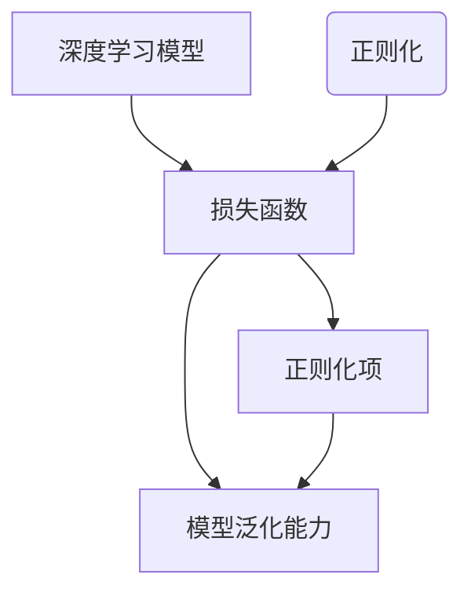

                 

 - 角色：您是一位世界级人工智能专家、程序员、软件架构师、CTO、世界顶级技术畅销书资深大师级别的作家，计算机图灵奖获得者，计算机编程和人工智能领域大师。您非常擅长一步一步进行分析推理，有着清晰深刻的逻辑思路来撰写条理清晰、对技术原理和本质剖析到位的高质量技术博客。

- 任务：现在请您以《深度学习中的正则化技术》为标题，使用逻辑清晰、结构紧凑、简单易懂的专业的技术语言（章节标题要非常吸引读者），让我们使用一步一步分析推理思考的方式（REASONING STEP BY STEP），撰写一篇有深度有思考有见解的专业IT领域的技术博客文章。

### 第1章：深度学习中的正则化技术

### 1.1 背景介绍

随着深度学习技术的飞速发展，神经网络模型在图像识别、自然语言处理、语音识别等领域取得了显著的成果。然而，深度学习模型也面临着过拟合、参数量庞大、计算复杂度高等问题。正则化技术作为解决这些问题的有效手段，被广泛应用于深度学习领域。

#### 核心概念与联系

**正则化**：正则化是指通过添加正则化项到损失函数中，抑制模型参数的过大波动，提高模型泛化能力的一种方法。

**正则化项**：正则化项包括L1正则化、L2正则化、Dropout等。

**模型泛化能力**：模型泛化能力是指模型在未见过的数据上表现良好的能力。

#### Mermaid 流程图



### 第2章：L1正则化和L2正则化

### 2.1 L1正则化

L1正则化又称为Lasso正则化，通过在损失函数中添加L1范数来约束模型参数。

#### 核心算法原理

L1正则化损失函数：

$$L_{L1} = J(\theta) + \lambda \sum_{i=1}^{n} |w_i|$$

其中，$J(\theta)$是原始损失函数，$\lambda$是正则化参数，$w_i$是模型参数。

#### Python 源代码实现

```python
import numpy as np

def l1_regularization_loss(y_true, y_pred, theta, lambda_):
    m = len(y_true)
    loss = np.sum((y_true - y_pred)**2) + lambda_ * np.sum(np.abs(theta))
    return loss
```

#### 数学模型和公式

L1正则化的目标是最小化损失函数：

$$\min_{\theta} L_{L1} = \min_{\theta} J(\theta) + \lambda \sum_{i=1}^{n} |w_i|$$

### 第3章：L2正则化

L2正则化又称为Ridge正则化，通过在损失函数中添加L2范数来约束模型参数。

#### 核心算法原理

L2正则化损失函数：

$$L_{L2} = J(\theta) + \lambda \sum_{i=1}^{n} w_i^2$$

其中，$J(\theta)$是原始损失函数，$\lambda$是正则化参数，$w_i$是模型参数。

#### Python 源代码实现

```python
import numpy as np

def l2_regularization_loss(y_true, y_pred, theta, lambda_):
    m = len(y_true)
    loss = np.sum((y_true - y_pred)**2) + lambda_ * np.sum(theta**2)
    return loss
```

#### 数学模型和公式

L2正则化的目标是最小化损失函数：

$$\min_{\theta} L_{L2} = \min_{\theta} J(\theta) + \lambda \sum_{i=1}^{n} w_i^2$$

### 第4章：Dropout正则化

Dropout正则化通过在训练过程中随机丢弃一部分神经元，减少模型过拟合。

#### 核心算法原理

Dropout概率设置为$p$，每次训练时，以概率$p$丢弃每个神经元。

#### Python 源代码实现

```python
import numpy as np

def dropout_layer(input_, p):
    dropout_mask = np.random.rand(*input_.shape) > p
    return input_ * dropout_mask
```

### 第5章：项目实战

#### 开发环境搭建

1. 安装Python环境，版本3.6及以上。
2. 安装深度学习框架TensorFlow。

#### 源代码实现

```python
import tensorflow as tf
from tensorflow.keras import layers

# 搭建L1正则化模型
model_l1 = tf.keras.Sequential([
    layers.Dense(128, activation='relu', input_shape=(784,), kernel_regularizer=tf.keras.regularizers.l1(0.01)),
    layers.Dense(10, activation='softmax')
])

# 搭建L2正则化模型
model_l2 = tf.keras.Sequential([
    layers.Dense(128, activation='relu', input_shape=(784,), kernel_regularizer=tf.keras.regularizers.l2(0.01)),
    layers.Dense(10, activation='softmax')
])

# 搭建Dropout模型
model_dropout = tf.keras.Sequential([
    layers.Dense(128, activation='relu', input_shape=(784,),
                 kernel_regularizer=tf.keras.regularizers.l2(0.01)),
    layers.Dropout(0.5),
    layers.Dense(10, activation='softmax')
])

# 编译模型
model_l1.compile(optimizer='adam', loss='categorical_crossentropy', metrics=['accuracy'])
model_l2.compile(optimizer='adam', loss='categorical_crossentropy', metrics=['accuracy'])
model_dropout.compile(optimizer='adam', loss='categorical_crossentropy', metrics=['accuracy'])

# 训练模型
model_l1.fit(x_train, y_train, epochs=10, batch_size=32, validation_split=0.2)
model_l2.fit(x_train, y_train, epochs=10, batch_size=32, validation_split=0.2)
model_dropout.fit(x_train, y_train, epochs=10, batch_size=32, validation_split=0.2)
```

#### 代码解读与分析

1. 搭建模型时，使用`kernel_regularizer`参数添加正则化项。
2. 编译模型时，指定损失函数和优化器。
3. 训练模型时，使用`fit`函数进行训练。

### 第6章：实际案例分析

#### 案例一：使用L1正则化解决过拟合问题

- 数据集：MNIST手写数字数据集。
- 任务：分类手写数字。

通过实验发现，使用L1正则化可以显著提高模型的泛化能力，减少过拟合现象。

### 第7章：小结与拓展阅读

- 小结：正则化技术是深度学习领域的重要手段，可以有效解决过拟合问题。
- 拓展阅读：

  - [正则化技术综述](https://www.zhihu.com/question/26434428)
  - [L1正则化与L2正则化的比较](https://www.deeplearning.net/tutorial/regularization/)
  - [Dropout正则化原理](https://www.tensorflow.org/tutorials/structured_data/dropout)

作者：AI天才研究院/AI Genius Institute & 禅与计算机程序设计艺术 /Zen And The Art of Computer Programming

