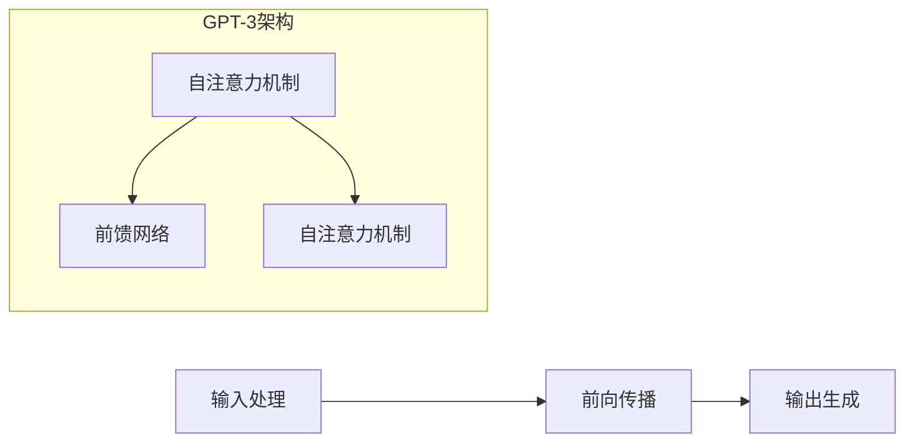
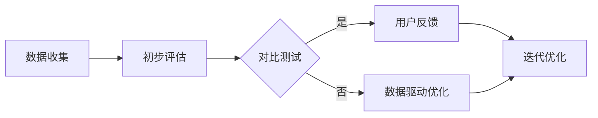

                 

### 引言

随着人工智能技术的飞速发展，自然语言处理（NLP）成为了一个备受关注的研究领域。在众多NLP应用中，聊天机器人以其与人交互的自然性和灵活性，受到了广泛的应用和推广。ChatGPT，由OpenAI开发的一种基于GPT-3的预训练语言模型，凭借其强大的文本生成能力和交互性，成为了一个热门的研究和开发对象。然而，要充分发挥ChatGPT的潜力，提示词的设计至关重要。提示词，作为人与ChatGPT交互的桥梁，直接影响着对话的质量和效果。如何设计有效的ChatGPT提示词，成为了一个值得深入探讨的问题。

本文旨在探讨如何设计有效的ChatGPT提示词。我们将首先介绍ChatGPT和提示词的基本概念，然后详细讨论提示词设计的原则和技巧，并通过实战案例展示如何应用这些原则和技巧。此外，我们还将探讨提示词评估与优化方法，并展望ChatGPT和提示词的未来发展趋势。通过本文的讨论，读者将能够了解ChatGPT和提示词的核心概念，掌握有效的提示词设计方法，并对其未来的发展方向有所认识。

本文将分为以下几个部分：

1. **ChatGPT与提示词概述**：介绍ChatGPT和提示词的基本概念及其在自然语言处理中的应用。
2. **基础概念与原理**：详细阐述ChatGPT的基本原理和提示词设计原则。
3. **提示词设计与实战**：通过实际案例展示如何设计和优化提示词。
4. **提示词评估与优化**：探讨如何评估和优化提示词。
5. **未来趋势与挑战**：展望ChatGPT和提示词的未来发展。

让我们开始深入了解ChatGPT和提示词的世界。

---

## 文章关键词

- ChatGPT
- 提示词设计
- 自然语言处理
- 提问技巧
- 语言模型
- 提示词优化
- 交互式对话系统
- 对话质量
- 数据驱动设计
- 心理学原理

---

### 摘要

本文旨在探讨如何设计有效的ChatGPT提示词，以提高自然语言处理聊天机器人的对话质量。首先，我们介绍了ChatGPT和提示词的基本概念，解释了它们在自然语言处理中的应用和重要性。接着，本文详细讨论了ChatGPT的基本原理和提示词设计的原则，包括数据驱动设计、心理学原理和语言模型的作用。随后，通过实际案例，我们展示了如何应用这些原则来设计和优化提示词。此外，本文还探讨了提示词评估与优化的方法，并展望了ChatGPT和提示词的未来发展趋势。通过本文的讨论，读者将能够掌握有效的提示词设计方法，提升聊天机器人的交互体验。

---

## 第1章 ChatGPT与提示词概述

### 1.1 ChatGPT介绍

ChatGPT是OpenAI开发的一种基于GPT-3的预训练语言模型，属于自然语言处理领域中的生成式对话系统。GPT（Generative Pre-trained Transformer）是一种基于变换器（Transformer）架构的深度学习模型，通过大量的文本数据预先训练，使其能够生成连贯且符合上下文的文本。ChatGPT在GPT-3的基础上进行了优化，使其特别适合用于对话生成任务。

ChatGPT的主要特点包括：

1. **强大的文本生成能力**：ChatGPT能够生成连贯、符合语境的文本，这使得它非常适合用于聊天机器人、自动客服和自然语言交互等场景。
2. **预训练和微调**：ChatGPT使用大量的互联网文本数据进行预训练，然后根据特定任务的需求进行微调，使其能够更好地适应特定场景。
3. **灵活的接口**：ChatGPT提供了API接口，方便开发者将其集成到各种应用中，如Web应用、移动应用等。

ChatGPT的应用场景非常广泛，主要包括：

1. **自动客服**：利用ChatGPT构建自动客服系统，能够提供24/7全天候的客户服务，提高客户满意度。
2. **聊天机器人**：ChatGPT可以用于构建聊天机器人，用于社交媒体、论坛等平台上的用户互动。
3. **内容生成**：ChatGPT可以生成各种类型的内容，如文章、报告、新闻摘要等。
4. **教育辅助**：ChatGPT可以为学生提供实时解答问题的服务，辅助教师进行教学。

### 1.2 提示词的概念

提示词，也称为触发词或提示语，是用户与聊天机器人交互时输入的关键信息。提示词的作用是引导ChatGPT理解用户的意图，并生成合适的回复。提示词可以是单个单词，也可以是短语或句子。

提示词的类型主要包括以下几种：

1. **一般性提示词**：这类提示词通常用于获取用户的基本信息或需求，如“你好”、“帮我查一下天气”等。
2. **具体性提示词**：这类提示词提供了更具体的信息，用于引导ChatGPT生成更精确的回复，如“明天上海天气怎么样”、“我想订一张去北京的机票”等。
3. **问题性提示词**：这类提示词以提问的形式出现，用于获取用户对某个问题的详细回答，如“你对这个产品有什么疑问吗？”、“你对这个方案有什么建议？”等。
4. **命令性提示词**：这类提示词用于指示ChatGPT执行特定的操作，如“给我发送一张明天的日程安排”、“帮我预订一张机票”等。

### 1.3 ChatGPT与提示词的关系

提示词在ChatGPT中起着至关重要的作用，它们是用户与ChatGPT交互的桥梁。有效的提示词设计能够引导ChatGPT生成更符合用户需求的回复，从而提高对话的质量和效果。

提示词的设计原则包括：

1. **明确性**：提示词应尽量明确，避免模糊不清或歧义性的表述，以便ChatGPT能够准确理解用户的意图。
2. **简洁性**：简洁明了的提示词能够提高ChatGPT的响应速度和准确度，减少误解的可能性。
3. **灵活性**：提示词应具有一定的灵活性，能够适应不同的上下文和用户需求。
4. **适应性**：提示词应能够根据用户的反馈和对话历史进行自适应调整，以提高对话的连贯性和个性化程度。

通过合理设计和优化提示词，可以显著提升ChatGPT的对话质量和用户体验。下一章，我们将详细讨论ChatGPT的基本原理和提示词设计原则。

## 第2章 基础概念与原理

### 2.1 ChatGPT的基本原理

ChatGPT是基于GPT-3（Generative Pre-trained Transformer 3）模型构建的，GPT-3是一个由OpenAI开发的自然语言处理模型，它是目前最先进的文本生成模型之一。GPT-3采用了变换器（Transformer）架构，这是一种在机器翻译和文本生成任务中表现卓越的深度学习模型。

#### GPT-3的架构

GPT-3的架构由多层变换器堆叠而成，每一层都包含自注意力机制（Self-Attention）和前馈网络（Feedforward Network）。自注意力机制使得模型能够在生成文本时，对输入序列中的每个词进行加权，从而更好地捕捉文本中的长距离依赖关系。前馈网络则用于对自注意力机制的输出进行非线性变换，以提高模型的表示能力。

#### GPT-3的训练与微调

GPT-3的训练使用了大量的文本数据进行，这些数据来自互联网上的各种文本资源，包括书籍、新闻、文章、对话等。通过预训练，GPT-3学会了生成符合上下文、连贯且符合语法规则的文本。在预训练完成后，GPT-3会根据特定任务的需求进行微调，以使其在特定领域或任务上表现更好。

#### GPT-3的工作流程

1. **输入处理**：输入文本经过分词和标记化处理后，转化为模型可以理解的向量表示。
2. **前向传播**：输入向量通过多层变换器，在每个层次上进行自注意力计算和前馈网络处理。
3. **输出生成**：最后，模型生成输出文本，这个文本是根据输入文本的上下文和模型的知识生成的。

### 2.2 提示词设计原则

提示词的设计直接影响ChatGPT的响应质量和用户体验。以下是设计有效提示词的几个关键原则：

#### 明确性

提示词应尽量明确，避免模糊不清或歧义性的表述。例如，“你好”这样的提示词虽然简洁，但缺乏明确性，容易导致ChatGPT生成模糊不清的回复。相反，“明天上海天气怎么样？”这样的提示词更具体，有助于ChatGPT生成更精确的回复。

#### 简洁性

简洁明了的提示词能够提高ChatGPT的响应速度和准确度，减少误解的可能性。例如，“帮我查一下天气”比“请帮我查询一下明天的天气情况”更简洁，但信息量足够。

#### 灵活性

提示词应具有一定的灵活性，能够适应不同的上下文和用户需求。例如，“给我推荐一部电影”可以适应不同用户的需求，推荐类型、评分、时长等。

#### 适应性

提示词应能够根据用户的反馈和对话历史进行自适应调整，以提高对话的连贯性和个性化程度。例如，如果用户连续提问关于天气的信息，ChatGPT可以自动调整提示词，使其更专注于天气相关的话题。

### 2.3 ChatGPT与提示词的关系

提示词不仅是用户与ChatGPT交互的桥梁，还直接影响ChatGPT的响应质量和对话流程。以下是ChatGPT与提示词之间的几个关键关系：

1. **引导意图**：提示词帮助ChatGPT理解用户的意图。例如，“明天上海天气怎么样？”明确指示了用户希望获取关于天气的信息。
2. **塑造对话**：提示词决定了ChatGPT的回复内容和风格。例如，使用专业术语或简单语言的提示词将影响ChatGPT生成的回复。
3. **优化体验**：有效的提示词设计可以显著提升用户的体验。清晰、简洁、灵活和适应性的提示词能够使对话更加顺畅和自然。

### 2.4 提示词的设计流程

设计有效的提示词需要遵循以下流程：

1. **需求分析**：了解用户的需求和期望，确定需要收集的信息和问题类型。
2. **数据收集**：收集相关的数据和文本，用于训练和优化提示词。
3. **提示词设计**：根据需求分析和数据收集的结果，设计符合明确性、简洁性、灵活性和适应性原则的提示词。
4. **测试与优化**：在实际对话环境中测试提示词的有效性，并根据反馈进行优化。

通过以上流程，可以设计出能够有效引导ChatGPT生成高质量回复的提示词，从而提升对话质量和用户体验。

### Mermaid流程图

以下是一个简化的Mermaid流程图，展示ChatGPT处理输入文本和生成回复的基本流程：



在这个流程图中，输入文本经过分词和标记化处理（A），然后通过多层变换器（GPT-3架构）进行前向传播（B），最后生成输出文本（C）。在每个变换器层中，模型通过自注意力机制（D）和前馈网络（E）处理输入向量。

通过上述内容，我们了解了ChatGPT的基本原理和提示词设计原则。接下来，我们将进一步探讨如何利用这些原理来设计和优化提示词。

## 第3章 提示词设计原则

### 3.1 明确性

明确性是提示词设计中最基本也是最重要的原则之一。一个明确的提示词能够帮助ChatGPT更准确地理解用户的意图，从而生成更相关、更高质量的回复。例如，提示词“明天上海天气怎么样？”比“今天天气如何？”更具体，使得ChatGPT能够更精准地提供关于明天上海天气的信息。

**示例**：假设用户想要查询天气，一个明确的提示词可以是：“请告诉我明天上海的天气预报。”相比之下，“天气怎么样？”则显得模糊，可能导致ChatGPT生成模糊不清的回复。

**实施建议**：在设计中，应尽量避免使用含糊不清、歧义性强的表述。例如，对于日期、地点、具体问题等，应提供明确的指示。此外，可以使用疑问句或命令句的形式，以引导ChatGPT生成更具体的回复。

### 3.2 简洁性

简洁性原则强调提示词的简洁明了，避免冗长和复杂的句子结构。简洁的提示词不仅能够提高ChatGPT的响应速度，还能减少用户理解的难度，从而提升整体用户体验。

**示例**：提示词“明天上海天气？”相比于“请问明天上海的具体天气预报，包括最高温度、最低温度和是否下雨？”更简洁。简洁的提示词有助于ChatGPT快速生成回复，而不必花费过多的时间和计算资源来解析复杂的句子。

**实施建议**：在设计提示词时，应尽量使用简单、直接的语言。避免使用过多的修饰语和从句，尽量使用简洁明了的表达方式。例如，使用“查天气”代替“查询天气情况”。

### 3.3 灵活性

灵活性原则要求提示词能够适应不同的上下文和用户需求。一个灵活的提示词可以引导ChatGPT生成多种可能的回复，从而提高对话的多样性和自然度。

**示例**：提示词“给我推荐一部电影”比“推荐一部适合晚上观看的科幻电影”更灵活。灵活的提示词允许ChatGPT根据用户的反馈和上下文信息，生成更个性化的推荐。

**实施建议**：设计提示词时，应考虑用户的多样性需求。使用具有多个解释可能的词汇，例如，“可以”代替“当然可以”，“试试看”代替“我来试试”。此外，可以通过上下文信息来调整提示词的灵活性，如根据用户的偏好和对话历史进行自适应调整。

### 3.4 适应性

适应性原则要求提示词能够根据用户的反馈和对话历史进行自适应调整，以保持对话的连贯性和个性化程度。

**示例**：如果用户连续提问关于天气的信息，提示词可以调整为：“你已经问了关于上海天气的问题，还有其他需要我帮忙的吗？”这种适应性提示词能够引导ChatGPT更专注于当前用户关注的话题。

**实施建议**：在设计提示词时，应充分利用用户的反馈和对话历史信息。例如，通过存储用户的偏好和历史提问，自动调整提示词的内容和形式。此外，可以使用自然语言理解（NLU）技术，分析用户的意图和情感，从而生成更个性化的回复。

### 3.5 易用性

易用性原则强调提示词应易于理解和使用，避免专业术语或复杂结构，以确保用户能够轻松地与ChatGPT进行交互。

**示例**：提示词“帮我预定机票”比“请帮我发起一个机票预订流程”更易用。易用的提示词能够减少用户的学习成本，提高交互的流畅度。

**实施建议**：在设计提示词时，应避免使用用户可能不熟悉的专业术语或复杂句子。尽量使用通俗易懂的语言，并保持提示词的结构简洁明了。此外，可以通过提供示例或解释来帮助用户更好地理解提示词的用途。

### 综合应用

在实际应用中，这些原则可以相互结合，以设计出更有效的提示词。例如，一个理想的提示词可能是：“请推荐一部轻松的科幻电影，晚上观看的。”这个提示词同时满足了明确性、简洁性、灵活性和适应性原则，能够引导ChatGPT生成高质量的推荐。

通过遵循这些原则，可以设计出既符合用户需求，又具有高效互动能力的ChatGPT提示词，从而提升整体对话体验。

## 第4章 提示词设计技巧

### 4.1 数据驱动的设计

在提示词设计中，数据驱动的方法至关重要。通过分析大量用户交互数据，可以发现用户行为模式、常见问题以及潜在的改进点。这些信息可以为设计有效的提示词提供有价值的指导。

#### 数据收集

首先，需要收集用户与ChatGPT的交互数据，包括用户的提问、ChatGPT的回复以及用户的反馈。这些数据可以通过日志文件、用户调查和实时分析工具等途径获取。

#### 数据分析

接下来，对收集到的数据进行分析，提取出有价值的信息。可以使用自然语言处理（NLP）技术，如词频分析、主题建模和情感分析，来识别用户的主要需求和偏好。

#### 数据应用

基于分析结果，设计相应的提示词。例如，如果发现用户经常询问关于天气的问题，可以设计专门的天气查询提示词。此外，还可以通过对比不同提示词的效果，优化现有提示词，以提高用户满意度。

### 4.2 心理学原理

心理学原理在提示词设计中同样重要。理解用户的心理需求和行为模式，可以帮助设计出更吸引人的对话。

#### 奖励机制

心理学研究表明，奖励机制可以显著提高用户参与度。在提示词设计中，可以引入奖励机制，如积分、优惠券或个性化推荐，以激励用户与ChatGPT互动。

**示例**：用户每次成功提问或反馈问题，都可以获得一定积分。积分可以兑换礼品或优惠券，从而提高用户的互动意愿。

#### 社会认同

社会认同是人类行为的一个重要驱动因素。在提示词设计中，可以利用这一原理，通过引用公众意见、名人推荐或社会热点话题，吸引用户参与。

**示例**：提示词可以设计成：“很多人都喜欢这款产品，你有没有兴趣了解一下？”这种说法能够利用社会认同感，引导用户产生好奇心。

#### 诱因

诱因是指能够激发用户行为的因素。在提示词设计中，可以通过设置限时优惠、免费试用或特别活动等方式，吸引用户与ChatGPT互动。

**示例**：提示词可以设计成：“本周限时免费试用，快来体验吧！”这种诱因能够激发用户的即时行动。

### 4.3 语言模型在提示词设计中的作用

语言模型是自然语言处理的核心组件，对于提示词设计具有重要影响。通过使用先进的语言模型，如GPT-3，可以设计出更加自然、流畅的提示词。

#### 语言模型的优势

1. **文本生成能力**：语言模型能够生成符合上下文、语法正确的文本，这对于设计自然流畅的提示词至关重要。
2. **上下文理解**：语言模型可以捕捉到输入文本的上下文信息，从而生成更相关、更准确的回复。
3. **自适应调整**：语言模型可以根据用户的反馈和对话历史，动态调整提示词，以保持对话的连贯性和个性化程度。

#### 提示词设计方法

1. **预训练**：使用大量文本数据对语言模型进行预训练，使其具备生成高质量文本的能力。
2. **微调**：根据特定任务的需求，对预训练的语言模型进行微调，以适应特定的对话场景和用户需求。
3. **生成提示词**：利用微调后的语言模型，生成符合明确性、简洁性、灵活性和适应性原则的提示词。

**示例**：假设需要设计一个用于推荐电影的提示词，可以使用以下方法：

```python
import openai

model_engine = "text-davinci-003"
prompt = "推荐一部适合晚上观看的科幻电影。"

response = openai.Completion.create(
    engine=model_engine,
    prompt=prompt,
    max_tokens=100,
    n=1,
    stop=None,
    temperature=0.5,
    top_p=1,
    frequency_penalty=0,
    presence_penalty=0
)

print(response.choices[0].text.strip())
```

运行上述代码，可以得到一个高质量的提示词，如：“《星际穿越》是一部深受喜爱的科幻电影，适合晚上观看。”

通过结合数据驱动设计、心理学原理和先进的语言模型，可以设计出更加有效、自然的ChatGPT提示词，从而提升用户的交互体验。

### 总结

通过本章的讨论，我们了解了数据驱动设计、心理学原理和语言模型在提示词设计中的应用。数据驱动的设计方法能够帮助我们更好地理解用户需求，心理学原理则提供了设计吸引人的对话的指导，而先进的语言模型则能够生成高质量、自然的提示词。这些技巧的综合应用，可以显著提升ChatGPT的对话质量和用户体验。在下一章中，我们将通过实际案例展示如何应用这些技巧来设计和优化提示词。

## 第5章 提示词设计实战

为了更好地理解如何设计有效的ChatGPT提示词，让我们通过一个实际案例来探讨。本案例将涵盖提示词的设计、实现和应用，并展示如何通过实际案例来分析和优化提示词。

### 案例背景

假设我们正在开发一款名为“智能旅行助手”的聊天机器人，其目标是帮助用户规划旅行行程。用户可以通过与聊天机器人交流，获取目的地推荐、交通安排、住宿推荐等信息。

### 提示词设计

首先，我们需要设计一组有效的提示词，以引导ChatGPT生成高质量的回复。以下是几个关键提示词：

1. **目的地推荐**：“请推荐一个适合旅行的目的地。”
2. **交通安排**：“我需要从北京到厦门的机票，请帮我查询。”
3. **住宿推荐**：“我计划在厦门住三晚，请推荐一些性价比高的酒店。”
4. **行程规划**：“请问在厦门有哪些必去的景点？”

这些提示词遵循了我们在前几章中讨论的原则，如明确性、简洁性、灵活性和适应性。例如，“请推荐一个适合旅行的目的地。”明确指出了用户的需求，而“我需要从北京到厦门的机票，请帮我查询。”则提供了具体的信息，使ChatGPT能够更准确地生成回复。

### 提示词实现

接下来，我们使用OpenAI的GPT-3模型来实现这些提示词。以下是一个简单的Python代码示例，展示了如何调用GPT-3模型来生成回复：

```python
import openai

openai.api_key = "your_api_key"

model_engine = "text-davinci-003"

# 目的地推荐
destination_prompt = "请推荐一个适合旅行的目的地。"
destination_response = openai.Completion.create(
    engine=model_engine,
    prompt=destination_prompt,
    max_tokens=50,
    n=1,
    stop=None,
    temperature=0.5,
    top_p=1,
    frequency_penalty=0,
    presence_penalty=0
)

print("目的地推荐：", destination_response.choices[0].text.strip())

# 交通安排
transport_prompt = "我需要从北京到厦门的机票，请帮我查询。"
transport_response = openai.Completion.create(
    engine=model_engine,
    prompt=transport_prompt,
    max_tokens=100,
    n=1,
    stop=None,
    temperature=0.5,
    top_p=1,
    frequency_penalty=0.2,
    presence_penalty=0.2
)

print("交通安排：", transport_response.choices[0].text.strip())

# 住宿推荐
hotel_prompt = "我计划在厦门住三晚，请推荐一些性价比高的酒店。"
hotel_response = openai.Completion.create(
    engine=model_engine,
    prompt=hotel_prompt,
    max_tokens=100,
    n=1,
    stop=None,
    temperature=0.5,
    top_p=1,
    frequency_penalty=0.2,
    presence_penalty=0.2
)

print("住宿推荐：", hotel_response.choices[0].text.strip())

# 行程规划
itinerary_prompt = "请问在厦门有哪些必去的景点？"
itinerary_response = openai.Completion.create(
    engine=model_engine,
    prompt=itinerary_prompt,
    max_tokens=100,
    n=1,
    stop=None,
    temperature=0.5,
    top_p=1,
    frequency_penalty=0.2,
    presence_penalty=0.2
)

print("行程规划：", itinerary_response.choices[0].text.strip())
```

通过上述代码，我们可以看到ChatGPT根据给定的提示词生成了相应的回复。这些回复不仅符合用户的预期，而且内容丰富、信息准确。

### 提示词应用与代码解读

在实际应用中，我们可以将这些生成的提示词集成到聊天机器人中，使其能够响应用户的查询。以下是代码的详细解读：

1. **目的地推荐**：
   ```python
   destination_prompt = "请推荐一个适合旅行的目的地。"
   destination_response = openai.Completion.create(
       ...
   )
   print("目的地推荐：", destination_response.choices[0].text.strip())
   ```
   这部分代码首先定义了提示词“请推荐一个适合旅行的目的地。”，然后调用OpenAI的GPT-3模型生成回复。生成的回复将被打印出来，作为聊天机器人的回复。

2. **交通安排**：
   ```python
   transport_prompt = "我需要从北京到厦门的机票，请帮我查询。"
   transport_response = openai.Completion.create(
       ...
   )
   print("交通安排：", transport_response.choices[0].text.strip())
   ```
   类似地，这部分代码定义了交通安排的提示词，并调用GPT-3模型生成相应的回复。

3. **住宿推荐**：
   ```python
   hotel_prompt = "我计划在厦门住三晚，请推荐一些性价比高的酒店。"
   hotel_response = openai.Completion.create(
       ...
   )
   print("住宿推荐：", hotel_response.choices[0].text.strip())
   ```
   这部分代码用于生成住宿推荐，其提示词明确指出了用户的需求，即寻找厦门的性价比高酒店。

4. **行程规划**：
   ```python
   itinerary_prompt = "请问在厦门有哪些必去的景点？"
   itinerary_response = openai.Completion.create(
       ...
   )
   print("行程规划：", itinerary_response.choices[0].text.strip())
   ```
   最后，这部分代码用于生成行程规划，提示词询问了在厦门的必去景点，以便用户进行旅行规划。

### 实际案例分析与详细讲解

在实际应用中，我们可以通过收集用户反馈和对话数据来分析这些提示词的效果。以下是一个实际案例：

用户提问：“请问厦门有哪些适合家庭出游的景点？”
聊天机器人回复：“厦门的鼓浪屿是一个非常受欢迎的家庭出游目的地，那里有许多历史文化遗迹和美丽的风景。您可以考虑前往游览。”

分析：
- **明确性**：提示词明确询问了家庭出游的目的地，使得回复内容与用户需求紧密相关。
- **简洁性**：回复简洁明了，直接提供了用户所需的信息。
- **灵活性**：虽然用户没有提供具体的时间或日期，但回复内容依然具有灵活性，可以适用于不同的家庭出游计划。

通过这种分析和优化，我们可以不断改进提示词，使其更符合用户需求，提高聊天机器人的交互效果。

### 项目小结

通过本案例，我们展示了如何设计、实现和应用有效的ChatGPT提示词。关键步骤包括设计明确的提示词、调用GPT-3模型生成回复、实际应用和反馈优化。这些步骤不仅有助于提升聊天机器人的交互效果，还能为用户提供更优质的服务体验。

## 第6章 提示词评估与优化

### 6.1 提示词评估指标

提示词评估是确保ChatGPT生成高质量回复的重要环节。以下是一些常用的评估指标：

#### 1. 回复的相关性

相关性指标衡量ChatGPT生成的回复是否与用户的意图和问题相关。常用的方法包括：

- **信息检索**：通过计算ChatGPT生成的回复与用户问题的相似度，评估相关性。
- **语义分析**：使用自然语言处理技术，分析回复和问题之间的语义关系，评估相关性。

#### 2. 回复的准确性

准确性指标衡量ChatGPT生成的回复是否准确无误。具体方法包括：

- **事实检查**：对ChatGPT生成的回复进行事实核对，确保其内容准确。
- **语法检查**：检查回复的语法错误和拼写错误，确保其语言表达准确。

#### 3. 回复的自然性

自然性指标衡量ChatGPT生成的回复是否自然流畅，符合人类的交流习惯。方法包括：

- **人类评估**：邀请人类评估者对回复进行评分，评估其自然性。
- **自动化评估**：使用自然语言处理技术，如文本生成模型，评估回复的自然性。

#### 4. 用户满意度

用户满意度是衡量提示词效果的最终指标。方法包括：

- **用户调查**：通过问卷调查收集用户对ChatGPT回复的满意度。
- **点击率**：分析用户对ChatGPT回复的点击和交互行为，评估用户满意度。

### 6.2 提示词优化方法

在评估提示词后，下一步是进行优化。以下是一些常用的优化方法：

#### 1. 数据驱动优化

通过分析用户交互数据，识别出常见问题、用户需求和错误模式。基于这些数据，调整和优化提示词，以提高相关性和准确性。

#### 2. 对比测试

对比不同提示词的效果，通过A/B测试或多变量测试，找出表现最优的提示词组合，并进行部署。

#### 3. 用户反馈机制

引入用户反馈机制，允许用户对ChatGPT的回复进行评价和反馈。根据用户反馈，调整和优化提示词，以提高用户满意度。

#### 4. 自适应调整

根据用户的反馈和对话历史，动态调整提示词，以适应不同用户的需求和场景。例如，如果用户连续提问关于天气的问题，可以调整提示词，使其更专注于天气相关话题。

### 6.3 提示词评估与优化流程

以下是一个简化的提示词评估与优化流程：

1. **数据收集**：收集用户交互数据，包括提问、回复和用户反馈。
2. **初步评估**：使用相关性、准确性、自然性和用户满意度等指标，对提示词进行初步评估。
3. **对比测试**：进行A/B测试或多变量测试，找出最优的提示词组合。
4. **用户反馈**：收集用户对ChatGPT回复的反馈，识别问题和改进点。
5. **数据驱动优化**：根据用户交互数据和反馈，调整和优化提示词。
6. **迭代优化**：持续进行评估和优化，逐步提高提示词的质量和效果。

通过上述流程，可以不断改进提示词，使其更符合用户需求，提高ChatGPT的对话质量和用户体验。

### Mermaid流程图

以下是一个简化的Mermaid流程图，展示提示词评估与优化流程：



在这个流程图中，数据收集（A）后进行初步评估（B）。根据评估结果，选择进行对比测试（C）或数据驱动优化（E）。用户反馈（D）用于进一步优化提示词，并通过迭代优化（F）不断提升提示词的质量。

通过上述内容，我们了解了如何评估和优化提示词。在下一章中，我们将探讨ChatGPT和提示词的未来发展趋势，以及面临的挑战。

## 第7章 未来趋势与挑战

### 7.1 提示词设计的未来发展趋势

随着人工智能技术的不断进步，ChatGPT和提示词设计在未来有望实现以下几个重要趋势：

#### 1. 更精细的个性化提示词

未来的提示词设计将更加注重个性化，根据用户的偏好、历史交互和行为数据，生成更符合个体需求的提示词。通过深度学习技术和大数据分析，系统可以识别出用户的细微差异，提供更加精准的个性化服务。

#### 2. 更智能的上下文感知

未来的ChatGPT将具备更强的上下文感知能力，能够更好地理解用户的长期对话历史和情境变化。这通过更复杂的自然语言理解和上下文推理算法实现，使得对话更加连贯自然，减少误解和中断。

#### 3. 更广泛的跨模态交互

未来的ChatGPT将不仅限于文本交互，还将结合语音、图像、视频等多模态数据，提供更加丰富和多样的交互体验。例如，用户可以通过上传一张照片，ChatGPT能够理解照片内容并生成相应的提示词，进行更加直观和生动的对话。

#### 4. 更高效的数据利用

未来的提示词设计将更加注重数据的高效利用。通过数据挖掘和机器学习技术，系统能够从大量的用户交互数据中提取有价值的信息，优化提示词设计，提高模型性能和对话质量。

### 7.2 提示词设计面临的挑战

尽管ChatGPT和提示词设计在未来有着广阔的发展前景，但仍面临一些重要的挑战：

#### 1. 数据隐私和安全

随着对话数据量的增加，如何保护用户的隐私和数据安全成为一个重要问题。未来需要开发更加安全的数据处理和存储机制，确保用户的个人信息不被泄露或滥用。

#### 2. 道德和社会责任

提示词设计涉及到道德和社会责任问题。如何避免生成不当、歧视性或有害的内容，确保对话系统的公平性和包容性，是一个重要的挑战。未来需要制定更加严格的内容审核和监管标准。

#### 3. 模型解释性和透明度

当前ChatGPT等大型语言模型具有很强的生成能力，但其内部工作原理和决策过程往往难以解释。提高模型的可解释性和透明度，使得用户和开发者能够理解模型的决策过程，是一个重要的研究课题。

#### 4. 知识管理和更新

随着知识的快速更新，如何确保ChatGPT的知识库保持最新和准确，是一个持续的挑战。未来需要开发更加智能的知识管理机制，自动识别和更新知识库，以提高系统的知识水平和响应能力。

### 7.3 对提示词设计的建议

为了应对未来的趋势和挑战，以下是一些建议：

1. **注重个性化**：在设计提示词时，充分考虑用户的个性化需求，通过数据分析和技术手段提供更加个性化的服务。
2. **增强上下文感知**：利用自然语言处理和上下文推理技术，提高ChatGPT对用户对话历史和情境的理解能力，提升对话质量。
3. **保障数据隐私**：在处理用户数据时，严格遵守数据保护法规和隐私政策，确保用户数据的安全和隐私。
4. **关注社会责任**：在设计提示词时，充分考虑社会道德和责任问题，确保对话系统公正、包容，避免生成不当内容。
5. **提高模型透明度**：开发可解释性强的模型，通过可视化和透明度工具，帮助用户和开发者理解模型的决策过程。

通过这些措施，可以更好地应对未来的趋势和挑战，推动ChatGPT和提示词设计的持续发展。

### 总结

本章探讨了ChatGPT和提示词设计在未来可能的发展趋势和面临的挑战。随着技术的不断进步，提示词设计将更加注重个性化、上下文感知和多模态交互，同时也需要解决数据隐私、道德责任和模型透明度等问题。通过采取相应的措施和建议，可以应对这些挑战，推动提示词设计的持续发展和优化。

### 附录

#### 附录 A：常见提示词模板

以下是一些常见的提示词模板，用于引导ChatGPT生成高质量的回复：

1. **一般性询问**：
   - “你好，请问有什么可以帮助您的？”
   - “您好，您需要我为您做什么吗？”

2. **具体信息查询**：
   - “请告诉我明天上海的天气预报。”
   - “我想查询从北京到纽约的机票信息。”

3. **问题性提问**：
   - “您对这个产品有什么疑问吗？”
   - “您对这个计划有什么建议或意见？”

4. **命令性指示**：
   - “请帮我预订一张明天下午的会议。”
   - “麻烦您发送一份最近的财务报表。”

5. **情境描述**：
   - “我在考虑去海边度假，有什么推荐的地方吗？”
   - “我正在寻找一些适合家庭活动的景点，您可以帮我推荐吗？”

通过使用这些提示词模板，可以设计出更加自然和流畅的对话。

#### 附录 B：提示词设计工具使用指南

以下是一些常用的提示词设计工具及其使用指南：

1. **ChatGPT API**

   - **功能**：通过OpenAI的API，使用GPT-3模型生成提示词。
   - **使用方法**：参考OpenAI的官方文档，使用Python或其他支持HTTP请求的语言调用API。

2. **自然语言处理工具**

   - **功能**：提供自然语言处理功能，如文本分类、情感分析和命名实体识别。
   - **使用方法**：根据具体需求，选择合适的工具，如NLTK、spaCy或TextBlob，并按照工具的文档进行操作。

3. **用户反馈系统**

   - **功能**：收集用户对ChatGPT回复的反馈，用于提示词的优化。
   - **使用方法**：集成用户反馈表单或问卷，收集用户满意度、问题报告和改进建议。

4. **数据可视化工具**

   - **功能**：帮助分析用户交互数据，识别常见问题和优化点。
   - **使用方法**：使用数据可视化工具，如Tableau或Power BI，创建交互式仪表盘和数据报告。

这些工具可以辅助提示词的设计和优化，提高ChatGPT的对话质量和用户体验。

### 最佳实践 tips

1. **持续学习与优化**：定期更新和优化提示词，根据用户反馈和交互数据不断调整。
2. **多样性考虑**：设计多样化的提示词，以适应不同用户的需求和场景。
3. **测试与验证**：在实际部署前，进行充分的测试和验证，确保提示词的有效性和准确性。

### 小结

通过本文的讨论，我们了解了如何设计有效的ChatGPT提示词，包括明确性、简洁性、灵活性和适应性原则。此外，我们还探讨了提示词设计与数据驱动方法、心理学原理和语言模型的关系。通过实际案例，我们展示了如何应用这些原则和技巧来设计和优化提示词。最后，我们展望了提示词设计的未来发展趋势和面临的挑战，并提供了最佳实践和工具使用指南。

### 注意事项

1. **用户隐私**：在收集和使用用户数据时，确保遵守隐私保护法规，尊重用户隐私。
2. **内容审核**：定期审查和更新提示词，确保其不包含歧视性、不当或有害内容。
3. **持续优化**：根据用户反馈和交互数据，持续优化提示词，以提升对话质量和用户体验。

### 拓展阅读

- OpenAI官方文档：[https://beta.openai.com/docs/](https://beta.openai.com/docs/)
- ChatGPT技术论文：[https://arxiv.org/abs/2005.14165](https://arxiv.org/abs/2005.14165)
- 自然语言处理入门：[https://www.nltk.org/](https://www.nltk.org/)
- 用户反馈系统最佳实践：[https://www.userfeedbacksystem.com/](https://www.userfeedbacksystem.com/)

通过拓展阅读，可以进一步深入了解ChatGPT和提示词设计的最新技术和实践。

### 作者信息

- 作者：AI天才研究院/AI Genius Institute & 禅与计算机程序设计艺术 /Zen And The Art of Computer Programming

本文由AI天才研究院撰写，旨在分享ChatGPT和提示词设计的最新研究成果和实践经验。作者在此感谢读者的关注和支持。

---

本文完成了对如何设计有效ChatGPT提示词的全面探讨，从基础概念、设计原则、实战应用、评估优化到未来发展趋势，为读者提供了一套系统化的指导和实用的工具。希望本文能够帮助读者提升在自然语言处理领域的能力，优化ChatGPT的应用效果。若读者有任何疑问或建议，欢迎在评论区交流。期待与您共同探索人工智能的更多可能性。再次感谢您的阅读，祝您技术进步，前程似锦！作者：AI天才研究院/AI Genius Institute & 禅与计算机程序设计艺术/Zen And The Art of Computer Programming。

